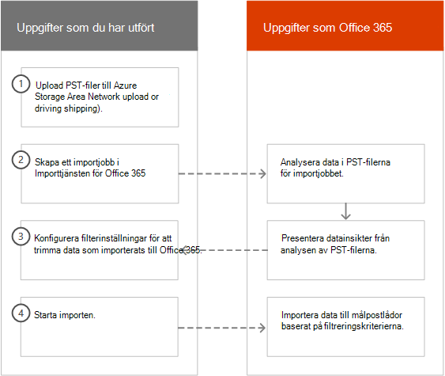
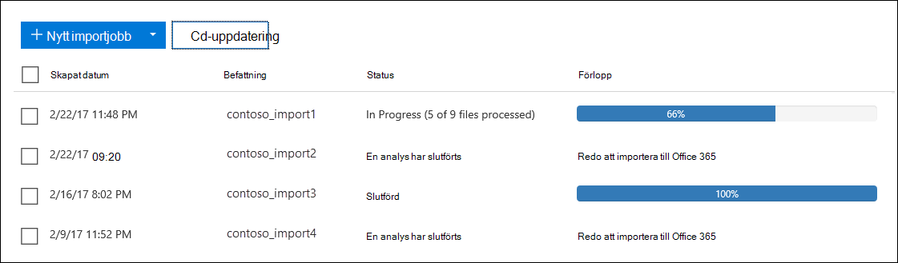
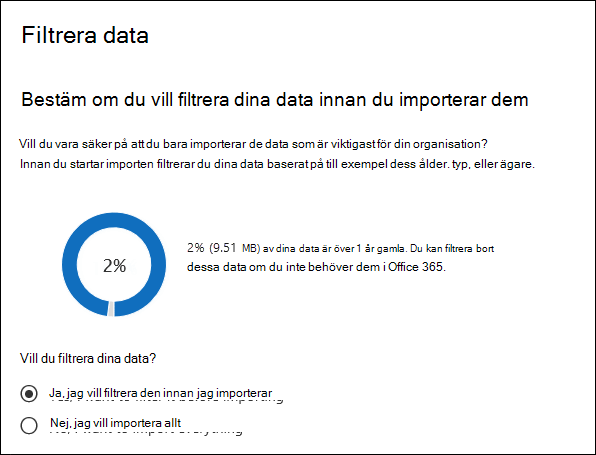
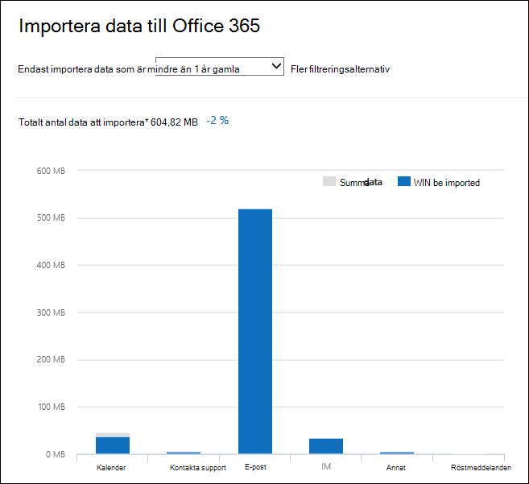
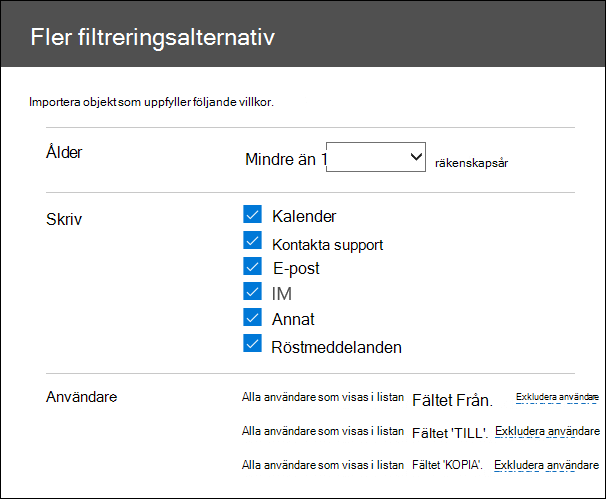
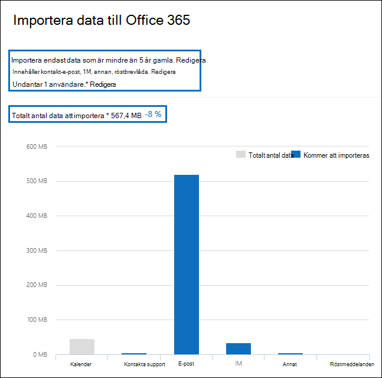

# Filtrera data vid import av PST-filer

Använd den nya funktionen intelligent import i Office 365 importtjänsten för att filtrera objekten i PST-filer som faktiskt importeras till målpostlådorna. Så här fungerar det:
  
- När du har skapat och skickat ett PST-importjobb laddas PST-filer upp till ett Azure-lagringsområde i Microsoft-molnet.
  
- Microsoft 365 analyserar data i PST-filerna på ett säkert och säkert sätt genom att identifiera åldern på postlådeobjekten och de olika meddelandetyper som ingår i PST-filerna.
  
- När analysen är klar och data är redo att importeras kan du välja att importera alla data i PST-filerna som de är eller trimma de data som importeras genom att ange filter som styr vilka data som importeras. Du kan till exempel välja att:
  
  - Importera endast objekt i en viss ålder.
  
  - Importera markerade meddelandetyper.
  
  - Undanta meddelanden som skickas eller tas emot av vissa personer.
  
- När du har konfigurerat filterinställningarna Microsoft 365 bara de data som uppfyller filtreringskriterierna till de målpostlådor som anges i importjobbet.
  
I följande bild visas den intelligenta importen och de uppgifter du utför och de uppgifter som Office 365.
  

  
## Skapa ett PST-importjobb

- Stegen i den här artikeln förutsätter att du har skapat ett PST-importjobb i Office 365 med nätverksuppladdning eller leverans av hårddisk. Stegvisa instruktioner finns i följande avsnitt:
    
  - [Importera PST-filer till Office 365 via nätverksuppladdning](use-network-upload-to-import-pst-files.md)
    
  - [Använd skicka in en hårddisk för att importera PST-filer till Office 365](use-drive-shipping-to-import-pst-files-to-office-365.md)
    
- När du har skapat ett importjobb med hjälp av nätverksuppladdning anges importjobbens status på sidan Importera i efterlevnadscentret för säkerhet & till Analys **pågår,** vilket innebär att Microsoft 365 analyserar data i PST-filerna som du har laddat upp. Klicka **på**  importjobbet. 
    
- För importjobb för hårddiskleverans analyseras data av Microsoft 365 efter att Microsofts datacenterpersonal tar emot din hårddisk och laddar upp PST-filerna till Azure-lagringsplatsen för din organisation.
  
## Filtrera data som importeras till postlådor

När du har skapat ett PST-importjobb följer du de här anvisningarna för att filtrera data innan du importerar dem till Office 365.
  
1. Gå till <https://compliance.microsoft.com> och logga in med autentiseringsuppgifterna för ett administratörskonto i organisationen.
    
2. Klicka på Import av informationsstyrning Microsoft 365 vänstra **fönsterrutan i** \> **kompatibilitetscentret.**
    
    Importjobben för din organisation visas på **fliken** Importera. Värdet **för slutförd** analys i kolumnen **Status** anger importjobben som har analyserats av Microsoft 365 är klara att importeras.
    
    
  
3. Markera importjobbet du vill slutföra och klicka på **Importera för att Office 365**.
  
    En utfällbar sida visas med information om PST-filerna och annan information om importjobbet.

4. Klicka **på Importera för att Office 365**.
    
    Sidan **Filtrera data** visas. Den innehåller datainsikter om data i PST-filerna för importjobbet, inklusive information om datas ålder. 
    
    
  
5. Gör något av följande beroende på om du vill trimma data som importerats till Microsoft 365 under Vill du **filtrera data?**
  
    a. Klicka **på Ja, jag vill filtrera den innan jag importerar för** att trimma de data som du importerar och klicka sedan på **Nästa**.
  
    Sidan **Importera data Office 365 data visas** med detaljerade datainsikter från analysen som Microsoft 365 utfört. 
  
    
  
    Diagrammet på den här sidan visar mängden data som ska importeras. Information om varje meddelandetyp som finns i PST-filerna visas i diagrammet. Du kan placera markören över varje fält om du vill visa specifik information om meddelandetypen. Det finns också en listrutan med olika åldersvärden som baseras på analysen av PST-filerna. När du väljer en ålder i listrutan uppdateras diagrammet för att visa hur mycket data som importeras för den valda åldern. 
  
    b. Om du vill konfigurera additionsfilter för att minska mängden data som importeras klickar du på **Fler filtreringsalternativ**.
  
    
  
    Du kan konfigurera dessa filter:
  
      - **Ålder** – Välj en ålder så att endast objekt som är nyare än angiven ålder importeras. I avsnittet [Mer information](#more-information) finns en beskrivning av hur Microsoft 365 bestämmer ålders buckets för **filtret Ålder.** 
  
      - **Typ** – I det här avsnittet visas alla meddelandetyper som hittades i PST-filerna för importjobbet. Du kan avmarkera en ruta bredvid en meddelandetyp som du vill utesluta. Du kan inte utesluta meddelandetypen Annan. I avsnittet [Mer information](#more-information) finns en lista över postlådeobjekt som ingår i kategorin Annan.
  
      - **Användare** – Du kan utesluta meddelanden som skickas eller tas emot av specifika personer. Om du vill utesluta personer som visas i fältet Från:, Till:  eller Kopia: i meddelanden klickar du på Exkludera användare bredvid den mottagartypen. Skriv personens e-postadress (SMTP-adress), klicka på Lägg till ny ikon för att lägga till dem i listan med uteslutna användare för den mottagartypen och klicka sedan på Spara för att spara listan med   uteslutna användare.  
  
        > [!NOTE]
        > Microsoft 365 inte datainsikter som blir resultatet av att ange **filtret** Personer. Men om du ställer in det här filtret så att meddelanden som skickas eller tas emot av vissa personer utesluts dessa meddelanden under själva importen. 
  
    c. Klicka **på Använd** på sidan Fler **filtreringsalternativ** för att spara filterinställningarna. 
  
    Datainsikterna på sidan **Importera data till Office 365** uppdateras baserat på filterinställningarna, inklusive den totala mängden data som kommer att importeras baserat på filterinställningarna. En sammanfattning av filterinställningarna visas också. Du kan klicka **på** Redigera bredvid ett filter för att ändra inställningen om det behövs. 
  
    
  
    d. Klicka på **Nästa**.
  
    En statussida visas med filterinställningarna. Du kan även redigera filterinställningarna.
  
    e. Klicka **på Importera data** för att starta importen. Den totala mängden data som ska importeras visas. 
  
    eller
  
    a. Klicka **på Nej, jag vill importera allt för** att importera alla data i PST-filerna till Office 365 och klicka sedan på **Nästa.**
  
    b. På sidan **Importera data till Office 365** klickar du på Importera data **för** att starta importen. Den totala mängden data som ska importeras visas. 
  
6. Klicka på **Uppdatera** uppdatering på **fliken**  Importera. Status för importjobbet visas i **kolumnen** Status.
  
7. Klicka på importera jobbet om du vill visa mer detaljerad information, till exempel status för varje PST-fil och de filterinställningar du har konfigurerat.

## Mer information

- Hur bestämmer Microsoft 365 steg för åldersfiltret? När Microsoft 365 analyserar en PST-fil, granskas tidsstämpeln som skickas eller tas emot för varje objekt (om ett objekt har både en tidsstämpel skickad och mottagen, väljs det äldsta datumet). Sedan Microsoft 365 på årsvärdet för den tidsstämpeln och jämför det med dagens datum för att fastställa åldern på objektet. Dessa åldrar används sedan som värden i listrutan för **filtret** Ålder. Om en PST-fil till exempel innehåller meddelanden från 2016, 2015 och  2014 blir värdena i filtret Ålder **1 år,** **2** år och **3 år.**
  
- I följande tabell visas de meddelandetyper som ingår  i kategorin  Annan i filtret Typ på den utflygnde sidan Fler alternativ (se Steg 5b i föregående procedur).  För närvarande kan du inte utesluta objekt i kategorin "Annat" när du importerar PST-objekt till Office 365. 
  
    |**Meddelandeklass-ID**|**Postlådeobjekt som använder den här meddelandeklassen**|
    |:-----|:-----|
    |IPM. Aktivitet    |Journalposter    |
    |IPM.Document    |Dokument och filer (inte bifogade i ett e-postmeddelande)    |
    |IPM. Arkiv    |(samma som IPM.Document)    |
    |IPM. Note.IMC.Notification    |Rapporter som skickas av Internet Mail Anslut, som är Exchange Server gateway till Internet    |
    |IPM. Note.Microsoft.Fax    |Faxmeddelanden    |
    |IPM. Note.rules.Oof.Template.Microsoft    |Autosvarsmeddelanden när du inte är på kontoret    |
    |IPM. Note.Rules.ReplyTemplate.Microsoft    |Svar som skickas med en inkorgsregel    |
    |IPM. OLE. Klass    |Undantag för en återkommande serie    |
    |IPM. Recall.Report    |Rapporter om återkallade meddelanden    |
    |IPM. Fjärrstyrd    |Fjärr-e-postmeddelanden    |
    |IPM. Rapport    |Statusrapporter för objekt    |
