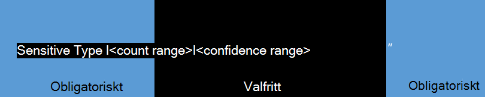

# Skapa en fråga för att hitta känsliga data som lagras på webbplatserForm a query to find sensitive data stored on sites

Användare lagrar ofta känsliga data, till exempel kreditkortsnummer, personnummer eller personliga uppgifter, på sina webbplatser och med tiden kan detta exponera en organisation för betydande risk för dataförlust.Users often store sensitive data, such as credit card numbers, social security numbers, or personal, on their sites, and over time this can expose an organization to significant risk of data loss. Dokument som lagras på OneDrive för företag webbplatser kan delas med personer utanför organisationen som inte ska ha tillgång till informationen.Documents stored on sites—including OneDrive for Business sites—could be shared with people outside the organization who shouldn't have access to the information. Med dataförlustskydd (DLP) i SharePoint Online kan du upptäcka dokument som innehåller känsliga data i hela klientorganisationen.With data loss prevention (DLP) in SharePoint Online, you can discover documents that contain sensitive data throughout your tenant. När dokumenten har upptäckts kan du arbeta med dokumentägarna och skydda dem.After discovering the documents, you can work with the document owners to protect the data. I det här avsnittet får du hjälp att skapa en fråga för att söka efter känsliga data.This topic can help you form a query to search for sensitive data.
  
> [!NOTE]
> Elektronisk upptäckt, eDiscovery och DLP är premiumfunktioner som kräver en [SharePoint Online abonnemang 2.](https://go.microsoft.com/fwlink/?LinkId=510080)Electronic discovery, or eDiscovery, and DLP are premium features that require [SharePoint Online Plan 2](https://go.microsoft.com/fwlink/?LinkId=510080). 
  
## Utforma en enkel DLP-frågaForming a basic DLP query

Det finns tre delar som utgör en enkel DLP-fråga: SensitiveType, antal intervall och konfidensområde.There are three parts that make up a basic DLP query: SensitiveType, count range, and confidence range. Precis som i följande bild är **SensitiveType:" \<type\>** obligatoriskt, både och **|\<count range\>** är **|\<confidence range\>** valfria.As illustrated in the following graphic, **SensitiveType:"\<type\>"** is required, and both **|\<count range\>** and **|\<confidence range\>** are optional. 
  

  
### Känslig typ – obligatorisktSensitive type - required

Så vad är varje del?So what is each part? SharePoint DLP-frågor börjar vanligtvis med egenskapen och ett namn på informationstyp från lager `SensitiveType:"` [av känslig information](/Exchange/what-the-sensitive-information-types-in-exchange-look-for-exchange-2013-help)och slutar med ett `"` .SharePoint DLP queries typically begin with the property  `SensitiveType:"` and an information type name from the [sensitive information types inventory](/Exchange/what-the-sensitive-information-types-in-exchange-look-for-exchange-2013-help), and end with a  `"`. Du kan också använda namnet på en [anpassad typ av känslig information](create-a-custom-sensitive-information-type.md) som du skapat för organisationen.You can also use the name of a [custom sensitive information type](create-a-custom-sensitive-information-type.md) that you created for your organization. Du kanske letar efter dokument som innehåller kreditkortsnummer.For example, you might be looking for documents that contain credit card numbers. I ett sådant fall använder du följande format:  `SensitiveType:"Credit Card Number"` .In such an instance, you'd use the following format:  `SensitiveType:"Credit Card Number"`. Eftersom du inte tog med antal intervall eller konfidensintervall returnerar frågan alla dokument där ett kreditkortsnummer identifieras.Because you didn't include count range or confidence range, the query returns every document in which a credit card number is detected. Det här är den enklaste frågan du kan köra och den returnerar flest resultat.This is the simplest query that you can run, and it returns the most results. Kom ihåg att stavning och avstånd i den känsliga typen spelar roll.Keep in mind that the spelling and spacing of the sensitive type matters. 
  
### Intervall – valfrittRanges - optional

Båda de två följande delarna är områden, så nu ska vi snabbt undersöka hur ett område ser ut.Both of the next two parts are ranges, so let's quickly examine what a range looks like. I SharePoint DLP-frågor representeras ett grundläggande område av två tal avgränsade med två punkter, som ser ut så här: `[number]..[number]` .In SharePoint DLP queries, a basic range is represented by two numbers separated by two periods, which looks like this:  `[number]..[number]`. Om det används  `10..20` skulle intervallet till exempel hämta tal från 10 till 20.For instance, if  `10..20` is used, that range would capture numbers from 10 through 20. Det finns många olika intervallkombinationer och flera av dem behandlas i det här avsnittet.There are many different range combinations and several are covered in this topic. 
  
Nu ska vi lägga till ett antal i frågan.Let's add a count range to the query. Du kan använda antalsområde för att definiera antalet förekomster av känslig information som ett dokument måste innehålla innan det tas med i frågeresultatet.You can use count range to define the number of occurrences of sensitive information a document needs to contain before it's included in the query results. Om du till exempel vill att frågan endast ska returnera dokument som innehåller exakt fem kreditkortsnummer använder du följande:  `SensitiveType:"Credit Card Number|5"` .For example, if you want your query to return only documents that contain exactly five credit card numbers, use this:  `SensitiveType:"Credit Card Number|5"`. Med antalsområde kan du även identifiera dokument som utgör en hög grad av risk.Count range can also help you identify documents that pose high degrees of risk. Din organisation kan till exempel anse dokument med fem eller fler kreditkortsnummer som en hög risk.For example, your organization might consider documents with five or more credit card numbers a high risk. För att hitta dokument som passar detta villkor använder du den här frågan:  `SensitiveType:"Credit Card Number|5.."` .To find documents fitting this criterion, you would use this query:  `SensitiveType:"Credit Card Number|5.."`. Du kan också hitta dokument med fem eller färre kreditkortsnummer med hjälp av den här frågan:  `SensitiveType:"Credit Card Number|..5"` .Alternatively, you can find documents with five or fewer credit card numbers by using this query:  `SensitiveType:"Credit Card Number|..5"`. 
  
#### KonfidensområdeConfidence range

Slutligen är konfidensintervallet nivån av konfidens om den identifierade känsliga typen verkligen är en matchning.Finally, confidence range is the level of confidence that the detected sensitive type is actually a match. Värdena för konfidensområde fungerar på ungefär samma sätt som antal intervall.The values for confidence range work similarly to count range. Du kan skapa en fråga utan att inkludera ett antal intervall.You can form a query without including a count range. Om du till exempel vill söka efter dokument med valigt antal kreditkortsnummer – så länge konfidensintervallet är 85 procent eller högre – kan du använda den här frågan:  `SensitiveType:"Credit Card Number|*|85.."` .For example, to search for documents with any number of credit card numbers—as long as the confidence range is 85 percent or higher—you would use this query:  `SensitiveType:"Credit Card Number|*|85.."`. 
  
> [!IMPORTANT]
> Asterisken ( `*` ) är ett jokertecken som innebär att alla värden fungerar.The asterisk ( `*`) is a wildcard character that means any value works. Du kan använda jokertecknet ( ) antingen i antalsområdet eller i konfidensområdet, `*` men inte i en känslig typ.You can use the wildcard character ( `*`) either in the count range or in the confidence range, but not in a sensitive type. 
  
### Ytterligare frågeegenskaper och sökoperatorer tillgängliga i eDiscovery CenterAdditional query properties and search operators available in the eDiscovery Center

Med DLP i SharePoint introduceras även egenskapen LastSensitiveContentScan, som kan hjälpa dig att söka efter filer som genomsöks inom en viss tidsperiod.DLP in SharePoint also introduces the LastSensitiveContentScan property, which can help you search for files scanned within a specific timeframe. Frågeexempel för  `LastSensitiveContentScan` egenskapen finns i [exempel på komplexa frågor i](#examples-of-complex-queries) nästa avsnitt.For query examples with the  `LastSensitiveContentScan` property, see the [Examples of complex queries](#examples-of-complex-queries) in the next section. 
  
Du kan inte bara använda DLP-specifika egenskaper för att skapa en fråga, utan även standardegenskaper SharePoint för eDiscovery-sökning, till exempel `Author` eller `FileExtension` .You can use not only DLP-specific properties to create a query, but also standard SharePoint eDiscovery search properties such as  `Author` or  `FileExtension`. Du kan använda operatorer för att skapa komplexa frågor.You can use operators to build complex queries. Listan över tillgängliga egenskaper och operatorer finns i blogginlägget [Använda sökegenskaper och operatorer med eDiscovery.](/archive/blogs/quentin/using-search-properties-and-operators-with-ediscovery)For the list of available properties and operators, see the [Using Search Properties and Operators with eDiscovery](/archive/blogs/quentin/using-search-properties-and-operators-with-ediscovery) blog post. 
  
## Exempel på komplexa frågorExamples of complex queries

I följande exempel används olika typer, egenskaper och operatorer för att illustrera hur du kan förfina frågorna så att du hittar exakt det du letar efter.The following examples use different sensitive types, properties, and operators to illustrate how you can refine your queries to find exactly what you're looking for.
  
|**Fråga****Query**|**Förklaring****Explanation**|
|:-----|:-----|
| `SensitiveType:"International Banking Account Number (IBAN)"`   |Namnet kan verka konstigt eftersom det är så långt, men det är rätt namn för den typ av känslig information.The name might seem strange because it's so long, but it's the correct name for that sensitive type. Se till att använda exakta namn från [inventeringen av typer av känslig information.](/Exchange/what-the-sensitive-information-types-in-exchange-look-for-exchange-2013-help)Make sure to use exact names from the [sensitive information types inventory](/Exchange/what-the-sensitive-information-types-in-exchange-look-for-exchange-2013-help). Du kan också använda namnet på en [anpassad typ av känslig information](create-a-custom-sensitive-information-type.md) som du skapat för organisationen.You can also use the name of a [custom sensitive information type](create-a-custom-sensitive-information-type.md) that you created for your organization.    |
| `SensitiveType:"Credit Card Number|1..4294967295|1..100"`   |Då returneras dokument med minst en matchning av den känsliga typen "Kreditkortsnummer".This returns documents with at least one match to the sensitive type "Credit Card Number." Värdena för varje intervall är respektive lägsta och högsta värden.The values for each range are the respective minimum and maximum values. Ett enklare sätt att skriva den här  `SensitiveType:"Credit Card Number"` frågan är , men var är det roliga med den?A simpler way to write this query is  `SensitiveType:"Credit Card Number"`, but where's the fun in that?    |
| `SensitiveType:"Credit Card Number| 5..25" AND LastSensitiveContentScan:"8/11/2018..8/13/2018"`   |Då returneras dokument med 5–25 kreditkortsnummer som skannades från den 11 augusti 2018 till den 13 augusti 2018.This returns documents with 5-25 credit card numbers that were scanned from August 11, 2018 through August 13, 2018.    |
| `SensitiveType:"Credit Card Number| 5..25" AND LastSensitiveContentScan:"8/11/2018..8/13/2018" NOT FileExtension:XLSX`   |Då returneras dokument med 5–25 kreditkortsnummer som skannades från den 11 augusti 2018 till den 13 augusti 2018.This returns documents with 5-25 credit card numbers that were scanned from August 11, 2018 through August 13, 2018. Filer med XLSX-filnamnstillägg tas inte med i frågeresultaten.Files with an XLSX extension aren't included in the query results.  `FileExtension` är en av många egenskaper som du kan ta med i en fråga.`FileExtension` is one of many properties that you can include in a query. Mer information finns i Använda [sökegenskaper och operatorer med eDiscovery.](/archive/blogs/quentin/using-search-properties-and-operators-with-ediscovery)For more information, see [Using Search Properties and Operators with eDiscovery](/archive/blogs/quentin/using-search-properties-and-operators-with-ediscovery).    |
| `SensitiveType:"Credit Card Number" OR SensitiveType:"U.S. Social Security Number (SSN)"`   |Då returneras dokument som innehåller antingen ett kreditkortsnummer eller ett personnummer.This returns documents that contain either a credit card number or a social security number.    |
   
## Exempel på frågor som du kan undvikaExamples of queries to avoid

Alla frågor skapas inte lika.Not all queries are created equal. Följande tabell innehåller exempel på frågor som inte fungerar med DLP i SharePoint beskriver varför.The following table gives examples of queries that don't work with DLP in SharePoint and describes why.
  
|**Fråga som inte stöds****Unsupported query**|**Orsak****Reason**|
|:-----|:-----|
| `SensitiveType:"Credit Card Number|.."`   |Du måste lägga till minst en siffra.You must add at least one number.    |
| `SensitiveType:"NotARule"`   |"NotARule" är inte ett giltigt namn på känslig typ."NotARule" isn't a valid sensitive type name. Endast namn i [lagertyperna för känslig information](/Exchange/what-the-sensitive-information-types-in-exchange-look-for-exchange-2013-help) fungerar i DLP-frågor.Only names in the [sensitive information types inventory](/Exchange/what-the-sensitive-information-types-in-exchange-look-for-exchange-2013-help) work in DLP queries.    |
| `SensitiveType:"Credit Card Number|0"`   |Noll är inte giltigt som antingen minimivärdet eller maxvärdet i ett område.Zero isn't valid as either the minimum value or the maximum value in a range.    |
| `SensitiveType:"Credit Card Number"`   |Det kan vara svårt att se, men det finns extra tomt utrymme mellan "Kredit" och "Kort" som gör frågan ogiltig.It's might be difficult to see, but there's extra white space between "Credit" and "Card" that makes the query invalid. Använd exakt namn på känsliga typer från [inventeringen av typer av känslig information.](/Exchange/what-the-sensitive-information-types-in-exchange-look-for-exchange-2013-help)Use exact sensitive type names from the [sensitive information types inventory](/Exchange/what-the-sensitive-information-types-in-exchange-look-for-exchange-2013-help).    |
| `SensitiveType:"Credit Card Number|1. .3"`   |Tvåperiodsdelen ska inte avgränsas med blanksteg.The two-period portion shouldn't be separated by a space.    |
| `SensitiveType:"Credit Card Number| |1..|80.."`   |Det finns för många pipe-avgränsare (There are too many pipe delimiters (|).). Följ det här formatet i stället: `SensitiveType: "Credit Card Number|1..|80.."`Follow this format instead: `SensitiveType: "Credit Card Number|1..|80.."`   |
| `SensitiveType:"Credit Card Number|1..|80..101"`   |Konfidensvärden representerar en procentsats, men får inte överstiga 100.Because confidence values represent a percentage, they can't exceed 100. Välj ett tal mellan 1 och 100 i stället.Choose a number from 1 through 100 instead.    |
   
## Mer informationFor more information

- [Entitetsdefinitioner för typer av känslig informationSensitive information type entity definitions](sensitive-information-type-entity-definitions.md)
- [Köra en innehållssökningRun a Content Search](content-search.md)
- [Nyckelordsfrågor och sökvillkor för innehållssökningKeyword queries and search conditions for Content Search](keyword-queries-and-search-conditions.md)
