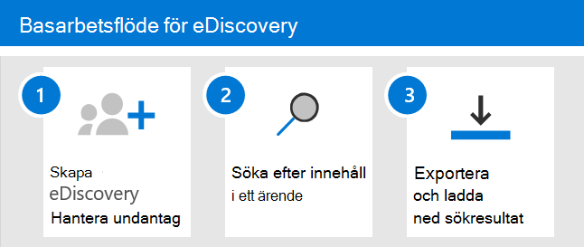

# Kom igång med Core eDiscoveryGet started with Core eDiscovery

Core eDiscovery i Microsoft 365 innehåller ett grundläggande eDiscovery-verktyg som organisationer kan använda för att söka efter och exportera innehåll i Microsoft 365 och Office 365.Core eDiscovery in Microsoft 365 provides a basic eDiscovery tool that organizations can use to search and export content in Microsoft 365 and Office 365. Du kan också använda Grundläggande eDiscovery för att placera ett eDiscovery-värde på innehållsplatser, till exempel Exchange-postlådor, SharePoint-webbplatser, OneDrive-konton och Microsoft Teams.You can also use Core eDiscovery to place an eDiscovery hold on content locations, such as Exchange mailboxes, SharePoint sites, OneDrive accounts, and Microsoft Teams. Inget krävs för att distribuera Bas-eDiscovery, men det finns vissa nödvändiga uppgifter som en IT-administratör och eDiscovery-hanterare måste slutföra innan organisationen kan börja använda Core eDiscovery för att söka, exportera och bevara innehåll.Nothing is needed to deploy Core eDiscovery, but there are some prerequisite tasks that an IT admin and eDiscovery manager have to complete before your organization can start using Core eDiscovery to search, export, and preserve content.

I den här artikeln beskrivs de steg som krävs för att konfigurera Bas-eDiscovery.This article discusses the steps necessary to set up Core eDiscovery. Detta omfattar att säkerställa korrekt licensiering som krävs för att få tillgång till Core eDiscovery och placera ett eDiscovery-värde på innehållsplatser, samt att tilldela behörigheter till din IT-grupp, din juridiska grupp och din undersökningsteam så att de kan komma åt och hantera ärenden.This includes ensuring the proper licensing required to access Core eDiscovery and place an eDiscovery hold on content locations, as well as assigning permissions to your IT, legal, and investigation team so they can access and manage cases. Den här artikeln innehåller också en översikt över hur fall kan söka efter och exportera innehåll.This article also provides a high-level overview of using cases to search for and export content.

## Steg 1: Verifiera och tilldela rätt licenserStep 1: Verify and assign appropriate licenses

Licensiering för bas-eDiscovery kräver rätt organisationsprenumeration och licensiering per användare.Licensing for Core eDiscovery requires the appropriate organization subscription and per-user licensing.

- **Organisationsprenumeration:** För att få tillgång till Grundläggande eDiscovery i efterlevnadscentret för Microsoft 365 eller efterlevnadscentret för Office 365 Security & och använda funktionerna för att hålla och exportera måste organisationen ha en Microsoft 365 E3- eller Office 365 E3-prenumeration eller senare.**Organization subscription:** To access Core eDiscovery in the Microsoft 365 compliance center or the Office 365 Security & Compliance Center and use the hold and export features, your organization must have a Microsoft 365 E3 or Office 365 E3 subscription or higher.

- **Licensiering per användare:** För att kunna skapa ett eDiscovery-tillstånd för postlådor och webbplatser måste en användare tilldelas någon av följande licenser, beroende på organisationens prenumeration:**Per-user licensing:** To place an eDiscovery hold on mailboxes and sites, a user must be assigned one of the following licenses, depending on your organization subscription:

  - En Microsoft 365 E3 eller Office 365 E3-licens eller senareA Microsoft 365 E3 or Office 365 E3 license or higher

   ELLEROR

  - Office 365 E1-licens med Exchange Online abonnemang 2 Exchange Online - arkivering eller en tilläggslicensOffice 365 E1 license with an Exchange Online Plan 2 or Exchange Online Archiving add-on license

  OCHAND

  - Office 365 E1-licens med SharePoint onlineabonnemang 2 eller OneDrive för företag abonnemang 2 med tilläggslicensOffice 365 E1 license with an SharePoint Online Plan 2 or OneDrive for Business Plan 2 add-on license
  
  Mer information om hur du tilldelar licenser finns [i Tilldela licenser till användare.](../admin/manage/assign-licenses-to-users.md)For information about how to assign licenses, see [Assign licenses to users](../admin/manage/assign-licenses-to-users.md).

För information om licensiering:For information about licensing:

- Ladda ned och se "Discover & Respond"-lösningen i jämförelse [av Microsoft 365 kompatibilitetslicensiering.](/office365/servicedescriptions/downloads/microsoft-365-compliance-licensing-comparison.xlsx)Download and see the "Discover & Respond" solution in the [Microsoft 365 Compliance Licensing Comparison](/office365/servicedescriptions/downloads/microsoft-365-compliance-licensing-comparison.xlsx).

- Se [tjänstbeskrivningen & Säkerhets- och efterlevnadscenter.](/office365/servicedescriptions/office-365-platform-service-description/office-365-securitycompliance-center)See the [Security & Compliance Center service description](/office365/servicedescriptions/office-365-platform-service-description/office-365-securitycompliance-center).

## Steg 2: Tilldela eDiscovery-behörigheterStep 2: Assign eDiscovery permissions

För att få åtkomst till grundläggande eDiscovery eller läggas till som medlem i ett core eDiscovery-ärende måste användaren tilldelas rätt behörigheter.To access Core eDiscovery or be added as a member of a Core eDiscovery case, a user must be assigned the appropriate permissions. Mer specifikt måste en användare läggas till som medlem i rollgruppen för eDiscovery Manager Office 365 Säkerhets- & efterlevnadscenter.Specifically, a user must be added as a member of the eDiscovery Manager role group in the Office 365 Security & Compliance Center. Medlemmar i den här rollgruppen kan skapa och hantera grundläggande eDiscovery-ärenden.Members of this role group can create and manage Core eDiscovery cases. De kan lägga till och ta bort medlemmar, lägga till och ta bort eDiscovery-innehåll för användare, skapa och redigera sökningar och exportera innehåll från en core eDiscovery-fråga.They can add and remove members, place an eDiscovery hold on users, create and edit searches, and export content from a Core eDiscovery case.

Utför följande steg för att lägga till användare i rollgruppen för eDiscovery-hanteraren:Complete the following steps to add users to the eDiscovery Manager role group:

1. Gå till [https://protection.office.com/permissions](https://protection.office.com/permissions) och logga in med autentiseringsuppgifterna för ett administratörskonto i din Microsoft 365 eller Office 365 organisation.Go to [https://protection.office.com/permissions](https://protection.office.com/permissions) and sign in using the credentials for an admin account in your Microsoft 365 or Office 365 organization.

2. På sidan **Behörigheter** väljer du **rollgruppen för eDiscovery-hanteraren.**On the **Permissions** page, select the **eDiscovery Manager** role group.

3. På den utfällande sidan för eDiscovery Manager klickar **du på** Redigera bredvid **avsnittet eDiscovery Manager.**On the eDiscovery Manager flyout page, click **Edit** next to the **eDiscovery Manager** section.

4. Klicka på Välj Identifieringshanteraren i guiden För redigeringsroll på sidan Välj **eDiscovery** **Manager.**On the **Choose eDiscovery Manager** page in the edit role group wizard, click **Choose Discovery Manager**.

5. Klicka **på** Lägg till och markera kryssrutan för alla användare som du vill lägga till i rollgruppen.Click **Add** then select the checkbox for all users you want to add to the role group.

6. Klicka **på Lägg** till för att lägga till de valda användarna och klicka sedan på **Klar**.Click **Add** to add the selected users, and then click **Done**.

7. Klicka **på** Spara för att lägga till användarna i rollgruppen och klicka sedan **på Stäng** för att slutföra steget.Click **Save** to add the users to the role group, and then click **Close** to complete the step.

### Mer information om rollgruppen för eDiscovery-hanterarenMore information about the eDiscovery Manager role group

Det finns två undergrupper i rollgruppen för eDiscovery-hanteraren.There are two subgroups in the eDiscovery Manager role group. Skillnaden mellan dessa undergrupper beror på omfattningen.The difference between these subgroups is based on scope.

- **eDiscovery Manager:** Kan visa och hantera core eDiscovery-ärenden som de skapar eller är medlemmar i.**eDiscovery Manager:** Can view and manage the Core eDiscovery cases they create or are a member of. Om en annan eDiscovery Manager skapar ett ärende men inte lägger till en andra eDiscovery Manager som medlem i det fallet kan inte den andra eDiscovery-hanteraren visa eller öppna ärendet på Core eDiscovery-sidan i efterlevnadscentret.If another eDiscovery Manager creates a case but doesn't add a second eDiscovery Manager as a member of that case, the second eDiscovery Manager won't be able to view or open the case on the Core eDiscovery page in the compliance center. I allmänhet kan de flesta i organisationen läggas till i undergruppen för eDiscovery Manager.In general, most people in your organization can be added to the eDiscovery Manager subgroup.

- **eDiscovery-administratör:** Kan utföra alla uppgifter för ärendehantering som en eDiscovery-hanterare kan utföra.**eDiscovery Administrator:** Can perform all case management tasks that an eDiscovery Manager can do. En eDiscovery-administratör kan dessutom:Additionally, an eDiscovery Administrator can:

  - Visa alla ärenden som listas på sidan Bas-eDiscovery.View all cases that are listed on the Core eDiscovery page.
  
  - Hantera alla ärende i organisationen när de har lagt till sig själva som medlem i ärendet.Manage any case in the organization after they add themselves as a member of the case.

  - Access och exportera ärendedata för alla fall i organisationen.Access and export case data for any case in the organization.

  På grund av den breda omfattningen av åtkomst bör en organisation bara ha ett fåtal administratörer som är medlemmar i undergruppen eDiscovery-administratörer.Because of the broad scope of access, an organization should have only a few admins who are members of the eDiscovery Administrators subgroup.

Mer information om eDiscovery-behörigheter och en beskrivning av varje roll som tilldelas till rollgruppen för eDiscovery-hanteraren finns i Tilldela [eDiscovery-behörigheter.](assign-ediscovery-permissions.md)For more information about eDiscovery permissions and a description of each role that's assigned to the eDiscovery Manager role group, see [Assign eDiscovery permissions](assign-ediscovery-permissions.md).

## Steg 3: Skapa ett grundläggande eDiscovery-ärendeStep 3: Create a Core eDiscovery case

Nästa steg är att skapa ett ärende och börja använda Core eDiscovery.The next step is to create a case and start using Core eDiscovery. Så här skapar du ett ärende och lägger till medlemmar.Complete the following steps to create a case and add members. Den användare som skapar ärendet läggs automatiskt till som medlem.The user who creates the case is automatically added as a member.

1. Gå till [https://compliance.microsoft.com](https://compliance.microsoft.com) och logga in med autentiseringsuppgifterna för ett användarkonto som har tilldelats lämpliga eDiscovery-behörigheter.Go to [https://compliance.microsoft.com](https://compliance.microsoft.com) and sign in using the credentials for a user account that has been assigned the appropriate eDiscovery permissions. Medlemmar i rollgruppen Organisationshantering kan också skapa grundläggande eDiscovery-ärenden.Members of the Organization Management role group can also create Core eDiscovery cases.

2. I det vänstra navigeringsfönstret i Microsoft 365 kompatibilitetscenter klickar du på Visa alla **och** sedan på **eDiscovery > Core**.In the left navigation pane of the Microsoft 365 compliance center, click **Show all**, and then click **eDiscovery > Core**.

3. På sidan **Bas-eDiscovery** klickar du på **Skapa ett ärende.**On the **Core eDiscovery** page, click **Create a case**.

4. På den **utfällbara** sidan Nytt ärende ger du ärendet ett namn (obligatoriskt) och anger ett valfritt ärendenummer och en beskrivning.On the **New case** flyout page, give the case a name (required), and then type an optional case number and description. Namnet på ärendet måste vara unikt inom organisationen.The case name must be unique in your organization.

5. Klicka **på Spara** för att skapa ärendet.Click **Save** to create the case.

   Det nya ärendet skapas och visas på sidan Bas-eDiscovery.The new case is created and displayed on the Core eDiscovery page. Du kan behöva klicka på **Uppdatera för** att visa det nya ärendet.You may have to click **Refresh** to display the new case. 

## Steg 4 (valfritt): Lägga till medlemmar i ett grundläggande eDiscovery-ärendeStep 4 (optional): Add members to a Core eDiscovery case

Om du skapar ett ärende i steg 3 och är den enda personen som kommer att använda ärendet behöver du inte utföra det här steget.If you create a case in Step 3 and you're the only person who will use the case, then you don't have to perform this step. Du kan börja använda ärendet för att skapa eDiscovery-innehåll, söka efter innehåll eller exportera sökresultat.You can start using the case to create eDiscovery holds, search for content, or export search results. Utför det här steget om du vill ge andra användare (eller rollgrupper) åtkomst till ärendet.Perform this step if you want to give other users (or roles group) access to the case.

1. På sidan **Bas-eDiscovery** i Microsoft 365 efterlevnadscenter klickar du på namnet på det ärende som du vill lägga till medlemmar i.On the **Core eDiscovery** page in the Microsoft 365 compliance center, click the name of the case that you want to add members to.

2. På sidan **Hantera detta ärende,** under Hantera **medlemmar, klickar du på** Lägg till **för** att lägga till medlemmar i ärendet.On the **Manage this case** flyout page, under **Manage members**, click **Add** to add members to the case. 

    Du kan också välja att lägga till rollgrupp som medlemmar i ett ärende.You can also choose to add role group as members of a case. Klicka **på Lägg till under** Hantera **rollgrupper.**Under **Manage role groups**, click **Add**. Du kan bara tilldela rollgrupper där du är medlem i ett ärende.You can only assign the role groups that you are a member of to a case. Det beror på att rollgrupper styr vem som kan tilldela medlemmar till ett e-dataidentifieringsfall.That's because role groups control who can assign members to an eDiscovery case.

3. I listan över personer eller rollgrupper som kan läggas till som medlemmar i ärendet klickar du på kryssrutan bredvid namnen på de personer (eller rollgrupper) som du vill lägga till.In the list of people or role groups that can be added as members of the case, click the check box next to the names of the people (or role groups) that you want to add. Om du har en stor lista med personer  som kan läggas till som medlemmar kan du använda sökrutan för att söka efter en viss person i listan.If you have a large list of people who can added as members, use the **Search** box to search for a specific person in the list.
  
4. När du har valt de personer eller rollgrupper du vill lägga till som medlemmar i ärendet klickar du på Lägg **till**.After you select the people or role groups to add as members of the case, click **Add**.

5. Spara **den** nya listan med ärendemedlemmar genom att klicka på Spara.Click **Save** to save the new list of case members.

## Utforska eDiscovery-kärnarbetsflödetExplore the Core eDiscovery workflow

Här är ett enkelt arbetsflöde för att skapa eDiscovery som kan hjälpa dig att komma igång med att använda grundläggande eDiscovery, söka efter innehåll som är relevant för din undersökning och sedan exportera dessa data för ytterligare granskning.To get you started using core eDiscovery, here's a simple workflow of creating eDiscovery holds for people of interest, searching for content that relevant to your investigation, and then exporting that data for further review. I vart och ett av de här stegen kommer vi också att belysa vissa utökade grundläggande eDiscovery-funktioner som du kan utforska.In each of these steps, we'll also highlight some extended Core eDiscovery functionality that you can explore.

1. **[Skapa ett eDiscovery-hold](create-ediscovery-holds.md)**.**[Create an eDiscovery hold](create-ediscovery-holds.md)**. Det första steget när ett ärende har skapats är att sätta ett värde på (kallas även *för ett e-dataidentifieringsland)* för innehållsplatserna för de personer som är intressanta för din undersökning.The first step after creating a case is placing a hold (also called an *eDiscovery hold*) on the content locations of the people of interest in your investigation. Innehållsplatserna omfattar Exchange postlådor, SharePoint webbplatser, OneDrive-konton samt postlådor och webbplatser som är kopplade till Microsoft Teams och Office 365 Grupper.Content locations include Exchange mailboxes, SharePoint sites, OneDrive accounts, as well as the mailboxes and sites associated with Microsoft Teams and Office 365 Groups. Även om det här steget är valfritt behålls innehåll som kan vara relevant för ärendet under undersökningen om du skapar ett bevarande av e-dataidentifiering.While this step is optional, creating an eDiscovery hold preserves content that may be relevant to the case during the investigation. När du skapar ett bevarande för e-dataidentifiering kan du bevara allt innehåll på specifika innehållsplatser eller skapa ett frågebaserat bevarande för att bara bevara det innehåll som matchar en bevarandefråga.When you create an eDiscovery hold you can preserve all content in specific content locations or you can create a query-based hold to preserve only the content that matches a hold query. Förutom att bevara innehållet är ett annat bra skäl att skapa eDiscovery-innehåll snabbt söka efter platser för innehåll som är spärrade (i stället för att behöva välja varje plats att söka på) när du skapar och kör sökningar i nästa steg.In addition to preserving content, another good reason to create eDiscovery holds is to quickly search the content locations on hold (instead of having to select each location to search) when you create and run searches in the next step. När du har slutfört undersökningen kan du släppa alla väntande ändringar som du har skapat.After you complete your investigation, you can release any hold that you created.

2. **[Söka efter innehåll](search-for-content-in-core-ediscovery.md)**.**[Search for content](search-for-content-in-core-ediscovery.md)**. När du har skapat eDiscovery-innehåll kan du använda det inbyggda sökverktyget för att söka på platser för innehåll som är spärrade.After you create eDiscovery holds, use the built-in search tool to search the content locations on hold. Du kan också söka efter data som kan vara relevanta för ärendet på andra innehållsplatser.You can also search other content locations for data that may be relevant to the case. Du kan skapa och köra olika sökningar som är kopplade till ärendet.You can create and run different searches that are associated with the case. Du använder nyckelord, egenskaper  och villkor för att skapa sökfrågor som returnerar sökresultat med de data som troligen är relevanta för ärendet.You use keywords, properties, and conditions to [build search queries](keyword-queries-and-search-conditions.md) that return search results with the data that's most likely relevant to the case. Du kan också:You can also:

   - Visa sökstatistik som kan hjälpa dig att förfina sökningen för att begränsa resultatet.View search statistics that may help you refine a search query to narrow the results.

   - Förhandsgranska sökresultaten för att snabbt kontrollera om relevanta data hittas.Preview the search results to quickly verify whether the relevant data is being found.

   - Ändra en fråga och kör sökningen igen.Revise a query and rerun the search.

3. **[Exportera och ladda ned sökresultat](export-content-in-core-ediscovery.md)**.**[Export and download search results](export-content-in-core-ediscovery.md)**. När du söker efter och hittar data som är relevanta för din undersökning kan du exportera dem från Office 365 för granskning av personer utanför undersökningsteamet.After you search for and find data that's relevant to your investigation, you can export it out of Office 365 for review by people outside of the investigation team. Att exportera data är en process i två steg.Exporting data is a two-step process. Det första steget är att exportera resultatet av en sökning från en Office 365.The first step is to export the results of a search in the case out of Office 365. Du uppnår detta genom att kopiera resultatet av en sökning till en plats som tillhandahålls Azure Storage Microsoft.This is accomplished by copying the results of a search to a Microsoft-provided Azure Storage location. Nästa steg är att använda verktyget för eDiscovery-export för att ladda ned innehållet till en lokal dator.The next step is to use the eDiscovery Export tool to download the content to a local computer. Förutom de exporterade datafilerna innehåller innehåller exportpaketet även en exportrapport, en sammanfattningsrapport och en felrapport.In addition to the exported data files, the contains of the export package also contains an export report, a summary report, and an error report.