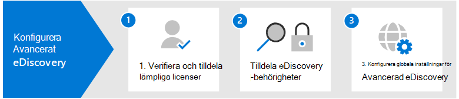

# Konfigurera Microsoft 365 Advanced eDiscovery

Advanced eDiscovery i Microsoft 365 ett end-to-end-arbetsflöde för att bevara, samla in, granska, analysera och exportera data som svarar på organisationens interna och externa undersökningar. Det krävs inget för att distribuera Advanced eDiscovery, men det finns vissa uppgifter som krävs för att en IT-administratör och eDiscovery-hanterare ska kunna slutföra innan organisationen kan börja skapa och använda Advanced eDiscovery-ärenden för att hantera undersökningarna.

I den här artikeln beskrivs följande steg för att konfigurera Advanced eDiscovery.

Det omfattar att säkerställa rätt licensiering som krävs för att komma åt Advanced eDiscovery och lägga till vårdnadshavare för ärenden samt att tilldela behörigheter till din juridiska grupp och undersökningsteam så att de kan komma åt och hantera ärenden.

## Steg 1: Verifiera och tilldela rätt licenser

För licensiering Advanced eDiscovery krävs rätt organisationsprenumeration och licensiering per användare. En lista över licenskrav för Advanced eDiscovery finns i [Prenumerationer och licensiering](overview-ediscovery-20.md#subscriptions-and-licensing).

## Steg 2: Tilldela eDiscovery-behörigheter

För att Advanced eDiscovery komma åt eller läggas till som medlem i Advanced eDiscovery ärende måste användaren tilldelas rätt behörigheter. Specifikt måste en användare läggas till som medlem i rollgruppen för eDiscovery Manager i säkerhets- & efterlevnadscenter. Medlemmar i den här rollgruppen kan skapa och hantera Advanced eDiscovery ärenden. De kan lägga till och ta bort medlemmar, placera dokumenterare och platser för innehåll i förvaring, hantera aviseringar om juridiska hinder, skapa och redigera sökningar associerade med ett ärende, lägga till sökresultat i en granskningsuppsättning, analysera data i en granskningsuppsättning och exportera och ladda ned från ett Advanced eDiscovery-ärende.

Utför följande steg för att lägga till användare i rollgruppen för eDiscovery-hanteraren:

1. Gå till <https://protection.office.com/permissions> och logga in med autentiseringsuppgifterna för ett administratörskonto i Microsoft 365 organisation.

2. På sidan **Behörigheter** väljer du **rollgruppen för eDiscovery-hanteraren.**

3. På den utfällande sidan för eDiscovery Manager klickar **du på** Redigera bredvid **avsnittet eDiscovery Manager.**

4. På sidan **Välj eDiscovery-hanteraren** i guiden för att redigera rollgrupp klickar du **på Välj eDiscovery-hanteraren.**

5. Klicka **på** Lägg till och markera kryssrutan för alla användare som du vill lägga till i rollgruppen.

6. Klicka **på Lägg** till för att lägga till de valda användarna och klicka sedan på **Klar**.

7. Klicka **på** Spara för att lägga till användarna i rollgruppen och klicka sedan **på Stäng** för att slutföra steget.

### Mer information om rollgruppen för eDiscovery-hanteraren

Det finns två undergrupper i rollgruppen för eDiscovery-hanteraren. Skillnaden mellan dessa undergrupper beror på omfattningen.

- **eDiscovery Manager:** Kan visa och hantera Advanced eDiscovery fall som de skapar eller är medlem i. Om en annan eDiscovery Manager skapar ett ärende men inte lägger till en andra eDiscovery Manager som medlem i det fallet kan inte den andra eDiscovery-hanteraren visa eller öppna ärendet på sidan Advanced eDiscovery i efterlevnadscentret. I allmänhet kan de flesta i organisationen läggas till i undergruppen för eDiscovery Manager.

- **eDiscovery-administratör:** Kan utföra alla uppgifter som en eDiscovery-hanterare kan utföra. En eDiscovery-administratör kan dessutom:

  - Visa alla ärenden som listas på Advanced eDiscovery sidan.
  
  - Hantera alla ärende i organisationen när de har lagt till sig själva som medlem i ärendet.

  - Access och exportera ärendedata för alla fall i organisationen.

  På grund av den breda omfattningen av åtkomst bör en organisation bara ha ett fåtal administratörer som är medlemmar i undergruppen eDiscovery-administratörer.

Mer information om eDiscovery-behörigheter och en beskrivning av varje roll som tilldelas till rollgruppen för eDiscovery-hanteraren finns i Tilldela [eDiscovery-behörigheter.](assign-ediscovery-permissions.md)

## Steg 3: Konfigurera globala inställningar för Advanced eDiscovery

Det sista steget innan användare i organisationen börjar skapa och använda ärenden är att konfigurera globala inställningar som gäller för alla ärenden i organisationen. För närvarande är den enda globala inställningen identifiering *av klientbehörighet* för jurister (fler globala inställningar kommer att vara tillgängliga i framtiden). Med den här inställningen kan juristklientens behörighetsmodell köras när du analyserar data i en uppsättning med granskning. I modellen används maskininlärning för att avgöra hur sannolikt det är att ett dokument innehåller innehåll som är lagligt. Dessutom jämförs deltagarna i dokument med en juristlista (som du skickar in vid inställning av modellen) för att avgöra om ett dokument har minst en deltagare som är jurist.

Mer information om hur du inställningar och använder modellen för identifiering av juristklienter finns i Konfigurera identifiering av behörigheter för [juristklienter i Advanced eDiscovery.](attorney-privilege-detection.md)

> [!NOTE]
> Det här är ett valfritt steg som du kan utföra när som helst. Att inte implementera modellen för identifiering av juristklienter hindrar dig inte från att skapa och använda Advanced eDiscovery ärenden.

## Nästa steg

När du har Advanced eDiscovery är du redo att [skapa ett ärende](create-and-manage-advanced-ediscoveryv2-case.md).