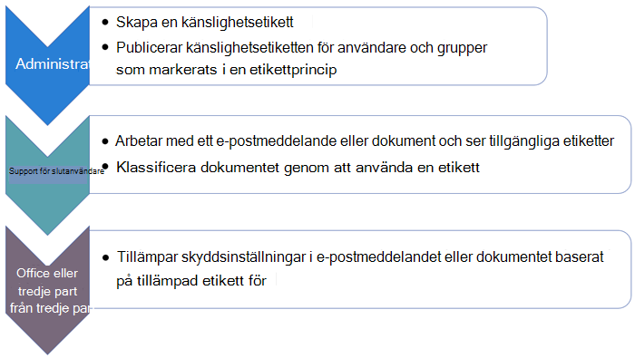

# Kom igång med känslighetsetiketter

>*[Vägledning för säkerhet och efterlevnad med licensiering i Microsoft 365](/office365/servicedescriptions/microsoft-365-service-descriptions/microsoft-365-tenantlevel-services-licensing-guidance/microsoft-365-security-compliance-licensing-guidance).*

Mer information om vilka känslighetsetiketter som är och hur de kan hjälpa dig att skydda organisationens data finns i [Läs mer om känslighetsetiketter](sensitivity-labels.md).

Om du har [Azure Information Protection](/azure/information-protection/what-is-information-protection) och fortfarande använder Azure Information Protection-etiketter som hanterats från Azure-portalen måste du migrera etiketterna till [den enhetliga etikettplattformen](/azure/information-protection/faqs#how-can-i-determine-if-my-tenant-is-on-the-unified-labeling-platform). För Windows-datorer kan du sedan [välja vilken etiketteringsklient ska användas](/azure/information-protection/rms-client/use-client#choose-which-labeling-client-to-use-for-windows-computers) för dina publicerade känslighetsetiketter.

När du är redo att börja skydda din organisations data med känsliga etiketter:

1. **Skapa etiketterna.** Skapa och namnge känslighetsetiketterna enligt organisationens klassificeringstaxonomi för olika känslighetsnivåer i innehållet. Använd vanliga namn eller termer som är vettiga för användarna. Om du inte redan har en upprättad taxonomi kan du börja med etikettnamn som Privat, Offentlig, Allmänt, Konfidentiellt och Strikt konfidentiellt. Sedan kan du använda undertexter för att gruppera liknande etiketter efter kategori. När du skapar en etikett kan du använda knappbeskrivningstexten för att hjälpa användarna att välja rätt etikett.
    
    Om du vill ha mer omfattande vägledning för att definiera en klassificeringstaxonomi kan du ladda ned faktabladet "Dataklassificering och känslighetsetikettstaxonomi" från [Service Trust Portal](https://aka.ms/DataClassificationWhitepaper).

2. **Definiera vad varje etikett kan göra.** Konfigurera de skyddsinställningar du vill koppla till varje etikett. Du kanske till exempel vill att innehåll med lägre känslighet (t.ex. en "Allmänt" etikett) bara ska ha ett sidhuvud eller en sidfot, medan innehåll med lägre känslighet (t.ex. en "konfidentiell" etikett) ska ha en vattenstämpel och kryptering.

3. **Publicera etiketterna.** När du har konfigurerat känsliga etiketter kan du publicera dem med hjälp av en etikett policy. Bestäm vilka användare och grupper som ska ha etiketterna och vilka principinställningar som ska användas. En enstaka etikett kan återanvändas – du definierar den en gång och sedan kan du inkludera den i flera etikettprinciper som tilldelats olika användare. Du kan till exempel pilottesta dina känslighetsetiketter genom att tilldela en etikettprincip till bara några få användare. När du är redo att distribuera etiketterna i organisationen kan du skapa en ny etikettprincip för dina etiketter, och den här gången anger du alla användare.

Det grundläggande flödet för att distribuera och använda känslighetsetiketter:

## Prenumerations- och licenskrav för känslighetsetiketter

Flera olika prenumerationer stöder känslighetsetiketter och licenskraven för användare beroende av de funktioner du använder.

Om du vill se licensalternativen för att användarna ska kunna dra nytta av efterlevnadsfunktioner i Microsoft 365 kan du gå till [licensieringsvägledning för Microsoft 365 för säkerhet och efterlevnad](/office365/servicedescriptions/microsoft-365-service-descriptions/microsoft-365-tenantlevel-services-licensing-guidance/microsoft-365-security-compliance-licensing-guidance). Mer information om känslighetsetiketter finns i avsnittet [Informationsskydd](/office365/servicedescriptions/microsoft-365-service-descriptions/microsoft-365-tenantlevel-services-licensing-guidance/microsoft-365-security-compliance-licensing-guidance#information-protection) och relaterad PDF- eller Excel-fil.

## Behörigheter som krävs för att skapa och hantera känslighetsetiketter

Medlemmar i efterlevnadsteamet som skapar känslighetsetiketter behöver behörigheter till Microsoft 365 efterlevnadscenter eller till det äldre säkerhets- och efterlevnadscentret. 

Som standard har globala administratörer för klientorganisationen åtkomst till de här administrationscentren och kan ge efterlevnadsansvariga och andra personer åtkomst, utan att ge dem alla behörigheter som klientorganisationens administratör har. För den här delegerade begränsade administratörsåtkomsten lägger du till användare i rollgruppen **Efterlevnadsdataadministratör**, **Efterlevnadsadministratör** eller rollgruppen **säkerhetsadministratör**. 

Du kan också använda standardrollerna genom att skapa en ny rollgrupp och lägga till antingen roller **Administratör för känslighetsetiketter** eller **Organisationskonfiguration** till den här gruppen. Använd **Känslighetsetikettsläsare** för en skrivskyddsroll. 

Anvisningar om hur du lägger till användare i standardroller eller skapar egna rollgrupper finns i [Ge användare åtkomst till Säkerhets- och efterlevnadscenter för Office 365](../security/office-365-security/grant-access-to-the-security-and-compliance-center.md).

De här behörigheterna krävs endast för att skapa och konfigurera känslighetsetiketter och deras etikettprinciper. De behöver inte använda etiketterna i program eller tjänster. Om ytterligare behörigheter krävs för specifika konfigurationer som har med känslighetsetiketter att göra visas behörigheterna i respektive dokumentationsinstruktioner.

## Distributionsstrategi för känslighetsetiketter
En lyckad strategi för att distribuera känslighetsetiketter för en organisation är att skapa ett virtuellt arbetsteam som identifierar och hanterar affärs- och tekniska krav, koncepttestning, interna kontrollpunkter och godkännanden och slutgiltig distribution för produktionsmiljön.

Med hjälp av tabellen i nästa avsnitt rekommenderar vi att du identifierar dina bästa ett eller två scenarier som mappar till dina mest effektfulla affärskrav. När de här scenarierna har distribuerats går du tillbaka till listan för att identifiera nästa en eller två prioriteter för distributionen.

Du hittar ytterligare allmänna distributionsvägledning i den nedladdningsbara guiden Skydd mot dataförlust och Information Protection Deployment Acceleration från Microsoft. Mer information finns i blogginlägget [Informationsskydd av Microsoft 365 och Guider för efterlevnadsacceleration för distribution](https://techcommunity.microsoft.com/t5/microsoft-security-and/microsoft-365-information-protection-and-compliance-deployment/ba-p/2076404).

## Vanliga scenarier för känslighetsetiketter

Alla scenarier kräver att du [skapar och konfigurerar känslighetsetiketter och deras principer](create-sensitivity-labels.md).

|Jag vill ...|Dokumentation|
|----------------|---------------|
|Hantera känslighetsetiketter för Office-program så att innehållet märks när det skapas – inkluderar stöd för manuell etikettering på alla plattformar |[Använda känslighetsetiketter i Office-appar](sensitivity-labels-office-apps.md)|
|Tillåter användare att märka och skydda filer från Windows-datorer med Office-appar, Utforskaren och PowerShell|[Enhetlig etiketteringsklient för Azure Information Protection för Windows](/azure/information-protection/rms-client/aip-clientv2)|
|Kryptera dokument och e-postmeddelanden med känslighetsetiketter och begränsa vem som kan komma åt innehållet och hur det kan användas |[Begränsa åtkomst till innehåll med hjälp av känslighetsetiketter för att tillämpa kryptering](encryption-sensitivity-labels.md)|
|Aktivera känslighetsetiketter för Office på webben, med stöd för samtidig redigering, eDiscovery, skydd mot dataförlust, sökning – även när dokument är krypterade | [Aktivera känslighetsetiketter för Office-filer i SharePoint och OneDrive](sensitivity-labels-sharepoint-onedrive-files.md)
|Använda samtidig redigering och spara automatiskt i Office-program när dokument krypteras | [Aktivera samtidig redigering för filer krypterade med känslighetsetiketter](sensitivity-labels-coauthoring.md)
|Använda känslighetsetiketter automatiskt i dokument och e-postmeddelanden | [Använda en känslighetsetikett för innehåll automatiskt](apply-sensitivity-label-automatically.md)|
|Använd känslighetsetiketter för att skydda innehåll i Teams och SharePoint |[Använd känslighetsetiketter i Microsoft Teams, Microsoft 365-grupper och SharePoint-webbplatser](sensitivity-labels-teams-groups-sites.md)|
|Förhindra eller varna användare om att dela filer eller e-postmeddelanden med en särskild känslighetsetikett |[Använda känslighetsetiketter som villkor i DLP-principer (förhandsversion)](dlp-sensitivity-label-as-condition.md) |
|Upptäck, märka och skydda filer som lagrats i datalagringsfiler lokalt |[Distribuera Azure Information Protection-skannern för att automatiskt klassificera och skydda filer](/azure/information-protection/deploy-aip-scanner)|
|Upptäck, märka och skydda filer som lagrats i datalagringsfiler som finns i molnet|[Upptäck, klassificera, märka och skydda känsliga och reglerade data som lagras i molnet](/cloud-app-security/best-practices#discover-classify-label-and-protect-regulated-and-sensitive-data-stored-in-the-cloud)|
|Använda och visa etiketter i Power BI och skydda data när de sparas utanför tjänsten|[Känslighetsetiketter i Power BI](/power-bi/admin/service-security-sensitivity-label-overview)|
|Övervaka och förstå hur känslighetsetiketter används i  organisationen|[Få koll på dina data – en översikt över dataklassificering](data-classification-overview.md)    [Komma igång med dataklassificering](data-classification-overview.md)|
|Utöka känslighetsetiketter till appar och tjänster från tredje part|[Microsoft Information Protection SDK](/information-protection/develop/overview#microsoft-information-protection-sdk)|
|Utöka känslighetsetiketter över innehållet i Azure Blob-lagring, Azure-filer, Azure Data Lake Storage Gen1 och Azure Data Lake Storage Gen12|[Märka innehållet i Azure Purview automatiskt](/azure/purview/create-sensitivity-label) |

## Slutanvändardokumentation för känslighetsetiketter

Den mest effektiva dokumentationen för slutanvändare är den anpassade vägledningen och anvisningarna som du ger för de etikettnamn och konfigurationer du väljer. Du kan använda inställningen för etikettprinciper **Förse användare med en länk till en anpassad hjälpsida** för att ange en intern länk för den här dokumentationen. Användare kan sedan enkelt komma åt den genom att välja från **Känslighet**-knappen:

- För inbyggd etikett: **Läs mer**-menyalternativet.
- För Azure Information Protection enhetliga etiketteringsklient: **Hjälp och feedback**-menyalternativ > **Länken Läs mer** i dialogrutan Microsoft Azure Information Protection.

För att hjälpa dig tillhandahålla din anpassade dokumentation, se följande sida och nedladdningar som du kan använda för att hjälpa dig att träna dina användare: [Utbildning för slutanvändare för känslighetsetiketter](https://microsoft.github.io/ComplianceCxE/enduser/sensitivity/). 

Du kan också använda följande resurser för grundläggande instruktioner:

- [Använda känsliga etiketter för filer och e-postmeddelanden i Office](https://support.microsoft.com/sv-SE/office/apply-sensitivity-labels-to-your-files-and-email-in-office-2f96e7cd-d5a4-403b-8bd7-4cc636bae0f9)
    - [Kända problem med känslighetsetiketter i Office](https://support.microsoft.com/sv-SE/office/known-issues-with-sensitivity-labels-in-office-b169d687-2bbd-4e21-a440-7da1b2743edc)

- [Tillämpa känslighetsetiketter automatiskt eller rekommendera känslighetsetiketter för filer och e-postmeddelanden i Office](https://support.office.com/article/automatically-apply-or-recommend-sensitivity-labels-to-your-files-and-emails-in-office-622e0d9c-f38c-470a-bcdb-9e90b24d71a1)
    - [Kända problem med att automatiskt använda eller rekommendera känslighetsetiketter](https://support.office.com/article/known-issues-with-automatically-applying-or-recommending-sensitivity-labels-451698ae-311b-4d28-83aa-a839a66f6efc)

- [Användarhandbok för enhetlig etikettering för Azure Information Protection](/azure/information-protection/rms-client/clientv2-user-guide)

Om dina känslighetsetiketter använder kryptering för PDF-dokument kan de här dokumenten öppnas med Microsoft Edge på Windows eller Mac. Mer information och alternativa läsare finns i [Vilka PDF-läsare stöds för skyddade PDF-filer?](/azure/information-protection/rms-client/protected-pdf-readers#viewing-protected-pdfs-in-microsoft-edge-on-windows-or-mac)
