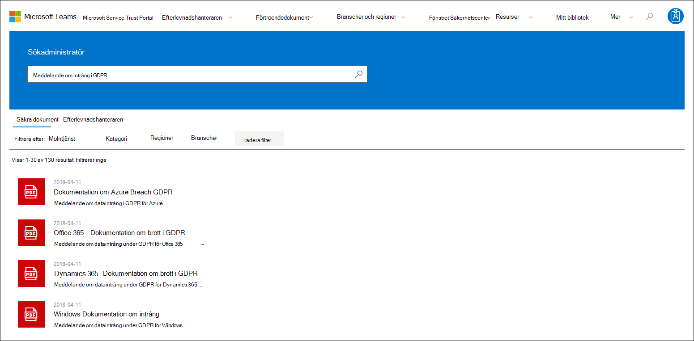
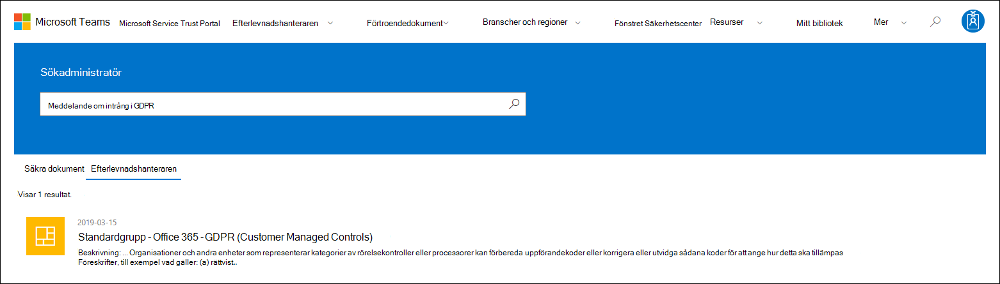
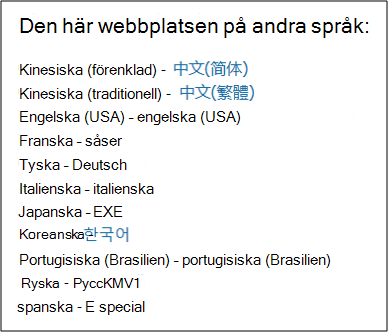
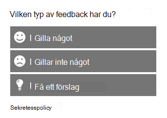

# Komma igång med Microsoft Service Trust PortalGet started with the Microsoft Service Trust Portal

På Microsoft Service Trust Portal finns en mängd olika innehåll, verktyg och andra resurser om microsofts metoder för säkerhet, sekretess och efterlevnad.The Microsoft Service Trust Portal provides a variety of content, tools, and other resources about Microsoft security, privacy, and compliance practices.

## Åtkomst till Service Trust PortalAccessing the Service Trust Portal

Service Trust Portal innehåller information om Microsofts implementering av kontroller och processer som skyddar våra molntjänster och kunddata där.The Service Trust Portal contains details about Microsoft's implementation of controls and processes that protect our cloud services and the customer data therein. För att få åtkomst till vissa resurser på Service Trust Portal måste du logga in som autentiserad användare med ditt Microsoft-konto för molntjänster (antingen ett Azure Active Directory-organisationskonto eller ett Microsoft-konto) och granska och acceptera villkoren för efterlevnadsmaterial från Microsoft.To access some of the resources on the Service Trust Portal, you must log in as an authenticated user with your Microsoft cloud services account (either an Azure Active Directory organization account or a Microsoft Account) and review and accept the Microsoft Non-Disclosure Agreement for Compliance Materials.

### Befintliga kunderExisting customers

Befintliga kunder kan komma åt Service Trust Portal med <https://aka.ms/STP> någon av följande onlineprenumerationer (utvärderingsversion eller betald):Existing customers can access the Service Trust Portal at <https://aka.ms/STP> with one of the following online subscriptions (trial or paid):

- Microsoft 365Microsoft 365
- Dynamics 365Dynamics 365
- AzureAzure

 > [!NOTE]
 > Azure Active Directory som är kopplade till organisationer har tillgång till alla dokument och funktioner, till exempel Efterlevnadshanteraren.Azure Active Directory accounts associated with organizations have access to the full range of documents and features like Compliance Manager. Microsoft-konton som skapats för personlig användning har begränsad åtkomst till Innehåll på Service Trust Portal.Microsoft accounts created for personal use have limited access to Service Trust Portal content.

### Nya kunder och kunder som utvärderar Microsofts onlinetjänsterNew customers and customers evaluating Microsoft online services

Om du vill skapa ett nytt konto eller skapa ett utvärderingskonto använder du något av följande registreringsformulär (används även för utvärderingskonton) för att få åtkomst till STP.To create a new account or to create a trial account, use one of the following sign-up forms (also used for trial accounts) to get access to the STP.

- Registrera dig för ett nytt [Microsoft 365-applikationer för affärsverksamhet eller ett](https://go.microsoft.com/fwlink/p/?LinkID=507653) nytt utvärderingskonto Office 365 Enterprise [utvärderingsversion](https://go.microsoft.com/fwlink/p/?LinkID=698279)Sign up for a new [Microsoft 365 Apps for business trial account](https://go.microsoft.com/fwlink/p/?LinkID=507653) or a new [Office 365 Enterprise trial account](https://go.microsoft.com/fwlink/p/?LinkID=698279)

- Registrera dig för ett nytt [utvärderingskonto för Dynamics 365](https://go.microsoft.com/fwlink/?LinkId=252780)Sign up for a new [Dynamics 365 trial account](https://go.microsoft.com/fwlink/?LinkId=252780)

- Registrera dig för ett nytt [utvärderingskonto för Azure.](https://go.microsoft.com/fwlink/?LinkId=722737)Sign up for a new [Azure trial account](https://go.microsoft.com/fwlink/?LinkId=722737).

När du registrerar dig för en kostnadsfri utvärderingsversion eller en prenumeration måste du aktivera Azure Active Directory stödja åtkomsten till STP.When you sign up for either a free trial, or a subscription, you must enable Azure Active Directory to support your access to the STP.

## Använda Service Trust PortalUsing the Service Trust Portal

Du kommer åt funktionerna och innehållet på Service Trust Portal från huvudmenyn.The Service Trust Portal features and content are accessible from the main menu.

I följande avsnitt beskrivs varje objekt i huvudmenyn.The following sections describe each item in the main menu.

### Service Trust PortalService Trust Portal

Länken **Service Trust Portal** visar startsidan.The **Service Trust Portal** link displays the home page. Det är ett snabbt sätt att gå tillbaka till startsidan.It provides a quick way to get back to the home page.

### EfterlevnadshanterarenCompliance Manager

> [!IMPORTANT]
> Efterlevnadshanteraren har flyttats från Service Trust Portal till den nya platsen i [Microsoft 365 efterlevnadscenter.](https://compliance.microsoft.com/)Compliance Manager has moved from the Service Trust Portal to its new location in the [Microsoft 365 compliance center](https://compliance.microsoft.com/). Alla kunddata har flyttats till den nya platsen så att du kan fortsätta använda Efterlevnadshanteraren utan avbrott.All customer data has been moved over to the new location, so you can continue using Compliance Manager without interruption. Mer information om [inställningar och nya funktioner](compliance-manager.md) finns i dokumentationen för Efterlevnadshanteraren.Refer to the [Compliance Manager documentation](compliance-manager.md) for setup information and to learn about new features. Även om den klassiska versionen av Efterlevnadshanteraren finns kvar i Service Trust Portal uppmanas alla användare att använda efterlevnadshanteraren i Microsoft 365 efterlevnadscenter.Although the classic version of Compliance Manager remains in the Service Trust Portal, all users are encouraged to use Compliance Manager in the Microsoft 365 compliance center.

### FörtroendedokumentTrust Documents

Tillhandahåller en mängd information om säkerhetsimplementering och design med målet att göra det enklare för dig att uppfylla efterlevnadsmålen när du förstår hur Microsoft Cloud-tjänster skyddar dina data.Provides a wealth of security implementation and design information with the goal of making it easier for you to meet regulatory compliance objectives by understanding how Microsoft Cloud services keep your data secure. Om du vill granska innehåll väljer du något av följande alternativ på den **nedmenyn** Betrodda dokument.To review content, select one of the following options on the **Trust Documents** pull-down menu.

- **Granskningsrapporter:** En lista över oberoende gransknings- och utvärderingsrapporter om Microsofts molntjänster visas.**Audit Reports:** A list of independent audit and assessment reports on Microsoft's Cloud services is displayed. De här rapporterna ger information om Microsofts molntjänsters efterlevnad av dataskyddsstandarder och föreskrifter, till exempel:These reports provide information about Microsoft Cloud services compliance with data protection standards and regulatory requirements, such as:

  - Internationella standardiseringsorganisationen (ISO)International Organization for Standardization (ISO)
  - Organisationskontroller för tjänster (SOC)Service Organization Controls (SOC)
  - National Institute of Standards and Technology (NIST)National Institute of Standards and Technology (NIST)
  - Federal Risk and Authorization Management Program (FedRAMP)Federal Risk and Authorization Management Program (FedRAMP)
  - Allmän dataskyddsförordning (GDPR)General Data Protection Regulation (GDPR)

- **Dataskydd:** Innehåller en mängd resurser, till exempel granskade kontroller, informationsblad, vanliga frågor och svar, test av tester, riskutvärderingsverktyg och efterlevnadsguider.**Data Protection:** Contains a wealth of resources such as audited controls, white papers, FAQs, penetration tests, risk assessment tools, and compliance guides.

- **Azure Security and Compliance Blueprints:** Resurser som hjälper dig att skapa säkra och kompatibla molnbaserade program.**Azure Security and Compliance Blueprints:** Resources that help you build secure and compliant cloud-based applications. Det här området innehåller skissvägledning för myndigheter, ekonomi, sjukvård och vertikalförsäljning.This area contain blueprint-guidance for government, finance, healthcare, and retail verticals.

### Branscher & RegionerIndustries & Regions

Tillhandahåller bransch- och regionsspecifik efterlevnadsinformation om Microsoft Cloud-tjänster.Provides industry- and region-specific compliance information about Microsoft Cloud services.

- **Branscher:** För stunden innehåller den här sidan en branschspecifik landningssida för finansiella tjänster.**Industries:** At this time, this page provides an industry-specific landing page the for the Financial Services industry. Den innehåller information som erbjudanden om efterlevnad, vanliga frågor och framgångar.This contains information such as compliance offerings, FAQs, and success stories. Resurser för fler branscher kommer att släppas i framtiden, men du kan hitta resurser för fler branscher genom att gå till sidan Förtroendedokument **> Dataskydd** på STP.Resources for more industries will be released in the future, however you can find resources for more industries by going to the **Trust Documents > Data Protection** page in the STP.

- **Regioner:** Ger juridiska åsikter om microsoft molntjänsters efterlevnad med olika lagar i olika länder.**Regions:** Provides legal opinions on Microsoft Cloud services compliance with various the laws of various countries. Vissa länder är Australien, Kanada, Tjeckien, Danmark, Tyskland, Polen, Rumänien, Spanien och Storbritannien.Specific countries include Australia, Canada, Czech Republic, Denmark, Germany, Poland, Romania, Spain, and the United Kingdom.

### SäkerhetscenterTrust Center

Länkar till [Microsoft Säkerhetscenter](https://www.microsoft.com/trust-center)som ger mer information om säkerhet, efterlevnad och sekretess i Microsoft Cloud.Links to the [Microsoft Trust Center](https://www.microsoft.com/trust-center), which provides more information about security, compliance, and privacy in the Microsoft Cloud. Detta inkluderar information om de funktioner i Microsoft Cloud-tjänster som du kan använda för att hantera specifika krav i GDPR, dokumentation som är användbar för din GDPR-ansvarsskyldighet och för din förståelse av de tekniska och organisatoriska åtgärder som Microsoft har vidtagit för att stödja GDPR.This includes information about the capabilities in Microsoft Cloud services that you can use to address specific requirements of the GDPR, documentation helpful to your GDPR accountability and to your understanding of the technical and organizational measures Microsoft has taken to support the GDPR.

### Mitt bibliotekMy Library

Med den här nya funktionen kan du spara *(eller fästa)* dokument så att du snabbt kan komma åt dem på sidan Mitt bibliotek.This new feature lets you save (or *pin*) documents so that you can quickly access them on your My Library page. Du kan också konfigurera aviseringar så att Microsoft skickar ett e-postmeddelande när dokument i mitt bibliotek uppdateras.You can also set up notifications so that Microsoft sends you an email message when documents in your My Library are updated. Mer information finns i avsnittet [Mitt bibliotek](#my-library-1) i den här artikeln.For more information, see the [My Library](#my-library-1) section in this article.

### MerMore

Gå till **Mer > administratör för** att få åtkomst till administrativa funktioner som bara är tillgängliga för det globala administratörskontot.Go to **More > Admin** to access administrative functions that are only available to the global administrator account. Det här alternativet visas bara om du är inloggad som global administratör.This option is visible only when you are signed in as a global administrator. Det finns två alternativ i **den nedmenyn** för administratörer:There are two options in the **Admin** pull-down menu:

- **Inställningar:** På den här sidan kan du tilldela användarroller för Efterlevnadshanteraren (klassisk).**Settings:** This page lets you assign user roles for Compliance Manager (classic).

- **Användarsekretess Inställningar:** På den här sidan kan du exportera en rapport som innehåller uppgifter om åtgärdsobjekt i Efterlevnadshanteraren (klassisk) för en viss användare.**User Privacy Settings:** This page lets you export a report that contains action item assignments in Compliance Manager (classic) for a specific user. Du kan också omtilldela alla uppgifter till en annan användare och ta bort tilldelade åtgärdsobjekt från den angivna användaren.You can also reassign all action items to a different user and remove any assigned action item from the specified user.

### SökaSearch

Klicka på förstoringsglaset i det övre högra hörnet på sidan Service Trust Portal för att expandera rutan, ange sökord och tryck på **Retur.**Click the magnifying glass in the upper right-hand corner of the Service Trust Portal page to expand the box, enter your search terms, and press **Enter**. **Söksidan** visas med sökordet i sökrutan och sökresultaten nedan.The **Search** page is displayed, with the search term displayed in the search box and the search results listed below.

Som standard returnerar sökningen dokumentresultat.By default, the search returns document results. Du kan filtrera resultaten med listrutan för att förfina listan med dokument som visas.You can filter the results by using the dropdown lists to refine the list of documents displayed. Du kan använda flera filter för att begränsa listan med dokument.You can use multiple filters to narrow the list of documents. Filter omfattar specifika molntjänster, kategorier av efterlevnads- eller säkerhetsrutiner, regioner och branscher.Filters include the specific cloud services, categories of compliance or security practices, regions, and industries. Klicka på länken med dokumentnamnet om du vill ladda ned dokumentet.Click the document name link to download the document.

Om du vill lista kontroller från utvärderingar i Efterlevnadshanteraren (klassisk) som relaterar till dina söktermer klickar du **på Efterlevnadshanteraren.**To list controls from Assessments in Compliance Manager (classic) related your search terms, click **Compliance Manager**. Sökresultatet visar datumet då utvärderingen skapades, namnet på utvärderingsgruppen, aktuell Microsoft Cloud-tjänst och om kontrollen är Microsoft eller Kund hanterad.The search results show the date the assessment was created, the name of the assessment grouping, the applicable Microsoft Cloud service, and whether the control is Microsoft or Customer Managed. Klicka på namnet på kontrollen för att visa kontrollen i Utvärdering i efterlevnadshanteraren (klassisk).Click the name of the control to view the control in the Assessment in Compliance Manager (classic).

> [!NOTE]
> Rapporter och dokument från Service Trust Portal finns att hämta i minst 12 månader efter publiceringen eller tills en ny version av dokumentet blir tillgänglig.Service Trust Portal reports and documents are available to download for at least 12 months after publishing or until a new version of document becomes available.

## Mitt bibliotekMy Library

Använd funktionen Mitt bibliotek för att lägga till dokument och resurser på Service Trust Portal på sidan Mitt bibliotek.Use the My Library feature to add documents and resources on the Service Trust Portal to your My Library page. På så sätt kan du öppna dokument som är relevanta för dig på en och samma plats.This lets you access documents that are relevant to you in a single place.  Om du vill lägga till ett dokument i mitt bibliotek klickar du på **...** -menyn till höger om ett dokument och väljer **sedan Spara i bibliotek**.To add a document to your My Library, click the **...** menu to the right of a document and then select **Save to library**. Du kan lägga till flera dokument i Mitt bibliotek genom att klicka  på kryssrutan bredvid ett eller flera dokument och sedan klicka på Spara i bibliotek högst upp på sidan.You can add multiple documents to your My Library by clicking the checkbox next to one or more documents, and then clicking **Save to library** at the top of the page.

Med meddelandefunktionen kan du dessutom konfigurera Mitt bibliotek så att du får ett e-postmeddelande när Microsoft uppdaterar ett dokument som du har lagt till i mitt bibliotek.Additionally, the notifications feature lets you configure your My Library so that an email message is sent to you whenever Microsoft updates a document that you've added to your My Library. Om du vill konfigurera aviseringar går du till mitt bibliotek och klickar på **Avisering Inställningar**.To set up notifications, go to your My Library and click **Notification Settings**. Du kan välja hur ofta aviseringar ska skickas och ange en e-postadress i din organisation som aviseringar ska skickas till.You can choose the frequency of notifications and specify an email address in your organization to send notifications to. E-postmeddelanden innehåller länkar till de dokument som har uppdaterats och en kort beskrivning av uppdateringen.Email notifications include links to the documents that have been updated and a brief description of the update.

Observera även att vi identifierar alla dokument i mitt bibliotek som har uppdaterats under de senaste 30 dagarna, oavsett om du aktiverar aviseringar eller inte.Also note that we identify any documents in your My Library that have been updated within the last 30 days, regardless of whether or not you turn on notifications. En kort beskrivning av uppdateringen visas också i en verktygsbeskrivning.A brief description of the update is also displayed in a tool tip.

## StartpaketStarter packs

Startpaket är en Microsoft-särskild uppsättning dokumentation om Microsoft Cloud-tjänster för specifika branscher.Starter packs are a Microsoft-curated set of documentation about Microsoft Cloud services for specific industries. För närvarande erbjuder Service Trust Portal följande tre startpaket för organisationer med finansiella tjänster.Currently, the Service Trust Portal offers the following three starter packs for financial services organizations. Med de här startpaketen kan organisationer utvärdera säkerhet, efterlevnad och sekretess i Microsoft Cloud och tillhandahålla vägledning för att implementera Microsoft Cloud-tjänster i den hårt reglerade finansiella tjänster.These starter packs help organizations evaluate and assess security, compliance, and privacy in the Microsoft Cloud and provide guidance to help implement Microsoft Cloud services in the highly regulated financial services industry.

- **Evaluation Starter Pack:** Används för tidig utvärdering av Microsoft-molnet för organisationer med finansiella tjänster.**Evaluation Starter Pack:** Use for early evaluation of the Microsoft cloud for financial services organizations.

- **Assessment Starter Pack:** Efter utvärderingen använder du checklistorna och andra råd i det här startpaketet för att hjälpa din organisation att bedöma risker relaterade till säkerhet, efterlevnad och sekretess.**Assessment Starter Pack:** After evaluation, use the checklists and other guidance in this starter pack to help your organization assess risks related to security, compliance, and privacy.

- **Audit Starter Pack:** Använd det här startpaketet för vägledning om hur du använder granskningskontroller och andra verktyg för att underlätta implementeringen av Microsoft Cloud-tjänster på ett sätt som hjälper till att minska exponeringen mot risk i organisationen.**Audit Starter Pack:** User this starter pack for guidance on using auditing controls and other tool to help guide your implementation of Microsoft Cloud services in a way that helps reduce your organization's exposure to risk.

Om du vill komma åt de här startpaketen går du till **Service Trust Portal > Industries & Regions > Industry Solutions > Financial Services.**To access these starter packs, go to **Service Trust Portal > Industries & Regions > Industry Solutions > Financial Services**. Du kan öppna eller ladda ned dokument från ett startpaket eller spara dem i Mitt bibliotek.You can open or a download documents from a starter pack or save them to your My Library.

## Stöd för lokaliseringLocalization support

Med Service Trust Portal kan du visa sidinnehållet på olika språk.The Service Trust Portal enables you to view the page content in different languages. Om du vill ändra språk för sidan klickar du på globikonen i det nedre vänstra hörnet på sidan och väljer önskat språk.To change the page language, simply click on the globe icon in the lower left corner of the page and select the language of your choice.

## Ge feedbackGive feedback

Vi kan hjälpa dig med frågor om Service Trust Portal eller med fel som uppstår när du använder portalen.We can help with questions about the Service Trust Portal, or errors you experience when you use the portal. Du kan också kontakta oss med frågor och feedback om Service Trust Portals efterlevnadsrapporter och förtroenderesurser med hjälp av länken Feedback längst ned på STP-sidorna.You can also contact us with questions and feedback about Service Trust Portal compliance reports and trust resources by using the Feedback link on the bottom of the STP pages.

Det är viktigt för oss att få din feedback.Your feedback is important to us. Klicka på Feedback-knappen längst ned på sidan om du vill berätta vad du tyckte var det eller inte tyckte om, eller lämna förslag som på produkt- och produktfunktioner som förbättras.Click on the Feedback button at the bottom of the page to send us comments about what you did or did not like, or suggestions you may have for improving our products or product features.

