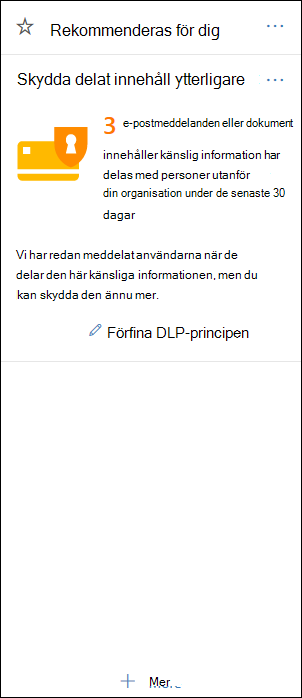
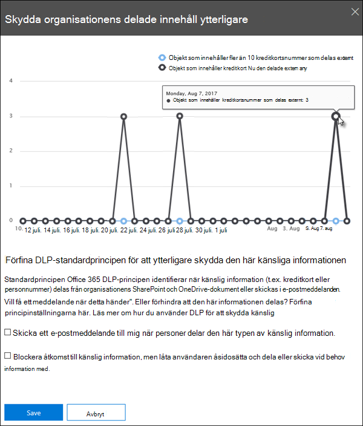

# Kom igång med DLP-standardprincipenGet started with the default DLP policy

Innan du ens har skapat din första DLP-princip (Data Loss Prevention) hjälper DLP till att skydda känslig information med en standardprincip.Before you even create your first data loss prevention (DLP) policy, DLP is helping to protect your sensitive information with a default policy. Den här standardprincipen och dess rekommendation (visas nedan) hjälper dig att skydda känsligt innehåll genom att meddela dig när e-post eller dokument som innehåller ett kreditkortsnummer har delats med någon utanför organisationen.This default policy and its recommendation (shown below) help keep your sensitive content secure by notifying you when email or documents containing a credit card number were shared with someone outside your organization. Du ser den här rekommendationen på **startsidan** för &amp; Säkerhetsefterlevnadscenter.You'll see this recommendation on the **Home** page of the Security &amp; Compliance Center. 
  
Du kan använda den här widgeten för att snabbt visa när och hur mycket känslig information som har delats, och sedan förfina standard-DLP-principen med bara ett eller två klick.You can use this widget to quickly view when and how much sensitive information was shared, and then refine the default DLP policy in just a click or two. Du kan också redigera standard-DLP-principen när som helst eftersom den är helt anpassningsbar.You can also edit the default DLP policy at any time because it's fully customizable. Observera att om du inte ser rekommendationen från början kan du prova att klicka på **+Mer** längst ned i **avsnittet Rekommenderas för** dig.Note that if you don't see the recommendation at first, try clicking **+More** at the bottom of the **Recommended for you** section. 
  

  
## Visa rapporten och förfina DLP-standardprincipenView the report and refine the default DLP policy

När widgeten visar att användarna har delat känslig information med personer utanför organisationen väljer du **Förfina DLP-principen** längst ned.When the widget shows you that users have shared sensitive information with people outside your organization, choose **Refine DLP policy** at the bottom. 
  
I den detaljerade rapporten visas när och hur mycket innehåll som innehåller kreditkortsnummer som delats de senaste 30 dagarna.The detailed report shows you when and how much content containing credit card numbers was shared in the past 30 days. Observera att regelmatchning kan ta upp till 48 timmar innan de visas i widgeten.Note that rule matches can take up to 48 hours to show up in the widget.
  
Standardprincipen för DLP gör följande för att skydda den känsliga informationen:To help protect the sensitive information, the default DLP policy:
  
- Upptäcker när innehåll i Exchange, SharePoint och OneDrive som innehåller minst ett kreditkortsnummer delas med personer utanför organisationen.Detects when content in Exchange, SharePoint, and OneDrive that contains at least one credit card number is shared with people outside your organization.
    
- Visar ett principtips och skickar ett e-postmeddelande till användare när de försöker dela den här känsliga informationen med personer utanför organisationen.Shows a policy tip and sends an email notification to users when they attempt to share this sensitive information with people outside your organization. Mer information om de här alternativen finns i Skicka [e-postmeddelanden och visa principtips för DLP-principer.](use-notifications-and-policy-tips.md)For more information on these options, see [Send email notifications and show policy tips for DLP policies](use-notifications-and-policy-tips.md).
    
- Genererar detaljerade aktivitetsrapporter så att du kan spåra sådant som vem som har delat innehållet med personer utanför organisationen och när de gjorde det.Generates detailed activity reports so that you can track things like who shared the content with people outside your organization and when they did it. Du kan använda [DLP-rapporter och](view-the-dlp-reports.md) [granskningsloggdata](search-the-audit-log-in-security-and-compliance.md) (där **aktivitet**  =  **DLP**) för att visa den här informationen.You can use the [DLP reports](view-the-dlp-reports.md) and [audit log data](search-the-audit-log-in-security-and-compliance.md) (where **Activity** = **DLP**) to see this information.
    
Om du snabbt vill förfina standard-DLP-principen kan du välja att följande ska användas:To quickly refine the default DLP policy, you can choose to have it:
  
- Skicka ett e-postmeddelande med en incidentrapport när användare delar den här känsliga informationen med personer utanför organisationen.Send you an incident report email when users share this sensitive information with people outside your organization.
    
- Lägg till andra användare i e-posthändelserapporten.Add other users to the email incident report.
    
- Blockera åtkomst till innehåll som innehåller känslig information, men tillåt användaren att åsidosätta och dela eller skicka vid behov.Block access to the content containing the sensitive information, but allow the user to override and share or send if they need to.
    
Mer information om incidentrapporter eller om att begränsa åtkomst finns i Referens [för dataförlustskydd.](data-loss-prevention-policies.md)For more information on incident reports or restricting access, see [Data loss prevention reference](data-loss-prevention-policies.md).
  
Om du vill ändra de här alternativen senare kan du redigera standard-DLP-principen när som helst – se nästa avsnitt.If you want to change these options later, you can edit the default DLP policy at any time - see the next section.
  

  
## Redigera standard-DLP-principenEdit the default DLP policy

Den här principen heter **Standard-DLP-princip** och visas under **Skydd mot dataförlust** **på** sidan Princip i &amp; Säkerhetsefterlevnadscenter.This policy is named **Default DLP policy** and appears under **Data loss prevention** on the **Policy** page of the Security &amp; Compliance Center. 
  
Den här principen är helt anpassningsbar, samma som alla DLP-princip du skapar själv från grunden.This policy is fully customizable, the same as any DLP policy that you create yourself from scratch. Du kan också inaktivera eller ta bort principen så att användarna inte längre får principtips eller e-postaviseringar.You can also turn off or delete the policy, so that your users no longer receive policy tips or email notifications.
  

  
## När widgeten visas och inte visasWhen the widget does and does not appear

Widgeten **Med namnet Ytterligare skydd av** delat innehåll visas i **avsnittet** Rekommenderas för dig **på sidan** Start i &amp; Säkerhetsefterlevnadscenter.The widget named **Further protect shared content** appears in the **Recommended for you** section of the **Home** page of the Security &amp; Compliance Center. 
  
Den här widgeten visas bara om:This widget appears only when:
  
- Det finns inga principer för dataförlustskydd i &amp; Säkerhetsefterlevnad eller Exchange administrationscenter.There are no data loss prevention policies in the Security &amp; Compliance Center or Exchange admin center. Den här widgeten är avsedd att hjälpa dig att komma igång med DLP, så den visas inte om du redan har DLP-principer.This widget is intended to help you get started with DLP, so it doesn't appear if you already have DLP policies.
    
- Innehåll som innehåller minst ett kreditkort har delats med någon utanför organisationen under de senaste 30 dagarna.Content containing least one credit card has been shared with someone outside your organization in the past 30 days.
    
Observera att regelmatchning kan ta upp till 48 timmar innan widgeten är tillgänglig, så när känslig information som delas externt har upptäckts kan det ta upp till två dagar innan rekommendationen visas.Note that rule matches can take up to 48 hours to be available to the widget, so after sensitive information shared externally is detected, it may take up to two days for the recommendation to appear.
  
Slutligen försvinner widgeten från startsidan när du använder widgeten för  att förfina standard-DLP-principen.Finally, after you use the widget to refine the default DLP policy, the widget disappears from the **Home** page. 
  

