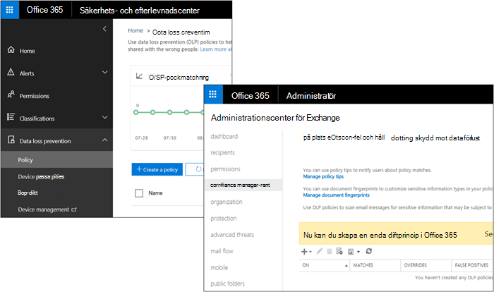

# Hur DLP fungerar mellan efterlevnadscentret Microsoft 365 och Exchange administrationscenterHow DLP works between the Microsoft 365 Compliance Center and Exchange admin center

I Microsoft 365 kan du skapa en DLP-princip (Data Loss Prevention) i två olika administrationscenter:In Microsoft 365, you can create a data loss prevention (DLP) policy in two different admin centers:
  
- I **Microsoft 365 efterlevnadscenter** kan du skapa en enda DLP-princip för att skydda innehåll i SharePoint, OneDrive, Exchange, Teams och nu Slutpunkt-enheter.In the **Microsoft 365 Compliance Center**, you can create a single DLP policy to help protect content in SharePoint, OneDrive, Exchange, Teams, and now Endpoint Devices. Vi rekommenderar att du skapar en DLP-princip här.We recommend that you create a DLP policy here. Mer information finns i Referens [för dataförlustskydd.](data-loss-prevention-policies.md)For more information, see [Data Loss Prevention reference](data-loss-prevention-policies.md).
    
- I Exchange **kan du skapa** en DLP-princip för att endast skydda innehåll i Exchange.In the **Exchange admin center**, you can create a DLP policy to help protect content only in Exchange. Den här principen kan Exchange e-postflödesregler (kallas även transportregler), vilket innebär att det finns fler alternativ för hantering av e-post.This policy can use Exchange mail flow rules (also known as transport rules), so it has more options specific to handling email. Mer information finns i [DLP i Exchange administrationscenter.](/exchange/security-and-compliance/data-loss-prevention/data-loss-prevention)For more information, see [DLP in the Exchange admin center](/exchange/security-and-compliance/data-loss-prevention/data-loss-prevention).
    
DLP-information som skapats i dessa administrationscenter fungerar sida vid sida – i det här avsnittet förklaras hur.DLP polices created in these admin centers work side by side - this topic explains how.
  

  
## Hur DLP i säkerhets- & säkerhets- och efterlevnadscenter fungerar med DLP- och e-postflödesregler i Exchange administrationscenterHow DLP in the Security & Compliance Center works with DLP and mail flow rules in the Exchange admin center

När du har skapat en DLP-princip i Säkerhets- & säkerhets- och efterlevnadscenter distribueras principen till alla platser som ingår i principen.After you create a DLP policy in the Security & Compliance Center, the policy is deployed to all of the locations included in the policy. Om principen innehåller Exchange Online synkroniseras principen där och tillämpas på exakt samma sätt som en DLP-princip som skapas Exchange administrationscentret.If the policy includes Exchange Online, the policy's synced there and enforced in exactly the same way as a DLP policy created in the Exchange admin center. 
  
Om du har skapat DLP-principer i administrationscentret för Exchange kommer de principerna att fortsätta att fungera sida vid sida med eventuella principer för e-post som du skapar i Säkerhets- och & efterlevnadscenter.If you've created DLP policies in the Exchange admin center, those policies will continue to work side by side with any policies for email that you create in the Security & Compliance Center. Observera dock att regler som skapats Exchange administratörscenter har företräde.But note that rules created in the Exchange admin center take precedence. Alla Exchange e-postflödesregler bearbetas först, och sedan bearbetas DLP-& säkerhets- och efterlevnadscentret.All Exchange mail flow rules are processed first, and then the DLP rules from the Security & Compliance Center are processed.
  
Det innebär följande:This means that:
  
- Meddelanden som blockeras av Exchange genomsöks inte av DLP-regler som skapats i Säkerhets- och & säkerhets- och efterlevnadscenter.Messages that are blocked by Exchange mail flow rules won't get scanned by DLP rules created in the Security & Compliance Center.

- Meddelanden som har satts i Exchange e-postflödesregler eller andra filter körs innan DLP genomsöks inte av DLPMessages that are quarantined by Exchange mail flow rules or any other filters run before DLP will not be scanned by DLP
    
- Om en Exchange-e-postflödesregel ändrar ett meddelande på ett sätt som gör att det matchar en DLP-princip i Säkerhets- och efterlevnadscenter för & – som att lägga till externa användare – identifierar DLP-reglerna den här och tillämpar principen efter behov.If an Exchange mail flow rule modifies a message in a way that causes it to match a DLP policy in the Security & Compliance Center - such as adding external users - then the DLP rules will detect this and enforce the policy as needed.
    
Observera även att Exchange-postflödesregler som använder åtgärden "stoppa bearbetning" inte påverkar bearbetningen av D & LP-regler i säkerhets- och efterlevnadscentret – de bearbetas fortfarande.Also note that Exchange mail flow rules that use the "stop processing" action don't affect the processing of DLP rules in the Security & Compliance Center - they'll still be processed.
  
## Principtips i Säkerhets- & Säkerhets- och efterlevnadscenter Exchange administrationscentretPolicy tips in the Security & Compliance Center vs. the Exchange admin center

Principtips kan antingen fungera med DLP-principer och e-postflödesregler som skapats i administrationscentret för Exchange eller med DLP-principer som skapats i säkerhets- och &-efterlevnadscentret, men inte båda.Policy tips can work either with DLP policies and mail flow rules created in the Exchange admin center, or with DLP policies created in the Security & Compliance Center, but not both. Det beror på att dessa principer lagras på olika platser, men principtips kan endast ritas från en enda plats.This is because these policies are stored in different locations, but policy tips can draw only from a single location.
  
Om du har konfigurerat principtips i administrationscentret för Exchange visas inga principtips som du konfigurerar i säkerhets- och efterlevnadscentret för & i Outlook på webben och Outlook 2013 eller senare förrän du stänger av tipsen i administrationscentret för Exchange.If you've configured policy tips in the Exchange admin center, any policy tips that you configure in the Security & Compliance Center won't appear to users in Outlook on the web and Outlook 2013 and later until you turn off the tips in the Exchange admin center. Det säkerställer att dina Exchange-postflödesregler fortsätter att fungera tills du väljer att växla över till Säkerhets- & efterlevnadscenter.This ensures that your current Exchange mail flow rules will continue to work until you choose to switch over to the Security & Compliance Center.
  
Observera att även om principtips bara kan ritas från en enda plats skickas alltid e-postaviseringar, även om du använder DLP-principer i både Säkerhets- och efterlevnadscenter & och administrationscentret för Exchange.Note that while policy tips can draw only from a single location, email notifications are always sent, even if you're using DLP policies in both the Security & Compliance Center and the Exchange admin center.
