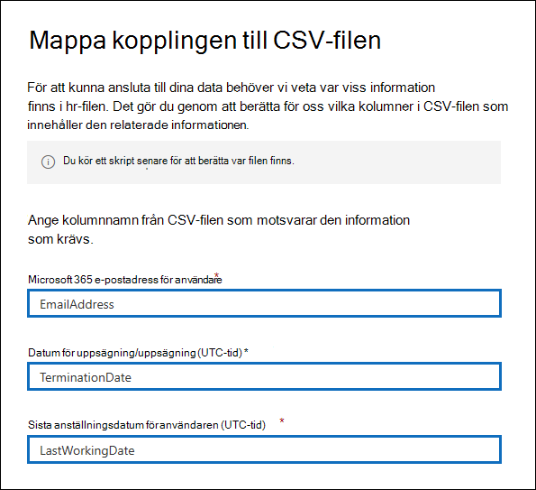
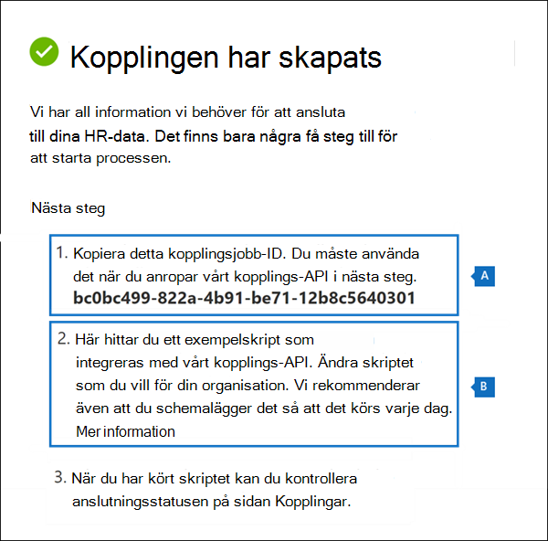
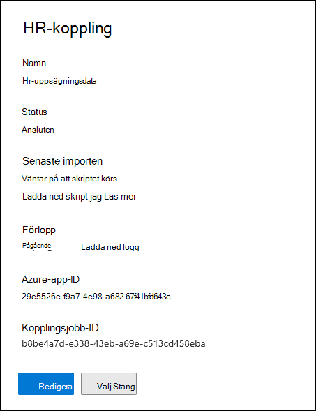
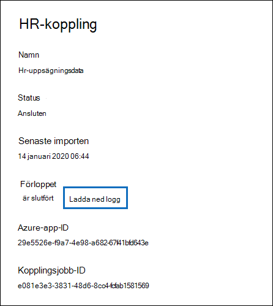
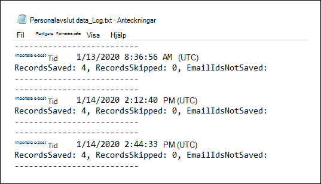
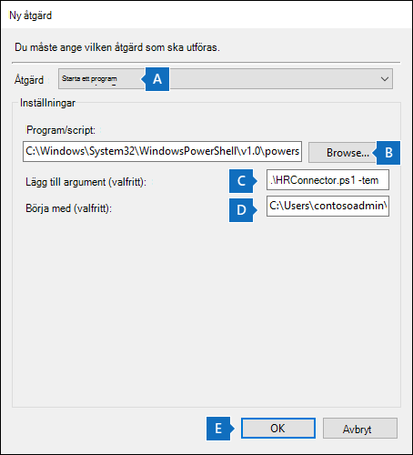
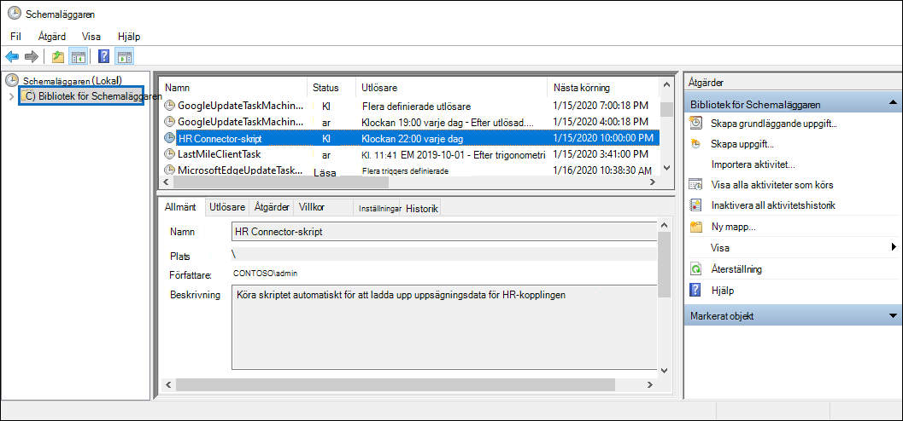

# <a name="set-up-a-connector-to-import-hr-data-in-us-government"></a>Konfigurera en anslutare för att importera HR-data i amerikanska myndigheter

Du kan konfigurera en datakoppling i kompatibilitetscentret för Microsoft 365 för att importera hr-data till organisationen för myndigheter i USA. HR-relaterade data omfattar det datum då en anställd skickade in sin leverans och datum för den anställdes sista dag. Dessa HR-data kan sedan användas av Microsofts informationsskyddslösningar, till exempel [insider-riskhanteringslösningen,](insider-risk-management.md)för att skydda organisationen från skadlig aktivitet eller datastöld i organisationen. Konfigurera en HR-koppling består av att skapa en app i Azure Active Directory som används för autentisering av koppling, skapa en CSV-mappning av filer som innehåller dina HR-data, skapa en datakoppling i efterlevnadscentret och sedan köra ett skript (på schemalagd basis) som matar in HR-data i CSV-filen i Microsoft-molnet. Sedan används datakopplingen av insider-riskhanteringsverktyget för att få åtkomst till HR-data som importerats till din Microsoft 365 amerikanska myndigheter.

## <a name="before-you-begin"></a>Innan du börjar

- Den användare som skapar HR-kopplingen i steg 3 måste tilldelas rollen Importera och exportera postlåda i Exchange Online. Som standard är den här rollen inte tilldelad någon rollgrupp i Exchange Online. Du kan lägga till rollen Importera och exportera postlåda i rollgruppen Organisationshantering i Exchange Online. Du kan också skapa en ny rollgrupp, tilldela rollen Importera och exportera postlåda och sedan lägga till lämpliga användare som medlemmar. Mer information finns i avsnitten [Skapa rollgrupper](/Exchange/permissions-exo/role-groups#create-role-groups) och [Ändra rollgrupper](/Exchange/permissions-exo/role-groups#modify-role-groups) i artikeln "Hantera rollgrupper i Exchange Online".

- Du måste bestämma hur du hämtar eller exporterar data från organisationens HR-system (regelbundet) och lägga till dem i CSV-filen som beskrivs i steg 2. Skriptet som du kör i steg 4 laddar upp HR-data i CSV-filen till Microsoft-molnet.

- Exempelskriptet som du kör i steg 4 laddar upp HR-data till Microsoft-molnet så att de kan användas av andra Microsoft-verktyg, till exempel insider-riskhanteringslösningen. Det här exempelskriptet stöds inte under något standardsupportprogram eller någon standardsupporttjänst från Microsoft. Exempelskriptet ges i befintligt skick utan garantier av något slag. Vidare frånsäger sig Microsoft alla underförstådda garantier, inklusive, men inte begränsat till, underförstådda garantier om säljbarhet eller lämplighet för ett visst ändamål. Hela risken i samband med användningen av eller prestandan hos exempelskriptet och dokumentationen vilar på dig. Under inga omständigheter ska Microsoft, dess upphovspersoner eller någon annan som är involverad i skapandet, produktionen eller leveransen av skripten hållas ansvariga för någon som helst skada (inklusive, men inte begränsat till, skador avseende utebliven vinst, driftavbrott, förlust av affärsinformation eller annan ekonomisk skada) som uppstår till följd av användning eller svårighet eller omöjlighet att använda exempelskripten eller dokumentationen, även om Microsoft har fått information om att sådana skador kan uppstå.

## <a name="step-1-create-an-app-in-azure-active-directory"></a>Steg 1: Skapa en app i Azure Active Directory

Det första steget är att skapa och registrera en ny app i Azure Active Directory (Azure AD). Appen motsvarar HR-kopplingen som du skapar i steg 3. När du skapar det här programmet kan Azure AD autentisera HR-kopplingen när den körs och försöker få åtkomst till din organisation. Det här programmet används också för att autentisera skriptet som du kör i steg 4 för att ladda upp dina HR-data till Microsoft-molnet. När den här Azure AD-appen skapas sparar du följande information. Dessa värden används i senare steg.

- Azure AD-program-ID (kallas även *app-ID* eller *klient-ID)*

- Azure AD-programhemlighet (kallas även *klienthemlighet)*

- Klientorganisations-ID (kallas även *katalog-ID*)

Stegvisa instruktioner för hur du skapar en app i Azure AD finns i [Registrera ett program med Microsofts identitetsplattform.](/azure/active-directory/develop/quickstart-register-app)

## <a name="step-2-prepare-a-csv-file-with-your-hr-data"></a>Steg 2: Förbereda en CSV-fil med dina HR-data

Nästa steg är att skapa en CSV-fil som innehåller information om anställda som har lämnat organisationen. Enligt operativsystemets förklaring i avsnittet Innan du börjar måste du bestämma hur du ska skapa CSV-filen från organisationens HR-system. I följande exempel visas en slutförd CSV-fil (som öppnas i Anteckningsblock) som innehåller de tre obligatoriska parametrarna (kolumner). Det är mycket enklare att redigera CSV-filen i Microsoft Excel.

```text
EmailAddress,TerminationDate,LastWorkingDate
sarad@contoso.com,2019-04-23T15:18:02.4675041+05:30,2019-04-29T15:18:02.4675041+05:30
pilarp@contoso.com,2019-04-24T09:15:49Z,2019-04-29T15:18:02.7117540
```

CSV-filens första rad, eller rubrikraden, innehåller de kolumnnamn som krävs. Namnet som används i varje kolumnrubrik är upp till dig (i föregående exempel visas förslag). Men samma kolumnnamn som du använder i CSV-filen *måste* anges när du skapar HR-kopplingen i steg 3. Ta inte med blanksteg i kolumnnamnen.

I följande tabell beskrivs varje kolumn i CSV-filen:

| Kolumnnamn | Beskrivning |
|:-----|:-----|
| **EmailAddress** <br/> |Anger e-postadressen till den uppsagda medarbetaren.|
| **TerminationDate** <br/> |Anger det datum då personens anställning officiellt avslutats i din organisation. Det kan till exempel vara det datum då den anställda gav sin avisering om att lämna organisationen. Det här datumet kan vara ett annat än datumet för personens sista arbetsdag. Använd följande datumformat: , som är datum- och `yyyy-mm-ddThh:mm:ss.nnnnnn+|-hh:mm` [tidsformatet i ISO 8601.](https://www.iso.org/iso-8601-date-and-time-format.html)|
|**LastWorkingDate**|Anger den sista dagen av arbete för den uppsagda medarbetaren. Använd följande datumformat: , som är datum- och `yyyy-mm-ddThh:mm:ss.nnnnnn+|-hh:mm` [tidsformatet i ISO 8601.](https://www.iso.org/iso-8601-date-and-time-format.html)|
|||

När du har skapat CSV-filen med nödvändiga HR-data ska du lagra den på samma system som skriptet som du kör i steg 4. Se till att implementera en uppdateringsstrategi så att CSV-filen alltid innehåller den senaste informationen. När du gör det överförs de senaste uppsägningsdata om anställda till Microsoft-molnet, oavsett vilket du kör skriptet.

## <a name="step-3-create-the-hr-connector"></a>Steg 3: Skapa HR-kopplingen

Nästa steg är att skapa en HR-koppling i Microsoft 365 för efterlevnadscenter. När du har kört skriptet i steg 4 kommer HR-kopplingen som du skapar att mata in HR-data från CSV-filen till Microsoft 365 organisation. I det här steget måste du kopiera jobb-ID:t som skapades när du skapar kopplingen. Du kommer att använda jobb-ID när du kör skriptet.

1. Gå till [https://compliance.microsoft.com](https://compliance.microsoft.com) och klicka sedan på Datakopplingar i den vänstra **navigeringsfältet.**

2. På sidan **Datakopplingar** under **HR klickar** du på **Visa**.

3. På sidan **HR klickar** du på Lägg **till koppling.**

4. På sidan **Autentiseringsuppgifter** gör du följande och klickar sedan på **Nästa:**

   1. Skriv eller klistra in Azure AD-program-ID för Azure-appen som du skapade i steg 1.

   1. Ange ett namn för HR-kopplingen.

5. På sidan **Filmappning** skriver du namnen på de tre kolumnrubrikerna (kallas även *parametrar)* från CSV-filen som du skapade i steg 2 i alla lämpliga rutor. Namnen är inte ärendekänsliga. Som tidigare förklarats måste namnen som du skriver i de här rutorna matcha parameternamnen i CSV-filen. På följande skärmbild visas till exempel parameternamnen från exemplet i CSV-exempelfilen som visas i steg 2.

   

6. På sidan **Granska** granskar du inställningarna och klickar sedan på **Slutför för** att skapa kopplingen.

   En statussida visas som bekräftar att anslutningen skapades. Den här sidan innehåller två viktiga saker som du måste slutföra nästa steg för att köra exempelskriptet för att ladda upp dina HR-data.

   

   1. **Jobb-ID.** Du behöver det här jobb-ID:t för att köra skriptet i nästa steg. Du kan kopiera den från den här sidan eller från kopplingssidan.
   
   1. **Länka till exempelskript.** Klicka på **länken här** för att gå GitHub webbplatsen för att komma åt exempelskriptet (länken öppnar ett nytt fönster). Låt det här fönstret vara öppet så att du kan kopiera skriptet i steg 4. Alternativt kan du bokmärka målet eller kopiera URL-adressen så att du kan komma åt den igen i steg 4. Den här länken är också tillgänglig på kopplingssidan.

7. Klicka på **Klar**.

   Den nya kopplingen visas i listan på **fliken Kopplingar.** 

8. Klicka på hr-kopplingen som du just har skapat för att visa den utfällade sidan, som innehåller egenskaper och annan information om kopplingen.

   

   Om du inte redan har gjort det kan du kopiera värdena för **Azure-app-ID** och **kopplingsjobb-ID.** Du behöver dem för att köra skriptet i nästa steg. Du kan också ladda ned skriptet från den utfällsbara sidan (eller ladda ned det med hjälp av länken i nästa steg).)

   Du kan också klicka **på Redigera** om du vill ändra namnen på Azure-app-id:t eller kolumnrubrikerna som du definierade på **sidan Filmappning.**

## <a name="step-4-run-the-sample-script-to-upload-your-hr-data"></a>Steg 4: Kör exempelskriptet för att ladda upp hr-data

Det sista steget för att konfigurera en HR-koppling är att köra ett exempelskript som laddar upp PERSONAL-data i CSV-filen (som du skapade i steg 2) till Microsoft-molnet. Mer specifikt laddar skriptet upp data till HR-kopplingen. När du har kört skriptet importerar HR-kopplingen som du skapade i steg 3 PERSONAL-data till din Microsoft 365-organisation där den kan kommas åt av andra efterlevnadsverktyg, till exempel Insider-riskhanteringslösningen. När du har kört skriptet kan du schemalägga en aktivitet så att den körs automatiskt varje dag, så att de mest aktuella data om uppsägning av anställda laddas upp till Microsoft-molnet. Se [Schemalägga skriptet så att det körs automatiskt](#optional-step-6-schedule-the-script-to-run-automatically).

1. Gå till det fönster som du lämnade öppet från föregående steg för att komma GitHub webbplatsen med exempelskriptet. Du kan också öppna den bokmärkta webbplatsen eller använda url-adressen som du kopierade.

2. Klicka på **raw-knappen** för att visa skriptet i textvyn.

3. Kopiera alla rader i exempelskriptet och spara dem sedan i en textfil.

4. Ändra exempelskriptet för din organisation, om det behövs.

5. Spara textfilen som en Windows PowerShell skriptfil med ett filnamnssuffix på till `.ps1` exempel `HRConnector.ps1` .

6. Öppna en kommandotolk på den lokala datorn och gå till katalogen där du sparade skriptet.

7. Kör följande kommando för att ladda upp HR-data i CSV-filen till Microsoft-molnet: till exempel:

    ```powershell
    .\HRConnector.ps1 -tenantId <tenantId> -appId <appId>  -appSecret <appSecret>  -jobId <jobId>  -csvFilePath '<csvFilePath>'
    ```

   I följande tabell beskrivs de parametrar som ska användas med skriptet och deras obligatoriska värden. Informationen som du fick i föregående steg används i värdena för dessa parametrar.

   | Parameter | Beskrivning |
   |:-----|:-----|:-----|
   |`tenantId`|Id för din organisation Microsoft 365 du fick i steg 1. Du kan också hämta organisationens klient-ID i **översiktsbladet** i Azure AD-administrationscentret. Används för att identifiera din organisation.|
   |`appId` |Azure AD-program-ID för appen som du skapade i Azure AD i steg 1. Det här används av Azure AD för autentisering när skriptet försöker komma åt din Microsoft 365 organisation. |
   |`appSecret`|Azure AD-programhemligheten för appen som du skapade i Azure AD i steg 1. Detta används även för autentisering.|
   |`jobId`|Jobb-ID för hr-kopplingen som du skapade i steg 3. Detta används för att associera HR-data som laddas upp till Microsoft-molnet med HR-kopplingen.|
   |`csvFilePath`|Sökvägen till CSV-filen (lagrad på samma system som skriptet) som du skapade i steg 2. Försök att undvika blanksteg i sökvägen. Använd annars enkla citattecken.|
   |||
   
   Här är ett exempel på syntaxen för HR-kopplingsskriptet med faktiska värden för varje parameter:

   ```powershell
    .\HRConnector.ps1 -tenantId d5723623-11cf-4e2e-b5a5-01d1506273g9 -appId 29ee526e-f9a7-4e98-a682-67f41bfd643e -appSecret MNubVGbcQDkGCnn -jobId b8be4a7d-e338-43eb-a69e-c513cd458eba -csvFilePath 'C:\Users\contosoadmin\Desktop\Data\employee_termination_data.csv'
    ```

   Om överföringen lyckas visas följande meddelande i **skriptet Upload Lyckades.**

   > [!NOTE]
   > Om du har problem med att köra [](/powershell/module/microsoft.powershell.core/about/about_execution_policies) det föregående kommandot på grund av körningsprinciper finns mer information om hur du anger körningsprinciper i Om körningsprinciper och [Set-ExecutionPolicy.](/powershell/module/microsoft.powershell.security/set-executionpolicy)

## <a name="step-5-monitor-the-hr-connector"></a>Steg 5: Övervaka HR-kopplingen

När du har skapat HR-kopplingen och kört skriptet för att ladda upp dina HR-data kan du visa kopplingen och ladda upp statusen Microsoft 365 kompatibilitetscentret. Om du schemalägger skriptet så att det körs automatiskt regelbundet kan du också visa aktuell status efter den senaste gången skriptet kördes.

1. Gå till [https://compliance.microsoft.com](https://compliance.microsoft.com) och klicka på **Datakopplingar** i det vänstra navigeringsfältet.

2. Klicka på **fliken Kopplingar** och välj sedan HR-kopplingen för att visa den utfällade sidan. Den här sidan innehåller egenskaper och information om kopplingen.

   

3. Under **Förlopp** klickar du **på länken Ladda** ned logg för att öppna (eller spara) statusloggen för kopplingen. Den här loggen innehåller information om varje gång skriptet körs och laddar upp data från CSV-filen till Microsoft-molnet. 

   

   Fältet `RecordsSaved` anger antalet rader i CSV-filen som har laddats upp. Om CSV-filen till exempel innehåller fyra rader är värdet för fälten 4, om skriptet har laddat upp alla rader i `RecordsSaved` CSV-filen.

Om du inte har kört skriptet i steg 4 visas en länk för att ladda ned skriptet under **Senaste import.** Du kan ladda ned skriptet och sedan följa stegen i steg 4 för att köra det.

## <a name="optional-step-6-schedule-the-script-to-run-automatically"></a>(Valfritt) Steg 6: Schemalägga skriptet så att det körs automatiskt

För att se till att de senaste HR-data från din organisation är tillgängliga för verktyg som Insider-riskhanteringslösningen rekommenderar vi att du schemalägger skriptet så att det körs automatiskt på återkommande sätt, till exempel en gång om dagen. Det här kräver också att du uppdaterar PERSONAL-data i CSV-filen enligt ett liknande schema (om det inte är samma) så att det innehåller den senaste informationen om anställda som lämnar organisationen. Målet är att ladda upp de senaste HR-data så att HR-kopplingen kan göra den tillgänglig för Insider-riskhanteringslösningen.

Du kan använda appen Schemaläggaren i Windows att automatiskt köra skriptet varje dag.

1. Klicka på startknappen på den Windows **datorn** och skriv sedan **Schemaläggaren**.

2. Klicka på **appen Schemaläggaren** för att öppna den.

3. Klicka på **Skapa** uppgift i **avsnittet Åtgärder.**

4. Ange ett **beskrivande** namn för den schemalagda aktiviteten på fliken Allmänt. till exempel **HR Connector Script**. Du kan också lägga till en valfri beskrivning.

5. Gör **följande under** Säkerhetsalternativ:

   1. Bestäm om skriptet endast ska köras när du är inloggad på datorn eller om det ska köras när du är inloggad eller inte.
   
   1. Kontrollera att kryssrutan **Kör med högst behörighet** är markerad.

6. Välj fliken **Utlösare,** klicka **på Ny** och gör sedan följande:

   1. Under **Inställningar** väljer du **alternativet** Varje dag och väljer sedan ett datum och en tid då skriptet ska köras för första gången. Skriptet körs varje dag vid samma angivna tidpunkt.
   
   1. Kontrollera **att kryssrutan** Aktiverad är **markerad** under Avancerade inställningar.
   
   1. Klicka **på OK.**

7. Välj fliken **Åtgärder,** klicka **på Ny** och gör sedan följande:

   

   1. I **listrutan** Åtgärd kontrollerar du att Starta **ett program** är markerat.

   1. I rutan **Program/skript** klickar du på **Bläddra** och går till följande plats och väljer den så att sökvägen visas i rutan: `C:\Windows\System32\WindowsPowerShell\v1.0\powershell.exe` .

   1. I rutan **Lägg till argument (valfritt)** klistrar du in samma skriptkommando som du körde i steg 4. Exempel: `.\HRConnector.ps1 -tenantId "d5723623-11cf-4e2e-b5a5-01d1506273g9" -appId "c12823b7-b55a-4989-faba-02de41bb97c3" -appSecret "MNubVGbcQDkGCnn"  -jobId "e081f4f4-3831-48d6-7bb3-fcfab1581458" -csvFilePath "C:\Users\contosoadmin\Desktop\Data\employee_termination_data.csv"`

   1. I rutan **Börja i (valfritt)** klistrar du in mappplatsen för skriptet som du körde i steg 4. Till exempel `C:\Users\contosoadmin\Desktop\Scripts`.

   1. Spara inställningarna för den nya åtgärden genom att klicka på **OK.**

8. Spara den **schemalagda aktiviteten** genom att klicka **på Ok** i fönstret Skapa aktivitet. Du kanske blir ombedd att ange dina autentiseringsuppgifter för användarkontot.

   Den nya uppgiften visas i Schemaläggarbiblioteket.

   

   Den senaste gången skriptet kördes och nästa gång det schemalagts att köras visas. Du kan dubbelklicka på uppgiften för att redigera den.

   Du kan också kontrollera den senaste gången skriptet kördes på den utfällade sidan av motsvarande HR-koppling i efterlevnadscentret.