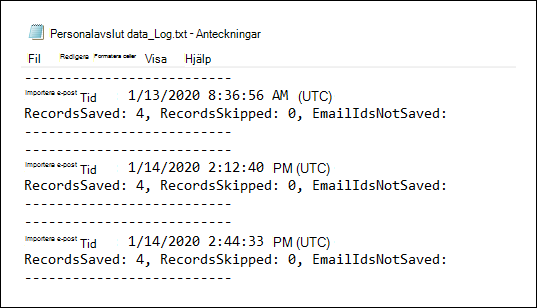
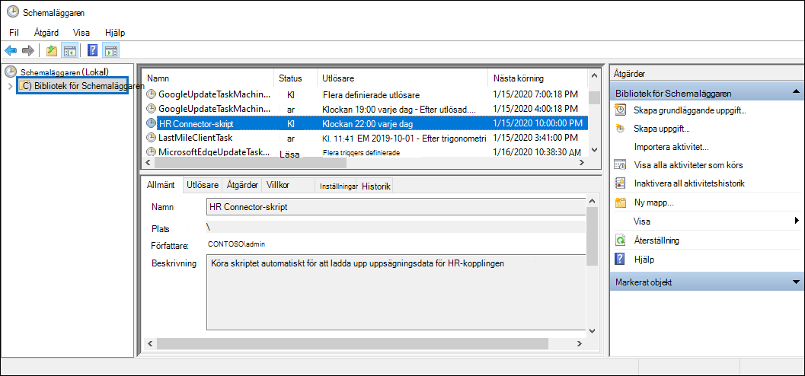

# <a name="set-up-a-connector-to-import-hr-data"></a>Konfigurera en koppling för att importera HR-data

Du kan konfigurera en datakoppling i efterlevnadscentret för Microsoft 365 för att importera hr-data relaterade till händelser som en användares följd eller en ändring av en användares arbetsuppgifter. HR-data kan sedan användas [](insider-risk-management.md) av Insider-riskhanteringslösningen för att generera riskindikatorer som kan hjälpa dig att identitetsbevillig aktivitet eller datastöld av användare i organisationen.

Konfigurera en koppling för HR-data som insiders riskhanteringsprinciper kan använda för att generera riskindikatorer består av att skapa en CSV-fil som innehåller HR-data, skapa en app i Azure Active Directory som används för autentisering, skapa en HR-dataanslutning i efterlevnadscentret för Microsoft 365 och sedan köra ett skript (enligt plan) som matar in HR-data i CSV-filer i Microsoft-molnet så att det är tillgängligt för insider-riskhanteringslösningen.

## <a name="before-you-begin"></a>Innan du börjar

- Avgör vilka HR-scenarier och data som ska importeras till Microsoft 365. Det här hjälper dig att avgöra hur många CSV-filer och HR-kopplingar du behöver skapa, och hur du skapar och strukturerar CSV-filerna. Hr-data som du importerar bestäms av de insider-riskhanteringspolicyer som du vill implementera. Mer information finns i Steg 1.

- Avgör hur du hämtar eller exporterar data från organisationens HR-system (och regelbundet) och lägg till dem i CSV-filerna som du skapar i steg 1. Skriptet som du kör i steg 4 laddar upp HR-data i CSV-filerna till Microsoft-molnet.

- Den användare som skapar HR-kopplingen i steg 3 måste tilldelas rollen Importera och exportera postlåda i Exchange Online. Som standard är den här rollen inte tilldelad någon rollgrupp i Exchange Online. Du kan lägga till rollen Importera och exportera postlåda i rollgruppen Organisationshantering i Exchange Online. Du kan också skapa en ny rollgrupp, tilldela rollen Importera och exportera postlåda och sedan lägga till lämpliga användare som medlemmar. Mer information finns i avsnitten [Skapa rollgrupper](/Exchange/permissions-exo/role-groups#create-role-groups) och [Ändra rollgrupper](/Exchange/permissions-exo/role-groups#modify-role-groups) i artikeln "Hantera rollgrupper i Exchange Online".

- Exempelskriptet som du kör i steg 4 laddar upp dina HR-data till Microsoft-molnet så att de kan användas av Insider-riskhanteringslösningen. Det här exempelskriptet stöds inte under något standardsupportprogram eller någon standardsupporttjänst från Microsoft. Exempelskriptet tillhandahålls i SIN FORM utan några som helst garantier. Vidare frånsäger sig Microsoft alla underförstådda garantier, inklusive, utan begränsning, alla underförstådda garantier om säljbarhet eller lämplighet för ett visst ändamål. Hela risken i samband med användningen av eller prestandan hos exempelskriptet och dokumentationen ligger kvar hos dig. Under inga omständigheter ska Microsoft, dess upphovspersoner eller någon annan som är involverad i skapandet, produktionen eller leveransen av skripten hållas ansvariga för någon som helst skada (inklusive, men inte begränsat till, skador för vinstförlust, driftavbrott, förlust av affärsinformation eller annan ekonomisk skada) som uppstår till följd av användning eller oförmåga att använda exempelskripten eller dokumentationen, även om Microsoft har fått information om att sådana skador kan uppstå.

## <a name="step-1-prepare-a-csv-file-with-your-hr-data"></a>Steg 1: Förbereda en CSV-fil med dina HR-data

Det första steget är att skapa en CSV-fil som innehåller HR-data som kopplingen importerar till Microsoft 365. Dessa data kommer att användas av Insider-risklösningen för att generera potentiella riskindikatorer. Data för följande HR-scenarier kan importeras till Microsoft 365:

- Medarbetarens medarbetare. Information om användare som har lämnat organisationen.

- Jobbnivåändringar. Information om ändringar på jobbnivå för användare, till exempel kampanjer och nedgradering.

- Resultatgranskningar. Information om användarprestanda.

- Abonnemang för prestandaförbättringar. Information om abonnemang för prestandaförbättringar för användare.

Vilken typ av HR-data som ska importeras beror på Insider-riskhanteringspolicyn och motsvarande principmall som du vill implementera. I följande tabell visas vilken HR-datatyp som krävs för varje principmall:

|  Principmall |  HR-datatyp |
|:-----------------------------------------------|:---------------------------------------------------------------------|
| Datastöld genom avgående användare                   | Medarbetares medarbetare                                                 |
| Allmänna dataläckor                              | Ej tillämpligt                                                        |
| Dataläckor efter prioriterade användare                    | Ej tillämpligt                                                        |
| Dataläckor av missnöjda användare                 | Ändringar på jobbnivå, resultatgranskningar, planer för prestandaförbättringar |
| Allmänna brott mot säkerhetsprinciper              | Ej tillämpligt                                                        |
| Brott mot säkerhetsprinciper av avgående användare   | Medarbetares medarbetare                                                 |
| Brott mot säkerhetsprinciper efter prioritetsanvändare    | Ej tillämpligt                                                        |
| Brott mot säkerhetsprinciper av misslygda användare | Ändringar på jobbnivå, resultatgranskningar, planer för prestandaförbättringar |
| Anstötligt språk i e-post                     | Ej tillämpligt                                                        |

Mer information om policymallar för Insider-riskhantering finns i [Insider-riskhanteringsprinciper.](insider-risk-management-policies.md#policy-templates)

För varje HR-scenario måste du ange motsvarande HR-data i en eller flera CSV-filer. Antalet CSV-filer som ska användas för din insider-implementering av riskhantering diskuteras senare i det här avsnittet.

När du har skapat CSV-filen med nödvändiga HR-data ska du lagra den på den lokala datorn som du kör skriptet på i steg 4. Du bör också implementera en uppdateringsstrategi för att se till att CSV-filen alltid innehåller den senaste informationen så att de senaste HR-data, oavsett vilket skript du kör, laddas upp till Microsofts moln och är tillgängliga för insider-riskhanteringslösningen.

> [!IMPORTANT]
> Kolumnnamnen som beskrivs i följande avsnitt är inte obligatoriska parametrar, utan endast exempel. Du kan använda val annat kolumnnamn i CSV-filerna. Men kolumnnamnen du använder i  CSV-filer måste mappas till datatypen när du skapar HR-kopplingen i steg 3. Observera även att CSV-exempelfilerna i följande avsnitt visas i vyn Anteckningar. Det är mycket enklare att visa och redigera CSV-filer i Microsoft Excel.

I följande avsnitt beskrivs de CSV-data som krävs för varje HR-scenario.

### <a name="csv-file-for-employee-resignation-data"></a>CSV-fil för data från medarbetare

Här är ett exempel på en CSV-fil för data om medarbetarens medarbetare.

```text
EmailAddress,ResignationDate,LastWorkingDate
sarad@contoso.com,2019-04-23T15:18:02.4675041+05:30,2019-04-29T15:18:02.4675041+05:30
pilarp@contoso.com,2019-04-24T09:15:49Z,2019-04-29T15:18:02.7117540
```

I följande tabell beskrivs varje kolumn i CSV-filen med information om de anställdas uppgifter.

|  Kolumn   |   Beskrivning |
|:------------|:----------------|
|**EmailAddress**| Anger e-postadressen (UPN) för den uppsagda användaren.|
| **Date** | Anger det datum då användarens anställning avslutades officiellt i organisationen. Det kan till exempel vara det datum då användaren gav sitt meddelande om att lämna organisationen. Det här datumet kan vara ett annat än datumet för personens sista arbetsdag. Använd följande datumformat: , som är datum- och `yyyy-mm-ddThh:mm:ss.nnnnnn+|-hh:mm` [tidsformatet i ISO 8601.](https://www.iso.org/iso-8601-date-and-time-format.html)|
| **LastWorkingDate** | Anger den sista dagen av arbete för den uppsagda användaren. Använd följande datumformat: , som är datum- och `yyyy-mm-ddThh:mm:ss.nnnnnn+|-hh:mm` [tidsformatet i ISO 8601.](https://www.iso.org/iso-8601-date-and-time-format.html)|
|||

### <a name="csv-file-for-job-level-changes-data"></a>CSV-fil för ändringsdata på jobbnivå

Här är ett exempel på en CSV-fil för data om ändringar på jobbnivå.

```text
EmailAddress,EffectiveDate,OldLevel,NewLevel
sarad@contoso.com,2019-04-23T15:18:02.4675041+05:30,Level 61 – Sr. Manager,Level 60- Manager
pillar@contoso.com,2019-04-23T15:18:02.4675041+05:30,Level 62 – Director,Level 60- Sr. Manager
```

I följande tabell beskrivs varje kolumn i CSV-filen för data om ändringar på jobbnivå.

|  Kolumn | Beskrivning |
|:--------- |:------------- |
| **EmailAddress**  | Anger användarens e-postadress (UPN).|
| **EffectiveDate** | Anger det datum då användarens jobbnivå officiellt ändrades. Använd följande datumformat: , som är datum- och `yyyy-mm-ddThh:mm:ss.nnnnnn+|-hh:mm` [tidsformatet i ISO 8601.](https://www.iso.org/iso-8601-date-and-time-format.html)|
| **Kommentarer**| Anger de kommentarer som utvärderaren har angett om ändringen av jobnivå. Du kan ange en begränsning på 200 tecken. Den här parametern är valfri. Du behöver inte inkludera den i CSV-filen.|
| **OldLevel**| Anger användarens jobbnivå innan den ändrades. Det här är en fritextparameter som kan innehålla hierarkisk taxonomi för organisationen. Den här parametern är valfri. Du behöver inte inkludera den i CSV-filen.|
| **NewLevel**| Anger användarens jobbnivå efter att den har ändrats. Det här är en fritextparameter som kan innehålla hierarkisk taxonomi för organisationen. Den här parametern är valfri. Du behöver inte inkludera den i CSV-filen.|
|||

### <a name="csv-file-for-performance-review-data"></a>CSV-fil för data i prestandagranskning

Här är ett exempel på en CSV-fil för prestandadata.

```text
EmailAddress,EffectiveDate,Remarks,Rating
sarad@contoso.com,2019-04-23T15:18:02.4675041+05:30,Met expectations but bad attitude,2-Below expectation
pillar@contoso.com,2019-04-23T15:18:02.4675041+05:30, Multiple conflicts with the team
```

I följande tabell beskrivs varje kolumn i CSV-filen för prestandagranskningsdata.

|  Kolumn | Beskrivning |
|:----------|:--------------|
| **EmailAddress**  | Anger användarens e-postadress (UPN).|
| **EffectiveDate** | Anger det datum då användaren officiellt informerades om resultatet av prestationsgranskningen. Detta kan vara datumet då prestandagranskningscykeln avslutades. Använd följande datumformat: , som är datum- och `yyyy-mm-ddThh:mm:ss.nnnnnn+|-hh:mm` [tidsformatet i ISO 8601.](https://www.iso.org/iso-8601-date-and-time-format.html)|
| **Kommentarer**| Anger kommentarer som utvärderingsanvändaren har lämnat in för prestandagranskningen. Det här är en textparameter med en begränsning på 200 tecken. Den här parametern är valfri. Du behöver inte inkludera den i CSV-filen.|
| **Klassificering**| Anger klassificeringen som tillhandahålls för prestandagranskningen. Det här är en textparameter och kan innehålla valfri friformstext som din organisation använder för att identifiera utvärderingen. Till exempel "3 Uppfylls förväntningar" eller "2 Under medel". Det här är en textparameter med en begränsning på 25 tecken. Den här parametern är valfri. Du behöver inte inkludera den i CSV-filen.|
|||

### <a name="csv-file-for-performance-improvement-plan-data"></a>CSV-fil för data i planen för prestandaförbättringar

Här är ett exempel på en CSV-fil för data för data i planen för prestandaförbättringar.

```text
EmailAddress,EffectiveDate,ImprovementRemarks,PerformanceRating
sarad@contoso.com,2019-04-23T15:18:02.4675041+05:30,Met expectation but bad attitude,2-Below expectation
pillar@contoso.com,2019-04-23T15:18:02.4675041+05:30, Multiple conflicts with the team
```

I följande tabell beskrivs varje kolumn i CSV-filen för prestandagranskningsdata.

|  Kolumn |  Beskrivning |
|:----------|:---------------|
| **EmailAddress**  | Anger användarens e-postadress (UPN).|
| **EffectiveDate** | Anger datumet när användaren officiellt informerades om planen för prestandaförbättringar. Du måste använda följande datumformat: `yyyy-mm-ddThh:mm:ss.nnnnnn+|-hh:mm` , som är iso [8601-datum- och tidsformatet.](https://www.iso.org/iso-8601-date-and-time-format.html)|
| **Kommentarer**| Anger eventuella kommentarer som utvärderaren har tillhandahållit om planen för prestandaförbättringar. Det här är en textparameter med en begränsning på 200 tecken. Det här är en valfri parameter. Du behöver inte inkludera den i CSV-filen. |
| **Klassificering**| Anger eventuella omdömen eller annan information som är relaterad till prestandagranskningen. plan för prestandaförbättringar. Det här är en textparameter och kan innehålla valfri fri formulärtext som din organisation använder för att identifiera utvärderingen. Till exempel "3 Uppfylls förväntningar" eller "2 Under medel". Det här är en textparameter med en begränsning på 25 tecken. Det här är en valfri parameter. Du behöver inte inkludera den i CSV-filen.|
|||

### <a name="determining-how-many-csv-files-to-use-for-hr-data"></a>Avgöra hur många CSV-filer som ska användas för HR-data

I steg 3 kan du välja att skapa separata kopplingar för varje HR-datatyp, eller så kan du välja att skapa en enda koppling för alla datatyper. Du kan använda separata CSV-filer som innehåller data för ett HR-scenario (t.ex. exempel på CSV-filer som beskrivs i föregående avsnitt). Alternativt kan du använda en enda CSV-fil som innehåller data för två eller flera HR-scenarier. Här är några riktlinjer för att hjälpa dig att avgöra hur många CSV-filer som ska användas för HR-data.

- Om insider-riskhanteringsprincipen som du vill implementera kräver flera HR-datatyper kan du överväga att använda en enda CSV-fil som innehåller alla nödvändiga datatyper.

- Metoden för att generera eller samla in HR-data kan bestämma antalet CSV-filer. Om de olika typerna av HR-data som används för att konfigurera en personalkontakt exempelvis finns i ett enda HR-system i organisationen kanske du kan exportera data till en enda CSV-fil. Men om data är fördelade mellan olika HR-system kan det vara enklare att exportera data till olika CSV-filer. Till exempel kan data från anställdas anställda finnas i ett annat HR-system än data för granskning av jobb eller prestation. I det här fallet kan det vara enklare att ha separata CSV-filer i stället för att manuellt kombinera data till en enda CSV-fil. Så hur du hämtar eller exporterar data från dina HR-system kan avgöra hur många CSV-filer du behöver.

- Som regel avgörs antalet HR-kopplingar som du behöver skapa av datatyperna i en CSV-fil. Om en CSV-fil till exempel innehåller alla datatyper som krävs för din implementering av insider-riskhantering behöver du bara en HR-koppling. Men om du har två separata CSV-filer som var och en innehåller en enda datatyp, måste du skapa två HR-kopplingar. Ett undantag är att om du lägger till en **HRScenario-kolumn** i en CSV-fil (se nästa avsnitt) kan du konfigurera en enda HR-koppling som kan bearbeta olika CSV-filer.

### <a name="configuring-a-single-csv-file-for-multiple-hr-data-types"></a>Konfigurera en enda CSV-fil för flera HR-datatyper

Du kan lägga till flera HR-datatyper i en enda CSV-fil. Det här är användbart om insider-riskhanteringslösningen som du implementerar kräver flera HR-datatyper eller om datatyperna finns i ett enda HR-system i organisationen. Om du har färre CSV-filer kan du alltid ha färre HR-kopplingar för att skapa och hantera.

Här är kraven för att konfigurera en CSV-fil med flera datatyper:

- Du måste lägga till de kolumner som krävs (och eventuellt om du använder dem) för varje datatyp och motsvarande kolumnnamn i rubrikraden. Om en datatyp inte motsvarar en kolumn kan du lämna värdet tomt.

- Om du vill använda en CSV-fil med flera typer av HR-data behöver HR-kopplingen veta vilka rader i CSV-filen som innehåller vilken typ av HR-data. Det gör du genom att lägga till ytterligare **en HRScenario-kolumn** i CSV-filen. Värdena i den här kolumnen identifierar typen av HR-data på varje rad. Till exempel kan värden som motsvarar de fyra HR-scenarierna vara \` \` Första, \` Jobbnivåändring, \` \` \` Resultatgranskning och \` Plan för \` prestandaförbättringar.

- Om du har flera CSV-filer som innehåller en HRScenario**-kolumn ska du se till att varje fil använder samma kolumnnamn och samma värden som identifierar specifika HR-scenarier.

I följande exempel visas en CSV-fil som innehåller **kolumnen HRScenario.** Värdena i kolumnen HRScenario anger datatypen på motsvarande rad.

```text
HRScenario,EmailAddress,ResignationDate,LastWorkingDate,EffectiveDate,Remarks,Rating,OldLevel,NewLevel
Resignation,sarad@contoso.com,2019-04-23T15:18:02.4675041+05:30,2019-04-29T15:18:02.4675041+05:30,,,,
Resignation,pilarp@contoso.com,2019-04-24T09:15:49Z,2019-04-29T15:18:02.7117540,,,,
Job level change,sarad@contoso.com,2019-04-23T15:18:02.4675041+05:30,,,,,Level 61 Sr. Manager, Level 60 Manager
Job level change,pillarp@contoso.com,2019-04-23T15:18:02.4675041+05:30,,,,,Level 62 Director,Level 60 Sr Manager
Performance review,sarad@contoso.com,,,2019-04-23T15:18:02.4675041+05:30,Met expectation but bad attitude,2 Below expectations,,
Performance review,pillarp@contoso.com,,,2019-04-23T15:18:02.4675041+05:30, Multiple conflicts with the team,,
Performance improvement plan,sarad@contoso.com,,,2019-04-23T15:18:02.4675041+05:30,Met expectations but bad attitude,2 Below expectations,,
Performance improvement plan,pillarp@contoso.com,,,2019-04-23T15:18:02.4675041+05:30,Multiple conflicts with the team,,
```

> [!NOTE]
> Du kan använda vilket namn som helst för kolumnen som identifierar HR-datatypen eftersom du kommer att mappa namnet på kolumnen i CSV-filen till den kolumn som identifierar hr-datatypen när du konfigurerade kopplingen i steg 3. Du kan också mappa värdena som används för datatypskolumnen när du konfigurerar kopplingen.

### <a name="adding-the-hrscenario-column-to-a-csv-file-that-contains-a-single-data-type"></a>Lägga till kolumnen HRScenario i en CSV-fil som innehåller en enda datatyp

Baserat på organisationens HR-system och hur du exporterar HR-data till CSV-fil kan du behöva skapa flera CSV-filer som innehåller en enda HR-datatyp. I det här fallet kan du fortfarande skapa en enda HR-koppling för att importera data från olika CSV-filer. Då behöver du bara lägga till kolumnen HRScenario i CSV-filen och ange datatypen HR. Sedan kan du köra skriptet för varje CSV-fil, men använda samma jobb-ID för kopplingen. Se [steg 4.](#step-4-run-the-sample-script-to-upload-your-hr-data)

## <a name="step-2-create-an-app-in-azure-active-directory"></a>Steg 2: Skapa ett program i Azure Active Directory

Nästa steg är att skapa och registrera en ny app i Azure Active Directory (Azure AD). Appen motsvarar HR-kopplingen som du skapar i steg 3. När du skapar det här programmet kan Azure AD autentisera HR-kopplingen när den körs och försöker få åtkomst till din organisation. Det här programmet används också för att autentisera skriptet som du kör i steg 4 för att ladda upp dina HR-data till Microsoft-molnet. När den här Azure AD-appen skapas sparar du följande information. Dessa värden används i steg 3 och steg 4.

- Azure AD-program-ID (kallas även *app-ID* eller *klient-ID)*

- Azure AD-programhemlighet (kallas även *klienthemlighet)*

- Klientorganisations-ID (kallas även *katalog-ID*)

Stegvisa instruktioner för hur du skapar en app i Azure AD finns i [Registrera ett program med Microsofts identitetsplattform.](/azure/active-directory/develop/quickstart-register-app)

## <a name="step-3-create-the-hr-connector"></a>Steg 3: Skapa HR-kopplingen

Nästa steg är att skapa en HR-koppling i Microsoft 365 för efterlevnadscenter. När du har kört skriptet i steg 4 kommer HR-kopplingen som du skapar att mata in HR-data från CSV-filen till Microsoft 365 organisation. Innan du skapar en koppling ser du till att du har en lista över HR-scenarierna och motsvarande CSV-kolumnnamn för vart och ett. Du måste mappa de data som krävs för varje scenario till de faktiska kolumnnamnen i CSV-filen när du konfigurerar kopplingen. Du kan också ladda upp en EXEMPEL-CSV-fil när du konfigurerar anslutningen, så hjälper guiden dig att mappa kolumnnamnet till de datatyper som krävs.

Se till att kopiera det jobb-ID som genereras när du skapar kopplingen när du är klar med det här steget. Du kommer att använda jobb-ID när du kör skriptet.

1. Gå till [https://compliance.microsoft.com](https://compliance.microsoft.com/) och klicka sedan på Datakopplingar i den vänstra **navigeringsfältet.**

2. På sidan **Datakopplingar** under **HR klickar** du på **Visa**.

3. På sidan **Anpassa för HR** klickar du på Lägg till **koppling.**

4. På sidan **Konfigurera anslutningen** gör du följande och klickar sedan på **Nästa:**

   1. Skriv eller klistra in Azure AD-program-ID för Azure-appen som du skapade i steg 2.

   1. Ange ett namn för HR-kopplingen.

5. På sidan HR-scenarier väljer du en eller flera HR-scenarier som du vill importera data för och klickar sedan på **Nästa.**

6. På sidan filmappningsmetod väljer du något av följande alternativ och klickar sedan på **Nästa.**

   - **Upload en exempelfil**. Om du väljer det här alternativet klickar **Upload exempelfilen** för att ladda upp CSV-filen som du förberedde i steg 1. Med det här alternativet kan du snabbt välja kolumnnamn i CSV-filen från en listrutan för att mappa dem till datatyperna för HR-scenarierna som du valde tidigare.

   ELLER

   - **Ange mappningsinformationen manuellt.** Om du väljer det här alternativet måste du ange namnet på kolumnerna i CSV-filen för att mappa dem till datatyperna för hr-scenarierna som du valde tidigare.

7. På sidan Filmappningsinformation gör du något av följande, beroende på om du har laddat upp en csv-exempelfil och om du konfigurerar kopplingen för ett enda HR-scenario eller för flera scenarier. Om du har laddat upp en exempelfil behöver du inte skriva kolumnnamnen. Du väljer dem i en listlista.

    - Om du valde ett enda HR-scenario i föregående steg skriver du kolumnrubriknamnen (kallas även *parametrar)* från CSV-filen som du skapade i steg 1 i var och en av de olika rutorna. Kolumnnamnen som du skriver är inte ärendekänsliga, men se till att ta med blanksteg om kolumnnamnen i CSV-filen innehåller blanksteg. Som tidigare förklarats måste namnen du skriver i de här rutorna matcha parameternamnen i CSV-filen. I följande skärmbild visas till exempel parameternamnen från CSV-exempelfilen för den anställdas hr-scenario som visas i steg 1.

    - Om du valde flera datatyper ovan måste du ange identifierarkolumnnamnet som identifierar datatypen personal i CSV-filen. När du har angett identifierarkolumnnamnet skriver du det värde som identifierar den här HR-datatypen och kolumnrubriknamnen för valda datatyper från CSV-filen(erna) som du skapade i steg 1 i respektive rutor för varje vald datatyp. Som tidigare förklarats måste namnen du skriver i de här rutorna matcha kolumnnamnen i CSV-filen.

8. På sidan **Granska** granskar du inställningarna och klickar sedan på **Slutför för** att skapa kopplingen.

   En statussida visas som bekräftar att anslutningen skapades. Den här sidan innehåller två viktiga saker som du måste slutföra nästa steg för att köra exempelskriptet för att ladda upp dina HR-data.

   

   1. **Jobb-ID.** Du behöver det här jobb-ID:t för att köra skriptet i nästa steg. Du kan kopiera den från den här sidan eller från kopplingssidan.

   1. **Länka till exempelskript.** Klicka på **länken här** för att gå GitHub webbplatsen för att komma åt exempelskriptet (länken öppnar ett nytt fönster). Låt det här fönstret vara öppet så att du kan kopiera skriptet i steg 4. Alternativt kan du bokmärka målet eller kopiera URL-adressen så att du kan komma åt den igen när du kör skriptet. Den här länken är också tillgänglig på kopplingssidan.

9. Klicka på **Klar**.

   Den nya kopplingen visas i listan på **fliken Kopplingar.**

10. Klicka på hr-kopplingen som du just har skapat för att visa den utfällade sidan, som innehåller egenskaper och annan information om kopplingen.

   

Om du inte redan har gjort det kan du kopiera värdena för **Azure-app-ID** och **kopplingsjobb-ID.** Du behöver dem för att köra skriptet i nästa steg. Du kan också ladda ned skriptet från den utfällsbara sidan (eller ladda ned det med hjälp av länken i nästa steg).)

Du kan också klicka **på Redigera** om du vill ändra namnen på Azure-app-id:t eller kolumnrubrikerna som du definierade på **sidan Filmappning.**

## <a name="step-4-run-the-sample-script-to-upload-your-hr-data"></a>Steg 4: Kör exempelskriptet för att ladda upp hr-data

Det sista steget för att konfigurera en HR-koppling är att köra ett exempelskript som laddar upp PERSONAL-data i CSV-filen (som du skapade i steg 1) till Microsoft-molnet. Mer specifikt laddar skriptet upp data till HR-kopplingen. När du har kört skriptet importerar HR-kopplingen som du skapade i steg 3 PERSONAL-data till din Microsoft 365-organisation där den kan kommas åt av andra efterlevnadsverktyg, till exempel Insider-riskhanteringslösningen. När du har kört skriptet kan du schemalägga en aktivitet så att den körs automatiskt varje dag, så att de mest aktuella data om uppsägning av anställda laddas upp till Microsoft-molnet. Se [Schemalägga skriptet så att det körs automatiskt](#optional-step-6-schedule-the-script-to-run-automatically).

1. Gå till det fönster som du lämnade öppet från föregående steg för att komma GitHub webbplatsen med exempelskriptet. Du kan också öppna den bokmärkta webbplatsen eller använda url-adressen som du kopierade.

2. Klicka på **raw-knappen** för att visa skriptet i textvyn.

3. Kopiera alla rader i exempelskriptet och spara dem sedan i en textfil.

4. Ändra exempelskriptet för din organisation, om det behövs.

5. Spara textfilen som en Windows PowerShell skriptfil med ett filnamnssuffix på till `.ps1` exempel `HRConnector.ps1` .

6. Öppna en kommandotolk på den lokala datorn och gå till katalogen där du sparade skriptet.

7. Kör följande kommando för att ladda upp HR-data i CSV-filen till Microsoft-molnet: till exempel:

    ```powershell
    .\HRConnector.ps1 -tenantId <tenantId> -appId <appId>  -appSecret <appSecret>  -jobId <jobId>  -csvFilePath '<csvFilePath>'
    ```

   I följande tabell beskrivs de parametrar som ska användas med skriptet och deras obligatoriska värden. Informationen som du fick i föregående steg används i värdena för dessa parametrar.

   | Parameter | Beskrivning |
   |:-----|:-----|:-----|
   |`tenantId`|Det här är id:t för Microsoft 365 organisation som du fick i steg 2. Du kan också hämta organisationens klient-ID i **översiktsbladet** i Azure AD-administrationscentret. Används för att identifiera din organisation.|
   |`appId` |Det här är Azure AD-program-ID för appen som du skapade i Azure AD i steg 2. Det här används av Azure AD för autentisering när skriptet försöker komma åt din Microsoft 365 organisation. | 
   |`appSecret`|Det här är Azure AD-programhemligheten för appen som du skapade i Azure AD i steg 2. Detta används även för autentisering.|
   |`jobId`|Det här är jobb-ID för hr-kopplingen som du skapade i steg 3. Detta används för att associera HR-data som laddas upp till Microsoft-molnet med HR-kopplingen.|
   |`csvFilePath`|Det här är filsökvägen för CSV-filen (lagrad på samma system som skriptet) som du skapade i steg 1. Försök att undvika blanksteg i sökvägen. Använd annars enkla citattecken.|
   |||

   Här är ett exempel på syntaxen för HR-kopplingsskriptet med faktiska värden för varje parameter:

   ```powershell
    .\HRConnector.ps1 -tenantId d5723623-11cf-4e2e-b5a5-01d1506273g9 -appId 29ee526e-f9a7-4e98-a682-67f41bfd643e -appSecret MNubVGbcQDkGCnn -jobId b8be4a7d-e338-43eb-a69e-c513cd458eba -csvFilePath 'C:\Users\contosoadmin\Desktop\Data\employee_termination_data.csv'
    ```

   Om överföringen lyckas visas följande meddelande i **skriptet Upload Lyckades.**

   > [!NOTE]
   > Om du har problem med att köra [](/powershell/module/microsoft.powershell.core/about/about_execution_policies) det föregående kommandot på grund av körningsprinciper finns mer information om hur du anger körningsprinciper i Om körningsprinciper och [Set-ExecutionPolicy.](/powershell/module/microsoft.powershell.security/set-executionpolicy)

## <a name="step-5-monitor-the-hr-connector"></a>Steg 5: Övervaka HR-kopplingen

När du har skapat HR-kopplingen och kört skriptet för att ladda upp dina HR-data kan du visa kopplingen och ladda upp statusen Microsoft 365 kompatibilitetscentret. Om du schemalägger skriptet så att det körs automatiskt regelbundet kan du också visa aktuell status efter den senaste gången skriptet kördes.

1. Gå till [https://compliance.microsoft.com](https://compliance.microsoft.com) och klicka på **Datakopplingar** i det vänstra navigeringsfältet.

2. Klicka på **fliken Kopplingar** och välj sedan HR-kopplingen för att visa den utfällade sidan. Den här sidan innehåller egenskaper och information om kopplingen.

   

3. Under **Förlopp** klickar du **på länken Ladda** ned logg för att öppna (eller spara) statusloggen för kopplingen. Den här loggen innehåller information om varje gång skriptet körs och laddar upp data från CSV-filen till Microsoft-molnet. 

   

   Fältet `RecordsSaved` anger antalet rader i CSV-filen som har laddats upp. Om CSV-filen till exempel innehåller fyra rader är värdet för fälten 4, om skriptet har laddat upp alla rader i `RecordsSaved` CSV-filen.

Om du inte har kört skriptet i steg 4 visas en länk för att ladda ned skriptet under **Senaste import.** Du kan ladda ned skriptet och sedan följa stegen för att köra skriptet.

## <a name="optional-step-6-schedule-the-script-to-run-automatically"></a>(Valfritt) Steg 6: Schemalägga skriptet så att det körs automatiskt

För att se till att de senaste HR-data från din organisation är tillgängliga för verktyg som Insider-riskhanteringslösningen rekommenderar vi att du schemalägger skriptet så att det körs automatiskt på återkommande sätt, till exempel en gång om dagen. Det här kräver också att du uppdaterar PERSONAL-data i CSV-filen enligt ett liknande schema (om det inte är samma) så att det innehåller den senaste informationen om anställda som lämnar organisationen. Målet är att ladda upp de senaste HR-data så att HR-kopplingen kan göra den tillgänglig för Insider-riskhanteringslösningen.

Du kan använda appen Schemaläggaren i Windows att automatiskt köra skriptet varje dag.

1. Klicka på startknappen på den Windows **datorn** och skriv sedan **Schemaläggaren**.

2. Klicka på **appen Schemaläggaren** för att öppna den.

3. Klicka på **Skapa** uppgift i **avsnittet Åtgärder.**

4. Ange ett **beskrivande** namn för den schemalagda aktiviteten på fliken Allmänt. till exempel **HR Connector Script**. Du kan också lägga till en valfri beskrivning.

5. Gör **följande under** Säkerhetsalternativ:

   1. Bestäm om skriptet endast ska köras när du är inloggad på datorn eller om det ska köras när du är inloggad eller inte.

   1. Kontrollera att kryssrutan **Kör med högst behörighet** är markerad.

6. Välj fliken **Utlösare,** klicka **på Ny** och gör sedan följande:

   1. Under **Inställningar** väljer du **alternativet** Varje dag och väljer sedan ett datum och en tid då skriptet ska köras för första gången. Skriptet körs varje dag vid samma angivna tidpunkt.

   1. Kontrollera **att kryssrutan** Aktiverad är **markerad** under Avancerade inställningar.

   1. Klicka **på OK.**

7. Välj fliken **Åtgärder,** klicka **på Ny** och gör sedan följande:

   

   1. I **listrutan** Åtgärd kontrollerar du att Starta **ett program** är markerat.

   1. I rutan **Program/skript** klickar du på **Bläddra** och går till följande plats och väljer den så att sökvägen visas i rutan: `C:\Windows\System32\WindowsPowerShell\v1.0\powershell.exe` .

   1. I rutan **Lägg till argument (valfritt)** klistrar du in samma skriptkommando som du körde i steg 4. Exempel: `.\HRConnector.ps1 -tenantId "d5723623-11cf-4e2e-b5a5-01d1506273g9" -appId "c12823b7-b55a-4989-faba-02de41bb97c3" -appSecret "MNubVGbcQDkGCnn"  -jobId "e081f4f4-3831-48d6-7bb3-fcfab1581458" -csvFilePath "C:\Users\contosoadmin\Desktop\Data\employee_termination_data.csv"`

   1. I rutan **Börja i (valfritt)** klistrar du in mappplatsen för skriptet som du körde i steg 4. Till exempel `C:\Users\contosoadmin\Desktop\Scripts`.

   1. Spara inställningarna för den nya åtgärden genom att klicka på **OK.**

8. Spara den **schemalagda aktiviteten** genom att klicka **på Ok** i fönstret Skapa aktivitet. Du kanske blir ombedd att ange dina autentiseringsuppgifter för användarkontot.

   Den nya uppgiften visas i Schemaläggarbiblioteket.

   

   Den senaste gången skriptet kördes och nästa gång det schemalagts att köras visas. Du kan dubbelklicka på uppgiften för att redigera den.

   Du kan också kontrollera den senaste gången skriptet kördes på den utfällade sidan av motsvarande HR-koppling i efterlevnadscentret.

## <a name="existing-hr-connectors"></a>Befintliga HR-kopplingar

Den 20 juli 2020 släppte vi ytterligare scenarier som stöds av HR-kopplingar. Det här är de HR-scenarier som beskrevs tidigare i den här artikeln. Alla HR-kopplingar som skapats före detta datum har endast stöd för det aktuella scenariot för anställda. Om du skapade en personalkontakt före 20 juli 2020 har vi migrerat den så att den fortsätter att migrera dina HR-data till Microsoft-molnet. Du behöver inte göra något för att behålla den här funktionen. Du kan fortsätta använda anslutningen utan avbrott.

Om du vill implementera ytterligare HR-scenarier skapar du en ny HR-koppling och konfigurerar den för de ytterligare HR-scenarier som släppts. Du måste också skapa en eller flera nya CSV-filer som innehåller data för att stödja de ytterligare HR-scenarierna. När du har skapat en ny HR-koppling kör du skriptet med jobb-ID för den nya anslutningen och CSV-filer med data för dina ytterligare HR-scenarier.