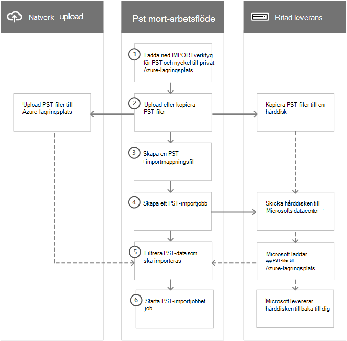

# Översikt över import av PST-filer i din organisationOverview of importing your organization's PST files

> [!NOTE]
> Den här artikeln är avsedd för administratörer.This article is for administrators. Försöker du importera PST-filer till din egen postlåda?Are you trying to import PST files to your own mailbox? Se [Importera e-post, kontakter och kalender från en Outlook .pst-fil](https://go.microsoft.com/fwlink/p/?LinkID=785075).See [Import email, contacts, and calendar from an Outlook .pst file](https://go.microsoft.com/fwlink/p/?LinkID=785075).

Med importtjänsten i Säkerhets- och efterlevnadscenter kan du snabbt massimportera PST-filer till Exchange Online-postlådor i din organisation.You can use the Import service in the Security & Compliance Center to quickly bulk-import PST files to Exchange Online mailboxes in your organization. Du kan importera PST-filer till Office 365 på två sätt:There are two ways you can import PST files to Office 365:

- **Nätverksuppladdning**  – Ladda upp PST-filerna via nätverket till en tillfällig Azure-lagringsplats i Microsofts moln.**Network upload**  - Upload the PST files over the network to a temporary Azure Storage location in the Microsoft cloud. Använd sedan Office 365-importtjänsten för att importera PST-data till postlådor i din organisation.Then you use the Office 365 Import service to import the PST data to mailboxes in your organization. 

- **Enhetsleverans**  – Kopiera PST-filerna till en BitLocker-krypterad hårddisk och skicka den sedan fysiskt till Microsoft.**Drive shipping**  - Copy the PST files to a BitLocker-encrypted hard drive and then physically ship the drive to Microsoft. När Microsoft får hårddisken laddar personalen på datacentret upp data till en tillfällig Azure-lagringsplats i Microsoft-molnet.When Microsoft receives the hard drive, data center personnel upload the data to a temporary Azure Storage location in the Microsoft cloud. Använd sedan Office 365-importtjänsten för att importera data till postlådor i din organisation.Then you use the Office 365 Import service to import the data to mailboxes in your organization.

## Stegvisa instruktionerStep-by-step instructions
  
Läs något av följande avsnitt för detaljerade stegvisa instruktioner för hur du massimporterar PST-filer till Office 365 i din organisation.See one of the following topics for detailed, step-by-step instructions for bulk-importing your organization's PST files to Office 365. 

- [Importera PST-filer till Office 365 via nätverksuppladdningUse network upload to import PST files to Office 365](use-network-upload-to-import-pst-files.md)

- [Importera PST-filer via enhetsleveransUse drive shipping to import PST files](use-drive-shipping-to-import-pst-files-to-office-365.md)

## Så här fungerar import av PST-filerHow importing PST files works

Här är en bild och beskrivning av den fullständiga PST-importprocessen.Here's an illustration and description of the complete PST import process. Bilden visar det primära arbetsflödet och framhäver skillnaderna mellan att använda nätverksuppladdning och enhetsleverans.The illustration shows the primary workflow and highlights the differences between the network upload and drive shipping methods.
  

  
1. **Ladda ned PST-importverktygen och nyckeln till en privat Azure-lagringsplats** – Det första steget är att ladda ned verktyget och åtkomstnyckeln som används för att ladda upp PST-filer eller kopiera dem till en hårddisk.**Download the PST import tools and key to private Azure Storage location** - The first step is to download the tool and access key used to upload the PST files or copy them to a hard drive. Du hittar dem på **importsidan** i Säkerhets- och efterlevnadscenter.You obtain these from the **Import** page in the Security & Compliance Center. Nyckeln ger dig (eller personalen på Microsofts datacenter vid enhetsleverans) nödvändiga behörigheter för att ladda upp PST-filer till en privat och säker Azure-lagringsplats.The key provides you (or Microsoft data center personnel in the case of drive shipping) with the necessary permissions to upload PST files to a private and secure Azure Storage location. Den här åtkomstnyckeln är unik för din organisation och hjälper till att förhindra obehörig åtkomst till dina PST-filer när de har laddats upp till Microsofts moln.This access key is unique to your organization and helps prevent unauthorized access to your PST files after they're uploaded to the Microsoft cloud. Organisationen behöver inte ha en separat Azure-prenumeration för att importera PST-filer till Microsoft 365.Importing PST files to Microsoft 365 doesn't require your organization to have a separate Azure subscription. 
    
2. **Ladda upp eller kopiera PST-filer** – Nästa steg beror på om du ska importera PST-filerna via nätverksuppladdning eller enhetsleverans.**Upload or copy the PST files** - The next step depends on whether you're using network upload or drive shipping to import PST files. I båda fallen använder du verktyget och nyckeln för säker lagring som du erhöll i föregående steg.In both cases, you'll use the tool and secure storage key that you obtained in the previous step.
    
    - **Nätverksuppladdning:** Verktyget AzCopy.exe (som laddades ned i steg 1) används för att ladda upp och spara dina PST-filer på en Azure-lagringsplats i Microsofts moln.**Network upload:** The AzCopy.exe tool (downloaded in step 1) is used to upload and store your PST files in an Azure Storage location in the Microsoft cloud. Den Azure-lagringsplats som du laddar upp PST-filer till finns i samma regionala Microsoft-datacenter som din organisation.The Azure Storage location that you upload your PST files to is located in the same regional Microsoft datacenter as your organization.
    
      För att kunna ladda upp de PST-filer som du vill importera måste de finnas i en filresurs eller filserver i din organisation.To upload them, the PST files that you want to import have to be located in a file share or file server in your organization.
    
    - **Enhetsleverans:** Verktyget WAImportExport.exe (som laddades ned i steg 1) används för att kopiera PST-filerna till hårddisken.**Drive shipping:** The WAImportExport.exe tool (downloaded in step 1) is used to copy your PST files to the hard drive. Det här verktyget krypterar hårddisken med BitLocker och kopierar sedan PST-filerna till hårddisken.This tool encrypts the hard drive with BitLocker and then copies the PSTs to the hard drive. Liksom vid en nätverksuppladdning måste de PST-filer som du vill importera finnas i en filresurs eller filserver i din organisation.Like network upload, the PST files that you want to copy to the hard drive have to be located in a file share or file server in your organization.
    
3. **Skapa en mappningsfil för PST-import** – Efter att PST-filerna har laddats upp till Azure-lagringsplatsen eller kopierats till en hårddisk är nästa steg att skapa en kommaavgränsad fil (CSV) som anger vilka användarpostlådor som PST-filerna ska importeras till (en PST-fil kan importeras till en användares primära postlåda eller arkivpostlåda).**Create a PST import mapping file** - After the PST files have been uploaded to the Azure Storage location or copied to a hard drive, the next step is to create a comma-separated value (CSV) file that specifies which user mailboxes the PST files will be imported to (and a PST file can be imported to a user's primary mailbox or their archive mailbox). Importtjänsten i Office 365 använder informationen för att importera PST-filerna.The Office 365 Import service will use the information to import the PST files. 
    
4. **Skapa ett PST-importjobb** – Nästa steg är att skapa ett PST-importjobb på sidan **Importera PST-filer** i Säkerhets- och efterlevnadscenter och skicka mappningsfilen för PST-import som skapades i föregående steg.**Create a PST import job** - The next step is to create a PST import job on the **Import PST files** page in the Security & Compliance Center and submit the PST import mapping file created in the previous step. Vid en nätverksuppladdning analyserar Microsoft 365 data i PST-filerna (eftersom PST-filerna har laddats upp till Azure) och ger dig sedan möjlighet att ange filter som styr vilka data som faktiskt importeras till de postlådor som anges i mappningsfilen för PST-import.For network upload (because the PST files have been uploaded to Azure) Microsoft 365 analyzes the data in the PST files and then gives you an opportunity to set filters that control what data actually gets imported to the mailboxes specified in the PST import mapping file. 
    
    Vid en enhetsleverans händer några andra saker vid den här punkten i processen.For drive shipping, a few other things happen at this point in the process.
    
    - Du skickar hårddisken fysiskt till ett Microsoft-datacenter (leveransadressen för Microsofts datacenter visas när importjobbet skapas).You physically ship the hard drive to a Microsoft data center (the shipping address for the Microsoft data center is displayed when the import job is created).
    
    - När Microsoft tar emot hårddisken laddar personalen på datacentret upp PST-filerna på hårddisken till Azure-lagringsplatsen för din organisation.When Microsoft receives the hard drive, data center personnel will upload the PST files on the hard drive to the Azure Storage location for your organization. PST-filerna laddas som sagt upp till en Azure-lagringsplats som finns i samma regionala Microsoft-datacenter som din organisation.As previously explained, your PST files are uploaded to an Azure Storage location that resides in the same regional Microsoft datacenter where your organization is located.
    
      > [!NOTE]
      > PST-filerna på hårddisken laddas upp till Azure inom 7 till 10 arbetsdagar efter att Microsoft har tagit emot hårddisken.The PST files on the hard drive are uploaded to Azure within 7 to 10 business days after Microsoft receives the hard drive.

      Precis som vid en nätverksuppladdning analyserar Microsoft 365 sedan data i PST-filerna och ger dig sedan möjlighet att ange filter för att styra vilka data som faktiskt ska importeras till de postlådor som anges i mappningsfilen för PST-import.Like the network upload process, Microsoft 365 then analyzes the data in the PST files and gives you an opportunity to set filters that control what data actually gets imported to the mailboxes specified in the PST import mapping file.
    
    - Microsoft skickar tillbaka hårddisken till dig.Microsoft ships the hard drive back to you.
    
5. **Filtrera PST-data som ska importeras till postlådor** – När importjobbet har skapats (och efter att PST-filerna från ett enhetsleveransjobb har laddats upp till Azure-lagringsplatsen) analyserar Microsoft 365 data i PST-filerna (på ett säkert sätt) genom att identifiera objektens ålder och vilka olika meddelandetyper som ingår i PST-filerna.**Filter the PST data that will be imported to mailboxes** - After the import job is created (and after the PST files from a drive shipping job are uploaded to the Azure Storage location) Microsoft 365 analyzes the data in the PST files (safely and securely) by identifying the age of the items and the different message types included in the PST files. När analysen är klar och data är redo att importeras kan du importera alla data som finns i PST-filerna, eller så kan du trimma data som importeras genom att ställa in ett filter som bestämmer vilka data som ska importeras.When the analysis is completed and the data is ready to import, you have the option to import all the data contained in the PST files or you can trim the data that's imported by setting filters that control what data gets imported. 
    
6. **Starta PST-importjobbet** – När importjobbet har startats använder Microsoft 365 informationen i mappningsfilen för PST-import för att importera PST-filerna från Azure-lagringsplatsen till användarnas postlådor.**Start the PST import job** - After the import job is started, Microsoft 365 uses the information in the PST import mapping file to import the PSTs files from the he Azure Storage location to user mailboxes. Statusinformation om importjobbet (inklusive information om varje PST-fil som importeras) visas på sidan **Importera PST-filer** i Säkerhets- och efterlevnadscenter.Status information about the import job (including information about each PST file being imported) is displayed on the **Import PST files** page in the Security & Compliance Center. När importjobbet är klart blir jobbets status **Slutfört**.When the import job is finished, the status for the job is set to **Complete**.
  
## Varför ska jag importera e-postdata till Microsoft 365?Why import email data to Microsoft 365?

- Det är ett bra sätt att importera organisationens meddelandedata för arkivering till Microsoft 365.It's a good way to import your organization's archival messaging data to Microsoft 365.
    
- Med funktionen [Intelligent import](filter-data-when-importing-pst-files.md) kan du filtrera de objekt i PST-filerna som faktiskt ska importeras till målpostlådorna.You can use the [Intelligent Import](filter-data-when-importing-pst-files.md) feature to filter the items in PST files that actually get imported to the target mailboxes. På så sätt kan du trimma de data som importeras genom att ställa in filter som bestämmer vilka data som ska importeras.This lets you trim the data that's imported by setting filters that control what data gets imported. 
    
- Genom att importera e-postdata till Microsoft 365 kan du tillgodose efterlevnadsbehoven i din organisation eftersom du kan:Importing email data to Microsoft 365 helps address compliance needs of your organization by letting you:
    
  - Aktivera [arkivpostlådor](enable-archive-mailboxes.md) och [obegränsad arkivering](unlimited-archiving.md) för att ge användarna ytterligare lagringsutrymme för postlådor.Enable [archive mailboxes](enable-archive-mailboxes.md) and [unlimited archiving](unlimited-archiving.md) to give users additional mailbox storage space. 
    
  - Placera postlådor i [Bevarande av juridiska skäl](./create-a-litigation-hold.md) för att bevara innehåll.Place mailboxes on [Litigation Hold](./create-a-litigation-hold.md) to retain content. 
    
  - Söka efter innehåll i postlådor med [verktyget Innehållssökning](content-search.md).Use the [Content Search tool](content-search.md) to search for mailbox content. 
    
  - Hantera organisationens juridiska undersökningar med [eDiscovery-ärenden](./get-started-core-ediscovery.md)Use [eDiscovery cases](./get-started-core-ediscovery.md) to manage your organization's legal investigations 
    
  - Med [kvarhållningsprinciper](retention.md) i Säkerhets- och efterlevnadscenter kan du ange hur länge postlådeinnehåll ska bevaras innan det sedan tas bort när kvarhållningsperioden gått ut.Use [retention policies](retention.md) in the Security & Compliance Center to control how long mailbox content is retained, and then delete content after the retention period expires. 

  - Med [principer för kommunikationsefterlevnad](communication-compliance.md) kan du undersöka meddelanden för att försäkra dig om att de är kompatibla med meddelandestandarder och lägga till en klassificeringstyp.Use [Communication compliance policies](communication-compliance.md) to examine messages to make sure they are compliant with message standards and add a classification type.
    
- Att importera data till Microsoft 365 skyddar mot dataförlust.Importing data to Microsoft 365 helps protect against data loss. E-postdata som importeras till Microsoft 365 ärver funktionerna för hög tillgänglighet i Exchange Online.Email data that's imported to Microsoft 365 inherits the high availability features of Exchange Online.
    
- Användarna kan komma åt e-postdata från alla enheter eftersom dessa data lagras i molnet.Email data is available to users from all devices because it's stored in the cloud.
    
## Importera SharePoint-data till Microsoft 365Importing SharePoint data to Microsoft 365

Du kan också importera filer och dokument till SharePoint-webbplatser och OneDrive-konton i din organisation.You can also import files and documents to SharePoint sites and OneDrive accounts in your organization. Mer information finns i följande artiklar:For more information, see the following articles:

- [Migrera till SharePoint OnlineMigrate to SharePoint Online](/sharepointmigration/migrate-to-sharepoint-online)

- [Introduktion till migreringsverktyget för SharePointIntroducing the SharePoint Migration Tool](/sharepointmigration/introducing-the-sharepoint-migration-tool)

- [Migrera till SharePoint Online med PowerShellMigrate to SharePoint Online using PowerShell](/sharepointmigration/overview-spmt-ps-cmdlets)

- [Migrera ditt filresursinnehåll till SharePoint Online med Azure Data BoxMigrate your file share content to SharePoint Online using the Azure Data Box](/sharepointmigration/how-to-migrate-file-share-content-to-spo-using-azuredatabox)

## Vanliga frågor och svar om import av PST-filerFrequently asked questions about importing PST files
  
Här är några vanliga frågor och svar om hur du använder importtjänsten i Office 365 för att massimportera PST-filer till Microsoft 365-postlådor.Here are some frequently asked questions about using the Office 365 Import service to bulk-import PST files to Microsoft 365 mailboxes. 
  
- [Importera PST-filer via nätverksuppladdningUsing network upload to import PST files](#using-network-upload-to-import-pst-files)
  
- [Importera PST-filer med hjälp av enhetsleveransUsing drive shipping to import PST files](#using-drive-shipping-to-import-pst-files)
  
### Importera PST-filer via nätverksuppladdningUsing network upload to import PST files

 **Vilka behörigheter krävs för att skapa importjobb i Office365-importtjänsten?****What permissions are required to create import jobs in the Office 365 Import Service?**
  
Du måste vara tilldelad rollen Import/export av postlåda i Exchange Online för att kunna importera PST-filer till Microsoft 365-postlådor.You have to be assigned the Mailbox Import Export role in Exchange Online to import PST files to Microsoft 365 mailboxes. Som standard är den här rollen inte tilldelad en rollgrupp i Exchange Online.By default, this role isn't assigned to any role group in Exchange Online. Du kan lägga till rollen Import/export av postlåda i rollgruppen Organisationshantering.You can add the Mailbox Import Export role to the Organization Management role group. Eller så kan du skapa en ny rollgrupp, tilldela rollen Import/export av postlåda och sedan lägga till dig själv eller andra användare som medlemmar.Or you can create a new role group, assign the Mailbox Import Export role, and then add yourself or other users as a member. Mer information finns i avsnitten ”Lägg till en roll i rollgrupp” och ”Skapa en rollgrupp” i [Hantera rollgrupper i Exchange Online](/Exchange/permissions-exo/role-groups).For more information, see the "Add a role to a role group" or the "Create a role group" sections in [Manage role groups in Exchange Online](/Exchange/permissions-exo/role-groups).
  
Om du ska skapa importjobb i Säkerhets- och efterlevnadscenter måste dessutom något av följande stämma:Additionally, to create import jobs in the Security & Compliance Center, one of the following must be true:
  
- Du har tilldelats rollen E-postmottagare i Exchange Online.You have to be assigned the Mail Recipients role in Exchange Online. Som standard är den här rollen tilldelad rollgrupperna Organisationshantering och Mottagarhantering.By default, this role is assigned to the Organization Management and Recipient Management roles groups.

    EllerOr
    
- Du måste vara global administratör i din organisation.You have to be a global administrator in your organization.

> [!TIP]
> Du kan skapa en ny rollgrupp i Exchange Online som är specifikt avsedd att importera PST-filer till Office 365.Consider creating a new role group in Exchange Online that's specifically intended for importing PST files to Office 365. För den lägsta nivån av behörighet som krävs för att importera PST-filer tilldelar du rollerna Import/export av postlåda och E-postmottagare till den nya rollgruppen och lägger sedan till medlemmar.For the minimum level of privileges required to import PST files, assign the Mailbox Import Export and Mail Recipients roles to the new role group, and then add members. 
  
 **Var är nätverksuppladdning tillgängligt?****Where is network upload available?**
  
Nätverksuppladdning är för närvarande tillgängligt i USA, Kanada, Brasilien, Storbritannien, Frankrike, Tyskland, Schweiz, Norge, Europa, Indien, Östasien, Sydostasien, Japan, Sydkorea, Australien och Förenade Arabemiraten.Network upload is currently available in these regions: United States, Canada, Brazil, the United Kingdom, France, Germany, Switzerland, Norway, Europe, India, East Asia, Southeast Asia, Japan, Republic of Korea, Australia, and United Arab Emirates (UAE). Nätverksuppladdning kommer snart att finnas i fler områden.Network upload will be available in more regions soon.
  
 **Vad kostar det att importera PST-filer med hjälp av nätverksuppladdning?****What is the pricing for importing PST files by using network upload?**
  
Det är kostnadsfritt att använda nätverksuppladdning för att importera PST-filer.Using network upload to import PST files is free.
  
Det innebär också att när PST-filer tas bort från Azure-lagringsutrymmet visas de inte längre i listan över filer för slutförda importjobb i Administrationscenter för Microsoft 365.This also means that after PST files are deleted from the Azure Storage area, they're no longer displayed in the list of files for a completed import job in the Microsoft 365 admin center. Även om ett importjobb kanske fortfarande finns med på sidan **Importera data till Office 365** kan listan över PST-filer vara tom när du visar information om äldre importjobb.Although an import job might still be listed on the **Import data to Office 365** page, the list of PST files might be empty when you view the details of older import jobs.
  
 **Vilken version av PST-filformat stöds för import till Office 365?****What version of the PST file format is supported for importing to Office 365?**
  
Det finns två versioner av PST-filformatet: ANSI och Unicode.There are two versions of the PST file format: ANSI and Unicode. Vi rekommenderar att du importerar filer som använder Unicode PST-filformatet.We recommend importing files that use the Unicode PST file format. Men filer som använder ANSI PST-filformatet, till exempel för språk som använder en teckenuppsättning med dubbla byte (DBCS), kan också importeras till Office 365.However, files that use the ANSI PST file format, such as those for languages that use a double-byte character set (DBCS), can also be imported to Office 365. Mer information om hur du importerar ANSI PST-filer finns i steg 4 i [Använda nätverksuppladdning för att importera PST-filer till Office 365](./use-network-upload-to-import-pst-files.md).For more information about importing ANSI PST files, see Step 4 in [Use network upload to import PST files to Office 365](./use-network-upload-to-import-pst-files.md).
  
Dessutom kan PST-filer från Outlook 2007 och senare versioner importeras till Office 365.Additionally, PST files from Outlook 2007 and later versions can be imported to Office 365.
  
 **När jag har laddat upp mina PST-filer till Azure-lagringsutrymmet, hur lång tid bevaras de då i Azure innan de tas bort?****After I upload my PST files to the Azure Storage area, how long are they kept in Azure before they're deleted?**
  
När du importerar PST-filer med nätverksuppladdningsmetoden laddar du upp dem till en Azure-blobcontainer med namnet `ingestiondata`.When you use the network upload method to import PST files, you upload them to an Azure blob container named `ingestiondata`. Om inga importjobb pågår på sidan **Importera PST-filer** i Säkerhets- och efterlevnadscenter tas alla filer i `ingestiondata`-containern bort 30 dagar efter det att det senaste importjobbet skapades i Säkerhets- och efterlevnadscenter.If there are no import jobs in progress on the **Import PST files** page in the Security & Compliance Center), then all PST files in the `ingestiondata` container in Azure are deleted 30 days after the most recent import job was created in the Security & Compliance Center. Det innebär också att du måste skapa ett nytt importjobb i Säkerhets- och efterlevnadscenter (beskrivs i steg 5 i instruktionerna för nätverksuppladdning) inom 30 dagar efter att PST-filer laddats upp till Azure.That also means you have to create a new import job in the Security & Compliance Center (described in Step 5 in the network upload instructions) within 30 days of uploading PST files to Azure.
  
Det innebär också att när PST-filer tas bort från Azure-lagringsutrymmet visas de inte längre i listan över filer för slutförda importjobb i Säkerhets- och efterlevnadscenter.This also means that after PST files are deleted from the Azure Storage area, they're no longer displayed in the list of files for a completed import job in the Security & Compliance Center. Även om ett importjobb kanske fortfarande finns med på sidan **Importera PST-filer** i Säkerhets- och efterlevnadscenter kan listan över PST-filer vara tom när du visar information om äldre importjobb.Although an import job might still be listed on the **Import PST files** page in the Security & Compliance Center, the list of PST files might be empty when you view the details of older import jobs.
  
 **Hur lång tid tar det att importera en PST-fil till en postlåda?****How long does it take to import a PST file to a mailbox?**
  
Det beror på kapaciteten i nätverket, men det tar normalt flera timmar att ladda upp varje terabyte (TB) data till organisationens Azure-lagringsutrymme.It depends on the capacity of your network, but it typically takes several hours for each terabyte (TB) of data to be uploaded to the Azure Storage area for your organization. När PST-filerna har kopierats till Azure-lagringsutrymmet importeras en PST-fil till en Microsoft 365-postlåda med en hastighet på minst 24 GB per dag.After the PST files are copied to the Azure Storage area, a PST file is imported to a Microsoft 365 mailbox at a rate of at least 24 GB per day. Om hastigheten inte uppfyller dina behov bör du fundera på andra metoder för att överföra e-postdata till Office 365.If this rate doesn't meet your needs, you might consider other methods to get email data into Office 365. Mer information finns i [Olika sätt att migrera flera e-postkonton till Office 365](/Exchange/mailbox-migration/mailbox-migration).For more information, see [Ways to migrate multiple email accounts to Office 365](/Exchange/mailbox-migration/mailbox-migration).
  
Om olika PST-filer importeras till olika målpostlådor sker importen parallellt, med andra ord importeras varje PST-/postlådepar samtidigt.If different PST files are imported to different target mailboxes, the import process occurs in parallel; in other words, each PST/mailbox pair is imported simultaneously. Om flera PST-filer importeras till samma postlåda kommer de att importeras samtidigt.Likewise, if multiple PST files are imported to the same mailbox, they will be simultaneously imported.
  
 **Hur hanteras dubbletter av e-postobjekt vid PST-importen?****How does the PST import process handle duplicate email items?**

Vid PST-importen kontrolleras om det finns dubbletter av objekt. Objekt kopieras inte från en PST-fil till postlådan eller arkivet om det redan finns ett matchande objekt i målmappen i målpostlådan eller målarkivet.The PST import process checks for duplicate items and doesn't copy the items from a PST file to the mailbox or archive if a matching item exists in the target folder in the target mailbox or target archive. Om du importerar samma PST-fil igen och anger en annan målmapp (med egenskapen TargetRootFolder i mappningsfilen för PST-import) än den du angav i ett tidigare importjobb kommer alla objekt i PST-filen att importeras på nytt.If you reimport the same PST file and specify a different target folder (using the TargetRootFolder property in the PST import mapping file) than the one you specified in a previous import job, all items in the PST file will be reimported.
 
 **Finns det någon storleksgräns för meddelanden vid importering av PST-filer?****Is there a message size limit when importing PST files?**
  
Ja.Yes. Om en PST-fil innehåller ett objekt som är större än 150 MB hoppas det objektet över och importeras inte under importen.If a PST file contains a mailbox item that is larger than 150 MB, the item will be skipped and not imported during the import process. Objekt som är större än 150 MB importeras inte eftersom 150 MB är storleksgränsen för meddelanden i Exchange Online.Items larger than 150 MB aren't imported because 150 MB is the message size limit in Exchange Online. Mer information finns i [Meddelandegränser i Exchange Online](/office365/servicedescriptions/exchange-online-service-description/exchange-online-limits#message-limits).For more information, see [Message limits in Exchange Online](/office365/servicedescriptions/exchange-online-service-description/exchange-online-limits#message-limits).
  
 **Bevaras meddelandeegenskaper, till exempel när meddelandet skickades eller togs emot, listan över mottagare och andra egenskaper, när PST-filer importeras till en Microsoft 365-postlåda?****Are message properties, such as when the message was sent or received, the list of recipients and other properties, preserved when PST files are imported to a Microsoft 365 mailbox?**
  
Ja.Yes. Ursprungliga metadata för ett meddelande ändras inte under importen.The original message metadata isn't changed during the import process.
  
 **Finns det en nivågräns i en mapphierarki för en PST-fil som jag vill importera till en postlåda?****Is there a limit to the number of levels in a folder hierarchy for a PST file that I want to import to a mailbox?**
  
Ja.Yes. Du kan inte importera en PST-fil som innehåller 300 eller flera nivåer med kapslade mappar.You can't import a PST file that has 300 or more levels of nested folders.
  
 **Kan jag använda nätverksuppladdning för att importera PST-filer till en inaktiv postlåda i Office 365?****Can I use network upload to import PST files to an inactive mailbox in Office 365?**
  
Ja, denna funktion är nu tillgänglig.Yes, this capability is now available.
  
 **Kan jag använda nätverksuppladdning för att importera PST-filer till en onlinearkivpostlåda i en Exchange-hybriddistribution?****Can I use network upload to import PST files to an online archive mailbox in an Exchange hybrid deployment?**
  
Ja, denna funktion är nu tillgänglig. Yes, this capability is now available.
  
 **Kan jag använda nätverksuppladdning för att importera PST-filer till gemensamma mappar i Exchange Online?****Can I use network upload to import PST files to public folders in Exchange Online?**
  
Nej, du kan inte importera PST-filer till gemensamma mappar.No, you can't import PST files to public folders.
  
### Importera PST-filer med hjälp av enhetsleveransUsing drive shipping to import PST files

 **Vilka behörigheter krävs för att skapa importjobb i Office365-importtjänsten?****What permissions are required to create import jobs in the Office 365 Import Service?**
  
Du måste vara tilldelad rollen Import/export av postlåda för att kunna importera PST-filer till Microsoft 365-postlådor.You have to be assigned the Mailbox Import Export role to import PST files to Microsoft 365 mailboxes. Som standard är den här rollen inte tilldelad en rollgrupp i Exchange Online.By default, this role isn't assigned to any role group in Exchange Online. Du kan lägga till rollen Import/export av postlåda i rollgruppen Organisationshantering.You can add the Mailbox Import Export role to the Organization Management role group. Eller så kan du skapa en ny rollgrupp, tilldela rollen Import/export av postlåda och sedan lägga till dig själv eller andra användare som medlemmar.Or you can create a new role group, assign the Mailbox Import Export role, and then add yourself or other users as a member. Mer information finns i avsnitten ”Lägg till en roll i rollgrupp” och ”Skapa en rollgrupp” i [Hantera rollgrupper i Exchange Online](/Exchange/permissions-exo/role-groups).For more information, see the "Add a role to a role group" or the "Create a role group" sections in [Manage role groups in Exchange Online](/Exchange/permissions-exo/role-groups).
  
Om du ska skapa importjobb i Säkerhets- och efterlevnadscenter måste dessutom något av följande stämma:Additionally, to create import jobs in the Security & Compliance Center, one of the following must be true:
  
- Du har tilldelats rollen E-postmottagare i Exchange Online.You have to be assigned the Mail Recipients role in Exchange Online. Som standard är den här rollen tilldelad rollgrupperna Organisationshantering och Mottagarhantering.By default, this role is assigned to the Organization Management and Recipient Management roles groups.
    
    EllerOr
    
- Du måste vara global administratör i din organisation.You have to be a global administrator in your organization.
    
> [!TIP]
> Du kan skapa en ny rollgrupp i Exchange Online som är specifikt avsedd att importera PST-filer till Office 365.Consider creating a new role group in Exchange Online that's specifically intended for importing PST files to Office 365. För den lägsta nivån av behörighet som krävs för att importera PST-filer tilldelar du rollerna Import/export av postlåda och E-postmottagare till den nya rollgruppen och lägger sedan till medlemmar.For the minimum level of privileges required to import PST files, assign the Mailbox Import Export and Mail Recipients roles to the new role group, and then add members. 
  
 **Var finns möjligheten att skicka in en hårddisk tillgänglig?****Where is drive shipping available?**
  
Möjligheten att skicka in en hårddisk är för närvarande tillgänglig i USA, Kanada, Brasilien, Storbritannien, Europa, Indien, Östasien, Sydostasien, Japan, Republiken Korea och Australien.Drive shipping is currently available in the United States, Canada, Brazil, the United Kingdom, Europe, India, East Asia, Southeast Asia, Japan, Republic of Korea, and Australia. Möjligheten att skicka in en hårddisk kommer snart att vara tillgänglig i fler områden.Drive shipping will be available in more regions soon.

> [!NOTE]
> För närvarande är import av PST-filer via enhetsleverans inte tillgängligt i Tyskland och Schweiz.At this time, drive shipping to import PST files is not available in Germany and Switzerland. Dessa vanliga frågor och svar kommer att uppdateras när enhetsleverans är tillgängligt i dessa länder.This FAQ will be updated when drive shipping is available in these countries.
  
 **Vilka kommersiella licensavtal har stöd för möjligheten att skicka in en hårddisk?****What commercial licensing agreements support drive shipping?**
  
Möjligheten att importera PST-filer till Microsoft 365 genom att skicka in en hårddisk är tillgänglig via ett Microsoft Enterprise-avtal (EA).Drive shipping to import PST files to Microsoft 365 is available through a Microsoft Enterprise Agreement (EA). Möjligheten att skicka in en hårddisk är inte tillgänglig via ett MPSA-avtal (Microsoft Products and Services Agreement).Drive shipping isn't available through a Microsoft Products and Services Agreement (MPSA).
  
 **Vad kostar det att använda möjligheten att skicka in en hårddisk för att importera PST-filer till Microsoft 365?****What is the pricing for using drive shipping to import PST files to Microsoft 365?**
  
Kostnaden för att skicka in en hårddisk för att importera PST-filer till Microsoft 365-postlådor är 2 USD per GB data.The cost to use drive shipping to import PST files to Microsoft 365 mailboxes is $2 USD per GB of data. Om du till exempel skickar in en hårddisk som innehåller 1 000 GB (1 TB) PST-filer är kostnaden 2 000 USD.For example, if you ship a hard drive that contains 1,000 GB (1 TB) of PST files, the cost is $2,000 USD. Du kan samarbeta med en partner för att betala importavgiften.You can work with a partner to pay the import fee. Information om hur du hittar en partner finns i [Hitta en Microsoft-partner eller återförsäljare](../admin/manage/find-your-partner-or-reseller.md).For information about finding a partner, see [Find your Microsoft partner or reseller](../admin/manage/find-your-partner-or-reseller.md).
  
 **Vilken typ av hårddiskar är möjliga att skicka in?****What kind of hard drives are supported for drive shipping?**
  
Endast 2,5-tums SSD (Solid-state Drives) eller 2,5- eller 3,5-tums SATA II/III interna hårddiskar stöds för användning med importtjänsten i Office 365.Only 2.5-inch solid-state drives (SSDs) or 2.5 inch or 3.5 inch SATA II/III internal hard drives are supported for use with the Office 365 Import service. Du kan använda hårddiskar på upp till 10 TB.You can use hard drives up to 10 TB. För importjobb är det endast den första datavolymen på hårddisken som bearbetas.For import jobs, only the first data volume on the hard drive will be processed. Datavolymen måste vara formaterad med NTFS.The data volume must be formatted with NTFS. När du kopierar data till en hårddisk kan du ansluta den direkt med hjälp av en 2,5-tums SSD- eller 2,5- eller 3,5-tums SATA II/III-koppling, eller så kan du ansluta den externt med hjälp av en extern 2,5-tums SSD- eller 2,5- eller 3,5-tums SATA II/III USB-adapter.When copying data to a hard drive, you can attach it directly using a 2.5 inch SSD or 2.5 inch or 3.5 inch SATA II/III connector or you can attach it externally using an external 2.5 inch SSD or 2.5 inch or 3.5 inch SATA II/III USB adaptor.
  
> [!IMPORTANT]
> Externa hårddiskar som har en inbyggd USB-adapter stöds inte av Office 365-importtjänsten.External hard drives that come with an built-in USB adaptor aren't supported by the Office 365 Import service. Det går inte heller att använda disken inuti en extern hårddisks hölje.Additionally, the disk inside the casing of an external hard drive can't be used. Skicka inte in externa hårddiskar.Please don't ship external hard drives. 
  
 **Hur många hårddiskar kan jag skicka in för ett importjobb?****How many hard drives can I ship for a single import job?**
  
Du kan skicka maximalt 10 hårddiskar för ett importjobb.You can ship a maximum of 10 hard drives for a single import job.
  
 **När jag har skickat in min hårddisk, hur lång tid tar det då för den att komma fram till Microsofts datacenter?****After I ship my hard drive, how long does it take to get to the Microsoft datacenter?**
  
Det beror på några olika saker, till exempel hur nära du befinner dig Microsofts datacenter och vilken typ av leveransalternativ du använde för att skicka hårddisken (till exempel leverans nästa dag, två dagars leveranstid eller standardleverans).That depends on a few things, such as your proximity to the Microsoft data center and what kind of shipping option you used to ship your hard drive (such as, next-day delivery, two-day delivery, or ground-delivery). Hos de flesta speditörer kan du använda spårningsnumret för att spåra status för din leverans.With most shippers, you can use the tracking number to track the status of your delivery.
  
 **Hur lång tid tar det att ladda upp PST-filer till Azure efter att min hårddisk har anlänt till Microsofts datacenter?****After my hard drive arrives at the Microsoft datacenter, how long does it take to upload my PST files to Azure?**
  
När hårddisken har tagits emot på Microsofts datacenter tar det mellan 7 och 10 arbetsdagar att ladda upp PST-filer till Azure-lagringsplatsen för din organisation.After your hard drive is received at the Microsoft data center, it will take between 7 to 10 business days to upload the PST files to the Azure Storage location for your organization. PST-filerna laddas upp till en Azure-blobcontainer med namnet `ingestiondata`.The PST files will be uploaded to an Azure blob container named `ingestiondata`. 
  
 **Hur lång tid tar det att importera en PST-fil till en postlåda?****How long does it take to import a PST file to a mailbox?**
  
När PST-filerna har laddats upp till Azure-lagringsutrymmet analyserar Microsoft 365 data i PST-filerna (på ett säkert sätt) för att identifiera åldern på objekten och de olika meddelandetyper som finns i PST-filerna.After the PST files are uploaded to the Azure Storage area, Microsoft 365 analyzes the data in the PST files (in a safe and secure manner) to identify the age of the items and the different message types included in the PST files. När den här analysen är klar har du möjlighet att importera alla data i PST-filerna eller ställa in filter för att bestämma vilka data som ska importeras.When this analysis is complete, you'll have the option to import all the data in the PST files or set filters to that control what data gets imported. När du startar importjobbet importeras en PST-fil till en Microsoft 365-postlåda med en hastighet på minst 24 GB per dag.After you start the import job, a PST file is imported to a Microsoft 365 mailbox at a rate of at least 24 GB per day. Om hastigheten inte uppfyller dina behov bör du fundera på andra metoder för att överföra e-postdata till Microsoft 365.If this rate doesn't meet your needs, you might consider other methods to get email data into Microsoft 365. Mer information finns i [Olika sätt att migrera flera e-postkonton till Microsoft 365](/Exchange/mailbox-migration/mailbox-migration).For more information, see [Ways to migrate multiple email accounts to Microsoft 365](/Exchange/mailbox-migration/mailbox-migration).
  
Om olika PST-filer importeras till olika målpostlådor sker importen parallellt, med andra ord importeras varje PST-/postlådepar samtidigt.If different PST files are imported to different target mailboxes, the import process occurs in parallel; in other words, each PST/mailbox pair is imported simultaneously. Om flera PST-filer importeras till samma postlåda kommer de att importeras samtidigt.Likewise, if multiple PST files are imported to the same mailbox, they will be simultaneously imported.
  
 **När Microsoft har laddat upp mina PST-filer till Azure, hur länge finns de kvar i Azure innan de tas bort?****After Microsoft uploads my PST files to Azure, how long are they kept in Azure before they're deleted?**
  
Alla PST-filer på Azure-lagringsplatsen för din organisation (i en blobcontainer med namnet `ingestiondata`) tas bort 30 dagar efter att det senaste importjobbet skapades på sidan **Importera PST-filer** i Säkerhets- och efterlevnadscenter.All PST files in the Azure Storage location for your organization (in blob container named `ingestiondata`), are deleted 30 days after the most recent import job was created on the **Import PST files** page in the Security & Compliance Center. 
  
Det innebär också att när PST-filer tas bort från Azure-lagringsutrymmet visas de inte längre i listan över filer för slutförda importjobb i Säkerhets- och efterlevnadscenter.This also means that after PST files are deleted from the Azure Storage area, they're no longer displayed in the list of files for a completed import job in the Security & Compliance Center. Även om ett importjobb kanske fortfarande finns med på sidan **Importera PST-filer** i Säkerhets- och efterlevnadscenter kan listan över PST-filer vara tom när du visar information om äldre importjobb.Although an import job might still be listed on the **Import PST files** page in the Security & Compliance Center, the list of PST files might be empty when you view the details of older import jobs. 
  
 **Vilken version av PST-filformat stöds för import till Microsoft 365?****What version of the PST file format is supported for importing to Microsoft 365?**
  
Det finns två versioner av PST-filformatet: ANSI och Unicode.There are two versions of the PST file format: ANSI and Unicode. Vi rekommenderar att du importerar filer som använder Unicode PST-filformatet.We recommend importing files that use the Unicode PST file format. Men filer som använder ANSI PST-filformatet, till exempel för språk som använder en teckenuppsättning med dubbla byte (DBCS), kan också importeras till Microsoft 365.However, files that use the ANSI PST file format, such as those for languages that use a double-byte character set (DBCS), can also be imported to Microsoft 365. Mer information om hur du importerar ANSI PST-filer finns i steg 3 i [Använda möjligheten att skicka in en hårddisk för att importera organisationens PST-filer i Microsoft 365](use-drive-shipping-to-import-pst-files-to-office-365.md#step-3-create-the-pst-import-mapping-file).For more information about importing ANSI PST files, see Step 3 in [Use drive shipping to import your organization PST files to Microsoft 365](use-drive-shipping-to-import-pst-files-to-office-365.md#step-3-create-the-pst-import-mapping-file).
  
Dessutom kan PST-filer från Outlook 2007 och senare versioner importeras till Microsoft 365.Additionally, PST files from Outlook 2007 and later versions can be imported to Microsoft 365.
  
 **Finns det någon storleksgräns för meddelanden vid importering av PST-filer?****Is there a message size limit when importing PST files?**
  
Ja.Yes. Om en PST-fil innehåller ett objekt som är större än 150 MB hoppas det objektet över och importeras inte under importen.If a PST file contains a mailbox item that is larger than 150 MB, the item will be skipped and not imported during the import process. Objekt som är större än 150 MB importeras inte eftersom 150 MB är storleksgränsen för meddelanden i Exchange Online.Items larger than 150 MB aren't imported because 150 MB is the message size limit in Exchange Online. Mer information finns i [Meddelandegränser i Exchange Online](/office365/servicedescriptions/exchange-online-service-description/exchange-online-limits#message-limits).For more information, see [Message limits in Exchange Online](/office365/servicedescriptions/exchange-online-service-description/exchange-online-limits#message-limits).
  
  **Hur hanteras dubbletter av e-postobjekt vid PST-importen?****How does the PST import process handle duplicate email items?**

Vid PST-importen kontrolleras om det finns dubbletter av objekt. Objekt kopieras inte från en PST-fil till postlådan eller arkivet om det redan finns ett matchande objekt i målmappen i målpostlådan eller målarkivet.The PST import process checks for duplicate items and doesn't copy the items from a PST file to the mailbox or archive if a matching item exists in the target folder in the target mailbox or target archive. Om du importerar samma PST-fil igen och anger en annan målmapp (med egenskapen TargetRootFolder i mappningsfilen för PST-import) än den du angav i ett tidigare importjobb kommer alla objekt i PST-filen att importeras på nytt.If you reimport the same PST file and specify a different target folder (using the TargetRootFolder property in the PST import mapping file) than the one you specified in a previous import job, all items in the PST file will be reimported.
 
 **Bevaras meddelandeegenskaper, till exempel när meddelandet skickades eller togs emot, listan över mottagare och andra egenskaper, när PST-filer importeras till en Microsoft 365-postlåda?****Are message properties, such as when the message was sent or received, the list of recipients and other properties, preserved when PST files are imported to a Microsoft 365 mailbox?**
  
Ja.Yes. Ursprungliga metadata för ett meddelande ändras inte under importenThe original message metadata isn't changed during the import process
  
 **Finns det en nivågräns i en mapphierarki för en PST-fil som jag vill importera till en postlåda?****Is there a limit to the number of levels in a folder hierarchy for a PST file that I want to import to a mailbox?**
  
Ja.Yes. Du kan inte importera en PST-fil som innehåller 300 eller flera nivåer med kapslade mappar.You can't import a PST file that has 300 or more levels of nested folders.
  
 **Kan jag använda möjligheten att skicka in en hårddisk för att importera PST-filer till en inaktiv postlåda i Microsoft 365?****Can I use drive shipping to import PST files to an inactive mailbox in Microsoft 365?**
  
Ja, denna funktion är nu tillgänglig. Yes, this capability is now available.
  
 **Kan jag använda möjligheten att skicka in en hårddisk för att importera PST-filer till en onlinearkivpostlåda i en Exchange-hybriddistribution?****Can I use drive shipping to import PST files to an online archive mailbox in an Exchange hybrid deployment?**
  
Ja, denna funktion är nu tillgänglig. Yes, this capability is now available.
  
 **Kan jag använda möjligheten att skicka in en hårddisk för att importera PST-filer till gemensamma mappar i Exchange Online?****Can I use drive shipping to import PST files to public folders in Exchange Online?**
  
Nej, du kan inte importera PST-filer till gemensamma mappar.No, you can't import PST files to public folders.
  
 **Kan Microsoft radera min hårddisk innan de skickar tillbaka den till mig?****Can Microsoft wipe my hard drive before they ship it back to me?**
  
Nej, Microsoft kan inte radera hårddiskar innan de skickas tillbaka till kunderna.No, Microsoft can't wipe hard drives before shipping them back to customers. Hårddiskar returneras till dig i samma skick som de var när de togs emot av Microsoft.Hard drives are returned to you in the same state they were in when they were received by Microsoft.
  
 **Kan Microsoft förstöra min hårddisk i stället för att skicka tillbaka den till mig?****Can Microsoft shred my hard drive instead of shipping it back to me?**
  
Nej, Microsoft kan inte förstöra hårddisken.No, Microsoft can't destroy your hard drive. Hårddiskar returneras till dig i samma skick som de var när de togs emot av Microsoft.Hard drives are returned to you in the same state they were in when they were received by Microsoft.
  
 **Vilka posttjänster stöds för returleveransen?****What courier services are supported for return shipping?**
  
Om du är kund i USA eller Europa använder Microsoft FedEx för att returnera hårddisken.If you're a customer in the United States or Europe, Microsoft uses FedEx to return your hard drive. För alla andra regioner använder Microsoft DHL.For all other regions, Microsoft uses DHL.
  
 **Vad kostar returleveransen?****What are the return shipping costs?**
  
Kostnaden för returleveransen varierar beroende på hur nära du befinner dig det Microsoft-datacenter som du skickat hårddisken till.Return shipping costs vary, depending on your proximity to the Microsoft data center that you shipped your hard drive to. Microsoft kommer att debitera ditt FedEx- eller DHL-konto för returleveransen av hårddisken.Microsoft will bill your FedEx or DHL account to return your hard drive. Kostnaden för returleveransen ansvarar du för.The cost of return shipping is your responsibility.
  
 **Kan jag använda en anpassad postleveranstjänst, till exempel FedEx:s anpassade leverans, för att skicka in min hårddisk till Microsoft?****Can I use a custom courier shipping service, such as FedEx Custom Shipping, to ship my hard drive to Microsoft?**
  
Ja.Yes.
  
 **Om jag måste skicka min hårddisk till ett annat land, finns det något särskilt jag behöver tänkta på?****If I have to ship my hard drive to another country, is there anything I need to do?**
  
Hårddisken som du skickar till Microsoft kan behöva korsa internationella gränslinjer.The hard drive that you ship to Microsoft might have to cross international borders. I så fall är du ansvarig för att säkerställa att hårddisken och de data den innehåller importeras och/eller exporteras i enlighet med gällande lagstiftning.If so, you're responsible for ensuring that the hard drive and the data it contains are imported and/or exported in accordance with the applicable laws. Fråga dina rådgivare för att försäkra dig om att din hårddisk och dina data lagligt kan skickas till det angivna Microsoft-datacentret innan du skickar hårddisken.Before shipping a hard drive, check with your advisors to verify that your drive and data can legally be shipped to the specified Microsoft data center. Det här gör det lättare att se till att det når Microsoft i tid.This will help to ensure that it reaches Microsoft in a timely manner.