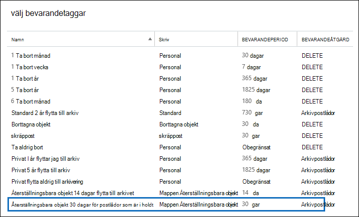
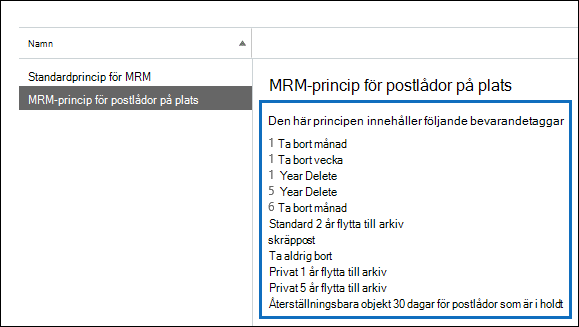

# <a name="increase-the-recoverable-items-quota-for-mailboxes-on-hold"></a>Öka kvoten för återställningsbara objekt för postlådor i undantag

Standardprincipen Exchange med namnet Standardprincip för *MRM*– som automatiskt tillämpas på nya postlådor i Exchange Online innehåller en bevarandetagg med namnet Återställningsbara objekt 14 dagar flytta till arkivering. Med den här bevarandetaggen flyttas objekt från mappen Återställningsbara objekt i användarens primära postlåda till mappen Återställningsbara objekt i användarens arkivpostlåda efter att de 14 dagar det gått ut. För att det här ska hända måste användarens arkivpostlåda vara aktiverad. Om arkivpostlådan inte är aktiverad vidtas ingen åtgärd, vilket innebär att objekt i mappen Återställningsbara objekt för en postlåda som är undantaget inte flyttas till arkivpostlådan efter att de 14 dagar det gått ut. Eftersom ingenting tas bort från en postlåda som är förvaring kan det vara så att lagringskvoten för mappen Återställningsbara objekt kan överskridas, särskilt om användarens arkivpostlåda inte är aktiverad. 
  
För att minska risken att överskrida gränsen ökar lagringskvoten för mappen Återställningsbara objekt automatiskt från 30 GB till 100 GB när ett förvaringsutrymme sätts på en postlåda i Exchange Online. Om arkivpostlådan är aktiverad ökar även lagringskvoten för mappen Återställningsbara objekt i arkivpostlådan från 30 GB till 100 GB. Om den automatiskt expanderande arkiveringsfunktionen i Exchange Online är aktiverad är lagringskvoten för mappen Återställningsbara objekt i användarens arkiv obegränsad.
  
 I följande tabell sammanfattas lagringskvoten för mappen återställningsbara objekt. 
  
|**Plats för mappen återställningsbara objekt**|**Postlådor som inte är på plats**|**Postlådor på plats**|
|:-----|:-----|:-----|
|Primär postlåda  <br/> |30 GB  <br/> |100 GB  <br/> |
|Arkivpostlåda<sup>\*</sup> <br/> |Obegränsat  <br/> |Obegränsat  <br/> |
|**Total lagringskvot för mappen Återställningsbara objekt** <br/> |Obegränsat  <br/> |Obegränsat  <br/> |
   
> [!NOTE]
> <sup>\*</sup>Den ursprungliga lagringskvoten för arkivpostlådan är 100 GB för användare med en Exchange Online (alternativ 2) licens. När automatisk utökad arkivering är aktiverat för arkivering av postlådor ökar lagringskvoten för både arkivpostlådan och mappen Återställningsbara objekt till 110 GB. Ytterligare lagringsutrymme för arkivering kommer att tillhandahållas vid behov, vilket resulterar i en obegränsad mängd arkivlagring. Mer information om automatiskt expanderande arkivering finns i [Översikt över obegränsat arkivering i Office 365](unlimited-archiving.md). 
  
När lagringskvoten för mappen Återställningsbara objekt i den primära postlådan för en postlåda som är i förvaring ligger nära gränsen kan du göra följande:
  
- **Aktivera arkivpostlådan och aktivera automatisk expandering av arkivering.** Du kan aktivera en obegränsad lagringskapacitet för mappen återställningsbara objekt genom att helt enkelt aktivera arkivpostlådan och sedan aktivera den automatiskt expanderande arkiveringsfunktionen i Exchange Online. Det ger 110 GB för mappen Återställningsbara objekt i den primära postlådan och en obegränsad lagringskapacitet för mappen Återställningsbara objekt i användarens arkiv. Så här gör [du: Aktivera arkivpostlådor](enable-archive-mailboxes.md) i Säkerhets- & och Aktivera obegränsad [arkivering i Office 365.](enable-unlimited-archiving.md)
    
    > [!NOTE]
    > När du har aktiverat arkivet för en postlåda som ligger nära att överskrida lagringskvoten för mappen Återställningsbara objekt kan du köra assistenten för hanterade mappar så att assistenten manuellt bearbetar postlådan så att förfallna objekt flyttas till mappen Återställningsbara objekt i arkivpostlådan. Anvisningar [finns i Steg 4.](#optional-step-4-run-the-managed-folder-assistant-to-apply-the-new-retention-settings) Observera att andra objekt i användarens postlåda kan flyttas till den nya arkivpostlådan. Överväg att berätta för användaren att detta kan hända när du har aktiverar arkivpostlådan. 
  
- **Skapa en egen Exchange bevarandeprincip för postlådor som är bevarande.** Förutom att aktivera arkivpostlådan och automatiskt expanderande arkivering för postlådor med bevarande av juridiska skäl eller In-Place bevarande kan du också skapa en egen bevarandeprincip för Exchange för postlådor som är bevarande. På så sätt kan du tillämpa en bevarandeprincip på andra postlådor än standardprincipen för MRM som används för postlådor som inte är på plats, och du kan använda bevarandetaggar som är avsedda för postlådor som är bevarande. Det handlar bland annat om att skapa en ny bevarandetagg för mappen för återställningsbara objekt. 
    
Resten av det här avsnittet beskriver de stegvisa procedurerna för att skapa en anpassad Exchange för bevarandeprincip för postlådor.
  
[Steg 1: Skapa en anpassad bevarandetagg för mappen Återställningsbara objekt](#step-1-create-a-custom-retention-tag-for-the-recoverable-items-folder)

[Steg 2: Skapa en Exchange bevarandeprincip för postlådor](#step-2-create-a-new-exchange-retention-policy-for-mailboxes-on-hold)

[Steg 3: Tillämpa den Exchange bevarandeprincipen på postlådor som är bevarande](#step-3-apply-the-new-exchange-retention-policy-to-mailboxes-on-hold)

[(Valfritt) Steg 4: Kör assistenten för hanterade mappar för att tillämpa de nya bevarandeinställningarna](#optional-step-4-run-the-managed-folder-assistant-to-apply-the-new-retention-settings)
  
## <a name="step-1-create-a-custom-retention-tag-for-the-recoverable-items-folder"></a>Steg 1: Skapa en anpassad bevarandetagg för mappen Återställningsbara objekt

Det första steget är att skapa en anpassad bevarandetagg (kallas bevarandeprinciptagg eller bevarandeprinciptagg) för mappen återställningsbara objekt. Som tidigare förklarats flyttar den här artikeln objekt från mappen Återställningsbara objekt i användarens primära postlåda till mappen Återställningsbara objekt i användarens arkivpostlåda. Du måste använda PowerShell för att skapa en återställningsbar objekt-mapp för mappen Återställningsbara objekt. Du kan inte använda Exchange (EAC). 
  
1. [Ansluta till Exchange Online med fjärr-PowerShell](/powershell/exchange/connect-to-exchange-online-powershell)
    
2. Kör följande kommando för att skapa en ny återställningsbar objekt-mapp: 
    
    ```powershell
    New-RetentionPolicyTag -Name <Name of RPT> -Type RecoverableItems -AgeLimitForRetention <Number of days> -RetentionAction MoveToArchive
    ```

    Följande kommando skapar till exempel en bevarandeprincipprincip för återställningsbara objekt-mappen med namnet Återställningsbara objekt 30 dagar för postlådor som är bevarande, med en kvarhållningstid på 30 dagar. Det innebär att när ett objekt har legat i mappen återställningsbara objekt i 30 dagar flyttas det till mappen Återställningsbara objekt i användarens arkivpostlåda.
    
    ```powershell
    New-RetentionPolicyTag -Name "Recoverable Items 30 days for mailboxes on hold" -Type RecoverableItems -AgeLimitForRetention 30 -RetentionAction MoveToArchive
    ```

    > [!TIP]
    > Vi rekommenderar att kvarhållningstiden (som definieras av parametern  _AgeLimitForRetention)_ för bevarandeprincipobjektet för återställningsbara objekt är densamma som kvarhållningsperioden för borttagna objekt för postlådorna som bevarandeprincipprincipen ska tillämpas på. På så sätt kan användaren återställa borttagna objekt under hela bevarandeperioden innan de flyttas till arkivpostlådan. I exemplet ovan har kvarhållningstiden angetts till 30 dagar utifrån antagandet att bevarandeperioden för borttagna objekt för postlådor också är 30 dagar. En Exchange Online är konfigurerad att behålla borttagna objekt i 14 dagar som standard. Men du kan ändra den här inställningen till högst 30 dagar. Mer information finns i Ändra [bevarandetiden för borttagna objekt för en postlåda i Exchange Online](https://www.microsoft.com/?ref=go). 
  
## <a name="step-2-create-a-new-exchange-retention-policy-for-mailboxes-on-hold"></a>Steg 2: Skapa en Exchange bevarandeprincip för postlådor

Nästa steg är att skapa en ny bevarandeprincip och lägga till bevarandetaggar i den, inklusive bevarandeprinciptaggen för återställningsbara objekt som du skapade i steg 1. Den här nya principen kommer att tillämpas på postlådor som är på plats i nästa steg. 
  
Innan du skapar den nya bevarandeprincipen måste du bestämma vilka ytterligare bevarandetaggar du vill lägga till. En lista med de bevarandetaggar som läggs till i standardprincipen för MRM och information om hur du skapar nya bevarandetaggar finns i följande avsnitt:
  
- [Standardprincip för bevarande i Exchange Online](/exchange/security-and-compliance/messaging-records-management/default-retention-policy)
    
- [Standardmappar med stöd för bevarandeprinciptaggar](/exchange/security-and-compliance/messaging-records-management/default-folders)
    
- Avsnittet "Skapa en bevarandetagg" i avsnittet [Skapa en bevarandeprincip.](/exchange/security-and-compliance/messaging-records-management/create-a-retention-policy)
    
Du kan använda EAC eller Exchange Online PowerShell för att skapa en bevarandeprincip.
  
### <a name="use-the-eac-to-create-a-retention-policy"></a>Använda EAC för att skapa en bevarandeprincip
  
1. I EAC går du till **Bevarandeprinciper för** \> **efterlevnadshantering och** klickar sedan på Lägg till   ikon.
    
2. Ange **ett namn som** beskriver syftet **med** bevarandeprincipen under Namn på sidan Ny bevarandeprincip. **MRM-princip för postlådor som är på plats.** 
    
3. Klicka **på Lägg till ikon** under **Bevarandetaggar.** 
    
4. Markera bevarandetaggen för återställningsbara objekt som du skapade i steg 1 i listan med bevarandetaggar och klicka sedan på Lägg **till.**
    
    
  
5. Välj ytterligare bevarandetaggar som du vill lägga till i bevarandeprincipen. Du kanske till exempel vill lägga till samma taggar som ingår i standardprincipen för MRM.
    
6. När du är klar med att lägga till bevarandetaggar klickar du på **OK.**
    
7. Klicka **på Spara** för att skapa den nya bevarandeprincipen. 
    
    Observera att de bevarandetaggar som är kopplade till bevarandeprincipen visas i informationsfönstret.
    
    
  
### <a name="use-exchange-online-powershell-to-create-a-retention-policy"></a>Använda Exchange Online PowerShell för att skapa en bevarandeprincip
  
Kör följande kommando för att skapa en ny bevarandeprincip för postlådor som är bevarande. 
  
```powershell
New-RetentionPolicy <Name of retention policy>  -RetentionPolicyTagLinks <list of retention tags>

```

Följande kommando skapar till exempel kvarhållningsprincipen och länkade bevarandetaggar som visas i föregående bild.
  
```powershell
New-RetentionPolicy "MRM Policy for Mailboxes on Hold"  -RetentionPolicyTagLinks "Recoverable Items 30 days for mailboxes on hold","1 Month Delete","1 Week Delete","1 Year Delete","5 Year Delete","6 Month Delete","Default 2 year move to archive","Junk Email","Never Delete","Personal 1 year move to archive","Personal 5 year move to archive"
```

## <a name="step-3-apply-the-new-exchange-retention-policy-to-mailboxes-on-hold"></a>Steg 3: Tillämpa den Exchange bevarandeprincipen på postlådor som är bevarande

Det sista steget är att tillämpa den nya bevarandeprincip du skapade i steg 2 på postlådor som är bevarande i organisationen. Du kan använda EAC eller Exchange Online PowerShell för att tillämpa kvarhållningsprincipen på en enskild postlåda eller flera postlådor. 
  
### <a name="use-the-eac-to-apply-the-new-retention-policy"></a>Använda EAC för att tillämpa den nya bevarandeprincipen
  
1. Gå till  >  **Mottagarnas postlådor.**
    
2. Markera den postlåda som du vill tillämpa bevarandeprincipen på i listvyn och klicka sedan **på** Redigera  .
    
3. Klicka på **Postlådefunktioner** på **sidan Användarpostlåda.**
    
4. Välj **den bevarandeprincip** du skapade i steg 2 under Bevarandeprincip och klicka sedan på **Spara.**
    
Du kan också använda EAC för att tillämpa kvarhållningsprincipen på flera postlådor.
  
1. Gå till  >  **Mottagarnas postlådor.**
    
2. I listvyn använder du tangenterna Skift eller Ctrl för att markera flera postlådor.
    
3. Klicka på Fler alternativ i **informationsfönstret.**
    
4. Klicka **på Uppdatera under** **Bevarandeprincip.**
    
5. Markera den **bevarandeprincip du** skapade i steg 2 på sidan Mass tilldela bevarandeprincip och klicka sedan på **Spara.** 
    
### <a name="use-exchange-online-powershell-to-apply-the-new-retention-policy"></a>Använda Exchange Online PowerShell för att tillämpa den nya bevarandeprincipen
  
Du kan använda Exchange Online PowerShell för att tillämpa en ny bevarandeprincip på en enda postlåda. Men den faktiska kraften hos PowerShell är att du kan använda det för att snabbt identifiera alla postlådor i organisationen som har bevarande av juridiska skäl eller In-Place bevarande, och sedan tillämpa den nya bevarandeprincipen på alla postlådor som är bevarande i ett enda kommando. Här är några exempel på hur du Exchange PowerShell för att tillämpa en bevarandeprincip på en eller flera postlådor. I alla exempel tillämpas bevarandeprincipen som skapades i steg 2.
  
I det här exemplet tillämpas den nya bevarandeprincipen på Pilar Pinillas postlåda.
  
```powershell
Set-Mailbox "Pilar Pinilla" -RetentionPolicy "MRM Policy for Mailboxes on Hold"
```

Det här exemplet gäller den nya bevarandeprincipen för alla postlådor i organisationen där bevarande av juridiska skäl används.
  
```powershell
$LitigationHolds = Get-Mailbox -ResultSize unlimited | Where-Object {$_.LitigationHoldEnabled -eq 'True'}
```

```powershell
$LitigationHolds.DistinguishedName | Set-Mailbox -RetentionPolicy "MRM Policy for Mailboxes on Hold"
```

Det här exemplet gäller den nya bevarandeprincipen för alla postlådor i organisationen som finns In-Place bevarande.
  
```powershell
$InPlaceHolds = Get-Mailbox -ResultSize unlimited | Where-Object {$_.InPlaceHolds -ne $null}
```

```powershell
$InPlaceHolds.DistinguishedName | Set-Mailbox -RetentionPolicy "MRM Policy for Mailboxes on Hold"
```

Du kan använda **cmdlet:en Get-Mailbox** för att verifiera att den nya bevarandeprincipen har tillämpats. 
  
Här är några exempel för att verifiera att kommandona i de tidigare exemplen har tillämpat kvarhållningsprincipen "MRM-princip för postlådor på bevarande" för postlådor med bevarande av juridiska skäl och postlådor In-Place bevarande.
  
```powershell
Get-Mailbox "Pilar Pinilla" | Select RetentionPolicy
```

```powershell
Get-Mailbox -ResultSize unlimited | Where-Object {$_.LitigationHoldEnabled -eq 'True'} | FT DisplayName,RetentionPolicy -Auto
```

```powershell
Get-Mailbox -ResultSize unlimited | Where-Object {$_.InPlaceHolds -ne $null} | FT DisplayName,RetentionPolicy -Auto
```

## <a name="optional-step-4-run-the-managed-folder-assistant-to-apply-the-new-retention-settings"></a>(Valfritt) Steg 4: Kör assistenten för hanterade mappar för att tillämpa de nya bevarandeinställningarna

När du har tillämpat den nya Exchange-bevarandeprincipen på postlådor som är bevarande kan det ta upp till 7 dagar i Exchange Online för assistenten för hanterade mappar att bearbeta postlådorna med inställningarna i den nya bevarandeprincipen. I stället för att vänta på att assistenten för hanterade mappar körs kan du använda cmdleten **Start-ManagedFolderAssistant** till att manuellt utlösa assistenten att bearbeta postlådorna som du tillämpade den nya bevarandeprincipen på. 
  
Kör följande kommando för att starta assistenten för hanterade mappar för Pilar Pinillas postlåda.
  
```powershell
Start-ManagedFolderAssistant "Pilar Pinilla"
```

Kör följande kommandon för att starta assistenten för hanterade mappar för alla postlådor som är i följd.
  
```powershell
$MailboxesOnHold = Get-Mailbox -ResultSize unlimited | Where-Object {($_.InPlaceHolds -ne $null) -or ($_.LitigationHoldEnabled -eq "True")}
```

```powershell
$MailboxesOnHold.DistinguishedName | Start-ManagedFolderAssistant
```

## <a name="more-information"></a>Mer information

- När du har aktiverar en användares arkivpostlåda kan du berätta för användaren att andra objekt i användarens postlåda (inte bara objekt i mappen Återställningsbara objekt) kan flyttas till arkivpostlådan. Det beror på att standardprincipen för MRM som har tilldelats till Exchange Online-postlådor innehåller en bevarandetagg (med namnet Standard 2 år flytta till arkiv) som flyttar objekt till arkivpostlådan två år efter datumet då objektet levererades till postlådan eller skapades av användaren. Mer information finns i [Standardprincip för bevarande i Exchange Online](/exchange/security-and-compliance/messaging-records-management/default-retention-policy)
    
- När du har aktiverar en användares arkivpostlåda kan du även berätta för användaren att de kan återställa borttagna objekt i mappen Återställningsbara objekt i deras arkivpostlåda. Det kan de göra i Outlook  genom att välja mappen Borttaget i arkivpostlådan och sedan klicka på Återställ borttagna objekt från **servern** på **fliken** Start. Mer information om hur du återställer borttagna objekt finns i [Återskapa borttagna objekt i Outlook för Windows](https://go.microsoft.com/fwlink/p/?LinkId=624829).