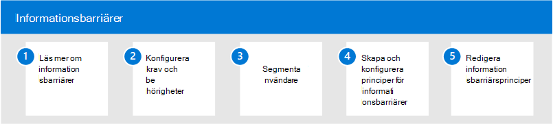

# Informationsbarriärer i Microsoft 365Information barriers in Microsoft 365

Microsoft 365 möjliggör kommunikation och samarbete mellan grupper och organisationer samt stöd för sätt att begränsa kommunikation och samarbete mellan specifika grupper av användare vid behov.Microsoft 365 enables communication and collaboration across groups and organizations and supports ways to restrict communication and collaboration among specific groups of users when necessary. Det kan inkludera situationer eller scenarier där du vill begränsa kommunikation och samarbete mellan två grupper för att undvika att en intressekonflikt uppstår i organisationen.This may include situations or scenarios where you want to restrict communication and collaboration between two groups to avoid a conflict of interest from occurring in your organization. Det kan också vara situationer där du behöver begränsa kommunikation och samarbete mellan vissa personer i organisationen för att skydda intern information.This may also include situations when you need to restrict communication and collaboration between certain people inside your organization to safeguard internal information.

Informationsbarriärer stöds i Microsoft Teams, SharePoint Online och OneDrive för företag.Information barriers are supported in Microsoft Teams, SharePoint Online, and OneDrive for Business. En efterlevnadsadministratör eller informationsbarriäradministratör kan definiera principer för att tillåta eller förhindra kommunikation mellan grupper av användare i Microsoft Teams.A compliance administrator or information barriers administrator can define policies to allow or prevent communications between groups of users in Microsoft Teams. Informationsbarriärprinciper kan användas i situationer som dessa:Information barrier policies can be used for situations like these:

- Användare i daggruppen ska inte kommunicera eller dela filer med marknadsföringsteametUser in the day trader group should not communicate or share files with the marketing team
- Ekonomipersonal som arbetar med konfidentiell företagsinformation ska inte kommunicera eller dela filer med vissa grupper inom organisationenFinance personnel working on confidential company information should not communicate or share files with certain groups within their organization
- Ett internt team med affärshemlighetsmaterial ska inte ringa eller chatta online med personer i vissa grupper inom organisationenAn internal team with trade secret material should not call or chat online with people in certain groups within their organization
- En forskningsgrupp ska endast ringa eller chatta online med ett utvecklingsteamA research team should only call or chat online with a product development team

## Konfigurera informationsbarriärer för Microsoft 365Configure information barriers for Microsoft 365

Använd följande steg för att konfigurera informationsbarriärer för din organisation:Use the following steps to configure information barriers for your organization:

1. Läs mer [om informationsbarriärer](information-barriers.md) i Microsoft 365Learn about [information barriers](information-barriers.md) in Microsoft 365
2. Konfigurera [krav och behörigheter](information-barriers-policies.md#prerequisites)Configure [prerequisites and permissions](information-barriers-policies.md#prerequisites)
3. Segmentanvändare [i organisationen](information-barriers-policies.md#part-1-segment-users)Segment [users in your organization](information-barriers-policies.md#part-1-segment-users)
4. Skapa och konfigurera [principer för informationsbarriärer](information-barriers-policies.md#part-2-define-information-barrier-policies)Create and configure [information barrier policies](information-barriers-policies.md#part-2-define-information-barrier-policies)
5. Tillämpa [principer för informationsbarriärer](information-barriers-policies.md#part-3-apply-information-barrier-policies)Apply [information barrier policies](information-barriers-policies.md#part-3-apply-information-barrier-policies)

## Mer information om informationsbarriärerMore information about information barriers

- [Attribut för informationsbarriärsprinciperAttributes for information barrier policies](information-barriers-attributes.md)
- [Redigera eller ta bort informationsbarriärerEdit or remove information barrier policies](information-barriers-edit-segments-policies.md)