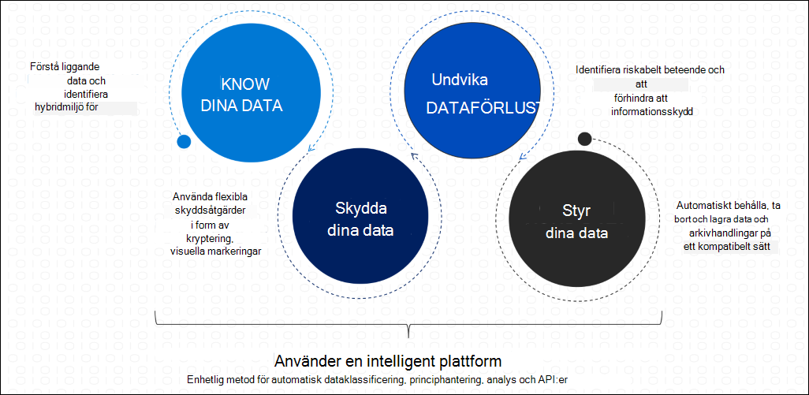

# Microsoft Information Protection i Microsoft 365.

>*[Licensiering för Microsoft 365 Säkerhetscenter och efterlevnad](/office365/servicedescriptions/microsoft-365-service-descriptions/microsoft-365-tenantlevel-services-licensing-guidance/microsoft-365-security-compliance-licensing-guidance)*

Implementera Microsoft Information Protection (MIP) som hjälper dig att upptäcka, klassificera och skydda känslig information var du än befinner dig eller på språng.

MIP-funktioner ingår i Microsoft 365 Efterlevnad och ger dig verktygen för att [känna till dina data](#know-your-data), [skydda dina data](#protect-your-data)och [förhindra dataförlust](#prevent-data-loss).

Information om hur du styr dina data finns i [Informationsstyrning i Microsoft 365](manage-Information-governance.md).

## Var bekant med dina data

> [!NOTE]
> Information om omfattningen om hur du klassificerar och etiketterar data i Azure Purview, som för närvarande är i förhandsversion, finns i[ Märka innehållet i Azure Purview automatiskt](/azure/purview/create-sensitivity-label).
> 
> Publiceringsmeddelanden för Azure Purview finns i följande blogginlägg: [Microsoft Information Protection och Microsoft Azure Purview: Better Together](https://techcommunity.microsoft.com/t5/microsoft-security-and/microsoft-information-protection-and-microsoft-azure-purview/ba-p/1957481) och [Azure Purview på Ignite 2021](https://techcommunity.microsoft.com/t5/azure-purview/azure-purview-at-spring-ignite-2021/ba-p/2175919).

För att förstå datalandskapet och identifiera viktiga data i hybridmiljön använder du följande funktioner:
 
|Funktion|Vilka problem löser den?|Komma igång|
|:------|:------------|:--------------------|
|[Typer av känslig information](sensitive-information-type-learn-about.md)| Identifierar känsliga data med hjälp av inbyggda eller anpassade vanliga uttryck eller en funktion. Samarbetsbevis innehåller nyckelord, konfidensnivåer och närhet.| [Anpassa en inbyggd typ av känslig information](customize-a-built-in-sensitive-information-type.md)|
|[Utbildningsbara klassificerare](classifier-learn-about.md)| Identifierar känsliga data med hjälp av exempel på data som du är intresserad av i stället för att identifiera element i objektet (mönstermatchning). Du kan använda inbyggda klassificerare eller träna en klassificerare med ditt eget innehåll.| [Kom igång med utbildningsbara klassificerare](classifier-get-started-with.md) |
|[Dataklassificering](data-classification-overview.md) | En grafisk identifiering av objekt i organisationen som har en känslighetsetikett, en kvarhållningsetikett eller som har klassificeras. Du kan också använda den här informationen för att få insights om vad användarna gör med de här objekten. | [Kom igång med innehållsutforskaren](data-classification-content-explorer.md)   [Kom igång med aktivitetsutforskaren](data-classification-activity-explorer.md) |

## Skydda dina data

Om du vill använda flexibla skyddsåtgärder som inkluderar kryptering, åtkomstbegränsningar och visuella markeringar använder du följande funktioner:

|Funktion|Vilka problem löser den?|Komma igång|
|:------|:------------|---------------------|
|[Känslighetsetiketter](sensitivity-labels.md)| En lösning för alla program, tjänster och enheter som kan märka och skydda dina data när de färdas inom och utanför organisationen.   Exempelscenarier:   [Använda känslighetsetiketter för Office-appar](sensitivity-labels-office-apps.md)  [Kryptera dokument och e-postmeddelanden](encryption-sensitivity-labels.md )  [Använda och visa etiketter i Power BI](/power-bi/admin/service-security-apply-data-sensitivity-labels)    En fullständig lista över scenarier för känslighetsetiketter finns i komma igång-dokumentationen.|[Kom igång med känslighetsetiketter](get-started-with-sensitivity-labels.md) |
|[Azure Information Protection-klienten för enhetliga etiketter:](/azure/information-protection/rms-client/aip-clientv2)| För Windows-datorer utökar känslighetsetiketterna för ytterligare egenskaper och funktioner, inklusive etikettering och skydd av alla filtyper från Utforskaren och PowerShell   Exempel på ytterligare funktioner: [Anpassade konfigurationer för Azure Information Protection-klienten för enhetliga etiketter](/azure/information-protection/rms-client/clientv2-admin-guide-customizations)| [Administratörsguiden för Azure Information Protection-klienten för enhetliga etiketter](/azure/information-protection/rms-client/clientv2-admin-guide)|
|[Kryptering med dubbla nycklar](double-key-encryption.md)| Under alla förhållanden är det bara organisationen som kan dekryptera skyddat innehåll eller för att uppfylla gällande bestämmelser måste du hålla krypteringsnycklar inom en geografisk gräns. | [Distribuera kryptering med dubbla nycklar](double-key-encryption.md#deploy-dke)|
|[Meddelandekryptering i Office 365 (OME)](ome.md)| Krypterar e-postmeddelanden och bifogade dokument som skickas till alla användare på valfri enhet, så att endast behöriga mottagare kan läsa information som skickas via e-post.    Exempelscenario: [Återkalla e-post som krypterats med Advanced Message Encryption](revoke-ome-encrypted-mail.md) | [Konfigurera nya funktioner för meddelandekryptering](set-up-new-message-encryption-capabilities.md)|
|[Tjänst kryptering med kundnyckel](customer-key-overview.md) | Skyddar mot visning av data av obehöriga system eller personal och kompletterar BitLocker-diskkryptering i Microsofts datacenter. | [Konfigurera Customer Key för Office 365](customer-key-set-up.md)|
|[SharePoint Information Rights Management (IRM).](set-up-irm-in-sp-admin-center.md#irm-enable-sharepoint-document-libraries-and-lists)|Skyddar SharePoint-listor och SharePoint-bibliotek så att den nedladdade filen skyddas när en användare checkar ut ett dokument så att endast behöriga användare kan visa och använda filen enligt principer som du anger. | [Konfigurera Information Rights Management (IRM) i SharePoint admin center](set-up-irm-in-sp-admin-center.md)|
[Rights Management anslutningsprogram](/azure/information-protection/deploy-rms-connector) |Skydd endast för befintliga lokala distributioner som använder Exchange eller SharePoint Server, eller filservrar som kör Windows Server och File Classification Infrastructure (FCI). | [Steg för att distribuera RMS-anslutningsprogram](/azure/information-protection/deploy-rms-connector#steps-to-deploy-the-rms-connector)
|[Azure Information Protection-skanner för enhetliga etikett:](/azure/information-protection/deploy-aip-scanner)| Identifierar, etiketterar och skyddar känslig information som finns i lokala datalager. | [Konfigurera och installera Azure Information Protection-skanner för enhetliga etikettskanner](/azure/information-protection/deploy-aip-scanner-configure-install)|
|[Microsoft Cloud App Security](/cloud-app-security/what-is-cloud-app-security)| Identifierar, etiketterar och skyddar känslig information som finns i molnet. | [Upptäck, klassificera, märka och skydda känsliga och reglerade data som lagras i molnet](/cloud-app-security/best-practices#discover-classify-label-and-protect-regulated-and-sensitive-data-stored-in-the-cloud)|
|[Microsoft Information Protection SDK](/information-protection/develop/overview#microsoft-information-protection-sdk)|Utökar känslighetsetiketter till appar och tjänster från tredje part.     Exempelscenario: [Ange och få en känslighetsetikett ( C++ )](/information-protection/develop/quick-file-set-get-label-cpp) |[Installation och konfiguration av SDK för Microsoft Information Protection (MIP)](/information-protection/develop/setup-configure-mip)|

## Förhindra dataförlust

Använd följande funktioner för att förhindra att känslig information förs över av misstag:

|Funktion|Vilka problem löser den?|Komma igång|
|:------|:------------|:---------------------|
|[Mer information om dataförlustskydd](dlp-learn-about-dlp.md)| Förhindrar oavsiktlig delning av känsliga objekt. | [Kom igång med DLP-standardprincipen](get-started-with-the-default-dlp-policy.md)|
|[Mer information om dataförlustskydd för slutpunkt](endpoint-dlp-learn-about.md)| Utökar DLP-funktionerna till objekt som används och delas på Windows 10-datorer. | [Komma igång med dataförlustskydd för slutpunkt](endpoint-dlp-getting-started.md)|
|[Läs mer om Microsofts Efterlevnadstillägg (förhandsversion)](dlp-chrome-learn-about.md) | Utökar DLP-funktionerna till webbläsaren Chrome | [Kom igång med Microsofts Efterlevnadstillägg (förhandsversion)](dlp-chrome-get-started.md)|
|[Mer information om Microsoft 365 lokal skanner för dataförlustskydd (förhandsversion)](dlp-on-premises-scanner-learn.md)|Utökar DLP-övervakning av filaktiviteter och skyddsåtgärder för dessa filer till lokala filresurser samt SharePoint-mappar och dokumentbibliotek.|[Kom igång med Microsoft 365 lokal skanner för dataförlustskydd (förhandsversion)](dlp-on-premises-scanner-get-started.md)|
|[Skydda känslig information i Teams-chatt och -kanalmeddelanden i Microsoft Teams](dlp-microsoft-teams.md) | Utökar vissa DLP-funktioner till Teams chatt- och kanalmeddelanden | [Läs mer om standardprincipen för dataförlustskydd i Microsoft Teams (förhandsversion)](dlp-teams-default-policy.md)| 

## Ytterligare resurser

Många organisationer använder de här funktionerna för informationsskydd för att uppfylla datasekretessföreskrifter. För att hjälpa har vi utformat ett arbetsflöde som vägleder dig genom en hela processen för att planera och implementera funktioner i Microsoft 365, inklusive säker åtkomst, skydd mot hot, informationsskydd och datastyrning. Mer information finns i [Distribuera informationsskydd för föreskrifter för datasekretess med Microsoft 365](../solutions/information-protection-deploy.md) (aka.ms/m365dataprivacy). 

Om du dessutom vill planera en integrerad strategi för att implementera informationsskyddsfunktioner kan du ladda ned *uppsättningen av bilder i Microsoft 365 informationsskydd och efterlevnadsfunktioner*.  Du kan anpassa illustrationerna för eget bruk.

| Objekt | Beskrivning |
|:-----|:------------|
|   [Ladda ned som PDF](https://download.microsoft.com/download/3/a/6/3a6ab1a3-feb0-4ee2-8e77-62415a772e53/m365-compliance-illustrations.pdf)\| [Hämta som Visio](https://download.microsoft.com/download/3/a/6/3a6ab1a3-feb0-4ee2-8e77-62415a772e53/m365-compliance-illustrations.vsdx)   Japanska[Ladda ned som PDF](https://download.microsoft.com/download/6/f/1/6f1a7d0e-dd8e-442e-b073-8e94327ae4f8/m365-compliance-illustrations.pdf)\| [Hämta som Visio](https://download.microsoft.com/download/6/f/1/6f1a7d0e-dd8e-442e-b073-8e94327ae4f8/m365-compliance-illustrations.vsdx)   Uppdaterades: Oktober 2020|Innehåller: <ul><li>  Microsoft Informationsskydd och dataförlustskydd </li><li>Kvarhållningsprinciper och -etiketter </li><li>Informationsbarriärer</li><li>Kommunikationsefterlevnad</li><li>Hantering av insiderrisk</li><li>Datainmatning för tredje part</li>|