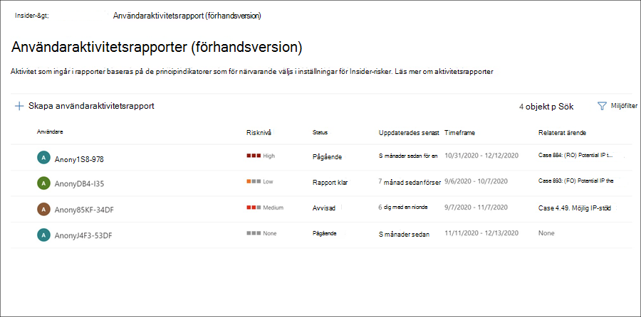

# Undersöka Insider-riskhanteringsaktiviteterInvestigate insider risk management activities

Att undersöka riskfyllda användaraktiviteter är ett viktigt första steg för att minimera Insider-risker för organisationen.Investigating risky user activities is an important first step in minimizing insider risks for your organization. Dessa risker kan vara aktiviteter som genererar varningar från principer för Insider-riskhantering, eller risker från aktiviteter som identifieras av principer men inte omedelbart skapar en varning för insiderriskhantering för användarna.These risks may be activities that generate alerts from insider risk management policies, or risks from activities that are detected by policies but do not immediately create an insider risk management alert for users. Du kan undersöka dessa typer av aktiviteter med hjälp av **användaraktivitetsrapporterna (förhandsversionen)** eller med **instrumentpanelen Avisering.**You can investigate these types of activities by using the **User activity reports (preview)** or with the **Alert dashboard**.

## Användaraktivitetsrapporter (förhandsversion)User activity reports (preview)

Med användaraktivitetsrapporter kan du undersöka aktiviteter för specifika användare under en viss tidsperiod utan att behöva tilldela dem tillfälligt eller uttryckligen till en princip för Insider-riskhantering.User activity reports allow you to examine activities for specific users for a defined time period without having to assign them temporarily or explicitly to an insider risk management policy. I de flesta scenarier med insider-riskhantering definieras användarna uttryckligen i principer och de kan ha principvarningar (beroende på utlösande händelser) och riskpoäng som associeras med aktiviteterna.In most insider risk management scenarios, users are explicitly defined in policies, and they may have policy alerts (depending on triggering events) and risk scores associated with the activities. Men i vissa fall kanske du vill undersöka aktiviteterna för användare som inte uttryckligen definierats i en princip.But in some scenarios, you may want to examine the activities for users that aren't explicitly defined in a policy. Det kan vara användare som du har fått ett tips om användaren och potentiellt riskfyllda aktiviteter, eller användare som normalt inte behöver tilldelas till en princip för insider-riskhantering.These may be users that you've received a tip about the user and potentially risky activities, or users that typically don't need to be assigned to an insider risk management policy.

När du har konfigurerat indikatorer på sidan för **Insider-riskhantering Inställningar** identifieras användaraktivitet för riskabel aktivitet kopplad till de valda indikatorerna.After you've configured indicators on the insider risk management **Settings** page, user activity is detected for risky activity associated with the selected indicators. Du behöver inte konfigurera en princip för användaraktivitetsrapporter för att identifiera och rapportera riskfyllda aktiviteter av användare i organisationen.You do not have to configure a policy for user activity reports to detect and report risky activities by users in your organization. Aktiviteter som ingår i användaraktivitetsrapporter kräver inte utlösande händelser för att aktiviteterna ska visas.Activities included in user activity reports do not require triggering events for the activities to be displayed. Den här konfigurationen innebär att all upptäckt aktivitet för användaren är tillgänglig för granskning, oavsett om den har en utlösande händelse eller om den skapar en avisering.This configuration means that all detected activity for the user is available for review, regardless if it has a triggering event or if it creates an alert. Rapporter skapas per användare och kan innehålla alla aktiviteter under en anpassad 90-dagarsperiod.Reports are created on a per-user basis and can include all activities for a custom 90-day period. Flera rapporter för samma användare stöds inte.Multiple reports for the same user aren't supported.

När du granskat aktiviteter för en användare kan undantag från enskilda aktiviteter avvisas som enstaka aktiviteter som en enstaka aktivitet, dela eller skicka en länk till rapporten via e-post med andra affärsverksamheter, eller välja att tilldela användaren tillfälligt eller uttryckligen en princip för insider-riskhantering.After examining activities for a user, investigators can dismiss individual activities as benign, share or email a link to the report with other investigators, or choose to assign the user temporarily or explicitly to an insider risk management policy. Användarna måste ha tilldelats rollen *Rollgrupp för insiderriskhanteringsroller* för att kunna visa **sidan Användaraktivitetsrapporter.**Users must be assigned to the *Insider Risk Management Investigators* role group to view the **User activity reports** page.  

Du kan komma igång genom att **välja Hantera rapporter** i avsnittet Undersök **användaraktivitet** på sidan Översikt över **Insider-riskhantering.**You can get started by selecting **Manage reports** in the **Investigate user activity** section on the insider risk management **Overview** page. Om du vill visa aktiviteter för en användare väljer **du först Skapa användaraktivitetsrapport** och fyller i följande fält i **rapportfönstret Ny användaraktivitet:**To view activities for a user, first select **Create user activity report** and complete the following fields in the **New user activity report** pane:

- **Användare:** Sök efter en användare efter namn eller e-postadress**User**: Search for a user by name or email address
- **Startdatum:** Använd kalenderkontrollen till att välja startdatum för användaraktiviteter.**Start date**: Use the calendar control to select the start date for user activities.
- **Slutdatum:** Använd kalenderkontrollen till att välja slutdatum för användaraktiviteter.**End date**: Use the calendar control to select the end date for user activities. Det valda slutdatumet måste vara längre än två dagar efter det valda startdatumet och högst 90 dagar från det valda startdatumet.The end date selected must be greater than two days after the selected start date and no greater than 90 days from the selected start date.
Det brukar ta upp till 10 timmar innan nya rapporter är klara för granskning.New reports typically take up to 10 hours before they are ready for review. När rapporten är klar ser du Rapport *klar i* kolumnen **Status** på sidan Användaraktivitetsrapport.When the report is ready, you'll see *Report ready* in the **Status** column on the User activity report page. Välj användaren för att visa den detaljerade rapporten:Select the user to view the detailed report:

**Användaraktivitetsrapporten för den** valda användaren innehåller flikarna **Användaraktivitet och** **Aktivitetsutforskaren:**The **User activity report** for the selected user contains the **User activity** and **Activity explorer** tabs:

- **Användaraktivitet:** Använd den här diagramvyn för att undersöka aktiviteter och visa potentiella aktiviteter som inträffar i sekvenser.**User activity**: Use this chart view to investigate activities and view potential activities that occur in sequences. Den här fliken är strukturerad för att möjliggöra snabb granskning av ett ärende, inklusive en historisk tidslinje för alla aktiviteter, aktivitetsinformation, aktuell riskinformation för användaren i ärendet, sekvensen av riskhändelser och filtreringskontroller som hjälper till med det pågående arbetet.This tab is structured to enable quick review of a case, including a historical timeline of all activities, activity details, the current risk score for the user in the case, the sequence of risk events, and filtering controls to help with investigative efforts.
- **Aktivitetsutforskaren:** **Fliken** Aktivitetsutforskaren ger risk att utforska med ett omfattande analysverktyg som innehåller detaljerad information om aktiviteter.**Activity explorer**: The **Activity explorer** tab provides risk investigators with a comprehensive analytic tool that provides detailed information about activities. Med Aktivitetsutforskaren kan granskare snabbt granska en tidslinje med identifierade riskfyllda aktiviteter och identifiera och filtrera alla riskaktiviteter som associeras med aviseringar.With the Activity explorer, reviewers can quickly review a timeline of detected risky activity and identify and filter all risk activities associated with alerts. Mer information om hur du använder Aktivitetsutforskaren finns i *avsnittet Aktivitetsutforskaren* längre fram i den här artikeln.To learn more about using the Activity explorer, see the *Activity explorer* section later in this article.

## Avisering instrumentpanelenAlert dashboard

Varningar för Insider-riskhantering genereras automatiskt av riskindikatorer som definierats i insider-riskhanteringsprinciper.Insider risk management alerts are automatically generated by risk indicators defined in insider risk management policies. Dessa varningar ger efterlevnadsanalytiker och efterlevnadsanalytiker en uppsyn över den aktuella riskstatusen och gör det möjligt för organisationen att hantera och vidta åtgärder för identifierade risker.These alerts give compliance analysts and investigators an all-up view of the current risk status and allow your organization to triage and take actions for discovered risks. Som standard genererar principer en viss mängd aviseringar med låg,  medel och hög allvarlighetsgrad, men du kan öka eller minska aviseringsvolymen så att den passar dina behov.By default, policies generate a certain amount of low, medium, and high severity alerts, but you can [increase or decrease the alert volume](insider-risk-management-settings.md#alert-volume) to suit your needs. Du kan dessutom konfigurera tröskelvärdet för [avisering för principindikatorer](insider-risk-management-settings.md#indicator-level-settings-preview) när du skapar en ny princip med principguiden.Additionally, you can configure the [alert threshold for policy indicators](insider-risk-management-settings.md#indicator-level-settings-preview) when creating a new policy with the policy wizard.

Titta på [videon](https://www.youtube.com/watch?v=KgmpxBLJLPI) om trekantiga insiderriskvarningar för en översikt över hur aviseringar ger information, sammanhang och relaterat innehåll för riskabel aktivitet och hur du kan göra din undersökningsprocess mer effektiv.Check out the [Insider Risk Management Alerts Triage Experience video](https://www.youtube.com/watch?v=KgmpxBLJLPI) for an overview of how alerts provide details, context, and related content for risky activity and how to make your investigation process more effective.

På instrumentpanelen för **insiderriskvarningar** kan du visa och agera på varningar som genereras av insiderriskprinciper.The insider risk **Alert dashboard** allows you to view and act on alerts generated by insider risk policies. Varje rapportwidget visar information för de senaste 30 dagarna.Each report widget displays information for last 30 days.

- **Totalt antal aviseringar som behöver granskas:** Det totala antalet aviseringar som behöver granskas och triangel visas, inklusive en uppdelning efter allvarlighetsgrad för aviseringar.**Total alerts that need review**: The total number of alerts needing review and triage are listed, including a breakdown by alert severity.
- **Öppna aviseringar under de senaste 30** dagarna: Det totala antalet aviseringar som skapats med principmatchningar under de senaste 30 dagarna, sorterade efter hög, medium och låg allvarlighetsnivå för aviseringar.**Open alerts over past 30 days**: The total number of alerts created by policy matches over the last 30 days, sorted by high, medium, and low alert severity levels.
- **Genomsnittlig tid för att lösa aviseringar**: En sammanfattning av användbar aviseringsstatistik:**Average time to resolve alerts**: A summary of useful alert statistics:
  - Genomsnittlig tid för att lösa varningar med hög allvarlighetsgrad i timmar, dagar eller månader.Average time to resolve high severity alerts, listed in hours, days, or months.
  - Genomsnittlig tid för att lösa aviseringar om medelstor allvarlighetsgrad i timmar, dagar eller månader.Average time to resolve medium severity alerts, listed in hours, days, or months.
  - Genomsnittlig tid för att lösa aviseringar med låg allvarlighetsgrad i timmar, dagar eller månader.Average time to resolve low severity alerts, listed in hours, days, or months.

> [!NOTE]
> Insider-riskhantering använder inbyggd aviseringsbegränsning för att skydda och optimera din riskundersökning och granskningsupplevelse.Insider risk management uses built-in alert throttling to help protect and optimize your risk investigation and review experience. Den här begränsningen gentemot problem som kan leda till att policymeddelanden överbelastas, till exempel felkonfigurerade datakopplingar eller DLP-principer.This throttling guards against issues that might result in an overload of policy alerts, such as misconfigured data connectors or DLP policies. På grund av detta kan det uppstå en fördröjning i visningen av nya aviseringar för en användare.As a result, there might be a delay in displaying new alerts for a user.

## Aviseringsstatus och allvarlighetsgradAlert status and severity

Du kan ändra säkerhetsvarningar till någon av följande statusar:You can triage alerts into one of the following statuses:

- **Bekräftad:** En avisering har bekräftats och tilldelats till ett nytt eller befintligt ärende.**Confirmed**: An alert confirmed and assigned to a new or existing case.
- **Avvisad:** En avisering som har avvisats som en man i triageprocessen.**Dismissed**: An alert dismissed as benign in the triage process.
- **Behöver granskas:** En ny avisering där åtgärder för tredriangulering ännu inte har genomförts.**Needs review**: A new alert where triage actions have not yet been taken.
- **Löst**: En avisering som är en del av ett stängt och löst ärende.**Resolved**: An alert that is part of a closed and resolved case.

Aviseringsriskpoäng beräknas automatiskt utifrån flera riskaktivitetsindikatorer.Alert risk scores are automatically calculated from several risk activity indicators. Indikatorerna omfattar typ av riskaktivitet, antalet och frekvensen för aktivitetshändelsen, historiken över användarriskaktiviteten och tillägg av aktivitet risker som kan öka aktivitetens allvarlighetsnivå.These indicators include the type of risk activity, the number and frequency of the activity occurrence, the history of user risk activity, and the addition of activity risks that may boost the seriousness of the activity. Aviseringsriskresultatet driver programmässiga tilldelningar av en risk allvarlighetsnivå för varje avisering och kan inte anpassas.The alert risk score drives the programmatic assignment of a risk severity level for each alert and cannot be customized. Om aviseringarna är opåverkade och riskaktiviteterna fortsätter att påföras i aviseringen kan allvarlighetsnivån öka.If alerts remain untriaged and risk activities continue to accrue to the alert, the risk severity level can increase. Riskanalytiker och överensstämmelser kan använda varningarnas allvarlighetsgrad för att underlätta varningar i enlighet med organisationens riskprinciper och standarder.Risk analysts and investigators can use the alert risk severity to help triage alerts in accordance with your organization's risk policies and standards.

Aviseringsnivåer med allvarlighetsgrad är:Alert risk severity levels are:

- **Hög allvarlighetsgrad**: Aktiviteterna och indikatorerna för aviseringen utgör en betydande risk.**High severity**: The activities and indicators for the alert pose significant risk. De associerade riskaktiviteterna är allvarliga, repetitiva och viktiga i hög även andra viktiga riskfaktorer.The associated risk activities are serious, repetitive, and corelate strongly to other significant risk factors.
- **Medelstor allvarlighetsgrad**: Aktiviteterna och indikatorerna för aviseringen kan utgöra en måttlig risk.**Medium severity**: The activities and indicators for the alert pose a moderate risk. De associerade riskaktiviteterna är måttliga, vanliga och har ett samband till andra riskfaktorer.The associated risk activities are moderate, frequent, and have some correlation to other risk factors.
- **Låg allvarlighetsgrad**: Aktiviteterna och indikatorerna för aviseringen utgör en mindre risk.**Low severity**: The activities and indicators for the alert pose a minor risk. De associerade riskaktiviteterna är mindre, mer oregelbundna och tar inte endast upp andra viktiga riskfaktorer.The associated risk activities are minor, more infrequent, and do not corelate to other significant risk factors.

## Filtrera aviseringar på instrumentpanelen för aviseringarFilter alerts on the Alert dashboard

Det kan vara svårt att granska en stor kö med aviseringar beroende på antalet och typen av aktiva riskhanteringsprinciper för Insider.Depending on the number and type of active insider risk management policies in your organization, reviewing a large queue of alerts can be challenging. Med hjälp av aviseringsfilter kan analytiker och prognoser sortera aviseringar efter flera attribut.Using alert filters can help analysts and investigators sort alerts by several attributes. Om du vill filtrera aviseringar **på instrumentpanelen Aviseringar** väljer du **filterkontrollen.**To filter alerts on the **Alerts dashboard**, select the **Filter** control. Du kan filtrera aviseringar efter ett eller flera attribut:You can filter alerts by one or more attributes:

- **Status:** Välj en eller flera statusvärden om du vill filtrera aviseringslistan.**Status**: Select one or more status values to filter the alert list. Alternativen är *Bekräftad,* *Avvisad,* *Behöver granska* och *Löst*.The options are *Confirmed*, *Dismissed*, *Needs review*, and *Resolved*.
- **Allvarlighetsgrad**: Välj en eller flera varningsnivåer med allvarlighetsgrad om du vill filtrera aviseringslistan.**Severity**: Select one or more alert risk severity levels to filter the alert list. Alternativen är *Hög,* *Medel* och *Låg.*The options are *High*, *Medium*, and *Low*.
- **Upptäckt tid:** Välj start- och slutdatum för när aviseringen skapades.**Time detected**: Select the start and end dates for when the alert was created.
- **Princip:** Välj en eller flera principer för att filtrera aviseringarna som genereras av de valda principerna.**Policy**: Select one or more policies to filter the alerts generated by the selected policies.

## Sökaviseringar på instrumentpanelen AviseringSearch alerts on the Alert dashboard

Om du vill söka efter aviseringsnamnet för ett visst ord **väljer du sökkontrollen** och skriver ordet för att söka.To search the alert name for a specific word, select the **Search** control and type the word to search. Sökresultatet visar alla principvarningar som innehåller ordet som definierats i sökningen.The search results display any policy alert containing the word defined in the search.

## TriageaviseringarTriage alerts

Så här gör du om du vill ha en insider-riskvarning:To triage an insider risk alert, complete the following steps:

1. I [Microsoft 365 Efterlevnadscenter](https://compliance.microsoft.com)går du till **Insider-riskhantering** och väljer **fliken** Aviseringar.In the [Microsoft 365 compliance center](https://compliance.microsoft.com), go to **Insider risk management** and select the **Alerts** tab.
2. På **instrumentpanelen Aviseringar** väljer du den avisering du vill triangel.On the **Alerts dashboard**, select the alert you want to triage.
3. I **informationsfönstret Aviseringar** kan du granska följande flikar och kontrollera varningen:On the **Alerts detail pane**, you can review the following tabs and triage the alert:
    - **Sammanfattning:** Den här fliken innehåller allmän information om aviseringen och du kan bekräfta aviseringen och skapa ett nytt ärende eller stänga aviseringen.**Summary**: This tab contains general information about the alert and allows you to confirm the alert and create a new case or allows you to dismiss the alert. Den innehåller aktuell status för aviseringen och allvarlighetsnivån för aviseringen, som anges som *Hög,* *Medium* eller *Låg.*It includes the current status for the alert and the alert risk severity level, listed as *High*, *Medium*, or *Low*. Allvarlighetsnivån kan öka eller minska med tiden om aviseringen inte är triangeld.The severity level may increase or decrease over time if the alert is not triaged.
        - **Vad har hänt (förhandsversion)**: Visar de tre viktigaste riskaktiviteterna och principmatchningar under utvärderingsperioden för aktiviteten, inklusive den typ av överträdelse som associeras med aktiviteten och antalet förekomster.**What happened (preview)**: Displays the top three risk activities and policy matches during the activity evaluation period, including the type of violation associated with the activity and the number of occurrences.
        - **Användarinformation:** Visar allmän information om användaren som tilldelats aviseringen.**User details**: Displays general information about the user assigned to the alert. Om anonymisering har aktiverats anonymiseras användarnamn, e-postadress, alias och organisationsfält.If anonymization is enabled, the username, email address, alias, and organization fields are anonymized.
        - **Aviseringsinformation:** Innehåller den tid som gått sedan aviseringen skapades, de principer som genererade aviseringen visas och det ärende som genererades från aviseringen visas.**Alert details**: Includes the length of time since the alert was generated, the policies that generated the alert are listed, and the case generated from the alert is listed. För nya aviseringar visas **Ingen i** fältet Case.For new alerts, the **Case** field displays None.
        - **Innehåll som upptäckts (förhandsversion)**: Inkluderar innehåll som associeras med riskaktiviteterna för aviseringen och sammanfattar aktivitetshändelser efter viktiga områden.**Content detected (preview)**: Includes content associated with the risk activities for the alert and summarizes activity events by key areas. Om du väljer en aktivitetslänk öppnas Aktivitetsutforskaren och ytterligare information om aktiviteten visas.Selecting an activity link opens the Activity explorer and displays additional details about the activity.
    - **Användaraktivitet:** På den här fliken visas aktivitetshistoriken för användaren som är kopplad till aviseringen.**User activity**: This tab displays the activity history for the user associated with the alert. Den här historiken omfattar andra varningar och aktiviteter som rör riskindikatorer som definierats i mallen som tilldelats för den här aviseringen.This history includes other alerts and activities related to risk indicators defined in the template assigned to the policy for this alert. Med hjälp av den här historiken kan riskanalytiker och -analytiker faktors i ett tidigare riskabelt beteende för den anställda som en del av triageprocessen.This history allows risk analysts and investigators to factor in any past risky behavior for the employee as part of the triage process.
    - **Åtgärder:** Följande åtgärder är tillgängliga för varje avisering:**Actions**: The following actions are available for each alert:
        - **Öppna den utökade vyn:** Öppnar instrumentpanelen **i Aktivitetsutforskaren.****Open expanded view**: Opens the **Activity explorer** dashboard.
        - **Bekräfta och skapa ärende:** Använd den här åtgärden för att bekräfta och skapa ett nytt ärende för alla aviseringar som är kopplade till en användare.**Confirm and create case**: Use this action to confirm and create a new case for all the alerts associated with a user. Den här åtgärden ändrar automatiskt aviseringsstatus *till Bekräftad.*This action automatically changes the alert status to *Confirmed*.
        - **Stäng avisering:** Använd den här åtgärden till att stänga aviseringen.**Dismiss alert**: Use this action to dismiss the alert. Den här åtgärden ändrar aviseringsstatus till *Löst*.This action changes the alert status to *Resolved*.

## Aktivitetsutforskaren (förhandsversion)Activity explorer (preview)

> [!NOTE]
> Aktivitetsutforskaren är tillgänglig i området aviseringshantering för användare som utlöser händelser efter att den här funktionen är tillgänglig i din organisation.Activity explorer is available in the alert management area for users with triggering events after this feature is available in your organization.

Aktivitetsutforskaren tillhandahåller riskprognoser och analytiker med ett omfattande analysverktyg som ger detaljerad information om aviseringar.The Activity explorer provides risk investigators and analysts with a comprehensive analytic tool that provides detailed information about alerts. Med Aktivitetsutforskaren kan granskare snabbt granska en tidslinje med identifierade riskfyllda aktiviteter och identifiera och filtrera alla riskaktiviteter som associeras med aviseringar.With the Activity explorer, reviewers can quickly review a timeline of detected risky activity and identify and filter all risk activities associated with alerts. Om du vill filtrera aviseringar i Aktivitetsutforskaren väljer du filterkontrollen.To filter alerts on the Activity explorer, select the Filter control. Du kan filtrera aviseringar efter ett eller flera attribut som visas i informationsfönstret för aviseringen.You can filter alerts by one or more attributes listed in the details pane for the alert. Aktivitetsutforskaren har också stöd för anpassningsbara kolumner så att vi och analytiker kan fokusera på instrumentpanelen på den information som är viktigast för dem.Activity explorer also supports customizable columns to help investigators and analysts focus the dashboard on the information most important to them.

Så här använder du Aktivitetsutforskaren: To use the **Activity explorer**, complete the following steps:

1. I Microsoft 365 Efterlevnadscenter går du till **Insider-riskhantering** och väljer **fliken** Aviseringar.In the Microsoft 365 compliance center, go to **Insider risk management** and select the **Alerts** tab.
2. På **instrumentpanelen Aviseringar** väljer du den avisering du vill triangel.On the **Alerts dashboard**, select the alert you want to triage.
3. I **informationsfönstret Aviseringar väljer** du **Öppna expanderad vy**.On the **Alerts detail pane**, select **Open expanded view**.
4. På sidan för den valda aviseringen väljer du **fliken Aktivitetsutforskaren.**On the page for the selected alert, select the **Activity explorer** tab.

När du granskar aktiviteter i Aktivitetsutforskaren kan analytiker välja en viss aktivitet och öppna fönstret med aktivitetsinformation.When reviewing activities in the Activity explorer, investigators and analysts can select a specific activity and open the activity details pane. I fönstret visas detaljerad information om aktiviteten som vi och analytiker kan använda under aviseringsprocessen.The pane displays detailed information about the activity that investigators and analysts can use during the alert triage process. Den detaljerade informationen kan ge kontext för aviseringen och hjälpa till att identifiera den fullständiga omfattningen av den riskaktivitet som utlöste aviseringen.The detailed information may provide context for the alert and assist with identifying the full scope of the risk activity that triggered the alert.

## Skapa ett ärende för en aviseringCreate a case for an alert

När aviseringen granskas och triangelts kan du skapa ett nytt ärende för att ytterligare undersöka riskaktiviteten.As alert is reviewed and triaged, you can create a new case to further investigate the risk activity. Skapa ett ärende för en avisering genom att följa de här stegen:To create a case for an alert, follow these steps:

1. I [Microsoft 365 Efterlevnadscenter](https://compliance.microsoft.com)går du till **Insider-riskhantering** och väljer **fliken** Aviseringar.In the [Microsoft 365 compliance center](https://compliance.microsoft.com), go to **Insider risk management** and select the **Alerts** tab.
2. På **instrumentpanelen Aviseringar** väljer du den avisering du vill bekräfta och skapar ett nytt ärende för.On the **Alerts dashboard**, select the alert you want to confirm and create a new case for.
3. I **informationsfönstret Aviseringar väljer** du **Åtgärder Bekräfta** aviseringar & skapa  >  **ärende**.On the **Alerts details pane**, select **Actions** > **Confirm alerts & create case**.
4. I dialogrutan Bekräfta avisering och skapa **insider-riskfall** anger du ett namn för ärendet, väljer användare att lägga till som deltagare och lägger till kommentarer som tillämpliga.On the **Confirm alert and create insider risk case** dialog, enter a name for the case, select users to add as contributors, and add comments as applicable. Kommentarer läggs automatiskt till i ärendet som en ärendeanteckning.Comments are automatically added to the case as a case note.
5. Välj **Skapa ärende om** du vill skapa ett nytt ärende eller välj **Avbryt** för att stänga dialogrutan utan att skapa ett ärende.Select **Create case** to create a new case or select **Cancel** to close the dialog without creating a case.

När ärendet har skapats kan finansanalytiker och analytiker hantera och agera på ärendet.After the case is created, investigators and analysts can manage and act on the case. Mer information finns i artikeln om [Insider-riskhanteringsfall.](insider-risk-management-cases.md)For more information, see the [Insider risk management case](insider-risk-management-cases.md) article.
