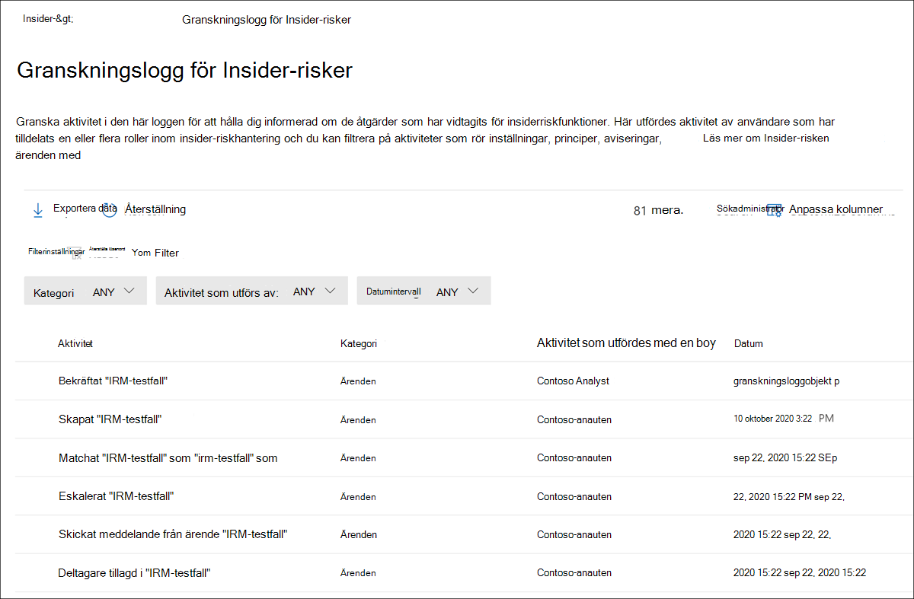

# Granskningslogg för Insider-riskhanteringInsider risk management audit log

Med granskningsloggen för Insider-riskhantering kan du hålla dig informerad om de åtgärder som har vidtagits med insider-riskhanteringsfunktioner.The insider risk management audit log enables you to stay informed on the actions that were taken on insider risk management features. Med den här loggen kan du oberoende granska de åtgärder som vidtas av användare som har tilldelats en eller flera rollgrupper för Insider-riskhantering.This log allows independent review of the actions taken by users assigned to one or more insider risk management role groups. Granskningsloggen för Insider-riskhantering aktiveras automatiskt i organisationen och kan inte inaktiveras.The insider risk management audit log is automatically enabled in your organization and cannot be disabled.

Granskningsloggen uppdateras automatiskt och omedelbart när övervakade aktiviteter äger rum och loggen behåller information om aktiviteten i 180 dagar (ungefär sex månader).The audit log is automatically and immediately updated whenever monitored activities occur and the log retains information about the activity for 180 days (about six months). Efter 180 dagar tas data för aktiviteten bort permanent från loggen.After 180 days, the data for the activity is permanently deleted from the log.

Exempel på områden som ingår i aktivitetsövervakning:Areas included in activity monitoring include:

- PrinciperPolicies
- ÄrendenCases
- VarningarAlerts
- InställningarSettings
- AnvändareUsers
- MeddelandemallarNotice templates

Om du vill visa och exportera data från granskningsloggen måste användarna tilldelas rollgrupperna *Insider-riskhantering* eller *Insider-riskhanteringsgranskningar.*To view and export data from the audit log, users must be assigned to the *Insider Risk Management* or *Insider Risk Management Auditors* role groups. Mer information om rollgrupper i Insider-riskhantering finns i [Komma igång med insider-riskhantering steg 1: Aktivera behörigheter.](insider-risk-management-configure.md#step-1-enable-permissions-for-insider-risk-management)To learn more about insider risk management role groups, see [Getting started with insider risk management Step 1: Enabling permissions](insider-risk-management-configure.md#step-1-enable-permissions-for-insider-risk-management).

>[!NOTE]
>Insider-granskningsloggen för riskhantering är inte kopplad till Microsoft 365, de är oberoende granskningssystem och samlar in information om separata aktiviteter.The insider risk management audit log isn't associated with the Microsoft 365 audit log, they are independent auditing systems and capture information on separate activities. Om du inaktiverar Microsoft 365 påverkar inte aktivitetgranskning inom Insider-riskhantering.Disabling Microsoft 365 auditing doesn't impact activity auditing within insider risk management.

## Visa aktivitet i granskningsloggen för Insider-riskerView activity in the insider risk audit log

Du kan visa övervakad funktionsaktivitet för Insider-riskhantering genom att gå till och välja länken granskningslogg för **Insider-risker** i det övre högra området på någon flik för Insider-riskhantering. Som standard visas följande information för Insider-riskhanteringsaktiviteter:To view feature activity monitored for insider risk management, navigate to, and select the **Insider risk audit log** link in the top-right area of any insider risk management tab. By default, you'll see the following information displayed for insider risk management activities:

- **Aktivitet:** En beskrivning av en användares aktivitet i Insider-riskhanteringslösningen.**Activity:** A description of the activity taken within the insider risk management solution by a user.
- **Kategori:** Området eller objektet där aktiviteten utfördes.**Category:** The area or item where the activity was performed. Du ser till exempel Principer *som kategorin* när aktiviteter för principändring utfördes.For example, you'll see *Policies* as the category when policy change activities were performed.
- **Aktivitet som utförs av:** Användarnamnet för användaren som utförde aktiviteten.**Activity performed by:** The user name of the user that performed the activity.
- **Datum:** Datum och tid då aktiviteten utfördes.**Date:** The date and time the activity was performed. Datum och tid är det lokala datum och den tid som gäller för din organisation.The date and time are the local date and time for your organization.

Om du vill ha mer information om en loggad aktivitet väljer du aktiviteten för att visa fönstret med aktivitetsinformation.For more information about a logged activity, select the activity to display the activity details pane. Det här fönstret innehåller ytterligare information om aktiviteten.This pane includes additional information about the activity.

## Kolumner och filtreringColumns and filtering

För att det ska vara enklare för granskare att granska loggad aktivitet stöds filtrering i **Insider-granskningsloggen för risker.**To make it easier for auditors to review logged activity, filtering is supported in the **Insider risk audit log**. För grundläggande filtrering är kökolumner tillgängliga att lägga till i vyn för att ge olika pivoter på filer och meddelanden.For basic filtering, queue columns are available to add to the view to provide different pivots on the files and messages. Du kan filtrera aktiviteter efter **fälten Kategori, Datumintervall** **och** Aktivitet.You can filter activities by the **Category, Date range,** and **Activity performed by** fields.

Om du vill lägga till eller ta bort kolumnrubriker för aktivitetskön använder du kontrollen **Anpassa** kolumner och väljer kolumnalternativ.To add or remove column headings for the activity queue, use the **Customize columns** control and select from the column options. De här kolumnerna mappas till vanliga villkor som stöds i **Insider-granskningsloggen** för risker och listas senare i den här artikeln.These columns map to common conditions supported in the **Insider risk audit log** and are listed later in this article.

## GranskningsloggexportAudit log export

Användare som har tilldelats rollgrupperna *Insider-riskhantering* eller Insider-riskhanteringsgarna kan exportera all aktivitet i granskningsloggen till en .csv-fil (kommaavgränsade värden) genom att välja  **Exportera** på sidan Granskningslogg för **Insider-risk.**Users assigned to the *Insider Risk Management* or *Insider Risk Management Auditors* role groups can export all activity in the audit log to a .csv (comma-separated values) file by selecting **Export** on the **Insider risk audit log** page. Beroende på aktiviteten kanske vissa fält för en aktivitet inte gäller för aktiviteten, och dessa fält visas som tomma i den exporterade filen.Depending on the activity, some fields for an activity may not be applicable to the activity and these fields will appear as blank in the exported file.

Filen innehåller aktivitetsinformation för följande fält:The file contains activity information for the following fields:

- **Aktivitet som utförs av:** Användarnamnet för den användare som ändrar ett objektvärde.**Activity performed by:** The user name of the user modifying an item value. Användare som anges här har tilldelats en eller flera av följande rollgrupper för [insider-riskhantering:](insider-risk-management-configure.md#step-1-enable-permissions-for-insider-risk-management) *Insider-riskhantering,* *Insider-riskhanteringsadministratörer,* Insider-riskhanteringsanalytiker, *Insider-riskhanteringsadministratörer.* Users listed here were assigned to one or more of the following role [insider risk management role groups](insider-risk-management-configure.md#step-1-enable-permissions-for-insider-risk-management): *Insider Risk Management*, *Insider Risk Management Admins*, *Insider Risk Management Analysts*, *Insider Risk Management Investigators*. Varje rollgrupp har olika behörighetsnivåer för att hantera Insider-riskfunktioner.Each role group has different permission levels for managing insider risk features.
- **Aktivitet:** Den aktivitet som ett objekt har tagits med.**Activity:** The activity taken on an item. Värden *visas, tas bort, läggs till, redigerad princip, ärende, användare, avisering* *och Inställningar.*Values are *Viewed, Deleted, Added, Edited policy, Case, User, Alert,* and *Settings.*
- **Tillagt:** Objekt som lagts till under aktiviteten, till exempel användare, filtyper eller domäner.**Added**: Objects that were added during the activity, such as users, file types, or domains.
- **Aviseringsvolym:** Nivån på aviseringsvolymen som definierats i inställningarna för Insider-riskhantering.**Alert volume**: The level of alert volume defined in insider risk management settings.
- **Belopp**: De anpassade indikatormängderna som valts för närvarande för en princip.**Amount**: The currently selected custom indicator amounts for a policy.
- **Tillgångs-ID:** Tillgångs-ID för den prioriterade fysiska tillgång som aktiviteten utfördes på.**Asset ID**: The asset ID of the priority physical asset the activity was performed on.
- **Kategori:** Kategorin för objektet har ändrats.**Category:** The category of the item modified. Värdena är *principer, ärenden, användare, aviseringar, Inställningar och* *meddelandemallar.*Values are *Policies, Cases, Users, Alerts, Settings,* and *Notice templates.*
- **Datum:** Datum och tid, som visas i organisationens lokala datum och tid.**Date:** Date and time, listed in your organization's local date and time.
- **Beskrivning**: Beskrivningen som användaren indata för objektet som ageras på (t.ex. en princip eller en prioritetsgrupp).**Description**: The description input by the user for the object being acted on (such as a policy or a priority user group).
- **DLP-princip:** DLP-principen (Data Loss Prevention) som valts för att utlösa inkludering i en princip för insider-riskhantering.**DLP policy**: The data loss prevention (DLP) policy selected to trigger inclusion in an insider risk management policy.
- **Indikator:** Indikatorn i inställningarna för Insider-risker som aktiviteten utfördes på (t.ex. att lägga till eller ta bort en indikator).**Indicator**: The indicator in the within insider risk settings that the activity was performed on (such as adding or removing an indicator).
- **Meddelandemall:** Meddelandemallen som aktiviteten utfördes på.**Notice template**: The notice template the activity was performed on.
- **Antal dagar: Det** principaktiveringsfönster som definierats i inställningarna för Insider-risker.**Number of days**: The policy activation window defined in insider risk settings.
- **Antal filer: Filvolymgränsen** som definierats i inställningarna för Insider-riskhantering.**Number of files**: The file volume limit defined in insider risk management settings.
- **Principmall**: Principmallen som indikatorerna agerade på hör till.**Policy template**: The policy template that the indicators acted on belongs to.
- **Föregående belopp:** Tidigare valda anpassade indikatormängder för en princip.**Previous amount**: The previously selected custom indicator amounts for a policy.
- **Prioritet för användargrupp:** Den prioritetsgrupp som aktiviteten utfördes i.**Priority user group**: The priority user group the activity was performed on.
- **Borttaget:** Objekt som har tagits bort under aktiviteten, till exempel användare, filtyper eller domäner.**Removed**: Objects that were removed during the activity, such as users, file types, or domains.
- **Avsändare**: Avsändarfältet i meddelandemallen som aktiviteten utfördes på.**Sender**: The sender field of the notice template the activity was performed on.
- **Målprincip:** Principen som aktiviteten utfördes på (som att lägga till en användare till eller ta bort en användare från).**Target policy**: The policy the activity was performed on (such as adding a user to or removing a user from).
- **Brödtext i mall:** Meddelandetexten i meddelandemallen som aktiviteten utfördes på.**Template message body**: The message body of the notice template the activity was performed on.
- **Mallämne:** Ämnesfältet i meddelandemallen som aktiviteten utfördes på.**Template subject**: The subject field of the notice template the activity was performed on.
- **Användare:** Användaren som aktiviteten utfördes på.**User:** User the activity was performed on.
