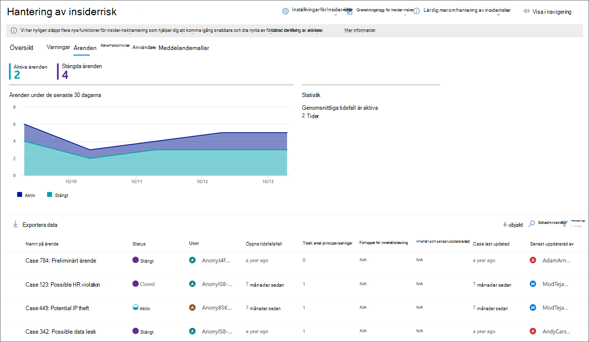
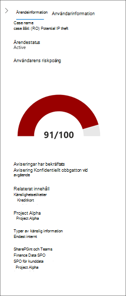
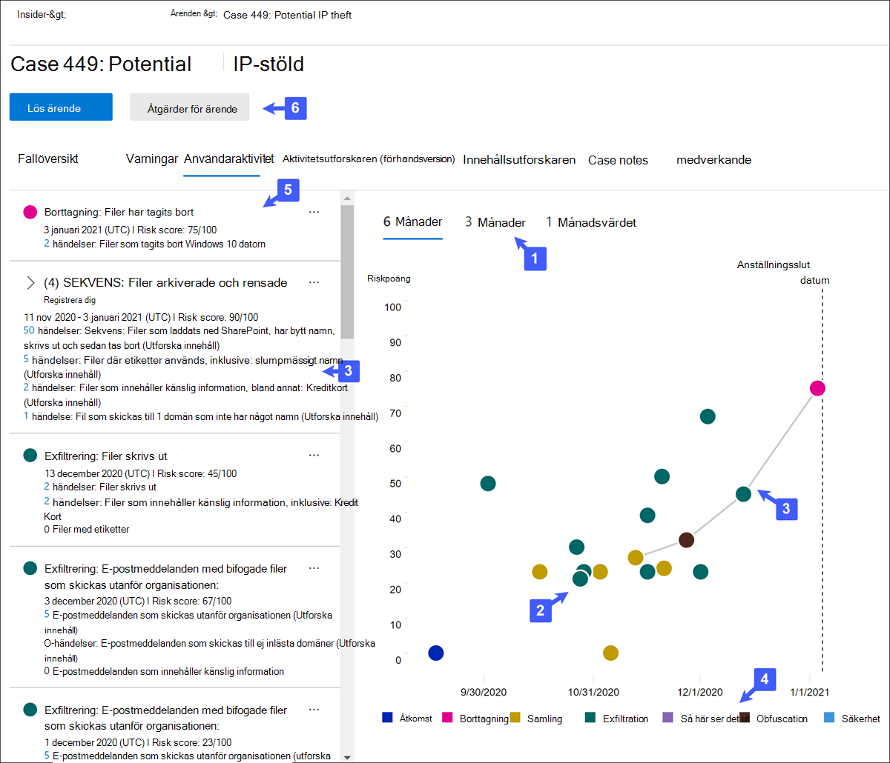
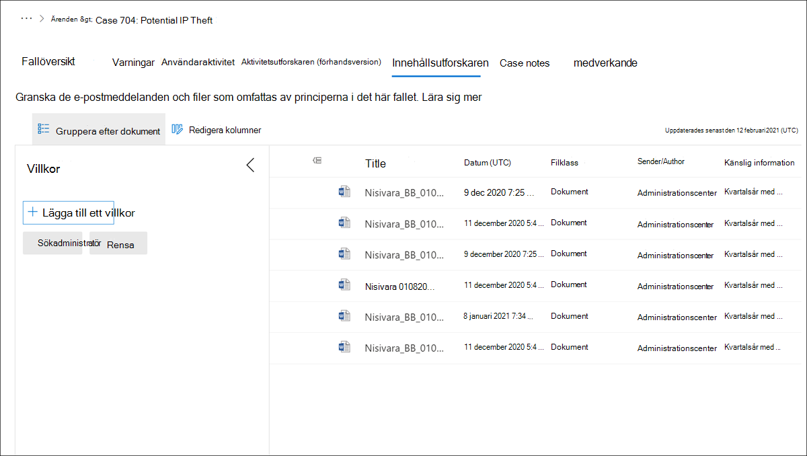

# Insider-riskhanteringsärenden

Ärenden är kärnan i insider-riskhantering och gör att du kan undersöka och agera på problem som genereras av riskindikatorer som definieras i dina principer. Ärenden skapas manuellt utifrån aviseringar i situationer där det krävs ytterligare åtgärder för att åtgärda ett efterlevnadsrelaterat problem för en användare. Varje ärende är inderat i en enda användare och flera aviseringar för användaren kan läggas till i ett befintligt ärende eller i ett nytt ärende. 

När du har undersökt detaljerna i ett ärende kan du vidta åtgärder genom att:

- skicka ett meddelande till användaren
- lösa ärendet som en
- dela ärendet med din ServiceNow-instans eller med en e-postmottagare
- eskalering av ärendet för Advanced eDiscovery undersökning

Titta på videon [om Insider-riskhanteringsundersökning och eskalering](https://www.youtube.com/watch?v=UONUSmkRC8s) för en översikt över hur ärenden undersöks och hanteras i insider-riskhantering.

## Instrumentpanelen Ärenden

På instrumentpanelen Ärenden **för Insider-riskhantering** kan du visa och agera i ärenden. Varje rapportwidget på instrumentpanelen visar information för de senaste 30 dagarna.

- **Aktiva ärenden**: Det totala antalet aktiva ärenden som undersökas.
- **Ärenden under de senaste 30** dagarna : Det totala antalet skapade ärenden, sorterade efter *statusen Aktiv* *och Stängd.*
- **Statistik:** Genomsnittlig tid för aktiva ärenden, i timmar, dagar eller månader.

I ärendekön visas alla aktiva och stängda ärenden för organisationen, utöver den aktuella statusen för följande ärendeattribut:

- **Ärendenamn:** Namnet på ärendet, som definieras när en avisering bekräftas och ärendet skapas.  
- **Status:** Status för ärendet, antingen *Aktiv* eller *Stängd.*
- **Användare**: Användaren för ärendet. Om anonymisering för användarnamn är aktiverad visas anonymiserad information.
- **Öppnad tidsfall**: Den tid som har gått sedan ärendet öppnades.
- **Totalt antal principaviseringar:** Antalet principmatchningar som inkluderas i ärendet. Antalet kan öka om nya aviseringar läggs till i ärendet.
- **Senast uppdaterad för** ärendet: Det har gått sedan vi lade till en anteckning om ärendet eller ändrade ärendets status.
- **Senast uppdaterad av:** Namnet på den insider-riskhanteringsanalytiker eller de som uppdaterade ärendet senast.

Använd **sökkontrollen** för att söka efter ärendenamn för specifik text och använd ärendefiltret för att sortera fall efter följande attribut:

- Status
- Öppna tidsfall, startdatum och slutdatum
- Uppdaterades senast, startdatum och slutdatum

## Filtrera ärenden

Det kan vara svårt att granska en stor kö av ärenden beroende på antalet och typen av aktiva riskhanteringsprinciper för Insider. Användning av case-filter kan hjälpa analytiker och ärende att sortera fall efter flera attribut. Om du vill filtrera aviseringar **på instrumentpanelen Ärenden** väljer du **kontrollen** Filter. Du kan filtrera ärenden efter ett eller flera attribut:

- **Status:** Välj en eller flera statusvärden om du vill filtrera ärendelistan. Alternativen är *Aktiva och* *Stängda*.
- **Öppna tidsfall:** Välj start- och slutdatum för när ärendet öppnades.
- **Senast uppdaterad:** Välj start- och slutdatum för när ärendet uppdaterades.

## Undersöka ett ärende

En djupare undersökning av varningar om Insider-riskhantering är avgörande för att vidta rätt korrigerande åtgärder. Insider-riskhanteringsärenden är det centrala hanteringsverktyget för att djupare utforska användarriskaktivitetshistorik, varningsinformation, händelsesekvenser av risker och för att utforska innehåll och meddelanden som exponeras för risker. Riskanalytiker och fodral använder även ärenden för att centralisera granskning av feedback och anteckningar och för att bearbeta ärendelösning.

Om du väljer ett ärende öppnas verktyg för ärendehantering och analytiker och annan information om ärenden kan grävas ned.

### Fallöversikt

På **fliken Fallöversikt** sammanfattas information om ärendet för riskanalytiker och -prognoser. Den innehåller följande information i området **Om detta** ärende

- **Status:** Aktuell status för ärendet, antingen Aktiv eller Stängd.
- **Ärendet skapades :** Datumet och tiden då ärendet skapades.
- **Användarens riskpoäng**: Användarens aktuella beräknade risknivå för ärendet. Det här poängresultatet beräknas var 24:e timme och aviseringsriskresultat från alla aktiva aviseringar som associeras till användaren.
- **E-post**: Användarens e-postalias för ärendet.
- **Organisation eller avdelning:** Organisationen eller avdelningen som användaren har tilldelats till.
- **Managernamn:** Namnet på användarens chef.
- **E-postadress** för chef: E-postaliaset för användarens chef.

På **fliken Ärendeöversikt** finns även avsnittet **Aviseringar** som innehåller följande information om policymatchning som är kopplad till ärendet:

- **Principmatchningar:** Namnet på insider-riskhanteringsprincipen som är kopplad till matchningsaviseringar för användaraktivitet.
- **Status:** Aviseringens status.
- **Allvarlighetsgrad**: Aviseringens allvarlighetsgrad.
- **Upptäckt tid:** Den tid som har gått sedan aviseringen skapades.

### Varningar

Fliken **Aviseringar** sammanfattar de aktuella aviseringarna som ingår i ärendet. Nya aviseringar kan läggas till i ett befintligt ärende och de läggs till i **aviseringskön** när de tilldelas. Följande aviseringsattribut visas i kön:

- Status
- Allvarlighetsgrad
- Upptäckt tid

Välj en avisering från kön för att visa **informationssidan avisering.**

Använd sökkontrollen för att söka efter aviseringsnamn för specifik text och använda aviseringsfiltret för att sortera fall efter följande attribut:

- Status
- Allvarlighetsgrad
- Upptäckt tid, startdatum och slutdatum

Använd filterkontrollen för att filtrera aviseringar med flera attribut, bland annat:

- **Status:** Välj en eller flera statusvärden om du vill filtrera aviseringslistan. Alternativen är *Bekräftad,* *Avvisad,* *Behöver granska* och *Löst*.
- **Allvarlighetsgrad**: Välj en eller flera varningsnivåer med allvarlighetsgrad om du vill filtrera aviseringslistan. Alternativen är *Hög,* *Medel* och *Låg.*
- **Upptäckt tid:** Välj start- och slutdatum för när aviseringen skapades.
- **Princip:** Välj en eller flera principer för att filtrera aviseringarna som genereras av de valda principerna.

### Användaraktivitet

Fliken **Användaraktivitet** är ett av de mest kraftfulla verktygen för intern riskanalys och undersökning för ärenden i insider-riskhanteringslösningen. Den här fliken är strukturerad för att möjliggöra snabb granskning av ett ärende, inklusive en historisk tidslinje för alla aviseringar, varningsinformation, aktuell riskinformation för användaren i ärendet, sekvensen av riskhändelser och kontroller för att vidta effektiva åtgärder för att begränsa riskerna i ärendet.

1. **Tidsfilter:** Som standard visas aviseringar från de senaste sex månaderna som bekräftats i ärendet i diagrammet Användaraktivitet. Du kan enkelt filtrera diagramvyn genom att välja flikarna *6* månader, *3* månader eller *1* månad i bubbeldiagrammet.
2. **Aktivitet och information om riskvarningar:** Riskaktiviteter visas visuellt som färgade bubblor i diagrammet Användaraktivitet. Bubblor skapas för olika kategorier av risker och bubbelstorleken står i förhållande till antalet riskaktiviteter för kategorin. Välj en bubbla för att visa information om varje riskaktivitet. Information som finns:
    - **Datum** för riskaktiviteten.
    - **Riskaktivitetskategorin**. Till exempel *e-post med bifogade filer som skickats* utanför organisationen eller filer som *hämtats från SharePoint Online.*
    - **Riskpoäng** för aviseringen. Det här poängresultatet är det numeriska poäng för varning risk allvarlighetsnivå.
    - Antalet händelser som är associerade med aviseringen. Länkar till varje fil eller e-post som är kopplad till riskaktiviteten är också tillgängliga.
3. **Risksekvens (förhandsversion)**: Den kronologiska ordningen på riskaktiviteter är en viktig del av riskundersökningen, och att identifiera dessa relaterade aktiviteter är en viktig del av utvärderingen av den övergripande risken för organisationen. Aviseringsaktiviteter som är relaterade visas med kopplingslinjer för att markera att dessa aktiviteter är associerade med ett större riskområde. Den här vyn med aktiviteter kan hjälpa personer som bokstavligen "kopplar samman punkterna" för riskaktiviteter som kan ha visats som isolerade eller enstaka händelser. Välj en bubbla i sekvensen för att visa information om alla associerade riskaktiviteter. Information som finns:

    - **Namnet** på sekvensen.
    - **Datum-** **eller datumintervall** i sekvensen.
    - **Riskpoäng** för sekvensen. Det här poängresultatet är det numeriska resultatet för sekvensen av de kombinerade varningrisknivåerna för varje relaterad aktivitet i sekvensen.
    - **Antalet händelser som är associerade med varje avisering i sekvensen**. Länkar till varje fil eller e-post som är kopplad till varje riskaktivitet är också tillgängliga.
    - **Visa aktiviteter i följd**. Visar sekvens som en överstrykningslinje i bubbeldiagrammet och expanderar aviseringsinformationen så att alla relaterade aviseringar visas i sekvensen.

4. **Förklaring av riskaktiviteter:** Längst ned i diagrammet med användaraktivitet kan du med hjälp av en färgkodad förklaring snabbt fastställa riskkategorier för varje avisering.
5. **Kronologi för riskaktivitet:** Hela kronologin för alla riskvarningar som är kopplade till ärendet visas, inklusive all information som är tillgänglig i motsvarande aviseringsbubbla.
6. **Fallåtgärder**: Alternativ för att lösa ärendet finns i åtgärdsverktygsfältet ärende. Du kan lösa ett ärende, skicka ett e-postmeddelande till användaren eller e-posta ärendet för en data- eller användarundersökning.

### Aktivitetsutforskaren (förhandsversion)

> [!IMPORTANT]
> Fliken Aktivitetsutforskaren är tillgänglig i området Ärendehantering för användare med utlösande händelser när den här funktionen är tillgänglig i din organisation.

På **fliken Aktivitetsutforskaren** kan riskanalytiker och experter granska aktivitetsinformation som är kopplad till riskvarningar. Som en del av åtgärderna för ärendehantering kan till exempel finansanalytiker och analytiker behöva granska alla riskaktiviteter som är associerade med ärendet för att få mer information. Med **Aktivitetsutforskaren** kan granskare snabbt granska en tidslinje med identifierade riskfyllda aktiviteter och identifiera och filtrera alla riskaktiviteter som är associerade med aviseringar.

Mer information om Aktivitetsutforskaren finns i artikeln Varningar för [Insider-riskhantering.](insider-risk-management-alerts.md#activity-explorer-preview)

### Innehållsutforskaren

På **fliken Innehållsutforskaren** kan riskanalytiker och experter granska kopior av alla enskilda filer och e-postmeddelanden som associeras med riskvarningar. Om till exempel en avisering skapas när en användare laddar ned hundratals filer från SharePoint Online och aktiviteten utlöser en principavisering, lagras alla nedladdade filer för aviseringen och kopieras till Insider-riskhanteringsfall från de ursprungliga lagringskällorna.

Innehållsutforskaren är ett kraftfullt verktyg med grundläggande och avancerade sök- och filtreringsfunktioner. Mer information om hur du använder Innehållsutforskaren finns [i Insider-riskhantering – Innehållsutforskaren.](insider-risk-management-content-explorer.md)

### Case notes

På fliken Förfalloanteckningar är den plats där riskanalytiker och kunder delar kommentarer, feedback och insikter om sitt arbete för ärendet.  Anteckningar är permanenta tillägg i ett ärende och kan inte redigeras eller tas bort när anteckningen har sparats. När ett ärende skapas från en avisering läggs kommentarerna som anges i dialogrutan Bekräfta avisering och skapa **en insider-riskfall** automatiskt till som en ärendeanteckning.

Instrumentpanelen för ärendeanteckningar visas anteckningar från användaren som skapade anteckningen och den tid som har gått sedan anteckningen sparades. Om du vill söka i textfältet för  fallanteckningen efter ett visst nyckelord använder du knappen Sök på instrumentpanelen för ärende och anger ett specifikt nyckelord.

Så här lägger du till en anteckning i ett ärende:

1. I [Microsoft 365 Efterlevnadscenter](https://compliance.microsoft.com)går du till **Insider-riskhantering** och väljer **fliken** Ärenden.
2. Markera ett ärende och välj sedan **fliken Ärendeanteckningar.**
3. Välj **Lägg till ärendeanteckning**.
4. Skriv **anteckningen för ärendet** i dialogrutan Lägg till ärendeanteckning. Välj **Spara** om du vill lägga till anteckningen i ärendet eller välj **Avbryt** stängning utan att spara anteckningen i ärendet.

### Deltagare

På **fliken Deltagare** kan riskanalytiker och -analytiker lägga till andra granskare i ärendet. Som standard visas alla användare som **tilldelats Insider-riskhanteringsanalytikerna** och rollerna för **insiderriskhanteringsroller** som deltagare för varje aktivt och stängt ärende. Endast användare som **tilldelats rollen Insider-riskhanteringsroll** har behörighet att visa filer och meddelanden i Innehållsutforskaren.

Temporär åtkomst till ett ärende kan beviljas genom att en användare läggs till som deltagare. Deltagare har all ärendehanteringskontroll för det specifika ärendet utom följande:

- Behörighet att bekräfta eller stänga aviseringar
- Behörighet att redigera deltagare för ärenden
- Behörighet att visa filer och meddelanden i Innehållsutforskaren

Så här lägger du till en deltagare i ett ärende:

1. I [Microsoft 365 Efterlevnadscenter](https://compliance.microsoft.com)går du till **Insider-riskhantering** och väljer **fliken** Ärenden.
2. Markera ett ärende och välj sedan **fliken** Deltagare.
3. Välj **Lägg till deltagare.**
4. Börja skriva **namnet på** den användare som du vill lägga till i dialogrutan Lägg till deltagare och välj sedan användaren från listan med förslag på användare. Den här listan genereras från Azure Active Directory av din klientorganisationsprenumeration.
5. Välj **Lägg till** om du vill lägga till användaren som deltagare eller välj **Avbryt** för att stänga dialogrutan utan att lägga till användaren som deltagare.

## Åtgärder för ärende

Riskanalytiker och rekommendationer kan agera på ett ärende på en av flera olika metoder, beroende på ärendets allvarlighetsgrad, historik över risken för användaren och organisationens riktlinjer för risker. I vissa situationer kan du behöva eskalera ett ärende till en användare eller en dataundersökning för att samarbeta med andra delar av din organisation och dyka djupare in i riskaktiviteter. Insider-riskhantering är nära integrerat med andra Microsoft 365 efterlevnadslösningar för att hjälpa dig med en resolutionshantering från hela slutet.

### Skicka e-postmeddelande

I de flesta fall är användaråtgärder som skapar insiderriskvarningar oavsiktliga eller oavsiktliga. Att skicka ett påminnelsemeddelande till användaren via e-post är en effektiv metod för att dokumentera granskning av ärende och åtgärder, och är en metod för att påminna användarna om företagets principer eller ge dem utbildning om uppdatering. Meddelanden genereras från meddelandemallar [som du skapar för](insider-risk-management-notices.md) din insider-infrastruktur för riskhantering.

Det är viktigt att komma ihåg att det inte löser problemet **genom** att skicka ett e-postmeddelande till en användare * som _Closed*. I vissa fall kan du vilja lämna ett ärende öppet när du har skickat ett meddelande till en användare för att söka efter fler riskaktiviteter utan att öppna ett nytt ärende. Om du vill lösa ett ärende när du  har skickat ett meddelande måste du välja Lös ärende som ett uppföljningssteg när du har skickat ett meddelande.

Så här skickar du ett meddelande till användaren som har tilldelats ett ärende:

1. I [Microsoft 365 Efterlevnadscenter](https://compliance.microsoft.com)går du till **Insider-riskhantering** och väljer **fliken** Ärenden.
2. Markera ett ärende och välj sedan knappen **Skicka e-postmeddelande i** åtgärdsverktygsfältet.
3. I dialogrutan **Skicka e-postmeddelande väljer** du listrutekontrollen Välj en meddelandemall för att välja meddelandemallen för meddelandet.  Det här valet fyller i de andra fälten i meddelandet i förväg.
4. Granska meddelandefälten och uppdatera efter behov. Värdena som anges här åsidosätter värdena i mallen.
5. Välj **Skicka** om du vill skicka meddelandet till användaren eller välj **Avbryt** stäng dialogrutan utan att skicka meddelandet till användaren. Alla skickade meddelanden läggs till i kön för ärendeanteckningar på **instrumentpanelen Förfalloanteckningar.**

### Eskalera för undersökning

Eskalera ärendet för användarundersökning i situationer där det krävs ytterligare juridisk granskning för användarens riskaktivitet. Eskaleringsningen öppnar ett Advanced eDiscovery fall i Microsoft 365 organisation. Advanced eDiscovery ett end-to-end-arbetsflöde för att bevara, samla in, granska, analysera och exportera innehåll som svarar på organisationens interna och externa juridiska undersökningar. Det gör det också möjligt för din juridiska grupp att hantera hela arbetsflödet för meddelanden om juridiskt ärende så att de kan kommunicera med dokumentmedlemmar som är inblandade i ett ärende. Om du tilldelar en granskare som vårdnadshavare i ett Advanced eDiscovery-ärende som skapats utifrån ett insider-riskhanteringsärende hjälper du den juridiska gruppen att vidta lämpliga åtgärder och hantera bevarande av innehåll. Mer information om Advanced eDiscovery fall finns i [Översikt över Advanced eDiscovery i Microsoft 365](overview-ediscovery-20.md).

Så här eskalerar du ett ärende till en användarundersökning:

1. I [Microsoft 365 Efterlevnadscenter](https://compliance.microsoft.com)går du till **Insider-riskhantering** och väljer **fliken** Ärenden.
2. Markera ett ärende och välj sedan **knappen Eskalera för undersökning** i verktygsfältet för fallåtgärd.
3. I dialogrutan **Eskalera för undersökning** anger du ett namn för den nya användarundersökningen. Om det behövs skriver du kommentarer om ärendet och väljer **Eskalera**.
4. Granska meddelandefälten och uppdatera efter behov. Värdena som anges här åsidosätter värdena i mallen.
5. Välj **Bekräfta för** att skapa användarundersökningsfall eller välj **Avbryt** för att stänga dialogrutan utan att skapa ett nytt användarundersökningsfall.

När insider-ärendet har eskalerats till ett nytt användarundersökningsfall kan du granska det nya ärendet i området Avancerat för **e-dataidentifiering**  >   i Microsoft 365 Efterlevnadscenter.

### Köra automatiserade uppgifter med Power Automate flöden för ärendet

Med rekommenderade Power Automate kan riskflöden och analytiker snabbt vidta åtgärder för att:

- Begära information från personalavdelningen eller företaget om en användare i ett insider-riskfall
- Meddela chefen när en användare har en riskvarning för Insider
- Skapa en post för ett insider-riskhanteringsfall i ServiceNow
- Meddela användare när de läggs till i en Insider-riskprincip

För att köra, hantera Power Automate skapa Power Automate för ett insider-riskhanteringsfall:

1. Välj **Automatisera i** åtgärdsverktygsfältet. 
2. Välj det Power Automate flöde du vill köra och välj sedan **Kör flöde**. 
3. När flödet är klart väljer du **Klar**.

Mer information om hur Power Automate för insider riskhantering finns i Komma igång med inställningar för [insider-riskhantering.](insider-risk-management-settings.md#power-automate-flows-preview)

### Visa eller skapa Microsoft Teams grupp för ärendet

När Microsoft Teams för insider-riskhantering har aktiverats i inställningarna skapas Microsoft Teams teamet automatiskt varje gång en avisering bekräftas och ett ärende skapas. Riskanalyserna och analytikerna kan snabbt öppna Microsoft Teams och navigera direkt till teamet för ett ärende genom att välja **Visa Microsoft Teams team** i åtgärdsverktygsfältet för ärendet.

I de fall som öppnas innan microsoft Team-integreringen aktiverars kan risker och analytiker skapa ett nytt Microsoft Teams-team för ett ärende genom att välja Skapa **Microsoft Teams team** i åtgärdsverktygsfältet vid ärende.

När ett ärende har lösts arkiveras det associerade Microsoft-teamet automatiskt (dolt och endast skrivskyddat).

Mer information om hur Microsoft Teams insider-riskhantering finns i Komma igång med inställningar för [insider-riskhantering.](insider-risk-management-settings.md#microsoft-teams-preview)

### Lös ärendet

När riskanalytiker och undersökningar har slutfört sin granskning och undersökning kan ett ärende lösas för att agera på alla aviseringar som för närvarande ingår i ärendet. När du löser ett ärende läggs en lösningsklassificering till, ärendestatus ändras till Stängd och åtgärdsorsaker för lösning läggs automatiskt till i kön för ärendeanteckningar på instrumentpanelen **Ärendeanteckningar.** Ärenden löses antingen som:

- **Område**: Klassificeringen för fall där policymatchningsmeddelanden utvärderas som låg risk, icke-allvarliga eller falska positiva.
- **Bekräftad principbrott:** Klassificeringen för fall där aviseringar om policymatchningar utvärderas som riskfyllda, allvarliga eller resultatet av skadliga avsikter.

Så här löser du ett ärende:

1. I [Microsoft 365 Efterlevnadscenter](https://compliance.microsoft.com)går du till **Insider-riskhantering** och väljer **fliken** Ärenden.
2. Markera ett ärende och välj sedan **knappen Lös ärende** i åtgärdsverktygsfältet.
3. Välj **listrutekontrollen** Lös som **i** dialogrutan Lös ärende och välj klassificeringen för ärendets upplösning. Alternativen är **bekräftad** **eller bekräftad principbrott.**
4. I dialogrutan **Lös ärende** anger du orsakerna till lösningsklassificering i **textfältet Åtgärder** vidtas.
5. Välj **Lös** om du vill stänga ärendet **eller** välj Avbryt stäng dialogrutan utan att lösa ärendet.
