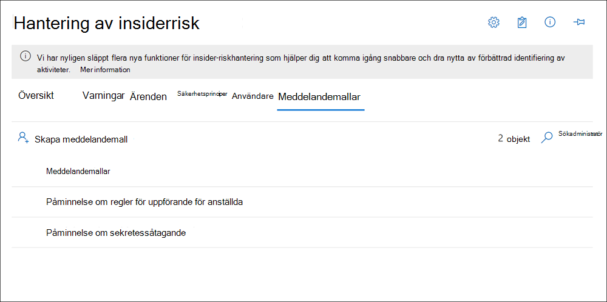

# <a name="insider-risk-management-notice-templates"></a><span data-ttu-id="c8f86-104">Mallar för Insider-riskhanteringsvarningar</span><span class="sxs-lookup"><span data-stu-id="c8f86-104">Insider risk management notice templates</span></span>

<span data-ttu-id="c8f86-105">Med mallar för Insider-riskhantering kan du skicka e-postmeddelanden till användarna när deras aktiviteter genererar en matchning och avisering för principen.</span><span class="sxs-lookup"><span data-stu-id="c8f86-105">Insider risk management notice templates allow you to send email messages to users when their activities generate a policy match and alert.</span></span> <span data-ttu-id="c8f86-106">I de flesta fall är användaråtgärder som genererar aviseringar resultatet av misstag eller oavsiktliga aktiviteter utan för avsikt.</span><span class="sxs-lookup"><span data-stu-id="c8f86-106">In most cases, user actions that generate alerts are the result of mistakes or inadvertent activities without ill intent.</span></span> <span data-ttu-id="c8f86-107">Meddelanden fungerar som enkla påminnelser om att användarna ska vara mer noga, tillhandahålla länkar till information för uppdateringsutbildning eller till företagets policyresurser.</span><span class="sxs-lookup"><span data-stu-id="c8f86-107">Notices serve as simple reminders to users to be more careful, to provide links to information for refresher training, or to corporate policy resources.</span></span> <span data-ttu-id="c8f86-108">Meddelanden kan vara en viktig del av det interna utbildningsprogrammet för efterlevnad och kan hjälpa till att skapa en dokumenterad granskningslogg för användare med återkommande riskaktiviteter.</span><span class="sxs-lookup"><span data-stu-id="c8f86-108">Notices can be an important part of your internal compliance training program and can help create a documented audit trail for users with recurring risk activities.</span></span>

<span data-ttu-id="c8f86-109">Skapa meddelandemallar om du vill skicka en e-postpåminnelse till användarna för principmatchning som en del av processen för att lösa problem.</span><span class="sxs-lookup"><span data-stu-id="c8f86-109">Create notice templates if you want to send users an email reminder notice for policy matches as part of the issue resolution process.</span></span> <span data-ttu-id="c8f86-110">Meddelanden kan endast skickas till användarens e-postadress som är kopplad till den specifika aviseringen som granskas.</span><span class="sxs-lookup"><span data-stu-id="c8f86-110">Notices can only be sent to the user email address associated with the specific alert being reviewed.</span></span> <span data-ttu-id="c8f86-111">När du väljer en meddelandemall som ska tillämpas på en principmatchning kan du välja att acceptera fältvärdena som definierats i mallen eller skriva över fälten efter behov.</span><span class="sxs-lookup"><span data-stu-id="c8f86-111">When selecting a notice template to apply to a policy match, you can choose to accept the field values defined in the template or overwrite the fields as needed.</span></span>

## <a name="notice-templates-dashboard"></a><span data-ttu-id="c8f86-112">Instrumentpanel för meddelandemallar</span><span class="sxs-lookup"><span data-stu-id="c8f86-112">Notice templates dashboard</span></span>

<span data-ttu-id="c8f86-113">I **instrumentpanelen för mallar för** meddelanden visas en lista med konfigurerade meddelandemallar och du kan skapa nya meddelandemallar.</span><span class="sxs-lookup"><span data-stu-id="c8f86-113">The **Notices templates dashboard** displays a list of configured notice templates and allows you to create new notice templates.</span></span> <span data-ttu-id="c8f86-114">Meddelandemallarna visas i omvänd datumordning med den senaste meddelandemallen först.</span><span class="sxs-lookup"><span data-stu-id="c8f86-114">The notice templates are listed in reverse date order with the most recent notice template listed first.</span></span>



## <a name="html-for-notices"></a><span data-ttu-id="c8f86-116">HTML för meddelanden</span><span class="sxs-lookup"><span data-stu-id="c8f86-116">HTML for notices</span></span>

<span data-ttu-id="c8f86-117">Om du vill skapa mer än ett enkelt textbaserat e-postmeddelande för aviseringar kan du skapa ett mer detaljerat meddelande med hjälp av HTML i meddelandetextfältet i en meddelandemall.</span><span class="sxs-lookup"><span data-stu-id="c8f86-117">If you'd like to create more than a simple text-based email message for notifications, you can create a more detailed message by using HTML in the message body field of a notice template.</span></span> <span data-ttu-id="c8f86-118">Följande exempel innehåller brödtexten för en grundläggande HTML-baserad e-postaviseringsmall:</span><span class="sxs-lookup"><span data-stu-id="c8f86-118">The following example provides the message body format for a basic HTML-based email notification template:</span></span>

```HTML
<!DOCTYPE html>
<html>
<body>
<h2>Action Required: Contoso User Code of Conduct Policy Training</h2>
<p>A recent activity you've performed has generated a risk alert prohibited by the Contoso User <a href='https://www.contoso.com'>Code of Conduct Policy</a>.</p>
<p>You are required to attend the Contoso User Code of Conduct <a href='https://www.contoso.com'>training</a> within the next 14 days. Please contact <a href='mailto:hr@contoso.com'>Human Resources</a> with any questions about this training request.</p>
<p>Thank you,</p>
<p><em>Human Resources</em></p>
</body>
</html>
```

> [!NOTE]
> <span data-ttu-id="c8f86-119">Implementering av HTML href-attribut i mallar för Insider-riskhanteringsmeddelandet stöder för närvarande endast enkla citattecken i stället för dubbla citattecken för URL-referenser.</span><span class="sxs-lookup"><span data-stu-id="c8f86-119">HTML href attribute implementation in the insider risk management notice templates currently support only single quotation marks instead of double quotation marks for URL references.</span></span>

## <a name="create-a-new-notice-template"></a><span data-ttu-id="c8f86-120">Skapa en ny meddelandemall</span><span class="sxs-lookup"><span data-stu-id="c8f86-120">Create a new notice template</span></span>

<span data-ttu-id="c8f86-121">Om du vill skapa en ny mall för insider-riskhantering använder du meddelandeguiden i Insider-riskhanteringslösningen i Microsoft 365 efterlevnadscenter. </span><span class="sxs-lookup"><span data-stu-id="c8f86-121">To create a new insider risk management notice template, you'll use the notice wizard in **Insider risk management** solution in the Microsoft 365 compliance center.</span></span>

<span data-ttu-id="c8f86-122">Gör så här för att skapa en ny mall för insider-riskhantering:</span><span class="sxs-lookup"><span data-stu-id="c8f86-122">Complete the following steps to create a new insider risk management notice template:</span></span>

1. <span data-ttu-id="c8f86-123">I Microsoft 365 [kompatibilitetscenter](https://compliance.microsoft.com)går du till **Insider-riskhantering** och väljer **fliken Meddelandemallar.**</span><span class="sxs-lookup"><span data-stu-id="c8f86-123">In the [Microsoft 365 compliance center](https://compliance.microsoft.com), go to **Insider risk management** and select the **Notice templates** tab.</span></span>
2. <span data-ttu-id="c8f86-124">Välj **Skapa meddelandemall för** att öppna meddelandeguiden.</span><span class="sxs-lookup"><span data-stu-id="c8f86-124">Select **Create notice template** to open the notice wizard.</span></span>
3. <span data-ttu-id="c8f86-125">Fyll i **följande fält på sidan** Skapa en ny meddelandemall:</span><span class="sxs-lookup"><span data-stu-id="c8f86-125">On the **Create a new notice template** page, complete the following fields:</span></span>
    - <span data-ttu-id="c8f86-126">**Mallnamn:** Ange ett eget namn för meddelandet.</span><span class="sxs-lookup"><span data-stu-id="c8f86-126">**Template name**: Enter a friendly name for the notice.</span></span> <span data-ttu-id="c8f86-127">Det här namnet visas i listan över meddelanden på instrumentpanelen och i meddelandelistan när meddelanden skickas från ett ärende.</span><span class="sxs-lookup"><span data-stu-id="c8f86-127">This name appears on the list of notices on the notice dashboard and in the notice selection list when sending notices from a case.</span></span>
    - <span data-ttu-id="c8f86-128">**Skicka från:** Ange avsändarens e-postadress för meddelandet.</span><span class="sxs-lookup"><span data-stu-id="c8f86-128">**Send from**: Enter the sender email address for the notice.</span></span> <span data-ttu-id="c8f86-129">Den här adressen visas i fältet **Från:** i alla meddelanden som skickas till användare om de inte ändras när du skickar ett meddelande från ett ärende.</span><span class="sxs-lookup"><span data-stu-id="c8f86-129">This address will appear in the **From:** field in all notices sent to users unless changed when sending a notice from a case.</span></span>
    - <span data-ttu-id="c8f86-130">**Fälten Kopia och Hemlig** kopia: Valfria användare eller grupper som ska meddelas om principmatchning, som valts i Active Directory för din prenumeration.</span><span class="sxs-lookup"><span data-stu-id="c8f86-130">**Cc and Bcc** fields: Optional users or groups to be notified of the policy match, selected from the Active Directory for your subscription.</span></span>
    - <span data-ttu-id="c8f86-131">**Ämne**: Information som visas i meddelandets ämnesrad har stöd för texttecken.</span><span class="sxs-lookup"><span data-stu-id="c8f86-131">**Subject**: Information that appears in the subject line of the message, supports text characters.</span></span>
    - <span data-ttu-id="c8f86-132">**Meddelandetext:** Information som visas i meddelandets brödtext har stöd för text eller HTML-värden.</span><span class="sxs-lookup"><span data-stu-id="c8f86-132">**Message body**: Information that appears in the message body, supports text or HTML values.</span></span>
4. <span data-ttu-id="c8f86-133">Välj **Skapa** för att skapa och spara meddelandemallen eller välj **Avbryt** om du vill stänga utan att spara meddelandemallen.</span><span class="sxs-lookup"><span data-stu-id="c8f86-133">Select **Create** to create and save the notice template or select **Cancel** to close without saving the notice template.</span></span>

## <a name="update-a-notice-template"></a><span data-ttu-id="c8f86-134">Uppdatera en meddelandemall</span><span class="sxs-lookup"><span data-stu-id="c8f86-134">Update a notice template</span></span>

<span data-ttu-id="c8f86-135">Så här uppdaterar du en befintlig meddelandemall för Insider-riskhantering:</span><span class="sxs-lookup"><span data-stu-id="c8f86-135">To update an existing insider risk management notice template, complete the following steps:</span></span>

1. <span data-ttu-id="c8f86-136">I Microsoft 365 [kompatibilitetscenter](https://compliance.microsoft.com)går du till **Insider-riskhantering** och väljer **fliken Meddelandemallar.**</span><span class="sxs-lookup"><span data-stu-id="c8f86-136">In the [Microsoft 365 compliance center](https://compliance.microsoft.com), go to **Insider risk management** and select the **Notice templates** tab.</span></span>
2. <span data-ttu-id="c8f86-137">På instrumentpanelen för meddelanden väljer du den meddelandemall som du vill hantera.</span><span class="sxs-lookup"><span data-stu-id="c8f86-137">On the notice dashboard, select the notice template you want to manage.</span></span>
3. <span data-ttu-id="c8f86-138">På sidan med meddelandeinformation väljer du **Redigera**</span><span class="sxs-lookup"><span data-stu-id="c8f86-138">On the notice details page, select **Edit**</span></span>
4. <span data-ttu-id="c8f86-139">På **sidan** Redigera kan du redigera följande fält:</span><span class="sxs-lookup"><span data-stu-id="c8f86-139">On the **Edit** page, you can edit the following fields:</span></span>
    - <span data-ttu-id="c8f86-140">**Mallnamn:** Ange ett nytt eget namn för meddelandet.</span><span class="sxs-lookup"><span data-stu-id="c8f86-140">**Template name**: Enter a new friendly name for the notice.</span></span> <span data-ttu-id="c8f86-141">Det här namnet visas i listan över meddelanden på instrumentpanelen och i meddelandelistan när meddelanden skickas från ett ärende.</span><span class="sxs-lookup"><span data-stu-id="c8f86-141">This name appears on the list of notices on the notice dashboard and in the notice selection list when sending notices from a case.</span></span>
    - <span data-ttu-id="c8f86-142">**Skicka från:** Uppdatera avsändarens e-postadress för meddelandet.</span><span class="sxs-lookup"><span data-stu-id="c8f86-142">**Send from**: Update the sender email address for the notice.</span></span> <span data-ttu-id="c8f86-143">Den här adressen visas i fältet **Från:** i alla meddelanden som skickas till användare om de inte ändras när du skickar ett meddelande från ett ärende.</span><span class="sxs-lookup"><span data-stu-id="c8f86-143">This address will appear in the **From:** field in all notices sent to users unless changed when sending a notice from a case.</span></span>
    - <span data-ttu-id="c8f86-144">**Fälten Kopia och Hemlig kopia:** Uppdatera valfria användare eller grupper som ska meddelas om principmatchning, som valts i Active Directory för din prenumeration.</span><span class="sxs-lookup"><span data-stu-id="c8f86-144">**Cc and Bcc** fields: Update optional users or groups to be notified of the policy match, selected from the Active Directory for your subscription.</span></span>
    - <span data-ttu-id="c8f86-145">**Ämne**: Uppdateringsinformation som visas i meddelandets ämnesrad har stöd för texttecken.</span><span class="sxs-lookup"><span data-stu-id="c8f86-145">**Subject**: Update information that appears in the subject line of the message, supports text characters.</span></span>
    - <span data-ttu-id="c8f86-146">**Meddelandetext:** Uppdatera information som visas i meddelandets brödtext, med stöd för text eller HTML-värden.</span><span class="sxs-lookup"><span data-stu-id="c8f86-146">**Message body**: Update information that appears in the message body, supports text or HTML values.</span></span>
5. <span data-ttu-id="c8f86-147">Välj **Spara om** du vill uppdatera och spara meddelandet eller välj Avbryt **om** du vill stänga utan att spara meddelandemallen.</span><span class="sxs-lookup"><span data-stu-id="c8f86-147">Select **Save** to update and save the notice or select **Cancel** to close without saving the notice template.</span></span>

## <a name="delete-a-notice-template"></a><span data-ttu-id="c8f86-148">Ta bort en meddelandemall</span><span class="sxs-lookup"><span data-stu-id="c8f86-148">Delete a notice template</span></span>

<span data-ttu-id="c8f86-149">Så här tar du bort en befintlig meddelandemall för insider-riskhantering:</span><span class="sxs-lookup"><span data-stu-id="c8f86-149">To delete an existing insider risk management notice template, complete the following steps:</span></span>

1. <span data-ttu-id="c8f86-150">I Microsoft 365 [kompatibilitetscenter](https://compliance.microsoft.com)går du till **Insider-riskhantering** och väljer **fliken Meddelandemallar.**</span><span class="sxs-lookup"><span data-stu-id="c8f86-150">In the [Microsoft 365 compliance center](https://compliance.microsoft.com), go to **Insider risk management** and select the **Notice templates** tab.</span></span>
2. <span data-ttu-id="c8f86-151">På instrumentpanelen för meddelanden väljer du den meddelandemall som du vill ta bort.</span><span class="sxs-lookup"><span data-stu-id="c8f86-151">On the notice dashboard, select the notice template you want to delete.</span></span>
3. <span data-ttu-id="c8f86-152">Välj ikonen **Ta** bort i verktygsfältet.</span><span class="sxs-lookup"><span data-stu-id="c8f86-152">Select the **Delete** icon on the toolbar.</span></span>
4. <span data-ttu-id="c8f86-153">Om du vill ta bort meddelandemallen väljer **du Ja** i dialogrutan Ta bort.</span><span class="sxs-lookup"><span data-stu-id="c8f86-153">To delete the notice template, select **Yes** in the delete dialog.</span></span> <span data-ttu-id="c8f86-154">Om du vill avbryta borttagningen väljer du **Avbryt**.</span><span class="sxs-lookup"><span data-stu-id="c8f86-154">To cancel the deletion, select **Cancel**.</span></span>
