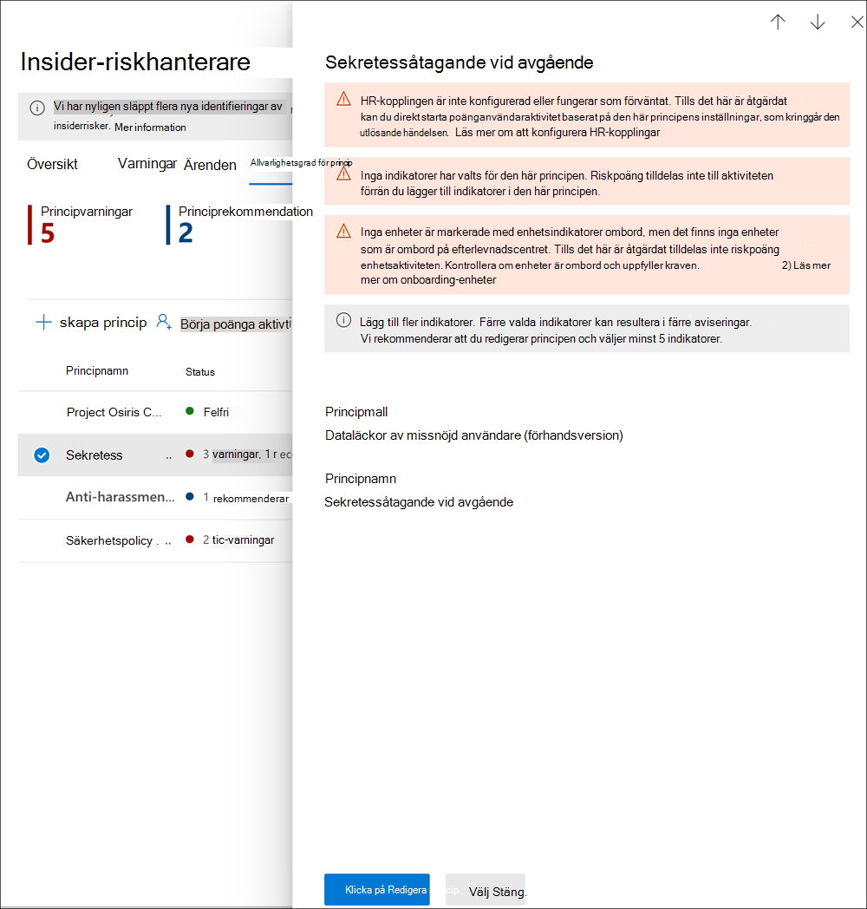

# <a name="insider-risk-management-policies"></a>Principer för hantering av insiderrisk

Principer för hantering av insiderrisk bestämmer vilka användare som är i omfånget och vilka typer av riskindikatorer som är konfigurerade för varningar. Du kan snabbt skapa en princip som gäller för alla användare i din organisation eller definiera enskilda användare eller grupper för hantering i en princip. Principer stöder innehållsprioriteringar för att fokusera principvillkoren på flera eller specifika Microsoft Teams, SharePoint-webbplatser, datakänslighetstyper och dataetiketter. Med hjälp av mallar kan du välja specifika riskindikatorer och anpassa händelsetrösklar för principindikatorer, effektivt anpassa riskresultat och nivå och frekvens för varningar. Dessutom hjälper boosters för riskpoäng och avkänning av avvikelser att identifiera användaraktivitet som är av högre vikt eller mer ovanlig. Med principfönster kan du definiera tidsramen för att tillämpa principen för varningsaktiviteter och används för att bestämma varaktigheten för principen när den har aktiverats.

Kolla in [Konfigurationsvideon för Principer för hantering av insiderrisk](https://www.youtube.com/watch?v=kudK5ajZTUo) för en översikt över hur principer som skapats med inbyggda principmallar kan hjälpa dig att snabbt vidta åtgärder för potentiella risker.

## <a name="policy-dashboard"></a>Instrumentpanel för principer

**Instrumentpanelen** för principer låter dig snabbt se principerna i din organisation, statusen för principen, manuellt lägga till användare i principer och visa status för varningar som är associerade med varje princip.

- **Principnamn**: Namnet som tilldelats principen i principguiden.
- **Status**: Hälsostatusen för varje princip. Visar antal principvarningar och rekommendationer eller statusen *Hälsosam* för principer utan problem.  Du kan klicka på principen för att se information om hälsotillståndet för eventuella varningar eller rekommendationer.
- **Aktiva varningar**: Antalet aktiva varningar för varje princip.
- **Bekräftade varningar**: Det totala antalet varningar som resulterade i ärenden från principen under de senaste 365 dagarna.
- **Åtgärder tagna på varningar**: Det totala antalet varningar som har bekräftats eller avvisats de senaste 365 dagarna.
- **Principvarnings effektivitet**: Procentandelen bestämd av totala bekräftade varningar dividerat med de totalt antal åtgärder som vidtagits för varningar (vilket är summan av varningar som bekräftades eller avvisades under det senaste året).


## <a name="policy-recommendations-from-analytics-preview"></a>Principrekommendationer från analys (förhandsvisning)

Insiderriskanalys gör att du kan göra en utvärdering av potentiella insiderrisker i din organisation utan att konfigurera några principer för insiderrisk. Denna utvärdering kan hjälpa din organisation att identifiera potentiella områden med högre användarrisk och hjälpa till att bestämma typen och omfattningen av principer för hantering av insiderrisk som du kan överväga att konfigurera.

Mer information om insiderriskanalys och principrekommendationer finns i [Inställningar för hantering av insiderrisk: Analys (förhandsvisning)](insider-risk-management-settings.md#analytics-preview).

## <a name="policy-templates"></a>Principmallar

Mallar för hantering av insiderrisk är fördefinierade principförhållanden som definierar de typer av riskindikatorer och riskpoängmodell som används i principen. Innan principen skapas måste varje mall ha tilldelats en mall i guiden för skapande av princip. Hantering av insiderrisk stöder upp till fem principer för varje principmall. När du skapar en ny princip för insiderrisk med principguiden väljer du en av följande principmallar:

### <a name="data-theft-by-departing-users"></a>Datastöld från slutande användare

När användare lämnar din organisation finns det specifika riskindikatorer som vanligtvis är associerade med datastöld av användare som slutar. Denna principmall använder exfiltreringsindikatorer för riskbedömning och fokuserar på upptäckt och varningar inom detta riskområde. Datastöld av användare som slutar kan inkludera nedladdning av filer från SharePoint Online, utskrift av filer och kopiering av data till personliga molntjänster och lagringstjänster nära deras avgång och slutdatum. Genom att använda antingen Microsoft 365 HR-anslutning eller alternativet att automatiskt övervaka borttagning av användarkonton i Azure Active Directory för din organisation, börjar den här mallen att sätta poäng på riskindikatorer som rör dessa aktiviteter och hur de korrelerar med användarens anställningsstatus.

> [!IMPORTANT]
> När du använder den här mallen kan du konfigurera en Microsoft 365 HR-anslutning för att regelbundet importera information om avgångs- och uppsägningsdatum för användare i din organisation. Se artikeln [Importera data med HR-anslutning](import-hr-data.md) för steg-för-steg-vägledning för att konfigurera Microsoft 365 HR-anslutning för din organisation. Om du väljer att inte använda HR-anslutning, måste du välja alternativet Användarkontot togs bort från Azure Active Directory vid konfigurering av utlösningshändelser i steg-för-steg-guiden.

### <a name="general-data-leaks"></a>Allmänna dataläckor

Att skydda data och förhindra dataläckage är en ständig utmaning för de flesta organisationer, särskilt med den snabba ökningen av ny data som skapats av användare, enheter och tjänster. Användare har befogenhet att skapa, lagra och dela information över tjänster och enheter som gör hantering av dataläckage alltmer komplicerat och svårt. Dataläckor kan inkludera oavsiktlig överdelning av information utanför organisationen till datastöld med skadligt syfte. Med en tilldelad Princip för dataförlustskydd (DLP) eller den inbyggda utlösningshändelsen börjar den här mallen att göra detekteringar i realtid av misstänkta SharePoint Online-nedladdningar, fildelning och mappdelning, utskrift av filer och kopiering av data till personliga molnmeddelande och lagringstjänster.

Vid användning av en mall för *Dataläckage* kan du tilldela en DLP-princip för att utlösa indikatorer i principen för insiderrisk för varningar med hög allvarlighetsgrad i din organisation. När en varning med hög allvarlighetsgrad genereras av en DLP-principregel, läggs den till i granskningsloggen för Office 365, principer för insiderrisk som skapas med den här mallen undersöker automatiskt DLP-varningen med hög allvarlighet. Om varningen innehåller en användare i omfånget i principen för insiderrisk behandlas varningen av principen för insiderrisk som en ny varning och tilldelas en svårighetsgrad och riskpoäng för insiderrisk. Principen låter dig utvärdera denna varning i sammanhang med andra aktiviteter som ingår i ärendet. Om du inte väljer en DLP-princip, måste du välja den inbyggda utlösande händelsen.

#### <a name="data-leaks-policy-guidelines"></a>Riktlinjer för principer för dataläckor

När du skapar eller ändrar DLP-principerför användning med principer för hantering av insiderrisk, överväg följande riktlinjer:

- Prioritera dataexfiltreringshändelser och var selektiv när du tilldelar inställningar för **Incidentrapporter** till *Hög* när du konfigurerar regler i DLP-principer. Till exempel ska att e-posta känsliga dokument till en känd konkurrent vara en exfiltreringshändelse med *Hög* varningsnivå. För stor tilldelning till *Hög* nivå i inställningarna för **Incidentrapporter** i andra DLP-principregler kan öka bullret i arbetsflödet för hantering av insiderrisk och göra det svårare för dina datautredare och analytiker att korrekt utvärdera dessa varningar. Till exempel gör tilldelning av *Hög* varningsnivå för åtkomst till förnekande aktiviteter i DLP-principer det mer utmanande att utvärdera verkligt riskabelt användarbeteende och aktiviteter.
- Se till att du förstår och korrekt konfigurerar användarna inom omfattningen i både principen för DLP och den för hantering av insiderrisk. Endast användare som definieras som inom omfattningen för principer för hantering av insiderrisk med hjälp av mallen **Dataläckor** kommer att behandlas med DLP-principvarningar med hög allvarlighetsgrad. Dessutom kommer endast användare som definieras som inom omfattning i en regel för en DLP-varning med hög allvarlighetsgrad att undersökas av principen för hantering av insiderrisk för övervägande. Det är viktigt att du inte omedvetet konfigurerar användare inom omfånget i principerna för DLP och insiderrisk på ett motstridigt sätt.

     Till exempel, om dina DLP-principregler omfattas av endast användare i säljteamet och principen för insiderrisk som skapats från mallen för **Dataläckor** har definierat alla användare som omfattande, kommer principen för insiderrisk bara att behandla DLP-varningar med hög allvarlighetsgrad för användarna i säljteamet. Principen för insiderrisk kommer inte att få några högprioriterade DLP-varningar för användare att bearbeta som inte definieras i DLP-reglerna i detta exempel. Omvänt, om din princip för hantering av insiderrisk som skapats från mallar för **Dataläckor** endast omfattar användare i säljteamet och den tilldelade DLP-principen omfattar alla användare, kommer principen för insiderrisk endast att behandla DLP-varningar med hög allvarlighetsgrad för medlemmar i säljteamet. Principen för hantering av insiderrisk ignorerar DLP-varningar med hög allvarlighetsgrad för alla användare som inte är med i säljteamet.

- Se till att regelinställningen för **Incidentrapporter** i DLP-principen som används för den här mallen för hantering av insiderrisk är konfigurerad för varningar med *Hög* allvarlighetsgrad. Nivån *Hög* allvarlighetsgrad är utlösande händelser och varningar för hantering av insiderrisk genereras inte från regler i DLP-principer med fältet **Incidentrapporter** inställt på *Låg* eller *Mellan*.

    

     > [!NOTE]
     > När du skapar en ny DLP-princip med de inbyggda mallarna måste du välja alternativet **Skapa eller anpassa avancerade DLP-regler** för att konfigurera inställningen för **Incidentrapporter** för *Hög* allvarlighetsgrad.

Varje princip för hantering av insiderrisk som skapas från mallen för **Dataläckor** kan bara tilldelas en DLP-princip. Överväg att skapa en dedikerad DLP-princip som kombinerar de olika aktiviteterna du vill upptäcka och som fungerar som utlösande händelser för principer för insiderrisk som använder mallen för **Dataläckor**.

Se artikeln [Skapa, testa och ställa in en DLP-princip](create-test-tune-dlp-policy.md) för en steg-för-steg-vägledning för att konfigurera DLP-principer för din organisation.

### <a name="data-leaks-by-priority-users-preview"></a>Dataläckor av prioritetsanvändare (förhandsversion)

Att skydda data och förhindra dataläckor för användare i din organisation kan bero på deras position, åtkomstnivå till känslig information eller riskhistorik. Dataläckor kan inkludera oavsiktlig överdelning av väldigt känslig information utanför organisationen till datastöld med skadligt syfte. Med en tilldelad princip för Skydd mot dataförlust (DLP) börjar denna mall att göra realtidsdetekteringar av misstänkt aktivitet vilket resulterar i en ökad sannolikhet för varningar om insiderrisk och varningar med högre allvarlighetsnivåer. Prioritetsanvändare definieras i [prioriterade användargrupper](insider-risk-management-settings.md#priority-user-groups-preview) som är konfigurerade i inställningsområdet för hantering av insiderrisk.

Som med **mallen Allmänna dataläckor** måste du tilldela en DLP-princip för att utlösa indikatorer i principen för insiderrisk för varningar med hög allvarlighetsgrad i din organisation. Följ riktlinjerna för principer för Dataläckor ovan när du skapar en princip med den här mallen. Dessutom måste du tilldela prioriterade användargrupper som skapats i **Hantering av insiderrisk** > **Inställningar** > **Prioriterade användargrupper** till principen.

### <a name="data-leaks-by-disgruntled-users-preview"></a>Dataläckor av missnöjd användare (förhandsversion)

När användare upplever stressfaktorer under anställning kan de bli missnöjda, vilket kan öka risken för insiderriskaktivitet. Denna mall börjar bedöma användaraktivitet när en indikator som är associerad med missnöje identifieras. Exempel inkluderar aviseringar om prestationsförbättring, dåligt resultat från utvärderingar eller ändringar av status på jobbnivå. Dataläckor bland missnöjda användare kan inkludera nedladdning av filer från SharePoint Online och kopiering av data till personliga molntjänster och lagringstjänster nära i tid till stressande händelser i anställningen.

När du använder den här mallen måste du också konfigurera en Microsoft 365 HR-anslutning för att regelbundet importera aviseringar om prestationsförbättring, dåligt resultat från utvärderingar eller information om ändringar av jobbnivå för användare i din organisation. Se artikeln [Importera data med HR-anslutning](import-hr-data.md) för steg-för-steg-vägledning för att konfigurera Microsoft 365 HR-anslutning för din organisation.

### <a name="general-security-policy-violations-preview"></a>Överträdelse av allmän säkerhetsprincip (förhandsversion)

I många organisationer har användare behörighet att installera programvara på sina enheter eller att ändra enhetsinställningar för att hjälpa dem med deras uppgifter. Användare kan, antingen oavsiktligt eller med skadlig avsikt, installera skadlig kod eller inaktivera viktiga säkerhetsfunktioner som skyddar information på deras enhet eller på dina nätverksresurser. Denna principmall använder säkerhetsvarningar från Microsoft Defender för Endpoint för att börja bedöma dessa aktiviteter och fokusera på upptäckt och varningar i detta riskområde. Använd den här mallen för att ge insikter om överträdelser av säkerhetsprincip i scenarier när användare kan ha ett förflutet med överträdelser av säkerhetsprinciper som kan vara en indikator på insiderrisk.

Du måste ha Microsoft Defender för Endpoint konfigurerad i din organisation och aktivera Defender för Endpoint för integrering av hantering av insiderrisk i Defender Security Center för att importera varningar om säkerhetsöverträdelser. Mer information om hur du konfigurerar Defender för Endpoint för integrering av hantering av insiderrisk finns i [Konfigurera avancerade funktioner i Defender för Endpoint](/windows/security/threat-protection/microsoft-defender-atp/advanced-features#share-endpoint-alerts-with-microsoft-compliance-center).

### <a name="security-policy-violations-by-departing-users-preview"></a>Överträdelser av säkerhetsprinciper av användare som slutar (förhandsversion)

Användare som slutar, oavsett om de lämnar frivilligt eller inte, kan vara större risk för överträdelser av säkerhetsprinciper. För att skydda mot oavsiktliga eller skadliga säkerhetsöverträdelser från användare som slutar, använder denna principmall Defender för Endpoint-varningar för att ge insikt i säkerhetsrelaterade aktiviteter. Dessa aktiviteter inkluderar användaren som installerar skadlig programvara eller andra potentiellt skadliga applikationer och inaktiverar säkerhetsfunktioner på sina enheter. Genom att använda antingen [Microsoft 365 HR-anslutning](import-hr-data.md) eller alternativet att automatiskt övervaka borttagning av användarkonton i Azure Active Directory för din organisation, börjar den här mallen att sätta poäng på riskindikatorer som rör dessa säkerhetsaktiviteter och hur de korrelerar med användarens anställningsstatus.

Du måste ha Microsoft Defender för Endpoint konfigurerad i din organisation och aktivera Defender för Endpoint för integrering av hantering av insiderrisk i Defender Security Center för att importera varningar om säkerhetsöverträdelser. Mer information om hur du konfigurerar Defender för Endpoint för integrering av hantering av insiderrisk finns i [Konfigurera avancerade funktioner i Defender för Endpoint](/windows/security/threat-protection/microsoft-defender-atp/advanced-features#share-endpoint-alerts-with-microsoft-compliance-center).

### <a name="security-policy-violations-by-priority-users-preview"></a>Överträdelser av säkerhetsprincip efter prioritetsanvändare (förhandsversion)

Skydd mot säkerhetsöverträdelser från användare i din organisation kan bero på deras position, åtkomstnivå till känslig information eller riskhistorik. Eftersom säkerhetsöverträdelser från prioritetsanvändare kan ha en betydande inverkan på din organisations kritiska områden, börjar den här principmallen att göra bedömningar av dessa indikatorer och använder Microsoft Defender för Endpoint-varningar för att ge insikt i säkerhetsrelaterade aktiviteter för dessa användare. Dessa aktiviteter kan inkludera prioritetsanvändare som installerar skadlig programvara eller andra potentiellt skadliga applikationer och inaktiverar säkerhetsfunktioner på sina enheter. Prioritetsanvändare definieras i prioriterade användargrupper som är konfigurerade i inställningsområdet för hantering av insiderrisk.

Du måste ha Microsoft Defender för Endpoint konfigurerad i din organisation och aktivera Defender för Endpoint för integrering av hantering av insiderrisk i Defender Security Center för att importera varningar om säkerhetsöverträdelser. Mer information om hur du konfigurerar Defender för Endpoint för integrering av hantering av insiderrisk finns i [Konfigurera avancerade funktioner i Defender för Endpoint](/windows/security/threat-protection/microsoft-defender-atp/advanced-features#share-endpoint-alerts-with-microsoft-compliance-center). Dessutom måste du tilldela prioriterade användargrupper som skapats i **Hantering av insiderrisk** > **Inställningar** > **Prioriterade användargrupper** till principen.

### <a name="security-policy-violations-by-disgruntled-users-preview"></a>Överträdelse av säkerhetsprincip av en missnöjd användare (förhandsversion)

Användare som upplever stressfaktorer under anställning kan vara utsatt för högre risk för oavsiktliga eller skadliga överträdelser av säkerhetsprinciper. Dessa stressfaktorer kan inkludera att användaren placeras i ett program för prestationsförbättring, dåligt resultat från utvärdering eller att degraderas från sin nuvarande position. Denna principmall börjar bedöma risk baserat på dessa indikatorer och aktiviteter som är associerade med dessa händelser för dessa användare.

När du använder den här mallen måste du också konfigurera en Microsoft 365 HR-anslutning för att regelbundet importera aviseringar om prestationsförbättring, dåligt resultat från utvärderingar eller information om ändringar av jobbnivå för användare i din organisation. Se artikeln [Importera data med HR-anslutning](import-hr-data.md) för steg-för-steg-vägledning för att konfigurera Microsoft 365 HR-anslutning för din organisation.

Du måste också ha Microsoft Defender för Endpoint konfigurerad i din organisation och aktivera Defender för Endpoint för integrering av hantering av insiderrisk i Defender Security Center för att importera varningar om säkerhetsöverträdelser. Mer information om hur du konfigurerar Defender för Endpoint för integrering av hantering av insiderrisk finns i [Konfigurera avancerade funktioner i Defender för Endpoint](/windows/security/threat-protection/microsoft-defender-atp/advanced-features#share-endpoint-alerts-with-microsoft-compliance-center).

### <a name="policy-template-prerequisites-and-triggering-events"></a>Förutsättningar för principmall och utlösande händelser

Beroende på vilken mall du väljer för en princip för hantering av insiderrisk varierar förutsättningarna för de utlösande händelserna och principerna. Utlösande händelser är förutsättningar som avgör om en användare är aktiv för en princip för hantering av insiderrisk. Om en användare läggs till i en princip för hantering av insiderriskmen inte har en utlösande händelse, utvärderas användaraktiviteten inte av principen såvida de inte läggs till manuellt i användarens instrumentpanel. Förutsättningar för en princip är obligatoriska poster som gör så att principen får de signaler eller aktiviteter som är nödvändiga för att utvärdera risk.

Följande tabell visar de utlösande händelserna och förutsättningarna för principer som skapats från varje princip för hantering av insiderrisk:

| **Principmall** | **Utlösande händelser för principer** | **Förutsättningar** |
| :------------------ | :--------------------------------- | :---------------- |
| Datastöld från slutande användare | Indikator för avgångs- eller uppsägningsdatum från HR-anslutning | (valfritt) Microsoft 365 HR-anslutning konfigurerad för indikatorer för uppsägnings- och avgångsdatum eller aktiverad Azure Active Directory-integrering |
| Allmänna dataläckor | Princip för aktiviteter relaterade till dataläckor som skapar en varning med Hög allvarlighetsgrad | (valfritt) DLP-princip konfigurerad för varningar med Hög allvarlighetsgrad eller inbyggd händelse som utlöser dataexfiltrering |
| Dataläckor av prioritetsanvändare | Princip för aktiviteter relaterade till dataläckor som skapar en varning med *Hög allvarlighet* eller inbyggd händelse som utlöser dataexfiltrering. | (valfritt) DLP-princip som är konfigurerad för varningar med Hög allvarlighet <br><br> Prioriterad användargrupper som är konfigurerade i inställningar för insiderrisk |
| Dataläckage av missnöjda användare | Prestationsförbättring, dålig prestation eller indikatorer för ändring av jobbnivå från HR-anslutning | Microsoft 365 HR-anslutning konfigurerad för indikatorer på missnöje |
| Överträdelser av allmän säkerhetsprincip | Defensivt undvikande av säkerhetskontroller eller oönskad programvara upptäckt av Microsoft Defender för Endpoint | Aktiv prenumeration på Microsoft Defender för Endpoint <br><br> Konfigurerad integration av Microsoft Defender för Endpoint med Microsoft 365 Efterlevnadscenter |
| Överträdelser av säkerhetsprincip av användare som slutar | Indikatorer från avgångs- eller uppsägningsdatum från HR-anslutning eller borttagning av Azure Active Directory-konto | (valfritt) Microsoft 365 HR-anslutning konfigurerad för indikatorer för uppsägnings- och avgångsdatum <br><br> Aktiv prenumeration på Microsoft Defender för Endpoint <br><br> Konfigurerad integration av Microsoft Defender för Endpoint med Microsoft 365 Efterlevnadscenter |
| Överträdelser av säkerhetsprincip av prioritetsanvändare | Defensivt undvikande av säkerhetskontroller eller oönskad programvara upptäckt av Microsoft Defender för Endpoint | Aktiv prenumeration på Microsoft Defender för Endpoint <br><br> Konfigurerad integration av Microsoft Defender för Endpoint med Microsoft 365 Efterlevnadscenter <br><br> Prioriterad användargrupper som är konfigurerade i inställningar för insiderrisk |
| Överträdelse av säkerhetsprincip av en missnöjd användare | Prestationsförbättring, dålig prestation eller indikatorer för ändring av jobbnivå från HR-anslutning | Microsoft 365 HR-anslutning konfigurerad för indikatorer på missnöje <br><br> Aktiv prenumeration på Microsoft Defender för Endpoint <br><br> Konfigurerad integration av Microsoft Defender för Endpoint med Microsoft 365 Efterlevnadscenter |

## <a name="prioritize-content-in-policies"></a>Prioritera innehåll i principer

Principer för hantering av insiderrisk har stöd för att ange en högre prioritet för innehåll beroende på var det lagras eller hur det klassificeras. Att ange innehåll som prioritet ökar riskpoängen för all associerad aktivitet, vilket i sin tur ökar chansen att generera en varning med hög allvarlighetsgrad. Vissa aktiviteter genererar dock inte en varning alls såvida inte det relaterade innehållet innehåller inbyggda eller anpassade känsliga informationstyper eller angavs som en prioritet i principen.

Till exempel har din organisation en dedikerad SharePoint-webbplats för ett mycket konfidentiellt projekt. Dataläckor för information på denna SharePoint-webbplats kan äventyra projektet och skulle ha en betydande inverkan på dess framgång. Genom att prioritera denna SharePoint-webbplats i en princip för Dataläckor höjs automatiskt riskpoängen för kvalificerade aktiviteter. Denna prioritering ökar sannolikheten för att dessa aktiviteter genererar en varning om insiderrisk och höjer allvarlighetsnivån för varningen.

När du skapar en princip för hantering av insiderrisk i principguiden kan du välja mellan följande prioriteringar:

- **SharePoint-webbplatser**: Alla aktiviteter som är associerade med alla filtyper på definierade SharePoint-webbplatser tilldelas en högre riskpoäng. 
- **Typer av känslig information**: Alla aktiviteter som har associerats med innehåll som innehåller [typer av känslig information](sensitive-information-type-entity-definitions.md) tilldelas en högre riskpoäng.
- **Känslighetsetiketter**: Alla aktiviteter som associeras med innehåll som har specifika [känslighetsetiketter](sensitivity-labels.md) tilldelas en högre riskpoäng.

## <a name="sequence-detection-preview"></a>Sekvensidentifiering (förhandsversion)

Riskabla aktiviteter kanske inte förekommer som isolerade händelser. Dessa risker ingår ofta i en större händelseförlopp. En sekvens är en grupp av två eller flera användaraktiviteter som utförs efter varandra som kan tyda på en förhöjd risk. Att identifiera dessa relaterade aktiviteter är en viktig del av utvärderingen av den totala risken. När sekvensdetektering är aktiverad för principer för datastöld eller dataläckor visas insikter från sekvensinformationsaktiviteter på fliken **Användaraktivitet** i ett fall för hantering av insiderrisk. Följande principmallar stöder sekvensdetektering:

- Datastöld från slutande användare
- Allmänna dataläckor
- Dataläckor av prioritetsanvändare
- Dataläckage av missnöjda användare

Dessa principer för hantering av insiderrisk kan använda specifika indikatorer och den ordning de inträffar för att upptäcka varje steg i en risksekvens. Filnamn används vid mappning av aktiviteter över en sekvens. Dessa risker är organiserade i fyra huvudkategorier av aktiviteter:

- **Samling**: Dessa kategorisignaler fokuserar på nedladdningsaktiviteter av principanvändare inom omfattningen. Ett exempel på en aktivitet i denna kategori är att ladda ner filer från SharePoint-webbplatser.
- **Exfiltrering**: Dessa kategorisignaler fokuserar på att dela eller extrahera aktiviteter till interna och externa källor av principanvändare inom omfattningen. Ett exempel på en aktivitet i denna kategori är att skicka e-postmeddelanden med bilagor från din organisation till externa mottagare.
- **Förvirring**: Dessa kategorisignaler fokuserar på maskering av riskabla aktiviteter av principanvändare inom omfattningen. Ett exempel på en aktivitet i den här kategorin är att byta namn på filer i en enhet.
- **Rensa**: Dessa kategorisignaler fokuserar på borttagningsaktiviteter av principanvändare inom omfattningen. Ett exempel på en aktivitet i den här kategorin är att ta bort filer från en enhet.

> [!NOTE]
> Sekvensdetektering använder indikatorer som är aktiverade i de globala inställningarna för hantering av insiderrisk och indikatorer som väljs i en princip. Om inga lämpliga indikatorer väljs fungerar inte sekvensdetektering.

Du kan anpassa individuella tröskelinställningar för varje typ av sekvensdetektering när de konfigureras i principen. Dessa tröskelinställningar justerar varningar baserat på volymen av filer som är associerade med sekvensen.

Mer information om hantering av sekvensdetektering finns i vyn **Användaraktivitet** i [Fall av hantering av insiderrisk: Användaraktivitet](insider-risk-management-cases.md#user-activity).

## <a name="cumulative-exfiltration-detection-preview"></a>Identifiering av kumulativ dataexfiltrering (förhandsversion)

Indikatorer på Insiderrisk hjälper till att identifiera ovanliga nivåer av riskaktiviteter när de utvärderas dagligen för användare som omfattas av principer för insiderrisk. Kumulativ exfiltreringsdetektering använder maskininlärningsmodeller för att hjälpa dig att identifiera när användarexfiltreringsaktiviteter överstiger organisationens genomsnitt vid mätning över tid och över flera typer av exfiltreringsaktiviteter. Anytiker och utredare av hantering av insiderrisk kan använda insikter från identifiering av kumulativ dataexfiltrering för att identifiera exfiltreringsaktiviteter som kanske inte genererar varningar men som är högre än vad som är typiskt för deras organisation. Några exempel kan vara avgående användare som långsamt exfiltrerar data över ett antal dagar, eller när användare upprepade gånger delar data över flera kanaler mer än vanligt för datadelning för din organisation.

Identifiering av kumulativ dataexfiltrering är aktiverad som standard när du använder följande principmallar:

- Datastöld från slutande användare
- Allmänna dataläckor
- Dataläckor av prioritetsanvändare
- Dataläckage av missnöjda användare

> [!NOTE]
> Identifiering av kumulativ exfiltrering använder exfilreringsindikatorer som är aktiverade i de globala inställningarna för hantering av insiderrisk och exfilreringsindikatorer som väljs i en princip. Som sådan utvärderas identifiering av kumulativ exfiltrering endast för de nödvändiga exfiltreringsindikatorerna.

När identifiering av kumulativ exfiltrering är aktiverad för principer för datastöld eller dataläckor visas insikter från kumulativa exfiltreringsaktiviteter på fliken **Användaraktivitet** i ett fall för hantering av insiderrisk.

Mer information om hantering av Användaraktvitet finns i [Fall av hantering av insiderrisk: Användaraktivitet](insider-risk-management-cases.md#user-activity).

## <a name="policy-health-preview"></a>Principhälsa (förhandsversion)

Principens hälsostatus ger dig insikt i potentiella problem med dina principer för hantering av insiderrisk. Kolumnen Status på fliken Princip kan varna dig om principfrågor som kan förhindra att användaraktivitet rapporteras eller varför antalet aktivitetsvarningar är ovanligt. Principens hälsostatus kan också bekräfta att principen är hälsosam och inte behöver uppmärksamhet eller konfigurationsändringar.

Om det finns problem med en princip visar principstatusen varningar och rekommendationer som hjälper dig att vidta åtgärder för att lösa problem med principer. Dessa meddelanden kan hjälpa dig att lösa följande problem:

- Principer med ofullständig konfiguration. Dessa problem kan innefatta saknade användare eller grupper i principen eller andra ofullständiga konfigurationssteg för principen.
- Princip med konfigurationsproblem för indikator. Indikatorer är en viktig del av varje princip. Om indikatorer inte är konfigurerade eller om för få indikatorer väljs kan det hända att principen inte utvärderar riskabla aktiviteter som förväntat.
- Principutlösare fungerar inte, eller så är inte kraven för principutlösare korrekt konfigurerade. Principfunktionalitet kan bero på andra tjänster eller konfigurationskrav för att effektivt upptäcka utlösande händelser för att aktivera tilldelning av riskpoäng till användare i principen. Dessa beroenden kan inkludera problem med konfiguration av anslutning, Microsoft Defender för Endpoint aviseringsdelning eller konfigurationsinställningar för princip för dataförlustskydd.
- Volymgränser närmar sig eller är över gränser. Principer för hantering av insiderrisk använder flera Microsoft 365-tjänster och slutpunkter för att aggregera riskaktivitetssignaler. Beroende på antalet användare i dina principer kan volymgränser försena identifiering och rapportering av riskaktiviteter. Läs mer om dessa gränser i avsnittet Begränsningar för principmall i den här artikeln.

För att snabbt visa hälsostatusen för en princip, navigera på fliken Princip och kolumnen Status. Här ser du följande alternativ för principers hälsostatus för varje princip:

- Hälsosam: Inga problem har identifierats med principen.
- Rekommendationer: Det finns några problem med principen som kan hindra principen från att fungera som förväntat.
- Varningar: Det finns problem med principen som hindrar den från att identifiera riskabla aktiviteter.

För mer information om eventuella rekommendationer eller varningar, välj en princip på fliken **Princip** för att öppna kortet för med information om principen. Mer information om rekommendationerna och varningarna, inklusive vägledning om hur man åtgärdar dessa problem, kommer att visas i avsnittet Aviseringar på informationskortet.



Använd följande tabell för att lära dig mer om rekommendationer och varningsmeddelanden och åtgärder för att lösa potentiella problem.

|**Aviseringsmeddelanden**|**Principmallar**|**Orsaker/prova denna åtgärd för att lösa**|
|:------------------------|:-------------------|:---------------------------|
| Principen tilldelar inte riskpoäng till aktivitet | Alla principmallar | Du kanske vill granska omfånget för din princip och konfiguration för utlösande händelse så att principen kan tilldela aktivitet till riskpoäng <br><br> 1. Granska de användare som har valts för principen. Om du har valt få användare vill du kanske välja fler användare. <br> 2. Om du använder en HR-anslutning, kontrollera att din HR-anslutning skickar rätt data. <br> 3. Om du använder en DLP-princip som din utlösande händelse, kontrollera konfigurationen av din DLP-princip för att säkerställa att den är konfigurerad att användas i denna princip. <br> 4. För principer för säkerhetsöverträdelse, granska Microsoft Defender för Endpoint status för varningstriage som valts i Inställningar för insiderrisk > Intelligent identifiering. Bekräfta att varningsfiltret inte är för smalt. |
| Principen har inte genererat några varningar | Alla principmallar | Du kanske vill granska konfigurationen av din princip så att du analyserar poängsättningen av den aktivitet du bryr dig om. <br><br> 1. Bekräfta att du har valt indikatorer som du vill göra poängsätta. Ju fler indikatorer som väljs, desto fler aktiviteter tilldelas riskpoäng. <br> 2. Granska tröskelanpassning för princip. Om de valda trösklarna inte överensstämmer med organisationens risktolerans, justerar du valen så att varningar skapas baserat på dina önskade trösklar. <br> 3. Granska de användare och grupper som har valts för principen. Bekräfta att du har valt alla tillämpliga användare och grupper. <br> 4. För principer för säkerhetsöverträdelser, bekräfta att du har valt den status för varningstriage som du vill poängsätt för Microsoft Defender för Endpoint-varningar i Intelligent identifiering i inställningar.|
| Inga användare eller grupper ingår i denna princip | Alla principmallar | Användare eller grupper är inte tilldelade till principen. <br><br> Redigera din princip och välj användare eller grupper för principen. |
| Inga indikatorer har valts för den här principen | Alla principmallar | Inga indikatorer har valts för den här principen <br><br> Redigera din princip och välj lämpliga principindikatorer för principen. |
| Inga prioriterade användargrupper ingår i den här principen | - Dataläckor av prioritetsanvändare <br> - Överträdelser av säkerhetsprincip av prioritetsanvändare | Prioriterad användargrupper är inte tilldelade till principen. <br><br> Konfigurera prioriterade användargrupper i Inställningar för hantering av insiderrisk och tilldela prioriterade användargrupper till principen. |
| Ingen utlösande händelse har valts för den här principen | Alla principmallar | Ingen utlösande händelse har konfigurerats för principen <br><br> Riskpoäng tilldelas inte användaraktiviteter förrän du redigerar principen och väljer en utlösande händelse. |
| HR-anslutning har inte konfigurerats eller fungerar inte som förväntat. | - Datastöld från slutande användare <br> - Överträdelser av säkerhetsprincip av användare som slutar <br> - Dataläckage av missnöjda användare <br> - Överträdelse av säkerhetsprincip av en missnöjd användare | Det finns ett problem med HR-anslutningen. <br><br> 1. Om du använder en HR-anslutning, kontrollera att din HR-anslutning skickar rätt data <br><br> ELLER <br><br> 2. Välj det Azure AD-konto som tog bort utlösande händelse. |
| Inga enheter har registrerats | - Datastöld från slutande användare <br> - Allmänna dataläckor <br> - Dataläckage av missnöjda användare <br> - Dataläckor av prioritetsanvändare | Enhetsindikatorer är valda men det finns inga enheter registrerade på Microsoft 365 <br><br> Kontrollera om enheter är registrerade och att de uppfyller kraven.  |
| HR-anslutning har inte laddat upp data nyligen | - Datastöld från slutande användare <br> - Överträdelser av säkerhetsprincip av användare som slutar <br> - Dataläckage av missnöjda användare <br> - Överträdelse av säkerhetsprincip av en missnöjd användare | HR-koppling har inte importerat data på mer än sju dagar. <br><br> Kontrollera att din HR-anslutning är korrekt konfigurerad och skickar data. |
| Vi kan inte kontrollera statusen för din HR-anslutning just nu. Kontrollera igen senare | - Datastöld från slutande användare <br> - Överträdelser av säkerhetsprincip av användare som slutar <br> - Dataläckage av missnöjda användare <br> - Överträdelse av säkerhetsprincip av en missnöjd användare | Lösningen för hantering av insiderrisk kan inte kontrollera status för din HR-anslutning. <br><br> Kontrollera att din HR-anslutning är korrekt konfigurerad och skickar data, eller kom tillbaka och kontrollera statusen för principen.  |
| DLP-principen är inte markerad som den utlösande händelsen | - Allmänna dataläckor <br> - Dataläckor av prioritetsanvändare | En DLP-princip har inte valts som en utlösande händelse eller så har den valda DLP-principen tagits bort. <br><br> Redigera principen och välj antingen en aktiv DLP-princip eller "Användaren utför en exfiltreringsaktivitet" som utlösande händelse i konfigurationen av principen. |
| DLP-principen som används i den här principen är inaktiverad | - Allmänna dataläckor <br> - Dataläckor av prioritetsanvändare | DLP-principen som används i den här principen är inaktiverad. <br><br> 1. Aktivera DLP-principen som är tilldelad till denna princip. <br><br> ELLER <br><br> 2. Redigera den här principen och välj antingen en ny DLP-princip eller "Användaren utför en exfiltreringsaktivitet" som utlösande händelse i konfigurationen av principen. |
| DLP-principen uppfyller inte kraven | - Allmänna dataläckor <br> - Dataläckor av prioritetsanvändare | DLP-principer som används som utlösande händelser måste konfigureras för att generera varningar med hög allvarlighetsgrad. <br><br>  1. Redigera din DLP-princip för att tilldela tillämpliga varningar som *Hög allvarlighetsgrad*. <br><br> ELLER <br><br> 2. Redigera den här principen och välj *Användaren utförde en exfiltreringsaktivitet* som den utlösande händelsen. |
| Din organisation har ingen prenumeration på Microsoft Defender för Endpoint | - Överträdelser av allmän säkerhetsprincip <br> - Överträdelser av säkerhetsprincip av användare som slutar <br> - Överträdelse av säkerhetsprincip av en missnöjd användare <br> - Överträdelser av säkerhetsprincip av prioritetsanvändare | Din organisation har ingen aktiv prenumeration på Microsoft Defender för Endpoint. <br><br> Tills en prenumeration på Microsoft Defender för Endpoint har lagts till tilldelar inte principen riskpoäng till användaraktivitet. |
| Microsoft Defender för Endpoint varningar delas inte med efterlevnadscentern | - Överträdelser av allmän säkerhetsprincip <br> - Överträdelser av säkerhetsprincip av användare som slutar <br> - Överträdelse av säkerhetsprincip av en missnöjd användare <br> - Överträdelser av säkerhetsprincip av prioritetsanvändare | Microsoft Defender för Endpoint varningar delas inte med efterlevnadscentern. <br><br> Konfigurera delning av Microsoft Defender för Endpoint-varningar. |
| Du närmar dig den maximala gränsen för användare som poängsätts aktivt för denna principmall. | Alla principmallar | Varje principmall har ett maximalt antal användare inom omfattningen. Se avsnittet med information om mallgräns. <br><br> Granska användarna på fliken Användare och ta bort alla användare som inte längre behöver poängsättas. |

## <a name="policy-template-limits"></a>Mallgräns för principer

Mallar för principer för hantering av insiderrisk använder gränser för att hantera volymen och hastigheten för bearbetning av riskaktiviteter för användare inom omfattningen och hur denna process är integrerad med stöd för Microsoft 365-tjänster. Varje principmall har ett maximalt antal användare som aktivt kan tilldelas riskpoäng för principen som den kan stödja och effektivt behandla och rapportera riskaktiviteter. Användare inom omfånget är användare med utlösande händelser för principen.

Gränsen för varje princip beräknas baserat på det totala antalet unika användare som får riskpoäng per typ av principmall. Om antalet användare för en typ av principmall är nära eller överskrider användargränsen kommer principens prestanda att minska. Om du vill visa det aktuella antalet användare för en princip navigerar du till fliken Princip och kolumnen Användare inom omfånget. Du kan ha upp till fem principer för vilken principmall som helst. Dessa maximala gränser gäller för användare i alla principer med en given principmall.

Använd följande tabell för att bestämma det maximala antalet användare som omfattas av varje principmall:

|**Principmall**|**Aktuellt maximalt antal användare inom omfång**|
|:------------------|:--------------------------------|
| Allmän dataläcka | 15 000 |
| Dataläcka av missnöjda användare | 7 500 |
| Dataläcka av prioritetsanvändare | 1 000 |
| Datastöld från slutande användare | 20 000 |
| Överträdelser av allmän säkerhetsprincip | 1 000 |
| Överträdelse av säkerhetsprincip av prioritetsanvändare | 1 000 |
| Överträdelser av säkerhetsprincip av användare som slutar | 15 000 |
| Överträdelse av säkerhetsprincip av en missnöjd användare | 7 500 |

## <a name="create-a-new-policy"></a>Skapa en ny princip

För att skapa en ny princip för hantering av insiderrisk använder du principguiden lösningen **Hantering av insiderrisk** i Microsoft 365 Efterlevnadscenter.

Slutför följande steg för att skapa en ny princip:

1. I [Microsoft 365 Efterlevnadscenter](https://compliance.microsoft.com) går du till **Hantering av insiderrisk** och väljer fliken **Princip**.
2. Välj **Skapa princip** för att öppna principguiden.
3. På sidan **Principmall** väljer du en principkategori och väljer sedan mallen för den nya principen. De här mallarna består av villkor och indikatorer som definierar den riskaktivitet du vill identifiera och undersöka. Granska förutsättningarna, utlösande händelser och upptäckta aktiviteter flr mallen för att bekräfta att denna principmall passar dina behov.

    > [!IMPORTANT]
    > Vissa principmallar har förutsättningar som måste konfigureras för att principen ska generera relevanta varningar. Om du inte har konfigurerat tillämpliga principförutsättningar, se **Steg 4** ovan.

4. Gå vidare genom att klicka på **Nästa.**
5. På sidan **Namn och beskrivning** färdigställer du följande fält:
    - **Namn (obligatoriskt)**: Ange ett eget namn på principen. Namnet kan inte ändras när principen har skapats.
    - **Beskrivning (valfritt)**: Ange en valfri beskrivning av principen.

6. Gå vidare genom att klicka på **Nästa.**
7. På sidan **Användare och grupper** väljer du **Inkludera alla användare och grupper** eller **Inkludera specifika användare och grupper** för att definiera vilka användare eller grupper som är inkluderade i principen, eller välj **Lägg till eller redigera prioriterade användargrupper** om du har valt en mall som är baserad på prioriterade användare. Genom att välja **Inkludera alla användare och grupper** kommer den att leta efter utlösande händelser för alla användare och grupper i din organisation för att börja tilldela riskpoäng för principen. Genom att välja **Inkludera specifika användare och grupper** kan du definiera vilka användare och grupper som ska tilldelas till principen.
8. Gå vidare genom att klicka på **Nästa.**
9. På sidan **Innehåll som ska prioriteras** kan du tilldela (vid behov) källorna som ska prioriteras, vilket ökar möjligheten till att generera en varning om hög allvarlighet för dessa källor. Välj ett av följande alternativ:

    - **Jag vill ange SharePoint-webbplatser, känslighetsetiketter och/eller känslig information som prioriterade innehåll**. Om du väljer det här alternativet aktiveras informationssidor i guiden för att konfigurera dessa kanaler.
    - **Jag vill inte ange prioriterat innehåll just nu (du kan göra det när principen har skapats)**. Om du väljer detta alternativ hoppar du över sidorna med kanalinformation i guiden.

10. Gå vidare genom att klicka på **Nästa.**

11. Om du i föregående steg valde **Jag vill ange SharePoint-webbplatser, känslighetsetiketter och/eller typer av känslig information som prioriterat innehåll**, kommer du att se informationssidorna för *SharePoint-webbplatser*, *Typer av känslig information* och *Känslighetsetiketter*. Använd dessa informationssidor för att definiera SharePoint, typer av känslig information och känslighetsetiketter som ska prioriteras i principen.

    - **SharePoint-webbplatser**: Välj **Lägg till SharePoint-webbplats** och välj SharePoint-webbplatserna som du har tillgång till och som du vill prioritera. Till exempel *"group1@contoso.sharepoint.com/sites/group1"*.
    - **Typ av känslig information**: Välj **Lägg till typ av känslig information** och välj känslighetstyperna som du vill prioritera. Till exempel *“Amerikanskt bankkontonummer”* och *“Kreditkortsnummer”*
    - **Känslighetsetiketter**: Välj **Lägg till känslighetsetikett** och välj etiketterna som du vill prioritera. Till exempel *“Konfidentiell”* och *“Hemlighet”*.

12. Gå vidare genom att klicka på **Nästa.**
13. På sidan **Indikatorer och utlösande händelser** kommer du att se [indikatorerna](insider-risk-management-settings.md#indicators) som du har definierat som tillgängliga på sidan **Inställningar för insiderrisk** > **Indikatorer**. Om du valde en mall för *Dataläckor* i början av guiden måste du välja en DLP-princip i **DLP-principens** nedrullningsbara lista för att aktivera utlösande indikatorer för principen eller välja den inbyggda utlösande händelsen.

    > [!IMPORTANT]
    > Om indikatorer på den här sidan inte kan väljas måste du välja de indikatorer som du vill aktivera för alla principer. Du kan använda knappen **Aktivera indikatorer** i guiden eller välja indikatorerna på sidan **Hantering av insiderrisk** > **Inställningar** > **Principindikatorer**.

    Välj de indikatorer som du vill tillämpa på principen. Om du föredrar att inte använda principens standardtrösklar för dessa indikatorer, inaktivera **Använd standardtrösklar som rekommenderas av Microsoft** och ange tröskelvärdena för varje vald indikator.

    - Om du har valt minst en *Office-* eller *Enhetsindikator*, väljer du **Förstärkare av riskpoäng** efter behov. Förstärkare av riskpoäng kan endast användas på valda indikatorer.
    - Om du har valt en av principmallarna *Datastöld* eller *Dataläckor*, väljer du en eller flera metoder för **Sekvensidentifiering** och en metod för **Identifiering av kumulativ dataexfiltrering** för principen.

14. Gå vidare genom att klicka på **Nästa.**
15. På sidan **Tröskelvärden för indikatorn** väljer du alternativet att använda standardindikatortrösklar eller att specificera anpassade trösklar för enskilda indikatorer. Välj lämplig nivå för varje indikator för att generera önskad nivå av aktivitetsvarningar.
16. Gå vidare genom att klicka på **Nästa.**
17. På sidan **Granskning** granskar du inställningarna du har valt för principen och eventuella förslag eller varningar för dina val. Välj **Redigera** för att ändra något av principvärdena eller välj **Skicka** för att skapa och aktivera policyn.

## <a name="update-a-policy"></a>Uppdatera en princip

För att uppdatera en befintlig princip för hantering av insiderrisk använder du principguiden lösningen **Hantering av insiderrisk** i Microsoft 365 Efterlevnadscenter.

Slutför följande steg för att hantera en befintlig princip:

1. I [Microsoft 365 Efterlevnadscenter](https://compliance.microsoft.com) går du till **Hantering av insiderrisk** och väljer fliken **Princip**.
2. Välj principen du vill hantera på principens instrumentpanel.
3. Välj **Redigera princip** på sidan med principinformation
4. Du kan inte redigera följande i principguiden:
    - **Principmall**: Mallen som används för att definiera de typer av riskindikatorer som övervakas av principen.
    - **Namn**: Principens visningsnamn
5. På sidan **Namn och beskrivning** uppdaterar du beskrivningen för principen i fältet **Beskrivning**.
6. Gå vidare genom att klicka på **Nästa.**
7. På sidan **Användare och grupper** väljer du **Inkludera alla användare och grupper** eller **Inkludera specifika användare och grupper** för att definiera vilka användare eller grupper som är inkluderade i principen, eller välj **Lägg till eller redigera prioriterade användargrupper** om du har valt en mall som är baserad på prioriterade användare. Genom att välja **Inkludera alla användare och grupper** kommer den att leta efter utlösande händelser för alla användare och grupper i din organisation för att börja tilldela riskpoäng för principen. Genom att välja **Inkludera specifika användare och grupper** kan du definiera vilka användare och grupper som ska tilldelas till principen.
8. Gå vidare genom att klicka på **Nästa.**
9. På sidan **Innehåll som ska prioriteras** kan du tilldela (vid behov) källorna som ska prioriteras, vilket ökar möjligheten till att generera en varning om hög allvarlighet för dessa källor. Välj ett av följande alternativ:

    - **Jag vill ange SharePoint-webbplatser, känslighetsetiketter och/eller känslig information som prioriterade innehåll**. Om du väljer det här alternativet aktiveras informationssidor i guiden för att konfigurera dessa kanaler.
    - **Jag vill inte ange prioriterat innehåll just nu (du kan göra det när principen har skapats)**. Om du väljer detta alternativ hoppar du över sidorna med kanalinformation i guiden.

10. Gå vidare genom att klicka på **Nästa.**

11. Om du i föregående steg valde **Jag vill ange SharePoint-webbplatser, känslighetsetiketter och/eller typer av känslig information som prioriterat innehåll**, kommer du att se informationssidorna för *SharePoint-webbplatser*, *Typer av känslig information* och *Känslighetsetiketter*. Använd dessa informationssidor för att definiera SharePoint, typer av känslig information och känslighetsetiketter som ska prioriteras i principen.

    - **SharePoint-webbplatser**: Välj **Lägg till SharePoint-webbplats** och välj SharePoint-webbplatserna som du har tillgång till och som du vill prioritera. Till exempel *"group1@contoso.sharepoint.com/sites/group1"*.
    - **Typ av känslig information**: Välj **Lägg till typ av känslig information** och välj känslighetstyperna som du vill prioritera. Till exempel *“Amerikanskt bankkontonummer”* och *“Kreditkortsnummer”*
    - **Känslighetsetiketter**: Välj **Lägg till känslighetsetikett** och välj etiketterna som du vill prioritera. Till exempel *“Konfidentiell”* och *“Hemlighet”*.

12. Gå vidare genom att klicka på **Nästa.**
13. På sidan **Indikatorer och utlösande händelser** kommer du att se [indikatorerna](insider-risk-management-settings.md#indicators) som du har definierat som tillgängliga på sidan **Inställningar för insiderrisk** > **Indikatorer**. Om du valde en mall för *Dataläckor* i början av guiden måste du välja en DLP-princip i **DLP-principens** nedrullningsbara lista för att aktivera utlösande indikatorer för principen eller välja den inbyggda utlösande händelsen.

    > [!IMPORTANT]
    > Om indikatorer på den här sidan inte kan väljas måste du välja de indikatorer som du vill aktivera för alla principer. Du kan använda knappen **Aktivera indikatorer** i guiden eller välja indikatorerna på sidan **Hantering av insiderrisk** > **Inställningar** > **Principindikatorer**.

    Välj de indikatorer som du vill tillämpa på principen. Om du föredrar att inte använda principens standardtrösklar för dessa indikatorer, inaktivera **Använd standardtrösklar som rekommenderas av Microsoft** och ange tröskelvärdena för varje vald indikator.

    - Om du har valt minst en *Office-* eller *Enhetsindikator*, väljer du **Förstärkare av riskpoäng** efter behov. Förstärkare av riskpoäng kan endast användas på valda indikatorer.
    - Om du har valt en av principmallarna *Datastöld* eller *Dataläckor*, väljer du en eller flera metoder för **Sekvensidentifiering** och en metod för **Identifiering av kumulativ dataexfiltrering** för principen.

14. Gå vidare genom att klicka på **Nästa.**
15. På sidan **Tröskelvärden för indikatorn** väljer du alternativet att använda standardindikatortrösklar eller att specificera anpassade trösklar för enskilda indikatorer. Välj lämplig nivå för varje indikator för att generera önskad nivå av aktivitetsvarningar.
16. Gå vidare genom att klicka på **Nästa.**
17. På sidan **Granskning** granskar du inställningarna du har valt för principen och eventuella förslag eller varningar för dina val. Välj **Redigera** för att ändra något av principvärdena eller välj **Skicka** för att skapa och aktivera policyn.

## <a name="copy-a-policy"></a>Kopiera en princip

Du kan behöva skapa en ny princip som liknar en befintlig princip men som bara behöver några konfigurationsändringar. Istället för att skapa en ny princip från grunden kan du kopiera en befintlig princip och sedan ändra de områden som behöver uppdateras i den nya principen.

Slutför följande steg för att kopiera en befintlig princip:

1. I Microsoft 365 Efterlevnadscenter går du till Hantering av insiderrisk och väljer fliken Princip.
2. Välj principen du vill kopiera på principens instrumentpanel.
3. Välj Kopiera på sidan med principinformation.
4. I principguiden, namnger du den nya principen och uppdaterar principkonfigurationen efter behov.

## <a name="immediately-start-scoring-user-activity"></a>Börja omedelbart att poängsätta användaraktivitet

Det kan finnas några scenarier där du måste börja tilldela riskpoäng direkt till användare med principer för insiderrisk utanför det utlösande händelsearbetsflödet för insiderriskhantering.  Använd **Starta poängsättningsaktivitet för användare** på fliken **Principer** för att manuellt lägga till en användare (eller flera användare) till en eller flera principer för insiderrisk för en specifik tid, för att omedelbart börja bedöma riskpoäng på deras aktivitet, och för att kringgå kravet för en användare att ha en utlösande indikator (som en DLP-principmatchning). Du kan också lägga till en anledning till att lägga till användaren i principen, som kommer att visas på användarens tidslinje för aktivitet. Användare som läggs till manuellt till principer visas i instrumentpanelen för **Användare** och varningar skapas om aktivitet uppfyller tröskelvärdena för principen.

Några scenarier där du kanske omedelbart vill börja göra användaraktiviteter:

- När användarna identifieras med risker och du bör omedelbart börja tilldela riskpoäng till aktiviteter för en eller flera av dina principer
- När det finns en incident som kan kräva att du omedelbart börjar tilldela riskpoäng för de berörda användarnas aktiviteter för en eller flera av dina principer
- När du har inte konfigurerat en HR-anslutning ännu, men du kan börja tilldela riskpoäng till användaraktiviteter för HR-händelser genom att ladda upp en CSV-fil för användarna

> [!NOTE]
> Det kan ta flera timmar för nya manuellt tillagda användare att visas i instrumentpanelen för **Användare**. Det kan ta upp till 24 timmar att visa aktiviteter för de senaste 90 dagarna för dessa användare. Om du vill visa aktiviteter för användare som har lagts till manuellt navigerar du till fliken **Användare** och väljer användaren på instrumentpanelen för **Användare** och öppnar fliken **Användaraktivitet** i informationsfönstret.

För att manuellt starta poängsättningsaktivitet för användare i en eller flera principer för hantering av insiderrisk, gör du följande:

1. I [Microsoft 365 Efterlevnadscenter](https://compliance.microsoft.com) går du till **Hantering av insiderrisk** och väljer fliken **Princip**.
2. Välj principen eller principerna du vill lägga till användare till på principens instrumentpanel.
3. Välj **Starta poängsättningsaktivitet för användare**.
4. I **Anledningsfältet** i fönstret **Lägg till användare till flera principer**, lägger du till en anledning till att lägga till användarna.
5. I fältet **Detta ska pågå (välj mellan 5 och 30 dagar)** definierar du antalet dagar som användarens aktivitet ska poängsättas för den princip de läggs till i
6. För att söka i din Active Directory efter användare, använder du fältet **Sök efter användare att lägga till i principer**. Skriv namnet på användaren som du vill lägga till principerna. Välj användarnamn och upprepa för att tilldela ytterligare användare till principerna. Listan över användare du har valt visas i avsnittet användare i fönstret Lägg till användare i flera principer.
7. Om du vill importera en lista över användare som ska läggas till i principerna väljer du **Importera** till importera en .csv-fil (kommaavgränsade värden). Filen måste ha följande format och du måste lista användarhuvudnamn i filen:

    ```csv
    user principal name
    user1@domain.com
    user2@domain.com
    ```

8. Välj Lägg till användare i principer för att acceptera ändringarna och lägg till användare i principerna eller välj Avbryt för att kassera ändringarna och stänga dialogrutan.

## <a name="stop-scoring-users-in-a-policy"></a>Sluta poängsätta användare i en princip

Gå till artikeln [Användare av hantering av insiderrisk: Ta bort användare från tilldelning inom omfång till principer](insider-risk-management-users.md#remove-users-from-in-scope-assignment-to-policies) för att stoppa poängsästtning av användare i en princip.

## <a name="delete-a-policy"></a>Ta bort en princip

> [!NOTE]
> Borttagning av en princip tar inte bort aktiva eller arkiverade varningar som genereras från principen.

Ta följande steg för att ta bort en befintlig princip för hantering av internrisk:

1. I [Microsoft 365 Efterlevnadscenter](https://compliance.microsoft.com) går du till **Hantering av insiderrisk** och väljer fliken **Princip**.
2. Välj principen du vill ta bort på principens instrumentpanel.
3. Välj **Ta bort** på instrumentpanelens verktygsfält.
4. I dialogfältet **Ta bort** väljer du **Ja** för att ta bort principen, eller välj **Avbryt** för att stänga dialogfältet.
