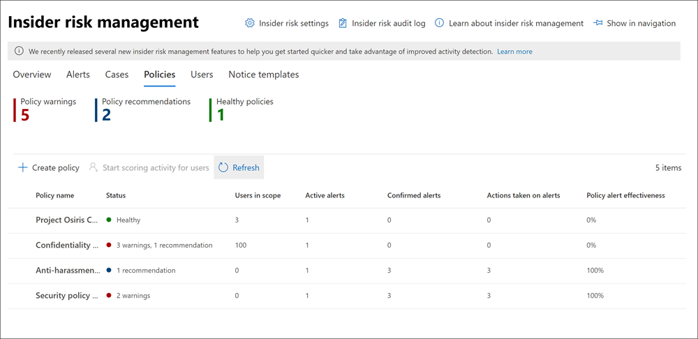

# <a name="insider-risk-management-policies"></a>Insider-principer för riskhantering

Insider-principer för riskhantering avgör vilka användare som omfattas och vilka typer av riskindikatorer som konfigureras för varningar. Du kan snabbt skapa en princip som gäller för alla användare i organisationen eller definiera enskilda användare eller grupper för hantering i en princip. Principer stöder innehållsprioriteringar för att fokusera policyvillkor på flera eller specifika Microsoft Teams, SharePoint webbplatser, typer av datakänslighet och dataetiketter. Med mallar kan du välja specifika riskindikatorer och anpassa tröskelvärden för händelser för policyindikatorer, effektivt anpassa riskpoäng och utnivå och frekvens för aviseringar. Dessutom kan riskresultat och avvikande identifieringar hjälpa till att identifiera användaraktiviteter som är av högre prioritet eller mer ovanliga. Med principfönster kan du definiera tidsramen för att tillämpa principen för att aviseringsaktiviteter och används för att fastställa varaktigheten för principen när den har aktiverats.

Titta på videon [om Konfiguration](https://www.youtube.com/watch?v=kudK5ajZTUo) av Insider-riskhanteringsprinciper för en översikt över hur principer som skapas med inbyggda principmallar kan hjälpa dig att snabbt vidta åtgärder för potentiella risker.

## <a name="policy-dashboard"></a>Principinstrumentpanel

Med **instrumentpanelen princip** kan du snabbt se principer i organisationen, status för principen, manuellt lägga till användare i principer och visa status för aviseringar som är associerade med varje princip.

- **Principnamn:** Namnet som tilldelats principen i principguiden.
- **Status:** Hälsostatus för varje princip. Visar antalet princip varningar och rekommendationer eller statusen *Felfri för* principer utan problem.  Du kan klicka på principen om du vill se hälsostatusinformation för eventuella varningar eller rekommendationer.
- **Aktiva aviseringar:** Antalet aktiva aviseringar för varje princip.
- **Bekräftade aviseringar:** Det totala antalet aviseringar som har lett till ärenden från principen under de senaste 365 dagarna.
- **Åtgärder som vidtas på** aviseringar: Det totala antalet aviseringar som har bekräftats eller avvisats under de senaste 365 dagarna.
- **Principaviseringseffektivitet:** Procentandelen som bestäms av totalt antal bekräftade aviseringar dividerat med totalt antal åtgärder som har vidtagits för aviseringar (vilket är summan av aviseringar som har bekräftats eller avvisats under det senaste året).



## <a name="policy-recommendations-from-analytics-preview"></a>Principrekommendationer från analys (förhandsversion)

Med Insider-riskanalyser kan du göra en utvärdering av potentiella Insider-risker i organisationen utan att konfigurera insiderriskprinciper. Den här utvärderingen kan hjälpa din organisation att identifiera potentiella områden med högre användarrisker och hjälpa till att fastställa typ och omfattning för principer för Insider-riskhantering som du kan överväga att konfigurera.

Mer information om Insider-riskanalyser och policyrekommendationer finns i [Inställningar för Insider-riskhantering: Analys (förhandsversion)](insider-risk-management-settings.md#analytics-preview).

## <a name="policy-templates"></a>Principmallar

Mallar för Insider-riskhantering är fördefinierade principvillkor som definierar de typer av riskindikatorer och riskbedömningsmodell som används av principen. Varje princip måste ha en mall tilldelad i guiden för att skapa principen innan den skapas. Insider-riskhantering har stöd för upp till fem principer för varje principmall. När du skapar en ny insider-riskprincip med principguiden väljer du någon av följande principmallar:

### <a name="data-theft-by-departing-users"></a>Datastöld genom avgående användare

När användare lämnar organisationen finns det särskilda riskindikatorer som vanligtvis associeras med datastöld av avgående användare. Den här principmallen använder exfiltrationsindikatorer för riskbedömning och fokuserar på identifiering och varningar i det här riskområdet. Datastöld för avgående användare kan inkludera hämtning av filer från SharePoint Online, skriva ut filer och kopiera data till personliga molnmeddelanden och lagringstjänster nära deras anställnings- och slutdatum. Med hjälp av antingen Microsoft 365 HR-koppling eller alternativet att automatiskt övervaka för borttagning av användarkonton i Azure Active Directory för organisationen, startar den här mallen poäng för riskindikatorer som relaterar till dessa aktiviteter och hur de motsvarar anställningsstatus för användare.

>[!IMPORTANT]
>När du använder den här mallen kan du konfigurera en personlig Microsoft 365 personalkontakt för att regelbundet importera information om här och slutdatum för användare i organisationen. I artikeln [Importera data med HR-koppling](import-hr-data.md) finns stegvisa instruktioner för hur du konfigurerar en Microsoft 365 HR-koppling för din organisation. Om du väljer att inte använda HR-kopplingen måste du välja alternativet Användarkonto som tagits bort från Azure AD när du konfigurerar utlösarhändelser i principguiden.

### <a name="general-data-leaks"></a>Allmänna dataläckor

Att skydda data och förhindra dataläckor är en konstant utmaning för de flesta organisationer, särskilt med den snabba tillväxten för nya data som skapas av användare, enheter och tjänster. Användarna har rätt att skapa, lagra och dela information över tjänster och enheter som gör att hantering av data läcker ut allt mer komplex och svår. Dataläckor kan inkludera oavsiktligt överformning av information utanför organisationen eller datastöld med skadliga avsikter. Med en tilldelad DLP-princip (Data Loss Prevention) eller den inbyggda utlösande händelsen börjar den här mallen poänga identifieringar i realtid av misstänkta datanedladdningar SharePoint Online, fil- och mappdelning, utskrift av filer och kopiering av data till personliga molnmeddelanden och lagringstjänster.

När du använder en *mall för Dataläckor* kan du tilldela en DLP-princip för att utlösa indikatorer i Insider-riskprincipen för varningar om hög allvarlighetsgrad i organisationen. När en varning för hög allvarlighetsgrad genereras av en DLP-principregel läggs till i Office 365-granskningsloggen undersöker Insider-riskprinciper som skapas med den här mallen automatiskt DLP-aviseringen med hög allvarlighetsgrad. Om aviseringen innehåller en användare inom omfattningen som definierats i Insider-riskprincipen behandlas aviseringen som en ny avisering och tilldelas en allvarlighetsgrad och ett riskresultat för insiderrisker. Med den här principen kan du utvärdera den här aviseringen i samband med andra aktiviteter som ingår i ärendet. Om du inte väljer en DLP-princip måste du välja den inbyggda utlösarhändelsen.

#### <a name="data-leaks-policy-guidelines"></a>Riktlinjer för dataläckor

När du skapar eller ändrar DLP-principer för användning med principer för insiderriskhantering bör du tänka på följande riktlinjer:

- Prioritera datainsamlingshändelser och var selektiv  när du tilldelar inställningar för incidentrapporter till Hög *när* regler konfigureras i DLP-principerna. Till exempel bör e-post av känsliga  dokument till en känd tävlande vara en exfiltrering med hög aviseringsnivå. Om du övertilldelar hög  nivå i rapporternas inställningar för incidenter i andra DLP-principregler kan du öka bruset i varningsarbetsflödet för Insider-riskhantering och göra det svårare för data att analytiker och andra analytiker utvärderar aviseringarna på rätt sätt.  Om du till exempel tilldelar *hög* aviseringsnivåer för åtkomst till denialaktiviteter i DLP-principer blir det svårare att utvärdera verkligt riskfyllda användarbeteende och -aktiviteter.
- Se till att du förstår och konfigurerar användarna inom både DLP- och Insider-riskhanteringsprinciperna. Endast användare som definierats som in-omfattning för insider-riskhanteringsprinciper med hjälp av mallen **Dataläckor** kommer att ha DLP-principaviseringar med hög allvarlighetsgrad bearbetad. Dessutom kommer endast användare som definieras som inomfångserade i en regel för en DLP-varning med hög allvarlighetsgrad att uppmärksammas av insider-riskhanteringsprincipen. Det är viktigt att du inte på ett oavsiktligt sätt konfigurerar användare inom omfattningen för både DLP- och Insider-riskprinciper på ett konfliktande sätt.

     Om till exempel DLP-principreglerna bara är begränsade till användare i säljteamet och den Insider-riskprincip som skapas från mallen Dataläckor har definierat alla användare som **inomfångsbaserade** kommer Insider-riskprincipen bara att bearbeta DLP-aviseringar med hög allvarlighetsgrad för användarna i säljteamet. Insider-riskprincipen får inga DLP-aviseringar med hög prioritet så att användare kan bearbeta som inte är definierade i DLP-reglerna i det här exemplet. Om däremot mallen för insider-riskhantering som skapas från **Data läcker** är begränsad till endast användare i säljteamet och den tilldelade DLP-principen är begränsad till alla användare, bearbetas bara DLP-aviseringar med hög allvarlighetsgrad för medlemmar i säljteamet. Insider-riskhanteringsprincipen ignorerar DLP-aviseringar med hög allvarlighetsgrad för alla användare som inte finns i säljteamet.

- Kontrollera att inställningen för **regel för** incidentrapporter i den DLP-princip som används för den här insiderriskhanteringsmallen är konfigurerad för *varningar* på hög allvarlighetsnivå. Hög *allvarlighetsnivå* är den utlösande händelsen och varningar för Insider-riskhantering kommer inte  att skapas från regler i DLP-principer med fältet Incidentrapporter inställt på *Låg* eller *Medel.*

    

     >[!NOTE]
     >När du skapar en ny DLP-princip med hjälp av de inbyggda mallarna måste du  välja alternativet  Skapa eller anpassa avancerade **DLP-regler** för att konfigurera inställningen incidentrapporter för allvarlighetsnivån Hög.

Varje Insider-riskhanteringsprincip som skapas från **mallen Dataläckor** kan bara ha en tilldelad DLP-princip. Du kan skapa en dedikerad DLP-princip som kombinerar de olika aktiviteter som du vill identifiera och agera som utlösande händelser för Insider-riskprinciper som använder **mallen Dataläckor.**

Stegvisa anvisningar för hur du konfigurerar DLP-principer för organisationen finns i artikeln [Skapa,](create-test-tune-dlp-policy.md) testa och finjustera en DLP-princip.

### <a name="data-leaks-by-priority-users-preview"></a>Dataläsar efter prioriterade användare (förhandsversion)

Skydda data och förhindra dataläckor för användare i organisationen kan vara beroende av deras position, åtkomstnivå till känslig information eller riskhistorik. Dataläckor kan inkludera oavsiktliga oversharing av känslig information utanför organisationen eller datastöld i skadliga syften. Med en tilldelad DLP-princip (Data Loss Prevention) börjar den här mallen poänga identifieringar i realtid av misstänkt aktivitet och resulterar i ökad sannolikhet för varningar för Insider-risker och aviseringar med högre allvarlighetsnivåer. Prioritetsanvändare definieras [i prioritetsgrupper som](insider-risk-management-settings.md#priority-user-groups-preview) konfigurerats i området inställningar för Insider-riskhantering.

Som med mallen **Allmänna dataläckor** måste du tilldela en DLP-princip för att utlösa indikatorer i Insider-riskprincipen för varningar om hög allvarlighetsgrad i organisationen. Följ riktlinjerna för Dataläckor-policyn ovan när du skapar en princip med hjälp av den här mallen. Dessutom måste du tilldela prioriterade användargrupper som skapats i **Insider-riskhantering**  >  **Inställningar**  >  **prioritetsanvändargrupper** till principen.

### <a name="data-leaks-by-disgruntled-users-preview"></a>Dataläckor av missnöjda användare (förhandsversion)

När användare upplever stressen hos anställning kan de bli oanvända, vilket kan öka risken för insiderrisker. Den här mallen börjar poänga användaraktivitet när en indikator som är associerad med misslydnad identifieras. Några exempel är resultatförbättringar, dålig prestandagranskning och ändringar av status på jobbnivå. Dataläckor för missnöjda användare kan inkludera att ladda ned filer från SharePoint Online och kopiera data till personliga molnmeddelanden och lagringstjänster nära stressorhändelser vid anställning.

När du använder den här mallen måste du också konfigurera en Microsoft 365 HR-koppling för att regelbundet importera meddelanden om prestandaförbättringar, dålig prestandagranskningsstatus eller ändringsinformation på jobbnivå för användare i organisationen. I artikeln [Importera data med HR-koppling](import-hr-data.md) finns stegvisa instruktioner för hur du konfigurerar en Microsoft 365 HR-koppling för din organisation.

### <a name="general-security-policy-violations-preview"></a>Allmänna brott mot säkerhetsprinciper (förhandsversion)

I många organisationer har användare behörighet att installera programvara på sina enheter eller ändra enhetsinställningar för att hjälpa till med sina uppgifter. Antingen oavsiktligt eller med skadliga avsikter kan användare installera skadlig programvara eller inaktivera viktiga säkerhetsfunktioner som hjälper till att skydda information på sin enhet eller på nätverksresurser. Den här principmallen använder säkerhetsvarningar från Microsoft Defender för Endpoint för att starta poängsättning av dessa aktiviteter och identifiering av fokus och aviseringar för det här riskområdet. Använd den här mallen för att få insikter om brott mot säkerhetsprinciper i scenarier där användare kan ha en historik över brott mot säkerhetsprinciper som kan vara en indikator på Insider-risker.

Du måste ha Microsoft Defender för Slutpunkt konfigurerat i din organisation och aktivera Defender för Slutpunkt för insider-riskhanteringsintegrering i Defender Säkerhetscenter för att importera aviseringar om säkerhetsöverträdelser. Mer information om hur du konfigurerar Defender för Slutpunkt för insider-riskhanteringsintegrering finns i [Konfigurera avancerade funktioner i Defender för slutpunkt.](/windows/security/threat-protection/microsoft-defender-atp/advanced-features#share-endpoint-alerts-with-microsoft-compliance-center)

### <a name="security-policy-violations-by-departing-users-preview"></a>Brott mot säkerhetsprinciper genom avgående användare (förhandsversion)

Att avgående användare, vare sig de lämnar positiva eller negativa villkor, kan vara en högre risk för brott mot säkerhetsprinciperna. För att skydda mot oavsiktliga eller skadliga säkerhetsöverträdelser för avgående användare använder den här principmallen Defender för Slutpunktsaviseringar för att ge insikter i säkerhetsrelaterade aktiviteter. Dessa aktiviteter omfattar användare som installerar skadlig programvara eller andra potentiellt skadliga program och inaktiverar säkerhetsfunktioner på sina enheter. Med hjälp av [antingen Microsoft 365 HR-kopplingen](import-hr-data.md) eller alternativet att automatiskt övervaka för borttagning av användarkonton i Azure Active Directory för din organisation börjar den här mallen poäng för riskindikatorer som relaterar till dessa säkerhetsaktiviteter och hur de motsvarar anställningsstatus för användare.

Du måste ha Microsoft Defender för Slutpunkt konfigurerat i din organisation och aktivera Defender för Slutpunkt för insider-riskhanteringsintegrering i Defender Säkerhetscenter för att importera aviseringar om säkerhetsöverträdelser. Mer information om hur du konfigurerar Defender för Slutpunkt för insider-riskhanteringsintegrering finns i [Konfigurera avancerade funktioner i Defender för slutpunkt.](/windows/security/threat-protection/microsoft-defender-atp/advanced-features#share-endpoint-alerts-with-microsoft-compliance-center)

### <a name="security-policy-violations-by-priority-users-preview"></a>Brott mot säkerhetsprinciper för användare med prioritet (förhandsversion)

Skydd mot säkerhetsöverträdelser för användare i organisationen kan vara beroende av deras position, åtkomstnivå till känslig information eller riskhistorik. Eftersom säkerhetsöverträdelser efter prioritet användare kan ha betydande inverkan på organisationens kritiska områden, börjar den här principmallen poäng för dessa indikatorer och använder Microsoft Defender för slutpunktsaviseringar för att ge insikter om säkerhetsrelaterade aktiviteter för dessa användare. Dessa aktiviteter kan omfatta prioritetsanvändare som installerar skadlig programvara eller andra potentiellt skadliga program och inaktiverar säkerhetsfunktioner på sina enheter. Prioritetsanvändare definieras i prioritetsgrupper som konfigurerats i området inställningar för Insider-riskhantering.

Du måste ha Microsoft Defender för Slutpunkt konfigurerat i din organisation och aktivera Defender för Slutpunkt för insider-riskhanteringsintegrering i Defender Säkerhetscenter för att importera aviseringar om säkerhetsöverträdelser. Mer information om hur du konfigurerar Defender för Slutpunkt för insider-riskhanteringsintegrering finns i [Konfigurera avancerade funktioner i Defender för slutpunkt.](/windows/security/threat-protection/microsoft-defender-atp/advanced-features#share-endpoint-alerts-with-microsoft-compliance-center) Dessutom måste du tilldela prioriterade användargrupper som skapats i **Insider-riskhantering**  >  **Inställningar**  >  **prioritetsanvändargrupper** till principen.

### <a name="security-policy-violations-by-disgruntled-users-preview"></a>Brott mot säkerhetsprinciper för användare (förhandsversion)

Användare som upplever stressen i anställningen kan riskera att oavsiktligt eller skadligt bryter mot säkerhetsprinciper. Dessa stressfaktorer kan inkludera användaren som placeras i en plan för prestandaförbättringar, dålig prestandagranskning eller nedgraderas från sin nuvarande position. Den här principmallen startar riskbedömning baserat på de indikatorer och aktiviteter som är kopplade till dessa händelser för dessa användare.

När du använder den här mallen måste du också konfigurera en Microsoft 365 HR-koppling för att regelbundet importera meddelanden om prestandaförbättringar, dålig prestandagranskningsstatus eller ändringsinformation på jobbnivå för användare i organisationen. I artikeln [Importera data med HR-koppling](import-hr-data.md) finns stegvisa instruktioner för hur du konfigurerar en Microsoft 365 HR-koppling för din organisation.

Du måste också ha Microsoft Defender för Slutpunkt konfigurerad i organisationen och aktivera Defender för Slutpunkt för insider-riskhanteringsintegrering i Defender Säkerhetscenter för att importera säkerhetsfelsvarningar. Mer information om hur du konfigurerar Defender för Slutpunkt för insider-riskhanteringsintegrering finns i [Konfigurera avancerade funktioner i Defender för slutpunkt.](/windows/security/threat-protection/microsoft-defender-atp/advanced-features#share-endpoint-alerts-with-microsoft-compliance-center)

### <a name="policy-template-prerequisites-and-triggering-events"></a>Förutsättningarna för principmallen och utlösa händelser

Beroende på vilken mall du väljer för en insider-riskhanteringsprincip varierar händelseutlösaren och förutsättningarna för principen. Utlösande händelser är förutsättningar som bestämmer om en användare är aktiv för en princip för insider-riskhantering. Om en användare läggs till i en princip för insider-riskhantering men inte har en utlösande händelse utvärderas inte användaraktiviteten av principen såvida de inte läggs till manuellt i instrumentpanelen Användare. Principförutsättningarna är obligatoriska objekt så att principen tar emot de signaler eller aktiviteter som krävs för att utvärdera risker.

I följande tabell visas utlösande händelser och förutsättningar för principer som skapats från varje mall för Insider-riskhanteringsprinciper:

| **Principmall** | **Utlösa händelser för principer** | **Förutsättningar** |
| :------------------ | :--------------------------------- | :---------------- |
| Datastöld genom avgående användare | Indikator för avslutande eller avslutande datum från HR-kontakt | (valfritt) Microsoft 365 HR-koppling som konfigurerats för datumindikatorer för uppsägning och förfallodatum Azure Active Directory har aktiverats |
| Allmänna dataläckor | Principaktivitet för dataläckor som skapar en varning för hög allvarlighetsgrad | (valfritt) DLP-princip som konfigurerats för varningar med hög allvarlighetsgrad eller inbyggd data exfiltration som utlöser händelse |
| Dataläckor efter prioriterade användare | Principaktivitet för dataläckor som skapar *en varning för* hög allvarlighetsgrad eller inbyggd exfiltrationshändelse utlöser | (valfritt) DLP-princip som konfigurerats för varningar med hög allvarlighetsgrad <br><br> Prioriterade användargrupper konfigurerade i inställningar för Insider-risker |
| Dataläckor av missnöjda användare | Prestandaförbättringar, dåliga prestanda och ändringsindikatorer på arbetsnivå från HR-anslutning | Microsoft 365 HR-koppling konfigurerad för misslydnad-indikatorer |
| Allmänna brott mot säkerhetsprinciper | Skydd av säkerhetskontroller eller oönskad programvara som upptäckts av Microsoft Defender för Endpoint | Active Microsoft Defender för Endpoint-prenumeration <br><br> Microsoft Defender för slutpunktsintegrering med Microsoft 365 konfigurerad efterlevnadscenter |
| Brott mot säkerhetsprinciper av avgående användare | Indikatorer för att ta bort eller bli av med ett datum från personalavdelningen Azure Active Directory borttagning av konto | (valfritt) Microsoft 365 HR-koppling som konfigurerats för datumindikatorer för uppsägning och förfallodatum <br><br> Active Microsoft Defender för Endpoint-prenumeration <br><br> Microsoft Defender för slutpunktsintegrering med Microsoft 365 konfigurerad efterlevnadscenter |
| Brott mot säkerhetsprinciper efter prioritetsanvändare | Skydd av säkerhetskontroller eller oönskad programvara som upptäckts av Microsoft Defender för Endpoint | Active Microsoft Defender för Endpoint-prenumeration <br><br> Microsoft Defender för slutpunktsintegrering med Microsoft 365 konfigurerad efterlevnadscenter <br><br> Prioriterade användargrupper konfigurerade i inställningar för Insider-risker |
| Brott mot säkerhetsprinciper av en oanvändarlös användare | Prestandaförbättringar, dåliga prestanda och ändringsindikatorer på arbetsnivå från HR-anslutning | Microsoft 365 HR-koppling konfigurerad för misslydnad-indikatorer <br><br> Active Microsoft Defender för Endpoint-prenumeration <br><br> Microsoft Defender för slutpunktsintegrering med Microsoft 365 konfigurerad efterlevnadscenter |

## <a name="prioritize-content-in-policies"></a>Prioritera innehåll i principer

Insider-riskhanteringsprinciper har stöd för att ange högre prioritet för innehåll beroende på var det lagras eller hur det klassificeras. Om du anger innehåll som prioritet ökar riskresultatet för alla associerade aktiviteter, vilket i sin tur ökar risken för att generera en varning med hög allvarlighetsgrad. Men vissa aktiviteter genererar ingen avisering alls om inte relaterat innehåll innehåller inbyggda eller anpassade typer av känslig information eller har angetts som prioritet i principen.

Din organisation har till exempel en dedikerad webbplats SharePoint för ett mycket konfidentiellt projekt. Dataläckor för information på SharePoint webbplats kan avslöja projektet och skulle ha stor inverkan på dess framgång. Genom att prioritera den här SharePoint i en Data-läckaspolicy ökas automatiskt riskpoäng för kvalificerande aktiviteter. Den här prioriteringen ökar sannolikheten för att dessa aktiviteter genererar en insider-riskvarning och upphöjer allvarlighetsnivån för aviseringen.

När du skapar en princip för insider-riskhantering i principguiden kan du välja bland följande prioriteringar:

- **SharePoint webbplatser**: Alla aktiviteter som associeras med alla filtyper i definierade SharePoint-webbplatser tilldelas en högre risknivå. 
- **Typer av känslig information**: En aktivitet som associeras med innehåll som innehåller [typer av känslig information](sensitive-information-type-entity-definitions.md) tilldelas ett högre riskresultat.
- **Känslighetsetiketter:** En aktivitet som är kopplad till innehåll som har [specifika känslighetsetiketter](sensitivity-labels.md) tillämpas tilldelas en högre risknivå.

## <a name="sequence-detection-preview"></a>Identifiering av sekvens (förhandsgranskning)

Riskfyllda aktiviteter kan inte inträffa som isolerade händelser. Dessa risker är ofta en del av en större sekvens av händelser. En sekvens är en grupp med två eller flera användaraktiviteter som utförts en efter den andra som kan föreslå en förhöjd risk. Att identifiera dessa relaterade aktiviteter är en viktig del av utvärderingen av den totala risken. När sekvensidentifiering har aktiverats för principer för datastöld eller  dataläckor visas insikter från aktiviteter med sekvensinformation på fliken Användaraktivitet i ett insider-riskhanteringsfall. Följande principmallar har stöd för identifiering av sekvenser:

- Datastöld genom avgående användare
- Allmänna dataläckor
- Dataläckor efter prioriterade användare
- Dataläckor av missnöjda användare

Dessa insider-riskhanteringsprinciper kan använda särskilda indikatorer och den ordning som de inträffar för att identifiera varje steg i en sekvens av risk. Filnamn används när du mappar aktiviteter i en sekvens. Dessa risker är ordnade i fyra huvudkategorier av aktivitet:

- **Samling:** Den här kategorin är en bra signal på nedladdningsaktiviteter från användare inom omfattningen av principen. En exempelaktivitet i den här kategorin skulle vara att hämta filer SharePoint webbplatser.
- **Exfiltrering:** Den här kategorin signalerar fokus på delnings- eller extraheringsaktiviteter till interna och externa källor av principanvändare inom omfattningen. En exempelaktivitet i den här kategorin är att skicka e-postmeddelanden med bifogade filer från organisationen till externa mottagare.
- **Obfuscation:** Den här kategorin signalerar fokus på maskering av riskfyllda aktiviteter av användare inom omfattningen av principen. En exempelaktivitet i den här kategorin byter namn på filer på en enhet.
- **Rensning: Den** här kategorin är en signal på borttagningsaktiviteter från principanvändare inom omfattningen. En exempelaktivitet i den här kategorin är att ta bort filer från en enhet.

>[!NOTE]
>Sekvensidentifiering använder indikatorer som är aktiverade i de globala inställningarna för Insider-riskhantering och indikatorer som väljs i en princip. Om lämpliga indikatorer inte är markerade fungerar inte sekvensidentifiering.

Du kan anpassa inställningarna för enskilda tröskelvärden för varje identifieringstyp när den konfigureras i principen. Inställningarna för tröskelvärdet justerar aviseringarna baserat på mängden filer som är kopplade till sekvensen.

Mer information om hantering av sekvensidentifiering i vyn **Användaraktivitet** finns i [Ärenden för Insider-riskhantering: Användaraktivitet](insider-risk-management-cases.md#user-activity).

## <a name="cumulative-exfiltration-detection-preview"></a>Identifiering av kumulativ exfiltration (förhandsgranskning)

Insider-riskindikatorer hjälper till att identifiera ovanliga nivåer av riskaktiviteter när de utvärderas dagligen för användare som omfattas av insiderriskprinciper. Identifiering av kumulativ exfiltrering använder maskininlärningsmodeller för att hjälpa dig att identifiera när användar exfiltreringsaktiviteter överstiger organisationens medelvärden när de mäts över tid och över flera exfiltreringsaktivitetstyper. Insider-riskhanteringsanalytiker och -experter kan använda kumulativa insikter för identifiering av exfiltrering för att identifiera exfiltreringsaktiviteter som normalt inte genererar aviseringar men som ligger över det som är typiskt för organisationen. Vissa exempel kan vara avgående användare som långsamt för in data i ett intervall av dagar eller när användarna flera gånger delar data över flera kanaler mer än vanligt för datadelning för organisationen.

Identifiering av kumulativ exfiltration är aktiverat som standard när du använder följande principmallar:

- Datastöld genom avgående användare
- Allmänna dataläckor
- Dataläckor efter prioriterade användare
- Dataläckor av missnöjda användare

>[!NOTE]
>Identifiering av kumulativ exfiltration använder indikatorer för exfiltration som är aktiverade i de globala inställningarna för insider-riskhantering och exfiltrationsindikatorer som är valda i en princip. Därför utvärderas identifiering av ackumulerad exfiltration endast för de nödvändiga exfiltrationsindikatorer som valts.

När identifiering av kumulativ exfiltration har aktiverats för datastöld eller principer  för dataläckor visas insikter från ackumulerad exfiltreringsaktivitet på fliken Användaraktivitet i ett insider-riskhanteringsfall.

Mer information om användaraktivitetshantering finns i [Insider-riskhanteringsärenden: Användaraktiviteter.](insider-risk-management-cases.md#user-activity)

## <a name="policy-health-preview"></a>Policyhälsa (förhandsversion)

Policystatusen ger dig insyn i potentiella problem med insider-riskhanteringsprinciper. Kolumnen Status på fliken Principer kan uppmärksamma dig på problem med principer som kan förhindra att användaraktivitet rapporteras eller varför antalet aktivitetsaviseringar är ovanligt. Status för principens hälsa kan också bekräfta att principen är felfri och inte behöver uppmärksammas eller att konfigurationen ändras.

Om det finns problem med en princip visar hälsostatus för principen varningar och rekommendationer som hjälper dig att vidta åtgärder för att lösa principproblem. De här meddelandena kan hjälpa dig att lösa följande problem:

- Principer med ofullständig konfiguration. Dessa problem kan inkludera saknade användare eller grupper i principen eller andra ofullständiga konfigurationssteg för principen.
- Principer med problem med indikatorkonfiguration. Indikatorer är en viktig del av varje princip. Om indikatorerna inte är konfigurerade, eller om för få indikatorer väljs, kanske principen inte utvärderar riskfyllda aktiviteter som förväntat.
- Principutlösare fungerar inte eller så är inte krav på principutlösare korrekt konfigurerade. Principfunktioner kan vara beroende av andra tjänster eller konfigurationskrav för att effektivt identifiera utlösande händelser för att aktivera tilldelning av riskpoäng till användare i principen. Dessa beroenden kan inkludera problem med konfiguration av anslutning, Microsoft Defender för slutpunktsaviseringsdelning eller konfigurationsinställningar för skydd mot dataförlust.
- Volymbegränsningarna närmar sig eller är över gränser. Insider-principer för riskhantering använder Microsoft 365 tjänster och slutpunkter för aggregerade riskaktivitetssignaler. Beroende på antalet användare i principerna kan volymbegränsningar fördröja identifiering och rapportering av riskaktiviteter. Läs mer om de här begränsningarna i avsnittet Begränsningar för principmallar i den här artikeln.

Om du snabbt vill visa hälsostatus för en princip går du till fliken Princip och kolumnen Status. Här visas följande alternativ för hälsostatus för principen:

- Felfritt: Inga problem har identifierats med principen.
- Rekommendationer: Det finns några problem med principen som kan hindra att principen fungerar som förväntat.
- Varningar: Det finns problem med principen som gör att den inte kan identifiera riskfyllda aktiviteter.

Om du vill ha mer information om rekommendationer eller varningar väljer du en princip **på fliken Princip** för att öppna kortet med principinformation. Mer information om rekommendationer och varningar, inklusive anvisningar om hur du ska åtgärda dessa problem, visas i avsnittet Meddelanden på informationskortet.


I följande tabell finns mer information om rekommendationer och varningsmeddelanden och åtgärder du kan vidta för att lösa potentiella problem.

|**Aviseringsmeddelanden**|**Principmallar**|**Orsaker/ Prova den här åtgärden för att åtgärda**|
|:------------------------|:-------------------|:---------------------------|
| Principen tilldelar inte riskpoäng för aktivitet | Alla principmallar | Du kanske vill granska principens omfattning och utlösa händelsekonfiguration så att principen kan tilldela riskpoäng för aktivitet <br><br> 1. Granska de användare som är valda för principen. Om du har markerat några användare kanske du vill välja fler användare. <br> 2. Om du använder en PERSONAL-koppling kontrollerar du att HR-kopplingen skickar rätt data. <br> 3. Om du använder en DLP-princip som utlösande händelse kontrollerar du konfigurationen av DLP-principen för att säkerställa att den har konfigurerats att användas i den här principen. <br> 4. Information om principer för säkerhetsöverträdelser finns i Microsoft Defender för slutpunktens aviseringsstatus som valts i inställningar för Insider-> intelligenta identifieringar. Kontrollera att aviseringsfiltret inte är för begränsat. |
| Principen har inte genererat några aviseringar | Alla principmallar | Du kanske vill granska din principkonfiguration så att du analyserar poäng för den aktivitet som är viktigt för dig. <br><br> 1. Kontrollera att du har valt indikatorer som du vill göra poäng för. Ju fler indikatorer som väljs ut, desto fler aktiviteter tilldelas riskpoäng. <br> 2. Granska tröskelvärdet för anpassning av principen. Om de valda tröskelvärdena inte stämmer överens med organisationens riskfaktorer kan du justera valen så att aviseringar skapas baserat på dina föredragna tröskelvärden. <br> 3. Granska de användare och grupper som valts för principen. Bekräfta att du har markerat alla tillämpliga användare och grupper. <br> 4. För principer för säkerhetsfel bekräftar du att du har markerat den aviseringsde triagestatus som du vill poänga för Microsoft Defender för slutpunktsaviseringar i Intelligenta identifieringar i inställningar.|
| Inga användare eller grupper ingår i den här principen | Alla principmallar | Användare eller grupper tilldelas inte till principen. <br><br> Redigera principen och välj användare eller grupper för principen. |
| Inga indikatorer har valts för den här principen | Alla principmallar | Indikatorerna har inte valts för principen <br><br> Redigera principen och välj lämpliga policyindikatorer för principen. |
| Inga prioriterade användargrupper ingår i den här principen | - Dataläsar efter prioriterade användare <br> - Brott mot säkerhetsprinciper efter prioritetsanvändare | Prioritet användargrupper tilldelas inte till principen. <br><br> Konfigurera prioritetsgrupper i inställningar för Insider-riskhantering och tilldela prioritetsgrupper till principen. |
| Ingen utlösande händelse har valts för den här principen | Alla principmallar | En utlösande händelse har inte konfigurerats för principen <br><br> Riskpoäng tilldelas inte till användaraktiviteter förrän du redigerar principen och väljer en utlösande händelse. |
| HR-kopplingen är inte konfigurerad eller fungerar som förväntat | - Datastöld genom avgående användare <br> - Brott mot säkerhetsprinciper genom avgående användare <br> – Dataläsar av misslyckade användare <br> - Brott mot säkerhetsprinciper av misslygda användare | Det finns ett problem med HR-kopplingen. <br><br> 1. Om du använder en PERSONAL-koppling kontrollerar du att HR-kopplingen skickar rätt data <br><br> ELLER <br><br> 2. Välj Azure AD-kontot som tog bort händelsen som utlöstes. |
| Inga enheter är onboarded | - Datastöld genom avgående användare <br> - Allmänna dataläckor <br> – Dataläsar av misslyckade användare <br> - Dataläckor efter prioriterade användare | Enhetsindikatorer markeras men det finns inga enheter som förs in i Microsoft 365 <br><br> Kontrollera om enheterna är onboarded och uppfyller kraven. |
| HR-anslutningen inte har laddat upp data nyligen | - Datastöld genom avgående användare <br> - Brott mot säkerhetsprinciper genom avgående användare <br> – Dataläsar av misslyckade användare <br> - Brott mot säkerhetsprinciper av misslygda användare | HR-kopplingen har inte importerat data på mer än 7 dagar. <br><br> Kontrollera att HR-kopplingen är korrekt konfigurerad och skicka data. |
| Vi kan inte kontrollera status för din HR-anslutare just nu. Kontrollera igen senare | - Datastöld genom avgående användare <br> - Brott mot säkerhetsprinciper genom avgående användare <br> – Dataläsar av misslyckade användare <br> - Brott mot säkerhetsprinciper av misslygda användare | Insider-riskhanteringslösningen kan inte kontrollera status för din HR-kontakt. <br><br> Kontrollera att HR-kopplingen är korrekt konfigurerad och skicka data, eller gå tillbaka och kontrollera policystatus.  |
| DLP-princip har inte valts som utlösande händelse | - Allmänna dataläckor <br> - Dataläsar efter prioriterade användare | En DLP-princip har inte valts som en utlösande händelse eller så har den valda DLP-principen tagits bort. <br><br> Redigera principen och välj antingen en aktiv DLP-princip eller "Användaren utför en exfiltreringsaktivitet" som utlösande händelse i principkonfigurationen. |
| DLP-principen som används i den här principen är inaktiverad | - Allmänna dataläckor <br> - Dataläsar efter prioriterade användare | DLP-principen som används i den här principen är inaktiverad. <br><br> 1. Aktivera DLP-principen som tilldelats den här principen. <br><br> ELLER <br><br> 2. Redigera den här principen och välj antingen en ny DLP-princip eller "Användaren utför en exfiltreringsaktivitet" som utlösande händelse i principkonfigurationen. |
| DLP-principen uppfyller inte kraven | - Allmänna dataläckor <br> - Dataläsar efter prioriterade användare | DLP-principer som används som utlösande händelser måste konfigureras för att generera varningar med hög allvarlighetsgrad. <br><br>  1. Redigera DLP-principen och tilldela tillämpliga aviseringar med *hög allvarlighetsgrad.* <br><br> ELLER <br><br> 2. Redigera den här principen och välj Användare utför *en exfiltreringsaktivitet* som utlösande händelse. |
| Din organisation har ingen Microsoft Defender för Endpoint-prenumeration | - Allmänna brott mot säkerhetsprinciper <br> - Brott mot säkerhetsprinciper av avgående användare <br> - Brott mot säkerhetsprinciper av misslygda användare <br> - Brott mot säkerhetsprinciper efter prioritetsanvändare | En aktiv Microsoft Defender för Endpoint-prenumeration upptäcktes inte för din organisation. <br><br> Förrän en Microsoft Defender för Endpoint-prenumeration läggs till, tilldelar dessa principer inte riskpoäng för användaraktivitet. |
| Microsoft Endpoint för slutpunktsaviseringar delas inte med efterlevnadscentret | - Allmänna brott mot säkerhetsprinciper <br> - Brott mot säkerhetsprinciper av avgående användare <br> - Brott mot säkerhetsprinciper av misslygda användare <br> - Brott mot säkerhetsprinciper efter prioritetsanvändare | Microsoft Defender för slutpunktsaviseringar delas inte med efterlevnadscentret. <br><br> Konfigurera delning av Microsoft Defender för slutpunktsaviseringar. |
| Du närmar dig den högsta gränsen för vilka användare som aktivt deltar i den här principmallen. | Alla principmallar | Varje principmall har maximalt antal användare inom omfattningen. Se avsnittsinformationen om mallgräns. <br><br> Granska användarna på fliken Användare och ta bort alla användare som inte behöver poäng längre. |

## <a name="policy-template-limits"></a>Begränsningar för principmallar

Mallar för Insider-riskhanteringspolicyer använder begränsningar för att hantera volymen och processens omfattning för användarriskaktiviteter och hur den här processen integreras med stöd för Microsoft 365 tjänster. Varje principmall har maximalt antal användare som aktivt kan tilldelas riskpoäng för principen som den kan stödja och effektivt bearbeta och rapportera riskaktiviteter. Användare inom omfattningen är användare som utlöser händelser för principen.

Gränsen för varje princip beräknas utifrån det totala antalet unika användare som får riskpoäng per typ av principmall. Om antalet användare för en principmalltyp närmar sig eller överskrider användargränsen minskas principprestandan. Om du vill visa det aktuella antalet användare för en princip går du till fliken Princip och kolumnen Användare i omfattning. Du kan ha upp till fem principer för alla principmallar. De här maxgränserna gäller för användare i alla principer som använder en viss principmall.

Använd följande tabell för att avgöra det maximala antal användare inom omfattningen som stöds för varje principmall:

|**Principmall**|**Maximalt antal användare inom omfattningen**|
|:------------------|:--------------------------------|
| Allmän dataläcka | 15,000 |
| Dataläckor av missnöjda användare | 7,500 |
| Dataläckor efter prioritetsanvändare | 1,000 |
| Datastöld genom avgående användare | 20,000 |
| Allmänna brott mot säkerhetsprinciper | 1,000 |
| Brott mot säkerhetsprincip efter prioritetsanvändare | 1,000 |
| Brott mot säkerhetsprinciper av avgående användare | 15,000 |
| Brott mot säkerhetsprinciper av misslygda användare | 7,500 |

## <a name="create-a-new-policy"></a>Skapa en ny princip

Om du vill skapa en ny princip för insider-riskhantering ska du använda principguiden i Insider-riskhanteringslösningen i Microsoft 365 efterlevnadscenter. 

Så här skapar du en ny princip:

1. I Microsoft 365 [säkerhets- och efterlevnadscenter](https://compliance.microsoft.com)går **du till Insider-riskhantering** och väljer **fliken** Principer.
2. Välj **Skapa princip** för att öppna principguiden.
3. Välj en **principkategori** på sidan Principmall och välj sedan mallen för den nya principen. Mallarna består av villkor och indikatorer som definierar de riskaktiviteter du vill identifiera och undersöka. Granska mallförutsättningarna, utlösa händelser och identifierade aktiviteter för att bekräfta att den här principmallen passar dina behov.

    >[!IMPORTANT]
    >Vissa principmallar har krav som måste konfigureras för att principen ska kunna generera relevanta aviseringar. Om du inte har konfigurerat tillämpliga principkrav, se **steg 4** ovan.

4. Välj **Nästa för** att fortsätta.
5. Fyll **i följande fält** på sidan Namn och beskrivning:
    - **Namn (obligatoriskt)**: Ange ett eget namn för principen. Det här namnet kan inte ändras efter att principen har skapats.
    - **Beskrivning (valfritt)**: Ange en beskrivning för principen.

6. Välj **Nästa för** att fortsätta.
7. På sidan **Användare** och  grupper väljer du  Inkludera alla användare och grupper eller Inkludera specifika användare och grupper för att definiera vilka användare eller grupper som ska ingå i principen, eller om du har valt en användarbaserad mall för prioritet. välj **Lägg till eller redigera användargrupper med prioritet.** Om **du markerar Inkludera alla användare och** grupper söker du efter utlösande händelser för alla användare och grupper i organisationen för att börja tilldela riskpoäng för principen. Om **du markerar Inkludera specifika användare och** grupper kan du definiera vilka användare och grupper som ska tilldelas till principen.
8. Välj **Nästa för** att fortsätta.
9. På sidan **Innehåll som ska prioriteras** kan du tilldela (om det behövs) de källor som ska prioriteras, vilket ökar risken för att generera en hög allvarlighetsvarning för dessa källor. Välj något av följande alternativ:

    - **Jag vill ange SharePoint webbplatser, känslighetsetiketter och/eller typer av känslig information som prioritetsinnehåll.** Om du väljer det här alternativet kan informationssidor i guiden konfigurera dessa kanaler.
    - **Jag vill inte ange prioritetsinnehåll just nu (du kan göra** detta när principen har skapats). Om du väljer det här alternativet hoppar du över kanalinformationssidorna i guiden.

10. Välj **Nästa för** att fortsätta.

11. Om du valde Jag vill ange **SharePoint-webbplatser,** känslighetsetiketter och/eller typer av känslig information som prioritetsinnehåll i föregående steg visas informationssidorna för *SharePoint-webbplatser,* typer av känslig information och känslighetsetiketter.  Använd dessa informationssidor för att SharePoint, typer av känslig information och känslighetsetiketter att prioritera i principen.

    - **SharePoint webbplatser:** Välj **Lägg SharePoint webbplats** och välj de SharePoint som du har tillgång till och vill prioritera. Till exempel *"group1@contoso.sharepoint.com/sites/group1".*
    - **Typ av känslig** information: **Välj Lägg till typ av känslig** information och välj de känslighetstyper du vill prioritera. Till exempel *"U.S. Bank Account Number"* *och "Credit Card Number"*.
    - **Känslighetsetiketter:** **Välj Lägg till känslighetsetikett** och välj de etiketter du vill prioritera. Till exempel *"Konfidentiellt"* och *"Hemligt"*.

12. Välj **Nästa för** att fortsätta.
13. På sidan **Indikatorer och utlösa händelser** visas [](insider-risk-management-settings.md#indicators) de indikatorer som du har definierat som tillgängliga på sidan Indikatorer för   >  **Insider-risker.** Om du valde en *mall* för Dataläckor i början av guiden måste du välja en DLP-princip i listrutan **för DLP-principen** för att aktivera utlösande indikatorer för principen eller välja den inbyggda utlösande händelsen.

    >[!IMPORTANT]
    >Om indikatorerna på den här sidan inte kan markeras måste du markera de indikatorer som du vill aktivera för alla principer. Du kan använda knappen **Aktivera indikatorer i** guiden eller välja indikatorer på sidan För **Insider-Inställningar**  >    >  **policyindikatorer.**

    Markera de indikatorer som du vill tillämpa på principen. Om du inte vill använda standardinställningarna för tröskelvärde för principen för dessa indikatorer inaktiverar du de standardtröskelvärden som rekommenderas av **Microsoft** och anger tröskelvärdena för varje vald indikator.

    - Om du har valt minst en *Office* *enhetsindikator* väljer du **Risk score-poäng efter** behov. Riskpoäng gäller endast för valda indikatorer.
    - Om du har valt en principmall *för Datastöld* eller *Dataläckor* väljer du en eller flera sekvensidentifieringsmetoder och en metod för kumulativ  **exfiltrationsidentifiering** som ska tillämpas på principen.

14. Välj **Nästa för** att fortsätta.
15. På sidan **Indikatortröskelvärden** väljer du alternativet om du vill använda standardindikeringströskeln eller ange anpassade tröskelvärden för enskilda indikatorer. För varje indikator väljer du lämplig nivå för att generera önskad nivå av aktivitetsaviseringar.
16. Välj **Nästa för** att fortsätta.
17. På sidan **Granska** granskar du de inställningar som du har valt för principen och eventuella förslag eller varningar för dina val. Välj **Redigera** om du vill ändra något av principvärdena eller **välj Skicka** för att skapa och aktivera principen.

## <a name="update-a-policy"></a>Uppdatera en princip

Om du vill uppdatera en befintlig insider-riskhanteringspolicy använder du principguiden i Insider-riskhanteringslösningen i Microsoft 365 kompatibilitetscenter. 

Så här hanterar du en befintlig princip:

1. I Microsoft 365 [säkerhets- och efterlevnadscenter](https://compliance.microsoft.com)går **du till Insider-riskhantering** och väljer **fliken** Principer.
2. Välj den princip du vill hantera på instrumentpanelen för principen.
3. Välj Redigera princip på sidan **med principinformation**
4. Du kan inte redigera följande i principguiden:
    - **Principmall:** Mallen som används för att definiera de typer av riskindikatorer som övervakas av principen.
    - **Namn**: Principens eget namn
5. Uppdatera **beskrivningen för** principen i fältet Beskrivning på sidan Namn **och** beskrivning.
6. Välj **Nästa för** att fortsätta.
7. På sidan **Användare** och  grupper väljer du  Inkludera alla användare och grupper eller Inkludera specifika användare och grupper för att definiera vilka användare eller grupper som ska ingå i principen, eller om du har valt en användarbaserad mall för prioritet. välj **Lägg till eller redigera användargrupper med prioritet.** Om **du markerar Inkludera alla användare och** grupper söker du efter utlösande händelser för alla användare och grupper i organisationen för att börja tilldela riskpoäng för principen. Om **du markerar Inkludera specifika användare och** grupper kan du definiera vilka användare och grupper som ska tilldelas till principen.
8. Välj **Nästa för** att fortsätta.
9. På sidan **Innehåll som ska prioriteras** kan du tilldela (om det behövs) de källor som ska prioriteras, vilket ökar risken för att generera en hög allvarlighetsvarning för dessa källor. Välj något av följande alternativ:

    - **Jag vill ange SharePoint webbplatser, känslighetsetiketter och/eller typer av känslig information som prioritetsinnehåll.** Om du väljer det här alternativet kan informationssidor i guiden konfigurera dessa kanaler.
    - **Jag vill inte ange prioritetsinnehåll just nu (du kan göra** detta när principen har skapats). Om du väljer det här alternativet hoppar du över kanalinformationssidorna i guiden.

10. Välj **Nästa för** att fortsätta.

11. Om du valde Jag vill ange **SharePoint-webbplatser,** känslighetsetiketter och/eller typer av känslig information som prioritetsinnehåll i föregående steg visas informationssidorna för *SharePoint-webbplatser,* typer av känslig information och känslighetsetiketter.  Använd dessa informationssidor för att SharePoint, typer av känslig information och känslighetsetiketter att prioritera i principen.

    - **SharePoint webbplatser:** Välj **Lägg SharePoint webbplats** och välj de SharePoint som du har tillgång till och vill prioritera. Till exempel *"group1@contoso.sharepoint.com/sites/group1".*
    - **Typ av känslig** information: **Välj Lägg till typ av känslig** information och välj de känslighetstyper du vill prioritera. Till exempel *"U.S. Bank Account Number"* *och "Credit Card Number"*.
    - **Känslighetsetiketter:** **Välj Lägg till känslighetsetikett** och välj de etiketter du vill prioritera. Till exempel *"Konfidentiellt"* och *"Hemligt"*.

12. Välj **Nästa för** att fortsätta.
13. På sidan **Indikatorer och utlösa händelser** visas [](insider-risk-management-settings.md#indicators) de indikatorer som du har definierat som tillgängliga på sidan Indikatorer för   >  **Insider-risker.** Om du valde en *mall* för Dataläckor i början av guiden måste du välja en DLP-princip i listrutan **för DLP-principen** för att aktivera utlösande indikatorer för principen eller välja den inbyggda utlösande händelsen.

    >[!IMPORTANT]
    >Om indikatorerna på den här sidan inte kan markeras måste du markera de indikatorer som du vill aktivera för alla principer. Du kan använda knappen **Aktivera indikatorer i** guiden eller välja indikatorer på sidan För **Insider-Inställningar**  >    >  **policyindikatorer.**

    Markera de indikatorer som du vill tillämpa på principen. Om du inte vill använda standardinställningarna för tröskelvärde för principen för dessa indikatorer inaktiverar du de standardtröskelvärden som rekommenderas av **Microsoft** och anger tröskelvärdena för varje vald indikator.

    - Om du har valt minst en *Office* *enhetsindikator* väljer du **Risk score-poäng efter** behov. Riskpoäng gäller endast för valda indikatorer.
    - Om du har valt en principmall *för Datastöld* eller *Dataläckor* väljer du en eller flera sekvensidentifieringsmetoder och en metod för kumulativ  **exfiltrationsidentifiering** som ska tillämpas på principen.

14. Välj **Nästa för** att fortsätta.
15. På sidan **Indikatortröskelvärden** väljer du alternativet om du vill använda standardindikeringströskeln eller ange anpassade tröskelvärden för enskilda indikatorer. För varje indikator väljer du lämplig nivå för att generera önskad nivå av aktivitetsaviseringar.
16. Välj **Nästa för** att fortsätta.
17. På sidan **Granska** granskar du de inställningar som du har valt för principen och eventuella förslag eller varningar för dina val. Välj **Redigera** om du vill ändra något av principvärdena eller **välj Skicka** för att skapa och aktivera principen.

## <a name="copy-a-policy"></a>Kopiera en princip

Du kan behöva skapa en ny princip som liknar en befintlig princip men bara behöver några få konfigurationsändringar. I stället för att skapa en ny princip från grunden kan du kopiera en befintlig princip och sedan ändra de områden som måste uppdateras i den nya principen.

Så här kopierar du en befintlig princip:

1. I Microsoft 365 säkerhets- och efterlevnadscenter går du till Insider-riskhantering och väljer fliken Principer.
2. Välj den princip du vill kopiera på instrumentpanelen för principen.
3. På sidan med principinformation väljer du Kopiera.
4. Namnge den nya principen i principguiden och uppdatera principkonfigurationen efter behov.

## <a name="immediately-start-scoring-user-activity"></a>Starta direkt poänganvändaraktivitet

Det kan finnas scenarier där du omedelbart måste börja tilldela riskpoäng till användare med insiderriskprinciper utanför den Insider-riskhantering som utlöser arbetsflödet för händelser. Använd **Starta** poängaktivitet för  användare på fliken Principer om du manuellt vill lägga till en användare (eller användare) i en eller flera insider-riskprinciper under en viss tid, för att direkt börja tilldela riskpoäng för deras aktivitet och för att kringgå kravet för en användare att ha en utlösande indikator (t.ex. en matchning för en DLP-princip). Du kan också lägga till en orsak till att användaren läggs till i principen, som visas på användarnas aktivitetstidslinje. Användare som läggs till manuellt i principer visas i **instrumentpanelen Användare** och aviseringar skapas om aktiviteten uppfyller tröskelvärdena för principavisering.

Vissa scenarier där du kanske omedelbart vill börja poänga användaraktiviteter:

- När användare identifieras med riskproblem och du omedelbart vill börja tilldela riskpoäng till deras aktivitet för en eller flera av dina principer
- När det finns en händelse som kan innebära att du omedelbart måste börja tilldela riskpoäng för de berörda användarnas aktiviteter för en eller flera av dina principer
- När du inte har konfigurerat din HR-anslutning ännu, men du vill börja tilldela riskpoäng till användaraktiviteter för HR-händelser genom att ladda upp en .csv fil för användarna

>[!NOTE]
>Det kan ta flera timmar innan nya manuellt tillagda användare visas på **instrumentpanelen** Användare. Det kan ta upp till 24 timmar innan aktiviteterna för de föregående 90 dagarna för dessa användare visas. Om du vill visa aktiviteter för manuellt tillagda användare  går du till  fliken Användare, väljer användaren på instrumentpanelen Användare och öppnar fliken Användaraktivitet i informationsfönstret. 

Om du vill starta poängaktivitet för användare manuellt med en eller flera insider-riskhanteringsprinciper slutför du följande steg:

1. I Microsoft 365 [säkerhets- och efterlevnadscenter](https://compliance.microsoft.com)går **du till Insider-riskhantering** och väljer **fliken** Principer.
2. På instrumentpanelen för principen väljer du den princip eller de principer som du vill lägga till användare i.
3. Välj **Starta poängaktivitet för användare**.
4. I fältet **Orsak i fönstret** Lägg till användare i flera **principer** lägger du till en orsak till att lägga till användarna.
5. I fältet Detta ska vara i (välj mellan 5 och **30 dagar)** anger du antalet dagar som användarens aktivitet ska poängas för den princip de läggs till i
6. Om du vill söka efter användare i Active Directory använder du **sökanvändaren för att lägga till i fältet** principer. Skriv namnet på den användare som du vill lägga till i principerna. Välj användarnamnet och upprepa för att tilldela ytterligare användare till principerna. Listan över användare som du har valt visas i avsnittet användare i fönstret Lägg till användare i flera principer.
7. Om du vill importera en lista med användare att lägga till i principerna väljer du **Importera** för att importera .csv (kommaavgränsade värden). Filen måste ha följande format och du måste ange användarnas huvudnamn i filen:

    ```csv
    user principal name
    user1@domain.com
    user2@domain.com
    ```

8. Markera lägg till användare i principer för att acceptera ändringarna och lägga till användare i principerna eller välj Avbryt för att ignorera ändringarna och stänga dialogrutan.

## <a name="stop-scoring-users-in-a-policy"></a>Sluta poänganvändare i en princip

Om du vill sluta poänga användare i en princip kan du [läsa Insider-riskhanteringsanvändare:](insider-risk-management-users.md#remove-users-from-in-scope-assignment-to-policies) Ta bort användare från tilldelning inom omfattningen till policyartikeln.

## <a name="delete-a-policy"></a>Ta bort en princip

>[!NOTE]
>När du tar bort en princip tas inte aktiva eller arkiverade aviseringar som genereras från principen bort.

Så här tar du bort en befintlig princip för insider-riskhantering:

1. I Microsoft 365 [säkerhets- och efterlevnadscenter](https://compliance.microsoft.com)går **du till Insider-riskhantering** och väljer **fliken** Principer.
2. Välj den princip du vill ta bort på instrumentpanelen för principen.
3. Välj **Ta bort** i instrumentpanelsverktygsfältet.
4. I dialogrutan **Ta** bort väljer du **Ja för** att ta bort principen, eller så väljer **du Avbryt** för att stänga dialogrutan.
