# Komma igång med inställningar för Insider-riskhantering

Insider-riskhanteringsinställningar gäller för alla insider-riskhanteringsprinciper, oavsett vilken mall du väljer när du skapar en princip. Inställningar konfigureras med hjälp av **kontrollen för Insider-riskinställningar** högst upp på alla flikar för insiderriskhantering. De här inställningarna styr principkomponenter för följande områden:

- Sekretess
- Indikatorer
- Policytidslinje
- Intelligenta identifieringar
- Exportera aviseringar (förhandsversion)
- Prioritet för användargrupper (förhandsversion)
- Fysiska tillgångar prioritet (förhandsversion)
- Power Automate flöden (förhandsversion)
- Microsoft Teams (förhandsvisning)
- Analys (förhandsversion)

Innan du kommer igång och skapar principer för insider-riskhantering är det viktigt att förstå de här inställningarna och välja de nivåer som bäst passar organisationens efterlevnadsbehov.

## Sekretess

Det är viktigt att skydda sekretessen för användare som har principmatchningar och kan öka objektivityen vid dataundersökning och analysgranskningar för insiderriskvarningar. Du kan välja någon av följande inställningar för användare med en insider-riskprincip:

- **Visa anonyma versioner av** användarnamn: Namn på användare anonymiseras för att förhindra att administratörer, dataadministratörer och granskare ser vem som är associerad med principaviseringar. En användare av "Grace Taylor" skulle till exempel visas med en slumpmässigt vald alias, till exempel "AnonIS8-988" i alla delar av upplevelsen med insider-riskhantering. Om du väljer den här inställningen anonymiseras alla användare med aktuella och tidigare principmatchningar, och alla principer gäller. Informationen i användarprofilen i insider-risken är inte tillgänglig när du väljer det här alternativet. Användarnamn visas när du lägger till nya användare i befintliga principer eller när du tilldelar användare till nya principer. Om du väljer att inaktivera den här inställningen visas användarnamnen för alla användare som har matchningar gällande eller tidigare princip.
- **Visa inte anonyma versioner av användarnamn:** Användarnamn visas för alla aktuella och tidigare principmatchningar för aviseringar och fall. Information om användarprofilen (namn, titel, alias och organisation eller avdelning) visas för användaren för alla varningar och ärenden inom Insider-riskhantering.

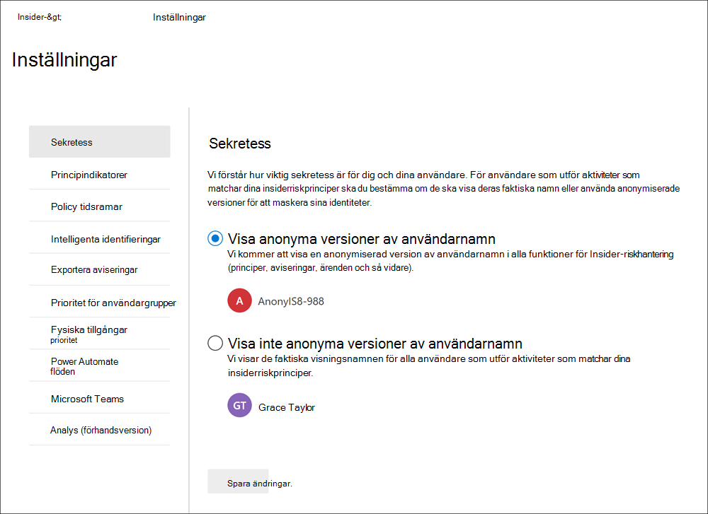

## Indikatorer

Mallar för Insider-riskprinciper definierar vilken typ av riskaktiviteter som du vill identifiera och undersöka. Varje principmall baseras på specifika indikatorer som motsvarar specifika utlösare och riskaktiviteter. Alla indikatorer är inaktiverade som standard, och du måste välja en eller flera principindikatorer innan du konfigurerar en princip för Insider-riskhantering.

Aviseringar utlöses av principer när användare utför aktiviteter som är relaterade till principindikatorer som uppfyller ett obligatoriskt tröskelvärde. Insider-riskhantering använder två typer av indikatorer:

- **Utlösa händelser:** Händelser som bestämmer om en användare är aktiv i en princip för insider-riskhantering. Om en användare läggs till i en princip för insider-riskhantering inte har någon utlösande händelse utvärderas inte användaraktiviteten av principen. Till exempel läggs Användare A till i en princip som skapas från *Datastöld* genom avgående användarprincipmall och principen Microsoft 365 HR-kopplingen är korrekt konfigurerad. Fram tills att användare A har ett uppsägningsdatum som rapporterats av HR-kopplingen utvärderas inte användar-A-aktiviteter av denna princip för insiderriskhantering för risker. Ett annat exempel på en utlösande  händelse är om en användare har en DLP-principvarning med hög allvarlighetsgrad när de *använder Dataläckorsprinciper.*
- **Principindikatorer**: Indikatorer som ingår i principer för insider-riskhantering som används för att fastställa en risknivå för en användare inom omfattningen. De här principindikatorerna aktiveras bara när en utlösande händelse inträffar för en användare. Några exempel på principindikatorer är när en användare kopierar data till personliga molnlagringstjänster eller bärbara lagringsenheter, om ett användarkonto tas bort från Azure Active Directory eller om en användare delar interna filer och mappar med obehöriga externa parter.

Principindikatorer är indelade i följande områden. Du kan välja indikatorerna för att aktivera och anpassa gränser för indikatorhändelsen för varje indikatornivå när du skapar en insiderriskprincip:

- **Office indikatorer**: De omfattar principindikatorer för SharePoint, e-Microsoft Teams och e-postmeddelanden.
- **Enhetsindikatorer:** De omfattar principindikatorer för aktivitet, t.ex. att dela filer över nätverket eller med enheter. Indikatorerna omfattar aktiviteter Microsoft Office filer, .csv (kommaavgränsade värden) och filer .pdf (portable document format) . Om du väljer **Enhetsindikatorer** bearbetas aktiviteten endast för enheter med Windows 10 version 1809 eller senare och du måste först registrera enheter i efterlevnadscentret. Mer information om hur du konfigurerar enheter för integrering med Insider-risker finns i avsnittet Aktivera enhetsindikatorer [och onboard-enheter](insider-risk-management-settings.md#OnboardDevices) i den här artikeln.
- **Indikatorn för brott mot säkerhetsprinciper (förhandsversion): Det** här omfattar indikatorer från Microsoft Defender för Endpoint som är relaterade till ej godkända eller skadliga programinstallationer eller förbikoppling av säkerhetskontroller. Om du vill ta emot aviseringar i Insider-riskhantering måste du ha en aktiv Defender för Slutpunktslicens och insider-riskintegrering aktiverat. Mer information om hur du konfigurerar Defender för Slutpunkt för insider-riskhanteringsintegrering finns i [Konfigurera avancerade funktioner i Microsoft Defender för slutpunkt.](/windows/security/threat-protection/microsoft-defender-atp/advanced-features\#share-endpoint-alerts-with-microsoft-compliance-center)
- **Indikatorer för fysisk åtkomst (förhandsversion)**: Dessa omfattar principindikatorer för fysisk åtkomst till känsliga tillgångar. Till exempel kan försök till ett begränsat område i dina fysiska systemloggar delas med principer för Insider-riskhantering. Om du vill ta emot de här typerna av aviseringar i insider-riskhantering måste du ha [prioriterat](import-physical-badging-data.md) fysiska tillgångar aktiverat i insider-riskhantering och den fysiska anslutningen för data felaktigt konfigurerad. Mer information om hur du konfigurerar fysisk åtkomst finns i [avsnittet Prioriterad fysisk åtkomst](#priority-physical-assets-preview) i den här artikeln.
- **Microsoft Cloud App Security indikatorer (förhandsversion)**: De omfattar principindikatorer från delade aviseringar från Cloud App Security. Automatiskt aktiverad avvikande identifiering i Cloud App Security börjar genast identifiera och sortera resultat, vilket riktar många beteendebeteenden mellan dina användare och de datorer och enheter som är anslutna till ditt nätverk. Om du vill inkludera dessa aktiviteter i varningar för insider-riskhanteringsprinciper markerar du en eller flera indikatorer i det här avsnittet. Mer information om Cloud App Security och avvikande identifiering finns i [Hämta funktionsanalyser och avvikande identifiering.](/cloud-app-security/anomaly-detection-policy)
- **Riskpoäng genom att** höja riskpoängen för ovanliga aktiviteter eller tidigare principbrott. Om du aktiverar riskresultat ökar riskpoängen och sannolikheten för aviseringar för dessa typer av aktiviteter. För ovanliga aktiviteter förstärks resultat om den identifierade aktiviteten avviker från användarens vanliga beteende. Till exempel en betydande ökning av dagliga filnedladdningar. Ovanlig aktivitet presenteras som en ökning i procent (till exempel "100 % över vanlig aktivitet") och påverkar riskresultatet olika beroende på aktiviteten. För användare med tidigare principbrott ökas poäng om en användare hade fler än ett ärende tidigare löst som en bekräftad principbrott. Riskpoäng kan bara väljas om en eller flera indikatorer är markerade.

I vissa fall kanske du vill begränsa indikatorerna för Insider-risker som tillämpas på insiderriskprinciper i din organisation. Du kan inaktivera principindikatorer för vissa områden genom att inaktivera dem från alla insiderriskprinciper. Utlösande händelser kan inte ändras för mallar för Insider-riskprinciper.

Om du vill definiera indikatorer för Insider-risker som är aktiverade i alla Insider-riskprinciper går du till Indikatorer för **Insider-risker** och väljer en eller flera  >   principindikatorer. De indikatorer som valts på sidan Indikatorinställningar kan inte konfigureras individuellt när du skapar eller redigerar en Insider-riskprincip i principguiden.

>[!NOTE]
>Det kan ta flera timmar innan nya manuellt tillagda användare visas i **instrumentpanelen Användare.** Det kan ta upp till 24 timmar innan aktiviteterna för de föregående 90 dagarna för dessa användare visas. Om du vill visa aktiviteter för manuellt  tillagda användare väljer du användaren på instrumentpanelen Användare och öppnar **fliken Användaraktivitet** i informationsfönstret.

### Aktivera enhetsindikatorer och onboard-enheter

Om du vill aktivera övervakning av riskaktiviteter på enheter och inkludera policyindikatorer för dessa aktiviteter, måste enheterna uppfylla följande krav och du måste slutföra följande introduktionssteg.

#### Steg 1: Förbereda slutpunkterna

Se till att Windows 10 enheter som du planerar att rapportera inom insider-riskhantering uppfyller dessa krav.

1. Måste köras med Windows 10 x64 version 1809 eller senare och måste ha installerat [Windows 10-uppdateringen (OS-version 17763.1075)](https://support.microsoft.com/help/4537818/windows-10-update-kb4537818) från den 20 februari 2020.
2. Alla enheter måste vara [anslutna Azure Active Directory (AAD) eller](/azure/active-directory/devices/concept-azure-ad-join)vara anslutna till Hybrid Azure AD.
3. Installera Microsoft Chromium Edge-webbläsaren på slutpunktsenheten för att övervaka åtgärder för molnuppladdningsaktiviteten. Se [Ladda ned den nya Microsoft Edge baserat på Chromium](https://support.microsoft.com/help/4501095/download-the-new-microsoft-edge-based-on-chromium).

#### Steg 2: Onboarding-enheter

Du måste aktivera enhetsövervakning och registrera dina slutpunkter innan du kan övervaka insider-riskhanteringsaktiviteter på en enhet. Båda åtgärderna vidtas i portalen för Microsoft 365 efterlevnad.

När du vill registrera enheter som inte har introducerats ännu, laddar du ned rätt skript och distribuerar enligt följande steg.

Om du redan har enheter som är inbyggda [i Microsoft Defender för Endpoint](/windows/security/threat-protection/)visas de redan i listan över hanterade enheter. Följ [steg 3: Om du har enheter inbyggda i Microsoft Defender för Slutpunkt](insider-risk-management-settings.md#OnboardStep3) i nästa avsnitt.

I det här distributionsscenariot får du registrera enheter som inte har introducerats ännu och du vill övervaka Insider-riskaktiviteter på Windows 10 enheter.

1. Öppna [Microsofts efterlevnadscenter.](https://compliance.microsoft.com)
2. Öppna inställningssidan för Efterlevnadscenter och välj **Onboard-enheter.**

   > [!NOTE]
   > Det tar normalt ca 60 sekunder innan enhets onboarding aktiveras, men det kan ta upp till 30 minuter innan du kontakta Microsoft Support.

3. Välj **Enhetshantering** för att öppna **listan** Enheter. Listan är tom tills du får registrera enheter.
4. Välj **Onboarding** för att påbörja introduktionsprocessen.
5. Välj hur du vill distribuera till de här fler enheterna i listan **Distributionsmetod** och ladda sedan **ned paket.**
6. Följ lämpliga procedurer i [Onboarding-verktyg och -metoder för Windows 10 datorer.](/windows/security/threat-protection/microsoft-defender-atp/configure-endpoints) Den här länken tar dig till en landningssida där du kan komma åt Microsoft Defender för Slutpunkt-procedurer som matchar det distributionspaket du valde i steg 5:
    - Introducera Windows 10 datorer som använder grupprinciper
    - Onboard Windows-datorer med Microsoft Endpoint Configuration Manager
    - Onboard Windows 10 machines using Mobile Device Management tools
    - Introducera Windows 10 datorer med lokalt skript
    - Hantera icke-beständiga VDI-maskiner (Virtual Desktop Infrastructure).

När slutpunkten har hanterats bör den visas i listan över enheter och slutpunkten kommer att starta rapportering av granskningsaktivitetsloggar för insiderriskhantering.

> [!NOTE]
> Den här upplevelsen är under kontroll av tillämpning av licens. Utan den licens som krävs visas inte data eller är tillgängliga.

#### Steg 3: Om du har enheter inbyggda i Microsoft Defender för Slutpunkt

Om Microsoft Defender för slutpunkt redan har distribuerats och det finns slutpunkter som rapporterar detta visas alla dessa slutpunkter i listan över hanterade enheter. Du kan fortsätta att introducera nya enheter i Insider-riskhantering för att öka täckningen med hjälp [av avsnittet Steg 2: Onboarding-enheter.](insider-risk-management-settings.md#OnboardStep2)

1. Öppna [Microsofts efterlevnadscenter.](https://compliance.microsoft.com)
2. Öppna inställningssidan för Efterlevnadscenter och välj **Aktivera enhetsövervakning**.
3. Välj **Enhetshantering** för att öppna **listan** Enheter. Du bör se listan över enheter som redan rapporterar till Microsoft Defender för Endpoint.
4. Välj **Onboarding** om du behöver registrera fler enheter.
5. Välj hur du vill distribuera till följande enheter i listan **Distributionsmetod** och sedan **Ladda ned paket.**
6. Följ lämpliga procedurer i [Onboarding-verktyg och -metoder för Windows 10 datorer.](/windows/security/threat-protection/microsoft-defender-atp/configure-endpoints) Den här länken tar dig till en landningssida där du kan komma åt Microsoft Defender för Slutpunkt-procedurer som matchar det distributionspaket du valde i steg 5:
    - Introducera Windows 10 datorer som använder grupprinciper
    - Onboard Windows-datorer med Microsoft Endpoint Configuration Manager
    - Onboard Windows 10 machines using Mobile Device Management tools
    - Introducera Windows 10 datorer med lokalt skript
    - Hantera icke-beständiga VDI-maskiner (Virtual Desktop Infrastructure).

När slutpunkten är onboarded bör den  visas under tabellen Enheter och slutpunkten startar rapportering av granskningsaktivitetsloggar för Insider-riskhantering.

> [!NOTE]
>Den här upplevelsen är under kontroll av tillämpning av licens. Utan den licens som krävs visas inte data eller är tillgängliga.

### Inställningar för indikatornivå (förhandsgranskning)

När du skapar en princip i principguiden kan du konfigurera hur det dagliga antalet riskhändelser ska påverka riskresultatet för insiderriskvarningar. De här indikatorinställningarna hjälper dig att styra hur antalet förekomster av riskhändelser i organisationen ska påverka riskresultatet, och därmed den associerade risken med allvarlighetsgrad för dessa händelser. Om du vill kan du också välja att behålla de standardnivåer för händelsetröskelvärden som rekommenderas av Microsoft för alla aktiverade indikatorer.

Du bestämmer dig till exempel för att aktivera SharePoint-indikatorer i inställningarna för Insider-risker och att ange anpassade tröskelvärden för SharePoint-händelser när du konfigurerar indikatorer för en ny princip för *Insider-riskdata.* I guiden för Insider-riskprinciper konfigurerar du tre olika dagliga händelsenivåer för varje SharePoint för att påverka riskresultatet för aviseringar som associeras med dessa händelser.

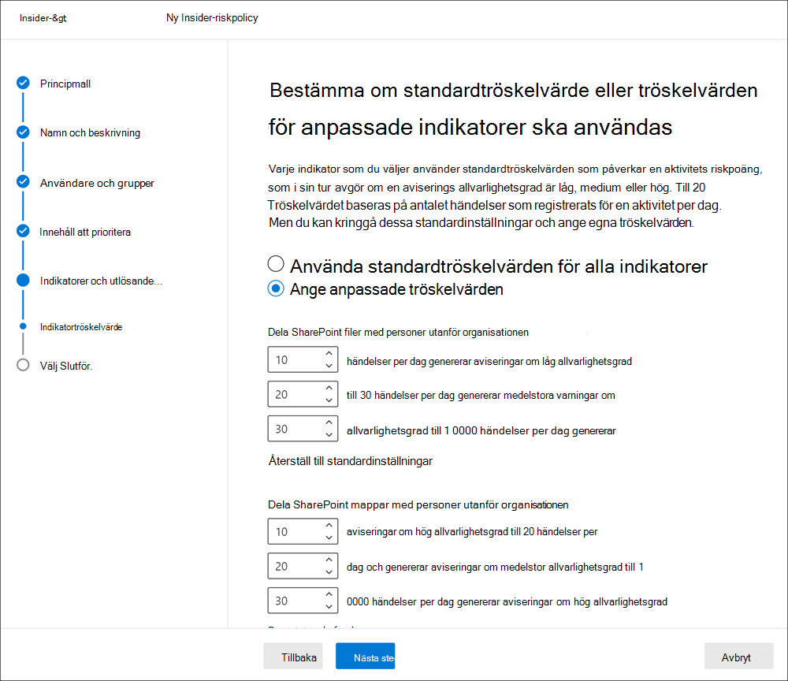

För den första dagliga händelsenivån anger du tröskelvärdet för *10* eller fler händelser per dag för en lägre inverkan på riskpoängen för händelserna, *20* eller fler händelser per dag för en medelstor inverkan på riskresultatet för händelserna, och *30* eller fler händelser per dag som en högre inverkan på riskresultatet för händelserna. De här inställningarna innebär i praktiken:

- Om det finns 1–9 SharePoint händelser som inträffar efter att händelsen utlösts är riskpoäng minimalt påverkade och skulle tenderar att inte generera en avisering.
- Om det finns 10–19 SharePoint händelser som inträffar efter en utlösande händelse är riskresultatet mycket lägre och allvarlighetsnivåer för aviseringar brukar låg.
- Om det finns 20–29 SharePoint händelser som inträffar efter en utlösande utlösare är riskresultatet bättre och allvarlighetsnivåer för aviseringar brukar låg på en medelnivå.
- Om det finns 30 eller fler SharePoint händelser som inträffar efter en utlösande, är riskpoängen det vill säga högre och allvarlighetsnivåer för varningar brukar vara på en hög nivå.

## Policy tidsramar

Med princip tidsramar kan du definiera tidigare och framtida granskningsperioder som utlöses efter principmatchningar baserat på händelser och aktiviteter för mallar för Insider-riskhanteringsprinciper. Beroende på vilken principmall du väljer är följande tidsramar tillgängliga:

- **Aktiveringsfönstret:** Aktiveringsfönstret är tillgängligt  för alla principmallar. Aktiveringsfönstret är det definierade antalet dagar som fönstret aktiveras **efter en** utlösande händelse. Fönstret aktiveras i 1 till 30 dagar efter att en utlösande händelse inträffat för alla användare som tilldelats principen. Du har till exempel konfigurerat en princip för insider-riskhantering och ställt in *aktiveringsfönstret på* 30 dagar. Flera månader har gått sedan du konfigurerade principen och en utlösande händelse inträffar för en av de användare som ingår i principen. Aktiveringshändelsen aktiverar  aktiveringsfönstret och principen är aktiv för den användaren i 30 dagar efter att händelsen utlöstes.
- **Identifiering av tidigare** aktivitet: Tillgänglig  för alla principmallar: Identifiering av tidigare aktivitet är det definierade antalet dagar som fönstret aktiverar **före** en utlösande händelse. Fönstret aktiveras i 0 till 180 dagar innan en utlösande händelse inträffar för alla användare som tilldelats principen. Du har till exempel konfigurerat en princip för insider-riskhantering och ställt in identifiering av *tidigare* aktiviteter på 90 dagar. Flera månader har gått sedan du konfigurerade principen och en utlösande händelse inträffar för en av de användare som ingår i principen. Den utlösande händelsen  aktiverar identifiering av tidigare aktivitet och principen samlar in historiska aktiviteter för den användaren i 90 dagar före den utlösande händelsen.

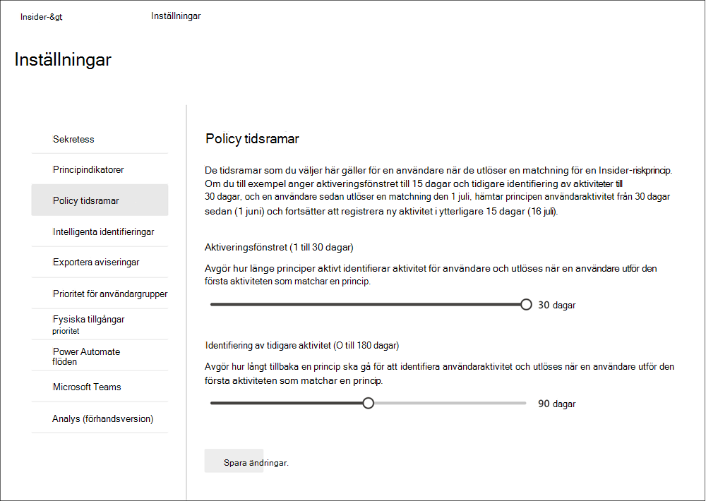

## Intelligenta identifieringar

Med intelligenta identifieringsinställningar kan du förfina hur identifieringar av riskfyllda aktiviteter bearbetas för aviseringar. I vissa fall kan du behöva definiera filtyper som ska ignoreras, eller så vill du tillämpa en identifieringsnivå för filer för att definiera ett minsta fält för aviseringar. Använd de här inställningarna till att styra den övergripande aviseringsvolymen, undantag för filtyper och filvolymbegränsningar.

### Undantag för filtyp

Om du vill utesluta vissa filtyper från matchning för alla Insider-riskhanteringsprinciper anger du filtypstillägg avgränsade med kommatecken. Om du till exempel vill utesluta vissa typer av musikfiler från principmatchningar kan du ange aac,mp3,wav,wma i fältet **Undantag för filtyp.** Filer med de här tilläggen ignoreras av alla Insider-riskhanteringsprinciper.

### Tröskelvärde för ovanlig filaktivitet

Om du vill definiera en minsta filnivå innan aktivitetsaviseringar rapporteras i insiderriskprinciper anger du antalet filer. Du skulle till exempel ange "10" om du inte vill generera varningar för insiderrisker när en användare laddar ned 10 filer eller mindre, även om principerna ser den här aktiviteten som ovanlig.

### Aviseringsvolym

Användaraktiviteter som upptäckts av insider-riskprinciper tilldelas en specifik risknivå, som i sin tur bestämmer aviseringens allvarlighetsgrad (låg, medium, hög). Som standard genererar vi en viss mängd aviseringar om låg, medel och hög allvarlighetsgrad, men du kan öka eller minska volymen efter dina behov. Välj någon av följande inställningar för att justera mängden aviseringar för alla principer för Insider-riskhantering:

- **Färre aviseringar:** Du ser alla aviseringar om hög allvarlighetsgrad, färre medelstora varningar om allvarlighetsgrad och inga mindre allvarlighetsvarningar. Den här inställningsnivån innebär att vissa positiva resultat kan missas.
- **Standardvolym:** Du ser alla varningar om hög allvarlighetsgrad och en balanserad mängd aviseringar om medelhög och låg allvarlighetsgrad.
- **Fler aviseringar:** Du ser alla aviseringar om medelhög och hög allvarlighetsgrad samt de mest låga aviseringarna om allvarlighetsgrad. Den här inställningsnivån kan resultera i mer falska positiva resultat.

### Microsoft Defender för slutpunkt (förhandsversion)

[Microsoft Defender för Endpoint är](/windows/security/threat-protection/microsoft-defender-atp/microsoft-defender-advanced-threat-protection) en säkerhetsplattform för företag som utformats för att hjälpa företagsnätverk att förhindra, upptäcka, undersöka och hantera avancerade hot. Om du vill se säkerhetsöverträdelser bättre i organisationen kan du importera och filtrera Defender för slutpunktsaviseringar för aktiviteter som används i principer som skapats från mallar för säkerhetsöverträdelser för Insider-riskhantering.

Beroende på vilka typer av signaler du är intresserad av kan du välja att importera aviseringar till Insider-riskhantering baserat på statusen Defender för slutpunktsvarning. Du kan definiera en eller flera av följande statusar för aviseringar i de globala inställningarna när du importerar:

- Okänd
- Ny
- Pågående
- Löst

Aviseringar från Defender för Slutpunkt importeras dagligen. Beroende på vilken status du väljer kan du se flera användaraktiviteter för samma avisering som statusen ändras i Defender för Slutpunkt.

Om du till exempel väljer *Ny*  *,* Pågår och Matchad för den här inställningen, importeras en första aviseringsaktivitet för användaren i insider-risk när en Microsoft Defender för slutpunkt-avisering skapas och statusen är Ny. När Defender för slutpunkt-status ändras till *Pågående* importeras en andra aktivitet för den här aviseringen för användaren i Insider-risken. När den slutliga Defender för slutpunktstremning för *Matchad* har ställts in importeras en tredje aktivitet för den här aviseringen för användaren i Insider-risken. Med den här funktionen kan användaren följa förloppet för Defender för slutpunktsaviseringar och välja vilken synlighetsnivå som krävs för undersökningen.

>[!IMPORTANT]
>Du måste ha Microsoft Defender för Slutpunkt konfigurerat i din organisation och aktivera Defender för Slutpunkt för insider-riskhanteringsintegrering i Defender Säkerhetscenter för att importera aviseringar om säkerhetsöverträdelser. Mer information om hur du konfigurerar Defender för Slutpunkt för insider-riskhanteringsintegrering finns i [Konfigurera avancerade funktioner i Defender för slutpunkt.](/windows/security/threat-protection/microsoft-defender-atp/advanced-features\#share-endpoint-alerts-with-microsoft-compliance-center)

### Domäner (förhandsversion)

Domäninställningar hjälper dig att definiera risknivåer för aktiviteter för specifika domäner. De här aktiviteterna omfattar att dela filer, skicka e-postmeddelanden, ladda ned eller ladda upp innehåll. Genom att ange domäner i de här inställningarna kan du öka eller minska riskbedömningen för aktivitet som sker med dessa domäner.

Använd Lägg till domän om du vill definiera en domän för varje domäninställning. Du kan också använda jokertecken för att matcha variationer av rotdomäner eller underdomäner. Om du till exempel vill sales.wingtiptoys.com och support.wingtiptoys.com använder du jokertecknet "*.wingtiptoys.com" för att matcha dessa underdomäner (och alla andra underdomäner på samma nivå). Om du vill ange underdomäner på flera nivåer för en rotdomän måste du markera kryssrutan Inkludera **underdomäner** på flera nivåer.

Du kan ange upp till 500 domäner för var och en av följande domäninställningar:

- **Ej tillåtna domäner:** Genom att ange tillåtna domäner ger aktivitet som sker med dessa domäner *högre* riskpoäng. Några exempel är aktiviteter som innefattar att dela innehåll med någon (t.ex. skicka e-post till någon med en gmail.com-adress) och när användare laddar ned innehåll till en enhet från någon av dessa ej tillåtna domäner.
- **Tillåtna domäner:** Vissa aktiviteter som är relaterade till tillåtna domäner ignoreras av dina principer och genererar inga aviseringar. Dessa aktiviteter omfattar:

    - E-post som skickas till externa domäner
    - Filer, mappar, webbplatser som delas med externa domäner
    - Filer som laddats upp till externa domäner (Microsoft Edge webbläsare)

    Genom att ange tillåtna domäner i inställningar behandlas den här aktiviteten med dessa domäner på samma sätt som intern organisationsaktivitet behandlas. Domäner som läggs här mappas till aktiviteter kan till exempel innebära att du delar innehåll med någon utanför organisationen (till exempel att skicka e-post till någon med en gmail.com adress).

- **Tredjepartsdomäner:** Om din organisation använder tredjepartsdomäner i affärssyfte (t.ex. molnlagring) tar du med dem här så att du kan få aviseringar om aktivitet relaterad till enhetsindikatorn Använd en webbläsare för att ladda ned innehåll från en webbplats från tredje *part.*

## Exportera aviseringar (förhandsversion)

Insider-riskhanteringsvarningsinformation kan exporteras till säkerhetsinformations- och händelsehanteringstjänster (SIEM) via Office 365 API-schema för [hanteringsaktivitet.](/office/office-365-management-api/office-365-management-activity-api-schema#security-and-compliance-alerts-schema) Du kan använda API:Office 365 för hanteringsaktivitet för att exportera aviseringsinformation till andra program som din organisation kan använda för att hantera eller sammanställa insiderriskinformation.

Så här använder du API:erna för att granska information om insiderriskvarningar:

1. Aktivera Office 365 STÖD för API för hanteringsaktivitet **i Insider riskhantering**  >  **Inställningar**  >  **Exportera aviseringar.** Som standard är den här inställningen inaktiverad för Microsoft 365 organisation.
2. Filtrera de Office 365 aktiviteterna efter *SecurityComplianceAlerts*.
3. Filtrera *SecurityComplianceAlerts* efter *kategorin InsiderRiskManagement.*

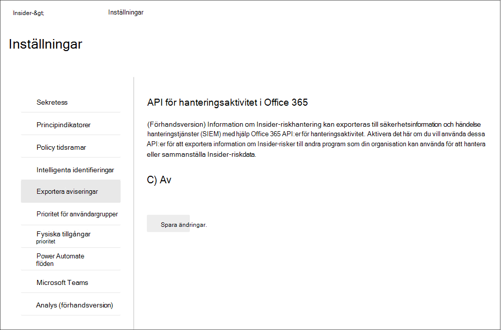

Aviseringsinformation innehåller information från schemat för säkerhets- och efterlevnadsvarningar och det vanliga Office 365 för hanteringsaktivitet.

Följande fält och värden exporteras för varningar för Insider-riskhantering för & aviseringsschema för säkerhet och efterlevnad:

| **Aviseringsparameter** | **Beskrivning** |
|:------------------|:----------------|
| AlertType | Typ av avisering är *Anpassad*.  |
| AlertId | GUID för aviseringen. Varningar för Insider-riskhantering kan inte stängas av. När aviseringsstatusen ändras skapas en ny logg med samma Aviserings-ID. Detta AlertID kan användas för att korrelera uppdateringar för en avisering. |
| Kategori | Kategorin för aviseringen är *InsiderRiskManagement.* Den här kategorin kan användas för att skilja från dessa varningar från andra varningar om & efterlevnad. |
| Kommentarer | Standardkommentarer för aviseringen. Värden är *ny avisering* (loggas när en avisering skapas) och *Aviseringen* har uppdaterats (loggas när det finns en uppdatering av en avisering). Använd AlertID för att korrelera uppdateringar för en avisering. |
| Data | Informationen för aviseringen omfattar unikt användar-ID, huvudnamn och datum och tid (UTC) när användaren utlöstes till en princip. |
| Namn | Principnamn för insider-riskhanteringsprincip som genererade aviseringen. |
| PolicyId | GUID för insider-riskhanteringsprincipen som utlöste aviseringen. |
| Allvarlighetsgrad | Varningens allvarlighetsgrad. Värdena är *Hög,* *Medel* eller *Låg.* |
| Source | Källan för aviseringen. Värdet är *Office 365 säkerhet & efterlevnad.* |
| Status | Status för aviseringen. Värden är *aktiva* *(behovsgranskning* i insider-risk),  undersöker *(bekräftad* i insider-risk),  löst *(löst* i insider-risk), *Avvisad* *(avvisad* i insider-risk). |
| Version | Versionen av aviseringsschemat för säkerhet och efterlevnad. |

Följande fält och värden exporteras för varningar för insiderriskhantering för det vanliga [Office 365 för hanteringsaktivitet.](/office/office-365-management-api/office-365-management-activity-api-schema#common-schema)

- UserId
- ID
- RecordType
- CreationTime
- Åtgärd
- OrganizationId
- UserType
- UserKey

## Prioritet för användargrupper (förhandsversion)

Användare i organisationen kan ha olika nivåer av risker beroende på deras position, åtkomstnivå till känslig information eller riskhistorik. Genom att prioritera granskningar och poängsättning av aktiviteterna för dessa användare kan du uppmärksamma på potentiella risker som kan få högre konsekvenser för organisationen. Prioriterade användargrupper i Insider-riskhantering bidrar till att definiera de användare i organisationen som behöver närmare kontroll och mer känslig riskbedömning. Tillsammans med  brott mot säkerhetsprinciper efter prioritetsanvändare och Data läcker efter prioritetsanvändarprincipmallar, har användare som lagts till i en prioritetsgrupp en högre sannolikhet för varningar för Insider-risker och varningar med högre allvarlighetsnivåer. 

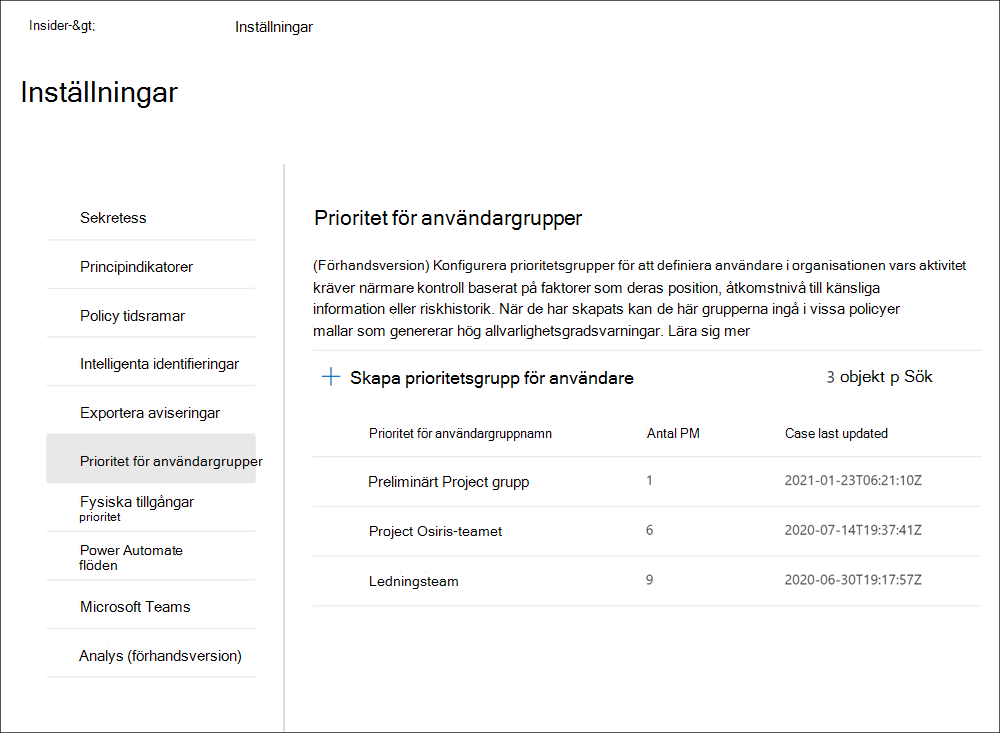

Du behöver till exempel skydda mot dataläckor för ett mycket konfidentiellt projekt där användare har tillgång till känslig information. Du väljer att skapa *en grupp Project* *användare* som är prioriterade för användare i organisationen som arbetar med projektet. Med principguiden och *Data läcker* efter principmall för prioritetsanvändare skapar du en ny princip och tilldelar principen *Project* användare prioriterad grupp för användare. Aktiviteter som respekteras av principen för medlemmar i användargruppen För konfidentiella *Project* Användare är mer känsliga för risker och aktiviteter från dessa användare genererar mer sannolikt en avisering och aviseringar med högre allvarlighetsnivåer.

### Skapa en prioritetsgrupp för användare

Om du vill skapa en ny prioritetsgrupp använder du kontroller i **Insider-riskhanteringslösningen** i Microsoft 365 efterlevnadscenter. Om du vill skapa en prioritetsgrupp för användare måste du vara medlem i rollgruppen *för Insider-riskhantering* eller Insider-riskhanteringsadministratör. 

Skapa en prioritetsgrupp genom att följa anvisningarna nedan:

1. Gå [till Microsoft 365 Insider-riskhantering](https://compliance.microsoft.com) **i kompatibilitetscentret** och välj **Inställningar för Insider-risker.**
2. Välj fliken **Prioritet för användargrupper**
3. På fliken **Prioritet för användargrupper** väljer du **Skapa prioritet för användargrupp för** att starta guiden skapa grupp.
4. Fyll **i följande fält** på sidan Definiera grupp:
    - **Namn (obligatoriskt)**: Ange ett eget namn för den prioriterade användargruppen. Du kan inte ändra namnet på prioritetsgruppen när du har slutfört guiden.
    - **Beskrivning (valfritt)**: Ange en beskrivning för prioritetsgruppen för användargruppen.
5. Välj **Nästa för** att fortsätta.
6. På sidan **Välj** medlemmar  väljer du Välj medlemmar för att söka och välja vilka  e-postaktiverade användarkonton som ska ingå i gruppen, eller markera kryssrutan Markera alla om du vill lägga till alla användare i organisationen i gruppen. Välj **Lägg till** för att fortsätta eller **Avbryt** om du vill stänga utan att lägga till några användare i gruppen.
7. Välj **Nästa för** att fortsätta.
8. På sidan **Granska** granskar du de inställningar som du har valt för prioritetsgruppen. Välj **Redigera** om du vill ändra något av gruppvärdena eller **välj Skicka** för att skapa och aktivera prioritetsanvändargruppen.
9. På bekräftelsesidan väljer du **Klar för** att avsluta guiden.

### Uppdatera en prioritetsgrupp för användare

Om du vill uppdatera en befintlig prioritetsgrupp använder du inställningar för kontroller i **Insider-riskhanteringslösningen** i Microsoft 365 kompatibilitetscenter. Om du vill uppdatera en prioriterad användargrupp måste du vara medlem i rollgruppen för *Insider-riskhantering* eller *Insider-riskhanteringsadministratör.*

Så här redigerar du en prioritetsgrupp:

1. Gå [till Microsoft 365 Insider-riskhantering](https://compliance.microsoft.com) **i kompatibilitetscentret** och välj **Inställningar för Insider-risker.**
2. Välj fliken **Prioritet för användargrupper**
3. Markera den prioritetsgrupp du vill redigera och välj **Redigera grupp.**
4. Uppdatera fältet **Beskrivning på** sidan Definiera grupp om det behövs. Du kan inte uppdatera namnet på prioritetsgruppen. Välj **Nästa för** att fortsätta.
5. På sidan **Välj medlemmar** lägger du till nya medlemmar i gruppen med hjälp av **kontrollen Välj** medlemmar. Om du vill ta bort en användare från gruppen väljer du X bredvid den användare du vill ta bort. Välj **Nästa för** att fortsätta.
6. Granska de **uppdateringsinställningar** du har valt för prioritetsgruppen på sidan Granska. Välj **Redigera** om du vill ändra något av gruppvärdena eller välj **Skicka** för att uppdatera prioritetsgruppen för användare.
7. På bekräftelsesidan väljer du **Klar för** att avsluta guiden.

### Ta bort en prioritetsgrupp

Om du vill ta bort en befintlig prioritetsgrupp använder du inställningar för kontroller i **Insider-riskhanteringslösningen** i Microsoft 365 efterlevnadscenter. Om du vill ta bort en prioritetsgrupp för användare måste du vara medlem i rollgruppen för *Insider-riskhantering* eller *Insider-riskhanteringsadministratör.*

>[!IMPORTANT]
>Om du tar bort en prioritetsanvändargrupp tas den bort från alla aktiva principen som den är tilldelad till. Om du tar bort en användargrupp med prioritet som tilldelats en aktiv princip innehåller principen inte några användare inom omfattningen och kommer därför inte att vara inaktiv, och inga aviseringar skapas.

Så här tar du bort en prioritetsgrupp:

1. Gå [till Microsoft 365 Insider-riskhantering](https://compliance.microsoft.com) **i kompatibilitetscentret** och välj **Inställningar för Insider-risker.**
2. Välj fliken **Prioritet för användargrupper**
3. Markera den prioritetsgrupp du vill redigera och välj Ta **bort på** instrumentpanelens meny.
4. I dialogrutan **Ta bort** väljer du Ja **för att** ta bort prioritetsgruppen eller Avbryt **för** att återgå till instrumentpanelen.

## Fysiska tillgångar prioritet (förhandsversion)

Att identifiera åtkomst till prioriterade fysiska tillgångar och korrelera åtkomstaktivitet till användarhändelser är en viktig del av kompatibilitetsinfrastrukturen. Dessa fysiska tillgångar representerar prioritetsplatser i organisationen, till exempel företagets byggnader, datacenter eller serverrum. Insider-riskaktiviteter kan associeras med användare som arbetar ovanliga timmar, försöker komma åt dessa obehöriga känsliga eller säkra områden och förfrågningar om åtkomst till högnivåområden utan legitima behov.

Med prioriterad fysisk tillgång aktiverad och den konfigurerade fysiska anslutningen för [datadata](import-physical-badging-data.md) integrerar Insider-riskhantering signaler från din fysiska kontroll och åtkomstsystem med andra användarriskaktiviteter. Genom att granska beteendemönster i fysiska åtkomstsystem och korrelera dessa aktiviteter med andra insiderriskhändelser kan insider-riskhantering hjälpa efterlevnadsanalytiker och analytiker att fatta mer välgrundade svarsbeslut för aviseringar. Åtkomst till prioriterade fysiska tillgångar poängs och identifieras i insikter på ett annat sätt än åtkomst till tillgångar som inte har prioritet.

Din organisation har till exempel ett dåligt system för användare som övervakar och godkänner fysisk åtkomst till normala arbets- och känsliga projektområden. Det finns flera användare som arbetar med ett känsligt projekt och dessa användare kommer att återgå till andra områden i organisationen när projektet har slutförts. När det känsliga projektet närmar sig slutförande bör du se till att projektarbetet förblir konfidentiellt och att åtkomsten till projektområdena är strikt kontrollerad.

Du väljer att aktivera datakopplingen Fysiska badging i Microsoft 365 för att importera åtkomstinformation från ditt fysiska badging-system och ange prioriterade fysiska tillgångar i Insider-riskhantering. Genom att importera information från ditt badgingsystem och korrelera fysisk åtkomstinformation med andra riskaktiviteter som identifieras i Insider-riskhantering märker du att en av användarna i projektet öppnar projektkontoren efter normal arbetstid och även exporterar stora mängder data till en personlig molnlagringstjänst från sina normala arbetstider. Den här fysiska åtkomstaktiviteten som är kopplad till onlineaktiviteten kan peka på möjliga datastölder och efterlevnadsanalytiker kan vidta lämpliga åtgärder enligt omständigheterna för den här användaren.

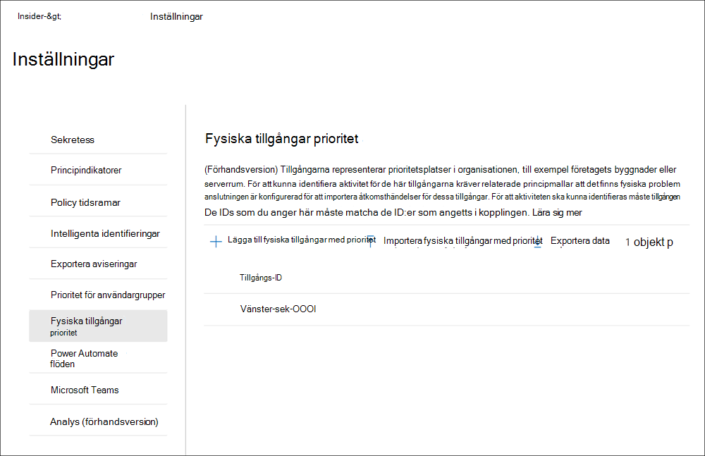

### Konfigurera fysiska tillgångar med prioritet

Om du vill konfigurera fysiska tillgångar för prioritet konfigurerar du kopplingen  för fysisk aktivitet och använder inställningskontroller i Insider-riskhanteringslösningen i Microsoft 365 kompatibilitetscenter. För att konfigurera fysiska tillgångar för prioritet måste du vara medlem i rollgruppen *för Insider-riskhantering* eller *Insider-riskhanteringsadministratör.*

Så här konfigurerar du fysiska tillgångar med prioritet:

1. Följ konfigurationsstegen för Insider-riskhantering i [artikeln Komma igång med Insider-riskhantering.](insider-risk-management-configure.md) I steg 3 kontrollerar du att du konfigurerar kopplingen Fysiskt dåligt.

    >[!IMPORTANT]
    >För att insider-riskhanteringsprinciper ska använda och korrelera signaldata relaterade till avgående och uppsagda användare med händelsedata från din fysiska kontroll och åtkomstplattformar måste du också konfigurera Microsoft 365 HR-anslutningen. Om du aktiverar anslutningen för fysisk aktivitet utan att Microsoft 365 HR-anslutningen bearbetas bara händelser för fysiska åtkomstaktiviteter för användare i organisationen.

2. I [kompatibilitetscentret för Microsoft 365 går](https://compliance.microsoft.com)du till **Insider-riskhantering och** väljer Inställningar för **Insider-risker**  >  **Prioritet för fysiska tillgångar.**
3. På  sidan Prioriterade fysiska tillgångar kan du antingen manuellt lägga till de fysiska tillgångs-ID:n som du vill övervaka för de tillgångshändelser som importerats av anslutningen För fysiska tillgångar eller importera en .csv-fil med alla fysiska tillgångs-ID:n som importerats av den fysiska badgingkopplingen: a) Om du vill lägga till id:n för fysiska tillgångar manuellt väljer du Lägg till prioriterade fysiska tillgångar **,** anger ett fysiskt tillgångs-ID och väljer sedan Lägg till **.** Ange andra fysiska tillgångs-ID och välj sedan **Lägg till fysiska tillgångar** prioritet för att spara alla tillgångar som angetts.
    b) Om du vill lägga till en lista över fysiska tillgångs-ID .csv en fil väljer **du Importera fysiska tillgångar med prioritet.** I dialogrutan utforskaren väljer du den .csv du vill importera och väljer sedan **Öppna**. De fysiska tillgångs-ID:na från .csv läggs till i listan.
4. Gå till fliken **Principindikatorer** i Inställningar.
5. På sidan **Principindikatorer** går  du till avsnittet Fysiska åtkomstindikatorer och markerar kryssrutan för fysisk åtkomst efter att åtkomsten till känsliga tillgångar har avslutats eller **misslyckats.**
6. Välj **Spara för** att konfigurera och avsluta.

### Ta bort en prioriterad fysisk tillgång

Om du vill ta bort en befintlig prioriterad fysisk tillgång använder du inställningar för kontroller i Insider-riskhanteringslösningen i Microsoft 365 efterlevnadscenter. Om du vill ta bort en prioriterad fysisk tillgång måste du vara medlem i rollgruppen för Insider-riskhantering eller Insider-riskhanteringsadministratör.

>[!IMPORTANT]
>Om du tar bort en prioriterad fysisk tillgång tas den bort från undersökning med hjälp av alla aktiva policyer som de tidigare inkluderades i. Varningar som genereras av aktiviteter som är associerade med den prioriterade fysiska tillgången tas inte bort.

Så här tar du bort en prioriterad fysisk tillgång:

1. I [kompatibilitetscentret för Microsoft 365 går](https://compliance.microsoft.com)du till **Insider-riskhantering och** väljer Inställningar för **Insider-risker**  >  **Prioritet för fysiska tillgångar.**
2. På sidan **Prioriterade fysiska tillgångar** väljer du den tillgång som du vill ta bort.
3. Välj **Ta** bort på åtgärdsmenyn för att ta bort tillgången.

## Power Automate flöden (förhandsversion)

[Microsoft Power Automate är](/power-automate/getting-started) en arbetsflödestjänst som automatiserar åtgärder mellan program och tjänster. Genom att använda flöden från mallar eller skapat manuellt kan du automatisera vanliga uppgifter som är kopplade till dessa program och tjänster. När du aktiverar Power Automate flöden för insider-riskhantering kan du automatisera viktiga uppgifter för fall och användare. Du kan konfigurera Power Automate-flöden för att hämta användar-, aviserings- och ärendeinformation och dela den här informationen med intressenter och andra program, samt automatisera åtgärder i Insider-riskhantering, till exempel publicera till ärendeanteckningar. Power Automate flöden är tillämpliga för ärenden och alla användare som omfattas av en princip.

Kunder med Microsoft 365 prenumerationer som innehåller Insider-riskhantering behöver inte ytterligare Power Automate licenser för att använda de rekommenderade Power Automate för Insider-Power Automate. De här mallarna kan anpassas för att stödja din organisation och täcka grundläggande insider-riskhanteringsscenarier. Om du väljer att använda Premium Power Automate-funktionerna i dessa mallar kan du skapa en anpassad mall med hjälp av Microsoft 365-efterlevnadskopplingen eller använda Power Automate-mallar för andra efterlevnadsområden i Microsoft 365, men du kan behöva fler Power Automate-licenser.

Följande mallar Power Automate för att stödja process automation för användare av Insider-riskhantering och -ärenden:

- Meddela användarna när de läggs till i en **Insider-riskprincip:** Den här mallen är för organisationer som har interna principer, sekretess- eller regelkrav som användarna måste meddelas när de omfattas av insider-riskhanteringsprinciper. När det här flödet konfigureras och väljs för en användare på sidan användare skickas ett e-postmeddelande till användare och deras chefer när användaren läggs till i en princip för insider-riskhantering. Den här mallen stöder även uppdatering av en SharePoint-lista som ligger på en SharePoint-webbplats för att hjälpa till att spåra meddelandeinformation som datum/tid och mottagaren av meddelandet. Om du har valt att anonymisera användare i sekretessinställningarna **kommer** flöden som skapas från den här mallen inte att fungera som tänkta så att användarsekretessen bibehålls. Power Automate som använder den här mallen finns på **instrumentpanelen Användare.**
- Begära information från HR eller företag om en användare i ett **insider-riskfall:** När vi agerar på ett ärende kan insider-riskanalytiker och intressenter behöva rådgöra med HR eller andra intressenter för att förstå sammanhanget för ärendeaktiviteterna. När det här flödet är konfigurerat och valt för ett ärende skickar analytiker och intressenter ett e-postmeddelande till HR- och företags intressenter som konfigurerats för det här flödet. Varje mottagare får ett meddelande med förkonfigurerade eller anpassningsbara svarsalternativ. När mottagare väljer ett svarsalternativ registreras svaret som en ärendeanteckning och innehåller information om mottagaren samt datum/tid. Om du har valt att anonymisera användare i sekretessinställningarna **kommer** flöden som skapas från den här mallen inte att fungera som tänkta så att användarsekretessen bibehålls. Power Automate som använder den här mallen finns på **instrumentpanelen Ärenden.**
- **Meddela chefen när en användare har en insider-riskvarning**: Vissa organisationer kan behöva få en omedelbar avisering om hantering när en användare har en insider-riskhanteringsvarning. När det här flödet är konfigurerat och markerat skickas ett e-postmeddelande från chefen för ärendet med följande information om alla ärendeaviseringar:
    - Tillämplig princip för aviseringen
    - Datum/tid för aviseringen
    - Aviseringens allvarlighetsnivå

    Flödet uppdaterar automatiskt de ärendeanteckningar som meddelandet skickades och att flödet har aktiverats. Om du har valt att anonymisera användare i sekretessinställningarna **kommer** flöden som skapas från den här mallen inte att fungera som tänkta så att användarsekretessen bibehålls. Power Automate som använder den här mallen finns på **instrumentpanelen Ärenden.**
- **Skapa en post för insider-riskfall i ServiceNow**: Den här mallen är för organisationer som vill använda sin ServiceNow-lösning för att spåra insider-riskhanteringsärenden.  I ett fall kan insider-riskanalytiker och -analytiker skapa en post för ärendet i ServiceNow. Du kan anpassa den här mallen så att den fyller i valda fält i ServiceNow baserat på organisationens behov. Power Automate som använder den här mallen finns på **instrumentpanelen Ärenden.** Mer information om tillgängliga ServiceNow-fält finns i [referensartikeln ServiceNow Connector.](/connectors/service-now/)

### Skapa ett Power Automate flöde från mallen för Insider-riskhantering

Om du vill skapa ett Power Automate-flöde från en rekommenderad insider-riskhanteringsmall använder du inställningskontrollerna i **Insider-riskhanteringslösningen** i **efterlevnadscentret** för Microsoft 365 eller  alternativet Hantera **Power Automate-flöden** från **Automate-kontrollen** när du arbetar direkt i instrumentpanelerna Ärenden eller Användare.

Om du vill Power Automate ett arbetsflöde i inställningsområdet måste du vara medlem i rollgruppen *för Insider-riskhantering* eller Insider-riskhanteringsadministratör.  Om du vill Power Automate ett arbetsflöde med **alternativet Hantera Power Automate-flöden** måste du vara medlem i minst en rollgrupp för Insider-riskhantering.

Utför följande steg för att skapa en Power Automate flöde från en rekommenderad mall för insider-riskhantering:

1. Gå till [Microsoft 365 För Insider-riskhantering](https://compliance.microsoft.com/) **i säkerhets- och** efterlevnadscentret och välj Inställningar för **Insider-Power Automate**  >  **flöden.** Du kan också komma åt sidorna **för Ärenden** **eller Användare genom** att välja **Automatisera** Hantera  >  **Power Automate flöden.**
2. På sidan **Power Automate flöden** väljer du en rekommenderad mall från **mallarna** för Insider-riskhantering som du kanske gillar i avsnittet på sidan.
3. Flödet visar de inbäddade anslutningar som behövs för flödet och ser om anslutningsstatus är tillgänglig. Om det behövs uppdaterar du alla anslutningar som inte visas som tillgängliga. Välj **Fortsätt.**
4. Som standard är de rekommenderade flödena förkonfigurerade med den rekommenderade insider-riskhanteringen och Microsoft 365 tjänstdatafält som krävs för att slutföra den tilldelade aktiviteten för flödet. Om det behövs kan du anpassa flödeskomponenterna med hjälp av **kontrollen Visa avancerade** alternativ och konfigurera de tillgängliga egenskaperna för flödeskomponenten.
5. Om det behövs kan du lägga till andra steg i flödet genom att välja **knappen Nytt** steg. I de flesta fall behövs inte det här för de rekommenderade standardmallarna.
6. Välj **Spara utkast** för att spara flödet för ytterligare konfiguration eller **välj** Spara för att slutföra konfigurationen av flödet.
7. Välj **Stäng** för att återgå **till Power Automate flödessidan.** Den nya mallen visas som ett  flöde på flikarna Mina flöden och är automatiskt tillgänglig från listrutan **Automate** när de arbetar med ärenden inom Insider-riskhantering för användaren som skapar flödet.

>[!IMPORTANT]
>Om andra användare i organisationen behöver åtkomst till flödet måste flödet delas.

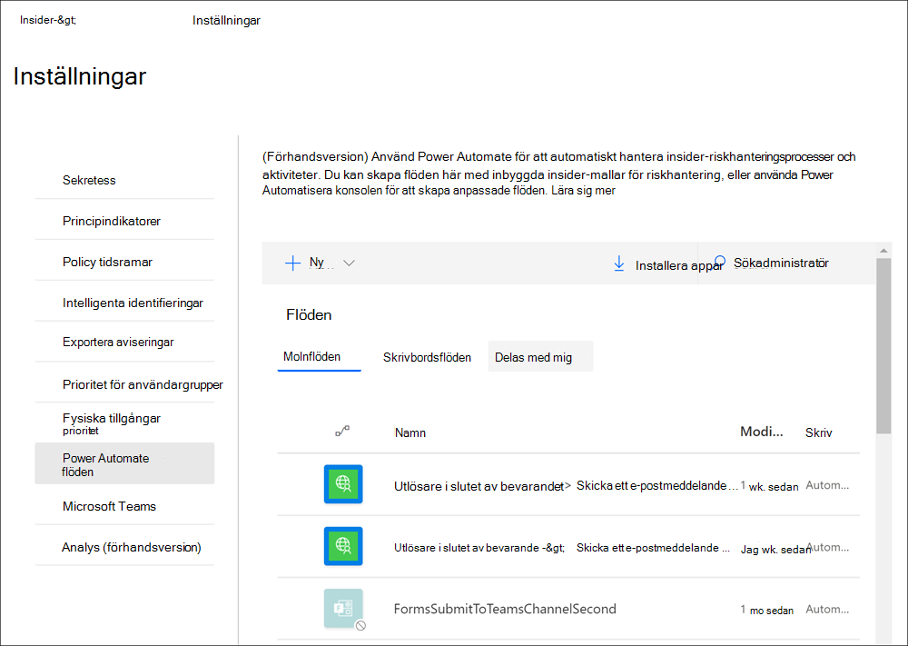

### Skapa ett anpassat Power Automate för Insider-riskhantering

Vissa processer och arbetsflöden för din organisation kanske ligger utanför de rekommenderade mallarna för insider-riskhantering, och du kanske behöver skapa anpassade Power Automate-flöden för Insider-riskhanteringsområden. Power Automate är flexibla och har stöd för omfattande anpassning, men det finns åtgärder som måste vidtas för att integrera med insider-riskhanteringsfunktioner.

Gör följande för att skapa en egen Power Automate för Insider-riskhantering:

1. **Kontrollera din Power Automate** flödeslicens: Om du vill skapa anpassade Power Automate flöden som använder insider-riskhanteringsutlösare behöver du en Power Automate licens. De rekommenderade mallarna för Insider-riskhantering kräver inte extra licensiering och ingår som en del av din insider-riskhanteringslicens.
2. **Skapa ett automatiserat** flöde: Skapa ett flöde som utför en eller flera uppgifter efter att det utlöses av en insider-riskhanteringshändelse. Mer information om hur du skapar ett automatiserat flöde finns [i Skapa ett flöde i Power Automate](/power-automate/get-started-logic-flow).
3. **Välj den Microsoft 365 för efterlevnad:** Sök efter och välj den Microsoft 365 efterlevnadskopplingen. Med den här anslutningen kan Insider-riskhantering utlösare och åtgärder. Mer information om kopplingar finns i artikeln [referensöversikt för](/connectors/connector-reference/) kopplingar.
4. **Välj insider-riskhanteringsutlösare för ditt flöde:** Insider-riskhantering har två utlösare för anpassade Power Automate flöden:
    - **För ett valt insider-riskhanteringsfall**: Flöden med den här utlösaren kan väljas från sidan Ärenden i instrumentpanel för insiderriskhantering.
    - **För en vald insider-riskhanteringsanvändare**: Flöden med den här utlösaren kan väljas från sidan För användare instrumentpanelen för insiderriskhantering.
5. Välj insider-riskhanteringsåtgärder för ditt flöde: Du kan välja bland flera åtgärder för insider-riskhantering som ska ingå i ditt anpassade flöde:
    - Få en insider-riskhanteringsvarning
    - Få insider-riskhanteringsfall
    - Få insider-riskhanteringsanvändare
    - Få varningar om insider-riskhantering för ett ärende
    - Lägg till information om insider-riskhantering

### Dela ett Power Automate flöde

Som standard är Power Automate som skapats av en användare bara tillgängliga för den användaren. För att andra insider-riskhanteringsanvändare ska ha åtkomst till och använda ett flöde måste flödet delas av den som skapat flödet. Om du vill dela ett flöde använder du inställningskontrollerna i **Insider-riskhanteringslösningen** i efterlevnadscentret för Microsoft 365 eller alternativet Hantera  Power Automate-flöden från Automate-kontrollen när du arbetar direkt på sidorna för instrumentpanelen För ärenden eller **Användare.**  När du har delat ett flöde kan alla som det har delats med  komma åt flödet i listrutan **Automate-kontroll** i instrumentpanelen för ärende och **användare.**

Om du vill Power Automate ett arbetsflöde i inställningsområdet måste du vara medlem i rollgruppen *för Insider-riskhantering* eller Insider-riskhanteringsadministratör.  Om du vill Power Automate ett arbetsflöde med **alternativet Hantera Power Automate-flöden** måste du vara medlem i minst en rollgrupp för Insider-riskhantering.

Gör följande för att dela ett Power Automate flöde:

1. Gå till [Microsoft 365 För Insider-riskhantering](htttps://compliance.microsoft.com) **i säkerhets- och** efterlevnadscentret och välj Inställningar för **Insider-Power Automate**  >  **flöden.** Du kan också komma åt sidorna **för Ärenden** **eller Användare genom** att välja **Automatisera** Hantera  >  **Power Automate flöden.**
2. På sidan **Power Automate flöden** väljer du **fliken Mina flöden** **eller Teamflöden.**
3. Välj flödet du vill dela och välj sedan **Dela** på menyn flödesalternativ.
4. På sidan flödesdelning anger du namnet på den användare eller grupp du vill lägga till som ägare av flödet.
5. I dialogrutan **Anslutning som används** väljer du OK **för** att bekräfta att den tillagda användaren eller gruppen har fullständig åtkomst till flödet.

### Redigera Power Automate flöde

Om du vill redigera ett flöde använder du inställningskontrollerna i **Insider-riskhanteringslösningen** i **efterlevnadscentret** för Microsoft 365 eller alternativet hantera  **Power Automate-flöden** från **automatkontrollen** när du arbetar direkt i instrumentpanelen för ärenden eller användare.

Om du Power Automate ett arbetsflöde i inställningsområdet måste du vara medlem i rollgruppen *för Insider-riskhantering* eller Insider-riskhanteringsadministratör.  Om du vill Power Automate ett arbetsflöde med **alternativet Hantera Power Automate-flöden** måste du vara medlem i minst en rollgrupp för Insider-riskhantering.

Gör följande för att redigera ett Power Automate flöde:

1. Gå till [Microsoft 365 För Insider-riskhantering](htttps://compliance.microsoft.com) **i säkerhets- och** efterlevnadscentret och välj Inställningar för **Insider-Power Automate**  >  **flöden.** Du kan också komma åt sidorna **för Ärenden** **eller Användare genom** att välja **Automatisera** Hantera  >  **Power Automate flöden.**
2. På sidan **Power Automate flöde väljer** du ett flöde för att redigera och väljer **Redigera** på flödeskontrollmenyn.
3. Markera **ellipsen för**  >  **Inställningar** ändra en flödeskomponentinställning eller **ellips Ta** bort för att ta bort en  >   flödeskomponent.
4. Välj **Spara** och sedan **Stäng för** att slutföra redigeringen av flödet.

### Ta bort ett Power Automate flöde

Om du vill ta bort ett flöde använder du inställningskontrollerna i **Insider-riskhanteringslösningen** i **efterlevnadscentret** för Microsoft 365 eller alternativet  för att hantera **Power Automate-flöden** från **automatkontrollen** när du arbetar direkt i instrumentpanelen för ärenden eller användare. När ett flöde tas bort tas det bort som ett alternativ för alla användare.

Om du vill Power Automate ett arbetsflöde i inställningsområdet måste du vara medlem i rollgruppen *för Insider-riskhantering* eller Insider-riskhanteringsadministratör.  Om du vill Power Automate ett arbetsflöde med **alternativet Hantera Power Automate-flöden** måste du vara medlem i minst en rollgrupp för Insider-riskhantering.

Gör följande för att ta bort ett Power Automate flöde:

1. Gå till [Microsoft 365 För Insider-riskhantering](htttps://compliance.microsoft.com) **i säkerhets- och** efterlevnadscentret och välj Inställningar för **Insider-Power Automate**  >  **flöden.** Du kan också komma åt sidorna **för Ärenden** **eller Användare genom** att välja **Automatisera** Hantera  >  **Power Automate flöden.**
2. På sidan **Power Automate flöde väljer** du ett flöde för att ta bort och väljer Ta **bort** på flödeskontrollmenyn.
3. I bekräftelsedialogrutan för borttagning väljer du **Ta bort för** att ta bort flödet eller så väljer du **Avbryt** för att avsluta borttagningsåtgärden.

## Microsoft Teams (förhandsvisning)

Efterlevnadsanalytiker och efterlevnadsanalytiker kan enkelt Microsoft Teams för samarbete i insider-riskhanteringsärenden. De kan samordna och kommunicera med andra intressenter i Microsoft Teams att:

- Samordna och granska svarsaktiviteter för fall i privata Teams kanaler
- Dela och lagra filer och bevis som är relaterade till enskilda ärenden på ett säkert sätt
- Spåra och granska svarsaktiviteter av analytiker och analytiker

När Microsoft Teams aktiverats för insider-riskhantering skapas en dedikerad Microsoft Teams grupp varje gång en avisering bekräftas och ett ärende skapas. Som standard innehåller teamet automatiskt alla medlemmar i rollgrupperna *Insider-riskhantering*, Insider-riskhanteringsanalytiker och  *insiderriskhanteringsmedlemmar* (upp till 100 initiala användare). Ytterligare organisationsdeltagare kan läggas till i gruppen när det har skapats och efter behov. För befintliga ärenden som skapats innan Microsoft Teams kan analytiker och ärenden välja att skapa ett nytt Microsoft Teams team när de arbetar i ett fall om det behövs.  När du har åtgärdat det associerade ärendet i Insider-riskhantering arkiveras teamet automatiskt (flyttas till dolt och skrivskyddat).

Mer information om hur du använder team och kanaler i Microsoft Teams finns i [Översikt över team och kanaler i Microsoft Teams.](/MicrosoftTeams/teams-channels-overview)

Det går snabbt Microsoft Teams att aktivera support för ärenden. Så här Microsoft Teams du aktivera Microsoft Teams för insider-riskhantering:

1. I Microsoft 365 [kompatibilitetscenter](htttps://compliance.microsoft.com)går du till **Insider-riskhanteringsinställningar**  >  **för Insider- risk.**
2. Markera **Microsoft Teams** fliken.
3. Aktivera Microsoft Teams för insider-riskhantering.
4. Välj **Spara för** att konfigurera och avsluta.

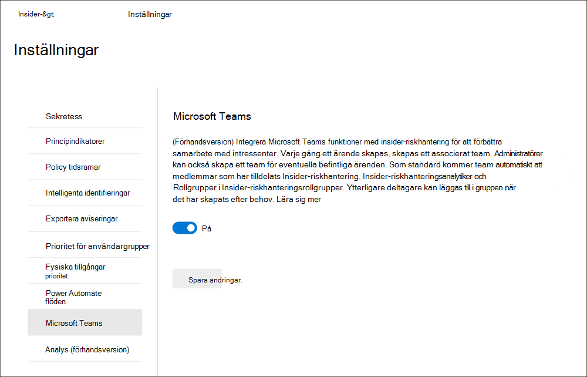

### Skapa ett Microsoft Teams för befintliga ärenden

Om du aktiverar Microsoft Teams för Insider-riskhantering när du har befintliga ärenden, måste du manuellt skapa en grupp för varje ärende efter behov. När du har Microsoft Teams stöd i insider-riskhanteringsinställningar skapas automatiskt en ny Microsoft Teams med nya ärenden.

Användarna behöver behörighet för att skapa Microsoft 365 grupper i organisationen för att skapa Microsoft Teams grupp från ett ärende. Mer information om hur du hanterar behörigheter Microsoft 365 grupper finns i [Hantera vem som kan skapa Microsoft 365 grupper.](../solutions/manage-creation-of-groups.md)

Om du vill skapa en grupp för ett ärende använder du kontrollen Skapa Microsoft Team när du arbetar direkt i ett befintligt ärende. Så här skapar du ett nytt team:

1. I Microsoft 365 [kompatibilitetscenter](htttps://compliance.microsoft.com)går du till **Insider-riskhanteringsärenden**  >   och väljer ett befintligt ärende.
2. På ärendeåtgärdsmenyn väljer du **Skapa Microsoft Team**.
3. Ange ett **namn på** det nya teamet Microsoft Teams team i fältet Teamnamn.
4. Välj **Skapa Microsoft-team** och välj sedan **Stäng**.

Beroende på antalet användare som tilldelats rollgrupperna för Insider-riskhantering kan det ta 15 minuter innan alla analytiker och analytiker läggs till i Microsoft Teams för ett ärende.

## Analys (förhandsversion)

Med Insider-riskanalyser kan du göra en utvärdering av potentiella Insider-risker i organisationen utan att konfigurera insiderriskprinciper. Den här utvärderingen kan hjälpa din organisation att identifiera potentiella områden med högre användarrisker och hjälpa till att fastställa typ och omfattning för principer för Insider-riskhantering som du kan överväga att konfigurera. Analyser ger följande fördelar för din organisation:

- Enkel att konfigurera: Om du vill komma igång med analyser kan du välja Kör genomsökning när du uppmanas att göra det enligt rekommendationen för analys eller gå till Insider-riskinställningar > på fliken Analys och aktivera analyser.
- Minimala sekretesskrav: Genomsökningsresultat och insikter returneras som anonymiserad användaraktivitet. Enskilda användarnamn kan inte identifieras av granskarna.
- Förstå potentiella risker genom konsoliderade insikter: Med genomsökningsresultat kan du snabbt identifiera potentiella riskområden för användarna och vilken princip som är bäst för att minimera dessa risker.

Titta på videon [om Insider Risk Management Analytics](https://www.youtube.com/watch?v=5c0P5MCXNXk) för att få hjälp med att förstå hur analyser kan hjälpa dig att identifiera potentiella insiderrisker och hjälpa dig att snabbt vidta åtgärder.

Analyser söker efter riskaktivitetshändelser från flera källor för att identifiera insikter om potentiella riskområden. Beroende på din aktuella konfiguration söker analyser efter kvalificerande riskaktiviteter i följande områden:

- **Microsoft 365 i** granskningsloggar : Ingår i alla genomsökningar, är det här den primära källan för att identifiera de flesta potentiellt riskfyllda aktiviteter.
- **Exchange Online:** Ingår i alla genomsökningar, Exchange Online hjälper till att identifiera aktiviteter där data i bifogade filer skickas till externa kontakter eller tjänster.
- **Azure Active Directory**: Ingår i alla genomsökningar, Azure Active Directory hjälper till att identifiera riskfyllda aktiviteter som associeras med användare med borttagna användarkonton.
- **Microsoft 365 hr-dataanslutning**: Om detta har konfigurerats hjälper HR-anslutningshändelser till att identifiera riskfyllda aktiviteter som är associerade med användare som har kommande eller kommande slutdatum.

Analysinsikter från genomsökningar baseras på samma riskaktivitetssignaler som används av insider-riskhanteringsprinciper och rapportresultat som baseras på både enskilda användaraktiviteter och användaraktiviteter i följd. Men riskbedömningen för analyser baseras på upp till 30 dagars aktivitet medan insiderriskprinciper använder daglig aktivitet för insikter. När du först aktiverar och kör analyser i organisationen visas genomsökningsresultaten under en dag. Om du låter analyser vara aktiverade ser du resultatet av varje daglig genomsökning som lagts till i insiktsrapporterna för ett maximalt intervall med de föregående 30 dagarna av aktivitet.

### Aktivera analyser och starta genomsökningen

För att kunna aktivera Insider-riskanalyser måste du vara medlem i rollgruppen för Insider-riskhantering, Insider-riskhantering eller Microsoft 365 global administratör.
Utför följande steg för att aktivera Insider Risk Analytics:

1. I Microsoft 365 [kompatibilitetscenter](htttps://compliance.microsoft.com)går du **till Insider-riskhantering.**
2. Välj **Kör genomsökning** på **fliken Översikt över Insider-risker** i din **organisation.** Då aktiverar analysskanning för organisationen. Du kan också aktivera genomsökning i organisationen genom att gå till **Insider-riskinställningarAnalyser** och aktivera Genomsökning av klientorganisationens användaraktivitet för att  >   identifiera **potentiella insiderrisker.**
3. I **informationsfönstret Analys** väljer du Kör **genomsökning** för att starta sökningen för organisationen. Analyssökningsresultaten kan ta upp till 24 timmar innan insikterna är tillgängliga som rapporter för granskning.

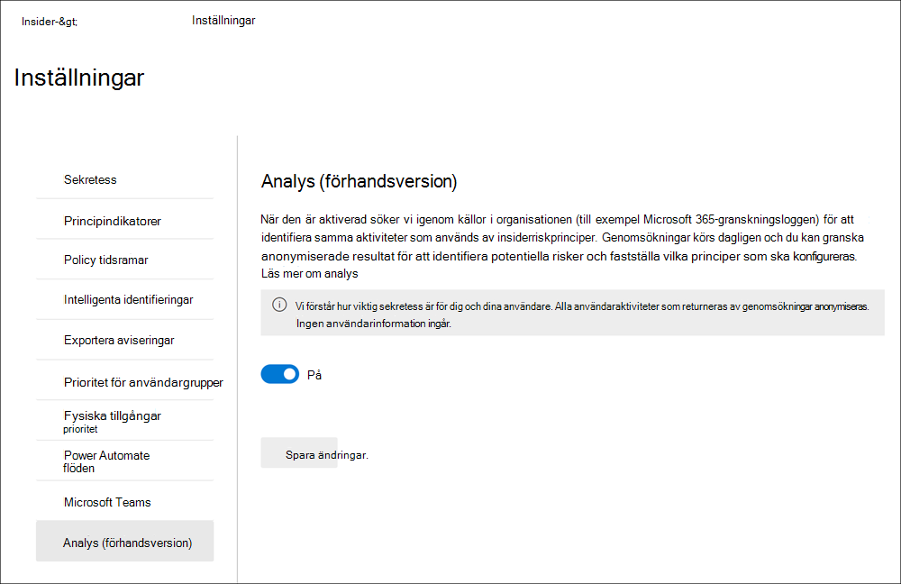

### Visa analysinsikter och skapa nya principer

När den första analyssökningen är klar för organisationen kan du visa insikter och rekommendationer för potentiellt riskfyllda aktiviteter av användarna. Dagliga genomsökningar fortsätter om du inte inaktiverar analyser för organisationen. Om du vill visa potentiella risker för organisationen går du till **fliken** Översikt och väljer **Visa resultat** på kortet Insider **– riskanalyser (förhandsversion).** Om sökningen för organisationen inte är slutförd visas ett meddelande om att den skannade sökningen fortfarande är aktiv.

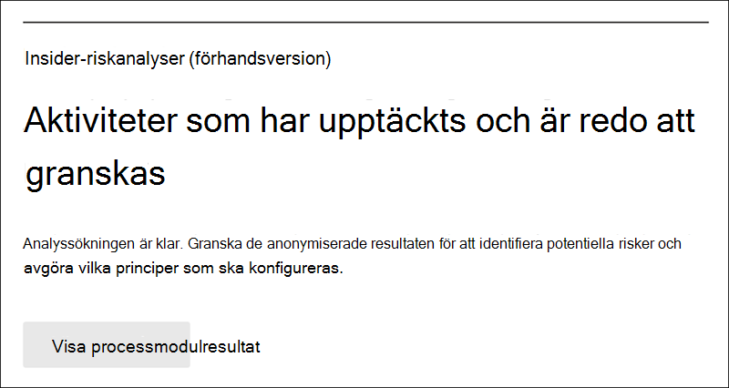

För slutförda genomsökningar ser du de potentiella risker som upptäcks i organisationen och insikter och rekommendationer för att hantera dessa risker. Identifierade risker och specifika insikter ingår i rapporter grupperade efter område, det totala antalet användare med identifierade risker, procentandelen av dessa användare med potentiellt riskfyllda aktiviteter och en rekommenderad Insider-riskpolicy för att minimera dessa risker. Rapporterna omfattar:

- **Insikter om dataläckor:** Aktiviteter för alla användare som kan inkludera oavsiktligt föråldring av information utanför organisationen eller data läcker av användare med skadligt uppsåt.
- **Datastöldinsikter:** Aktiviteter för avgående användare eller användare med borttagna Azure Active Directory-konton som kan inkludera riskabel delning av information utanför organisationen eller datastöld av användare med skadliga avsikter.
- **Bästa information om exfiltrering**: Aktiviteter av alla användare som kan omfatta delning av data utanför organisationen.

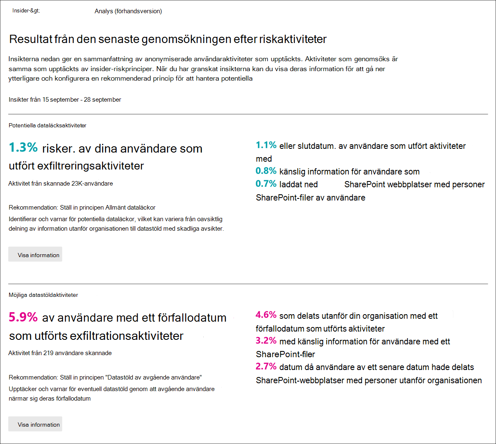

Om du vill visa mer information för en insikt **väljer du Visa** information för att visa informationsfönstret för insikten. Informationsfönstret innehåller fullständiga insikter, en rekommendation för insider-riskprinciper och knappen Skapa **princip** som hjälper dig att snabbt skapa den rekommenderade principen. När du väljer Skapa princip kommer du till principguiden och den rekommenderade principmallen som är relaterad till insikten markeras automatiskt. Om analysinsikten exempelvis  är för Dataläckningsaktivitet är principmallen Allmänt *dataläckor* förvald i principguiden åt dig.

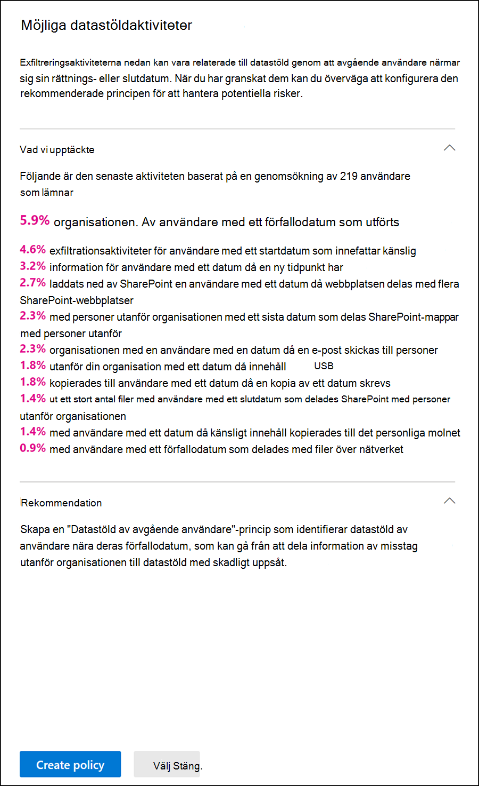

### Inaktivera analyser

Om du vill inaktivera Insider-riskanalyser måste du vara medlem i rollgruppen för Insider-riskhantering, *Insider-riskhantering* eller Microsoft 365 *global* administratör.  När du inaktiverar analyser förblir analysinsiktsrapporter statiska och uppdateras inte för nya risker.

Utför följande steg för att inaktivera Insider-riskanalyser:

1. I Microsoft 365 [kompatibilitetscenter](htttps://compliance.microsoft.com)går du **till Insider-riskhantering.**
2. Välj **Analyssida för**  >  **Insider-riskinställningar.**
3. Inaktivera Sök igenom klientorganisationens användaraktivitet på sidan **Analys** **för att identifiera potentiella insiderrisker.**