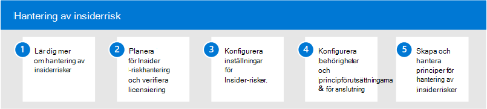

# Insider-riskhantering i Microsoft 365

I allt större utsträckning får anställda mer åtkomst till att skapa, hantera och dela data över en mängd plattformar och tjänster. I de flesta fall har organisationer begränsade resurser och verktyg för att identifiera och minimera risker för hela organisationen samtidigt som de uppfyller efterlevnadskrav och sekretessstandarder för anställda. Dessa risker kan vara datastöld genom att avgående anställda och dataläckor för information utanför organisationen kan vara en oavsiktlig överformning eller skadliga avsikter.

Insider-riskhantering i Microsoft 365 använder tjänstens fullständiga bredd och indikatorer från tredje part för att snabbt identifiera, hantera och agera på riskabel användaraktivitet. Genom att använda loggar från Microsoft 365 och Microsoft Graph kan du med insider-riskhantering definiera specifika principer för att identifiera riskindikatorer och vidta åtgärder för att minimera dessa risker.

## Konfigurera Insider-riskhantering för Microsoft 365

Använd följande steg för att konfigurera Insider-riskhantering för din organisation:

1. Läs mer [om Insider-riskhantering](insider-risk-management.md) i Microsoft 365
2. Planera för [Insider-riskhantering och verifiera licensiering](insider-risk-management-plan.md)
3. Konfigurera [inställningar för Insider-riskhantering](insider-risk-management-settings.md)
4. Konfigurera [behörigheter](insider-risk-management-configure.md#step-1-enable-permissions-for-insider-risk-management) [och principförutsättningarna & anslutare](insider-risk-management-configure.md#step-4-configure-prerequisites-for-policies)
5. Skapa och konfigurera [principer för Insider-riskhantering](insider-risk-management-configure.md#step-6-create-an-insider-risk-management-policy)

## Mer information om Insider-riskhantering

- [Hantera insiderriskprinciper](insider-risk-management-policies.md)
- [Undersöka Insider-riskaktiviteter](insider-risk-management-activities.md)
- [Agera på Insider-riskärenden](insider-risk-management-cases.md)