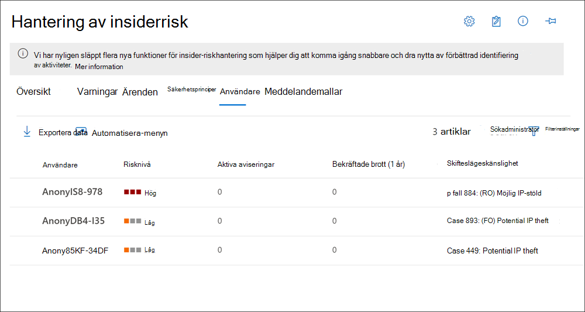

# Insider-riskhantering – instrumentpanel för användare

Instrumentpanelen **Användare** är ett viktigt verktyg i arbetsflödet för insiderriskhantering och hjälper kunder och analytiker att få en mer fullständig förståelse av riskaktiviteter. Den här instrumentpanelen erbjuder vyer och hanteringsfunktioner som uppfyller administrativa behov mellan att skapa principer för insider-riskhantering och hantering av insider-riskhanteringsärenden.

När användare läggs till i principer för insider-riskhantering utvärderar bakgrundsprocesser automatiskt användaraktiviteter för att [utlösa indikatorer.](insider-risk-management-settings.md#indicators) När indikatorerna har utlösats tilldelas användaraktiviteter riskpoäng. Vissa av dessa aktiviteter kan resultera i en insiderriskvarning, men vissa aktiviteter kanske inte uppfyller en lägsta risknivå och ingen insiderriskvarning skapas. På **instrumentpanelen** Användare kan du visa användarna med dessa typer av indikatorer och riskpoäng, samt användare som har aviseringar om aktiva insiderrisker.

Läs mer om hur instrumentpanelen Användare visar användare i följande scenarier:

- Användare med varningar om aktiva Insider-risker
- Användare med utlösande händelser
- Användare har lagts till tillfälligt i principer

## Användare med varningar om aktiva Insider-risker

Instrumentpanelen **Användare** visar automatiskt alla användare med varningar om aktiva Insider-risker. De här användare som har aviseringar har både en utlösande indikator och en aktivitetsriskpoäng som uppfyller kraven för att skapa en insiderriskvarning. Aktiviteter för de här användarna visas genom att välja användaren på **instrumentpanelen Användare och** gå till **fliken Användaraktivitet.**

## Användare med utlösande händelser

Instrumentpanelen **Användare** visar automatiskt alla användare med utlösande händelser, men som inte har någon riskpoäng för aktivitet som skapar en insiderriskvarning. En användare med ett rapporterat förfallodatum visas till exempel eftersom den här aktiviteten är en utlösande händelse men inte en aktivitet som har ett riskresultat. Aktiviteter för de här användarna visas genom att välja användaren på **instrumentpanelen Användare och** gå till **fliken Användaraktivitet.**

## Användare har lagts till tillfälligt i principer

Instrumentpanelen **Användare** innehåller användare som lagts till i principer för Insider-riskhantering efter en ovanlig händelse utanför arbetsflödet för insiderriskhantering. Att tillfälligt lägga till användare (från instrumentpanelen principer) är också ett sätt att börja poänganvändaraktivitet för en princip för insider-riskhantering för att testa principen, även om en obligatorisk koppling inte har konfigurerats.

När en användare läggs till manuellt i en princip poängas användaraktiviteterna för de föregående 90 dagarna och läggs till på tidslinjen **för användaraktivitet.** Till exempel har du en användare som för närvarande inte tilldelats riskresultat för en Insider-riskpolicy och användaren har rapporterat dataläckor till den juridiska avdelningen i organisationen. Den juridiska avdelningen rekommenderar att du konfigurerar nya uppföljningskrav för användaren. Du kan tillfälligt tilldela användaren till principen för *Dataläckor* under en angiven tid (aktiveringsfönstret). Alla användare som lagts till tillfälligt visas i **instrumentpanelen Användare eftersom** händelsekrav avsäger sig.

>[!NOTE]
>Det kan ta flera timmar innan nya manuellt tillagda användare visas i **instrumentpanelen Användare.** Det kan ta upp till 24 timmar att visa aktiviteter för de senaste 90 dagarna för dessa användare. Om du vill visa aktiviteter för manuellt  tillagda användare väljer du användaren på instrumentpanelen Användare och öppnar **fliken Användaraktivitet** i informationsfönstret.

Användaren tas automatiskt bort från instrumentpanelen **användare och** poäng poäng upphör när den tid som definierats i **aktiveringsfönstret går** ut om:

- användaren inte har några ytterligare utlösande händelser eller varningar för Insider-riskprinciper, och
- om den manuellt definierade **varaktigheten för aktiveringsfönstret** är längre än tidsperioden för global **principaktivering.**

**Aktiveringsfönstrets** inställning med längst varaktighet åsidosätter alltid inställningen **för aktiveringsfönstret** med kortare varaktighet. Du har till exempel konfigurerat  aktiveringsfönstret på  fliken global policys (tidsramar) i de globala inställningarna för Insider-riskhantering i 15 dagar, som automatiskt tillämpas på alla dina Insider-riskprinciper. 

Du lägger tillfälligt till en användare i principen för Insider-risker för *Dataläckor* och definierar 30 dagar som **aktiveringsfönster** för den här användaren. Inställningen för **det globala aktiveringsfönstret** på 15  dagar åsidosätts genom att definiera inställningen för aktiveringsfönstret på 30 dagar för den tillfälligt tillagda användaren. Den tillfälligt tillagda användaren finns kvar på **instrumentpanelen Användare** och finns kvar i principen i 30 dagar.

I motsatt scenario där inställningen för det globala aktiveringsfönstret är längre än inställningen  för aktiveringsfönstret som  definierats för en tillfälligt tillagd användare skulle inställningen för det globala aktiveringsfönstret åsidosätta inställningen i aktiveringsfönstret för den tillfälligt tillagda användaren.   Den tillfälligt tillagda användaren  finns kvar på instrumentpanelen Användare och är begränsad till principen i det antal dagar som anges i inställningarna för det **globala** aktiveringsfönstret.

## Visa användarinformation på instrumentpanelen Användare

Varje användare som visas på **instrumentpanelen Användare** har följande information:

- **Användare:** Användarnamnet för en användare. Det här fältet anonymiseras om inställningen för global anonymisering för Insider-riskhantering är aktiverad.
- **Risknivå:** Användarens aktuella beräknade risknivå. Det här poängresultatet beräknas var 24:e timme och aviseringsrisken från alla aktiva aviseringar som associeras till användaren. För användare med endast utlösande indikatorer är risknivån noll.
- **Aktiva aviseringar:** Antalet aktiva aviseringar för alla principer.
- **Bekräftade brott**: Antalet ärenden lösta som *bekräftad principbrott* för användaren.
- **Case**: Det aktuella aktiva ärendet för användaren.

>[!NOTE]
>Antalet användare som visas på **instrumentpanelen Användare** kan vara begränsat i vissa fall, beroende på mängden aktiva aviseringar och matchande principer. Användare med aktiva aviseringar  visas på instrumentpanelen Användare när aviseringarna genereras och det kan finnas sällsynta fall när det maximala antalet användare som visas nås. Om den här gränsen inträffar kommer användare med aktiva  aviseringar som inte visas att läggas till på instrumentpanelen Användare när befintliga användaraviseringar tritrerats.

## Visa användarinformation

Om du vill visa mer information om riskaktivitet för en användare öppnar du fönstret med användarinformation genom att dubbelklicka på en användare i **instrumentpanelen Användare.** I informationsfönstret kan du visa följande information:

- **Fliken Användarprofil**
    - **Namn och titel:** Användarens namn och befattning från Azure Active Directory. De här användarfälten anonymiseras eller är tomma om den globala anonymiseringsinställningen för Insider-riskhantering är aktiverad.
    - **Användarens** e-postadress: Användarens e-postadress.
    - **Alias**: Användarens nätverksalias.
    - **Organisation eller avdelning**: Organisationen eller avdelningen för användaren.

- **Fliken Användaraktivitet**
    - **Historik över den senaste användaraktiviteten**: Visar både utlösande indikatorer och insiderriskindikatorer för användaraktiviteter upp till de senaste 180 dagarna. Alla aktiviteter som är relevanta för insiderriskindikatorer poängas också, även om aktiviteterna kanske eller inte har genererat en riskvarning för Insider. Exempel på utlösande indikator kan vara ett förfallodatum eller det senast schemalagda arbetsdatumet för användaren. Insider-riskindikatorer är aktiviteter som avgörs av en del av risker och definieras i principer som användaren ingår i. Händelse- och riskaktiviteter visas med det senaste objektet först.

## Ta bort användare från tilldelning inom omfattningen till principer

Det kan finnas scenarier där du behöver sluta tilldela riskpoäng till en användares aktiviteter i insider-riskhanteringsprinciper. Använd **Ta bort** användare på sidan **Användare** instrumentpanelen om du vill sluta tilldela riskpoäng för en eller flera användare från alla principer för Insider-riskhantering som de för närvarande finns inom omfattningen för. Den här åtgärden tar inte bort användare från den övergripande principtilldelningen (när du lägger till användare eller grupper i en principkonfiguration), utan tar bara bort användarna från aktiv bearbetning efter principer efter aktuella utlösande händelser. Om användarna har en annan utlösande händelse i framtiden börjar riskresultat från principer automatiskt tilldelas till användarna igen. Befintliga aviseringar eller ärenden för den här användaren tas inte bort.

>[!NOTE]
>Det kan ta flera minuter att ta bort en användare från en princip. När det är klart visas användaren inte längre på sidan Användare. Om den borttagna användaren har aktiva aviseringar eller ärenden finns användaren kvar på sidan Användare och information för användaren visar att de inte längre omfattas av en princip.

Om du vill ta bort användare från omfattningens status manuellt i alla insider-riskhanteringsprinciper slutför du följande steg:

1. I Microsoft 365 [kompatibilitetscenter](https://compliance.microsoft.com)går du **till Insider-riskhantering** och väljer **fliken** Användare.
2. På **instrumentpanelen Användare** väljer du den eller de användare som du vill ta bort från att omfattas av insider-riskhanteringsprinciper.
3. Välj **Ta bort användare.**
4. I fönstret **Ta bort användare** väljer du Ta **bort** **eller Avbryt** för att ignorera ändringarna och stänga dialogrutan.
5. Välj **Ta** bort i bekräftelsefönstret för att ta bort användaren.

## Köra automatiserade uppgifter med Power Automate flöden för en användare

Med rekommenderade Power Automate kan riskflöden och analytiker snabbt vidta åtgärder för att:

- Meddela användare när de läggs till i en Insider-riskprincip

För att köra, hantera Power Automate skapa Power Automate för en insider-riskhanteringsanvändare:

1. Välj **Automatisera i** verktygsfältet för användaråtgärder.
2. Välj det Power Automate flöde du vill köra och välj sedan **Kör flöde**.
3. När flödet är klart väljer du **Klar**.

Mer information om hur Power Automate för insider riskhantering finns i Komma igång med inställningar för [insider-riskhantering.](insider-risk-management-settings.md#power-automate-flows-preview)
