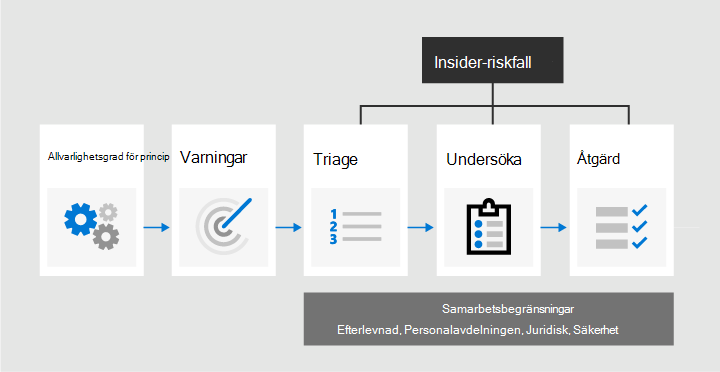

# Läs mer om Insider-riskhantering i Microsoft 365

Insider-riskhantering är en efterlevnadslösning i Microsoft 365 som bidrar till att minimera interna risker genom att du kan upptäcka, undersöka och agera på skadliga och oavsiktliga aktiviteter i organisationen. Med principer för Insider-risker kan du definiera vilka typer av risker som du kan identifiera och identifiera i organisationen, inklusive att agera i ärenden och eskalera ärenden till Microsoft Advanced eDiscovery om det behövs. Riskanalytiker i organisationen kan snabbt vidta lämpliga åtgärder för att se till att användarna följer organisationens efterlevnadsstandarder.

Titta på videon nedan för att lära dig hur insider-riskhantering kan hjälpa din organisation att förhindra, upptäcka och begränsa risker samtidigt som organisationens värden, kultur och användarupplevelse prioriteras:
 
 
>[!VIDEO https://www.microsoft.com/videoplayer/embed/RE4j9CN]

## Moderna riskpunkter

Hantering och minimering av risker i organisationen börjar med att förstå vilka typer av risker som finns på den moderna arbetsplatsen. Vissa risker styrs av externa händelser och faktorer som inte har direkt kontroll. Andra risker drivs av interna händelser och användaraktiviteter som kan minimeras och undvikas. Vissa exempel är risker från olagligt, olämpligt, obehörigt eller oetiskt beteende och åtgärder av användare i organisationen. Dessa beteenden omfattar många interna risker från användare:

- Läckage av känsliga data och data som spiller
- Brott mot konfidentialitet
- IP-stöld (immateriell egendom)
- Bedrägeri
- Insider-handel
- Regelefterlevnadsfel

Användare på den moderna arbetsplatsen har tillgång till att skapa, hantera och dela data över en mängd olika plattformar och tjänster. I de flesta fall har organisationer begränsade resurser och verktyg för att identifiera och minimera risker för hela organisationen och samtidigt uppfylla användarnas sekretessstandarder.

Insider-riskhantering använder den fullständiga bredden på tjänsten och indikatorer från tredje part för att snabbt identifiera, hantera och agera på riskaktiviteter. Genom att använda loggar från Microsoft 365 och Microsoft Graph kan du med insider-riskhantering definiera specifika principer för att identifiera riskindikatorer. Med de här principerna kan du identifiera riskfyllda aktiviteter och agera för att minimera dessa risker.

Insider-riskhantering är centrerat kring följande principer:

- **Transparens:** Balansera användarsekretessen och organisationens risker med arkitekturen sekretess för design.
- **Konfigurerbara:** Konfigurerbara principer baserade på bransch-, geografiskt och företagsgrupper.
- **Integrerad:** Integrerat arbetsflöde i Microsoft 365 efterlevnadslösningar.
- **Användbart:** Ger insikter för att möjliggöra aviseringar för granskare, dataundersökningar och användarundersökningar.

## Identifiera potentiella risker med analyser (förhandsversion)

Med Insider-riskanalyser kan du göra en utvärdering av potentiella Insider-risker i organisationen utan att konfigurera insiderriskprinciper. Den här utvärderingen kan hjälpa din organisation att identifiera potentiella områden med högre användarrisker och hjälpa till att fastställa typ och omfattning för principer för Insider-riskhantering som du kan överväga att konfigurera. Den här utvärderingen kan också hjälpa dig att fastställa behov för ytterligare licensiering eller framtida optimering av befintliga Insider Risk-principer.

Mer information om Insider-riskanalyser finns i [Insider-inställningar för riskhantering: Analyser](insider-risk-management-settings.md#analytics-preview).

## Arbetsflöde

Med insider-riskhanteringsarbetsflödet kan du identifiera, undersöka och vidta åtgärder för att hantera interna risker i organisationen. Med fokuserade principmallar, omfattande aktivitetssignalering i Microsoft 365-tjänsten och verktyg för varning och ärendehantering kan du använda handlingsbara insikter för att snabbt identifiera och agera på riskabelt beteende.

Följande arbetsflöde används för att identifiera och lösa interna riskaktiviteter och efterlevnadsproblem med insiderriskhantering i Microsoft 365 av följande arbetsflöde:

### Principer

[Insider-riskhanteringsprinciper](insider-risk-management-policies.md) skapas med fördefinierade mallar och policyvillkor som definierar vilka utlösta händelser och riskindikatorer som utlösts i organisationen. Dessa villkor omfattar hur riskindikatorer används för varningar, vilka användare som ingår i principen, vilka tjänster som prioriteras och övervakningstidsperioden.

Du kan välja bland följande principmallar för att snabbt komma igång med Insider-riskhantering:

- [Datastöld genom avgående användare](insider-risk-management-policies.md#data-theft-by-departing-users)
- [Allmänna dataläckor](insider-risk-management-policies.md#general-data-leaks)
- [Dataläsar efter prioriterade användare (förhandsversion)](insider-risk-management-policies.md#data-leaks-by-priority-users-preview)
- [Dataläckor av missnöjda användare (förhandsversion)](insider-risk-management-policies.md#data-leaks-by-disgruntled-users-preview)
- [Allmänna brott mot säkerhetsprinciper (förhandsversion)](insider-risk-management-policies.md#general-security-policy-violations-preview)
- [Brott mot säkerhetsprinciper genom avgående användare (förhandsversion)](insider-risk-management-policies.md#security-policy-violations-by-departing-users-preview)
- [Brott mot säkerhetsprinciper för användare med prioritet (förhandsversion)](insider-risk-management-policies.md#security-policy-violations-by-priority-users-preview)
- [Brott mot säkerhetsprinciper för användare (förhandsversion)](insider-risk-management-policies.md#security-policy-violations-by-disgruntled-users-preview)

### Varningar

Varningar genereras automatiskt av riskindikatorer som matchar principvillkor och visas i instrumentpanelen [för aviseringar.](insider-risk-management-alerts.md) Med den här instrumentpanelen kan du snabbt se alla aviseringar som behöver granskas, öppna aviseringar med tiden och aviseringsstatistik för organisationen. Alla principaviseringar visas med följande information som hjälper dig att snabbt identifiera status för befintliga aviseringar och nya aviseringar som behöver åtgärd:

- Status
- Allvarlighetsgrad
- Upptäckt tid
- Ärende
- Ärendestatus

### Triage

Nya användaraktiviteter som behöver undersökas genererar automatiskt aviseringar som tilldelas *statusen Behöver* granskas. Granskare kan snabbt identifiera och granska, utvärdera och kontrollera dessa aviseringar.

Aviseringar löses genom att öppna ett nytt ärende, tilldela aviseringen till ett befintligt ärende eller stänga aviseringen. Med hjälp av aviseringsfilter är det enkelt att snabbt identifiera aviseringar efter status, allvarlighetsgrad eller upptäckt tid. Som en del av processen kan granskare visa varningsinformation för aktiviteter som identifieras av principen, visa användaraktivitet som är kopplad till principmatchningen, se allvarlighetsgraden för aviseringen och granska information om användarprofiler.

### Undersöka

[Ärenden](insider-risk-management-cases.md) skapas för aviseringar som kräver en djupare granskning och undersökning av aktivitetsinformation och omständigheter kring principmatchning. På **instrumentpanelen Ärende** finns en översikt över alla aktiva ärenden, öppna ärenden med tiden och ärendestatistik för organisationen. Granskare kan snabbt filtrera ärenden efter status, datumet då ärendet öppnades och datumet då ärendet uppdaterades senast.

Om du väljer ett ärende på ärendepanelen öppnas ärendet för undersökning och granskning. Det här steget är kärnan i arbetsflödet för insider-riskhantering. I det här området visas riskaktiviteter, policyvillkor, information om varningar och användarinformation i en integrerad vy för granskare. De huvudsakliga undersökningsverktygen i det här området är:

- **Användaraktivitet:** Användaraktivitet visas automatiskt i ett interaktivt diagram som ritar aktiviteter över tid och efter risknivå för aktuella eller tidigare riskaktiviteter. Granskare kan snabbt filtrera och visa hela riskhistoriken för användaren och granska specifika aktiviteter för mer information.
- **Innehållsutforskaren:** Alla datafiler och e-postmeddelanden som är kopplade till aviseringsaktiviteter samlas automatiskt in och visas i Innehållsutforskaren. Granskare kan filtrera och visa filer och meddelanden efter datakälla, filtyp, taggar, konversationer och många fler attribut.
- **Anteckning om** ärende : Granskare kan göra anteckningar för ett ärende i avsnittet Ärendeanteckningar. Den här listan konsoliderar alla anteckningar i en central vy och innehåller information som granskare och datum för inskickning.

Med den nya [granskningsloggen (förhandsversion)](insider-risk-management-audit-log.md) kan du dessutom hålla dig uppdaterad om de åtgärder som har vidtagits för funktioner för insider-riskhantering. Den här resursen tillåter en oberoende granskning av de åtgärder som vidtas av användare som tilldelats en eller flera rollgrupper inom insider-riskhantering.

### Åtgärd

När ärendena har undersökts kan granskare snabbt agera för att lösa ärendet eller samarbeta med andra risk intressenter i organisationen. Om användare av misstag eller av misstag bryter mot principvillkoren kan ett enkelt påminnelsemeddelande skickas till användaren från meddelandemallar som du kan anpassa för din organisation. De här meddelandena kan fungera som enkla påminnelser eller dirigera användaren till uppdateringsutbildning eller vägledning för att förhindra framtida riskabelt beteende. Mer information finns i [Mallar för information om Insider-riskhanteringsvarningar.](insider-risk-management-notices.md)

I mer allvarliga situationer kan du behöva dela information om insider-riskhanteringsfall med andra granskare eller tjänster i organisationen. Insider-riskhantering är nära integrerat med andra Microsoft 365 och efterlevnadslösningar som hjälper dig med end-to-end risklösning.

- **Advanced eDiscovery**: Om du eskalerar ett ärende för undersökning kan du överföra data och hanteringen av ärendet till ett Advanced eDiscovery i Microsoft 365. Advanced eDiscovery ett end-to-end-arbetsflöde för att bevara, samla in, granska, analysera och exportera innehåll som svarar på organisationens interna och externa undersökningar. Det gör att juridiska grupper kan hantera hela arbetsflödet för aviseringar om juridiska frågor. Mer information om Advanced eDiscovery fall finns i [Översikt över Advanced eDiscovery i Microsoft 365](overview-ediscovery-20.md).
- **Office 365 Management API-integrering (förhandsversion)**: Insider-riskhantering har stöd för export av aviseringsinformation till säkerhetsinformation och händelsehanteringstjänster (SIEM) via Office 365-API:er. Att ha åtkomst till aviseringsinformation på plattformen passar bäst för organisationens riskprocesser ger dig mer flexibilitet i hur du agerar på riskaktiviteter. Mer information om hur du exporterar aviseringsinformation med Office 365 API:er för hantering finns i [Exportera aviseringar.](insider-risk-management-settings.md#export-alerts-preview)

>[!NOTE]
>Tack för din feedback och support under förhandsversionen av ServiceNow-anslutningen. Vi har beslutat att avsluta förhandsversionen av ServiceNow Connector och upphöra med supporten för Insider-riskhantering den 30 november 2020. Vi utvärderar aktivt alternativa metoder för att ge kunderna ServiceNow-integrering med insiderriskhantering.

## Scenarier

Insider-riskhantering kan hjälpa dig att upptäcka, undersöka och vidta åtgärder för att minska interna risker i organisationen i flera vanliga scenarier:

### Datastöld genom avgående användare

När användare lämnar en organisation, antingen avsiktligt eller som ett resultat av uppsägning, finns det ofta legitima problem som företaget, kunden och användarinformationen är i riskabelt. Användarna kan vara se fram mot att projektdata inte är företagsdata, eller att de frestas att ta företagsdata för personlig vinst och i brott mot företagets policy och juridiska standarder. Principer för Insider-riskhantering som använder [Datastöld genom avgående](insider-risk-management-policies.md#policy-templates) användarprincipmall identifierar automatiskt aktiviteter som vanligtvis associeras med den här typen av stöld. Med den här principen får du automatiskt aviseringar om misstänkta aktiviteter som är associerade med datastöld av avgående användare så att du kan vidta lämpliga åtgärder. Du måste [konfigurera Microsoft 365 HR-koppling](import-hr-data.md) för organisationen för den här principmallen.

### Avsiktlig eller oavsiktlig läckage av känslig eller konfidentiell information

I de flesta fall försöker användarna att hantera känslig eller konfidentiell information på bästa sätt. Men ibland kan användare göra misstag och information delas av misstag utanför organisationen eller i brott mot dina informationsskyddsprinciper. I andra fall kan användare avsiktligt läcka eller dela känslig och konfidentiell information med skadliga avsikter och för potentiell personlig vinst. Principer för Insider-riskhantering som skapats med hjälp av följande principmallar för Dataläckor identifierar automatiskt aktiviteter som vanligtvis associeras med delning av känslig eller konfidentiell information:

- [Allmänna dataläckor](insider-risk-management-policies.md#general-data-leaks)
- [Dataläsar efter prioriterade användare (förhandsversion)](insider-risk-management-policies.md#data-leaks-by-priority-users-preview)
- [Dataläckor av missnöjda användare (förhandsversion)](insider-risk-management-policies.md#data-leaks-by-disgruntled-users-preview)

## Avsiktliga eller oavsiktliga brott mot säkerhetsprinciper (förhandsversion)

Användare har vanligtvis stor kontroll när de hanterar sina enheter på den moderna arbetsplatsen. Den här kontrollen kan innehålla behörigheter för att installera eller avinstallera program som behövs i prestandan av deras uppgifter eller möjlighet att tillfälligt inaktivera säkerhetsfunktioner för enheter. Om den här aktiviteten är oavsiktlig, oavsiktlig eller skadlig kan det här uppförandet utgöra en risk för organisationen och det är viktigt att identifiera och agera för att minimera. För att identiteten ska kunna identiteten för dessa riskfyllda säkerhetsaktiviteter betygsöker följande mallar för säkerhetspolicyn för Insider-riskhantering säkerhetsindikatorer och använder Microsoft Defender för slutpunktsaviseringar för att ge insikter om säkerhetsrelaterade aktiviteter:

- [Allmänna brott mot säkerhetsprinciper (förhandsversion)](insider-risk-management-policies.md#general-security-policy-violations-preview)
- [Brott mot säkerhetsprinciper genom avgående användare (förhandsversion)](insider-risk-management-policies.md#security-policy-violations-by-departing-users-preview)
- [Brott mot säkerhetsprinciper för användare med prioritet (förhandsversion)](insider-risk-management-policies.md#security-policy-violations-by-priority-users-preview)
- [Brott mot säkerhetsprinciper för användare (förhandsversion)](insider-risk-management-policies.md#security-policy-violations-by-disgruntled-users-preview)

## Principer för användare baserat på position, åtkomstnivå eller riskhistorik (förhandsversion)

Användare i organisationen kan ha olika nivåer av risker beroende på deras position, åtkomstnivå till känslig information eller riskhistorik. Strukturen kan omfatta medlemmar i organisationens ledningsteam, IT-administratörer som har omfattande data- och nätverksåtkomstbehörigheter eller användare med en tidigare historik över riskfyllda aktiviteter. Under dessa omständigheter är det viktigt med närmare kontroll och mer aggressiva riskbedömningar för att underlätta surface-varningar för undersökning och snabb åtgärd. För att identifiera riskfyllda aktiviteter för dessa typer av användare kan du skapa prioriterade användargrupper och skapa principer från följande principmallar:

- [Brott mot säkerhetsprinciper för användare med prioritet (förhandsversion)](insider-risk-management-policies.md#security-policy-violations-by-priority-users-preview)
- [Dataläsar efter prioriterade användare (förhandsversion)](insider-risk-management-policies.md#data-leaks-by-priority-users-preview)

## Åtgärder och beteenden av missnöjda användare (förhandsversion)

Anställningshändelser kan påverka användarbeteendet på flera olika sätt som är relaterade till Insider-risker. Sådana stressfaktorer kan vara en dålig prestandagranskning, en position nedgradering eller användaren som placerar sig på en plan för prestandagranskning. Även om de flesta användare inte svarar på skadliga händelser kan stressen hos dessa åtgärder resultera i att vissa användare inte tänker på åtgärder som de normalt sett inte överväger under normala omständigheter. För att hjälpa till att identiteten av dessa typer av riskfyllda aktiviteter använder följande mallar för insider-riskhanteringspolicyn Microsoft 365 HR-kopplingen och börjar poänga riskindikatorer som relaterar till beteenden som kan uppstå nära stress eller händelser för anställningsstress:

- [Dataläckor av missnöjda användare (förhandsversion)](insider-risk-management-policies.md#data-leaks-by-disgruntled-users-preview)
- [Brott mot säkerhetsprinciper för användare (förhandsversion)](insider-risk-management-policies.md#security-policy-violations-by-disgruntled-users-preview)

## Är du redo att börja?

- I [Planera för Insider-riskhantering finns](insider-risk-management-plan.md) information om hur du förbereder för att aktivera insider-riskhanteringsprinciper i din organisation.
- Se [Komma igång med inställningar för Insider-riskhantering för](insider-risk-management-settings.md) att konfigurera globala inställningar för Insider-riskprinciper.
- Se [Komma igång med Insider-riskhantering för](insider-risk-management-configure.md) att konfigurera förutsättningar, skapa principer och börja ta emot aviseringar.
