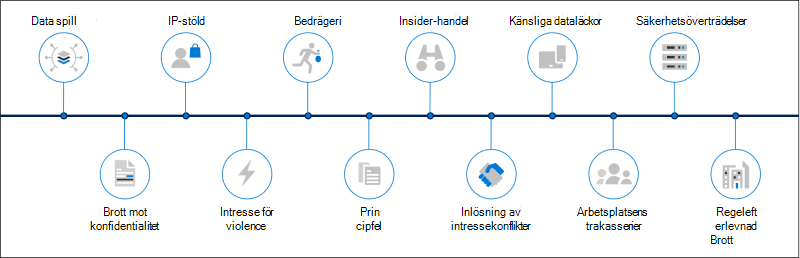
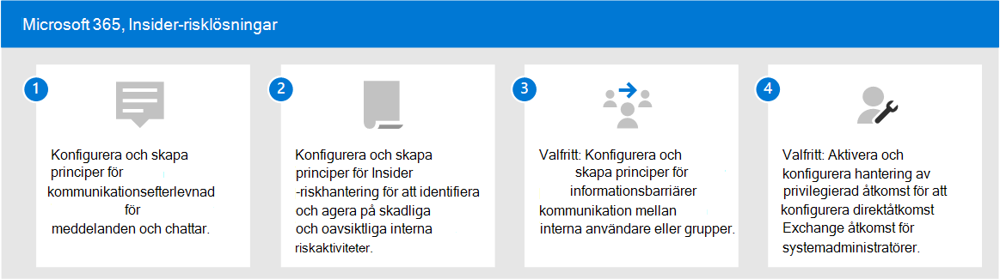

# Insider-risklösningar i Microsoft 365Insider risk solutions in Microsoft 365

Insider-risker är ett av de viktigaste problemen för säkerhets- och efterlevnadsexperter på den moderna arbetsplatsen.Insider risks are one of the top concerns of security and compliance professionals in the modern workplace. Branschstudier har visat att insiderrisker ofta är kopplade till särskilda användarhändelser eller aktiviteter.Industry studies have shown that insider risks are often associated with specific user events or activities. Det kan vara svårt att identifiera och svårt att minimera för att skydda organisationen mot dessa risker.Protecting your organization against these risks can be challenging to identify and difficult to mitigate. Insider-risker omfattar säkerhetsproblem i en mängd olika områden och kan orsaka stora problem för organisationen, allt från förlust av immateriell egendom till arbetsplatsrektra på arbetsplatsen och mycket mer.Insider risks include vulnerabilities in a variety of areas and can cause major problems for your organization, ranging from the loss of intellectual property to workplace harassment, and more. I följande bild beskrivs vanliga Insider-risker:The following figure outlines common insider risks:

Microsoft 365 funktioner för riskskydd är utformade och inbyggda i våra Insider-riskprodukter och -lösningar.Microsoft 365 risk prevention features are designed and built-in to our insider risk products and solutions. De här lösningarna samarbetar och använder avancerade indikatorer för tjänster och tredje part för att snabbt identifiera, lösa och agera på riskaktivitet.These solutions work together and use advanced service and 3rd-party indicators to help you quickly identify, triage, and act on risk activity. De flesta lösningar erbjuder ett omfattande arbetsflöde för identifiering, avisering och åtgärd för dataanalytiker och kunder som snabbt kan agera på och minimera dessa risker.Most solutions offer a comprehensive detection, alert, and remediation workflow for your data analysts and investigators to use to quickly act on and minimize these risks.

| RiskikonRisk icon | RiskerRisks | KommunikationsefterlevnadCommunication compliance | Hantering av insiderriskInsider risk management | InformationsbarriärerInformation barriers | Privilegierad åtkomsthanteringPrivileged access management |
| :---- | :-------- | :--------------------------- | :-------------------------- |:-------------------------| :--------------------------------|
| | Data spillData spillage |  |  |  |  |
| | Brott mot konfidentialitetConfidentiality violations |  |  |  |  |
| | IP-stöldIP theft |  |  |  |  |
| | Våld på arbetsplatsenWorkplace violence |  |  |  |  |
| | BedrägeriFraud |  |  |  |  |
| | PrincipfelPolicy violations |  |  |  |  |
| | Insider-handelInsider trading |  |  |  |  |
| | Inlösning av intressekonflikterConflicts of interest |  |  |  |  |
| | Känsliga dataläckorSensitive data leaks |  |  |  |  |
| | Arbetsplatsens trakasserierWorkplace harassment |  |  |  |  |
| | SäkerhetsöverträdelserSecurity violations |  |  |  |  |
| | RegelefterlevnadsfelRegulatory compliance violations |  |  |  |  |

## Microsoft 365, Insider-risklösningarMicrosoft 365 insider risk solutions

Använd dessa Microsoft 365 funktioner för att skydda din organisation mot insiderrisker.To help protect your organization against insider risks, use these Microsoft 365 capabilities and features.

### KommunikationsefterlevnadCommunication compliance

Kommunikationsefterlevnad bidrar till att minimera kommunikationsriskerna genom att hjälpa dig att upptäcka, fånga och agera på olämpliga meddelanden i organisationen.Communication compliance helps minimize communication risks by helping you detect, capture, and act on inappropriate messages in your organization. Kommunikationsefterlevnad är tillgängligt i följande prenumerationer:Communication compliance is available in the following subscriptions:

- Microsoft 365 E5 prenumeration (betald version eller utvärderingsversion)Microsoft 365 E5 subscription (paid or trial version)
- Microsoft 365 E3-prenumeration + Microsoft 365 E5 Compliance-tilläggetMicrosoft 365 E3 subscription + the Microsoft 365 E5 Compliance add-on
- Microsoft 365 E3 -prenumerationen + Microsoft 365 E5-tillägget Insider Risk ManagementMicrosoft 365 E3 subscription + the Microsoft 365 E5 Insider Risk Management add-on
- Microsoft 365 A5-prenumeration (betald eller utvärderingsversion)Microsoft 365 A5 subscription (paid or trial version)
- Microsoft 365 A3-prenumeration + Microsoft 365 A5-tillägget efterlevnadMicrosoft 365 A3 subscription + the Microsoft 365 A5 Compliance add-on
- Microsoft 365 En 3-prenumeration + Microsoft 365 A5 Insider Risk Management-tilläggetMicrosoft 365 A3 subscription + the Microsoft 365 A5 Insider Risk Management add-on
- Microsoft 365 G5-prenumeration (betald eller utvärderingsversion)Microsoft 365 G5 subscription (paid or trial version)
- Microsoft 365 G5-prenumeration + Microsoft 365 G5-tillägget för efterlevnadMicrosoft 365 G5 subscription + the Microsoft 365 G5 Compliance add-on
- Microsoft 365 G5-prenumeration + Microsoft 365 G5 Insider Risk Management-tilläggetMicrosoft 365 G5 subscription + the Microsoft 365 G5 Insider Risk Management add-on
- Office 365 Enterprise E5-prenumeration (betald eller utvärderingsversion)Office 365 Enterprise E5 subscription (paid or trial version)
- Office 365 A5 prenumeration (betald version eller utvärderingsversion)Office 365 A5 subscription (paid or trial version)
- Office 365 Enterprise, E3-abonnemang + Office 365 Advanced Compliance-tillägg (inte längre tillgängligt för nya abonnemang)Office 365 Enterprise E3 subscription + the Office 365 Advanced Compliance add-on (no longer available for new subscriptions)

### Hantering av insiderriskInsider risk management

Insider-riskhantering hjälper till att minimera interna risker genom att du kan upptäcka, undersöka och agera på skadliga och oavsiktliga aktiviteter i organisationen.Insider risk management helps minimize internal risks by enabling you to detect, investigate, and act on malicious and inadvertent activities in your organization.

Insider-riskhantering finns i följande prenumerationer:Insider risk management is available in the following subscriptions:

- Microsoft 365 E5 prenumeration (betald version eller utvärderingsversion)Microsoft 365 E5 subscription (paid or trial version)
- Microsoft 365 E3-prenumeration + Microsoft 365 E5 Compliance-tilläggetMicrosoft 365 E3 subscription + the Microsoft 365 E5 Compliance add-on
- Microsoft 365 E3 -prenumerationen + Microsoft 365 E5-tillägget Insider Risk ManagementMicrosoft 365 E3 subscription + the Microsoft 365 E5 Insider Risk Management add-on
- Microsoft 365 A5-prenumeration (betald eller utvärderingsversion)Microsoft 365 A5 subscription (paid or trial version)
- Microsoft 365 A3-prenumeration + Microsoft 365 A5-tillägget efterlevnadMicrosoft 365 A3 subscription + the Microsoft 365 A5 Compliance add-on
- Microsoft 365 En 3-prenumeration + Microsoft 365 A5 Insider Risk Management-tilläggetMicrosoft 365 A3 subscription + the Microsoft 365 A5 Insider Risk Management add-on
- Microsoft 365 G5-prenumeration (betald eller utvärderingsversion)Microsoft 365 G5 subscription (paid or trial version)
- Microsoft 365 G3 prenumeration + Microsoft 365 G5-tillägget efterlevnadMicrosoft 365 G3 subscription + the Microsoft 365 G5 Compliance add-on
- Microsoft 365 G3 -prenumerationen + Microsoft 365 G5 Insider Risk Management-tilläggetMicrosoft 365 G3 subscription + the Microsoft 365 G5 Insider Risk Management add-on
- Office 365 E3-abonnemang + Enterprise Mobility and Security E3 + Microsoft 365 E5 Compliance tilläggOffice 365 E3 subscription + Enterprise Mobility and Security E3 + the Microsoft 365 E5 Compliance add-on

### InformationsbarriärerInformation barriers

Informationsbarriärer gör att du kan begränsa kommunikation och samarbete mellan två interna grupper för att undvika en intressekonflikt i organisationen.Information barriers allow you to restrict communication and collaboration between two internal groups to avoid a conflict of interest from occurring in your organization.

Informationsbarriärer är tillgängliga i följande prenumerationer:Information barriers are available in the following subscriptions:

- Microsoft 365 E5 prenumeration (betald version eller utvärderingsversion)Microsoft 365 E5 subscription (paid or trial version)
- Microsoft 365 A5-prenumeration (betald eller utvärderingsversion)Microsoft 365 A5 subscription (paid or trial version)
- Office 365 Enterprise E5-prenumeration (betald eller utvärderingsversion)Office 365 Enterprise E5 subscription (paid or trial version)
- Office 365 A5 prenumeration (betald version eller utvärderingsversion)Office 365 A5 subscription (paid or trial version)
- Office 365 Advanced Compliance tillägg (inte längre tillgängligt för nya prenumerationer)Office 365 Advanced Compliance add-on (no longer available for new subscriptions)
- Microsoft 365 E3-prenumeration + Microsoft 365 E5 Compliance-tilläggetMicrosoft 365 E3 subscription + the Microsoft 365 E5 Compliance add-on
- Microsoft 365 E3 -prenumerationen + Microsoft 365 E5-tillägget Insider Risk ManagementMicrosoft 365 E3 subscription + the Microsoft 365 E5 Insider Risk Management add-on
- Microsoft 365 A3-prenumeration + Microsoft 365 A5-tillägget efterlevnadMicrosoft 365 A3 subscription + the Microsoft 365 A5 Compliance add-on
- Microsoft 365 En 3-prenumeration + Microsoft 365 A5 Insider Risk Management-tilläggetMicrosoft 365 A3 subscription + the Microsoft 365 A5 Insider Risk Management add-on

### Privileged Access ManagementPrivileged access management

Med hantering av behörighetsbehörigheter får du detaljerad åtkomstkontroll över Exchange Online och administratörsuppgifter i Office 365.Privileged access management allows granular access control over privileged Exchange Online admin tasks in Office 365. Det kan skydda organisationen från överträdelser som använder befintliga administratörskonton för privilegierad behörighet med stående åtkomst till känsliga data eller åtkomst till viktiga konfigurationsinställningar.It can help protect your organization from breaches that use existing privileged admin accounts with standing access to sensitive data or access to critical configuration settings.

Behörighetshantering är tillgänglig i följande prenumerationer:Privileged access management is available in the following subscriptions:

- Microsoft 365 E5 prenumeration (betald version eller utvärderingsversion)Microsoft 365 E5 subscription (paid or trial version)
- Microsoft 365 A5-prenumeration (betald eller utvärderingsversion)Microsoft 365 A5 subscription (paid or trial version)
- Office 365 Enterprise E5-prenumeration (betald eller utvärderingsversion)Office 365 Enterprise E5 subscription (paid or trial version)
- Office 365 A5 prenumeration (betald version eller utvärderingsversion)Office 365 A5 subscription (paid or trial version)
- Microsoft 365 E3-prenumeration + Microsoft 365 E5 Compliance-tilläggetMicrosoft 365 E3 subscription + the Microsoft 365 E5 Compliance add-on
- Microsoft 365 E3 prenumerationen + Microsoft 365 E5 tillägget Informationsskydd och styrningMicrosoft 365 E3 subscription + the Microsoft 365 E5 Information Protection and Governance add-on
- Microsoft 365 A3-prenumeration + Microsoft 365 A5-tillägget efterlevnadMicrosoft 365 A3 subscription + the Microsoft 365 A5 Compliance add-on
- Microsoft 365 A3-prenumerationen + Microsoft 365 A5-tillägget Informationsskydd och styrningMicrosoft 365 A3 subscription + the Microsoft 365 A5 Information Protection and Governance add-on

## Distribuera Microsoft 365 insider risk-lösningarDeploy Microsoft 365 insider risk solutions

Du kan skydda organisationen mot insiderrisker genom att konfigurera och distribuera följande Microsoft 365 lösningar:To help protect your organization against insider risks, set up and deploy the following Microsoft 365 solutions:

1. Konfigurera och skapa principer [för kommunikationsefterlevnad.](communication-compliance-solution-overview.md)Configure and create [communication compliance policies](communication-compliance-solution-overview.md).
2. Konfigurera och skapa [principer för Insider-riskhantering.](insider-risk-management-solution-overview.md)Configure and create [insider risk management policies](insider-risk-management-solution-overview.md).
3. Valfritt: Konfigurera och skapa [principer för informationsbarriärer.](information-barriers-solution-overview.md)Optional: Configure and create [information barrier policies](information-barriers-solution-overview.md).
4. Valfritt: Aktivera och konfigurera [hantering av privilegierad åtkomst.](privileged-access-management-solution-overview.md)Optional: Enable and configure [privileged access management](privileged-access-management-solution-overview.md).

## Illustrationer med exempelIllustrations with examples

Som hjälp när du planerar en integrerad strategi för att implementera Microsoft 365 insider-riskfunktioner kan du ladda ned en uppsättning illustrationer Microsoft 365 för *informationsskydd* och efterlevnadsfunktioner.To help you plan an integrated strategy for implementing Microsoft 365 insider risk capabilities, download the *Microsoft 365 information protection and compliance capabilities* set of illustrations. Information om insiderriskfunktioner finns på arkitekturbildsidorna 5–7.For insider risk capabilities, see the architecture illustration pages 5-7. Du kan anpassa illustrationerna för eget bruk.Feel free to adapt these illustrations for your own use.

| ObjektItem | BeskrivningDescription |
|:-----|:------------|
|   [Ladda ned som PDF](https://download.microsoft.com/download/3/a/6/3a6ab1a3-feb0-4ee2-8e77-62415a772e53/m365-compliance-illustrations.pdf)\| [Hämta som Visio](https://download.microsoft.com/download/3/a/6/3a6ab1a3-feb0-4ee2-8e77-62415a772e53/m365-compliance-illustrations.vsdx)[Download as a PDF](https://download.microsoft.com/download/3/a/6/3a6ab1a3-feb0-4ee2-8e77-62415a772e53/m365-compliance-illustrations.pdf)  \| [Download as a Visio](https://download.microsoft.com/download/3/a/6/3a6ab1a3-feb0-4ee2-8e77-62415a772e53/m365-compliance-illustrations.vsdx)   Uppdaterades: Oktober 2020Updated October 2020|Innehåller:Includes: <ul><li>  Microsoft Informationsskydd och dataförlustskydd Microsoft information protection and data loss prevention</li><li>Kvarhållningsprinciper och -etiketterRetention policies and retention labels </li><li>InformationsbarriärerInformation barriers</li><li>KommunikationsefterlevnadCommunication compliance</li><li>Hantering av insiderriskInsider risk management</li><li>Datainmatning för tredje partThird-party data ingestion</li>|

## UtbildningTraining

Genom att utbilda administratörer och efterlevnadsteam i grunderna för varje Insider-risklösning kan din organisation komma igång snabbare med arbetet med distribution och implementering.Training your administrators and compliance team in the basics for each insider risk solution can help your organization get started more quickly with your deployment and implementation efforts. 

Microsoft 365 följande resurser för att hjälpa till att informera och utbilda dessa användare i organisationen:Microsoft 365 provides the following resources to help inform and train these users in your organization:

| Lösning/områdeSolution/Area | ResurserResources |
|:------------------|:--------------|
| Hantera insiderrisker i Microsoft 365Manage insider risk in Microsoft 365 |[Fullständig utbildningsvägComplete learning path](/learn/paths/m365-compliance-insider)   Den här utbildningsvägen innehåller alla enskilda lösningsmoduler för kommunikationsefterlevnad, insider-riskhantering, informationsbarriärer och hantering av privilegierad åtkomst.This learning path includes all the individual solution modules for communication compliance, insider risk management, information barriers, and privileged access management. Välj den här utbildningsvägen för att slutföra alla moduler.Select this learning path to complete all the modules. |
| KommunikationsefterlevnadCommunication compliance | [Utbildningsmodul: Förbereda kommunikationsefterlevnad i Microsoft 365Learning module: Prepare communication compliance in Microsoft 365](/learn/modules/m365-compliance-insider-prepare-communication-compliance)   I den här modulen får du lära dig grunderna om hur du identifierar och åtgärdar regelbrott mot kommunikationsefterlevnad, täcker de krav som krävs innan principer för kommunikationsefterlevnad skapas och lär dig mer om typerna av inbyggda, fördefinierade principmallar i kommunikationsefterlevnad.This module helps you learn the basics on how to identify and remediate code-of-conduct policy violations with communication compliance, cover the prerequisites needed before creating communication compliance policies, and learn about the types of built-in, pre-defined policy templates in communication compliance. |
| Hantering av insiderriskInsider risk management | [Utbildningsmodul: Insider-riskhantering i Microsoft 365Learning module: Insider risk management in Microsoft 365](/learn/modules/m365-compliance-insider-manage-insider-risk)   Den här modulen hjälper dig att lära dig hur insider-riskhantering i Microsoft 365 kan förhindra, upptäcka och begränsa interna risker i en organisation, lära dig mer om olika typer av inbyggda, fördefinierade principmallar, förstå de grundläggande förutsättningar som krävs innan du skapar principer för Insider-risker och förklarar vilka typer av åtgärder du kan vidta för insider-riskhanteringsärenden.This module helps you learn how insider risk management in Microsoft 365 can help prevent, detect, and contain internal risks in an organization, learn about the types of built-in, pre-defined policy templates, understand the basic prerequisites needed before creating insider risk policies, and explains the types of actions you can take on insider risk management cases. |
| InformationsbarriärerInformation barriers | [Utbildningsmodul: Planera för informationsbarriärerLearning module: Plan for information barriers](/learn/modules/m365-compliance-insider-plan-information-barriers)   Den här modulen hjälper dig att lära dig hur informationsbarriärprinciper kan hjälpa din organisation att följa relevanta branschstandarder och bestämmelser, lista olika typer av situationer när informationsbarriärer kan vara tillämpliga, hjälpa till att förklara processen att skapa en princip för informationsbarriärer och förklarar hur du felsöker oväntade problem när informationsbarriärer finns.This module helps you learn how information barrier policies can help your organization maintain compliance with relevant industry standards and regulations, lists the types of situations when information barriers would be applicable, helps explain the process of creating an information barrier policy, and helps explain how to troubleshoot unexpected issues after information barriers are in place. |
| Privileged Access ManagementPrivileged access management | [Utbildningsmodul: Implementera hantering av privilegierad åtkomstLearning module: Implement privileged access management](/learn/modules/m365-compliance-insider-implement-privileged-access-management)   Den här modulen hjälper dig att förstå skillnaden mellan hantering av privilegierad åtkomst och hantering av privilegierad identitet, förstå processflödet för behörighetshantering och förstå grunderna i hur du konfigurerar och aktiverar hantering av privilegierad åtkomst.This module helps you understand the difference between privileged access management and privileged identity management, understand the privileged access management process flow, and understand the basics of how to configure and enable privileged access management. |
