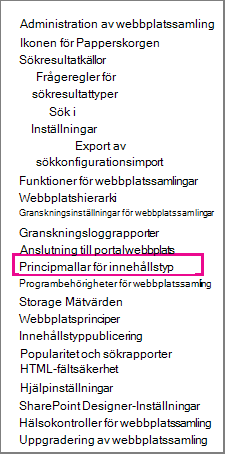
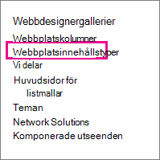

# Introduktion till informationshanteringsprinciperIntroduction to information management policies

En informationshanteringsprincip är en uppsättning regler för en typ av innehåll.An information management policy is a set of rules for a type of content. Med informationshanteringsprinciper kan organisationer styra och följa upp saker som hur länge innehåll behålls eller vilka åtgärder som användare kan vidta med innehållet.Information management policies enable organizations to control and track things like how long content is retained or what actions users can take with that content. Informationshanteringsprinciper kan hjälpa organisationer att efterleva juridiska eller statliga bestämmelser, eller så kan de helt enkelt tvinga igenom interna affärsprocesser.Information management policies can help organizations comply with legal or governmental regulations, or they can simply enforce internal business processes. 
  
En organisation som till exempel måste följa myndighetsregler som kräver att de visar upp "tillräcklig kontroll" över finansiella rapporter kan skapa en eller flera principer för informationshantering som granskar specifika åtgärder i redigerings- och godkännandeprocessen för alla dokument som är relaterade till ekonomisk rapportering.For example, an organization that must follow government regulations requiring that they demonstrate "adequate controls" of their financial statements might create one or more information management policies that audit specific actions in the authoring and approval process for all documents related to financial filings.
  
Mer information finns i Skapa [och använda informationshanteringsprinciper.](create-info-mgmt-policies.md)For how-to information, see [Create and apply information management policies](create-info-mgmt-policies.md).
  
## Funktioner i informationshanteringsprinciperFeatures of information management policies

Det finns fyra grundläggande kategorier med fördefinierade principfunktioner som organisationer kan använda individuellt eller i kombination för att hantera innehåll och processer.There are four basic categories of predefined policy features that organizations can use individually or in combination to manage content and processes. 
  

  
Med principfunktionen för granskning kan organisationer lättare analysera hur innehållshanteringssystemen används, genom att händelser och åtgärder som utförs i dokument och listobjekt loggas.The Auditing policy feature helps organizations analyze how their content management systems are used by logging events and operations that are performed on documents and list items. Du kan konfigurera principfunktionen för granskning för att logga händelser, till exempel när ett dokument eller objekt redigeras, visas, checkas in, checkas ut, tas bort eller får behörigheterna ändrade.You can configure the Auditing policy feature to log events such as when a document or item is edited, viewed, checked in, checked out, deleted, or has its permissions changed. All granskningsinformation lagras i en enskild granskningslogg på servern, och webbplatsadministratörer kan köra rapporter på den.All of the audit information is stored in a single audit log on the server, and site administrators can run reports on it. 
  
Med principfunktionen för förfallotid kan organisationer ta bort in uppdaterat innehåll från webbplatserna på ett konsekvent och spårbart sätt.The Expiration policy feature helps organizations delete or remove out-of-date content from their sites in a consistent, trackable way. På så sätt kan du hantera både kostnaden och risken som associeras med att behålla in uppdaterat innehåll.This helps you manage both the cost and risk associated with retaining out-of-date content. Du kan konfigurera en förfalloprincip för att ange att vissa typer av innehåll förfaller på ett visst datum eller inom en tidsperiod efter att dokumentet skapades eller senast ändrades.You can configure an Expiration policy to specify that certain types of content expire on a particular date or within a period of time after the document was created or last modified.
  
Organisationer kan också skapa och distribuera anpassade principfunktioner för att uppfylla specifika behov.Organizations can also create and deploy custom policy features to meet specific needs. En tillverkningsorganisation kanske till exempel vill definiera en informationshanteringsprincip för alla utkastdokument för produktdesignspecifikationer för att hindra användare från att skriva ut kopior av dessa dokument på skrivare som inte är osäkra.For example, a manufacturing organization might want to define an information management policy for all draft product-design specification documents that prohibits users from printing copies of these documents on nonsecure printers. Du kan definiera den här typen av informationshanteringsprincip genom att skapa och distribuera en principfunktion för utskriftsbegränsning som kan läggas till i relevant informationshanteringsprincip för innehållstypen för produktdesignspecifikationer.To define this kind of information management policy, you can create and deploy a Printing Restriction policy feature that can be added to the relevant information management policy for the product design specification content type.
  
## Platser där du kan använda en informationshanteringsprincipLocations to use an information management policy

Om du vill implementera en informationshanteringsprincip måste du lägga till den i en lista, ett bibliotek eller en innehållstyp på en webbplats.To implement an information management policy, you must add it to a list, library, or content type in a site. Den plats där du skapar eller lägger till en informationshanteringsprincip påverkar hur omfattande principen gäller och i vilken utsträckning den kan användas.The location where you create or add an information management policy affects how broadly the policy applies or how broadly it can be used. Du kan:You can:
  
 **Skapa en princip för en webbplatssamling och lägg sedan till den här principen i en innehållstyp, en lista eller ett bibliotek** Du kan skapa en princip för en webbplatssamling i listan Principer på den översta nivån i en webbplatssamling.**Create a site collection policy and then add this policy to a content type, list, or library** You can create a site collection policy in the Policies list in the top-level site of a site collection. När du har skapat en princip för en webbplatssamling kan du exportera den så att administratörer för andra webbplatssamlingar kan importera den till sin principlista.After you create a site collection policy, you can export it so that administrators of other site collections can import it into their Policies list. Om du skapar en princip för webbplatssamling som kan exporteras kan du standardisera informationshanteringsprinciperna mellan webbplatserna i organisationen.Creating an exportable site collection policy enables you to standardize the information management policies across the sites in your organization. 
  
När du lägger till en princip för en webbplatssamling i en webbplatsinnehållstyp, och en instans av den webbplatsinnehållstypen läggs till i en lista eller ett bibliotek, kan inte ägaren av listan eller biblioteket ändra webbplatssamlingsprincipen för listan eller biblioteket.When you add a site collection policy to a site content type, and an instance of that site content type is added to a list or library, the owner of that list or library cannot modify the site collection policy for the list or library. Att lägga till en princip för en webbplatssamling i en webbplatsinnehållstyp är ett bra sätt att säkerställa att webbplatssamlingsprinciper upprätthålls på varje nivå i webbplatshierarkin.Adding a site collection policy to a site content type is a good way to ensure that site collection policies are enforced at each level of your site hierarchy.
  

  
 **Skapa en informationshanteringsprincip** för en webbplatsinnehållstyp på den översta webbplatsens galleri för webbplatsinnehållstyp och lägg sedan till den innehållstypen i en eller flera listor eller bibliotek Du kan också skapa en informationshanteringsprincip direkt för en webbplatsinnehållstyp och sedan koppla en instans av den webbplatsinnehållstypen till flera listor eller bibliotek.**Create an information management policy for a site content type in the top-level site's Site Content Type Gallery, and then add that content type to one or more lists or libraries** You can also create an information management policy directly for a site content type and then associate an instance of that site content type with multiple lists or libraries. Om du skapar en informationshanteringsprincip på det här sättet gäller principen för alla objekt i webbplatssamlingen för den innehållstypen eller en innehållstyp som ärver från den innehållstypen.If you create an information management policy this way, every item in the site collection of that content type or a content type that inherits from that content type has the policy. Men om du skapar en informationshanteringsprincip direkt för en webbplatsinnehållstyp är det svårare att återanvända den här informationshanteringsprincipen i andra webbplatssamlingar, eftersom principer som skapas på det här sättet inte kan exporteras.However, if you create an information management policy directly for a site content type, it is more difficult to reuse this information management policy in other site collections, because policies that are created this way cannot be exported. 
  

  

  
Obs! Administratörer för webbplatssamlingar kan styra vilka principer som används i en webbplatssamling genom att inaktivera möjligheten att ange principfunktioner direkt för en innehållstyp.Note To control which policies are used in a site collection, site collection administrators can disable the ability to set policy features directly on a content type. När denna begränsning är i kraft är användare som skapar innehållstyper begränsade till att välja principer i listan med webbplatssamlingsprinciper.When this restriction is in effect, users who create content types are limited to selecting policies from the site collection Policies list.
  
 **Skapa en informationshanteringsprincip för en lista eller ett bibliotek** Om din organisation behöver tillämpa en viss informationshanteringsprincip på ett mycket begränsat innehåll kan du skapa en informationshanteringsprincip som endast gäller för en enskild lista eller ett enskilt bibliotek.**Create an information management policy for a list or library** If your organization needs to apply a specific information management policy to a very limited set of content, you can create an information management policy that applies only to an individual list or library. Den här metoden för att skapa en informationshanteringsprincip är den minst flexibla, eftersom principen bara gäller en plats och den kan inte exporteras eller återanvändas för andra platser.This method of creating an information management policy is the least flexible, because the policy applies only to one location, and it cannot be exported or reused for other locations. Men ibland kan du behöva skapa unika informationshanteringsprinciper med begränsad tillämplighet för att hantera specifika situationer.However, sometimes you may need to create unique information management policies with limited applicability to address specific situations. 
  

  
KommentarNotes 
  
Du kan skapa en informationshanteringsprincip för en lista eller ett bibliotek endast om listan eller biblioteket inte stöder flera innehållstyper.You can create an information management policy for a list or library only if that list or library does not support multiple content types. Om en lista eller ett bibliotek har stöd för flera innehållstyper, måste du definiera en informationshanteringsprincip för varje enskild listinnehållstyp som associeras med listan eller biblioteket.If a list or library supports multiple content types, you need to define an information management policy for each individual list content type that is associated with that list or library. (Instanser av en webbplatsinnehållstyp som associeras med en viss lista eller ett särskilt bibliotek kallas listinnehållstyper.)(Instances of a site content type that are associated with a specific list or library are known as list content types.)
  
Administratörer för webbplatssamlingar kan styra vilka principer som används i en webbplatssamling genom att inaktivera möjligheten att ange principfunktioner direkt för en lista eller ett bibliotek.To control which policies are used in a site collection, site collection administrators can disable the ability to set policy features directly on a list or library. När denna begränsning är i kraft är användare som hanterar listor eller bibliotek begränsade till att välja principer från listan med webbplatssamlingsprinciper.When this restriction is in effect, users who manage lists or libraries are limited to selecting policies from the site collection Policies list.
  
[En informationshanteringsprincip är en uppsättning regler för en typ av innehåll. Med informationshanteringsprinciper kan organisationer styra och följa upp saker som hur länge innehåll behålls eller vilka åtgärder som användare kan vidta med innehållet. Informationshanteringsprinciper kan hjälpa organisationer att efterleva juridiska eller statliga bestämmelser, eller så kan de helt enkelt tvinga igenom interna affärsprocesser. En organisation som till exempel måste följa myndighetsregler som kräver att de visar upp "tillräcklig kontroll" över finansiella rapporter kan skapa en eller flera principer för informationshantering som granskar specifika åtgärder i redigerings- och godkännandeprocessen för alla dokument som är relaterade till ekonomisk rapportering. Mer information finns i Skapa och använda informationshanteringsprinciper.An information management policy is a set of rules for a type of content. Information management policies enable organizations to control and track things like how long content is retained or what actions users can take with that content. Information management policies can help organizations comply with legal or governmental regulations, or they can simply enforce internal business processes. For example, an organization that must follow government regulations requiring that they demonstrate "adequate controls" of their financial statements might create one or more information management policies that audit specific actions in the authoring and approval process for all documents related to financial filings.For how-to information, see Create and apply information management policies.](intro-to-info-mgmt-policies.md#__top)
  

