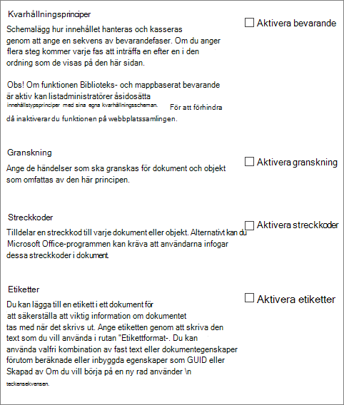

# Introduktion till informationshanteringsprinciper

En informationshanteringsprincip är en uppsättning regler för en typ av innehåll. Med informationshanteringsprinciper kan organisationer styra och följa upp saker som hur länge innehåll behålls eller vilka åtgärder som användare kan vidta med innehållet. Informationshanteringsprinciper kan hjälpa organisationer att efterleva juridiska eller statliga bestämmelser, eller så kan de helt enkelt tvinga igenom interna affärsprocesser. 
  
En organisation som till exempel måste följa myndighetsregler som kräver att de visar upp "tillräcklig kontroll" över finansiella rapporter kan skapa en eller flera principer för informationshantering som granskar specifika åtgärder i redigerings- och godkännandeprocessen för alla dokument som är relaterade till ekonomisk rapportering.
  
Mer information finns i Skapa [och använda informationshanteringsprinciper.](create-info-mgmt-policies.md)
  
## Funktioner i informationshanteringsprinciper

Det finns fyra grundläggande kategorier med fördefinierade principfunktioner som organisationer kan använda individuellt eller i kombination för att hantera innehåll och processer. 
  

  
Med principfunktionen för granskning kan organisationer lättare analysera hur innehållshanteringssystemen används, genom att händelser och åtgärder som utförs i dokument och listobjekt loggas. Du kan konfigurera principfunktionen för granskning för att logga händelser, till exempel när ett dokument eller objekt redigeras, visas, checkas in, checkas ut, tas bort eller får behörigheterna ändrade. All granskningsinformation lagras i en enskild granskningslogg på servern, och webbplatsadministratörer kan köra rapporter på den. 
  
Med principfunktionen för förfallotid kan organisationer ta bort in uppdaterat innehåll från webbplatserna på ett konsekvent och spårbart sätt. På så sätt kan du hantera både kostnaden och risken som associeras med att behålla in uppdaterat innehåll. Du kan konfigurera en förfalloprincip för att ange att vissa typer av innehåll förfaller på ett visst datum eller inom en tidsperiod efter att dokumentet skapades eller senast ändrades.
  
Organisationer kan också skapa och distribuera anpassade principfunktioner för att uppfylla specifika behov. En tillverkningsorganisation kanske till exempel vill definiera en informationshanteringsprincip för alla utkastdokument för produktdesignspecifikationer för att hindra användare från att skriva ut kopior av dessa dokument på skrivare som inte är osäkra. Du kan definiera den här typen av informationshanteringsprincip genom att skapa och distribuera en principfunktion för utskriftsbegränsning som kan läggas till i relevant informationshanteringsprincip för innehållstypen för produktdesignspecifikationer.
  
## Platser där du kan använda en informationshanteringsprincip

Om du vill implementera en informationshanteringsprincip måste du lägga till den i en lista, ett bibliotek eller en innehållstyp på en webbplats. Den plats där du skapar eller lägger till en informationshanteringsprincip påverkar hur omfattande principen gäller och i vilken utsträckning den kan användas. Du kan:
  
 **Skapa en princip för en webbplatssamling och lägg sedan till den här principen i en innehållstyp, en lista eller ett bibliotek** Du kan skapa en princip för en webbplatssamling i listan Principer på den översta nivån i en webbplatssamling. När du har skapat en princip för en webbplatssamling kan du exportera den så att administratörer för andra webbplatssamlingar kan importera den till sin principlista. Om du skapar en princip för webbplatssamling som kan exporteras kan du standardisera informationshanteringsprinciperna mellan webbplatserna i organisationen. 
  
När du lägger till en princip för en webbplatssamling i en webbplatsinnehållstyp, och en instans av den webbplatsinnehållstypen läggs till i en lista eller ett bibliotek, kan inte ägaren av listan eller biblioteket ändra webbplatssamlingsprincipen för listan eller biblioteket. Att lägga till en princip för en webbplatssamling i en webbplatsinnehållstyp är ett bra sätt att säkerställa att webbplatssamlingsprinciper upprätthålls på varje nivå i webbplatshierarkin.
  

  
 **Skapa en informationshanteringsprincip** för en webbplatsinnehållstyp på den översta webbplatsens galleri för webbplatsinnehållstyp och lägg sedan till den innehållstypen i en eller flera listor eller bibliotek Du kan också skapa en informationshanteringsprincip direkt för en webbplatsinnehållstyp och sedan koppla en instans av den webbplatsinnehållstypen till flera listor eller bibliotek. Om du skapar en informationshanteringsprincip på det här sättet gäller principen för alla objekt i webbplatssamlingen för den innehållstypen eller en innehållstyp som ärver från den innehållstypen. Men om du skapar en informationshanteringsprincip direkt för en webbplatsinnehållstyp är det svårare att återanvända den här informationshanteringsprincipen i andra webbplatssamlingar, eftersom principer som skapas på det här sättet inte kan exporteras. 
  

  

  
Obs! Administratörer för webbplatssamlingar kan styra vilka principer som används i en webbplatssamling genom att inaktivera möjligheten att ange principfunktioner direkt för en innehållstyp. När denna begränsning är i kraft är användare som skapar innehållstyper begränsade till att välja principer i listan med webbplatssamlingsprinciper.
  
 **Skapa en informationshanteringsprincip för en lista eller ett bibliotek** Om din organisation behöver tillämpa en viss informationshanteringsprincip på ett mycket begränsat innehåll kan du skapa en informationshanteringsprincip som endast gäller för en enskild lista eller ett enskilt bibliotek. Den här metoden för att skapa en informationshanteringsprincip är den minst flexibla, eftersom principen bara gäller en plats och den kan inte exporteras eller återanvändas för andra platser. Men ibland kan du behöva skapa unika informationshanteringsprinciper med begränsad tillämplighet för att hantera specifika situationer. 
  

  
Kommentar 
  
Du kan skapa en informationshanteringsprincip för en lista eller ett bibliotek endast om listan eller biblioteket inte stöder flera innehållstyper. Om en lista eller ett bibliotek har stöd för flera innehållstyper, måste du definiera en informationshanteringsprincip för varje enskild listinnehållstyp som associeras med listan eller biblioteket. (Instanser av en webbplatsinnehållstyp som associeras med en viss lista eller ett särskilt bibliotek kallas listinnehållstyper.)
  
Administratörer för webbplatssamlingar kan styra vilka principer som används i en webbplatssamling genom att inaktivera möjligheten att ange principfunktioner direkt för en lista eller ett bibliotek. När denna begränsning är i kraft är användare som hanterar listor eller bibliotek begränsade till att välja principer från listan med webbplatssamlingsprinciper.
  
[En informationshanteringsprincip är en uppsättning regler för en typ av innehåll. Med informationshanteringsprinciper kan organisationer styra och följa upp saker som hur länge innehåll behålls eller vilka åtgärder som användare kan vidta med innehållet. Informationshanteringsprinciper kan hjälpa organisationer att efterleva juridiska eller statliga bestämmelser, eller så kan de helt enkelt tvinga igenom interna affärsprocesser. En organisation som till exempel måste följa myndighetsregler som kräver att de visar upp "tillräcklig kontroll" över finansiella rapporter kan skapa en eller flera principer för informationshantering som granskar specifika åtgärder i redigerings- och godkännandeprocessen för alla dokument som är relaterade till ekonomisk rapportering. Mer information finns i Skapa och använda informationshanteringsprinciper.](intro-to-info-mgmt-policies.md#__top)
  

