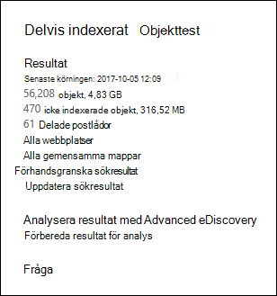
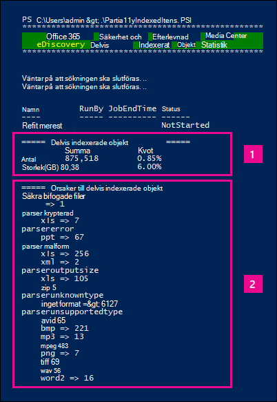

# <a name="investigating-partially-indexed-items-in-ediscovery"></a>Undersöker delvis indexerade objekt i eDiscovery

En eDiscovery-sökning som du kör från efterlevnadscentret för Microsoft 365 inkluderar automatiskt delvis indexerade objekt i det uppskattade sökresultatet när du kör en sökning. Delvis indexerade objekt Exchange postlådeobjekt och dokument på SharePoint och OneDrive för företag-webbplatser som av någon anledning inte indexerats helt för sökning. De flesta e-postmeddelanden och webbplatsdokument indexeras korrekt eftersom de faller inom [indexeringsbegränsningarna för e-postmeddelanden.](limits-for-content-search.md#indexing-limits-for-email-messages) Vissa objekt kan dock överskrida indexeringsgränserna och indexeras delvis. Här är andra orsaker till varför objekt inte kan indexeras för sökning och returneras som delvis indexerade objekt när du kör en eDiscovery-sökning:
  
- E-postmeddelanden har en bifogad fil utan en giltig hanterare, t.ex. bildfiler. det här är den vanligaste orsaken till delvis indexerade e-postobjekt.

- För många bifogade filer i ett e-postmeddelande.

- En fil som bifogas i ett e-postmeddelande är för stor.

- Filtypen stöds för indexering men ett indexeringsfel uppstod för en viss fil.

Även om innehållet varierar har de flesta organisationers kunder mindre än 1 % innehåll per volym och mindre än 12 % innehåll per storlek som är delvis indexerat. Orsaken till skillnaden mellan volym och storlek är att större filer har en högre sannolikhet för att innehåll som inte kan indexeras helt.
  
## <a name="why-does-the-partially-indexed-item-count-change-for-a-search"></a>Varför ändras antalet delvis indexerade objekt för en sökning?

När du har kört en eDiscovery-sökning visas det totala antalet och storleken på delvis indexerade objekt på de platser som har sökts i sökresultatstatistiken som visas i den detaljerade statistiken för sökningen. Observera att dessa kallas  *icke indexerade objekt*  i sökstatistiken. Här är några saker som påverkar antalet delvis indexerade objekt som returneras i sökresultaten:
  
- Om ett objekt är delvis indexerat och matchar sökfrågan inkluderas det i både antal (och storlek) för sökresultatobjekt och delvis indexerade objekt. Men när resultatet av samma sökning exporteras inkluderas objektet endast i uppsättningen sökresultat. det tas inte med som ett delvis indexerat objekt.

- Delvis indexerade objekt som finns SharePoint och OneDrive-webbplatser ingår inte i uppskattningen av delvis indexerade objekt som visas i den detaljerade statistiken för sökningen.  Delvis indexerade objekt kan emellertid exporteras när du exporterar resultatet av en eDiscovery-sökning. Om du till exempel bara söker på webbplatser blir det uppskattade antalet delvis indexerade objekt noll.
  
## <a name="calculating-the-ratio-of-partially-indexed-items-in-your-organization"></a>Beräkna förhållandet mellan delvis indexerade element i organisationen

För att förstå hur exponering av delvis indexerade objekt visas i organisationen kan du köra en sökning efter allt innehåll i alla postlådor (med hjälp av en tom nyckelordsfråga). I följande exempel finns det 56 208 (4 830 MB) helt indexerade objekt och 470 (316 MB) delvis indexerade objekt.
  

  
Du kan bestämma hur många procent av delvis indexerade element är med hjälp av följande beräkningar.
  
 **Så här beräknar du förhållandet mellan delvis indexerade element i organisationen:**

`(Total number of partially indexed items/Total number of items) x 100`

`(470/56,208) x 100 = 0.84%`

Med hjälp av sökresultaten från föregående exempel är 0,84 % av alla postlådeobjekt delvis indexerade.
  
 **Så här beräknar du procentandelen av storleken på delvis indexerade objekt i organisationen:**

`(Size of all partially indexed items/Size of all items) x 100`

`(316 MB/4830 MB) x 100 = 6.54%`

I exemplet ovan kommer alltså 6,54 % av den totala storleken på postlådeobjekt från delvis indexerade objekt. Som tidigare nämnts har de flesta organisationers kunder mindre än 1 % innehåll per volym och mindre än 12 % innehåll i storlek som är delvis indexerat.

## <a name="working-with-partially-indexed-items"></a>Arbeta med delvis indexerade objekt

Om du behöver undersöka delvisa objekt för att verifiera att de [](export-a-content-search-report.md) inte innehåller relevant information kan du exportera en innehållsökningsrapport som innehåller information om delvis indexerade objekt. När du exporterar en rapport för innehållssökning måste du välja ett exportalternativ som innehåller delvis indexerade objekt.
  

  
När du exporterar eDiscovery-sökresultat eller en sökrapport med något av följande alternativ innehåller exporten en rapport med namnet Icke indexerade Items.csv. Den här rapporten innehåller de flesta av samma information ResultsLog.csv filen. Men icke indexerade objekt Items.csv också två fält som är relaterade till delvis indexerade element: **Feltaggar** och **Felegenskaper.** De här fälten innehåller information om indexeringsfelet för varje delvis indexerat objekt. Genom att använda informationen i de här två fälten kan du avgöra om indexeringsfelet för en viss undersökning ska påverkas. Om så är möjligt kan du utföra en riktad sökning och hämta och exportera specifika e-postmeddelanden och SharePoint- eller OneDrive-dokument så att du kan undersöka dem för att avgöra om de är relevanta för din undersökning. Stegvisa anvisningar finns i Förbereda en [CSV-fil för en riktad sökning i Office 365](csv-file-for-an-id-list-content-search.md).

> [!NOTE]
> Den icke indexerade Items.csv innehåller även fält med **namnet Feltyp** **och Felmeddelande.** Det här är äldre fält som innehåller information som liknar informationen i fälten **Feltaggar** och **Felegenskaper,** men med mindre detaljerad information. Du kan bortse från dessa tidigare fält.
  
## <a name="errors-related-to-partially-indexed-items"></a>Fel som rör delvis indexerade objekt

Feltaggar består av två delar med information, felet och filtypen. I det här felet/filtypspar:

```text
 parseroutputsize_xls
```

 `parseroutputsize` är felet och `xls` är filtypen för filen som felet inträffade i. I fall där filtypen inte kunde identifieras eller filtypen inte kunde identifieras för felet visas värdet i stället för `noformat` filtypen.
  
Nedan följer en lista över indexeringsfel och en beskrivning av den möjliga orsaken till felet.
  
| Feltagg | Beskrivning |
|:-----|:-----|
| `attachmentcount` <br/> |Ett e-postmeddelande hade för många bifogade filer och vissa av dem hanterade inte.  <br/> |
| `attachmentdepth` <br/> |Innehållshämtare och dokument tolkade för många nivåer av bifogade filer kapslade i andra bifogade filer. Vissa av de här bifogade filerna har inte bearbetats.  <br/> |
| `attachmentrms` <br/> |En bifogad fil misslyckades med avkodningen eftersom den var RMS-skyddad.  <br/> |
| `attachmentsize` <br/> |En fil som bifogats i ett e-postmeddelande var för stor och kunde inte bearbetas.  <br/> |
| `indexingtruncated` <br/> |När det bearbetade e-postmeddelandet skrevs till indexet var en av de indexbara egenskaperna för stor och trunkerades. De trunkerade egenskaperna visas i fältet Felegenskaper.  <br/> |
| `invalidunicode` <br/> |Ett e-postmeddelande innehöll text som inte kunde bearbetas som giltig Unicode. Indexeringen för det här objektet kan vara ofullständig.  <br/> |
| `parserencrypted` <br/> |Innehållet i bifogade filer eller e-postmeddelanden krypteras och Microsoft 365 det inte gick att avkoda innehållet.  <br/> |
| `parsererror` <br/> |Ett okänt fel uppstod vid tolkning. Det här beror vanligtvis på en programfel eller en tjänstkrasch.  <br/> |
| `parserinputsize` <br/> |En bifogad fil var för stor för att parsern skulle kunna hantera och tolkning av den bifogade filen skedde inte eller slutfördes inte.  <br/> |
| `parsermalformed` <br/> |En bifogad fil var felaktig och kunde inte hanteras av parsern. Resultatet kan bero på gamla filformat, filer som skapats med inkompatibla program eller virus som utger sig för att vara något annat än påstådda.  <br/> |
| `parseroutputsize` <br/> |Utdata från tolkning av en bifogad fil var för stor och behövde trunkeras.  <br/> |
| `parserunknowntype` <br/> |En bifogad fil hade en filtyp Microsoft 365 kunde inte identifiera.  <br/> |
| `parserunsupportedtype` <br/> |En bifogad fil hade en filtyp Office 365 kunde identifiera, men det går inte att tolka den filtypen.  <br/> |
| `propertytoobig` <br/> |Värdet för en e-postegenskap i Exchange Store var för stort för att kunna hämtas och meddelandet kunde inte bearbetas. Det här händer vanligtvis bara med brödtexten i ett e-postmeddelande.  <br/> |
| `retrieverrms` <br/> |Det gick inte att avkoda ett RMS-skyddat meddelande för innehållshämtare.  <br/> |
| `wordbreakertruncated` <br/> |För många ord identifierades i dokumentet vid indexering. Bearbetningen av egenskapen upphörde när gränsen når gränsen och egenskapen trunkeras.  <br/> |

Felfält beskriver vilka fält som påverkas av bearbetningsfelet som visas i fältet Feltaggar. Om du söker efter en egenskap som eller , påverkas inte resultatet av sökningen om du fel  `subject`  `participants` i brödtexten i meddelandet. Det kan vara användbart när du ska avgöra exakt vilka delvis indexerade objekt som du kan behöva undersöka ytterligare.
  
## <a name="using-a-powershell-script-to-determine-your-organizations-exposure-to-partially-indexed-email-items"></a>Använda ett PowerShell-skript för att avgöra exponering av organisationen för delvis indexerade e-postobjekt

Följande steg visar hur du kör ett PowerShell-skript som söker efter alla objekt i alla Exchange-postlådor och sedan genererar en rapport om organisationens kvot för delvis indexerade e-postobjekt (efter antal och storlek) och visar antalet objekt (och deras filtyp) för varje indexeringsfel som uppstår. Använd feltaggsbeskrivningarna i föregående avsnitt för att identifiera indexeringsfelet.
  
1. Spara följande text i en Windows PowerShell skriptfil med hjälp av ett filnamnssuffix .ps1; till exempel `PartiallyIndexedItems.ps1` .

   ```powershell
     write-host "**************************************************"
     write-host "     Security & Compliance Center      " -foregroundColor yellow -backgroundcolor darkgreen
     write-host "   eDiscovery Partially Indexed Item Statistics   " -foregroundColor yellow -backgroundcolor darkgreen
     write-host "**************************************************"
     " " 
     # Create a search with Error Tags Refinders enabled
     Remove-ComplianceSearch "RefinerTest" -Confirm:$false -ErrorAction 'SilentlyContinue'
     New-ComplianceSearch -Name "RefinerTest" -ContentMatchQuery "size>0" -RefinerNames ErrorTags -ExchangeLocation ALL
     Start-ComplianceSearch "RefinerTest"
     # Loop while search is in progress
     do{
         Write-host "Waiting for search to complete..."
         Start-Sleep -s 5
         $complianceSearch = Get-ComplianceSearch "RefinerTest"
     }while ($complianceSearch.Status -ne 'Completed')
     $refiners = $complianceSearch.Refiners | ConvertFrom-Json
     $errorTagProperties = $refiners.Entries | Get-Member -MemberType NoteProperty
     $partiallyIndexedRatio = $complianceSearch.UnindexedItems / $complianceSearch.Items
     $partiallyIndexedSizeRatio = $complianceSearch.UnindexedSize / $complianceSearch.Size
     " "
     "===== Partially indexed items ====="
     "         Total          Ratio"
     "Count    {0:N0}{1:P2}" -f $complianceSearch.Items.ToString("N0").PadRight(15, " "), $partiallyIndexedRatio
     "Size(GB) {0:N2}{1:P2}" -f ($complianceSearch.Size / 1GB).ToString("N2").PadRight(15, " "), $partiallyIndexedSizeRatio
     " "
     Write-Host ===== Reasons for partially indexed items =====
     foreach($errorTagProperty in $errorTagProperties)
     {
         $name = $refiners.Entries.($errorTagProperty.Name).Name
         $count = $refiners.Entries.($errorTagProperty.Name).TotalCount
         $frag = $name.Split("{_}")
         $errorTag = $frag[0]
         $fileType = $frag[1]
         if ($errorTag -ne $lastErrorTag)
         {
             $errorTag
         }
         "    " + $fileType + " => " + $count
         $lastErrorTag = $errorTag
     }
   ```

2. [Anslut till Säkerhets- & Efterlevnadscenter PowerShell.](/powershell/exchange/exchange-online-powershell)

3. Gå till & i Security & Compliance Center, gå till mappen där du sparade skriptet i steg 1 och kör sedan skriptet. till exempel:

   ```powershell
   .\PartiallyIndexedItems.ps1
   ```

Här är ett exempel för den utdata som returneras av skriptet.
  


> [!NOTE]
> Observera följande:
>  
> - Det totala antalet och storleken på e-postobjekt och organisationens andel av delvis indexerade e-postobjekt (antal och storlek).
> 
> - En lista med feltaggar och motsvarande filtyper för vilka felet uppstod.
  
## <a name="see-also"></a>Se även

[Delvis indexerade objekt i eDiscovery](partially-indexed-items-in-content-search.md)