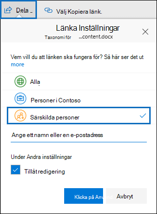

# <a name="keyword-queries-and-search-conditions-for-ediscovery"></a><span data-ttu-id="0578f-103">Nyckelordsfrågor och sökvillkor för eDiscovery</span><span class="sxs-lookup"><span data-stu-id="0578f-103">Keyword queries and search conditions for eDiscovery</span></span>

<span data-ttu-id="0578f-104">I det här avsnittet beskrivs de e-post- och dokumentegenskaper som du kan söka efter i e-postobjekt och Microsoft Teams-chattkonversationer i Exchange Online samt dokument som lagras på SharePoint- och OneDrive för företag-webbplatser med eDiscovery-sökverktygen i efterlevnadscentret för Microsoft 365.</span><span class="sxs-lookup"><span data-stu-id="0578f-104">This topic describes the email and document properties that you can search for in email items and Microsoft Teams chat conversations in Exchange Online, and documents stored on SharePoint and OneDrive for Business sites using the eDiscovery search tools in the Microsoft 365 compliance center.</span></span> <span data-ttu-id="0578f-105">Det omfattar innehållssökning, bas-eDiscovery och Advanced eDiscovery (eDiscovery-sökningar i Advanced eDiscovery kallas *samlingar).*</span><span class="sxs-lookup"><span data-stu-id="0578f-105">This includes Content search, Core eDiscovery, and Advanced eDiscovery (eDiscovery searches in Advanced eDiscovery are called *collections*).</span></span> <span data-ttu-id="0578f-106">Du kan också använda **\* cmdletarna -ComplianceSearch** i Security & Compliance Center PowerShell för att söka efter de här egenskaperna.</span><span class="sxs-lookup"><span data-stu-id="0578f-106">You can also use the **\*-ComplianceSearch** cmdlets in Security & Compliance Center PowerShell to search for these properties.</span></span> <span data-ttu-id="0578f-107">I det här avsnittet beskrivs också:</span><span class="sxs-lookup"><span data-stu-id="0578f-107">The topic also describes:</span></span>
  
- <span data-ttu-id="0578f-108">Använd booleska sökoperatorer, sökvillkor och andra sökfrågetekniker för att förfina sökresultaten.</span><span class="sxs-lookup"><span data-stu-id="0578f-108">Using Boolean search operators, search conditions, and other search query techniques to refine your search results.</span></span>

- <span data-ttu-id="0578f-109">Söker efter känsliga datatyper och anpassade typer av känsliga data i SharePoint och OneDrive för företag.</span><span class="sxs-lookup"><span data-stu-id="0578f-109">Searching for sensitive data types and custom sensitive data types in SharePoint and OneDrive for Business.</span></span>

- <span data-ttu-id="0578f-110">Söka efter webbplatsinnehåll som delas med användare utanför organisationen</span><span class="sxs-lookup"><span data-stu-id="0578f-110">Searching for site content that's shared with users outside of your organization</span></span>

<span data-ttu-id="0578f-111">Stegvisa instruktioner för hur du skapar olika eDiscovery-sökningar finns i:</span><span class="sxs-lookup"><span data-stu-id="0578f-111">For step-by-step instructions on how to create different eDiscovery searches, see:</span></span>

- [<span data-ttu-id="0578f-112">Innehållssökning</span><span class="sxs-lookup"><span data-stu-id="0578f-112">Content search</span></span>](content-search.md)

- [<span data-ttu-id="0578f-113">Söka efter innehåll i Bas-eDiscovery</span><span class="sxs-lookup"><span data-stu-id="0578f-113">Search for content in Core eDiscovery</span></span>](search-for-content-in-core-ediscovery.md)

- [<span data-ttu-id="0578f-114">Skapa ett utkast i Advanced eDiscovery</span><span class="sxs-lookup"><span data-stu-id="0578f-114">Create a draft collection in Advanced eDiscovery</span></span>](create-draft-collection.md)

> [!NOTE]
> <span data-ttu-id="0578f-115">eDiscovery-sökningar i efterlevnadscentret för Microsoft 365 och motsvarande **\* -ComplianceSearch-cmdlets** i Security & Compliance Center PowerShell använder Keyword Query Language (KQL).</span><span class="sxs-lookup"><span data-stu-id="0578f-115">eDiscovery searches in the Microsoft 365 compliance center and the corresponding **\*-ComplianceSearch** cmdlets in Security & Compliance Center PowerShell use the Keyword Query Language (KQL).</span></span> <span data-ttu-id="0578f-116">Mer detaljerad information finns i [Syntaxreferens för nyckelordsfrågaspråk.](/sharepoint/dev/general-development/keyword-query-language-kql-syntax-reference)</span><span class="sxs-lookup"><span data-stu-id="0578f-116">For more detailed information, see [Keyword Query Language syntax reference](/sharepoint/dev/general-development/keyword-query-language-kql-syntax-reference).</span></span>
  
## <a name="searchable-email-properties"></a><span data-ttu-id="0578f-117">Sökbara e-postegenskaper</span><span class="sxs-lookup"><span data-stu-id="0578f-117">Searchable email properties</span></span>

<span data-ttu-id="0578f-118">I följande tabell visas e-postegenskaper som kan sökas igenom med hjälp av eDiscovery-sökverktygen i efterlevnadscentret för Microsoft 365 eller med hjälp av **New-ComplianceSearch** eller **cmdleten Set-ComplianceSearch.**</span><span class="sxs-lookup"><span data-stu-id="0578f-118">The following table lists email message properties that can be searched by using the eDiscovery search tools in the Microsoft 365 compliance center or by using the **New-ComplianceSearch** or the **Set-ComplianceSearch** cmdlet.</span></span> <span data-ttu-id="0578f-119">Tabellen innehåller ett exempel på  _syntaxen property:value_ för varje egenskap och en beskrivning av sökresultaten som returneras av exemplen.</span><span class="sxs-lookup"><span data-stu-id="0578f-119">The table includes an example of the  _property:value_ syntax for each property and a description of the search results returned by the examples.</span></span> <span data-ttu-id="0578f-120">Du kan skriva dessa  `property:value` par i rutan nyckelord för en eDiscovery-sökning.</span><span class="sxs-lookup"><span data-stu-id="0578f-120">You can type these  `property:value` pairs in the keywords box for an eDiscovery search.</span></span> 

> [!NOTE]
> <span data-ttu-id="0578f-121">När du söker efter e-postegenskaper går det inte att söka efter objekt där den angivna egenskapen är tom eller tom.</span><span class="sxs-lookup"><span data-stu-id="0578f-121">When searching email properties, it's not possible to search for items in which the specified property is empty or blank.</span></span> <span data-ttu-id="0578f-122">Om du till exempel använder ämnesparet **property:value:""** när du söker efter e-postmeddelanden med en tom ämnesrad returneras noll resultat. </span><span class="sxs-lookup"><span data-stu-id="0578f-122">For example, using the *property:value* pair of **subject:""** to search for email messages with an empty subject line will return zero results.</span></span> <span data-ttu-id="0578f-123">Det här gäller även när du söker i egenskaper för webbplats och kontakt.</span><span class="sxs-lookup"><span data-stu-id="0578f-123">This also applies when searching site and contact properties.</span></span>
  
| <span data-ttu-id="0578f-124">Egenskap</span><span class="sxs-lookup"><span data-stu-id="0578f-124">Property</span></span> | <span data-ttu-id="0578f-125">Egenskapsbeskrivning</span><span class="sxs-lookup"><span data-stu-id="0578f-125">Property description</span></span> | <span data-ttu-id="0578f-126">Exempel</span><span class="sxs-lookup"><span data-stu-id="0578f-126">Examples</span></span> | <span data-ttu-id="0578f-127">Sökresultat som returneras av exemplen</span><span class="sxs-lookup"><span data-stu-id="0578f-127">Search results returned by the examples</span></span> |
|:-----|:-----|:-----|:-----|
|<span data-ttu-id="0578f-128">AttachmentNames</span><span class="sxs-lookup"><span data-stu-id="0578f-128">AttachmentNames</span></span>|<span data-ttu-id="0578f-129">Namnen på filerna som bifogats i ett e-postmeddelande.</span><span class="sxs-lookup"><span data-stu-id="0578f-129">The names of files attached to an email message.</span></span>|`attachmentnames:annualreport.ppt`  <br/> `attachmentnames:annual*` <br/> `attachmentnames:.pptx` |<span data-ttu-id="0578f-130">Meddelanden som har en bifogad fil med namnet annualreport.ppt.</span><span class="sxs-lookup"><span data-stu-id="0578f-130">Messages that have an attached file named annualreport.ppt.</span></span> <span data-ttu-id="0578f-131">I det andra exemplet returnerar jokertecknet ( \* ) meddelanden med ordet "årlig" i filnamnet på en bifogad fil.</span><span class="sxs-lookup"><span data-stu-id="0578f-131">In the second example, using the wildcard character ( \* ) returns messages with the word "annual" in the file name of an attachment.</span></span> <span data-ttu-id="0578f-132">Det tredje exemplet returnerar alla bifogade filer med pptx-filnamnstillägget.</span><span class="sxs-lookup"><span data-stu-id="0578f-132">The third example returns all attachments with the pptx file extension.</span></span>|
|<span data-ttu-id="0578f-133">Hemlig kopia</span><span class="sxs-lookup"><span data-stu-id="0578f-133">Bcc</span></span>|<span data-ttu-id="0578f-134">Fältet Hemlig kopia i ett e-postmeddelande. <sup>1</sup></span><span class="sxs-lookup"><span data-stu-id="0578f-134">The Bcc field of an email message.<sup>1</sup></span></span>|`bcc:pilarp@contoso.com`  <br/> `bcc:pilarp`  <br/> `bcc:"Pilar Pinilla"`|<span data-ttu-id="0578f-135">Alla exempel returnerar meddelanden med Pilar Pinilla som finns i fältet Hemlig kopia.</span><span class="sxs-lookup"><span data-stu-id="0578f-135">All examples return messages with Pilar Pinilla included in the Bcc field.</span></span>|
|<span data-ttu-id="0578f-136">Kategori</span><span class="sxs-lookup"><span data-stu-id="0578f-136">Category</span></span>| <span data-ttu-id="0578f-137">De kategorier som ska sökas.</span><span class="sxs-lookup"><span data-stu-id="0578f-137">The categories to search.</span></span> <span data-ttu-id="0578f-138">Kategorier kan definieras av användare med hjälp av Outlook eller Outlook på webben (hette tidigare Outlook Web App).</span><span class="sxs-lookup"><span data-stu-id="0578f-138">Categories can be defined by users by using Outlook or Outlook on the web (formerly known as Outlook Web App).</span></span> <span data-ttu-id="0578f-139">Möjliga värden är:</span><span class="sxs-lookup"><span data-stu-id="0578f-139">The possible values are:</span></span>  <br/><br/>  <span data-ttu-id="0578f-140">blå</span><span class="sxs-lookup"><span data-stu-id="0578f-140">blue</span></span>  <br/>  <span data-ttu-id="0578f-141">grön</span><span class="sxs-lookup"><span data-stu-id="0578f-141">green</span></span>  <br/>  <span data-ttu-id="0578f-142">orange</span><span class="sxs-lookup"><span data-stu-id="0578f-142">orange</span></span>  <br/>  <span data-ttu-id="0578f-143">lila</span><span class="sxs-lookup"><span data-stu-id="0578f-143">purple</span></span>  <br/>  <span data-ttu-id="0578f-144">röd</span><span class="sxs-lookup"><span data-stu-id="0578f-144">red</span></span>  <br/>  <span data-ttu-id="0578f-145">gul</span><span class="sxs-lookup"><span data-stu-id="0578f-145">yellow</span></span>|`category:"Red Category"`|<span data-ttu-id="0578f-146">Meddelanden som har tilldelats den röda kategorin i källpostlådorna.</span><span class="sxs-lookup"><span data-stu-id="0578f-146">Messages that have been assigned the red category in the source mailboxes.</span></span>|
|<span data-ttu-id="0578f-147">Kopia</span><span class="sxs-lookup"><span data-stu-id="0578f-147">Cc</span></span>|<span data-ttu-id="0578f-148">Fältet Kopia i ett e-postmeddelande. <sup>1</sup></span><span class="sxs-lookup"><span data-stu-id="0578f-148">The Cc field of an email message.<sup>1</sup></span></span>|`cc:pilarp@contoso.com`  <br/> `cc:"Pilar Pinilla"`|<span data-ttu-id="0578f-149">I båda exemplen har meddelanden där Pilar Pinilla angetts i fältet Kopia.</span><span class="sxs-lookup"><span data-stu-id="0578f-149">In both examples, messages with Pilar Pinilla specified in the Cc field.</span></span>|
|<span data-ttu-id="0578f-150">Folderid</span><span class="sxs-lookup"><span data-stu-id="0578f-150">Folderid</span></span>|<span data-ttu-id="0578f-151">Mapp-ID (GUID) för en viss postlådemapp.</span><span class="sxs-lookup"><span data-stu-id="0578f-151">The folder ID (GUID) of a specific mailbox folder.</span></span> <span data-ttu-id="0578f-152">Om du använder den här egenskapen ska du se till att söka i postlådan som den angivna mappen finns i.</span><span class="sxs-lookup"><span data-stu-id="0578f-152">If you use this property, be sure to search the mailbox that the specified folder is located in.</span></span> <span data-ttu-id="0578f-153">Endast den angivna mappen genomsöks.</span><span class="sxs-lookup"><span data-stu-id="0578f-153">Only the specified folder will be searched.</span></span> <span data-ttu-id="0578f-154">Undermappar i mappen genomsöks inte.</span><span class="sxs-lookup"><span data-stu-id="0578f-154">Any subfolders in the folder won't be searched.</span></span> <span data-ttu-id="0578f-155">Om du vill söka i undermappar måste du använda egenskapen Folderid för den undermapp du vill söka i.</span><span class="sxs-lookup"><span data-stu-id="0578f-155">To search subfolders, you need to use the Folderid property for the subfolder you want to search.</span></span>  <br/> <span data-ttu-id="0578f-156">Mer information om hur du söker efter egenskapen Folderid och använder ett skript för att hämta mapp-ID:na för en viss postlåda finns i Använda innehållssökning [för riktade samlingar.](use-content-search-for-targeted-collections.md)</span><span class="sxs-lookup"><span data-stu-id="0578f-156">For more information about searching for the Folderid property and using a script to obtain the folder IDs for a specific mailbox, see [Use Content search for targeted collections](use-content-search-for-targeted-collections.md).</span></span>|`folderid:4D6DD7F943C29041A65787E30F02AD1F00000000013A0000`  <br/> `folderid:2370FB455F82FC44BE31397F47B632A70000000001160000 AND participants:garthf@contoso.com`|<span data-ttu-id="0578f-157">I det första exemplet returneras alla objekt i den angivna postlådemappen.</span><span class="sxs-lookup"><span data-stu-id="0578f-157">The first example returns all items in the specified mailbox folder.</span></span> <span data-ttu-id="0578f-158">Det andra exemplet returnerar alla objekt i den angivna postlådemappen som har skickats eller tagits emot av garthf@contoso.com.</span><span class="sxs-lookup"><span data-stu-id="0578f-158">The second example returns all items in the specified mailbox folder that were sent or received by garthf@contoso.com.</span></span>|
|<span data-ttu-id="0578f-159">Från</span><span class="sxs-lookup"><span data-stu-id="0578f-159">From</span></span>|<span data-ttu-id="0578f-160">Avsändaren av ett e-postmeddelande. <sup>1</sup></span><span class="sxs-lookup"><span data-stu-id="0578f-160">The sender of an email message.<sup>1</sup></span></span>|`from:pilarp@contoso.com`  <br/> `from:contoso.com`|<span data-ttu-id="0578f-161">Meddelanden som skickas av den angivna användaren eller som skickas från en angiven domän.</span><span class="sxs-lookup"><span data-stu-id="0578f-161">Messages sent by the specified user or sent from a specified domain.</span></span>|
|<span data-ttu-id="0578f-162">HasAttachment</span><span class="sxs-lookup"><span data-stu-id="0578f-162">HasAttachment</span></span>|<span data-ttu-id="0578f-163">Anger om ett meddelande har en bifogad fil.</span><span class="sxs-lookup"><span data-stu-id="0578f-163">Indicates whether a message has an attachment.</span></span> <span data-ttu-id="0578f-164">Använd värdena **sant** eller **falskt.**</span><span class="sxs-lookup"><span data-stu-id="0578f-164">Use the values **true** or **false**.</span></span>|`from:pilar@contoso.com AND hasattachment:true`|<span data-ttu-id="0578f-165">Meddelanden som skickats av en angiven användare som har bifogade filer.</span><span class="sxs-lookup"><span data-stu-id="0578f-165">Messages sent by the specified user that have attachments.</span></span>|
|<span data-ttu-id="0578f-166">Prioritet</span><span class="sxs-lookup"><span data-stu-id="0578f-166">Importance</span></span>|<span data-ttu-id="0578f-167">Prioriteten för ett e-postmeddelande, som en avsändare kan ange när de skickar ett meddelande.</span><span class="sxs-lookup"><span data-stu-id="0578f-167">The importance of an email message, which a sender can specify when sending a message.</span></span> <span data-ttu-id="0578f-168">Som standard skickas meddelanden med normal prioritet, såvida inte avsändaren anger prioriteten som **hög** eller **låg.**</span><span class="sxs-lookup"><span data-stu-id="0578f-168">By default, messages are sent with normal importance, unless the sender sets the importance as **high** or **low**.</span></span>|`importance:high`  <br/> `importance:medium`  <br/> `importance:low`|<span data-ttu-id="0578f-169">Meddelanden som har markerats som hög prioritet, medelstor eller låg prioritet.</span><span class="sxs-lookup"><span data-stu-id="0578f-169">Messages that are marked as high importance, medium importance, or low importance.</span></span>|
|<span data-ttu-id="0578f-170">IsRead</span><span class="sxs-lookup"><span data-stu-id="0578f-170">IsRead</span></span>|<span data-ttu-id="0578f-171">Anger om meddelanden har lästs.</span><span class="sxs-lookup"><span data-stu-id="0578f-171">Indicates whether messages have been read.</span></span> <span data-ttu-id="0578f-172">Använd värdena **sant** eller **falskt.**</span><span class="sxs-lookup"><span data-stu-id="0578f-172">Use the values **true** or **false**.</span></span>|`isread:true`  <br/> `isread:false`|<span data-ttu-id="0578f-173">I det första exemplet returneras meddelanden med egenskapen IsRead inställd på **Sant.**</span><span class="sxs-lookup"><span data-stu-id="0578f-173">The first example returns messages with the IsRead property set to **True**.</span></span> <span data-ttu-id="0578f-174">I det andra exemplet returneras meddelanden där egenskapen IsRead är inställd på **False.**</span><span class="sxs-lookup"><span data-stu-id="0578f-174">The second example returns messages with the IsRead property set to **False**.</span></span>|
|<span data-ttu-id="0578f-175">ItemClass</span><span class="sxs-lookup"><span data-stu-id="0578f-175">ItemClass</span></span>|<span data-ttu-id="0578f-176">Använd den här egenskapen till att söka efter specifika datatyper från tredje part som organisationen importerat till Office 365.</span><span class="sxs-lookup"><span data-stu-id="0578f-176">Use this property to search specific third-party data types that your organization imported to Office 365.</span></span> <span data-ttu-id="0578f-177">Använd följande syntax för den här egenskapen:  `itemclass:ipm.externaldata.<third-party data type>*`</span><span class="sxs-lookup"><span data-stu-id="0578f-177">Use the following syntax for this property:  `itemclass:ipm.externaldata.<third-party data type>*`</span></span>|`itemclass:ipm.externaldata.Facebook* AND subject:contoso`  <br/> `itemclass:ipm.externaldata.Twitter* AND from:"Ann Beebe" AND "Northwind Traders"`|<span data-ttu-id="0578f-178">I det första exemplet returneras Facebook-objekt som innehåller ordet "contoso" i egenskapen Ämne.</span><span class="sxs-lookup"><span data-stu-id="0578f-178">The first example returns Facebook items that contain the word "contoso" in the Subject property.</span></span> <span data-ttu-id="0578f-179">Det andra exemplet returnerar Twitter-objekt som postades av Ann Beebe och som innehåller nyckelordet "Northwind Traders".</span><span class="sxs-lookup"><span data-stu-id="0578f-179">The second example returns Twitter items that were posted by Ann Beebe and that contain the keyword phrase "Northwind Traders".</span></span>  <br/> <span data-ttu-id="0578f-180">En fullständig lista med värden som ska användas för datatyper från tredje part för egenskapen ItemClass finns i Använda innehållssökning för att söka efter data från tredje part som har importerats [till Office 365](use-content-search-to-search-third-party-data-that-was-imported.md).</span><span class="sxs-lookup"><span data-stu-id="0578f-180">For a complete list of values to use for third-party data types for the ItemClass property, see [Use Content search to search third-party data that was imported to Office 365](use-content-search-to-search-third-party-data-that-was-imported.md).</span></span>|
|<span data-ttu-id="0578f-181">Sort</span><span class="sxs-lookup"><span data-stu-id="0578f-181">Kind</span></span>| <span data-ttu-id="0578f-182">Den typ av e-postmeddelande du vill söka efter.</span><span class="sxs-lookup"><span data-stu-id="0578f-182">The type of email message to search for.</span></span> <span data-ttu-id="0578f-183">Möjliga värden:</span><span class="sxs-lookup"><span data-stu-id="0578f-183">Possible values:</span></span>  <br/>  <span data-ttu-id="0578f-184">kontakter</span><span class="sxs-lookup"><span data-stu-id="0578f-184">contacts</span></span>  <br/>  <span data-ttu-id="0578f-185">dokument</span><span class="sxs-lookup"><span data-stu-id="0578f-185">docs</span></span>  <br/>  <span data-ttu-id="0578f-186">e-post</span><span class="sxs-lookup"><span data-stu-id="0578f-186">email</span></span>  <br/>  <span data-ttu-id="0578f-187">externaldata</span><span class="sxs-lookup"><span data-stu-id="0578f-187">externaldata</span></span>  <br/>  <span data-ttu-id="0578f-188">fax</span><span class="sxs-lookup"><span data-stu-id="0578f-188">faxes</span></span>  <br/>  <span data-ttu-id="0578f-189">snabbmeddelanden</span><span class="sxs-lookup"><span data-stu-id="0578f-189">im</span></span>  <br/>  <span data-ttu-id="0578f-190">journaler</span><span class="sxs-lookup"><span data-stu-id="0578f-190">journals</span></span>  <br/>  <span data-ttu-id="0578f-191">möten</span><span class="sxs-lookup"><span data-stu-id="0578f-191">meetings</span></span>  <br/>  <span data-ttu-id="0578f-192">microsoftteams (returnerar objekt från chattar, möten och samtal i Microsoft Teams)</span><span class="sxs-lookup"><span data-stu-id="0578f-192">microsoftteams (returns items from chats, meetings, and calls in Microsoft Teams)</span></span>  <br/>  <span data-ttu-id="0578f-193">anteckningar</span><span class="sxs-lookup"><span data-stu-id="0578f-193">notes</span></span>  <br/>  <span data-ttu-id="0578f-194">inlägg</span><span class="sxs-lookup"><span data-stu-id="0578f-194">posts</span></span>  <br/>  <span data-ttu-id="0578f-195">rssfeeds</span><span class="sxs-lookup"><span data-stu-id="0578f-195">rssfeeds</span></span>  <br/>  <span data-ttu-id="0578f-196">uppgifter</span><span class="sxs-lookup"><span data-stu-id="0578f-196">tasks</span></span>  <br/>  <span data-ttu-id="0578f-197">röstbrevlåda</span><span class="sxs-lookup"><span data-stu-id="0578f-197">voicemail</span></span>|`kind:email`  <br/> `kind:email OR kind:im OR kind:voicemail`  <br/> `kind:externaldata`|<span data-ttu-id="0578f-198">I det första exemplet returneras e-postmeddelanden som uppfyller sökvillkoren.</span><span class="sxs-lookup"><span data-stu-id="0578f-198">The first example returns email messages that meet the search criteria.</span></span> <span data-ttu-id="0578f-199">Det andra exemplet returnerar e-postmeddelanden, snabbmeddelandekonversationer (Skype för företag konversationer och chattar i Microsoft Teams) och röstmeddelanden som uppfyller sökvillkoren.</span><span class="sxs-lookup"><span data-stu-id="0578f-199">The second example returns email messages, instant messaging conversations (including Skype for Business conversations and chats in Microsoft Teams), and voice messages that meet the search criteria.</span></span> <span data-ttu-id="0578f-200">I det tredje exemplet returneras objekt som har importerats till postlådor i Microsoft 365 från datakällor från tredje part, till exempel Twitter, Facebook och Cisco Jabber, som uppfyller sökvillkoren.</span><span class="sxs-lookup"><span data-stu-id="0578f-200">The third example returns items that were imported to mailboxes in Microsoft 365 from third-party data sources, such as Twitter, Facebook, and Cisco Jabber, that meet the search criteria.</span></span> <span data-ttu-id="0578f-201">Mer information finns i [Arkivera data från tredje part i Office 365](https://www.microsoft.com/?ref=go).</span><span class="sxs-lookup"><span data-stu-id="0578f-201">For more information, see [Archiving third-party data in Office 365](https://www.microsoft.com/?ref=go).</span></span>|
|<span data-ttu-id="0578f-202">Deltagare</span><span class="sxs-lookup"><span data-stu-id="0578f-202">Participants</span></span>|<span data-ttu-id="0578f-203">Alla personer (fält) i ett e-postmeddelande.</span><span class="sxs-lookup"><span data-stu-id="0578f-203">All the people fields in an email message.</span></span> <span data-ttu-id="0578f-204">De här fälten är Från, Till, Kopia och Hemlig<sup>kopia. 1</sup></span><span class="sxs-lookup"><span data-stu-id="0578f-204">These fields are From, To, Cc, and Bcc.<sup>1</sup></span></span>|`participants:garthf@contoso.com`  <br/> `participants:contoso.com`|<span data-ttu-id="0578f-205">Meddelanden som skickas av eller skickas till garthf@contoso.com.</span><span class="sxs-lookup"><span data-stu-id="0578f-205">Messages sent by or sent to garthf@contoso.com.</span></span> <span data-ttu-id="0578f-206">Det andra exemplet returnerar alla meddelanden som skickats av eller skickats till en användare i contoso.com domän.</span><span class="sxs-lookup"><span data-stu-id="0578f-206">The second example returns all messages sent by or sent to a user in the contoso.com domain.</span></span>|
|<span data-ttu-id="0578f-207">Mottaget</span><span class="sxs-lookup"><span data-stu-id="0578f-207">Received</span></span>|<span data-ttu-id="0578f-208">Datumet då ett e-postmeddelande togs emot av en mottagare.</span><span class="sxs-lookup"><span data-stu-id="0578f-208">The date that an email message was received by a recipient.</span></span>|`received:04/15/2016`  <br/> `received>=01/01/2016 AND received<=03/31/2016`|<span data-ttu-id="0578f-209">Meddelanden som togs emot den 15 april 2016.</span><span class="sxs-lookup"><span data-stu-id="0578f-209">Messages that were received on April 15, 2016.</span></span> <span data-ttu-id="0578f-210">Det andra exemplet returnerar alla meddelanden som tagits emot mellan den 1 januari 2016 och den 31 mars 2016.</span><span class="sxs-lookup"><span data-stu-id="0578f-210">The second example returns all messages received between January 1, 2016 and March 31, 2016.</span></span>|
|<span data-ttu-id="0578f-211">Mottagare</span><span class="sxs-lookup"><span data-stu-id="0578f-211">Recipients</span></span>|<span data-ttu-id="0578f-212">Alla mottagarfält i ett e-postmeddelande.</span><span class="sxs-lookup"><span data-stu-id="0578f-212">All recipient fields in an email message.</span></span> <span data-ttu-id="0578f-213">De här fälten är Till, Kopia och Hemlig<sup>kopia. 1</sup></span><span class="sxs-lookup"><span data-stu-id="0578f-213">These fields are To, Cc, and Bcc.<sup>1</sup></span></span>|`recipients:garthf@contoso.com`  <br/> `recipients:contoso.com`|<span data-ttu-id="0578f-214">Meddelanden som skickas till garthf@contoso.com.</span><span class="sxs-lookup"><span data-stu-id="0578f-214">Messages sent to garthf@contoso.com.</span></span> <span data-ttu-id="0578f-215">I det andra exemplet returneras meddelanden som skickats till alla mottagare i contoso.com domän.</span><span class="sxs-lookup"><span data-stu-id="0578f-215">The second example returns messages sent to any recipient in the contoso.com domain.</span></span>|
|<span data-ttu-id="0578f-216">Skickat</span><span class="sxs-lookup"><span data-stu-id="0578f-216">Sent</span></span>|<span data-ttu-id="0578f-217">Datumet då ett e-postmeddelande skickades av avsändaren.</span><span class="sxs-lookup"><span data-stu-id="0578f-217">The date that an email message was sent by the sender.</span></span>|`sent:07/01/2016`  <br/> `sent>=06/01/2016 AND sent<=07/01/2016`|<span data-ttu-id="0578f-218">Meddelanden som skickades det angivna datumet eller som skickats inom det angivna datumintervallet.</span><span class="sxs-lookup"><span data-stu-id="0578f-218">Messages that were sent on the specified date or sent within the specified date range.</span></span>|
|<span data-ttu-id="0578f-219">Storlek</span><span class="sxs-lookup"><span data-stu-id="0578f-219">Size</span></span>|<span data-ttu-id="0578f-220">Storleken på ett objekt i byte.</span><span class="sxs-lookup"><span data-stu-id="0578f-220">The size of an item, in bytes.</span></span>|`size>26214400`  <br/> `size:1..1048567`|<span data-ttu-id="0578f-221">Meddelanden som är större än 25 MB.</span><span class="sxs-lookup"><span data-stu-id="0578f-221">Messages larger than 25 MB.</span></span> <span data-ttu-id="0578f-222">I det andra exemplet returneras meddelanden från 1 till 1 048 567 byte (1 MB) i storlek.</span><span class="sxs-lookup"><span data-stu-id="0578f-222">The second example returns messages from 1 through 1,048,567 bytes (1 MB) in size.</span></span>|
|<span data-ttu-id="0578f-223">Ämne</span><span class="sxs-lookup"><span data-stu-id="0578f-223">Subject</span></span>|<span data-ttu-id="0578f-224">Texten i ämnesraden i ett e-postmeddelande.</span><span class="sxs-lookup"><span data-stu-id="0578f-224">The text in the subject line of an email message.</span></span>  <br/> <span data-ttu-id="0578f-225">**Obs!** När du använder egenskapen Ämne i en fråga returnerar sökningen alla meddelanden där ämnesraden innehåller den text som du söker efter.</span><span class="sxs-lookup"><span data-stu-id="0578f-225">**Note:** When you use the Subject property in a query, the search returns all messages in which the subject line contains the text you're searching for.</span></span> <span data-ttu-id="0578f-226">Med andra ord returnerar frågan inte bara de meddelanden som matchar exakt.</span><span class="sxs-lookup"><span data-stu-id="0578f-226">In other words, the query doesn't return only those messages that have an exact match.</span></span> <span data-ttu-id="0578f-227">Om du till exempel söker efter innehåller resultaten meddelanden med  `subject:"Quarterly Financials"` ämnet Kvartalsvisa budget 2018.</span><span class="sxs-lookup"><span data-stu-id="0578f-227">For example, if you search for  `subject:"Quarterly Financials"`, your results will include messages with the subject "Quarterly Financials 2018".</span></span>|`subject:"Quarterly Financials"`  <br/> `subject:northwind`|<span data-ttu-id="0578f-228">Meddelanden som innehåller frasen "Kvartalsvis ekonomi" någonstans i texten på ämnesraden.</span><span class="sxs-lookup"><span data-stu-id="0578f-228">Messages that contain the phrase "Quarterly Financials" anywhere in the text of the subject line.</span></span> <span data-ttu-id="0578f-229">I det andra exemplet returneras alla meddelanden som innehåller ordet northwind i ämnesraden.</span><span class="sxs-lookup"><span data-stu-id="0578f-229">The second example returns all messages that contain the word northwind in the subject line.</span></span>|
|<span data-ttu-id="0578f-230">Till</span><span class="sxs-lookup"><span data-stu-id="0578f-230">To</span></span>|<span data-ttu-id="0578f-231">Fältet Till i ett e-postmeddelande. <sup>1</sup></span><span class="sxs-lookup"><span data-stu-id="0578f-231">The To field of an email message.<sup>1</sup></span></span>|`to:annb@contoso.com`  <br/> `to:annb ` <br/> `to:"Ann Beebe"`|<span data-ttu-id="0578f-232">Alla exempel returnerar meddelanden där Ann Beebe anges på raden Till:.</span><span class="sxs-lookup"><span data-stu-id="0578f-232">All examples return messages where Ann Beebe is specified in the To: line.</span></span>|
|||||
   
> [!NOTE]
> <span data-ttu-id="0578f-233"><sup>1</sup> För värdet för en mottagaregenskap kan  du använda e-postadress (kallas även huvudnamn eller UPN), visningsnamn eller alias för att ange en användare.</span><span class="sxs-lookup"><span data-stu-id="0578f-233"><sup>1</sup> For the value of a recipient property, you can use email address (also called *user principal name* or UPN), display name, or alias to specify a user.</span></span> <span data-ttu-id="0578f-234">Du kan till exempel använda annb@contoso.com, annb eller "Ann Beebe" för att ange användaren Ann Beebe.</span><span class="sxs-lookup"><span data-stu-id="0578f-234">For example, you can use annb@contoso.com, annb, or "Ann Beebe" to specify the user Ann Beebe.</span></span>

### <a name="recipient-expansion"></a><span data-ttu-id="0578f-235">Mottagarens expansion</span><span class="sxs-lookup"><span data-stu-id="0578f-235">Recipient expansion</span></span>

<span data-ttu-id="0578f-236">När du söker i någon av mottagarens egenskaper (Från, Till, Kopia, Hemlig kopia, Deltagare och Mottagare) försöker Microsoft 365 utöka identiteten för varje användare genom att leta upp dem i Azure Active Directory (Azure AD).</span><span class="sxs-lookup"><span data-stu-id="0578f-236">When searching any of the recipient properties (From, To, Cc, Bcc, Participants, and Recipients), Microsoft 365 attempts to expand the identity of each user by looking them up in Azure Active Directory (Azure AD).</span></span>  <span data-ttu-id="0578f-237">Om användaren hittas i Azure AD utvidgas frågan till att inkludera användarens e-postadress (eller UPN), alias, visningsnamn och LegacyExchangeDN.</span><span class="sxs-lookup"><span data-stu-id="0578f-237">If the user is found in Azure AD, the query is expanded to include the user's email address (or UPN), alias, display name, and LegacyExchangeDN.</span></span> <span data-ttu-id="0578f-238">En fråga som till exempel `participants:ronnie@contoso.com` expanderas till `participants:ronnie@contoso.com OR participants:ronnie OR participants:"Ronald Nelson" OR participants:"<LegacyExchangeDN>"` .</span><span class="sxs-lookup"><span data-stu-id="0578f-238">For example, a query such as `participants:ronnie@contoso.com` expands to `participants:ronnie@contoso.com OR participants:ronnie OR participants:"Ronald Nelson" OR participants:"<LegacyExchangeDN>"`.</span></span>

<span data-ttu-id="0578f-239">För att förhindra att mottagaren utökas lägger du till ett jokertecken (asterisk) i slutet av e-postadressen och använder ett minskat domännamn. Se till exempel `participants:"ronnie@contoso*"` till att omge e-postadressen med dubbla citattecken.</span><span class="sxs-lookup"><span data-stu-id="0578f-239">To prevent recipient expansion, add a wild card character (asterisk) to the end of the email address and use a reduced domain name; for example, `participants:"ronnie@contoso*"` Be sure to surround the email address with double quotation marks.</span></span>

<span data-ttu-id="0578f-240">Tänk dock på att förhindra att mottagaren utökas i sökfrågan kan resultera i att relevanta objekt inte returneras i sökresultatet.</span><span class="sxs-lookup"><span data-stu-id="0578f-240">However, be aware that preventing recipient expansion in the search query may result in relevant items not being returned in the search results.</span></span> <span data-ttu-id="0578f-241">E-postmeddelanden Exchange kan sparas med olika textformat i mottagarfälten.</span><span class="sxs-lookup"><span data-stu-id="0578f-241">Email messages in Exchange can be saved with different text formats in the recipient fields.</span></span> <span data-ttu-id="0578f-242">Mottagarens expansion är avsedd att minimera det här faktum genom att returnera meddelanden som kan innehålla olika textformat.</span><span class="sxs-lookup"><span data-stu-id="0578f-242">Recipient expansion is intended to help mitigate this fact by returning messages that may contain different text formats.</span></span> <span data-ttu-id="0578f-243">Så att förhindra att mottagare utökas kan resultera i att sökfrågan inte returnerar alla objekt som kan vara relevanta för din undersökning.</span><span class="sxs-lookup"><span data-stu-id="0578f-243">So preventing recipient expansion may result in the search query not returning all items that may be relevant to your investigation.</span></span>

> [!NOTE]
> <span data-ttu-id="0578f-244">Om du behöver granska eller minska de objekt som returneras av en sökfråga på grund av mottagarens expansion kan du använda Advanced eDiscovery.</span><span class="sxs-lookup"><span data-stu-id="0578f-244">If you need to review or reduce the items returned by a search query due to recipient expansion, consider using Advanced eDiscovery.</span></span> <span data-ttu-id="0578f-245">Du kan söka efter meddelanden (dra nytta av mottagarens expansion), lägga till dem i en granskningsuppsättning och sedan använda fråge- eller filter för att granska eller begränsa resultatet.</span><span class="sxs-lookup"><span data-stu-id="0578f-245">You can search for messages (taking advantage of recipient expansion), add them to a review set, and then use review set queries or filters to review or narrow the results.</span></span> <span data-ttu-id="0578f-246">Mer information finns i Samla [in data för ett ärende](collecting-data-for-ediscovery.md) och Skapa en fråga för data i en [granskningsuppsättning.](review-set-search.md)</span><span class="sxs-lookup"><span data-stu-id="0578f-246">For more information, see [Collect data for a case](collecting-data-for-ediscovery.md) and [Query the data in a review set](review-set-search.md).</span></span>

## <a name="searchable-site-properties"></a><span data-ttu-id="0578f-247">Sökbara webbplatsegenskaper</span><span class="sxs-lookup"><span data-stu-id="0578f-247">Searchable site properties</span></span>

<span data-ttu-id="0578f-248">I följande tabell visas några av de SharePoint- och OneDrive för företag-egenskaper som kan sökas med hjälp av eDiscovery-sökverktygen i efterlevnadscentret för Microsoft 365 eller med hjälp av **New-ComplianceSearch** eller cmdleten **Set-ComplianceSearch.**</span><span class="sxs-lookup"><span data-stu-id="0578f-248">The following table lists some of the SharePoint and OneDrive for Business properties that can be searched by using the eDiscovery search tools in the Microsoft 365 compliance Center or by using the **New-ComplianceSearch** or the **Set-ComplianceSearch** cmdlet.</span></span> <span data-ttu-id="0578f-249">Tabellen innehåller ett exempel på  _syntaxen property:value_ för varje egenskap och en beskrivning av sökresultaten som returneras av exemplen.</span><span class="sxs-lookup"><span data-stu-id="0578f-249">The table includes an example of the  _property:value_ syntax for each property and a description of the search results returned by the examples.</span></span> 
  
<span data-ttu-id="0578f-250">En fullständig lista över SharePoint egenskaper som kan sökas i finns i Översikt över crawlade och [hanterade egenskaper i SharePoint](/SharePoint/technical-reference/crawled-and-managed-properties-overview).</span><span class="sxs-lookup"><span data-stu-id="0578f-250">For a complete list of SharePoint properties that can be searched, see [Overview of crawled and managed properties in SharePoint](/SharePoint/technical-reference/crawled-and-managed-properties-overview).</span></span> <span data-ttu-id="0578f-251">Egenskaper som är markerade **med ett** Ja i **kolumnen Queryable** kan sökas igenom.</span><span class="sxs-lookup"><span data-stu-id="0578f-251">Properties marked with a **Yes** in the **Queryable** column can be searched.</span></span>
  
| <span data-ttu-id="0578f-252">Egenskap</span><span class="sxs-lookup"><span data-stu-id="0578f-252">Property</span></span> | <span data-ttu-id="0578f-253">Egenskapsbeskrivning</span><span class="sxs-lookup"><span data-stu-id="0578f-253">Property description</span></span> | <span data-ttu-id="0578f-254">Exempel</span><span class="sxs-lookup"><span data-stu-id="0578f-254">Example</span></span> | <span data-ttu-id="0578f-255">Sökresultat som returneras av exemplen</span><span class="sxs-lookup"><span data-stu-id="0578f-255">Search results returned by the examples</span></span> |
|:-----|:-----|:-----|:-----|
|<span data-ttu-id="0578f-256">Författare</span><span class="sxs-lookup"><span data-stu-id="0578f-256">Author</span></span>|<span data-ttu-id="0578f-257">Redigeringsfältet från Office, som finns kvar om ett dokument kopieras.</span><span class="sxs-lookup"><span data-stu-id="0578f-257">The author field from Office documents, which persists if a document is copied.</span></span> <span data-ttu-id="0578f-258">Om en användare till exempel skapar ett dokument och e-postmeddelanden till någon annan som sedan laddar upp det till SharePoint, behåller dokumentet den ursprungliga författaren.</span><span class="sxs-lookup"><span data-stu-id="0578f-258">For example, if a user creates a document and the emails it to someone else who then uploads it to SharePoint, the document will still retain the original author.</span></span> <span data-ttu-id="0578f-259">Se till att använda användarens visningsnamn för den här egenskapen.</span><span class="sxs-lookup"><span data-stu-id="0578f-259">Be sure to use the user's display name for this property.</span></span>|`author:"Garth Fort"`|<span data-ttu-id="0578f-260">Alla dokument som har redigerats av Garth Fort.</span><span class="sxs-lookup"><span data-stu-id="0578f-260">All documents that are authored by Garth Fort.</span></span>|
|<span data-ttu-id="0578f-261">ContentType</span><span class="sxs-lookup"><span data-stu-id="0578f-261">ContentType</span></span>|<span data-ttu-id="0578f-262">Den SharePoint för ett objekt, till exempel Objekt, Dokument eller Video.</span><span class="sxs-lookup"><span data-stu-id="0578f-262">The SharePoint content type of an item, such as Item, Document, or Video.</span></span>|`contenttype:document`|<span data-ttu-id="0578f-263">Alla dokument returneras.</span><span class="sxs-lookup"><span data-stu-id="0578f-263">All documents would be returned.</span></span>|
|<span data-ttu-id="0578f-264">Skapades</span><span class="sxs-lookup"><span data-stu-id="0578f-264">Created</span></span>|<span data-ttu-id="0578f-265">Datumet då ett objekt skapades.</span><span class="sxs-lookup"><span data-stu-id="0578f-265">The date that an item is created.</span></span>|`created>=06/01/2016`|<span data-ttu-id="0578f-266">Alla objekt som skapats den 1 juni 2016 eller efter den 1 juni 2016.</span><span class="sxs-lookup"><span data-stu-id="0578f-266">All items created on or after June 1, 2016.</span></span>|
|<span data-ttu-id="0578f-267">CreatedBy</span><span class="sxs-lookup"><span data-stu-id="0578f-267">CreatedBy</span></span>|<span data-ttu-id="0578f-268">Personen som skapade eller laddade upp ett objekt.</span><span class="sxs-lookup"><span data-stu-id="0578f-268">The person that created or uploaded an item.</span></span> <span data-ttu-id="0578f-269">Se till att använda användarens visningsnamn för den här egenskapen.</span><span class="sxs-lookup"><span data-stu-id="0578f-269">Be sure to use the user's display name for this property.</span></span>|`createdby:"Garth Fort"`|<span data-ttu-id="0578f-270">Alla objekt som skapats eller laddats upp av Garth Fort.</span><span class="sxs-lookup"><span data-stu-id="0578f-270">All items created or uploaded by Garth Fort.</span></span>|
|<span data-ttu-id="0578f-271">DetectedLanguage</span><span class="sxs-lookup"><span data-stu-id="0578f-271">DetectedLanguage</span></span>|<span data-ttu-id="0578f-272">Språket för ett objekt.</span><span class="sxs-lookup"><span data-stu-id="0578f-272">The language of an item.</span></span>|`detectedlanguage:english`|<span data-ttu-id="0578f-273">Alla objekt på engelska.</span><span class="sxs-lookup"><span data-stu-id="0578f-273">All items in English.</span></span>|
|<span data-ttu-id="0578f-274">DocumentLink</span><span class="sxs-lookup"><span data-stu-id="0578f-274">DocumentLink</span></span>|<span data-ttu-id="0578f-275">Sökvägen (URL) till en särskild mapp på en SharePoint eller OneDrive för företag webbplats.</span><span class="sxs-lookup"><span data-stu-id="0578f-275">The path (URL) of a specific folder on a SharePoint or OneDrive for Business site.</span></span> <span data-ttu-id="0578f-276">Om du använder den här egenskapen ska du se till att söka på webbplatsen där den angivna mappen finns.</span><span class="sxs-lookup"><span data-stu-id="0578f-276">If you use this property, be sure to search the site that the specified folder is located in.</span></span>  <br/> <span data-ttu-id="0578f-277">Om du vill returnera objekt i undermappar i mappen som du anger för dokumentlänkegenskapen måste du lägga till / i URL-adressen för den angivna \* mappen, till exempel  `documentlink: "https://contoso.sharepoint.com/Shared Documents/*"`</span><span class="sxs-lookup"><span data-stu-id="0578f-277">To return items located in subfolders of the folder that you specify for the documentlink property, you have to add /\* to the URL of the specified folder; for example,  `documentlink: "https://contoso.sharepoint.com/Shared Documents/*"`</span></span>  <br/> <br/><span data-ttu-id="0578f-278">Mer information om hur du söker efter dokumentlänkegenskapen och använder ett skript för att hämta URL-adresser till dokumentlänken för mappar på en viss webbplats finns i Använda innehållssökning för [riktade samlingar.](use-content-search-for-targeted-collections.md)</span><span class="sxs-lookup"><span data-stu-id="0578f-278">For more information about searching for the documentlink property and using a script to obtain the documentlink URLs for folders on a specific site, see [Use Content search for targeted collections](use-content-search-for-targeted-collections.md).</span></span>|`documentlink:"https://contoso-my.sharepoint.com/personal/garthf_contoso_com/Documents/Private"`  <br/> `documentlink:"https://contoso-my.sharepoint.com/personal/garthf_contoso_com/Documents/Shared with Everyone/*" AND filename:confidential`|<span data-ttu-id="0578f-279">I det första exemplet returneras alla objekt i OneDrive för företag mapp.</span><span class="sxs-lookup"><span data-stu-id="0578f-279">The first example returns all items in the specified OneDrive for Business folder.</span></span> <span data-ttu-id="0578f-280">Det andra exemplet returnerar dokument i den angivna webbplatsmappen (och alla undermappar) som innehåller ordet "konfidentiellt" i filnamnet.</span><span class="sxs-lookup"><span data-stu-id="0578f-280">The second example returns documents in the specified site folder (and all subfolders) that contain the word "confidential" in the file name.</span></span>|
|<span data-ttu-id="0578f-281">FileExtension</span><span class="sxs-lookup"><span data-stu-id="0578f-281">FileExtension</span></span>|<span data-ttu-id="0578f-282">Filnamnstillägget för en fil. Till exempel docx, ett, pptx eller xlsx.</span><span class="sxs-lookup"><span data-stu-id="0578f-282">The extension of a file; for example, docx, one, pptx, or xlsx.</span></span>|`fileextension:xlsx`|<span data-ttu-id="0578f-283">Alla Excel (Excel 2007 och senare)</span><span class="sxs-lookup"><span data-stu-id="0578f-283">All Excel files (Excel 2007 and later)</span></span>|
|<span data-ttu-id="0578f-284">Filnamn</span><span class="sxs-lookup"><span data-stu-id="0578f-284">FileName</span></span>|<span data-ttu-id="0578f-285">Namnet på en fil.</span><span class="sxs-lookup"><span data-stu-id="0578f-285">The name of a file.</span></span>|`filename:"marketing plan"`  <br/> `filename:estimate`|<span data-ttu-id="0578f-286">I det första exemplet returneras filer med den exakta frasen "marknadsföringsplan" i rubriken.</span><span class="sxs-lookup"><span data-stu-id="0578f-286">The first example returns files with the exact phrase "marketing plan" in the title.</span></span> <span data-ttu-id="0578f-287">Det andra exemplet returnerar filer med ordet "uppskattning" i filnamnet.</span><span class="sxs-lookup"><span data-stu-id="0578f-287">The second example returns files with the word "estimate" in the file name.</span></span>|
|<span data-ttu-id="0578f-288">LastModifiedTime</span><span class="sxs-lookup"><span data-stu-id="0578f-288">LastModifiedTime</span></span>|<span data-ttu-id="0578f-289">Datumet då ett objekt senast ändrades.</span><span class="sxs-lookup"><span data-stu-id="0578f-289">The date that an item was last changed.</span></span>|`lastmodifiedtime>=05/01/2016`  <br/> `lastmodifiedtime>=05/10/2016 AND lastmodifiedtime<=06/1/2016`|<span data-ttu-id="0578f-290">I det första exemplet returneras poster som ändrades den 1 maj 2016 eller efter den 1 maj 2016.</span><span class="sxs-lookup"><span data-stu-id="0578f-290">The first example returns items that were changed on or after May 1, 2016.</span></span> <span data-ttu-id="0578f-291">I det andra exemplet returneras poster som ändrats mellan den 1 maj 2016 och den 1 juni 2016.</span><span class="sxs-lookup"><span data-stu-id="0578f-291">The second example returns items changed between May 1, 2016 and June 1, 2016.</span></span>|
|<span data-ttu-id="0578f-292">ModifiedBy</span><span class="sxs-lookup"><span data-stu-id="0578f-292">ModifiedBy</span></span>|<span data-ttu-id="0578f-293">Den person som senast ändrade ett objekt.</span><span class="sxs-lookup"><span data-stu-id="0578f-293">The person who last changed an item.</span></span> <span data-ttu-id="0578f-294">Se till att använda användarens visningsnamn för den här egenskapen.</span><span class="sxs-lookup"><span data-stu-id="0578f-294">Be sure to use the user's display name for this property.</span></span>|`modifiedby:"Garth Fort"`|<span data-ttu-id="0578f-295">Alla objekt som senast ändrades av Garth Fort.</span><span class="sxs-lookup"><span data-stu-id="0578f-295">All items that were last changed by Garth Fort.</span></span>|
|<span data-ttu-id="0578f-296">Sökväg</span><span class="sxs-lookup"><span data-stu-id="0578f-296">Path</span></span>|<span data-ttu-id="0578f-297">Sökvägen (URL) till en viss webbplats på en SharePoint eller OneDrive för företag webbplats.</span><span class="sxs-lookup"><span data-stu-id="0578f-297">The path (URL) of a specific site in a SharePoint or OneDrive for Business site.</span></span><br/><br/><span data-ttu-id="0578f-298">Om du vill returnera objekt endast från den angivna webbplatsen måste du lägga till avslutande information i slutet av `/` URL:en, till exempel `path: "https://contoso.sharepoint.com/sites/international/"`</span><span class="sxs-lookup"><span data-stu-id="0578f-298">To return items only from the specified site, you have to add the trailing `/` to the end of the URL; for example, `path: "https://contoso.sharepoint.com/sites/international/"`</span></span> <br/><br/> <span data-ttu-id="0578f-299">Om du vill returnera objekt som finns i mappar på webbplatsen som du anger i sökvägsegenskapen måste du lägga till i slutet av `/*` URL-adressen, till exempel  `path: "https://contoso.sharepoint.com/Shared Documents/*"`</span><span class="sxs-lookup"><span data-stu-id="0578f-299">To return items located in folders in the site that you specify in the path property, you have to add `/*` to the end of the URL; for example,  `path: "https://contoso.sharepoint.com/Shared Documents/*"`</span></span>  <br/><br/> <span data-ttu-id="0578f-300">**Obs!** Om du använder egenskapen för OneDrive-platser returneras inte mediefiler, till exempel `Path` .png-, .tiff- eller .wav-filer, i sökresultatet.</span><span class="sxs-lookup"><span data-stu-id="0578f-300">**Note:** Using the  `Path` property to search OneDrive locations won't return media files, such as .png, .tiff, or .wav files, in the search results.</span></span> <span data-ttu-id="0578f-301">Använd en annan webbplatsegenskap i sökfrågan om du vill söka efter mediefiler OneDrive mappar.</span><span class="sxs-lookup"><span data-stu-id="0578f-301">Use a different site property in your search query to search for media files in OneDrive folders.</span></span> <br/>|`path:"https://contoso-my.sharepoint.com/personal/garthf_contoso_com/"`  <br/> `path:"https://contoso-my.sharepoint.com/personal/garthf_contoso_com/*" AND filename:confidential`|<span data-ttu-id="0578f-302">I det första exemplet returneras alla objekt på den OneDrive för företag webbplatsen.</span><span class="sxs-lookup"><span data-stu-id="0578f-302">The first example returns all items in the specified OneDrive for Business site.</span></span> <span data-ttu-id="0578f-303">Det andra exemplet returnerar dokument på den angivna webbplatsen (och mappar på webbplatsen) som innehåller ordet "konfidentiellt" i filnamnet.</span><span class="sxs-lookup"><span data-stu-id="0578f-303">The second example returns documents in the specified site (and folders in the site) that contain the word "confidential" in the file name.</span></span>|
|<span data-ttu-id="0578f-304">SharedWithUsersOWSUser</span><span class="sxs-lookup"><span data-stu-id="0578f-304">SharedWithUsersOWSUser</span></span>|<span data-ttu-id="0578f-305">Dokument som har delats med den  angivna användaren och visas på sidan Delas med mig på användarens OneDrive för företag webbplats.</span><span class="sxs-lookup"><span data-stu-id="0578f-305">Documents that have been shared with the specified user and displayed on the **Shared with me** page in the user's OneDrive for Business site.</span></span> <span data-ttu-id="0578f-306">Det här är dokument som uttryckligen har delats med den angivna användaren av andra i organisationen.</span><span class="sxs-lookup"><span data-stu-id="0578f-306">These are documents that have been explicitly shared with the specified user by other people in your organization.</span></span> <span data-ttu-id="0578f-307">När du exporterar dokument som matchar en sökfråga som använder egenskapen SharedWithUsersOWSUser exporteras dokumenten från den ursprungliga innehållsplatsen för den person som delade dokumentet med den angivna användaren.</span><span class="sxs-lookup"><span data-stu-id="0578f-307">When you export documents that match a search query that uses the SharedWithUsersOWSUser property, the documents are exported from the original content location of the person who shared the document with the specified user.</span></span> <span data-ttu-id="0578f-308">Mer information finns i Söka [efter webbplatsinnehåll som delas i organisationen.](#searching-for-site-content-shared-within-your-organization)</span><span class="sxs-lookup"><span data-stu-id="0578f-308">For more information, see [Searching for site content shared within your organization](#searching-for-site-content-shared-within-your-organization).</span></span>|`sharedwithusersowsuser:garthf`  <br/> `sharedwithusersowsuser:"garthf@contoso.com"`|<span data-ttu-id="0578f-309">Båda exemplen returnerar alla interna dokument som uttryckligen har  delats med Garth Fort och som visas på sidan Delas med mig i Garth Fort:s OneDrive för företag konto.</span><span class="sxs-lookup"><span data-stu-id="0578f-309">Both examples return all internal documents that have been explicitly shared with Garth Fort and that appear on the **Shared with me** page in Garth Fort's OneDrive for Business account.</span></span>|
|<span data-ttu-id="0578f-310">Webbplats</span><span class="sxs-lookup"><span data-stu-id="0578f-310">Site</span></span>|<span data-ttu-id="0578f-311">URL-adressen till en webbplats eller grupp av webbplatser i din organisation.</span><span class="sxs-lookup"><span data-stu-id="0578f-311">The URL of a site or group of sites in your organization.</span></span>|`site:"https://contoso-my.sharepoint.com"`  <br/> `site:"https://contoso.sharepoint.com/sites/teams"`|<span data-ttu-id="0578f-312">I det första exemplet returneras poster OneDrive för företag postwebbplatser för alla användare i organisationen.</span><span class="sxs-lookup"><span data-stu-id="0578f-312">The first example returns items from the OneDrive for Business sites for all users in the organization.</span></span> <span data-ttu-id="0578f-313">Det andra exemplet returnerar objekt från alla gruppwebbplatser.</span><span class="sxs-lookup"><span data-stu-id="0578f-313">The second example returns items from all team sites.</span></span>|
|<span data-ttu-id="0578f-314">Storlek</span><span class="sxs-lookup"><span data-stu-id="0578f-314">Size</span></span>|<span data-ttu-id="0578f-315">Storleken på ett objekt i byte.</span><span class="sxs-lookup"><span data-stu-id="0578f-315">The size of an item, in bytes.</span></span>|`size>=1`  <br/> `size:1..10000`|<span data-ttu-id="0578f-316">I det första exemplet returneras poster som är större än 1 byte.</span><span class="sxs-lookup"><span data-stu-id="0578f-316">The first example returns items larger than 1 byte.</span></span> <span data-ttu-id="0578f-317">I det andra exemplet returneras objekt från 1 till 10 000 byte i storlek.</span><span class="sxs-lookup"><span data-stu-id="0578f-317">The second example returns items from 1 through 10,000 bytes in size.</span></span>|
|<span data-ttu-id="0578f-318">Title</span><span class="sxs-lookup"><span data-stu-id="0578f-318">Title</span></span>|<span data-ttu-id="0578f-319">Dokumentets rubrik.</span><span class="sxs-lookup"><span data-stu-id="0578f-319">The title of the document.</span></span> <span data-ttu-id="0578f-320">Titelegenskapen är metadata som anges i Microsoft Office dokument.</span><span class="sxs-lookup"><span data-stu-id="0578f-320">The Title property is metadata that's specified in Microsoft Office documents.</span></span> <span data-ttu-id="0578f-321">Den skiljer sig från filnamnet i dokumentet.</span><span class="sxs-lookup"><span data-stu-id="0578f-321">It's different from the file name of the document.</span></span>|`title:"communication plan"`|<span data-ttu-id="0578f-322">Alla dokument som innehåller frasen "kommunikationsplan" i rubrikmetadataegenskapen för ett Office dokument.</span><span class="sxs-lookup"><span data-stu-id="0578f-322">Any document that contains the phrase "communication plan" in the Title metadata property of an Office document.</span></span>|
|||||

## <a name="searchable-contact-properties"></a><span data-ttu-id="0578f-323">Sökbara kontaktegenskaper</span><span class="sxs-lookup"><span data-stu-id="0578f-323">Searchable contact properties</span></span>

<span data-ttu-id="0578f-324">I följande tabell visas de kontaktegenskaper som är indexerade och som du kan söka efter med hjälp av eDiscovery-sökverktyg.</span><span class="sxs-lookup"><span data-stu-id="0578f-324">The following table lists the contact properties that are indexed and that you can search for using eDiscovery search tools.</span></span> <span data-ttu-id="0578f-325">Det här är de egenskaper som är tillgängliga för att konfigurera för kontakter (kallas även personliga kontakter) som finns i den personliga adressboken i en användares postlåda.</span><span class="sxs-lookup"><span data-stu-id="0578f-325">These are the properties that are available for users to configure for the contacts (also called personal contacts) that are located in the personal address book of a user's mailbox.</span></span> <span data-ttu-id="0578f-326">Om du vill söka efter kontakter kan du välja vilka postlådor du vill söka i och sedan använda en eller flera kontaktegenskaper i nyckelordsfrågan.</span><span class="sxs-lookup"><span data-stu-id="0578f-326">To search for contacts, you can select the mailboxes to search and then use one or more contact properties in the keyword query.</span></span>
  
> [!TIP]
> <span data-ttu-id="0578f-327">Om du vill söka efter värden som innehåller blanksteg eller specialtecken använder du dubbla citattecken (" ") som innehåller frasen; till exempel `businessaddress:"123 Main Street"` .</span><span class="sxs-lookup"><span data-stu-id="0578f-327">To search for values that contain spaces or special characters, use double quotation marks ("  ") to contain the phrase; for example, `businessaddress:"123 Main Street"`.</span></span>
  
|<span data-ttu-id="0578f-328">Egenskap</span><span class="sxs-lookup"><span data-stu-id="0578f-328">Property</span></span> |<span data-ttu-id="0578f-329">Egenskapsbeskrivning</span><span class="sxs-lookup"><span data-stu-id="0578f-329">Property description</span></span> |
|:-----|:-----|
|<span data-ttu-id="0578f-330">BusinessAddress</span><span class="sxs-lookup"><span data-stu-id="0578f-330">BusinessAddress</span></span>|<span data-ttu-id="0578f-331">Adressen i egenskapen **Företagsadress.**</span><span class="sxs-lookup"><span data-stu-id="0578f-331">The address in the **Business Address** property.</span></span> <span data-ttu-id="0578f-332">Egenskapen kallas även **Arbetsadress** på sidan kontaktegenskaper.</span><span class="sxs-lookup"><span data-stu-id="0578f-332">The property is also called the **Work** address on the contact properties page.</span></span>|
|<span data-ttu-id="0578f-333">BusinessPhone</span><span class="sxs-lookup"><span data-stu-id="0578f-333">BusinessPhone</span></span>|<span data-ttu-id="0578f-334">Telefonnumret i någon av egenskaperna **för Telefon** telefonnummer.</span><span class="sxs-lookup"><span data-stu-id="0578f-334">The phone number in any of the **Business Phone** number properties.</span></span>|
|<span data-ttu-id="0578f-335">Företagsnamn</span><span class="sxs-lookup"><span data-stu-id="0578f-335">CompanyName</span></span>|<span data-ttu-id="0578f-336">Namnet i **företagsegenskapen.**</span><span class="sxs-lookup"><span data-stu-id="0578f-336">The name in the **Company** property.</span></span>|
|<span data-ttu-id="0578f-337">Department</span><span class="sxs-lookup"><span data-stu-id="0578f-337">Department</span></span>|<span data-ttu-id="0578f-338">Namnet i **egenskapen** Avdelning.</span><span class="sxs-lookup"><span data-stu-id="0578f-338">The name in the **Department** property.</span></span>|
|<span data-ttu-id="0578f-339">DisplayName</span><span class="sxs-lookup"><span data-stu-id="0578f-339">DisplayName</span></span>|<span data-ttu-id="0578f-340">Kontaktens visningsnamn.</span><span class="sxs-lookup"><span data-stu-id="0578f-340">The display name of the contact.</span></span> <span data-ttu-id="0578f-341">Det här är namnet i **egenskapen Fullständigt** namn för kontakten.</span><span class="sxs-lookup"><span data-stu-id="0578f-341">This is the name in the **Full Name** property of the contact.</span></span>|
|<span data-ttu-id="0578f-342">EmailAddress</span><span class="sxs-lookup"><span data-stu-id="0578f-342">EmailAddress</span></span>|<span data-ttu-id="0578f-343">Adressen till valfri e-postadressegenskap för kontakten.</span><span class="sxs-lookup"><span data-stu-id="0578f-343">The address for any email address property for the contact.</span></span> <span data-ttu-id="0578f-344">Användare kan lägga till flera e-postadresser för en kontakt.</span><span class="sxs-lookup"><span data-stu-id="0578f-344">Users can add multiple email addresses for a contact.</span></span> <span data-ttu-id="0578f-345">Om du använder den här egenskapen returneras kontakter som matchar någon av kontaktens e-postadresser.</span><span class="sxs-lookup"><span data-stu-id="0578f-345">Using this property would return contacts that match any of the contact's email addresses.</span></span>|
|<span data-ttu-id="0578f-346">FileAs</span><span class="sxs-lookup"><span data-stu-id="0578f-346">FileAs</span></span>|<span data-ttu-id="0578f-347">Egenskapen **Spara som.**</span><span class="sxs-lookup"><span data-stu-id="0578f-347">The **File as** property.</span></span> <span data-ttu-id="0578f-348">Den här egenskapen används för att ange hur kontakten visas i användarens kontaktlista.</span><span class="sxs-lookup"><span data-stu-id="0578f-348">This property is used to specify how the contact is listed in the user's contact list.</span></span> <span data-ttu-id="0578f-349">En kontakt kan till exempel visas som *Förnamn,Efternamn* eller *Efternamn,Förnamn.*</span><span class="sxs-lookup"><span data-stu-id="0578f-349">For example, a contact could be listed as  *FirstName,LastName*  or  *LastName,FirstName*.</span></span>|
|<span data-ttu-id="0578f-350">GivenName</span><span class="sxs-lookup"><span data-stu-id="0578f-350">GivenName</span></span>|<span data-ttu-id="0578f-351">Namnet i egenskapen **Förnamn.**</span><span class="sxs-lookup"><span data-stu-id="0578f-351">The name in the **First Name** property.</span></span>|
|<span data-ttu-id="0578f-352">HomeAddress</span><span class="sxs-lookup"><span data-stu-id="0578f-352">HomeAddress</span></span>|<span data-ttu-id="0578f-353">Adressen i någon av egenskaperna **för Hemadress.**</span><span class="sxs-lookup"><span data-stu-id="0578f-353">The address in any of the **Home** address properties.</span></span>|
|<span data-ttu-id="0578f-354">Telefon, hem</span><span class="sxs-lookup"><span data-stu-id="0578f-354">HomePhone</span></span>|<span data-ttu-id="0578f-355">Telefonnumret i någon av **egenskaperna Hemtelefonnummer.**</span><span class="sxs-lookup"><span data-stu-id="0578f-355">The phone number in any of the **Home** phone number properties.</span></span>|
|<span data-ttu-id="0578f-356">IMAdress</span><span class="sxs-lookup"><span data-stu-id="0578f-356">IMAddress</span></span>|<span data-ttu-id="0578f-357">Egenskapen Snabbmeddelandeadress, som vanligtvis är en e-postadress som används för snabbmeddelanden.</span><span class="sxs-lookup"><span data-stu-id="0578f-357">The IM address property, which is typically an email address used for instant messaging.</span></span>|
|<span data-ttu-id="0578f-358">MiddleName</span><span class="sxs-lookup"><span data-stu-id="0578f-358">MiddleName</span></span>|<span data-ttu-id="0578f-359">Namnet i egenskapen **Mellannamn.**</span><span class="sxs-lookup"><span data-stu-id="0578f-359">The name in the **Middle** name property.</span></span>|
|<span data-ttu-id="0578f-360">Mobiltelefon</span><span class="sxs-lookup"><span data-stu-id="0578f-360">MobilePhone</span></span>|<span data-ttu-id="0578f-361">Telefonnumret i **egenskapen** Mobiltelefonnummer.</span><span class="sxs-lookup"><span data-stu-id="0578f-361">The phone number in the **Mobile** phone number property.</span></span>|
|<span data-ttu-id="0578f-362">Smeknamn</span><span class="sxs-lookup"><span data-stu-id="0578f-362">Nickname</span></span>|<span data-ttu-id="0578f-363">Namnet i egenskapen **Smeknamn.**</span><span class="sxs-lookup"><span data-stu-id="0578f-363">The name in the **Nickname** property.</span></span>|
|<span data-ttu-id="0578f-364">OfficeLocation</span><span class="sxs-lookup"><span data-stu-id="0578f-364">OfficeLocation</span></span>|<span data-ttu-id="0578f-365">Värdet i **Office** eller **Office plats.**</span><span class="sxs-lookup"><span data-stu-id="0578f-365">The value in **Office** or **Office location** property.</span></span>|
|<span data-ttu-id="0578f-366">OtherAddress</span><span class="sxs-lookup"><span data-stu-id="0578f-366">OtherAddress</span></span>|<span data-ttu-id="0578f-367">Värdet för egenskapen **Annan** adress.</span><span class="sxs-lookup"><span data-stu-id="0578f-367">The value for the **Other** address property.</span></span>|
|<span data-ttu-id="0578f-368">Efternamn</span><span class="sxs-lookup"><span data-stu-id="0578f-368">Surname</span></span>|<span data-ttu-id="0578f-369">Namnet i **egenskapen** Efternamn.</span><span class="sxs-lookup"><span data-stu-id="0578f-369">The name in the **Last** name property.</span></span>|
|<span data-ttu-id="0578f-370">Title</span><span class="sxs-lookup"><span data-stu-id="0578f-370">Title</span></span>|<span data-ttu-id="0578f-371">Rubriken i egenskapen **Befattning.**</span><span class="sxs-lookup"><span data-stu-id="0578f-371">The title in the **Job title** property.</span></span>|
|||||

## <a name="searchable-sensitive-data-types"></a><span data-ttu-id="0578f-372">Sökbara typer av känsliga data</span><span class="sxs-lookup"><span data-stu-id="0578f-372">Searchable sensitive data types</span></span>

<span data-ttu-id="0578f-373">Du kan använda sökverktygen för eDiscovery i kompatibilitetscentret för Microsoft 365 för att söka efter känsliga data, till exempel kreditkortsnummer och personnummer, som lagras i dokument på SharePoint och OneDrive för företag webbplatser.</span><span class="sxs-lookup"><span data-stu-id="0578f-373">You can use eDiscovery search tools in the Microsoft 365 compliance center to search for sensitive data, such as credit card numbers or social security numbers, that is stored in documents on SharePoint and OneDrive for Business sites.</span></span> <span data-ttu-id="0578f-374">Det kan du göra genom att använda `SensitiveType` egenskapen och namnet (eller ID) för en typ av känslig information i en nyckelordsfråga.</span><span class="sxs-lookup"><span data-stu-id="0578f-374">You can do this by using the `SensitiveType` property and the name (or ID) of a sensitive information type in a keyword query.</span></span> <span data-ttu-id="0578f-375">Frågan returnerar till `SensitiveType:"Credit Card Number"` exempel dokument som innehåller ett kreditkortsnummer.</span><span class="sxs-lookup"><span data-stu-id="0578f-375">For example, the query `SensitiveType:"Credit Card Number"` returns documents that contain a credit card number.</span></span> <span data-ttu-id="0578f-376">Frågan  `SensitiveType:"U.S. Social Security Number (SSN)"` returnerar dokument som innehåller ett amerikanskt personnummer.</span><span class="sxs-lookup"><span data-stu-id="0578f-376">The query  `SensitiveType:"U.S. Social Security Number (SSN)"` returns documents that contain a U.S. social security number.</span></span>

<span data-ttu-id="0578f-377">Om du vill visa en lista över de typer av känslig information som du kan söka efter går du till **Dataklassificeringstyperna** Känslig information i \>  Microsoft 365 kompatibilitetscenter.</span><span class="sxs-lookup"><span data-stu-id="0578f-377">To see a list of the sensitive information types that you can search for, go to **Data classifications** \> **Sensitive info types** in the Microsoft 365 compliance center.</span></span> <span data-ttu-id="0578f-378">Du kan också använda cmdleten **Get-DlpSensitiveInformationType** i Security & Compliance Center PowerShell för att visa en lista över typer av känslig information.</span><span class="sxs-lookup"><span data-stu-id="0578f-378">Or you can use the **Get-DlpSensitiveInformationType** cmdlet in Security & Compliance Center PowerShell to display a list of sensitive information types.</span></span>
  
<span data-ttu-id="0578f-379">Mer information om hur du skapar frågor med egenskapen finns i Skapa en fråga `SensitiveType` för att hitta känsliga data som [lagras på webbplatser.](form-a-query-to-find-sensitive-data-stored-on-sites.md)</span><span class="sxs-lookup"><span data-stu-id="0578f-379">For more information about creating queries using the `SensitiveType` property, see [Form a query to find sensitive data stored on sites](form-a-query-to-find-sensitive-data-stored-on-sites.md).</span></span>

### <a name="limitations-for-searching-sensitive-data-types"></a><span data-ttu-id="0578f-380">Begränsningar vid sökning efter känsliga datatyper</span><span class="sxs-lookup"><span data-stu-id="0578f-380">Limitations for searching sensitive data types</span></span>

- <span data-ttu-id="0578f-381">Om du vill söka efter anpassade typer av känslig information måste du ange ID för typen av känslig information i `SensitiveType` egenskapen.</span><span class="sxs-lookup"><span data-stu-id="0578f-381">To search for custom sensitive information types, you have to specify the ID of the sensitive information type in the `SensitiveType` property.</span></span> <span data-ttu-id="0578f-382">Om du använder namnet på en anpassad typ av känslig information (som i exemplet för de inbyggda typerna av känslig information i föregående avsnitt) returneras inga resultat.</span><span class="sxs-lookup"><span data-stu-id="0578f-382">Using the name of a custom sensitive information type (as shown in the example for built-in sensitive information types in the previous section) will return no results.</span></span> <span data-ttu-id="0578f-383">Använd **kolumnen Publisher** på sidan  Typer av känslig information i efterlevnadscentret (eller **egenskapen Publisher** i PowerShell) för att skilja mellan inbyggda och anpassade typer av känslig information.</span><span class="sxs-lookup"><span data-stu-id="0578f-383">Use the **Publisher** column on the **Sensitive info types** page in the compliance center (or the **Publisher** property in PowerShell) to differentiate between built-in and custom sensitive information types.</span></span> <span data-ttu-id="0578f-384">Inbyggda typer av känsliga data har värdet `Microsoft Corporation` för egenskapen **Publisher.**</span><span class="sxs-lookup"><span data-stu-id="0578f-384">Built-in sensitive data types have a value of `Microsoft Corporation` for the **Publisher** property.</span></span>

  <span data-ttu-id="0578f-385">Om du vill visa namn och ID för anpassade känsliga datatyper i organisationen kör du följande kommando i Security & Compliance Center PowerShell:</span><span class="sxs-lookup"><span data-stu-id="0578f-385">To display the name and ID for the custom sensitive data types in your organization, run the following command in Security & Compliance Center PowerShell:</span></span>

  ```powershell
  Get-DlpSensitiveInformationType | Where-Object {$_.Publisher -ne "Microsoft Corporation"} | FT Name,Id
  ```

  <span data-ttu-id="0578f-386">Sedan kan du använda ID:t i `SensitiveType` sökegenskapen för att returnera dokument som innehåller den anpassade känsliga datatypen, till exempel `SensitiveType:7e13277e-6b04-3b68-94ed-1aeb9d47de37`</span><span class="sxs-lookup"><span data-stu-id="0578f-386">Then you can use the ID in the `SensitiveType` search property to return documents that contain the custom sensitive data type; for example, `SensitiveType:7e13277e-6b04-3b68-94ed-1aeb9d47de37`</span></span>
  
- <span data-ttu-id="0578f-387">Du kan inte använda typer av känslig information och sökegenskapen till att söka efter känsliga data i `SensitiveType` Exchange Online postlådor.</span><span class="sxs-lookup"><span data-stu-id="0578f-387">You can't use sensitive information types and the `SensitiveType` search property to search for sensitive data at-rest in Exchange Online mailboxes.</span></span> <span data-ttu-id="0578f-388">Det inkluderar privata chattmeddelanden, 1:N gruppchattmeddelanden och teamkanalkonversationer i Microsoft Teams eftersom allt innehåll lagras i postlådor.</span><span class="sxs-lookup"><span data-stu-id="0578f-388">This includes 1:1 chat messages, 1:N group chat messages, and team channel conversations in Microsoft teams because all of this content is stored in mailboxes.</span></span> <span data-ttu-id="0578f-389">Du kan emellertid använda principer för dataförlustskydd (DLP) för att skydda känsliga e-postdata under överföring.</span><span class="sxs-lookup"><span data-stu-id="0578f-389">However, you can use data loss prevention (DLP) policies to protect sensitive email data in transit.</span></span> <span data-ttu-id="0578f-390">Mer information finns i [Läs mer om skydd mot dataförlust](dlp-learn-about-dlp.md) och Söka efter och hitta [personuppgifter.](/compliance/regulatory/gdpr)</span><span class="sxs-lookup"><span data-stu-id="0578f-390">For more information, see [Learn about data loss prevention](dlp-learn-about-dlp.md) and [Search for and find personal data](/compliance/regulatory/gdpr).</span></span>
  
## <a name="search-operators"></a><span data-ttu-id="0578f-391">Sökoperatorer</span><span class="sxs-lookup"><span data-stu-id="0578f-391">Search operators</span></span>

<span data-ttu-id="0578f-392">Booleska sökoperatorer som **AND,** **OR** och **NOT** hjälper dig att definiera mer exakta sökningar genom att inkludera eller exkludera specifika ord i sökfrågan.</span><span class="sxs-lookup"><span data-stu-id="0578f-392">Boolean search operators, such as **AND**, **OR**, and **NOT**, help you define more-precise searches by including or excluding specific words in the search query.</span></span> <span data-ttu-id="0578f-393">Andra tekniker, som att använda egenskapsoperatorer (t.ex. eller ), citattecken, parenteser och jokertecken, hjälper dig att förfina `>=` `..` en sökfråga.</span><span class="sxs-lookup"><span data-stu-id="0578f-393">Other techniques, such as using property operators (such as `>=` or `..`), quotation marks, parentheses, and wildcards, help you refine a search query.</span></span> <span data-ttu-id="0578f-394">I följande tabell visas operatorer som du kan använda för att begränsa eller bredda sökresultaten.</span><span class="sxs-lookup"><span data-stu-id="0578f-394">The following table lists the operators that you can use to narrow or broaden search results.</span></span> 
  
|<span data-ttu-id="0578f-395">Operator</span><span class="sxs-lookup"><span data-stu-id="0578f-395">Operator</span></span> |<span data-ttu-id="0578f-396">Användning</span><span class="sxs-lookup"><span data-stu-id="0578f-396">Usage</span></span> |<span data-ttu-id="0578f-397">Beskrivning</span><span class="sxs-lookup"><span data-stu-id="0578f-397">Description</span></span> |
|:-----|:-----|:-----|
|<span data-ttu-id="0578f-398">OCH</span><span class="sxs-lookup"><span data-stu-id="0578f-398">AND</span></span>|<span data-ttu-id="0578f-399">nyckelord1 OCH nyckelord2</span><span class="sxs-lookup"><span data-stu-id="0578f-399">keyword1 AND keyword2</span></span>|<span data-ttu-id="0578f-400">Returnerar objekt som innehåller alla angivna nyckelord eller  `property:value` uttryck.</span><span class="sxs-lookup"><span data-stu-id="0578f-400">Returns items that include all of the specified keywords or  `property:value` expressions.</span></span> <span data-ttu-id="0578f-401">Skulle till exempel  `from:"Ann Beebe" AND subject:northwind` returnera alla meddelanden som skickats av Ann Beebe som innehöll ordet northwind i ämnesraden.</span><span class="sxs-lookup"><span data-stu-id="0578f-401">For example,  `from:"Ann Beebe" AND subject:northwind` would return all messages sent by Ann Beebe that contained the word northwind in the subject line.</span></span> <span data-ttu-id="0578f-402"><sup>2</sup></span><span class="sxs-lookup"><span data-stu-id="0578f-402"><sup>2</sup></span></span>|
|+|<span data-ttu-id="0578f-403">nyckelord1 + nyckelord2 + nyckelord3</span><span class="sxs-lookup"><span data-stu-id="0578f-403">keyword1 + keyword2 + keyword3</span></span>|<span data-ttu-id="0578f-404">Returnerar poster som *innehåller* `keyword2` `keyword3` *antingen eller och* som också innehåller `keyword1` .  </span><span class="sxs-lookup"><span data-stu-id="0578f-404">Returns items that contain  *either*  `keyword2` or  `keyword3` *and*  that also contain  `keyword1`.</span></span> <span data-ttu-id="0578f-405">Det här exemplet motsvarar därför frågan  `(keyword2 OR keyword3) AND keyword1` .</span><span class="sxs-lookup"><span data-stu-id="0578f-405">Therefore, this example is equivalent to the query  `(keyword2 OR keyword3) AND keyword1`.</span></span>  <br/> <span data-ttu-id="0578f-406">Frågan `keyword1 + keyword2` (med ett blanksteg efter **+** symbolen) är inte samma sak som att använda **operatorn OCH.**</span><span class="sxs-lookup"><span data-stu-id="0578f-406">The query  `keyword1 + keyword2` (with a space after the **+** symbol) isn't the same as using the **AND** operator.</span></span> <span data-ttu-id="0578f-407">Den här frågan motsvarar och  `"keyword1 + keyword2"` returnerar objekt med den exakta fasen  `"keyword1 + keyword2"` .</span><span class="sxs-lookup"><span data-stu-id="0578f-407">This query would be equivalent to  `"keyword1 + keyword2"` and return items with the exact phase  `"keyword1 + keyword2"`.</span></span>|
|<span data-ttu-id="0578f-408">ELLER</span><span class="sxs-lookup"><span data-stu-id="0578f-408">OR</span></span>|<span data-ttu-id="0578f-409">nyckelord1 ELLER nyckelord2</span><span class="sxs-lookup"><span data-stu-id="0578f-409">keyword1 OR keyword2</span></span>|<span data-ttu-id="0578f-410">Returnerar objekt som innehåller ett eller flera av de angivna nyckelorden eller  `property:value` uttrycken.</span><span class="sxs-lookup"><span data-stu-id="0578f-410">Returns items that include one or more of the specified keywords or  `property:value` expressions.</span></span> <span data-ttu-id="0578f-411"><sup>2</sup></span><span class="sxs-lookup"><span data-stu-id="0578f-411"><sup>2</sup></span></span>|
|<span data-ttu-id="0578f-412">NOT</span><span class="sxs-lookup"><span data-stu-id="0578f-412">NOT</span></span>|<span data-ttu-id="0578f-413">nyckelord1 NOT nyckelord2</span><span class="sxs-lookup"><span data-stu-id="0578f-413">keyword1 NOT keyword2</span></span>  <br/> <span data-ttu-id="0578f-414">INTE från:"Ann Beebe"</span><span class="sxs-lookup"><span data-stu-id="0578f-414">NOT from:"Ann Beebe"</span></span>  <br/> <span data-ttu-id="0578f-415">NOT sort:im</span><span class="sxs-lookup"><span data-stu-id="0578f-415">NOT kind:im</span></span>|<span data-ttu-id="0578f-416">Exkluderar objekt som anges med ett nyckelord eller ett  `property:value` uttryck.</span><span class="sxs-lookup"><span data-stu-id="0578f-416">Excludes items specified by a keyword or a  `property:value` expression.</span></span> <span data-ttu-id="0578f-417">I det andra exemplet undantas meddelanden som skickas av Ann Beebe.</span><span class="sxs-lookup"><span data-stu-id="0578f-417">In the second example excludes messages sent by Ann Beebe.</span></span> <span data-ttu-id="0578f-418">Det tredje exemplet exkluderar snabbmeddelandekonversationer, till exempel Skype för företag konversationer som sparas i postlådemappen Konversationshistorik.</span><span class="sxs-lookup"><span data-stu-id="0578f-418">The third example excludes any instant messaging conversations, such as Skype for Business conversations that are saved to the Conversation History mailbox folder.</span></span> <span data-ttu-id="0578f-419"><sup>2</sup></span><span class="sxs-lookup"><span data-stu-id="0578f-419"><sup>2</sup></span></span>|
|-|<span data-ttu-id="0578f-420">keyword1 -keyword2</span><span class="sxs-lookup"><span data-stu-id="0578f-420">keyword1 -keyword2</span></span>|<span data-ttu-id="0578f-421">Samma som **operatorn NOT.**</span><span class="sxs-lookup"><span data-stu-id="0578f-421">The same as the **NOT** operator.</span></span> <span data-ttu-id="0578f-422">Den här frågan returnerar objekt som  `keyword1` innehåller och exkluderar objekt som innehåller  `keyword2` .</span><span class="sxs-lookup"><span data-stu-id="0578f-422">So this query returns items that contain  `keyword1` and would exclude items that contain  `keyword2`.</span></span>|
|<span data-ttu-id="0578f-423">NEAR</span><span class="sxs-lookup"><span data-stu-id="0578f-423">NEAR</span></span>|<span data-ttu-id="0578f-424">nyckelord1 NEAR(n) nyckelord2</span><span class="sxs-lookup"><span data-stu-id="0578f-424">keyword1 NEAR(n) keyword2</span></span>|<span data-ttu-id="0578f-425">Returnerar poster med ord som är nära varandra, där n är lika med antalet ord från varandra.</span><span class="sxs-lookup"><span data-stu-id="0578f-425">Returns items with words that are near each other, where n equals the number of words apart.</span></span> <span data-ttu-id="0578f-426">Returnerar exempelvis `best NEAR(5) worst` alla objekt där ordet "sämsta" finns inom fem ord av "bäst".</span><span class="sxs-lookup"><span data-stu-id="0578f-426">For example, `best NEAR(5) worst` returns any item where the word "worst" is within five words of "best".</span></span> <span data-ttu-id="0578f-427">Om inget tal anges är standardavståndet åtta ord.</span><span class="sxs-lookup"><span data-stu-id="0578f-427">If no number is specified, the default distance is eight words.</span></span> <span data-ttu-id="0578f-428"><sup>2</sup></span><span class="sxs-lookup"><span data-stu-id="0578f-428"><sup>2</sup></span></span>|
|<span data-ttu-id="0578f-429">:</span><span class="sxs-lookup"><span data-stu-id="0578f-429">:</span></span>|<span data-ttu-id="0578f-430">property:value</span><span class="sxs-lookup"><span data-stu-id="0578f-430">property:value</span></span>|<span data-ttu-id="0578f-431">Kolontecknet (:) i  `property:value` syntaxen anger att värdet på egenskapen som genomsöks innehåller det angivna värdet.</span><span class="sxs-lookup"><span data-stu-id="0578f-431">The colon (:) in the  `property:value` syntax specifies that the value of the property being searched for contains the specified value.</span></span> <span data-ttu-id="0578f-432">Returnerar till  `recipients:garthf@contoso.com` exempel ett meddelande som skickats till garthf@contoso.com.</span><span class="sxs-lookup"><span data-stu-id="0578f-432">For example,  `recipients:garthf@contoso.com` returns any message sent to garthf@contoso.com.</span></span>|
|=|<span data-ttu-id="0578f-433">property=value</span><span class="sxs-lookup"><span data-stu-id="0578f-433">property=value</span></span>|<span data-ttu-id="0578f-434">Samma som **operatorn :.**</span><span class="sxs-lookup"><span data-stu-id="0578f-434">The same as the **:** operator.</span></span>|
|\<|<span data-ttu-id="0578f-435">\<egenskapsvärde</span><span class="sxs-lookup"><span data-stu-id="0578f-435">property\<value</span></span>|<span data-ttu-id="0578f-436">Anger att egenskapen som genomsöks är mindre än det angivna värdet.</span><span class="sxs-lookup"><span data-stu-id="0578f-436">Denotes that the property being searched is less than the specified value.</span></span> <span data-ttu-id="0578f-437"><sup>1</sup></span><span class="sxs-lookup"><span data-stu-id="0578f-437"><sup>1</sup></span></span>|
|\>|<span data-ttu-id="0578f-438">\>egenskapsvärde</span><span class="sxs-lookup"><span data-stu-id="0578f-438">property\>value</span></span>|<span data-ttu-id="0578f-439">Anger att egenskapen som genomsöks är större än det angivna värdet. <sup>1</sup></span><span class="sxs-lookup"><span data-stu-id="0578f-439">Denotes that the property being searched is greater than the specified value.<sup>1</sup></span></span>|
|\<=|<span data-ttu-id="0578f-440">property \< =value</span><span class="sxs-lookup"><span data-stu-id="0578f-440">property\<=value</span></span>|<span data-ttu-id="0578f-441">Anger att egenskapen som genomsöks är mindre än eller lika med ett visst värde. <sup>1</sup></span><span class="sxs-lookup"><span data-stu-id="0578f-441">Denotes that the property being searched is less than or equal to a specific value.<sup>1</sup></span></span>|
|\>=|<span data-ttu-id="0578f-442">property \> =value</span><span class="sxs-lookup"><span data-stu-id="0578f-442">property\>=value</span></span>|<span data-ttu-id="0578f-443">Anger att egenskapen som genomsöks är större än eller lika med ett visst värde. <sup>1</sup></span><span class="sxs-lookup"><span data-stu-id="0578f-443">Denotes that the property being searched is greater than or equal to a specific value.<sup>1</sup></span></span>|
|<span data-ttu-id="0578f-444">..</span><span class="sxs-lookup"><span data-stu-id="0578f-444">..</span></span>|<span data-ttu-id="0578f-445">egenskap:värde1.. värde2</span><span class="sxs-lookup"><span data-stu-id="0578f-445">property:value1..value2</span></span>|<span data-ttu-id="0578f-446">Anger att den egenskap som genomsöks är större än eller lika med värde1 och mindre än eller lika med värde2. <sup>1</sup></span><span class="sxs-lookup"><span data-stu-id="0578f-446">Denotes that the property being searched is greater than or equal to value1 and less than or equal to value2.<sup>1</sup></span></span>|
|<span data-ttu-id="0578f-447">"  "</span><span class="sxs-lookup"><span data-stu-id="0578f-447">"  "</span></span>|<span data-ttu-id="0578f-448">"rättvist värde"</span><span class="sxs-lookup"><span data-stu-id="0578f-448">"fair value"</span></span>  <br/> <span data-ttu-id="0578f-449">subject:"Kvartalsredovisning"</span><span class="sxs-lookup"><span data-stu-id="0578f-449">subject:"Quarterly Financials"</span></span>|<span data-ttu-id="0578f-450">Använd dubbla citattecken (" ") om du vill söka efter en exakt fras eller term i nyckelord  `property:value` och sökfrågor.</span><span class="sxs-lookup"><span data-stu-id="0578f-450">Use double quotation marks ("  ") to search for an exact phrase or term in keyword and  `property:value` search queries.</span></span>|
|\*|<span data-ttu-id="0578f-451">katt\*</span><span class="sxs-lookup"><span data-stu-id="0578f-451">cat\*</span></span>  <br/> <span data-ttu-id="0578f-452">ämne:ange\*</span><span class="sxs-lookup"><span data-stu-id="0578f-452">subject:set\*</span></span>|<span data-ttu-id="0578f-453">Prefixsökningar (kallas *även prefixmatchning)* där ett jokertecken ( \* ) placeras i slutet av ett ord i nyckelord `property:value` eller frågor.</span><span class="sxs-lookup"><span data-stu-id="0578f-453">Prefix searches (also called *prefix matching*) where a wildcard character ( \* ) is placed at the end of a word in keywords or `property:value` queries.</span></span> <span data-ttu-id="0578f-454">I prefixsökningar returnerar sökningen resultat med termer som innehåller ordet följt av noll eller fler tecken.</span><span class="sxs-lookup"><span data-stu-id="0578f-454">In prefix searches, the search returns results with terms that contain the word followed by zero or more characters.</span></span> <span data-ttu-id="0578f-455">Exempelvis returneras dokument som innehåller ordet "set", "setup" och "setting" (och andra ord som börjar med `title:set*` "set") i dokumenttiteln.</span><span class="sxs-lookup"><span data-stu-id="0578f-455">For example, `title:set*` returns documents that contain the word "set", "setup", and "setting" (and other words that start with "set") in the document title.</span></span>  <br/><br/> <span data-ttu-id="0578f-456">**Obs!** Du kan endast använda prefixsökningar. till exempel **cat _ eller \* *_* set \* *_. Suffixsökningar (_* \* katt** ), infix-sökningar (**c \* t**) och sökning efter understrängar **\* (katt) \*** stöds inte.</span><span class="sxs-lookup"><span data-stu-id="0578f-456">**Note:** You can use only prefix searches; for example, **cat\**_ or _\* set\**_. Suffix searches (_*\*cat*\* ), infix searches (**c\*t**), and substring searches (**\*cat\***) are not supported.</span></span><br/><br/><span data-ttu-id="0578f-457">Lägg också till en punkt ( \.</span><span class="sxs-lookup"><span data-stu-id="0578f-457">Also, adding a period ( \.</span></span> <span data-ttu-id="0578f-458">) till ett prefix genom att ändra resultatet som returneras.</span><span class="sxs-lookup"><span data-stu-id="0578f-458">) to a prefix search will change the results that are returned.</span></span> <span data-ttu-id="0578f-459">Det beror på att en punkt behandlas som ett stoppord.</span><span class="sxs-lookup"><span data-stu-id="0578f-459">That's because a period is treated as a stop word.</span></span> <span data-ttu-id="0578f-460">Om du till exempel söker **efter katt _ och söker efter \* *_* \* katt.** returneras olika resultat.</span><span class="sxs-lookup"><span data-stu-id="0578f-460">For example, searching for **cat\**_ and searching for _\* cat.\**\* will return different results.</span></span> <span data-ttu-id="0578f-461">Vi rekommenderar att du inte använder en punkt i en prefixsökning.</span><span class="sxs-lookup"><span data-stu-id="0578f-461">We recommend not using a period in a prefix search.</span></span> |
|<span data-ttu-id="0578f-462">(  )</span><span class="sxs-lookup"><span data-stu-id="0578f-462">(  )</span></span>|<span data-ttu-id="0578f-463">(rättvist ELLER kostnadsfritt) OCH (från:contoso.com)</span><span class="sxs-lookup"><span data-stu-id="0578f-463">(fair OR free) AND (from:contoso.com)</span></span>  <br/> <span data-ttu-id="0578f-464">(IPO ELLER initial) AND (aktie ELLER aktier)</span><span class="sxs-lookup"><span data-stu-id="0578f-464">(IPO OR initial) AND (stock OR shares)</span></span>  <br/> <span data-ttu-id="0578f-465">(kvartalsvis ekonomi)</span><span class="sxs-lookup"><span data-stu-id="0578f-465">(quarterly financials)</span></span>|<span data-ttu-id="0578f-466">Parenteser grupperar booleska fraser,  `property:value` objekt och nyckelord.</span><span class="sxs-lookup"><span data-stu-id="0578f-466">Parentheses group together Boolean phrases,  `property:value` items, and keywords.</span></span> <span data-ttu-id="0578f-467">Returnerar exempelvis  `(quarterly financials)` poster som innehåller orden kvartalsvisa och finansiella poster.</span><span class="sxs-lookup"><span data-stu-id="0578f-467">For example,  `(quarterly financials)` returns items that contain the words quarterly and financials.</span></span>|
|||||
   
> [!NOTE]
> <span data-ttu-id="0578f-468"><sup>1</sup> Använd den här operatorn för egenskaper som har datum- eller numeriska värden.</span><span class="sxs-lookup"><span data-stu-id="0578f-468"><sup>1</sup> Use this operator for properties that have date or numeric values.</span></span><br/> <span data-ttu-id="0578f-469"><sup>2</sup> booleska sökoperatorer måste vara versaler. till exempel **OCH**.</span><span class="sxs-lookup"><span data-stu-id="0578f-469"><sup>2</sup> Boolean search operators must be uppercase; for example, **AND**.</span></span> <span data-ttu-id="0578f-470">Om du använder en gemen, till exempel **och**, behandlas den som ett nyckelord i sökfrågan.</span><span class="sxs-lookup"><span data-stu-id="0578f-470">If you use a lowercase operator, such as **and**, it will be treated as a keyword in the search query.</span></span> 
  
## <a name="search-conditions"></a><span data-ttu-id="0578f-471">Sökvillkor</span><span class="sxs-lookup"><span data-stu-id="0578f-471">Search conditions</span></span>

<span data-ttu-id="0578f-472">Du kan lägga till villkor i en sökfråga för att begränsa en sökning och returnera en mer förfinad uppsättning resultat.</span><span class="sxs-lookup"><span data-stu-id="0578f-472">You can add conditions to a search query to narrow a search and return a more refined set of results.</span></span> <span data-ttu-id="0578f-473">Varje villkor lägger till en sats i KQL-sökfrågan som skapas och körs när du startar sökningen.</span><span class="sxs-lookup"><span data-stu-id="0578f-473">Each condition adds a clause to the KQL search query that is created and run when you start the search.</span></span>
  
[<span data-ttu-id="0578f-474">Villkor för gemensamma egenskaper</span><span class="sxs-lookup"><span data-stu-id="0578f-474">Conditions for common properties</span></span>](#conditions-for-common-properties)

[<span data-ttu-id="0578f-475">Villkor för e-postegenskaper</span><span class="sxs-lookup"><span data-stu-id="0578f-475">Conditions for mail properties</span></span>](#conditions-for-mail-properties)

[<span data-ttu-id="0578f-476">Villkor för dokumentegenskaper</span><span class="sxs-lookup"><span data-stu-id="0578f-476">Conditions for document properties</span></span>](#conditions-for-document-properties)

[<span data-ttu-id="0578f-477">Operatorer som används med villkor</span><span class="sxs-lookup"><span data-stu-id="0578f-477">Operators used with conditions</span></span>](#operators-used-with-conditions)

[<span data-ttu-id="0578f-478">Riktlinjer för användning av villkor</span><span class="sxs-lookup"><span data-stu-id="0578f-478">Guidelines for using conditions</span></span>](#guidelines-for-using-conditions)

[<span data-ttu-id="0578f-479">Exempel på användning av villkor i sökfrågor</span><span class="sxs-lookup"><span data-stu-id="0578f-479">Examples of using conditions in search queries</span></span>](#examples-of-using-conditions-in-search-queries)
  
### <a name="conditions-for-common-properties"></a><span data-ttu-id="0578f-480">Villkor för gemensamma egenskaper</span><span class="sxs-lookup"><span data-stu-id="0578f-480">Conditions for common properties</span></span>

<span data-ttu-id="0578f-481">Skapa ett villkor med vanliga egenskaper när du söker i postlådor och webbplatser i samma sökning.</span><span class="sxs-lookup"><span data-stu-id="0578f-481">Create a condition using common properties when searching mailboxes and sites in the same search.</span></span> <span data-ttu-id="0578f-482">I följande tabell visas de tillgängliga egenskaper som du kan använda när du lägger till ett villkor.</span><span class="sxs-lookup"><span data-stu-id="0578f-482">The following table lists the available properties to use when adding a condition.</span></span>
  
| <span data-ttu-id="0578f-483">Villkor</span><span class="sxs-lookup"><span data-stu-id="0578f-483">Condition</span></span> | <span data-ttu-id="0578f-484">Beskrivning</span><span class="sxs-lookup"><span data-stu-id="0578f-484">Description</span></span> |
|:-----|:-----|
|<span data-ttu-id="0578f-485">Datum</span><span class="sxs-lookup"><span data-stu-id="0578f-485">Date</span></span>|<span data-ttu-id="0578f-486">För e-post: det datum då ett meddelande togs emot av en mottagare eller skickades av avsändaren.</span><span class="sxs-lookup"><span data-stu-id="0578f-486">For email, the date a message was received by a recipient or sent by the sender.</span></span> <span data-ttu-id="0578f-487">För dokument: det datum då ett dokument senast ändrades.</span><span class="sxs-lookup"><span data-stu-id="0578f-487">For documents, the date a document was last modified.</span></span>|
|<span data-ttu-id="0578f-488">Avsändare/författare</span><span class="sxs-lookup"><span data-stu-id="0578f-488">Sender/Author</span></span>|<span data-ttu-id="0578f-489">För e-post: den person som skickade ett meddelande.</span><span class="sxs-lookup"><span data-stu-id="0578f-489">For email, the person who sent a message.</span></span> <span data-ttu-id="0578f-490">För dokument: den person som du citerar i fältet Författare Office dokument.</span><span class="sxs-lookup"><span data-stu-id="0578f-490">For documents, the person cited in the author field from Office documents.</span></span> <span data-ttu-id="0578f-491">Du kan skriva mer än ett namn, avgränsade med kommatecken.</span><span class="sxs-lookup"><span data-stu-id="0578f-491">You can type more than one name, separated by commas.</span></span> <span data-ttu-id="0578f-492">Två eller flera värden är logiskt sammankopplade av **operatorn** ELLER.</span><span class="sxs-lookup"><span data-stu-id="0578f-492">Two or more values are logically connected by the **OR** operator.</span></span>|
|<span data-ttu-id="0578f-493">Storlek (i byte)</span><span class="sxs-lookup"><span data-stu-id="0578f-493">Size (in bytes)</span></span>|<span data-ttu-id="0578f-494">Storleken på objektet (i byte) för både e-post och dokument.</span><span class="sxs-lookup"><span data-stu-id="0578f-494">For both email and documents, the size of the item (in bytes).</span></span>|
|<span data-ttu-id="0578f-495">Ämne/rubrik</span><span class="sxs-lookup"><span data-stu-id="0578f-495">Subject/Title</span></span>|<span data-ttu-id="0578f-496">För e-post: texten på ämnesraden i ett meddelande.</span><span class="sxs-lookup"><span data-stu-id="0578f-496">For email, the text in the subject line of a message.</span></span> <span data-ttu-id="0578f-497">För dokument, dokumentets rubrik.</span><span class="sxs-lookup"><span data-stu-id="0578f-497">For documents, the title of the document.</span></span> <span data-ttu-id="0578f-498">Som tidigare förklarats är titelegenskapen metadata angivna Microsoft Office dokument.</span><span class="sxs-lookup"><span data-stu-id="0578f-498">As previously explained, the Title property is metadata specified in Microsoft Office documents.</span></span> <span data-ttu-id="0578f-499">Du kan skriva namnet på fler än ett ämne/en rubrik, avgränsade med kommatecken.</span><span class="sxs-lookup"><span data-stu-id="0578f-499">You can type the name of more than one subject/title, separated by commas.</span></span> <span data-ttu-id="0578f-500">Två eller flera värden är logiskt sammankopplade av **operatorn** ELLER.</span><span class="sxs-lookup"><span data-stu-id="0578f-500">Two or more values are logically connected by the **OR** operator.</span></span>|
|<span data-ttu-id="0578f-501">Kvarhållningsetikett</span><span class="sxs-lookup"><span data-stu-id="0578f-501">Retention label</span></span>|<span data-ttu-id="0578f-502">För både e-post och dokument gäller det de bevarandeetiketter som automatiskt har tilldelats meddelanden och dokument genom principer för automatisk etikett eller bevarandeetiketter som manuellt har tilldelats av användare.</span><span class="sxs-lookup"><span data-stu-id="0578f-502">For both email and documents, retention labels that have been assigned to messages and documents automatically by auto-label policies or retention labels that have been manually assigned by users.</span></span> <span data-ttu-id="0578f-503">Bevarandeetiketter används för att klassificera e-post och dokument för informationsstyrning och tillämpa bevaranderegler utifrån de inställningar som definieras av etiketten.</span><span class="sxs-lookup"><span data-stu-id="0578f-503">Retention labels are used to classify email and documents for information governance and enforce retention rules based on the settings defined by the label.</span></span> <span data-ttu-id="0578f-504">Du kan skriva en del av namnet på bevarandeetiketten och använda ett jokertecken eller skriva hela etikettnamnet.</span><span class="sxs-lookup"><span data-stu-id="0578f-504">You can type part of the retention label name and use a wildcard or type the complete label name.</span></span> <span data-ttu-id="0578f-505">Mer information om bevarandeetiketter finns i Läs [mer om bevarandeprinciper och bevarandeetiketter.](retention.md)</span><span class="sxs-lookup"><span data-stu-id="0578f-505">For more information about retention labels, see [Learn about retention policies and retention labels](retention.md).</span></span>|
|||
  
### <a name="conditions-for-mail-properties"></a><span data-ttu-id="0578f-506">Villkor för e-postegenskaper</span><span class="sxs-lookup"><span data-stu-id="0578f-506">Conditions for mail properties</span></span>

<span data-ttu-id="0578f-507">Skapa ett villkor med hjälp av e-postegenskaper när du söker i postlådor eller gemensamma mappar.</span><span class="sxs-lookup"><span data-stu-id="0578f-507">Create a condition using mail properties when searching mailboxes or public folders.</span></span> <span data-ttu-id="0578f-508">I följande tabell visas de e-postegenskaper som du kan använda för ett villkor.</span><span class="sxs-lookup"><span data-stu-id="0578f-508">The following table lists the email properties that you can use for a condition.</span></span> <span data-ttu-id="0578f-509">De här egenskaperna är en del av de e-postegenskaper som beskrevs tidigare.</span><span class="sxs-lookup"><span data-stu-id="0578f-509">These properties are a subset of the email properties that were previously described.</span></span> <span data-ttu-id="0578f-510">De här beskrivningarna upprepas för din bekvämlighet.</span><span class="sxs-lookup"><span data-stu-id="0578f-510">These descriptions are repeated for your convenience.</span></span>
  
| <span data-ttu-id="0578f-511">Villkor</span><span class="sxs-lookup"><span data-stu-id="0578f-511">Condition</span></span> | <span data-ttu-id="0578f-512">Beskrivning</span><span class="sxs-lookup"><span data-stu-id="0578f-512">Description</span></span> |
|:-----|:-----|
|<span data-ttu-id="0578f-513">Meddelande sort</span><span class="sxs-lookup"><span data-stu-id="0578f-513">Message kind</span></span>| <span data-ttu-id="0578f-514">Meddelandetypen för sökning.</span><span class="sxs-lookup"><span data-stu-id="0578f-514">The message type to search.</span></span> <span data-ttu-id="0578f-515">Det här är samma egenskap som e-poste-egenskapen Kind.</span><span class="sxs-lookup"><span data-stu-id="0578f-515">This is the same property as the Kind email property.</span></span> <span data-ttu-id="0578f-516">Möjliga värden:</span><span class="sxs-lookup"><span data-stu-id="0578f-516">Possible values:</span></span>  <br/><br/>  <span data-ttu-id="0578f-517">kontakter</span><span class="sxs-lookup"><span data-stu-id="0578f-517">contacts</span></span>  <br/>  <span data-ttu-id="0578f-518">dokument</span><span class="sxs-lookup"><span data-stu-id="0578f-518">docs</span></span>  <br/>  <span data-ttu-id="0578f-519">e-post</span><span class="sxs-lookup"><span data-stu-id="0578f-519">email</span></span>  <br/>  <span data-ttu-id="0578f-520">externaldata</span><span class="sxs-lookup"><span data-stu-id="0578f-520">externaldata</span></span>  <br/>  <span data-ttu-id="0578f-521">fax</span><span class="sxs-lookup"><span data-stu-id="0578f-521">faxes</span></span>  <br/>  <span data-ttu-id="0578f-522">snabbmeddelanden</span><span class="sxs-lookup"><span data-stu-id="0578f-522">im</span></span>  <br/>  <span data-ttu-id="0578f-523">journaler</span><span class="sxs-lookup"><span data-stu-id="0578f-523">journals</span></span>  <br/>  <span data-ttu-id="0578f-524">möten</span><span class="sxs-lookup"><span data-stu-id="0578f-524">meetings</span></span>  <br/>  <span data-ttu-id="0578f-525">microsoftteams</span><span class="sxs-lookup"><span data-stu-id="0578f-525">microsoftteams</span></span>  <br/>  <span data-ttu-id="0578f-526">anteckningar</span><span class="sxs-lookup"><span data-stu-id="0578f-526">notes</span></span>  <br/>  <span data-ttu-id="0578f-527">inlägg</span><span class="sxs-lookup"><span data-stu-id="0578f-527">posts</span></span>  <br/>  <span data-ttu-id="0578f-528">rssfeeds</span><span class="sxs-lookup"><span data-stu-id="0578f-528">rssfeeds</span></span>  <br/>  <span data-ttu-id="0578f-529">uppgifter</span><span class="sxs-lookup"><span data-stu-id="0578f-529">tasks</span></span>  <br/>  <span data-ttu-id="0578f-530">röstbrevlåda</span><span class="sxs-lookup"><span data-stu-id="0578f-530">voicemail</span></span>|
|<span data-ttu-id="0578f-531">Deltagare</span><span class="sxs-lookup"><span data-stu-id="0578f-531">Participants</span></span>|<span data-ttu-id="0578f-532">Alla personer (fält) i ett e-postmeddelande.</span><span class="sxs-lookup"><span data-stu-id="0578f-532">All the people fields in an email message.</span></span> <span data-ttu-id="0578f-533">De här fälten är Från, Till, Kopia och Hemlig kopia.</span><span class="sxs-lookup"><span data-stu-id="0578f-533">These fields are From, To, Cc, and Bcc.</span></span>|
|<span data-ttu-id="0578f-534">Typ</span><span class="sxs-lookup"><span data-stu-id="0578f-534">Type</span></span>|<span data-ttu-id="0578f-535">Egenskapen meddelandeklass för ett e-postobjekt.</span><span class="sxs-lookup"><span data-stu-id="0578f-535">The message class property for an email item.</span></span> <span data-ttu-id="0578f-536">Det här är samma egenskap som e-postegenskapen ItemClass.</span><span class="sxs-lookup"><span data-stu-id="0578f-536">This is the same property as the ItemClass email property.</span></span> <span data-ttu-id="0578f-537">Det är också ett villkor med flera värden.</span><span class="sxs-lookup"><span data-stu-id="0578f-537">It's also a multi-value condition.</span></span> <span data-ttu-id="0578f-538">Om du vill markera flera meddelandeklasser håller du **ned CTRL-tangenten** och klickar sedan på två eller fler meddelandeklasser i listrutan som du vill lägga till i villkoret.</span><span class="sxs-lookup"><span data-stu-id="0578f-538">So to select multiple message classes, hold the **CTRL** key and then click two or more message classes in the drop-down list that you want to add to the condition.</span></span> <span data-ttu-id="0578f-539">Varje meddelandeklass som du väljer i listan kopplas logiskt av operatorn **ELLER** i motsvarande sökfråga.</span><span class="sxs-lookup"><span data-stu-id="0578f-539">Each message class that you select in the list will be logically connected by the **OR** operator in the corresponding search query.</span></span>  <br/> <span data-ttu-id="0578f-540">En lista med meddelandeklasser (och deras motsvarande meddelandeklass-ID) som används av Exchange och som du kan välja i **listan Meddelandeklass** finns i Objekttyper och [Meddelandeklasser.](/office/vba/outlook/Concepts/Forms/item-types-and-message-classes)</span><span class="sxs-lookup"><span data-stu-id="0578f-540">For a list of the message classes (and their corresponding message class ID) that are used by Exchange and that you can select in the **Message class** list, see [Item Types and Message Classes](/office/vba/outlook/Concepts/Forms/item-types-and-message-classes).</span></span>|
|<span data-ttu-id="0578f-541">Mottaget</span><span class="sxs-lookup"><span data-stu-id="0578f-541">Received</span></span>|<span data-ttu-id="0578f-542">Datumet då ett e-postmeddelande togs emot av en mottagare.</span><span class="sxs-lookup"><span data-stu-id="0578f-542">The date that an email message was received by a recipient.</span></span> <span data-ttu-id="0578f-543">Det här är samma egenskap som egenskapen Mottagen e-post.</span><span class="sxs-lookup"><span data-stu-id="0578f-543">This is the same property as the Received email property.</span></span>|
|<span data-ttu-id="0578f-544">Mottagare</span><span class="sxs-lookup"><span data-stu-id="0578f-544">Recipients</span></span>|<span data-ttu-id="0578f-545">Alla mottagarfält i ett e-postmeddelande.</span><span class="sxs-lookup"><span data-stu-id="0578f-545">All recipient fields in an email message.</span></span> <span data-ttu-id="0578f-546">De här fälten är Till, Kopia och Hemlig kopia.</span><span class="sxs-lookup"><span data-stu-id="0578f-546">These fields are To, Cc, and Bcc.</span></span>|
|<span data-ttu-id="0578f-547">Avsändare</span><span class="sxs-lookup"><span data-stu-id="0578f-547">Sender</span></span>|<span data-ttu-id="0578f-548">Avsändaren av ett e-postmeddelande.</span><span class="sxs-lookup"><span data-stu-id="0578f-548">The sender of an email message.</span></span>|
|<span data-ttu-id="0578f-549">Skickat</span><span class="sxs-lookup"><span data-stu-id="0578f-549">Sent</span></span>|<span data-ttu-id="0578f-550">Datumet då ett e-postmeddelande skickades av avsändaren.</span><span class="sxs-lookup"><span data-stu-id="0578f-550">The date that an email message was sent by the sender.</span></span> <span data-ttu-id="0578f-551">Det här är samma egenskap som egenskapen Skickad e-post.</span><span class="sxs-lookup"><span data-stu-id="0578f-551">This is the same property as the Sent email property.</span></span>|
|<span data-ttu-id="0578f-552">Ämne</span><span class="sxs-lookup"><span data-stu-id="0578f-552">Subject</span></span>|<span data-ttu-id="0578f-553">Texten i ämnesraden i ett e-postmeddelande.</span><span class="sxs-lookup"><span data-stu-id="0578f-553">The text in the subject line of an email message.</span></span>|
|<span data-ttu-id="0578f-554">Till</span><span class="sxs-lookup"><span data-stu-id="0578f-554">To</span></span>|<span data-ttu-id="0578f-555">Mottagaren av ett e-postmeddelande i fältet Till.</span><span class="sxs-lookup"><span data-stu-id="0578f-555">The recipient of an email message in the To field.</span></span>|
|||
  
### <a name="conditions-for-document-properties"></a><span data-ttu-id="0578f-556">Villkor för dokumentegenskaper</span><span class="sxs-lookup"><span data-stu-id="0578f-556">Conditions for document properties</span></span>

<span data-ttu-id="0578f-557">Skapa ett villkor med dokumentegenskaper när du söker efter dokument på SharePoint och OneDrive för företag webbplatser.</span><span class="sxs-lookup"><span data-stu-id="0578f-557">Create a condition using document properties when searching for documents on SharePoint and OneDrive for Business sites.</span></span> <span data-ttu-id="0578f-558">I följande tabell visas de dokumentegenskaper som du kan använda för ett villkor.</span><span class="sxs-lookup"><span data-stu-id="0578f-558">The following table lists the document properties that you can use for a condition.</span></span> <span data-ttu-id="0578f-559">Dessa egenskaper är en del av de webbplatsegenskaper som beskrivits tidigare.</span><span class="sxs-lookup"><span data-stu-id="0578f-559">These properties are a subset of the site properties that were previously described.</span></span> <span data-ttu-id="0578f-560">De här beskrivningarna upprepas för din bekvämlighet.</span><span class="sxs-lookup"><span data-stu-id="0578f-560">These descriptions are repeated for your convenience.</span></span>
  
| <span data-ttu-id="0578f-561">Villkor</span><span class="sxs-lookup"><span data-stu-id="0578f-561">Condition</span></span> | <span data-ttu-id="0578f-562">Beskrivning</span><span class="sxs-lookup"><span data-stu-id="0578f-562">Description</span></span> |
|:-----|:-----|
|<span data-ttu-id="0578f-563">Författare</span><span class="sxs-lookup"><span data-stu-id="0578f-563">Author</span></span>|<span data-ttu-id="0578f-564">Redigeringsfältet från Office, som finns kvar om ett dokument kopieras.</span><span class="sxs-lookup"><span data-stu-id="0578f-564">The author field from Office documents, which persists if a document is copied.</span></span> <span data-ttu-id="0578f-565">Om en användare till exempel skapar ett dokument och e-postmeddelanden till någon annan som sedan laddar upp det till SharePoint, behåller dokumentet den ursprungliga författaren.</span><span class="sxs-lookup"><span data-stu-id="0578f-565">For example, if a user creates a document and the emails it to someone else who then uploads it to SharePoint, the document will still retain the original author.</span></span>|
|<span data-ttu-id="0578f-566">Title</span><span class="sxs-lookup"><span data-stu-id="0578f-566">Title</span></span>|<span data-ttu-id="0578f-567">Dokumentets rubrik.</span><span class="sxs-lookup"><span data-stu-id="0578f-567">The title of the document.</span></span> <span data-ttu-id="0578f-568">Titelegenskapen är metadata som anges i Office dokument.</span><span class="sxs-lookup"><span data-stu-id="0578f-568">The Title property is metadata that's specified in Office documents.</span></span> <span data-ttu-id="0578f-569">Den är inte samma som filnamnet i dokumentet.</span><span class="sxs-lookup"><span data-stu-id="0578f-569">It's different than the file name of the document.</span></span>|
|<span data-ttu-id="0578f-570">Skapades</span><span class="sxs-lookup"><span data-stu-id="0578f-570">Created</span></span>|<span data-ttu-id="0578f-571">Datumet då ett dokument skapades.</span><span class="sxs-lookup"><span data-stu-id="0578f-571">The date that a document is created.</span></span>|
|<span data-ttu-id="0578f-572">Senast ändrad</span><span class="sxs-lookup"><span data-stu-id="0578f-572">Last modified</span></span>|<span data-ttu-id="0578f-573">Datumet då ett dokument senast ändrades.</span><span class="sxs-lookup"><span data-stu-id="0578f-573">The date that a document was last changed.</span></span>|
|<span data-ttu-id="0578f-574">Filtyp</span><span class="sxs-lookup"><span data-stu-id="0578f-574">File type</span></span>|<span data-ttu-id="0578f-575">Filnamnstillägget för en fil. Till exempel docx, ett, pptx eller xlsx.</span><span class="sxs-lookup"><span data-stu-id="0578f-575">The extension of a file; for example, docx, one, pptx, or xlsx.</span></span> <span data-ttu-id="0578f-576">Det här är samma egenskap som egenskapen FileExtension-webbplats.</span><span class="sxs-lookup"><span data-stu-id="0578f-576">This is the same property as the FileExtension site property.</span></span>|
|||
  
### <a name="operators-used-with-conditions"></a><span data-ttu-id="0578f-577">Operatorer som används med villkor</span><span class="sxs-lookup"><span data-stu-id="0578f-577">Operators used with conditions</span></span>

<span data-ttu-id="0578f-578">När du lägger till ett villkor kan du välja en operator som är relevant för egenskapstypen för villkoret.</span><span class="sxs-lookup"><span data-stu-id="0578f-578">When you add a condition, you can select an operator that is relevant to type of property for the condition.</span></span> <span data-ttu-id="0578f-579">I följande tabell beskrivs operatorerna som används med villkor och en lista över motsvarigheterna som används i sökfrågan.</span><span class="sxs-lookup"><span data-stu-id="0578f-579">The following table describes the operators that are used with conditions and lists the equivalent that is used in the search query.</span></span>
  
| <span data-ttu-id="0578f-580">Operator</span><span class="sxs-lookup"><span data-stu-id="0578f-580">Operator</span></span> | <span data-ttu-id="0578f-581">Motsvarande fråga</span><span class="sxs-lookup"><span data-stu-id="0578f-581">Query equivalent</span></span> | <span data-ttu-id="0578f-582">Beskrivning</span><span class="sxs-lookup"><span data-stu-id="0578f-582">Description</span></span> |
|:-----|:-----|:-----|
|<span data-ttu-id="0578f-583">Efter</span><span class="sxs-lookup"><span data-stu-id="0578f-583">After</span></span>|`property>date`|<span data-ttu-id="0578f-584">Används med datumvillkor.</span><span class="sxs-lookup"><span data-stu-id="0578f-584">Used with date conditions.</span></span> <span data-ttu-id="0578f-585">Returnerar objekt som har skickats, tagits emot eller ändrats efter det angivna datumet.</span><span class="sxs-lookup"><span data-stu-id="0578f-585">Returns items that were sent, received, or modified after the specified date.</span></span>|
|<span data-ttu-id="0578f-586">Före</span><span class="sxs-lookup"><span data-stu-id="0578f-586">Before</span></span>|`property<date`|<span data-ttu-id="0578f-587">Används med datumvillkor.</span><span class="sxs-lookup"><span data-stu-id="0578f-587">Used with date conditions.</span></span> <span data-ttu-id="0578f-588">Returnerar objekt som har skickats, tagits emot eller ändrats före det angivna datumet.</span><span class="sxs-lookup"><span data-stu-id="0578f-588">Returns items that were sent, received, or modified before the specified date.</span></span>|
|<span data-ttu-id="0578f-589">Mellan</span><span class="sxs-lookup"><span data-stu-id="0578f-589">Between</span></span>|`date..date`|<span data-ttu-id="0578f-590">Används med datum- och storleksvillkor.</span><span class="sxs-lookup"><span data-stu-id="0578f-590">Use with date and size conditions.</span></span> <span data-ttu-id="0578f-591">När de används med ett datumvillkor returneras objekt som skickats, tagits emot eller ändrats inom det angivna datumintervallet.</span><span class="sxs-lookup"><span data-stu-id="0578f-591">When used with a date condition, returns items there were sent, received, or modified within the specified date range.</span></span> <span data-ttu-id="0578f-592">När de används med ett storleksvillkor returneras objekt vars storlek ligger inom det angivna området.</span><span class="sxs-lookup"><span data-stu-id="0578f-592">When used with a size condition, returns items whose size is within the specified range.</span></span>|
|<span data-ttu-id="0578f-593">Innehåller något av</span><span class="sxs-lookup"><span data-stu-id="0578f-593">Contains any of</span></span>|`(property:value) OR (property:value)`|<span data-ttu-id="0578f-594">Används med villkor för egenskaper som anger ett strängvärde.</span><span class="sxs-lookup"><span data-stu-id="0578f-594">Used with conditions for properties that specify a string value.</span></span> <span data-ttu-id="0578f-595">Returnerar poster som innehåller någon del av ett eller flera angivna strängvärden.</span><span class="sxs-lookup"><span data-stu-id="0578f-595">Returns items that contain any part of one or more specified string values.</span></span>|
|<span data-ttu-id="0578f-596">Inte innehåller något av</span><span class="sxs-lookup"><span data-stu-id="0578f-596">Doesn't contain any of</span></span>|`-property:value`  <br/> `NOT property:value`|<span data-ttu-id="0578f-597">Används med villkor för egenskaper som anger ett strängvärde.</span><span class="sxs-lookup"><span data-stu-id="0578f-597">Used with conditions for properties that specify a string value.</span></span> <span data-ttu-id="0578f-598">Returnerar objekt som inte innehåller någon del av det angivna strängvärdet.</span><span class="sxs-lookup"><span data-stu-id="0578f-598">Returns items that don't contain any part of the specified string value.</span></span>|
|<span data-ttu-id="0578f-599">Inte är lika med något av</span><span class="sxs-lookup"><span data-stu-id="0578f-599">Doesn't equal any of</span></span>|`-property=value`  <br/> `NOT property=value`|<span data-ttu-id="0578f-600">Används med villkor för egenskaper som anger ett strängvärde.</span><span class="sxs-lookup"><span data-stu-id="0578f-600">Used with conditions for properties that specify a string value.</span></span> <span data-ttu-id="0578f-601">Returnerar objekt som inte innehåller den specifika strängen.</span><span class="sxs-lookup"><span data-stu-id="0578f-601">Returns items that don't contain the specific string.</span></span>|
|<span data-ttu-id="0578f-602">Är lika med</span><span class="sxs-lookup"><span data-stu-id="0578f-602">Equals</span></span>|`size=value`|<span data-ttu-id="0578f-603">Returnerar poster som är lika stora som den angivna storleken. <sup>1</sup></span><span class="sxs-lookup"><span data-stu-id="0578f-603">Returns items that are equal to the specified size.<sup>1</sup></span></span>|
|<span data-ttu-id="0578f-604">Är lika med något av</span><span class="sxs-lookup"><span data-stu-id="0578f-604">Equals any of</span></span>|`(property=value) OR (property=value)`|<span data-ttu-id="0578f-605">Används med villkor för egenskaper som anger ett strängvärde.</span><span class="sxs-lookup"><span data-stu-id="0578f-605">Used with conditions for properties that specify a string value.</span></span> <span data-ttu-id="0578f-606">Returnerar poster som motsvarar en exakt matchning av ett eller flera angivna strängvärden.</span><span class="sxs-lookup"><span data-stu-id="0578f-606">Returns items that are an exact match of one or more specified string values.</span></span>|
|<span data-ttu-id="0578f-607">Större</span><span class="sxs-lookup"><span data-stu-id="0578f-607">Greater</span></span>|`size>value`|<span data-ttu-id="0578f-608">Returnerar poster där den angivna egenskapen är större än det angivna värdet. <sup>1</sup></span><span class="sxs-lookup"><span data-stu-id="0578f-608">Returns items where the specified property is greater than the specified value.<sup>1</sup></span></span>|
|<span data-ttu-id="0578f-609">Större eller lika</span><span class="sxs-lookup"><span data-stu-id="0578f-609">Greater or equal</span></span>|`size>=value`|<span data-ttu-id="0578f-610">Returnerar poster där den angivna egenskapen är större än eller lika med det angivna värdet. <sup>1</sup></span><span class="sxs-lookup"><span data-stu-id="0578f-610">Returns items where the specified property is greater than or equal to the specified value.<sup>1</sup></span></span>|
|<span data-ttu-id="0578f-611">Mindre</span><span class="sxs-lookup"><span data-stu-id="0578f-611">Less</span></span>|`size<value`|<span data-ttu-id="0578f-612">Returnerar poster som är större än eller lika med det specifika värdet. <sup>1</sup></span><span class="sxs-lookup"><span data-stu-id="0578f-612">Returns items that are greater than or equal to the specific value.<sup>1</sup></span></span>|
|<span data-ttu-id="0578f-613">Mindre eller lika</span><span class="sxs-lookup"><span data-stu-id="0578f-613">Less or equal</span></span>|`size<=value`|<span data-ttu-id="0578f-614">Returnerar poster som är större än eller lika med det specifika värdet. <sup>1</sup></span><span class="sxs-lookup"><span data-stu-id="0578f-614">Returns items that are greater than or equal to the specific value.<sup>1</sup></span></span>|
|<span data-ttu-id="0578f-615">Inte lika med</span><span class="sxs-lookup"><span data-stu-id="0578f-615">Not equal</span></span>|`size<>value`|<span data-ttu-id="0578f-616">Returnerar poster som inte är lika stora som den angivna storleken. <sup>1</sup></span><span class="sxs-lookup"><span data-stu-id="0578f-616">Returns items that don't equal the specified size.<sup>1</sup></span></span>|
|||
   
> [!NOTE]
> <span data-ttu-id="0578f-617"><sup>1</sup> Den här operatorn är endast tillgänglig för villkor som använder egenskapen Storlek.</span><span class="sxs-lookup"><span data-stu-id="0578f-617"><sup>1</sup> This operator is available only for conditions that use the Size property.</span></span> 
  
### <a name="guidelines-for-using-conditions"></a><span data-ttu-id="0578f-618">Riktlinjer för användning av villkor</span><span class="sxs-lookup"><span data-stu-id="0578f-618">Guidelines for using conditions</span></span>

<span data-ttu-id="0578f-619">Tänk på följande när du använder sökvillkor.</span><span class="sxs-lookup"><span data-stu-id="0578f-619">Keep the following in mind when using search conditions.</span></span>
  
- <span data-ttu-id="0578f-620">Ett villkor är logiskt kopplat till nyckelordsfrågan (anges i nyckelordsrutan) av **operatorn OCH.**</span><span class="sxs-lookup"><span data-stu-id="0578f-620">A condition is logically connected to the keyword query (specified in the keyword box) by the **AND** operator.</span></span> <span data-ttu-id="0578f-621">Det innebär att objekt måste uppfylla både nyckelordsfrågan och villkoret som ska tas med i resultatet.</span><span class="sxs-lookup"><span data-stu-id="0578f-621">That means that items have to satisfy both the keyword query and the condition to be included in the results.</span></span> <span data-ttu-id="0578f-622">Det är så du begränsar resultatet med hjälp av villkor.</span><span class="sxs-lookup"><span data-stu-id="0578f-622">This is how conditions help to narrow your results.</span></span> 
    
- <span data-ttu-id="0578f-623">Om du lägger till två eller flera unika villkor i en sökfråga (villkor som anger olika egenskaper) är dessa villkor logiskt kopplade av **operatorn OCH.**</span><span class="sxs-lookup"><span data-stu-id="0578f-623">If you add two or more unique conditions to a search query (conditions that specify different properties), those conditions are logically connected by the **AND** operator.</span></span> <span data-ttu-id="0578f-624">Det innebär att endast objekt som uppfyller alla villkor (förutom en nyckelordsfråga) returneras.</span><span class="sxs-lookup"><span data-stu-id="0578f-624">That means only items that satisfy all the conditions (in addition to any keyword query) are returned.</span></span> 
    
- <span data-ttu-id="0578f-625">Om du lägger till fler än ett villkor för samma egenskap, är dessa villkor logiskt sammankopplade av **operatorn** ELLER.</span><span class="sxs-lookup"><span data-stu-id="0578f-625">If you add more than one condition for the same property, those conditions are logically connected by the **OR** operator.</span></span> <span data-ttu-id="0578f-626">Det innebär att objekt som uppfyller nyckelordsfrågan och något av villkoren returneras.</span><span class="sxs-lookup"><span data-stu-id="0578f-626">That means items that satisfy the keyword query and any one of the conditions are returned.</span></span> <span data-ttu-id="0578f-627">Grupper av samma villkor är därför sammankopplade med varandra av operatorn **ELLER** och sedan är uppsättningar av unika villkor sammankopplade av **OPERATORN.**</span><span class="sxs-lookup"><span data-stu-id="0578f-627">So, groups of the same conditions are connected to each other by the **OR** operator and then sets of unique conditions are connected by the **AND** operator.</span></span> 
    
- <span data-ttu-id="0578f-628">Om du lägger till flera värden (avgränsade med semikolon eller semikolon) i ett enda villkor kopplas dessa värden av **operatorn** ELLER.</span><span class="sxs-lookup"><span data-stu-id="0578f-628">If you add multiple values (separated by commas or semi-colons) to a single condition, those values are connected by the **OR** operator.</span></span> <span data-ttu-id="0578f-629">Det innebär att element returneras om de innehåller något av de angivna värdena för egenskapen i villkoret.</span><span class="sxs-lookup"><span data-stu-id="0578f-629">That means items are returned if they contain any of the specified values for the property in the condition.</span></span> 
    
- <span data-ttu-id="0578f-630">Sökfrågan som skapas med hjälp av rutan nyckelord  och villkor visas på söksidan, i informationsfönstret för den valda sökningen.</span><span class="sxs-lookup"><span data-stu-id="0578f-630">The search query that is created by using the keywords box and conditions is displayed on the **Search** page, in the details pane for the selected search.</span></span> <span data-ttu-id="0578f-631">I en fråga anger allt till höger om  `(c:c)` notationen villkor som läggs till i frågan.</span><span class="sxs-lookup"><span data-stu-id="0578f-631">In a query, everything to the right of the notation  `(c:c)` indicates conditions that are added to the query.</span></span> 
    
- <span data-ttu-id="0578f-632">Villkor lägger endast till egenskaper i sökfrågan. operatorerna inte.</span><span class="sxs-lookup"><span data-stu-id="0578f-632">Conditions only add properties to the search query; the don't add operators.</span></span> <span data-ttu-id="0578f-633">Det är därför frågan som visas i detaljfönstret inte visar operatorer till höger om  `(c:c)` notationen.</span><span class="sxs-lookup"><span data-stu-id="0578f-633">This is why the query displayed in the detail pane doesn't show operators to the right of the  `(c:c)` notation.</span></span> <span data-ttu-id="0578f-634">KQL lägger till de logiska operatorerna (enligt reglerna som beskrivs tidigare) när frågan körs.</span><span class="sxs-lookup"><span data-stu-id="0578f-634">KQL adds the logical operators (according to the previously explained rules) when the executing the query.</span></span> 
    
- <span data-ttu-id="0578f-635">Du kan använda dra- och släppkontrollen för att skapa ordningsföljd.</span><span class="sxs-lookup"><span data-stu-id="0578f-635">You can use the drag and drop control to resequence the order of conditions.</span></span> <span data-ttu-id="0578f-636">Klicka på kontrollen för ett villkor och flytta den uppåt eller nedåt.</span><span class="sxs-lookup"><span data-stu-id="0578f-636">Click on the control for a condition and move it up or down.</span></span>
    
- <span data-ttu-id="0578f-637">Som tidigare förklarats kan du med vissa villkorsegenskaper skriva flera värden (avgränsade med semikolon).</span><span class="sxs-lookup"><span data-stu-id="0578f-637">As previously explained, some condition properties allow you to type multiple values (separated by semi-colons).</span></span> <span data-ttu-id="0578f-638">Varje värde kopplas logiskt av **operatorn ELLER** och resulterar i `(filetype:docx) OR (filetype:pptx) OR (filetype:xlsx)` frågan.</span><span class="sxs-lookup"><span data-stu-id="0578f-638">Each value is logically connected by the **OR** operator, and results in the query `(filetype:docx) OR (filetype:pptx) OR (filetype:xlsx)`.</span></span> <span data-ttu-id="0578f-639">I följande bild visas ett exempel på ett villkor med flera värden.</span><span class="sxs-lookup"><span data-stu-id="0578f-639">The following illustration shows an example of a condition with multiple values.</span></span>

    
  
  > [!NOTE]
  > <span data-ttu-id="0578f-641">Du kan inte lägga till flera villkor (genom att klicka **på Lägg till** villkor för samma egenskap.</span><span class="sxs-lookup"><span data-stu-id="0578f-641">You can't add multiple conditions (by clicking **Add condition** for the same property.</span></span> <span data-ttu-id="0578f-642">I stället måste du ange flera värden för villkoret (avgränsade med semikolon), som du ser i föregående exempel.</span><span class="sxs-lookup"><span data-stu-id="0578f-642">Instead, you have to provide multiple values for the condition (separated by semi-colons), as shown in the previous example.</span></span>
  
### <a name="examples-of-using-conditions-in-search-queries"></a><span data-ttu-id="0578f-643">Exempel på användning av villkor i sökfrågor</span><span class="sxs-lookup"><span data-stu-id="0578f-643">Examples of using conditions in search queries</span></span>

<span data-ttu-id="0578f-644">Följande exempel visar den GUI-baserade versionen av en sökfråga med villkor, frågesyntaxen som visas i informationsfönstret för den valda sökningen (som också returneras av cmdleten **Get-ComplianceSearch)** och logiken för motsvarande KQL-fråga.</span><span class="sxs-lookup"><span data-stu-id="0578f-644">The following examples show the GUI-based version of a search query with conditions, the search query syntax that is displayed in the details pane of the selected search (which is also returned by the **Get-ComplianceSearch** cmdlet), and the logic of the corresponding KQL query.</span></span>
  
#### <a name="example-1"></a><span data-ttu-id="0578f-645">Exempel 1</span><span class="sxs-lookup"><span data-stu-id="0578f-645">Example 1</span></span>

<span data-ttu-id="0578f-646">Det här exemplet returnerar dokument SharePoint och OneDrive för företag webbplatser som innehåller ett kreditkortsnummer och senast ändrades före den 1 januari 2021.</span><span class="sxs-lookup"><span data-stu-id="0578f-646">This example returns documents on SharePoint and OneDrive for Business sites that contain a credit card number and were last modified before January 1, 2021.</span></span>
  
 <span data-ttu-id="0578f-647">**GUI**</span><span class="sxs-lookup"><span data-stu-id="0578f-647">**GUI**</span></span>
  

  
 <span data-ttu-id="0578f-649">**Frågesyntax**</span><span class="sxs-lookup"><span data-stu-id="0578f-649">**Search query syntax**</span></span>
  
 `SensitiveType:"Credit Card Number"(c:c)(lastmodifiedtime<2021-01-01)`
  
 <span data-ttu-id="0578f-650">**Sökfrågelogik**</span><span class="sxs-lookup"><span data-stu-id="0578f-650">**Search query logic**</span></span>
  
 `SensitiveType:"Credit Card Number" AND (lastmodifiedtime<2021-01-01)`
  
<span data-ttu-id="0578f-651">Lägg märke till i föregående skärmbild att sökgränssnittet förstärker att nyckelordsfrågan och -villkoret är sammankopplade med **operatorn OCH.**</span><span class="sxs-lookup"><span data-stu-id="0578f-651">Notice in the previous screenshot that the search UI reinforces that the keyword query and condition are connected by the **AND** operator.</span></span>

#### <a name="example-2"></a><span data-ttu-id="0578f-652">Exempel 2</span><span class="sxs-lookup"><span data-stu-id="0578f-652">Example 2</span></span>

<span data-ttu-id="0578f-653">Det här exemplet returnerar e-postobjekt eller dokument som innehåller nyckelordet "rapport" som har skickats eller skapats före den 1 april 2021, och som innehåller ordet "northwind" i ämnesfältet i e-postmeddelanden eller i titelegenskapen för dokument.</span><span class="sxs-lookup"><span data-stu-id="0578f-653">This example returns email items or documents that contain the keyword "report", that were sent or created before April 1, 2021, and that contain the word "northwind" in the subject field of email messages or in the title property of documents.</span></span> <span data-ttu-id="0578f-654">Frågan exkluderar webbsidor som uppfyller de andra sökvillkoren.</span><span class="sxs-lookup"><span data-stu-id="0578f-654">The query excludes Web pages that meet the other search criteria.</span></span>
  
 <span data-ttu-id="0578f-655">**GUI**</span><span class="sxs-lookup"><span data-stu-id="0578f-655">**GUI**</span></span>
  

  
 <span data-ttu-id="0578f-657">**Frågesyntax**</span><span class="sxs-lookup"><span data-stu-id="0578f-657">**Search query syntax**</span></span>
  
 `report(c:c)(date<2021-04-01)(subjecttitle:"northwind")(-filetype:aspx)`
  
 <span data-ttu-id="0578f-658">**Sökfrågelogik**</span><span class="sxs-lookup"><span data-stu-id="0578f-658">**Search query logic**</span></span>
  
 `report AND (date<2021-04-01) AND (subjecttitle:"northwind") NOT (filetype:aspx)`
  
#### <a name="example-3"></a><span data-ttu-id="0578f-659">Exempel 3</span><span class="sxs-lookup"><span data-stu-id="0578f-659">Example 3</span></span>

<span data-ttu-id="0578f-660">Det här exemplet returnerar e-postmeddelanden och kalendermöten som skickats mellan 2019-12-01 och 2020-11-30 och som innehåller ord som börjar med "telefon" eller "smartphone".</span><span class="sxs-lookup"><span data-stu-id="0578f-660">This example returns email messages or calendar meetings that were sent between 12/1/2019 and 11/30/2020 and that contain words that start with "phone" or "smartphone".</span></span>
  
 <span data-ttu-id="0578f-661">**GUI**</span><span class="sxs-lookup"><span data-stu-id="0578f-661">**GUI**</span></span>
  

  
 <span data-ttu-id="0578f-663">**Frågesyntax**</span><span class="sxs-lookup"><span data-stu-id="0578f-663">**Search query syntax**</span></span>
  
 `phone* OR smartphone*(c:c)(sent=2019-12-01..2020-11-30)(kind="email")(kind="meetings")`
  
 <span data-ttu-id="0578f-664">**Sökfrågelogik**</span><span class="sxs-lookup"><span data-stu-id="0578f-664">**Search query logic**</span></span>
  
 `phone* OR smartphone* AND (sent=2029-12-01..2020-11-30) AND ((kind="email") OR (kind="meetings"))`
  
## <a name="special-characters"></a><span data-ttu-id="0578f-665">Specialtecken</span><span class="sxs-lookup"><span data-stu-id="0578f-665">Special characters</span></span>

<span data-ttu-id="0578f-666">Vissa specialtecken ingår inte i sökindexet och är därför inte sökbara.</span><span class="sxs-lookup"><span data-stu-id="0578f-666">Some special characters are not included in the search index and therefore are not searchable.</span></span> <span data-ttu-id="0578f-667">Det omfattar även de specialtecken som representerar sökoperatorer i sökfrågan.</span><span class="sxs-lookup"><span data-stu-id="0578f-667">This also includes the special characters that represent search operators in the search query.</span></span> <span data-ttu-id="0578f-668">Här är en lista med specialtecken som antingen ersätts med ett tomt blanksteg i själva sökfrågan eller som orsakar ett sökfel.</span><span class="sxs-lookup"><span data-stu-id="0578f-668">Here's a list of special characters that are either replaced by a blank space in the actual search query or cause a search error.</span></span>

`+ - = : ! @ # % ^ & ; _ / ? ( ) [ ] { }`

## <a name="searching-for-site-content-shared-with-external-users"></a><span data-ttu-id="0578f-669">Söka efter webbplatsinnehåll som delats med externa användare</span><span class="sxs-lookup"><span data-stu-id="0578f-669">Searching for site content shared with external users</span></span>

<span data-ttu-id="0578f-670">Du kan också använda eDiscovery-sökverktyg i efterlevnadscentret för att söka efter dokument som lagrats på SharePoint- och OneDrive för företag-webbplatser som har delats med personer utanför organisationen.</span><span class="sxs-lookup"><span data-stu-id="0578f-670">You can also use eDiscovery search tools in the compliance center to search for documents stored on SharePoint and OneDrive for Business sites that have been shared with people outside of your organization.</span></span> <span data-ttu-id="0578f-671">Detta kan hjälpa dig att identifiera känslig eller företagsinformation som delas utanför organisationen.</span><span class="sxs-lookup"><span data-stu-id="0578f-671">This can help you identify sensitive or proprietary information that's being shared outside your organization.</span></span> <span data-ttu-id="0578f-672">Det kan du göra med hjälp av  `ViewableByExternalUsers` egenskapen i en nyckelordsfråga.</span><span class="sxs-lookup"><span data-stu-id="0578f-672">You can do this by using the  `ViewableByExternalUsers` property in a keyword query.</span></span> <span data-ttu-id="0578f-673">Den här egenskapen returnerar dokument eller webbplatser som har delats med externa användare med någon av följande delningsmetoder:</span><span class="sxs-lookup"><span data-stu-id="0578f-673">This property returns documents or sites that have been shared with external users by using one of the following sharing methods:</span></span> 
  
- <span data-ttu-id="0578f-674">En delningsinbjudan som kräver att användarna loggar in i organisationen som autentiserade användare.</span><span class="sxs-lookup"><span data-stu-id="0578f-674">A sharing invitation that requires users to sign in to your organization as an authenticated user.</span></span>

- <span data-ttu-id="0578f-675">En anonym gästlänk som gör att alla med den här länken kan komma åt resursen utan att behöva autentiseras.</span><span class="sxs-lookup"><span data-stu-id="0578f-675">An anonymous guest link, which allows anyone with this link to access the resource without having to be authenticated.</span></span>

<span data-ttu-id="0578f-676">Här är några exempel:</span><span class="sxs-lookup"><span data-stu-id="0578f-676">Here are some examples:</span></span>
  
- <span data-ttu-id="0578f-677">Frågan  `ViewableByExternalUsers:true AND SensitiveType:"Credit Card Number"` returnerar alla objekt som har delats med personer utanför organisationen och som innehåller ett kreditkortsnummer.</span><span class="sxs-lookup"><span data-stu-id="0578f-677">The query  `ViewableByExternalUsers:true AND SensitiveType:"Credit Card Number"` returns all items that have been shared with people outside your organization and contain a credit card number.</span></span>
  
- <span data-ttu-id="0578f-678">Frågan  `ViewableByExternalUsers:true AND ContentType:document AND site:"https://contoso.sharepoint.com/Sites/Teams"` returnerar en lista med dokument på alla gruppwebbplatser i organisationen som har delats med externa användare.</span><span class="sxs-lookup"><span data-stu-id="0578f-678">The query  `ViewableByExternalUsers:true AND ContentType:document AND site:"https://contoso.sharepoint.com/Sites/Teams"` returns a list of documents on all team sites in the organization that have been shared with external users.</span></span>

> [!TIP]
> <span data-ttu-id="0578f-679">En sökfråga som  `ViewableByExternalUsers:true AND ContentType:document` kan returnera många .aspx-filer i sökresultatet.</span><span class="sxs-lookup"><span data-stu-id="0578f-679">A search query such as  `ViewableByExternalUsers:true AND ContentType:document` might return a lot of .aspx files in the search results.</span></span> <span data-ttu-id="0578f-680">Om du vill ta bort dessa (eller andra typer av filer) kan du använda egenskapen  `FileExtension` till att utesluta vissa filtyper, till exempel  `ViewableByExternalUsers:true AND ContentType:document NOT FileExtension:aspx` .</span><span class="sxs-lookup"><span data-stu-id="0578f-680">To eliminate these (or other types of files), you can use the  `FileExtension` property to exclude specific file types; for example  `ViewableByExternalUsers:true AND ContentType:document NOT FileExtension:aspx`.</span></span>
  
<span data-ttu-id="0578f-681">Vad betraktas som innehåll som delas med personer utanför organisationen?</span><span class="sxs-lookup"><span data-stu-id="0578f-681">What is considered content that is shared with people outside your organization?</span></span> <span data-ttu-id="0578f-682">Dokument i organisationens webbplatser SharePoint och OneDrive för företag som delas genom att skicka en delningsinbjudan eller som delas på offentliga platser.</span><span class="sxs-lookup"><span data-stu-id="0578f-682">Documents in your organization's SharePoint and OneDrive for Business sites that are shared by sending a sharing invitation or that are shared in public locations.</span></span> <span data-ttu-id="0578f-683">Följande användaraktiviteter resulterar till exempel i innehåll som kan visas av externa användare:</span><span class="sxs-lookup"><span data-stu-id="0578f-683">For example, the following user activities result in content that is viewable by external users:</span></span>
  
- <span data-ttu-id="0578f-684">En användare delar en fil eller mapp med en person utanför organisationen.</span><span class="sxs-lookup"><span data-stu-id="0578f-684">A user shares a file or folder with a person outside your organization.</span></span>
  
- <span data-ttu-id="0578f-685">En användare skapar och skickar en länk till en delad fil till en person utanför organisationen.</span><span class="sxs-lookup"><span data-stu-id="0578f-685">A user creates and sends a link to a shared file to a person outside your organization.</span></span> <span data-ttu-id="0578f-686">Med den här länken kan den externa användaren visa (eller redigera) filen.</span><span class="sxs-lookup"><span data-stu-id="0578f-686">This link allows the external user to view (or edit) the file.</span></span>
  
- <span data-ttu-id="0578f-687">En användare skickar en delningsinbjudan eller en gästlänk till en person utanför organisationen för att visa (eller redigera) en delad fil.</span><span class="sxs-lookup"><span data-stu-id="0578f-687">A user sends a sharing invitation or a guest link to a person outside your organization to view (or edit) a shared file.</span></span>
  
### <a name="issues-using-the-viewablebyexternalusers-property"></a><span data-ttu-id="0578f-688">Problem med egenskapen ViewableByExternalUsers</span><span class="sxs-lookup"><span data-stu-id="0578f-688">Issues using the ViewableByExternalUsers property</span></span>

<span data-ttu-id="0578f-689">Egenskapen representerar statusen för om ett dokument eller en webbplats delas med externa användare, men det finns vissa varningar för vad den här egenskapen gör och  `ViewableByExternalUsers` inte återspeglar.</span><span class="sxs-lookup"><span data-stu-id="0578f-689">While the  `ViewableByExternalUsers` property represents the status of whether a document or site is shared with external users, there are some caveats to what this property does and doesn't reflect.</span></span> <span data-ttu-id="0578f-690">I följande scenarier uppdateras inte värdet för egenskapen, och resultatet av en sökfråga som använder den här egenskapen  `ViewableByExternalUsers` kan vara felaktigt.</span><span class="sxs-lookup"><span data-stu-id="0578f-690">In the following scenarios, the value of the  `ViewableByExternalUsers` property won't be updated, and the results of a search query that uses this property may be inaccurate.</span></span> 
  
- <span data-ttu-id="0578f-691">Ändringar av delningsprincip, t.ex. inaktivera extern delning för en webbplats eller för organisationen.</span><span class="sxs-lookup"><span data-stu-id="0578f-691">Changes to sharing policy, such as turning off external sharing for a site or for the organization.</span></span> <span data-ttu-id="0578f-692">Egenskapen visar fortfarande tidigare delade dokument som externt tillgängliga även om extern åtkomst kan ha återkallats.</span><span class="sxs-lookup"><span data-stu-id="0578f-692">The property will still show previously shared documents as being externally accessible even though external access might have been revoked.</span></span>
    
- <span data-ttu-id="0578f-693">Ändringar av gruppmedlemskap, till exempel att lägga till eller ta bort externa användare Microsoft 365 grupper eller Microsoft 365 säkerhetsgrupper.</span><span class="sxs-lookup"><span data-stu-id="0578f-693">Changes to group membership, such as adding or removing external users to Microsoft 365 Groups or Microsoft 365 security groups.</span></span> <span data-ttu-id="0578f-694">Egenskapen uppdateras inte automatiskt för objekt som gruppen har åtkomst till.</span><span class="sxs-lookup"><span data-stu-id="0578f-694">The property won't automatically be updated for items the group has access to.</span></span>
    
- <span data-ttu-id="0578f-695">Skicka delningsinbjudningar till externa användare där mottagaren inte har accepterat inbjudan och därför ännu inte har åtkomst till innehållet.</span><span class="sxs-lookup"><span data-stu-id="0578f-695">Sending sharing invitations to external users where the recipient hasn't accepted the invitation, and therefore doesn't yet have access to the content.</span></span>
    
<span data-ttu-id="0578f-696">I de här scenarierna återspeglar egenskapen inte aktuell delningsstatus förrän webbplatsen eller dokumentbiblioteket  `ViewableByExternalUsers` omskapas och indexeras om.</span><span class="sxs-lookup"><span data-stu-id="0578f-696">In these scenarios, the  `ViewableByExternalUsers` property won't reflect the current sharing status until the site or document library is recrawled and reindexed.</span></span> 

## <a name="searching-for-site-content-shared-within-your-organization"></a><span data-ttu-id="0578f-697">Söka efter webbplatsinnehåll som delas inom organisationen</span><span class="sxs-lookup"><span data-stu-id="0578f-697">Searching for site content shared within your organization</span></span>

<span data-ttu-id="0578f-698">Som tidigare förklarats kan du använda  `SharedWithUsersOWSUser` egenskapen så att du kan söka efter dokument som har delats mellan personer i organisationen.</span><span class="sxs-lookup"><span data-stu-id="0578f-698">As previously explained, you can use the  `SharedWithUsersOWSUser` property so search for documents that have been shared between people in your organization.</span></span> <span data-ttu-id="0578f-699">När en person delar en fil (eller mapp) med en annan användare  i organisationen visas en länk till den delade filen på sidan Delas med mig i OneDrive för företag-kontot för den person som filen har delats med.</span><span class="sxs-lookup"><span data-stu-id="0578f-699">When a person shares a file (or folder) with another user inside your organization, a link to the shared file appears on the **Shared with me** page in the OneDrive for Business account of the person who the file was shared with.</span></span> <span data-ttu-id="0578f-700">Om du till exempel vill söka efter dokument som har delats med Sara Davis kan du använda frågan  `SharedWithUsersOWSUser:"sarad@contoso.com"` .</span><span class="sxs-lookup"><span data-stu-id="0578f-700">For example, to search for the documents that have been shared with Sara Davis, you can use the query  `SharedWithUsersOWSUser:"sarad@contoso.com"`.</span></span> <span data-ttu-id="0578f-701">Om du exporterar resultatet av sökningen laddas de ursprungliga dokumenten (som finns på innehållsplatsen för den person som delade dokumenten med Sara) ned.</span><span class="sxs-lookup"><span data-stu-id="0578f-701">If you export the results of this search, the original documents (located in the content location of the person who shared the documents with Sara) will be downloaded.</span></span>
  
<span data-ttu-id="0578f-702">Dokument måste delas uttryckligen med en viss användare för att de ska kunna returneras i sökresultaten när egenskapen  `SharedWithUsersOWSUser` används.</span><span class="sxs-lookup"><span data-stu-id="0578f-702">Documents must be explicitly shared with a specific user to be returned in search results when using the  `SharedWithUsersOWSUser` property.</span></span> <span data-ttu-id="0578f-703">När en person delar ett dokument på sitt OneDrive-konto kan de till exempel dela det med vem som helst (inom eller utanför organisationen), bara dela det med personer inom organisationen eller dela det med en viss person.</span><span class="sxs-lookup"><span data-stu-id="0578f-703">For example, when a person shares a document in their OneDrive account, they have the option to share it with anyone (inside or outside the organization), share it only with people inside the organization, or share it with a specific person.</span></span> <span data-ttu-id="0578f-704">Här är en skärmbild av fönstret **Dela i** OneDrive som visar de tre delningsalternativen.</span><span class="sxs-lookup"><span data-stu-id="0578f-704">Here's a screenshot of the **Share** window in OneDrive, that shows the three sharing options.</span></span> 
  

  
<span data-ttu-id="0578f-706">Endast dokument som delas med hjälp av det tredje alternativet (delas med vissa **personer)** returneras av en sökfråga som använder  `SharedWithUsersOWSUser` egenskapen.</span><span class="sxs-lookup"><span data-stu-id="0578f-706">Only documents that are shared by using the third option (shared with **Specific people**) will be returned by a search query that uses the  `SharedWithUsersOWSUser` property.</span></span> 

## <a name="searching-for-skype-for-business-conversations"></a><span data-ttu-id="0578f-707">Söka efter Skype för företag konversationer</span><span class="sxs-lookup"><span data-stu-id="0578f-707">Searching for Skype for Business conversations</span></span>

<span data-ttu-id="0578f-708">Du kan använda följande nyckelordsfråga för att specifikt söka efter innehåll i Skype för företag konversationer:</span><span class="sxs-lookup"><span data-stu-id="0578f-708">You can use the following keyword query to specifically search for content in Skype for Business conversations:</span></span>

```powershell
kind:im
```

<span data-ttu-id="0578f-709">Den tidigare sökfrågan returnerar också chattar från Microsoft Teams.</span><span class="sxs-lookup"><span data-stu-id="0578f-709">The previous search query also returns chats from Microsoft Teams.</span></span> <span data-ttu-id="0578f-710">För att förhindra detta kan du begränsa sökresultatet så att endast Skype för företag konversationer med hjälp av följande nyckelordsfråga:</span><span class="sxs-lookup"><span data-stu-id="0578f-710">To prevent this, you can narrow the search results to include only Skype for Business conversations by using the following keyword query:</span></span>

```powershell
kind:im AND subject:conversation
```

<span data-ttu-id="0578f-711">Med frågan om föregående nyckelord undantas chattar i Microsoft Teams eftersom Skype för företag sparas som e-postmeddelanden med en ämnesrad som börjar med ordet "Konversation".</span><span class="sxs-lookup"><span data-stu-id="0578f-711">The previous keyword query excludes chats in Microsoft Teams because Skype for Business conversations are saved as email messages with a Subject line that starts with the word "Conversation".</span></span>

<span data-ttu-id="0578f-712">Använd följande nyckelordsfråga Skype för företag du vill söka efter konversationer som har inträffat inom ett visst datumintervall:</span><span class="sxs-lookup"><span data-stu-id="0578f-712">To search for Skype for Business conversations that occurred within a specific date range, use the following keyword query:</span></span>

```powershell
kind:im AND subject:conversation AND (received=startdate..enddate)
```

## <a name="character-limits-for-searches"></a><span data-ttu-id="0578f-713">Teckenbegränsningar för sökningar</span><span class="sxs-lookup"><span data-stu-id="0578f-713">Character limits for searches</span></span>

<span data-ttu-id="0578f-714">Det finns en teckenbegränsning på 4 000 tecken för sökfrågor när du söker efter innehåll SharePoint webbplatser och OneDrive-konton.</span><span class="sxs-lookup"><span data-stu-id="0578f-714">There is a 4,000 character limit for search queries when searching for content in SharePoint sites and OneDrive accounts.</span></span>  
<span data-ttu-id="0578f-715">Så här beräknas det totala antalet tecken i sökfrågan:</span><span class="sxs-lookup"><span data-stu-id="0578f-715">Here is how the total number of characters in the search query are calculated:</span></span>

- <span data-ttu-id="0578f-716">Tecknen i nyckelordssökningsfrågan (inklusive både användar- och filterfält) räknas mot den här gränsen.</span><span class="sxs-lookup"><span data-stu-id="0578f-716">The characters in keyword search query (including both user and filter fields) count against this limit.</span></span>

- <span data-ttu-id="0578f-717">Tecknen i en platsegenskap (till exempel URL:erna för alla SharePoint webbplatser OneDrive platser som genomsöks) räknas mot den här gränsen.</span><span class="sxs-lookup"><span data-stu-id="0578f-717">The characters in any location property (such as the URLs for all the SharePoint sites or OneDrive locations being searched) count against this limit.</span></span>

- <span data-ttu-id="0578f-718">Tecknen i alla sökbehörighetsfilter som används för användaren som kör antalet sökningar mot gränsen.</span><span class="sxs-lookup"><span data-stu-id="0578f-718">The characters in all the search permissions filters that are applied to the user running the search count against the limit.</span></span>

<span data-ttu-id="0578f-719">Mer information om teckenbegränsningar finns i [eDiscovery-sökbegränsningar.](limits-for-content-search.md#search-limits)</span><span class="sxs-lookup"><span data-stu-id="0578f-719">For more information about character limits, see [eDiscovery search limits](limits-for-content-search.md#search-limits).</span></span>

> [!NOTE]
> <span data-ttu-id="0578f-720">Begränsningen på 4 000 tecken gäller för innehållssökning, bas-eDiscovery och Advanced eDiscovery.</span><span class="sxs-lookup"><span data-stu-id="0578f-720">The 4,000 character limit applies to Content search, Core eDiscovery, and Advanced eDiscovery.</span></span>

## <a name="search-tips-and-tricks"></a><span data-ttu-id="0578f-721">Söktips</span><span class="sxs-lookup"><span data-stu-id="0578f-721">Search tips and tricks</span></span>

- <span data-ttu-id="0578f-722">Nyckelordssökningar är inte fallkänsliga.</span><span class="sxs-lookup"><span data-stu-id="0578f-722">Keyword searches are not case-sensitive.</span></span> <span data-ttu-id="0578f-723">Exempelvis ger **katt och** **KATT** samma resultat.</span><span class="sxs-lookup"><span data-stu-id="0578f-723">For example, **cat** and **CAT** return the same results.</span></span>

- <span data-ttu-id="0578f-724">De booleska **operatorerna AND**, **OR**, **NOT** och **NEAR** måste vara versaler.</span><span class="sxs-lookup"><span data-stu-id="0578f-724">The Boolean operators **AND**, **OR**, **NOT**, and **NEAR** must be uppercase.</span></span> 

- <span data-ttu-id="0578f-725">Ett blanksteg mellan två nyckelord eller två `property:value` uttryck är samma sak som att använda **OCH.**</span><span class="sxs-lookup"><span data-stu-id="0578f-725">A space between two keywords or two  `property:value` expressions is the same as using **AND**.</span></span> <span data-ttu-id="0578f-726">Returnerar  `from:"Sara Davis" subject:reorganization` till exempel alla meddelanden från Sara Davis som innehåller ordet omorganisation i ämnesraden.</span><span class="sxs-lookup"><span data-stu-id="0578f-726">For example,  `from:"Sara Davis" subject:reorganization` returns all messages sent by Sara Davis that contain the word reorganization in the subject line.</span></span> 

- <span data-ttu-id="0578f-727">Använd syntax som matchar `property:value` formatet.</span><span class="sxs-lookup"><span data-stu-id="0578f-727">Use syntax that matches the `property:value` format.</span></span> <span data-ttu-id="0578f-728">Värden är inte fallkänsliga och de kan inte ha ett blanksteg efter operatorn.</span><span class="sxs-lookup"><span data-stu-id="0578f-728">Values are not case-sensitive, and they can't have a space after the operator.</span></span> <span data-ttu-id="0578f-729">Om det finns ett blanksteg används en fullständig textsökning för det avsedda värdet.</span><span class="sxs-lookup"><span data-stu-id="0578f-729">If there is a space, your intended value will be a full-text search.</span></span> <span data-ttu-id="0578f-730">Exempel: `to: pilarp` söker efter "pilarp" som ett nyckelord, i stället för efter meddelanden som har skickats till pilarp.</span><span class="sxs-lookup"><span data-stu-id="0578f-730">For example `to: pilarp` searches for "pilarp" as a keyword, rather than for messages that were sent to pilarp.</span></span> 

- <span data-ttu-id="0578f-731">När du söker efter en egenskap för mottagare, till exempel Till, Från, Kopia eller Mottagare, kan du använda en SMTP-adress, ett alias eller ett visningsnamn.</span><span class="sxs-lookup"><span data-stu-id="0578f-731">When searching a recipient property, such as To, From, Cc, or Recipients, you can use an SMTP address, alias, or display name to denote a recipient.</span></span> <span data-ttu-id="0578f-732">Du kan till exempel använda pilarp@contoso.com, pilarp eller "Pilar Pinilla".</span><span class="sxs-lookup"><span data-stu-id="0578f-732">For example, you can use pilarp@contoso.com, pilarp, or "Pilar Pinilla".</span></span>

- <span data-ttu-id="0578f-733">Du kan endast använda prefixsökningar. till exempel **cat _ eller \* *_* set \* *_. Suffixsökningar (_* \* katt**), infix-sökningar (**c \* t**) och sökning efter understrängar **\* (katt) \*** stöds inte.</span><span class="sxs-lookup"><span data-stu-id="0578f-733">You can use only prefix searches; for example, **cat\**_ or _\* set\**_. Suffix searches (_\*\*cat**), infix searches (**c\*t**), and substring searches (**\*cat\*\*\*) are not supported.</span></span>

- <span data-ttu-id="0578f-734">Vid sökning efter en egenskap ska dubbla citattecken användas (" ") om sökvärdet består av flera ord.</span><span class="sxs-lookup"><span data-stu-id="0578f-734">When searching a property, use double quotation marks ("  ") if the search value consists of multiple words.</span></span> <span data-ttu-id="0578f-735">Till exempel returneras meddelanden som innehåller budget i ämnesraden och som innehåller Kv1 någonstans i meddelandet eller `subject:budget Q1` i något av meddelandets egenskaper.  </span><span class="sxs-lookup"><span data-stu-id="0578f-735">For example `subject:budget Q1` returns messages that contain **budget** in the subject line and that contain **Q1** anywhere in the message or in any of the message properties.</span></span> <span data-ttu-id="0578f-736">Om `subject:"budget Q1"` du använder returnerar du alla meddelanden som **innehåller budget Kv1** någonstans i ämnesraden.</span><span class="sxs-lookup"><span data-stu-id="0578f-736">Using `subject:"budget Q1"` returns all messages that contain **budget Q1** anywhere in the subject line.</span></span>

- <span data-ttu-id="0578f-737">Om du vill utesluta innehåll med ett visst egenskapsvärde från sökresultaten placerar du ett minustecken (-) före namnet på egenskapen.</span><span class="sxs-lookup"><span data-stu-id="0578f-737">To exclude content marked with a certain property value from your search results, place a minus sign (-) before the name of the property.</span></span> <span data-ttu-id="0578f-738">Exempelvis `-from:"Sara Davis"` exkluderar vi alla meddelanden som skickats av Sara Davis.</span><span class="sxs-lookup"><span data-stu-id="0578f-738">For example, `-from:"Sara Davis"` excludes any messages sent by Sara Davis.</span></span>

- <span data-ttu-id="0578f-739">Du kan exportera objekt baserat på meddelandetyp.</span><span class="sxs-lookup"><span data-stu-id="0578f-739">You can export items based on message type.</span></span> <span data-ttu-id="0578f-740">Om du till exempel vill exportera Skype konversationer och chattar i Microsoft Teams använder du syntaxen `kind:im` .</span><span class="sxs-lookup"><span data-stu-id="0578f-740">For example, to export Skype conversations and chats in Microsoft Teams, use the syntax `kind:im`.</span></span> <span data-ttu-id="0578f-741">Om du bara vill returnera e-postmeddelanden använder du `kind:email` .</span><span class="sxs-lookup"><span data-stu-id="0578f-741">To return only email messages, you would use `kind:email`.</span></span> <span data-ttu-id="0578f-742">Om du vill skicka tillbaka chattar, möten och samtal Microsoft Teams du `kind:microsoftteams` använda .</span><span class="sxs-lookup"><span data-stu-id="0578f-742">To return chats, meetings, and calls in Microsoft Teams, use `kind:microsoftteams`.</span></span>

- <span data-ttu-id="0578f-743">Som tidigare förklarats måste du lägga till avslutande avslutande url-adress när du använder egenskapen för att returnera endast objekt på en viss webbplats när du söker `/` `path` på webbplatser.</span><span class="sxs-lookup"><span data-stu-id="0578f-743">As previously explained, when searching sites you have to add the trailing `/` to the end of the URL when using the `path` property to return only items in a specified site.</span></span> <span data-ttu-id="0578f-744">Om du inte tar med de avslutande returneras även objekt från en webbplats med ett `/` liknande sökvägsnamn.</span><span class="sxs-lookup"><span data-stu-id="0578f-744">If you don't include the trailing `/`, items from a site with a similar path name will also be returned.</span></span> <span data-ttu-id="0578f-745">Om du till exempel använder objekt `path:sites/HelloWorld` från namngivna webbplatser `sites/HelloWorld_East` eller skulle `sites/HelloWorld_West` också returneras.</span><span class="sxs-lookup"><span data-stu-id="0578f-745">For example, if you use `path:sites/HelloWorld` then items from sites named `sites/HelloWorld_East` or `sites/HelloWorld_West` would also be returned.</span></span> <span data-ttu-id="0578f-746">Om du vill returnera objekt från HelloWorld-webbplatsen måste du använda `path:sites/HelloWorld/` .</span><span class="sxs-lookup"><span data-stu-id="0578f-746">To return items only from the HelloWorld site, you have to use `path:sites/HelloWorld/`.</span></span>
