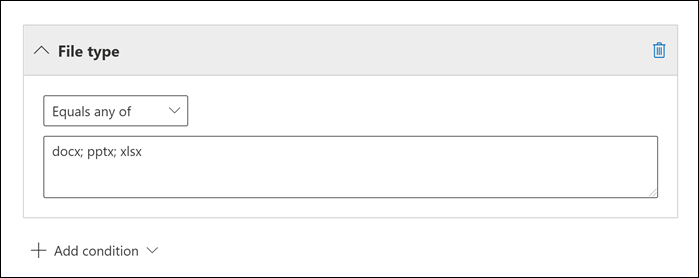

# <a name="keyword-queries-and-search-conditions-for-ediscovery"></a>Nyckelordsfrågor och sökvillkor för eDiscovery

I det här avsnittet beskrivs de e-post- och dokumentegenskaper som du kan söka efter i e-postobjekt och Microsoft Teams-chattkonversationer i Exchange Online samt dokument som lagras på SharePoint- och OneDrive för företag-webbplatser med eDiscovery-sökverktygen i Microsoft 365 Efterlevnadscenter. Det omfattar innehållssökning, bas-eDiscovery och Advanced eDiscovery (eDiscovery-sökningar i Advanced eDiscovery kallas *samlingar).* Du kan också använda **\* cmdletarna -ComplianceSearch** i Security & Compliance Center PowerShell för att söka efter de här egenskaperna. I det här avsnittet beskrivs också:

- Använd booleska sökoperatorer, sökvillkor och andra sökfrågetekniker för att förfina sökresultaten.
- Söker efter känsliga datatyper och anpassade typer av känsliga data i SharePoint och OneDrive för företag.
- Söka efter webbplatsinnehåll som delas med användare utanför organisationen

Stegvisa instruktioner för hur du skapar olika eDiscovery-sökningar finns i:

- [Innehållssökning](content-search.md)
- [Söka efter innehåll i Bas-eDiscovery](search-for-content-in-core-ediscovery.md)
- [Skapa ett utkast i Advanced eDiscovery](create-draft-collection.md)

> [!NOTE]
> eDiscovery-sökningar i Microsoft 365 Efterlevnadscenter och motsvarande **\* -ComplianceSearch-cmdlets** i Security & Compliance Center PowerShell använder Keyword Query Language (KQL). Mer detaljerad information finns i [Syntaxreferens för nyckelordsfrågaspråk.](/sharepoint/dev/general-development/keyword-query-language-kql-syntax-reference)

## <a name="searchable-email-properties"></a>Sökbara e-postegenskaper

I följande tabell visas egenskaper för e-postmeddelanden som kan sökas med hjälp av eDiscovery-sökverktygen i Microsoft 365 Efterlevnadscenter eller med **new-compliancesearch** eller **cmdleten Set-ComplianceSearch.** Tabellen innehåller ett exempel på  _syntaxen property:value_ för varje egenskap och en beskrivning av sökresultaten som returneras av exemplen. Du kan skriva dessa  `property:value` par i rutan nyckelord för en eDiscovery-sökning.

> [!NOTE]
> När du söker efter e-postegenskaper går det inte att söka efter objekt där den angivna egenskapen är tom eller tom. Om du till exempel använder ämnesparet **property:value:""** när du söker efter e-postmeddelanden med en tom ämnesrad returneras noll resultat.  Det här gäller även när du söker i egenskaper för webbplats och kontakt.

<br>

****

|Egenskap|Egenskapsbeskrivning|Exempel|Sökresultat som returneras av exemplen|
|---|---|---|---|
|AttachmentNames|Namnen på filerna som bifogats i ett e-postmeddelande.|`attachmentnames:annualreport.ppt` <p> `attachmentnames:annual*` <br/> `attachmentnames:.pptx`|Meddelanden som har en bifogad fil med namnet annualreport.ppt. I det andra exemplet returnerar jokertecknet ( * ) meddelanden med ordet "årlig" i filnamnet på en bifogad fil. Det tredje exemplet returnerar alla bifogade filer med pptx-filnamnstillägget.|
|Hemlig kopia|Fältet Hemlig kopia i ett e-postmeddelande. <sup>1</sup>|`bcc:pilarp@contoso.com` <p> `bcc:pilarp` <p> `bcc:"Pilar Pinilla"`|Alla exempel returnerar meddelanden med Pilar Pinilla som finns i fältet Hemlig kopia.|
|Kategori|De kategorier som ska sökas. Kategorier kan definieras av användare med hjälp av Outlook eller Outlook på webben (tidigare kallat Outlook Web App). Möjliga värden är: <ul><li>blå<li></li>grön<li></li>orange<li></li>lila<li></li>röd<li></li>gul</li></ul>|`category:"Red Category"`|Meddelanden som har tilldelats den röda kategorin i källpostlådorna.|
|Kopia|Fältet Kopia i ett e-postmeddelande. <sup>1</sup>|`cc:pilarp@contoso.com` <p> `cc:"Pilar Pinilla"`|I båda exemplen har meddelanden där Pilar Pinilla angetts i fältet Kopia.|
|Folderid|Mapp-ID (GUID) för en viss postlådemapp. Om du använder den här egenskapen ska du se till att söka i postlådan som den angivna mappen finns i. Endast den angivna mappen genomsöks. Undermappar i mappen genomsöks inte. Om du vill söka i undermappar måste du använda egenskapen Folderid för den undermapp du vill söka i. <p> Mer information om hur du söker efter egenskapen Folderid och använder ett skript för att hämta mapp-ID:na för en viss postlåda finns i Använda innehållssökning [för riktade samlingar.](use-content-search-for-targeted-collections.md)|`folderid:4D6DD7F943C29041A65787E30F02AD1F00000000013A0000` <p> `folderid:2370FB455F82FC44BE31397F47B632A70000000001160000 AND participants:garthf@contoso.com`|I det första exemplet returneras alla objekt i den angivna postlådemappen. Det andra exemplet returnerar alla objekt i den angivna postlådemappen som har skickats eller tagits emot av garthf@contoso.com.|
|Från|Avsändaren av ett e-postmeddelande. <sup>1</sup>|`from:pilarp@contoso.com` <p> `from:contoso.com`|Meddelanden som skickas av den angivna användaren eller som skickas från en angiven domän.|
|HasAttachment|Anger om ett meddelande har en bifogad fil. Använd värdena **sant** eller **falskt.**|`from:pilar@contoso.com AND hasattachment:true`|Meddelanden som skickats av en angiven användare som har bifogade filer.|
|Prioritet|Prioriteten för ett e-postmeddelande, som en avsändare kan ange när de skickar ett meddelande. Som standard skickas meddelanden med normal prioritet, såvida inte avsändaren anger prioriteten som **hög** eller **låg.**|`importance:high` <p> `importance:medium` <p> `importance:low`|Meddelanden som har markerats som hög prioritet, medelstor eller låg prioritet.|
|IsRead|Anger om meddelanden har lästs. Använd värdena **sant** eller **falskt.**|`isread:true` <p> `isread:false`|I det första exemplet returneras meddelanden med egenskapen IsRead inställd på **Sant.** I det andra exemplet returneras meddelanden där egenskapen IsRead är inställd på **False.**|
|ItemClass|Använd den här egenskapen till att söka efter specifika datatyper från tredje part som organisationen importerat till Office 365. Använd följande syntax för den här egenskapen:  `itemclass:ipm.externaldata.<third-party data type>*`|`itemclass:ipm.externaldata.Facebook* AND subject:contoso` <p> `itemclass:ipm.externaldata.Twitter* AND from:"Ann Beebe" AND "Northwind Traders"`|I det första exemplet returneras Facebook-objekt som innehåller ordet "contoso" i egenskapen Ämne. Det andra exemplet returnerar Twitter-objekt som postades av Ann Beebe och som innehåller nyckelordet "Northwind Traders". <p> En fullständig lista med värden som ska användas för datatyper från tredje part för egenskapen ItemClass finns i Använda innehållssökning för att söka efter data från tredje part som har importerats [till Office 365](use-content-search-to-search-third-party-data-that-was-imported.md).|
|Sort|Den typ av e-postmeddelande du vill söka efter. Möjliga värden: <p>  kontakter <p>  dokument <p>  e-post <p>  externaldata <p>  fax <p>  snabbmeddelanden <p>  journaler <p>  möten <p>  microsoftteams (returnerar objekt från chattar, möten och samtal i Microsoft Teams) <p>  anteckningar <p>  inlägg <p>  rssfeeds <p>  uppgifter <p>  röstbrevlåda|`kind:email` <p> `kind:email OR kind:im OR kind:voicemail` <p> `kind:externaldata`|I det första exemplet returneras e-postmeddelanden som uppfyller sökvillkoren. Det andra exemplet returnerar e-postmeddelanden, snabbmeddelandekonversationer (Skype för företag konversationer och chattar i Microsoft Teams) och röstmeddelanden som uppfyller sökvillkoren. I det tredje exemplet returneras objekt som har importerats till postlådor i Microsoft 365 från datakällor från tredje part, till exempel Twitter, Facebook och Cisco Jabber, som uppfyller sökvillkoren. Mer information finns i [Arkivera data från tredje part i Office 365](https://www.microsoft.com/?ref=go).|
|Deltagare|Alla personer (fält) i ett e-postmeddelande. De här fälten är Från, Till, Kopia och Hemlig<sup>kopia. 1</sup>|`participants:garthf@contoso.com` <p> `participants:contoso.com`|Meddelanden som skickas av eller skickas till garthf@contoso.com. Det andra exemplet returnerar alla meddelanden som skickats av eller skickats till en användare i contoso.com domän.|
|Mottaget|Datumet då ett e-postmeddelande togs emot av en mottagare.|`received:04/15/2016` <p> `received>=01/01/2016 AND received<=03/31/2016`|Meddelanden som togs emot den 15 april 2016. Det andra exemplet returnerar alla meddelanden som tagits emot mellan den 1 januari 2016 och den 31 mars 2016.|
|Mottagare|Alla mottagarfält i ett e-postmeddelande. De här fälten är Till, Kopia och Hemlig<sup>kopia. 1</sup>|`recipients:garthf@contoso.com` <p> `recipients:contoso.com`|Meddelanden som skickas till garthf@contoso.com. I det andra exemplet returneras meddelanden som skickats till alla mottagare i contoso.com domän.|
|Skickat|Datumet då ett e-postmeddelande skickades av avsändaren.|`sent:07/01/2016` <p> `sent>=06/01/2016 AND sent<=07/01/2016`|Meddelanden som skickades det angivna datumet eller som skickats inom det angivna datumintervallet.|
|Storlek|Storleken på ett objekt i byte.|`size>26214400` <p> `size:1..1048567`|Meddelanden som är större än 25 MB. I det andra exemplet returneras meddelanden från 1 till 1 048 567 byte (1 MB) i storlek.|
|Ämne|Texten i ämnesraden i ett e-postmeddelande. <p> **Obs!** När du använder egenskapen Ämne i en fråga returnerar sökningen alla meddelanden där ämnesraden innehåller den text som du söker efter. Med andra ord returnerar frågan inte bara de meddelanden som matchar exakt. Om du till exempel söker efter innehåller resultaten meddelanden med  `subject:"Quarterly Financials"` ämnet Kvartalsvisa budget 2018.|`subject:"Quarterly Financials"` <p> `subject:northwind`|Meddelanden som innehåller frasen "Kvartalsvis ekonomi" någonstans i texten på ämnesraden. I det andra exemplet returneras alla meddelanden som innehåller ordet northwind i ämnesraden.|
|Till|Fältet Till i ett e-postmeddelande. <sup>1</sup>|`to:annb@contoso.com` <p> `to:annb ` <br/> `to:"Ann Beebe"`|Alla exempel returnerar meddelanden där Ann Beebe anges på raden Till:.|
|

> [!NOTE]
> <sup>1</sup> För värdet för en mottagaregenskap kan  du använda e-postadress (kallas även huvudnamn eller UPN), visningsnamn eller alias för att ange en användare. Du kan till exempel använda annb@contoso.com, annb eller "Ann Beebe" för att ange användaren Ann Beebe.

### <a name="recipient-expansion"></a>Mottagarens expansion

När du söker i någon av mottagarens egenskaper (Från, Till, Kopia, Hemlig kopia, Deltagare och Mottagare) försöker Microsoft 365 utöka identiteten för varje användare genom att leta upp dem i Azure Active Directory (Azure AD).  Om användaren hittas i Azure AD utvidgas frågan till att inkludera användarens e-postadress (eller UPN), alias, visningsnamn och LegacyExchangeDN. En fråga som till exempel `participants:ronnie@contoso.com` expanderas till `participants:ronnie@contoso.com OR participants:ronnie OR participants:"Ronald Nelson" OR participants:"<LegacyExchangeDN>"` .

För att förhindra att mottagaren utökas lägger du till ett jokertecken (asterisk) i slutet av e-postadressen och använder ett minskat domännamn. Se till exempel `participants:"ronnie@contoso*"` till att omge e-postadressen med dubbla citattecken.

Tänk dock på att förhindra att mottagaren utökas i sökfrågan kan resultera i att relevanta objekt inte returneras i sökresultatet. E-postmeddelanden Exchange kan sparas med olika textformat i mottagarfälten. Mottagarens expansion är avsedd att minimera det här faktum genom att returnera meddelanden som kan innehålla olika textformat. Så att förhindra att mottagare utökas kan resultera i att sökfrågan inte returnerar alla objekt som kan vara relevanta för din undersökning.

> [!NOTE]
> Om du behöver granska eller minska de objekt som returneras av en sökfråga på grund av mottagarens expansion kan du använda Advanced eDiscovery. Du kan söka efter meddelanden (dra nytta av mottagarens expansion), lägga till dem i en granskningsuppsättning och sedan använda fråge- eller filter för att granska eller begränsa resultatet. Mer information finns i Samla [in data för ett ärende](collecting-data-for-ediscovery.md) och Skapa en fråga för data i en [granskningsuppsättning.](review-set-search.md)

## <a name="searchable-site-properties"></a>Sökbara webbplatsegenskaper

I följande tabell visas några av de SharePoint- och OneDrive för företag-egenskaper som kan sökas med hjälp av eDiscovery-sökverktygen i efterlevnadscentret för Microsoft 365 eller med hjälp av **New-ComplianceSearch** eller cmdleten **Set-ComplianceSearch.** Tabellen innehåller ett exempel på  _syntaxen property:value_ för varje egenskap och en beskrivning av sökresultaten som returneras av exemplen.

En fullständig lista över SharePoint egenskaper som kan sökas i finns i Översikt över crawlade och [hanterade egenskaper i SharePoint](/SharePoint/technical-reference/crawled-and-managed-properties-overview). Egenskaper som är markerade **med ett** Ja i **kolumnen Queryable** kan sökas igenom.

<br>

****

|Egenskap|Egenskapsbeskrivning|Exempel|Sökresultat som returneras av exemplen|
|---|---|---|---|
|Författare|Redigeringsfältet från Office, som finns kvar om ett dokument kopieras. Om en användare till exempel skapar ett dokument och e-postmeddelanden till någon annan som sedan laddar upp det till SharePoint, behåller dokumentet den ursprungliga författaren. Se till att använda användarens visningsnamn för den här egenskapen.|`author:"Garth Fort"`|Alla dokument som har redigerats av Garth Fort.|
|ContentType|Den SharePoint för ett objekt, till exempel Objekt, Dokument eller Video.|`contenttype:document`|Alla dokument returneras.|
|Skapades|Datumet då ett objekt skapades.|`created>=06/01/2016`|Alla objekt som skapats den 1 juni 2016 eller efter den 1 juni 2016.|
|CreatedBy|Personen som skapade eller laddade upp ett objekt. Se till att använda användarens visningsnamn för den här egenskapen.|`createdby:"Garth Fort"`|Alla objekt som skapats eller laddats upp av Garth Fort.|
|DetectedLanguage|Språket för ett objekt.|`detectedlanguage:english`|Alla objekt på engelska.|
|DocumentLink|Sökvägen (URL) till en särskild mapp på en SharePoint eller OneDrive för företag webbplats. Om du använder den här egenskapen ska du se till att söka på webbplatsen där den angivna mappen finns. <p> Om du vill returnera objekt i undermappar i mappen som du anger för dokumentlänkegenskapen måste du lägga till / i URL-adressen för den angivna \* mappen, till exempel `documentlink: "https://contoso.sharepoint.com/Shared Documents/*"` <p> <br/>Mer information om hur du söker efter dokumentlänkegenskapen och använder ett skript för att hämta URL-adresser till dokumentlänken för mappar på en viss webbplats finns i Använda innehållssökning för [riktade samlingar.](use-content-search-for-targeted-collections.md)|`documentlink:"https://contoso-my.sharepoint.com/personal/garthf_contoso_com/Documents/Private"` <p> `documentlink:"https://contoso-my.sharepoint.com/personal/garthf_contoso_com/Documents/Shared with Everyone/*" AND filename:confidential`|I det första exemplet returneras alla objekt i OneDrive för företag mapp. Det andra exemplet returnerar dokument i den angivna webbplatsmappen (och alla undermappar) som innehåller ordet "konfidentiellt" i filnamnet.|
|FileExtension|Filnamnstillägget för en fil. Till exempel docx, ett, pptx eller xlsx.|`fileextension:xlsx`|Alla Excel (Excel 2007 och senare)|
|Filnamn|Namnet på en fil.|`filename:"marketing plan"` <p> `filename:estimate`|I det första exemplet returneras filer med den exakta frasen "marknadsföringsplan" i rubriken. Det andra exemplet returnerar filer med ordet "uppskattning" i filnamnet.|
|LastModifiedTime|Datumet då ett objekt senast ändrades.|`lastmodifiedtime>=05/01/2016` <p> `lastmodifiedtime>=05/10/2016 AND lastmodifiedtime<=06/1/2016`|I det första exemplet returneras poster som ändrades den 1 maj 2016 eller efter den 1 maj 2016. I det andra exemplet returneras poster som ändrats mellan den 1 maj 2016 och den 1 juni 2016.|
|ModifiedBy|Den person som senast ändrade ett objekt. Se till att använda användarens visningsnamn för den här egenskapen.|`modifiedby:"Garth Fort"`|Alla objekt som senast ändrades av Garth Fort.|
|Sökväg|Sökvägen (URL) till en viss webbplats på en SharePoint eller OneDrive för företag webbplats. <p> Om du vill returnera objekt endast från den angivna webbplatsen måste du lägga till avslutande information i slutet av `/` URL:en, till exempel `path: "https://contoso.sharepoint.com/sites/international/"` <p> Om du vill returnera objekt som finns i mappar på webbplatsen som du anger i sökvägsegenskapen måste du lägga till i slutet av `/*` URL-adressen, till exempel  `path: "https://contoso.sharepoint.com/Shared Documents/*"` <p> **Obs!** Om du använder egenskapen för OneDrive-platser returneras inte mediefiler, till exempel `Path` .png-, .tiff- eller .wav-filer, i sökresultatet. Använd en annan webbplatsegenskap i sökfrågan om du vill söka efter mediefiler OneDrive mappar. <br/>|`path:"https://contoso-my.sharepoint.com/personal/garthf_contoso_com/"` <p> `path:"https://contoso-my.sharepoint.com/personal/garthf_contoso_com/*" AND filename:confidential`|I det första exemplet returneras alla objekt på den OneDrive för företag webbplatsen. Det andra exemplet returnerar dokument på den angivna webbplatsen (och mappar på webbplatsen) som innehåller ordet "konfidentiellt" i filnamnet.|
|SharedWithUsersOWSUser|Dokument som har delats med den  angivna användaren och visas på sidan Delas med mig på användarens OneDrive för företag webbplats. Det här är dokument som uttryckligen har delats med den angivna användaren av andra i organisationen. När du exporterar dokument som matchar en sökfråga som använder egenskapen SharedWithUsersOWSUser exporteras dokumenten från den ursprungliga innehållsplatsen för den person som delade dokumentet med den angivna användaren. Mer information finns i Söka [efter webbplatsinnehåll som delas i organisationen.](#searching-for-site-content-shared-within-your-organization)|`sharedwithusersowsuser:garthf` <p> `sharedwithusersowsuser:"garthf@contoso.com"`|Båda exemplen returnerar alla interna dokument som uttryckligen har  delats med Garth Fort och som visas på sidan Delas med mig i Garth Fort:s OneDrive för företag konto.|
|Webbplats|URL-adressen till en webbplats eller grupp av webbplatser i din organisation.|`site:"https://contoso-my.sharepoint.com"` <p> `site:"https://contoso.sharepoint.com/sites/teams"`|I det första exemplet returneras poster OneDrive för företag postwebbplatser för alla användare i organisationen. Det andra exemplet returnerar objekt från alla gruppwebbplatser.|
|Storlek|Storleken på ett objekt i byte.|`size>=1` <p> `size:1..10000`|I det första exemplet returneras poster som är större än 1 byte. I det andra exemplet returneras objekt från 1 till 10 000 byte i storlek.|
|Title|Dokumentets rubrik. Titelegenskapen är metadata som anges i Microsoft Office dokument. Den skiljer sig från filnamnet i dokumentet.|`title:"communication plan"`|Alla dokument som innehåller frasen "kommunikationsplan" i rubrikmetadataegenskapen för ett Office dokument.|
|

## <a name="searchable-contact-properties"></a>Sökbara kontaktegenskaper

I följande tabell visas de kontaktegenskaper som är indexerade och som du kan söka efter med hjälp av eDiscovery-sökverktyg. Det här är de egenskaper som är tillgängliga för att konfigurera för kontakter (kallas även personliga kontakter) som finns i den personliga adressboken i en användares postlåda. Om du vill söka efter kontakter kan du välja vilka postlådor du vill söka i och sedan använda en eller flera kontaktegenskaper i nyckelordsfrågan.

> [!TIP]
> Om du vill söka efter värden som innehåller blanksteg eller specialtecken använder du dubbla citattecken (" ") som innehåller frasen; till exempel `businessaddress:"123 Main Street"` .

<br>

****

|Egenskap|Egenskapsbeskrivning|
|---|---|
|BusinessAddress|Adressen i egenskapen **Företagsadress.** Egenskapen kallas även **Arbetsadress** på sidan kontaktegenskaper.|
|BusinessPhone|Telefonnumret i någon av egenskaperna **för Telefon** telefonnummer.|
|Företagsnamn|Namnet i **företagsegenskapen.**|
|Department|Namnet i **egenskapen** Avdelning.|
|DisplayName|Kontaktens visningsnamn. Det här är namnet i **egenskapen Fullständigt** namn för kontakten.|
|EmailAddress|Adressen till valfri e-postadressegenskap för kontakten. Användare kan lägga till flera e-postadresser för en kontakt. Om du använder den här egenskapen returneras kontakter som matchar någon av kontaktens e-postadresser.|
|FileAs|Egenskapen **Spara som.** Den här egenskapen används för att ange hur kontakten visas i användarens kontaktlista. En kontakt kan till exempel visas som *Förnamn,Efternamn* eller *Efternamn,Förnamn.*|
|GivenName|Namnet i egenskapen **Förnamn.**|
|HomeAddress|Adressen i någon av egenskaperna **för Hemadress.**|
|Telefon, hem|Telefonnumret i någon av **egenskaperna Hemtelefonnummer.**|
|IMAdress|Egenskapen Snabbmeddelandeadress, som vanligtvis är en e-postadress som används för snabbmeddelanden.|
|MiddleName|Namnet i egenskapen **Mellannamn.**|
|Mobiltelefon|Telefonnumret i **egenskapen** Mobiltelefonnummer.|
|Smeknamn|Namnet i egenskapen **Smeknamn.**|
|OfficeLocation|Värdet i **Office** eller **Office plats.**|
|OtherAddress|Värdet för egenskapen **Annan** adress.|
|Efternamn|Namnet i **egenskapen** Efternamn.|
|Title|Rubriken i egenskapen **Befattning.**|
|

## <a name="searchable-sensitive-data-types"></a>Sökbara typer av känsliga data

Du kan använda eDiscovery-sökverktygen i Microsoft 365 Efterlevnadscenter för att söka efter känsliga data, till exempel kreditkortsnummer eller personnummer, som är lagrade i dokument på SharePoint och OneDrive för företag webbplatser. Det kan du göra genom att använda `SensitiveType` egenskapen och namnet (eller ID) för en typ av känslig information i en nyckelordsfråga. Frågan returnerar till `SensitiveType:"Credit Card Number"` exempel dokument som innehåller ett kreditkortsnummer. Frågan  `SensitiveType:"U.S. Social Security Number (SSN)"` returnerar dokument som innehåller ett amerikanskt personnummer.

En lista med de typer av känslig information som du kan söka efter finns i **Dataklassificeringarna** Typer av \> **känslig information** i Microsoft 365 Efterlevnadscenter. Du kan också använda cmdleten **Get-DlpSensitiveInformationType** i Security & Compliance Center PowerShell för att visa en lista över typer av känslig information.

Mer information om hur du skapar frågor med egenskapen finns i Skapa en fråga `SensitiveType` för att hitta känsliga data som [lagras på webbplatser.](form-a-query-to-find-sensitive-data-stored-on-sites.md)

### <a name="limitations-for-searching-sensitive-data-types"></a>Begränsningar vid sökning efter känsliga datatyper

- Om du vill söka efter anpassade typer av känslig information måste du ange ID för typen av känslig information i `SensitiveType` egenskapen. Om du använder namnet på en anpassad typ av känslig information (som i exemplet för de inbyggda typerna av känslig information i föregående avsnitt) returneras inga resultat. Använd **kolumnen Publisher** på sidan  Typer av känslig information i efterlevnadscentret (eller **egenskapen Publisher** i PowerShell) för att skilja mellan inbyggda och anpassade typer av känslig information. Inbyggda typer av känsliga data har värdet `Microsoft Corporation` för egenskapen **Publisher.**

  Om du vill visa namn och ID för anpassade känsliga datatyper i organisationen kör du följande kommando i Security & Compliance Center PowerShell:

  ```powershell
  Get-DlpSensitiveInformationType | Where-Object {$_.Publisher -ne "Microsoft Corporation"} | FT Name,Id
  ```

  Sedan kan du använda ID:t i `SensitiveType` sökegenskapen för att returnera dokument som innehåller den anpassade känsliga datatypen, till exempel `SensitiveType:7e13277e-6b04-3b68-94ed-1aeb9d47de37`

- Du kan inte använda typer av känslig information och sökegenskapen till att söka efter känsliga data i `SensitiveType` Exchange Online postlådor. Det inkluderar privata chattmeddelanden, 1:N gruppchattmeddelanden och teamkanalkonversationer i Microsoft Teams eftersom allt innehåll lagras i postlådor. Du kan emellertid använda principer för dataförlustskydd (DLP) för att skydda känsliga e-postdata under överföring. Mer information finns i [Läs mer om skydd mot dataförlust](dlp-learn-about-dlp.md) och Söka efter och hitta [personuppgifter.](/compliance/regulatory/gdpr)

## <a name="search-operators"></a>Sökoperatorer

Booleska sökoperatorer som **AND,** **OR** och **NOT** hjälper dig att definiera mer exakta sökningar genom att inkludera eller exkludera specifika ord i sökfrågan. Andra tekniker, som att använda egenskapsoperatorer (t.ex. eller ), citattecken, parenteser och jokertecken, hjälper dig att förfina `>=` `..` en sökfråga. I följande tabell visas operatorer som du kan använda för att begränsa eller bredda sökresultaten.

<br>

****

|Operator|Användning|Beskrivning|
|---|---|---|
|OCH|nyckelord1 OCH nyckelord2|Returnerar objekt som innehåller alla angivna nyckelord eller  `property:value` uttryck. Skulle till exempel  `from:"Ann Beebe" AND subject:northwind` returnera alla meddelanden som skickats av Ann Beebe som innehöll ordet northwind i ämnesraden. <sup>2</sup>|
|+|nyckelord1 + nyckelord2 + nyckelord3|Returnerar poster som *innehåller* `keyword2` `keyword3` *antingen eller och* som också innehåller `keyword1` .   Det här exemplet motsvarar därför frågan  `(keyword2 OR keyword3) AND keyword1` . <p> Frågan `keyword1 + keyword2` (med ett blanksteg efter **+** symbolen) är inte samma sak som att använda **operatorn OCH.** Den här frågan motsvarar och  `"keyword1 + keyword2"` returnerar objekt med den exakta fasen  `"keyword1 + keyword2"` .|
|ELLER|nyckelord1 ELLER nyckelord2|Returnerar objekt som innehåller ett eller flera av de angivna nyckelorden eller  `property:value` uttrycken. <sup>2</sup>|
|NOT|nyckelord1 NOT nyckelord2 <p> INTE från:"Ann Beebe" <p> NOT sort:im|Exkluderar objekt som anges med ett nyckelord eller ett  `property:value` uttryck. I det andra exemplet undantas meddelanden som skickas av Ann Beebe. Det tredje exemplet exkluderar snabbmeddelandekonversationer, till exempel Skype för företag konversationer som sparas i postlådemappen Konversationshistorik. <sup>2</sup>|
|-|keyword1 -keyword2|Samma som **operatorn NOT.** Den här frågan returnerar objekt som  `keyword1` innehåller och exkluderar objekt som innehåller  `keyword2` .|
|NEAR|nyckelord1 NEAR(n) nyckelord2|Returnerar poster med ord som är nära varandra, där n är lika med antalet ord från varandra. Returnerar exempelvis `best NEAR(5) worst` alla objekt där ordet "sämsta" finns inom fem ord av "bäst". Om inget tal anges är standardavståndet åtta ord. <sup>2</sup>|
|:|property:value|Kolontecknet (:) i  `property:value` syntaxen anger att värdet på egenskapen som genomsöks innehåller det angivna värdet. Returnerar till  `recipients:garthf@contoso.com` exempel ett meddelande som skickats till garthf@contoso.com.|
|=|property=value|Samma som **operatorn :.**|
|\<|\<egenskapsvärde|Anger att egenskapen som genomsöks är mindre än det angivna värdet. <sup>1</sup>|
|\>|\>egenskapsvärde|Anger att egenskapen som genomsöks är större än det angivna värdet. <sup>1</sup>|
|\<=|property \< =value|Anger att egenskapen som genomsöks är mindre än eller lika med ett visst värde. <sup>1</sup>|
|\>=|property \> =value|Anger att egenskapen som genomsöks är större än eller lika med ett visst värde. <sup>1</sup>|
|..|egenskap:värde1.. värde2|Anger att den egenskap som genomsöks är större än eller lika med värde1 och mindre än eller lika med värde2. <sup>1</sup>|
|"  "|"rättvist värde" <p> subject:"Kvartalsredovisning"|Använd dubbla citattecken (" ") om du vill söka efter en exakt fras eller term i nyckelord  `property:value` och sökfrågor.|
|\*|katt\* <p> ämne:ange\*|Prefixsökningar (kallas *även prefixmatchning)* där ett jokertecken ( * ) placeras i slutet av ett ord i nyckelord `property:value` eller frågor. I prefixsökningar returnerar sökningen resultat med termer som innehåller ordet följt av noll eller fler tecken. Exempelvis returneras dokument som innehåller ordet "set", "setup" och "setting" (och andra ord som börjar med `title:set*` "set") i dokumenttiteln. <p> **Obs!** Du kan endast använda prefixsökningar. till exempel **cat _ eller \* *_* set \* *_. Suffixsökningar (_* \* katt**), infix-sökningar (**c \* t**) och sökning efter understrängar **\* (katt) \*** stöds inte. <p> Lägg också till en punkt ( \. ) till ett prefix genom att ändra resultatet som returneras. Det beror på att en punkt behandlas som ett stoppord. Om du till exempel söker **efter katt _ och söker efter \* *_* \* katt.** returneras olika resultat. Vi rekommenderar att du inte använder en punkt i en prefixsökning.|
|(  )|(rättvist ELLER kostnadsfritt) OCH (från:contoso.com) <p> (IPO ELLER initial) AND (aktie ELLER aktier) <p> (kvartalsvis ekonomi)|Parenteser grupperar booleska fraser,  `property:value` objekt och nyckelord. Returnerar exempelvis  `(quarterly financials)` poster som innehåller orden kvartalsvisa och finansiella poster.|
|

> [!NOTE]
> <sup>1</sup> Använd den här operatorn för egenskaper som har datum- eller numeriska värden.<br/> <sup>2</sup> booleska sökoperatorer måste vara versaler. till exempel **OCH**. Om du använder en gemen, till exempel **och**, behandlas den som ett nyckelord i sökfrågan.

## <a name="search-conditions"></a>Sökvillkor

Du kan lägga till villkor i en sökfråga för att begränsa en sökning och returnera en mer förfinad uppsättning resultat. Varje villkor lägger till en sats i KQL-sökfrågan som skapas och körs när du startar sökningen.

[Villkor för gemensamma egenskaper](#conditions-for-common-properties)

[Villkor för e-postegenskaper](#conditions-for-mail-properties)

[Villkor för dokumentegenskaper](#conditions-for-document-properties)

[Operatorer som används med villkor](#operators-used-with-conditions)

[Riktlinjer för användning av villkor](#guidelines-for-using-conditions)

[Exempel på användning av villkor i sökfrågor](#examples-of-using-conditions-in-search-queries)

### <a name="conditions-for-common-properties"></a>Villkor för gemensamma egenskaper

Skapa ett villkor med vanliga egenskaper när du söker i postlådor och webbplatser i samma sökning. I följande tabell visas de tillgängliga egenskaper som du kan använda när du lägger till ett villkor.

<br>

****

|Villkor|Beskrivning|
|---|---|
|Datum|För e-post: det datum då ett meddelande togs emot av en mottagare eller skickades av avsändaren. För dokument: det datum då ett dokument senast ändrades.|
|Avsändare/författare|För e-post: den person som skickade ett meddelande. För dokument: den person som du citerar i fältet Författare Office dokument. Du kan skriva mer än ett namn, avgränsade med kommatecken. Två eller flera värden är logiskt sammankopplade av **operatorn** ELLER.|
|Storlek (i byte)|Storleken på objektet (i byte) för både e-post och dokument.|
|Ämne/rubrik|För e-post: texten på ämnesraden i ett meddelande. För dokument, dokumentets rubrik. Som tidigare förklarats är titelegenskapen metadata angivna Microsoft Office dokument. Du kan skriva namnet på fler än ett ämne/en rubrik, avgränsade med kommatecken. Två eller flera värden är logiskt sammankopplade av **operatorn** ELLER.|
|Kvarhållningsetikett|För både e-post och dokument gäller det de bevarandeetiketter som automatiskt har tilldelats meddelanden och dokument genom principer för automatisk etikett eller bevarandeetiketter som manuellt har tilldelats av användare. Bevarandeetiketter används för att klassificera e-post och dokument för informationsstyrning och tillämpa bevaranderegler utifrån de inställningar som definieras av etiketten. Du kan skriva en del av namnet på bevarandeetiketten och använda ett jokertecken eller skriva hela etikettnamnet. Mer information om bevarandeetiketter finns i Läs [mer om bevarandeprinciper och bevarandeetiketter.](retention.md)|
|

### <a name="conditions-for-mail-properties"></a>Villkor för e-postegenskaper

Skapa ett villkor med hjälp av e-postegenskaper när du söker i postlådor eller gemensamma mappar. I följande tabell visas de e-postegenskaper som du kan använda för ett villkor. De här egenskaperna är en del av de e-postegenskaper som beskrevs tidigare. De här beskrivningarna upprepas för din bekvämlighet.

<br>

****

|Villkor|Beskrivning|
|---|---|
|Meddelande sort|Meddelandetypen för sökning. Det här är samma egenskap som e-poste-egenskapen Kind. Möjliga värden: <ul><li>kontakter</li><li>dokument</li><li>e-post</li><li>externaldata</li><li>fax</li><li>snabbmeddelanden</li><li>journaler</li><li>möten</li><li>microsoftteams</li><li>anteckningar</li><li>inlägg</li><li>rssfeeds</li><li>uppgifter</li><li>röstbrevlåda</li></ul>|
|Deltagare|Alla personer (fält) i ett e-postmeddelande. De här fälten är Från, Till, Kopia och Hemlig kopia.|
|Typ|Egenskapen meddelandeklass för ett e-postobjekt. Det här är samma egenskap som e-postegenskapen ItemClass. Det är också ett villkor med flera värden. Om du vill markera flera meddelandeklasser håller du **ned CTRL-tangenten** och klickar sedan på två eller fler meddelandeklasser i listrutan som du vill lägga till i villkoret. Varje meddelandeklass som du väljer i listan kopplas logiskt av operatorn **ELLER** i motsvarande sökfråga. <p> En lista med meddelandeklasser (och deras motsvarande meddelandeklass-ID) som används av Exchange och som du kan välja i **listan Meddelandeklass** finns i Objekttyper och [Meddelandeklasser.](/office/vba/outlook/Concepts/Forms/item-types-and-message-classes)|
|Mottaget|Datumet då ett e-postmeddelande togs emot av en mottagare. Det här är samma egenskap som egenskapen Mottagen e-post.|
|Mottagare|Alla mottagarfält i ett e-postmeddelande. De här fälten är Till, Kopia och Hemlig kopia.|
|Avsändare|Avsändaren av ett e-postmeddelande.|
|Skickat|Datumet då ett e-postmeddelande skickades av avsändaren. Det här är samma egenskap som egenskapen Skickad e-post.|
|Ämne|Texten i ämnesraden i ett e-postmeddelande.|
|Till|Mottagaren av ett e-postmeddelande i fältet Till.|
|

### <a name="conditions-for-document-properties"></a>Villkor för dokumentegenskaper

Skapa ett villkor med dokumentegenskaper när du söker efter dokument på SharePoint och OneDrive för företag webbplatser. I följande tabell visas de dokumentegenskaper som du kan använda för ett villkor. Dessa egenskaper är en del av de webbplatsegenskaper som beskrivits tidigare. De här beskrivningarna upprepas för din bekvämlighet.

<br>

****

|Villkor|Beskrivning|
|---|---|
|Författare|Redigeringsfältet från Office, som finns kvar om ett dokument kopieras. Om en användare till exempel skapar ett dokument och e-postmeddelanden till någon annan som sedan laddar upp det till SharePoint, behåller dokumentet den ursprungliga författaren.|
|Title|Dokumentets rubrik. Titelegenskapen är metadata som anges i Office dokument. Den är inte samma som filnamnet i dokumentet.|
|Skapades|Datumet då ett dokument skapades.|
|Senast ändrad|Datumet då ett dokument senast ändrades.|
|Filtyp|Filnamnstillägget för en fil. Till exempel docx, ett, pptx eller xlsx. Det här är samma egenskap som egenskapen FileExtension-webbplats. <p> **Obs!** Om du använder villkoret Filtyp med  operatorn Lika med eller Lika med någon av operatorerna i en sökfråga kan du inte använda prefixsökning (genom att inkludera jokertecknet ( ) i slutet av filtypen) för att returnera alla versioner av en  \* filtyp. Om du gör det ignoreras jokertecknet. Om du till exempel tar med `Equals any of doc*` villkoret returneras endast filer med `.doc` filnamnstillägget. Filer med ett tillägg `.docx` till returneras inte. För att returnera alla versioner av en filtyp använde du *egenskap:värde-par* i en nyckelordsfråga. till exempel `filetype:doc*` .|
|

### <a name="operators-used-with-conditions"></a>Operatorer som används med villkor

När du lägger till ett villkor kan du välja en operator som är relevant för egenskapstypen för villkoret. I följande tabell beskrivs operatorerna som används med villkor och en lista över motsvarigheterna som används i sökfrågan.

<br>

****

|Operator|Motsvarande fråga|Beskrivning|
|---|---|---|
|Efter|`property>date`|Används med datumvillkor. Returnerar objekt som har skickats, tagits emot eller ändrats efter det angivna datumet.|
|Före|`property<date`|Används med datumvillkor. Returnerar objekt som har skickats, tagits emot eller ändrats före det angivna datumet.|
|Mellan|`date..date`|Används med datum- och storleksvillkor. När de används med ett datumvillkor returneras objekt som skickats, tagits emot eller ändrats inom det angivna datumintervallet. När de används med ett storleksvillkor returneras objekt vars storlek ligger inom det angivna området.|
|Innehåller något av|`(property:value) OR (property:value)`|Används med villkor för egenskaper som anger ett strängvärde. Returnerar poster som innehåller någon del av ett eller flera angivna strängvärden.|
|Inte innehåller något av|`-property:value` <p> `NOT property:value`|Används med villkor för egenskaper som anger ett strängvärde. Returnerar objekt som inte innehåller någon del av det angivna strängvärdet.|
|Inte är lika med något av|`-property=value` <p> `NOT property=value`|Används med villkor för egenskaper som anger ett strängvärde. Returnerar objekt som inte innehåller den specifika strängen.|
|Är lika med|`size=value`|Returnerar poster som är lika stora som den angivna storleken. <sup>1</sup>|
|Är lika med något av|`(property=value) OR (property=value)`|Används med villkor för egenskaper som anger ett strängvärde. Returnerar poster som motsvarar en exakt matchning av ett eller flera angivna strängvärden.|
|Större|`size>value`|Returnerar poster där den angivna egenskapen är större än det angivna värdet. <sup>1</sup>|
|Större eller lika|`size>=value`|Returnerar poster där den angivna egenskapen är större än eller lika med det angivna värdet. <sup>1</sup>|
|Mindre|`size<value`|Returnerar poster som är större än eller lika med det specifika värdet. <sup>1</sup>|
|Mindre eller lika|`size<=value`|Returnerar poster som är större än eller lika med det specifika värdet. <sup>1</sup>|
|Inte lika med|`size<>value`|Returnerar poster som inte är lika stora som den angivna storleken. <sup>1</sup>|
|

> [!NOTE]
> <sup>1</sup> Den här operatorn är endast tillgänglig för villkor som använder egenskapen Storlek.

### <a name="guidelines-for-using-conditions"></a>Riktlinjer för användning av villkor

Tänk på följande när du använder sökvillkor.

- Ett villkor är logiskt kopplat till nyckelordsfrågan (anges i nyckelordsrutan) av **operatorn OCH.** Det innebär att objekt måste uppfylla både nyckelordsfrågan och villkoret som ska tas med i resultatet. Det är så du begränsar resultatet med hjälp av villkor.

- Om du lägger till två eller flera unika villkor i en sökfråga (villkor som anger olika egenskaper) är dessa villkor logiskt kopplade av **operatorn OCH.** Det innebär att endast objekt som uppfyller alla villkor (förutom en nyckelordsfråga) returneras.

- Om du lägger till fler än ett villkor för samma egenskap, är dessa villkor logiskt sammankopplade av **operatorn** ELLER. Det innebär att objekt som uppfyller nyckelordsfrågan och något av villkoren returneras. Grupper av samma villkor är därför sammankopplade med varandra av operatorn **ELLER** och sedan är uppsättningar av unika villkor sammankopplade av **OPERATORN.**

- Om du lägger till flera värden (avgränsade med semikolon eller semikolon) i ett enda villkor kopplas dessa värden av **operatorn** ELLER. Det innebär att element returneras om de innehåller något av de angivna värdena för egenskapen i villkoret.

- Sökfrågan som skapas med hjälp av rutan nyckelord  och villkor visas på söksidan, i informationsfönstret för den valda sökningen. I en fråga anger allt till höger om  `(c:c)` notationen villkor som läggs till i frågan.

- Villkor lägger endast till egenskaper i sökfrågan. operatorerna inte. Det är därför frågan som visas i detaljfönstret inte visar operatorer till höger om  `(c:c)` notationen. KQL lägger till de logiska operatorerna (enligt reglerna som beskrivs tidigare) när frågan körs.

- Du kan använda dra- och släppkontrollen för att skapa ordningsföljd. Klicka på kontrollen för ett villkor och flytta den uppåt eller nedåt.

- Som tidigare förklarats kan du med vissa villkorsegenskaper skriva flera värden (avgränsade med semikolon). Varje värde kopplas logiskt av **operatorn ELLER** och resulterar i `(filetype=docx) OR (filetype=pptx) OR (filetype=xlsx)` frågan. I följande bild visas ett exempel på ett villkor med flera värden.

    

  > [!NOTE]
  > Du kan inte lägga till flera villkor (genom att klicka **på Lägg till** villkor för samma egenskap. I stället måste du ange flera värden för villkoret (avgränsade med semikolon), som du ser i föregående exempel.

### <a name="examples-of-using-conditions-in-search-queries"></a>Exempel på användning av villkor i sökfrågor

Följande exempel visar den GUI-baserade versionen av en sökfråga med villkor, frågesyntaxen som visas i informationsfönstret för den valda sökningen (som också returneras av cmdleten **Get-ComplianceSearch)** och logiken för motsvarande KQL-fråga.

#### <a name="example-1"></a>Exempel 1

Det här exemplet returnerar dokument SharePoint och OneDrive för företag webbplatser som innehåller ett kreditkortsnummer och senast ändrades före den 1 januari 2021.

**GUI**:


**Sökfrågesyntax:**

`SensitiveType:"Credit Card Number"(c:c)(lastmodifiedtime<2021-01-01)`

**Sökfrågelogik:**

`SensitiveType:"Credit Card Number" AND (lastmodifiedtime<2021-01-01)`

Lägg märke till i föregående skärmbild att sökgränssnittet förstärker att nyckelordsfrågan och -villkoret är sammankopplade med **operatorn OCH.**

#### <a name="example-2"></a>Exempel 2

Det här exemplet returnerar e-postobjekt eller dokument som innehåller nyckelordet "rapport" som har skickats eller skapats före den 1 april 2021, och som innehåller ordet "northwind" i ämnesfältet i e-postmeddelanden eller i titelegenskapen för dokument. Frågan exkluderar webbsidor som uppfyller de andra sökvillkoren.

**GUI**:


**Sökfrågesyntax:**

`report(c:c)(date<2021-04-01)(subjecttitle:"northwind")(-filetype:aspx)`

**Sökfrågelogik:**

`report AND (date<2021-04-01) AND (subjecttitle:"northwind") NOT (filetype:aspx)`

#### <a name="example-3"></a>Exempel 3

Det här exemplet returnerar e-postmeddelanden och kalendermöten som skickats mellan 2019-12-01 och 2020-11-30 och som innehåller ord som börjar med "telefon" eller "smartphone".

**GUI**:


**Sökfrågesyntax:**

`phone* OR smartphone*(c:c)(sent=2019-12-01..2020-11-30)(kind="email")(kind="meetings")`

**Sökfrågelogik:**

`phone* OR smartphone* AND (sent=2029-12-01..2020-11-30) AND ((kind="email") OR (kind="meetings"))`

## <a name="special-characters"></a>Specialtecken

Vissa specialtecken ingår inte i sökindexet och är därför inte sökbara. Det omfattar även de specialtecken som representerar sökoperatorer i sökfrågan. Här är en lista med specialtecken som antingen ersätts med ett tomt blanksteg i själva sökfrågan eller som orsakar ett sökfel.

`+ - = : ! @ # % ^ & ; _ / ? ( ) [ ] { }`

## <a name="searching-for-site-content-shared-with-external-users"></a>Söka efter webbplatsinnehåll som delats med externa användare

Du kan också använda eDiscovery-sökverktyg i efterlevnadscentret för att söka efter dokument som lagrats på SharePoint- och OneDrive för företag-webbplatser som har delats med personer utanför organisationen. Detta kan hjälpa dig att identifiera känslig eller företagsinformation som delas utanför organisationen. Det kan du göra med hjälp av  `ViewableByExternalUsers` egenskapen i en nyckelordsfråga. Den här egenskapen returnerar dokument eller webbplatser som har delats med externa användare med någon av följande delningsmetoder:

- En delningsinbjudan som kräver att användarna loggar in i organisationen som autentiserade användare.
- En anonym gästlänk som gör att alla med den här länken kan komma åt resursen utan att behöva autentiseras.

Här är några exempel:

- Frågan  `ViewableByExternalUsers:true AND SensitiveType:"Credit Card Number"` returnerar alla objekt som har delats med personer utanför organisationen och som innehåller ett kreditkortsnummer.
- Frågan  `ViewableByExternalUsers:true AND ContentType:document AND site:"https://contoso.sharepoint.com/Sites/Teams"` returnerar en lista med dokument på alla gruppwebbplatser i organisationen som har delats med externa användare.

> [!TIP]
> En sökfråga som  `ViewableByExternalUsers:true AND ContentType:document` kan returnera många .aspx-filer i sökresultatet. Om du vill ta bort dessa (eller andra typer av filer) kan du använda egenskapen  `FileExtension` till att utesluta vissa filtyper, till exempel  `ViewableByExternalUsers:true AND ContentType:document NOT FileExtension:aspx` .

Vad betraktas som innehåll som delas med personer utanför organisationen? Dokument i organisationens webbplatser SharePoint och OneDrive för företag som delas genom att skicka en delningsinbjudan eller som delas på offentliga platser. Följande användaraktiviteter resulterar till exempel i innehåll som kan visas av externa användare:

- En användare delar en fil eller mapp med en person utanför organisationen.
- En användare skapar och skickar en länk till en delad fil till en person utanför organisationen. Med den här länken kan den externa användaren visa (eller redigera) filen.
- En användare skickar en delningsinbjudan eller en gästlänk till en person utanför organisationen för att visa (eller redigera) en delad fil.

### <a name="issues-using-the-viewablebyexternalusers-property"></a>Problem med egenskapen ViewableByExternalUsers

Egenskapen representerar statusen för om ett dokument eller en webbplats delas med externa användare, men det finns vissa varningar för vad den här egenskapen gör och  `ViewableByExternalUsers` inte återspeglar. I följande scenarier uppdateras inte värdet för egenskapen, och resultatet av en sökfråga som använder den här egenskapen  `ViewableByExternalUsers` kan vara felaktigt.

- Ändringar av delningsprincip, t.ex. inaktivera extern delning för en webbplats eller för organisationen. Egenskapen visar fortfarande tidigare delade dokument som externt tillgängliga även om extern åtkomst kan ha återkallats.
- Ändringar av gruppmedlemskap, till exempel att lägga till eller ta bort externa användare Microsoft 365 grupper eller Microsoft 365 säkerhetsgrupper. Egenskapen uppdateras inte automatiskt för objekt som gruppen har åtkomst till.
- Skicka delningsinbjudningar till externa användare där mottagaren inte har accepterat inbjudan och därför ännu inte har åtkomst till innehållet.

I de här scenarierna återspeglar egenskapen inte aktuell delningsstatus förrän webbplatsen eller dokumentbiblioteket  `ViewableByExternalUsers` omskapas och indexeras om.

## <a name="searching-for-site-content-shared-within-your-organization"></a>Söka efter webbplatsinnehåll som delas inom organisationen

Som tidigare förklarats kan du använda  `SharedWithUsersOWSUser` egenskapen så att du kan söka efter dokument som har delats mellan personer i organisationen. När en person delar en fil (eller mapp) med en annan användare  i organisationen visas en länk till den delade filen på sidan Delas med mig i OneDrive för företag-kontot för den person som filen har delats med. Om du till exempel vill söka efter dokument som har delats med Sara Davis kan du använda frågan  `SharedWithUsersOWSUser:"sarad@contoso.com"` . Om du exporterar resultatet av sökningen laddas de ursprungliga dokumenten (som finns på innehållsplatsen för den person som delade dokumenten med Sara) ned.

Dokument måste delas uttryckligen med en viss användare för att de ska kunna returneras i sökresultaten när egenskapen  `SharedWithUsersOWSUser` används. När en person delar ett dokument på sitt OneDrive-konto kan de till exempel dela det med vem som helst (inom eller utanför organisationen), bara dela det med personer inom organisationen eller dela det med en viss person. Här är en skärmbild av fönstret **Dela i** OneDrive som visar de tre delningsalternativen.


Endast dokument som delas med hjälp av det tredje alternativet (delas med vissa **personer)** returneras av en sökfråga som använder  `SharedWithUsersOWSUser` egenskapen.

## <a name="searching-for-skype-for-business-conversations"></a>Söka efter Skype för företag konversationer

Du kan använda följande nyckelordsfråga för att specifikt söka efter innehåll i Skype för företag konversationer:

```powershell
kind:im
```

Den tidigare sökfrågan returnerar också chattar från Microsoft Teams. För att förhindra detta kan du begränsa sökresultatet så att endast Skype för företag konversationer med hjälp av följande nyckelordsfråga:

```powershell
kind:im AND subject:conversation
```

Med frågan om föregående nyckelord undantas chattar i Microsoft Teams eftersom Skype för företag sparas som e-postmeddelanden med en ämnesrad som börjar med ordet "Konversation".

Använd följande nyckelordsfråga Skype för företag du vill söka efter konversationer som har inträffat inom ett visst datumintervall:

```powershell
kind:im AND subject:conversation AND (received=startdate..enddate)
```

## <a name="character-limits-for-searches"></a>Teckenbegränsningar för sökningar

Det finns en teckenbegränsning på 4 000 tecken för sökfrågor när du söker efter innehåll SharePoint webbplatser och OneDrive-konton.
Så här beräknas det totala antalet tecken i sökfrågan:

- Tecknen i nyckelordssökningsfrågan (inklusive både användar- och filterfält) räknas mot den här gränsen.
- Tecknen i en platsegenskap (till exempel URL:erna för alla SharePoint webbplatser OneDrive platser som genomsöks) räknas mot den här gränsen.
- Tecknen i alla sökbehörighetsfilter som används för användaren som kör antalet sökningar mot gränsen.

Mer information om teckenbegränsningar finns i [eDiscovery-sökbegränsningar.](limits-for-content-search.md#search-limits)

> [!NOTE]
> Begränsningen på 4 000 tecken gäller för innehållssökning, bas-eDiscovery och Advanced eDiscovery.

## <a name="search-tips-and-tricks"></a>Söktips

- Nyckelordssökningar är inte fallkänsliga. Exempelvis ger **katt och** **KATT** samma resultat.

- De booleska **operatorerna AND**, **OR**, **NOT** och **NEAR** måste vara versaler.

- Ett blanksteg mellan två nyckelord eller två `property:value` uttryck är samma sak som att använda **OCH.** Returnerar  `from:"Sara Davis" subject:reorganization` till exempel alla meddelanden från Sara Davis som innehåller ordet omorganisation i ämnesraden.

- Använd syntax som matchar `property:value` formatet. Värden är inte fallkänsliga och de kan inte ha ett blanksteg efter operatorn. Om det finns ett blanksteg används en fullständig textsökning för det avsedda värdet. Exempel: `to: pilarp` söker efter "pilarp" som ett nyckelord, i stället för efter meddelanden som har skickats till pilarp.

- När du söker efter en egenskap för mottagare, till exempel Till, Från, Kopia eller Mottagare, kan du använda en SMTP-adress, ett alias eller ett visningsnamn. Du kan till exempel använda pilarp@contoso.com, pilarp eller "Pilar Pinilla".

- Du kan endast använda prefixsökningar. till exempel **cat _ eller \* *_* set \* *_. Suffixsökningar (_* \* katt**), infix-sökningar (**c \* t**) och sökning efter understrängar **\* (katt) \*** stöds inte.

- Vid sökning efter en egenskap ska dubbla citattecken användas (" ") om sökvärdet består av flera ord. Till exempel returneras meddelanden som innehåller budget i ämnesraden och som innehåller Kv1 någonstans i meddelandet eller `subject:budget Q1` i något av meddelandets egenskaper.   Om `subject:"budget Q1"` du använder returnerar du alla meddelanden som **innehåller budget Kv1** någonstans i ämnesraden.

- Om du vill utesluta innehåll med ett visst egenskapsvärde från sökresultaten placerar du ett minustecken (-) före namnet på egenskapen. Exempelvis `-from:"Sara Davis"` exkluderar vi alla meddelanden som skickats av Sara Davis.

- Du kan exportera objekt baserat på meddelandetyp. Om du till exempel vill exportera Skype konversationer och chattar i Microsoft Teams använder du syntaxen `kind:im` . Om du bara vill returnera e-postmeddelanden använder du `kind:email` . Om du vill skicka tillbaka chattar, möten och samtal Microsoft Teams du `kind:microsoftteams` använda .

- Som tidigare förklarats måste du lägga till avslutande avslutande url-adress när du använder egenskapen för att returnera endast objekt på en viss webbplats när du söker `/` `path` på webbplatser. Om du inte tar med de avslutande returneras även objekt från en webbplats med ett `/` liknande sökvägsnamn. Om du till exempel använder objekt `path:sites/HelloWorld` från namngivna webbplatser `sites/HelloWorld_East` eller skulle `sites/HelloWorld_West` också returneras. Om du vill returnera objekt från HelloWorld-webbplatsen måste du använda `path:sites/HelloWorld/` .
