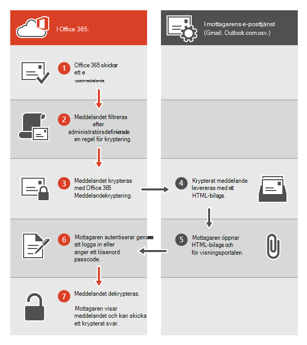
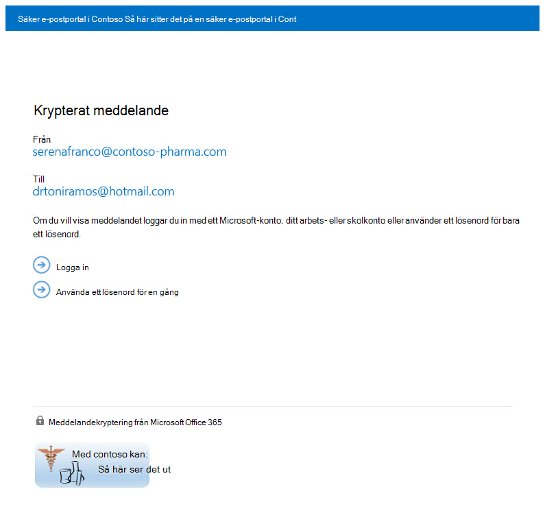

# <a name="legacy-information-for-office-365-message-encryption"></a>Äldre information för meddelandekryptering i Office 365 (OME)

Om du ännu inte har flyttat organisationen till de nya OME-funktionerna, men redan har distribuerat OME, gäller informationen i den här artikeln för din organisation. Microsoft rekommenderar att du gör en plan för att flytta över till de nya OME-funktionerna så snart det är lämpligt för din organisation. Instruktioner finns i [Konfigurera nya Meddelandekryptering i Office 365 funktioner som bygger på Azure Information Protection.](set-up-new-message-encryption-capabilities.md) Om du vill veta mer om hur de nya funktionerna fungerar först kan du läsa mer [i Meddelandekryptering i Office 365](ome.md). Resten av den här artikeln refererar till OME-beteendet innan de nya OME-funktionerna släpps.
  
Med Meddelandekryptering i Office 365 kan din organisation skicka och ta emot krypterade e-postmeddelanden mellan personer inom och utanför organisationen. Meddelandekryptering i Office 365 fungerar med Outlook.com, Yahoo, Gmail och andra e-posttjänster. Kryptering av e-postmeddelanden säkerställer att endast tilltänkta mottagare kan visa meddelandeinnehållet.
  
Här är några exempel:
  
- En bankanställd skickar kreditkortsutdrag till kunder

- En representant för försäkringsbolag tillhandahåller information till kunder

- A mortgage broker requests financial information from a customer for a loan application

- En vårdcentral skickar information till patienter

- En jurist skickar konfidentiell information till en kund eller en annan jurist

## <a name="how-office-365-message-encryption-works-without-the-new-capabilities"></a>Så Meddelandekryptering i Office 365 fungerar utan de nya funktionerna

Meddelandekryptering i Office 365 är en onlinetjänst som bygger på Microsoft Azure Rights Management (Azure RMS). Med Azure RMS kan administratörer definiera e-postflödesregler för att fastställa villkoren för kryptering. En regel kan till exempel kräva kryptering av alla meddelanden som är adresserade till en viss mottagare.
  
När någon skickar ett e-postmeddelande Exchange Online meddelande som matchar en krypteringsregel skickas meddelandet med en HTML-bilaga. Mottagaren öppnar HTML-bilagan och följer instruktionerna för att visa det krypterade meddelandet på Meddelandekryptering i Office 365 portalen. Mottagaren kan välja att visa meddelandet genom att logga in med ett Microsoft-konto eller en arbetsplats eller skola som är kopplad till Office 365, eller genom att använda ett lösenord för ett lösenord. Båda alternativen säkerställer att endast den avsedda mottagaren kan visa det krypterade meddelandet. Den här processen skiljer sig mycket åt för de nya OME-funktionerna.
  
Följande diagram sammanfattar passagen av ett e-postmeddelande genom krypterings- och dekrypteringsprocessen.
  

  
Mer information finns i Tjänstinformation för äldre Meddelandekryptering i Office 365 innan de nya [OME-funktionerna släpps.](legacy-information-for-message-encryption.md#LegacyServiceInfo)
  
## <a name="defining-mail-flow-rules-for-office-365-message-encryption-that-dont-use-the-new-ome-capabilities"></a>Definiera e-postflödesregler Meddelandekryptering i Office 365 som inte använder de nya OME-funktionerna

För att Meddelandekryptering i Office 365 funktioner utan de nya funktionerna kan Exchange Online och Exchange Online Protection definiera Exchange e-postflödesregler. Dessa regler avgör under vilka förhållanden e-postmeddelanden ska krypteras, samt villkor för att ta bort meddelandekryptering. När en krypteringsåtgärd har angetts för en regel utför tjänsten åtgärden på alla meddelanden som matchar regelvillkoren innan meddelandena skickas.

E-postflödesregler är flexibla så att du kan kombinera villkor så att du kan uppfylla specifika säkerhetskrav i en enda regel. Du kan till exempel skapa en regel för att kryptera alla meddelanden som innehåller angivna nyckelord och som är adresserade till externa mottagare. Meddelandekryptering i Office 365 krypterar också svar från mottagare av krypterade e-postmeddelanden, och du kan skapa en regel som dekrypterar svaren för dina e-postanvändare. På så sätt behöver inte användarna i organisationen logga in på krypteringsportalen för att visa svar.
  
Mer information om hur du skapar Exchange-postflödesregler finns i [Definiera regler för Meddelandekryptering i Office 365.](define-mail-flow-rules-to-encrypt-email.md)
  
### <a name="use-the-eac-to-create-a-mail-flow-rule-for-encrypting-email-messages-without-the-new-ome-capabilities"></a>Använda EAC för att skapa en e-postflödesregel för att kryptera e-postmeddelanden utan de nya OME-funktionerna

1. Använd ett arbets- eller skolkonto som har beviljats global administratörsbehörighet i en webbläsare och logga [in på Office 365](https://support.office.com/article/b9582171-fd1f-4284-9846-bdd72bb28426#ID0EAABAAA=Web_browser).

2. Välj **panelen** Admin.

3. Välj Microsoft 365 administrationscenter i **administrationscentret** \> **för Exchange**.

4. I EAC går du till **E-postflödesregler** \>  och väljer **Ny** ny ikon Skapa en  \> **regel.** Mer information om hur du använder EAC finns Exchange [administrationscenter i Exchange Online](/exchange/exchange-admin-center).

5. Ange **ett** namn för regeln i Namn, till exempel Kryptera e-post för DrToniRamos@hotmail.com.

6. I **Använd den här regeln om** du väljer ett villkor och anger ett värde om det behövs. Om du till exempel vill kryptera meddelanden som kommer till DrToniRamos@hotmail.com:

   1. Välj **mottagaren är i Använd** den här regeln **om**.

   2. Välj ett befintligt namn i kontaktlistan eller skriv en ny e-postadress i **kryssrutan** namn.

      - Om du vill välja ett befintligt namn markerar du det i listan och klickar sedan på **OK.**

      - Om du vill ange ett nytt namn skriver du en e-postadress **i kryssrutan namn** och markerar sedan kryssrutan namn **som** \> **OK.**

7. Om du vill lägga till fler villkor **väljer du Fler** alternativ och sedan Lägg **till** villkor och väljer i listan.

   Om du till exempel bara vill använda regeln om  mottagaren finns utanför organisationen väljer du Lägg till villkor och sedan Mottagaren är **extern/intern** \> **Utanför organisationen** \> **OK.**

8. Om du vill aktivera kryptering utan att använda de  nya OME-funktionerna går du till Gör följande och väljer Ändra meddelandesäkerhet Använd den tidigare versionen av \> **OME** och väljer sedan **Spara**.

   Om du får ett felmeddelande om att IRM-licensiering inte är aktiverat använder du inte den äldre ome.

9. (Valfritt) Välj **lägg till åtgärd för** att ange en annan åtgärd.

### <a name="use-exchange-online-powershell-to-create-a-mail-flow-rule-for-encrypting-email-messages-without-the-new-ome-capabilities"></a>Använda Exchange Online PowerShell för att skapa en e-postflödesregel för att kryptera e-postmeddelanden utan de nya OME-funktionerna

1. Ansluta till Exchange Online PowerShell. Mer information finns i Anslut [till Exchange Online PowerShell.](/powershell/exchange/connect-to-exchange-online-powershell)

2. Skapa en regel med hjälp av **cmdleten New-TransportRule** och ställ in _parametern ApplyOME_ på `$true` .

   Det här exemplet kräver att alla e-postmeddelanden som DrToniRamos@hotmail.com måste krypteras.

   ```powershell
   New-TransportRule -Name "Encrypt rule for Dr Toni Ramos" -SentTo "DrToniRamos@hotmail.com" -SentToScope "NotinOrganization" -ApplyOME $true
   ```

   Var,

   - Det unika namnet på den nya regeln är "Kryptera regeln för Dr Toni Ramos".
   - Parametern _SkickatTill_ anger meddelandets mottagare (identifieras med namn, e-postadress, unikt namn osv.). I det här exemplet har mottagaren fått e-postadressen "DrToniRamos@hotmail.com".
   - Parametern _SentToScope_ anger platsen för meddelandets mottagare. I det här exemplet är mottagarens postlåda i hotmail och är inte en del av organisationen, så `NotInOrganization` värdet används.

   Detaljerad information om syntax och parametrar finns i [New-TransportRule](/powershell/module/exchange/New-TransportRule).

### <a name="remove-encryption-from-email-replies-encrypted-without-the-new-ome-capabilities"></a>Ta bort kryptering från e-postsvar som krypteras utan de nya OME-funktionerna

När dina e-postanvändare skickar krypterade meddelanden kan mottagare av dessa meddelanden svara med krypterade svar. Du kan skapa e-postflödesregler för att automatiskt ta bort kryptering från svar så att e-postanvändare i organisationen inte behöver logga in på krypteringsportalen för att visa dem. Du kan använda EAC- Windows PowerShell-cmdlet:arna för att definiera dessa regler. Du kan dekryptera meddelanden som skickas från organisationen eller meddelanden som svarar på meddelanden som skickas från din organisation. Du kan inte dekryptera krypterade meddelanden som kommer från utanför organisationen.

#### <a name="use-the-eac-to-create-a-rule-for-removing-encryption-from-email-replies-encrypted-without-the-new-ome-capabilities"></a>Använda EAC för att skapa en regel för att ta bort kryptering från e-postsvar som krypteras utan de nya OME-funktionerna

1. Använd ett arbets- eller skolkonto som har beviljats administratörsbehörighet i en webbläsare och logga [in på Office 365](https://support.office.com/article/b9582171-fd1f-4284-9846-bdd72bb28426#ID0EAABAAA=Web_browser).

2. Välj **panelen** Admin.

3. Välj Microsoft 365 administrationscenter i **administrationscentret** \> **för Exchange**.

4. I EAC går du till **E-postflödesregler** \>  och väljer **Ny** ny ikon Skapa en  \> **regel.** Mer information om hur du använder EAC finns Exchange [administrationscenter i Exchange Online](/exchange/exchange-admin-center).

5. Ange **ett** namn för regeln i Namn, till exempel Ta bort kryptering från inkommande e-post.

6. I **Använd den här regeln** väljer du de villkor där kryptering ska tas bort från meddelanden, till exempel Mottagaren **finns** \> **i organisationen**.

7. I **Gör följande väljer du** Ändra **meddelandesäkerhet Ta** bort den tidigare versionen av \> **OME.**

8. Välj **Spara**.

#### <a name="use-exchange-online-powershell-to-create-a-rule-to-remove-encryption-from-email-replies-encrypted-without-the-new-ome-capabilities"></a>Använd Exchange Online PowerShell för att skapa en regel för att ta bort kryptering från e-postsvar som krypteras utan de nya OME-funktionerna

1. Ansluta till Exchange Online PowerShell. Mer information finns i Anslut [till Exchange Online PowerShell.](/powershell/exchange/connect-to-exchange-online-powershell)

2. Skapa en regel med hjälp av **cmdleten New-TransportRule** och ställ in _RemoveOME-parametern_ på `$true` .

   Det här exemplet tar bort krypteringen från all e-post som skickas till mottagarna i organisationen.

   ```powershell
   New-TransportRule -Name "Remove encryption from incoming mail" -SentToScope "InOrganization" -RemoveOME $true
   ```

   Var,

   - Det unika namnet på den nya regeln är "Ta bort kryptering från inkommande e-post".
   - Parametern _SentToScope_ anger platsen för meddelandets mottagare. I det här exemplet `InOrganization` används värdet, som anger något av följande:
     - Mottagaren är en postlåda, e-postanvändare, grupp eller e-postaktiverad offentlig mapp i organisationen.
     - Mottagarens e-postadress finns i en godkänd domän som är konfigurerad som en auktoritativ domän eller en intern relädomän i organisationen _och_ meddelandet skickades eller togs emot via en autentiserad anslutning.

Detaljerad information om syntax och parametrar finns i [New-TransportRule](/powershell/module/exchange/New-TransportRule).

## <a name="sending-viewing-and-replying-to-messages-encrypted-without-the-new-capabilities"></a>Skicka, visa och svara på meddelanden som krypteras utan de nya funktionerna

Med Meddelandekryptering i Office 365 krypteras e-postmeddelanden automatiskt, baserat på administratörsdefinierade regler. Ett e-postmeddelande som krypterar ett krypterat meddelande kommer till mottagarens inkorg med en bifogad HTML-fil.
  
Mottagarna följer instruktionerna i meddelandet för att öppna den bifogade filen och autentisera med hjälp av ett Microsoft-konto eller en arbetsplats eller skola som är Office 365. Om mottagarna inte har något av kontona hänvisas de till att skapa ett Microsoft-konto där de kan logga in för att visa det krypterade meddelandet. Alternativt kan mottagarna välja att få en kod för att visa meddelandet. Efter att ha loggat in eller använt ett lösenord kan mottagarna visa det dekrypterade meddelandet och skicka ett krypterat svar.
  
## <a name="customize-encrypted-messages-with-office-365-message-encryption"></a>Anpassa krypterade meddelanden med Meddelandekryptering i Office 365

Som administratör Exchange Online och Exchange Online Protection kan du anpassa krypterade meddelanden. Du kan till exempel lägga till företagets varumärke och logotyp, ange en introduktion och lägga till ansvarsfriskrivningstext i krypterade meddelanden och i portalen där mottagare visar krypterade meddelanden. Med Windows PowerShell-cmdlets kan du anpassa följande aspekter av visningen för mottagare av krypterade e-postmeddelanden:

- Inledande text i e-postmeddelandet som innehåller det krypterade meddelandet

- Ansvarsfriskrivningstext i e-postmeddelandet som innehåller det krypterade meddelandet

- Portaltext som visas i meddelandevisningsportalen

- Logotyp som visas i e-postmeddelandet och visningsportalen

Du kan också när som helst återgå till standardinställningen.
  
I följande exempel visas en anpassad logotyp för ContosoPharma i e-postbilagaten:

> [!div class="mx-imgBorder"]
> 
  
**Anpassa krypterings-e-postmeddelanden och krypteringsportalen med företagets varumärke**
  
1. Anslut att Exchange Online använda Remote PowerShell enligt beskrivningen i [Anslut att Exchange Online med Remote PowerShell.](/powershell/exchange/connect-to-exchange-online-powershell)

2. Använd Set-OMEConfiguration cmdlet enligt beskrivningen här: [Set-OMEConfiguration](/powershell/module/exchange/set-omeconfiguration) eller använd följande tabell för vägledning.

   **Anpassningsalternativ för kryptering**

   | Så här anpassar du den här funktionen i krypteringsupplevelsen | Använd följande Windows PowerShell kommandon |
   |:-----|:-----|
   |Standardtext som medföljer krypterade e-postmeddelanden  <br/> Standardtexten visas ovanför instruktionerna för att visa krypterade meddelanden  <br/> | `Set-OMEConfiguration -Identity <OMEConfigurationIdParameter> -EmailText "<string of up to 1024 characters>"` <br/> **Exempel:**`Set-OMEConfiguration -Identity "OME Configuration" -EmailText "Encrypted message from ContosoPharma secure messaging system"` <br/> |
   |Ansvarsfriskrivningsutdrag i e-postmeddelandet som innehåller det krypterade meddelandet  <br/> | `Set-OMEConfiguration -Identity <OMEConfigurationIdParameter> DisclaimerText "<your disclaimer statement, string of up to 1024 characters>"` <br/> **Exempel:**`Set-OMEConfiguration -Identity "OME Configuration" -DisclaimerText "This message is confidential for the use of the addressee only"` <br/> |
   |Text som visas högst upp i visningsportalen för krypterade e-postmeddelanden  <br/> | `Set-OMEConfiguration -Identity <OMEConfigurationIdParameter> -PortalText "<text for your portal, string of up to 128 characters>"` <br/> **Exempel:**`Set-OMEConfiguration -Identity "OME Configuration" -PortalText "ContosoPharma secure email portal"` <br/> |
   |Logotyp  <br/> | `Set-OMEConfiguration -Identity <OMEConfigurationIdParameter> -Image <Byte[]>` <br/> **Exempel:**`Set-OMEConfiguration -Identity "OME configuration" -Image (Get-Content "C:\Temp\contosologo.png" -Encoding byte)` <br/> Filformat som stöds: .png, .jpg, .bmp eller .tiff  <br/> Optimal storlek på logotypfilen: mindre än 40 kB  <br/> Optimal storlek på logotypbild: 170 x 70 bildpunkter  <br/> |

**Så här tar du bort anpassningar av varumärket från krypteringsmeddelanden och krypteringsportalen**
  
1. Anslut att Exchange Online använda Remote PowerShell enligt beskrivningen i [Anslut att Exchange Online med Remote PowerShell.](/powershell/exchange/connect-to-exchange-online-powershell)

2. Använd Set-OMEConfiguration cmdlet enligt beskrivningen här: [Set-OMEConfiguration](/powershell/module/exchange/set-omeconfiguration). Om du vill ta bort organisationens anpassningar av ansvarsfriskrivningstext, e-posttext och portaltext anger du värdet som en tom  `""` sträng. För alla bildvärden, till exempel Logotyp, ställer du in värdet på  `"$null"` .

   **Anpassningsalternativ för kryptering**

   | Om du vill återställa den här funktionen i krypteringen till standardtexten och standardbilden | Använd följande Windows PowerShell kommandon |
   |:-----|:-----|
   |Standardtext som medföljer krypterade e-postmeddelanden  <br/> Standardtexten visas ovanför instruktionerna för att visa krypterade meddelanden  <br/> | `Set-OMEConfiguration -Identity <OMEConfigurationIdParameter> -EmailText "<empty string>"` <br/> **Exempel:**`Set-OMEConfiguration -Identity "OME Configuration" -EmailText ""` <br/> |
   |Ansvarsfriskrivningsutdrag i e-postmeddelandet som innehåller det krypterade meddelandet  <br/> | `Set-OMEConfiguration -Identity <OMEConfigurationIdParameter> DisclaimerText "<empty string>"` <br/> **Exempel:**`Set-OMEConfiguration -Identity "OME Configuration" -DisclaimerText ""` <br/> |
   |Text som visas högst upp i visningsportalen för krypterade e-postmeddelanden  <br/> | `Set-OMEConfiguration -Identity <OMEConfigurationIdParameter> -PortalText "<empty string>"` <br/> **Exempel som återställer till standard:**`Set-OMEConfiguration -Identity "OME Configuration" -PortalText ""` <br/> |
   |Logotyp  <br/> | `Set-OMEConfiguration -Identity <OMEConfigurationIdParameter> -Image <"$null">` <br/> **Exempel som återställer till standard:**`Set-OMEConfiguration -Identity "OME configuration" -Image $null` <br/> |

## <a name="service-information-for-legacy-office-365-message-encryption-prior-to-the-release-of-the-new-ome-capabilities"></a>Tjänstinformation för äldre Meddelandekryptering i Office 365 innan de nya OME-funktionerna släpptes
<a name="LegacyServiceInfo"> </a>

Följande tabell innehåller teknisk information om Meddelandekryptering i Office 365 tjänsten innan de nya OME-funktionerna släpps.
  
| Tjänstinformation | Beskrivning |
|:-----|:-----|
|Krav för klientenhet  <br/> |Krypterade meddelanden kan visas på alla klientenheten så länge som den bifogade HTML-filen kan öppnas i en modern webbläsare som har stöd för formulärinlägg.  <br/> |
|Krypteringsalgoritm och FIPS-efterlevnad (Federal Information Processing Standards)  <br/> |Meddelandekryptering i Office 365 använder samma krypteringsnycklar som Windows Azure Information Rights Management (IRM) och har stöd för Cryptographic Mode 2 (2K-tangenten för RSA och 256 bitars nyckel för SHA-1-system). Mer information om de underliggande iRM-kryptografiska lägena finns [i AD RMS Cryptographic Modes.](/previous-versions/windows/it-pro/windows-server-2008-R2-and-2008/hh867439(v=ws.10))  <br/> |
|Meddelandetyper som stöds  <br/> |Meddelandekryptering i Office 365 stöds endast för objekt som har **IPM-meddelandeklass-ID. Obs!** Mer information finns i [Objekttyper och meddelandeklasser.](/office/vba/outlook/Concepts/Forms/item-types-and-message-classes)  <br/> |
|Storleksbegränsningar för meddelanden  <br/> |Meddelandekryptering i Office 365 kan kryptera meddelanden på upp till 25 megabyte. Mer information om storleksbegränsningar för meddelanden finns i [Exchange Online Begränsningar.](/office365/servicedescriptions/exchange-online-service-description/exchange-online-limits)  <br/> |
|Exchange Online principer för e-postlagring  <br/> |Exchange Online krypterade meddelanden lagras inte.  <br/> |
|Språkstöd för Meddelandekryptering i Office 365  <br/> | Office 365 Meddelandekryptering stöder Microsoft 365 språk, enligt följande:  <br/>  Inkommande e-postmeddelanden och bifogade HTML-filer lokaliseras utifrån avsändarens språkinställningar.  <br/>  Visningsportalen lokaliseras baserat på mottagarens webbläsarinställningar.  <br/>  Brödtexten (innehållet) i det krypterade meddelandet lokaliseras inte.  <br/> |
|Sekretessinformation för OME-portalen och OME-visningsappen  <br/> |Sekretesspolicyn [Office 365 Messaging Encryption Portal](https://privacy.microsoft.com/privacystatement) innehåller detaljerad information om vad Microsoft gör och inte gör med din privata information.  <br/> |

## <a name="frequently-asked-questions-about-legacy-ome"></a>Vanliga frågor och svar om äldre OME
<a name="LegacyServiceInfo"> </a>

Har du frågor om Meddelandekryptering i Office 365? Här är några svar. Om du inte hittar det du behöver kan du titta i [Microsoft Tech Community-forumen och titta efter Office 365](https://techcommunity.microsoft.com/t5/Office-365/ct-p/Office365).
  
 **F. Mina användare skickar krypterade e-postmeddelanden till mottagare utanför vår organisation. Finns det något som externa mottagare måste göra för att kunna läsa och svara på e-postmeddelanden som är krypterade med Meddelandekryptering i Office 365?**
  
Mottagare utanför organisationen som tar Microsoft 365 krypterade meddelanden kan visa dem på ett av två sätt:
  
- Genom att logga in med ett Microsoft-konto eller ett arbets- eller skolkonto som är Office 365.

- Genom att använda en kod för ett lösenord.

 **F. Lagras Microsoft 365 krypterade meddelanden i molnet eller på Microsoft-servrar?**
  
Nej, de krypterade meddelandena lagras på mottagarens e-postsystem och när mottagaren öppnar meddelandet publiceras det tillfälligt för visning på Microsofts servrar. Meddelandena lagras inte där.
  
 **F. Kan jag anpassa krypterade e-postmeddelanden med mitt varumärke?**
  
Ja. Du kan använda Windows PowerShell cmdlets för att anpassa standardtexten som visas högst upp i krypterade e-postmeddelanden, ansvarsfriskrivningstexten och logotypen som du vill använda för e-postmeddelandet och krypteringsportalen. Den här funktionen är nu tillgänglig i OMEv2. Mer information finns i [Lägga till profilering i krypterade meddelanden.](add-your-organization-brand-to-encrypted-messages.md)
  
 **F. Kräver tjänsten en licens för alla användare i min organisation?**
  
En licens krävs för alla användare i organisationen som skickar krypterade e-postmeddelanden.
  
 **F. Kräver externa mottagare prenumerationer?**
  
Nej, externa mottagare behöver inte en prenumeration för att läsa eller svara på krypterade meddelanden.
  
 **F. Hur skiljer Meddelandekryptering i Office 365 från RMS (Rights Management Services)?**
  
RMS tillhandahåller informationsskyddsfunktioner för organisationens interna e-postmeddelanden genom att tillhandahålla inbyggda mallar, till exempel: Vidarebefordra inte och Konfidentiellt. Meddelandekryptering i Office 365 har stöd för kryptering av e-postmeddelanden för meddelanden som skickas till externa mottagare samt interna mottagare.
  
 **F. Hur skiljer sig Meddelandekryptering i Office 365 från S/MIME?**
  
S/MIME är i princip en krypteringsteknik på klientsidan och kräver komplicerad certifikathantering och publiceringsinfrastruktur. Meddelandekryptering i Office 365 använder e-postflödesregler (kallas även transportregler) och är inte beroende av certifikatpublicering.
  
 **F. Kan jag läsa krypterade meddelanden på mobila enheter?**
  
Ja, du kan visa meddelanden på Android och iOS genom att ladda ned OME-visningsapparna från Google Play-butiken och Apple App Store. Öppna den bifogade HTML-filen i OME-visningsappen och öppna det krypterade meddelandet genom att följa instruktionerna. För andra mobila enheter kan du öppna den bifogade HTML-filen så länge din e-postklient har stöd för Formulärinlägg.
  
 **F. Krypteras svar och vidarebefordrade meddelanden?**
  
Ja. Svaren fortsätter att vara krypterade under trådens varaktighet.
  
 **F. Erbjuder Meddelandekryptering i Office 365 lokalisering?**
  
Inkommande e-post och HTML-innehåll lokaliseras baserat på avsändarens e-postinställningar. Visningsportalen lokaliseras baserat på mottagarens webbläsarinställningar. Men själva brödtexten (innehållet) i krypterade meddelanden lokaliseras inte.
  
 **F. Vilken krypteringsmetod används för Meddelandekryptering i Office 365?**
  
Meddelandekryptering i Office 365 använder RMS (Rights Management Services) som krypteringsinfrastruktur. Vilken krypteringsmetod som används beror på var du hämtar RMS-tangenterna som används för att kryptera och dekryptera meddelanden.
  
- Om du använder Microsoft Azure RMS för att hämta knapparna används Cryptographic Mode 2. Cryptographic Mode 2 är en uppdaterad och förbättrad implementering av AD RMS-kryptografik. Det har stöd för RSA 2048 för signatur och kryptering och har stöd för SHA-256 för signatur.

- Om du använder Active Directory (AD) RMS för att hämta nycklarna används antingen Cryptographic Mode 1 eller Cryptographic Mode 2. Vilken metod som används beror på din lokala AD RMS-distribution. Cryptographic Mode 1 är den ursprungliga AD RMS-kryptografiska implementeringen. Det har stöd för RSA 1024 för signatur och kryptering och har stöd för SHA-1 för signatur. Det här läget stöds fortfarande av alla aktuella versioner av RMS.

Mer information finns i [Ad RMS Cryptographic Modes.](/previous-versions/windows/it-pro/windows-server-2008-R2-and-2008/hh867439(v=ws.10))
  
**F. Varför säger vissa krypterade meddelanden att de kommer från** Office365@messaging.microsoft.com?
  
När ett krypterat svar skickas från krypteringsportalen eller via OME-visningsappen sätts den avsändande e-postadressen till Office365@messaging.microsoft.com eftersom det krypterade meddelandet skickas via en Microsoft-slutpunkt. Det här förhindrar att krypterade meddelanden markeras som skräppost. Det namn som visas på e-postmeddelandet och adressen i krypteringsportalen ändras inte på grund av den här etiketten. Etiketten gäller även endast meddelanden som skickas via portalen, inte via någon annan e-postklient.
  
 **F. Jag har ett abonnemang Exchange värdkryptering (EHE). Var kan jag läsa mer om uppgraderingen av Meddelandekryptering i Office 365?**
  
Alla EHE-kunder har uppgraderats till Meddelandekryptering i Office 365. Mer information finns i [uppgraderingscentret för Exchange-värd.](../security/defender-365-security/exchange-online-protection-overview.md)
  
 **F. Måste jag öppna URL:er, IP-adresser eller portar i organisationens brandvägg för att stödja Meddelandekryptering i Office 365?**
  
Ja. Du måste lägga till URL:er för Exchange Online i listan över tillåtna för din organisation för att aktivera autentisering för meddelanden som krypteras av Meddelandekryptering i Office 365. En lista över url Exchange Online adresser finns i Microsoft 365 [och IP-adressintervall.](../enterprise/urls-and-ip-address-ranges.md)
  
 **F. Hur många mottagare kan jag skicka ett Microsoft 365 krypterat meddelande till?**
  
Mottagargränsen är 500 mottagare per meddelande, eller, i kombination efter distributionslistans expansion, 11 980 tecken i fältet Till för meddelandet, beroende på vilket som kommer först. 
  
 **F. Går det att återkalla ett meddelande som skickas till en viss mottagare?**
  
Nej. Du kan inte återkalla ett meddelande till en viss person efter att det skickats.
  
 **F. Kan jag visa en rapport över krypterade meddelanden som har tagits emot och lästs?**
  
Det finns ingen rapport som visar om ett krypterat meddelande har visats, men det finns Microsoft 365-rapporter tillgängliga som du kan använda för att avgöra antalet meddelanden som matchade en viss e-postflödesregel (kallas även transportregel), till exempel.
  
 **F. Vad gör Microsoft med den information jag tillhandahåller via OME-portalen och OME-visningsappen?**
  
Sekretesspolicyn [Office 365 Messaging Encryption Portal](https://privacy.microsoft.com/privacystatement) innehåller detaljerad information om vad Microsoft gör och inte gör med din privata information.

**F. Vad gör jag om jag inte får koden för ett lösenord när jag har begärt den?**

Kontrollera först skräppostmappen i e-postklienten. DKIM- och DMARC-inställningarna för din organisation kan leda till att dessa e-postmeddelanden filtreras som skräppost.

Kontrollera sedan karantänen i säkerhets- & säkerhets- och efterlevnadscentret. Ofta kan meddelanden som innehåller en kod för ett lösenord, särskilt de första som organisationen får, hamna i karantän.