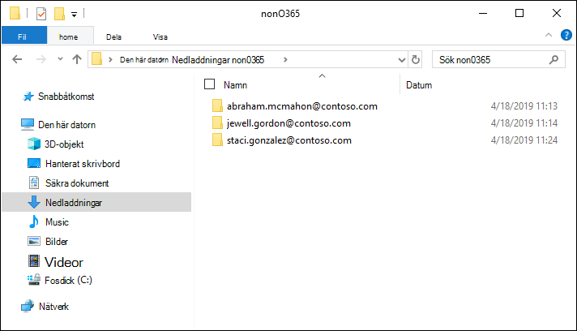
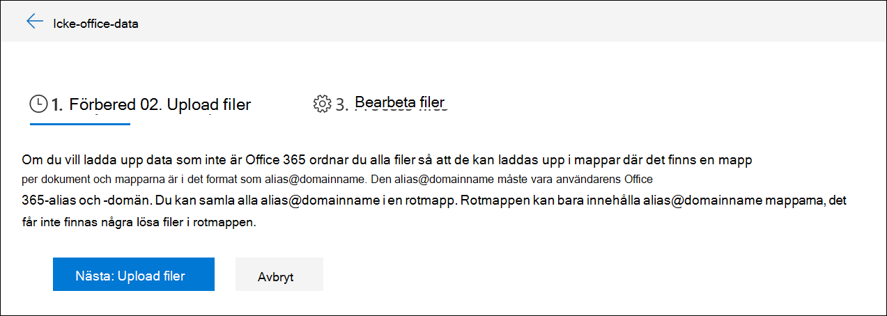
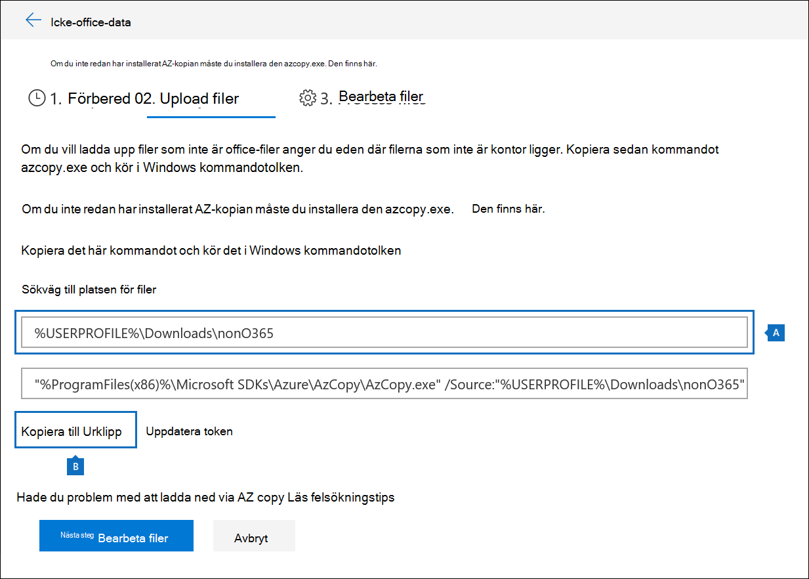
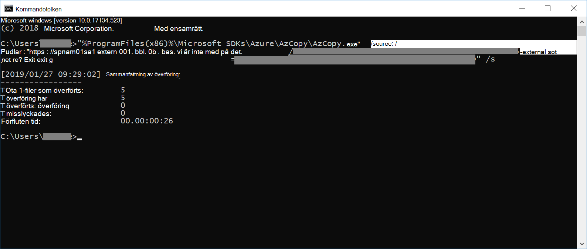
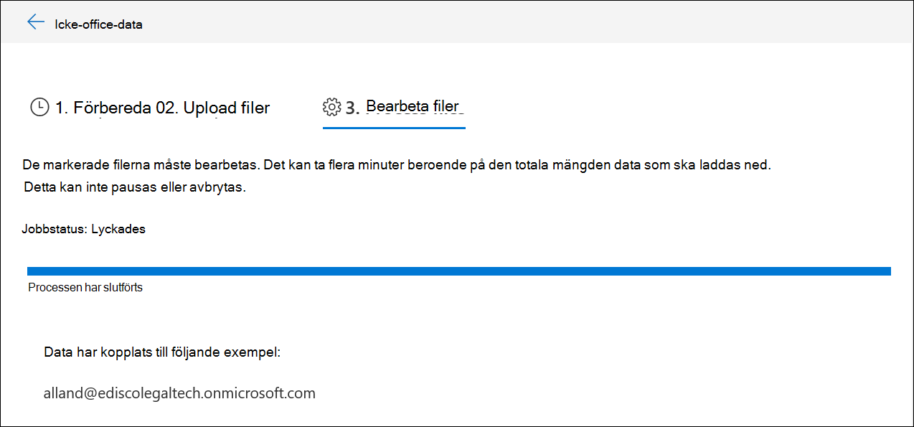

# Läsa in data som Microsoft 365 i en granskningsuppsättningLoad non-Microsoft 365 data into a review set

Alla dokument som du behöver analysera i Advanced eDiscovery finns inte i Microsoft 365.Not all documents that you need to analyze in Advanced eDiscovery are located in Microsoft 365. Med funktionen för Microsoft 365 dataimport i Advanced eDiscovery kan du ladda upp dokument som inte finns i Microsoft 365 till en granskningsuppsättning.With the non-Microsoft 365 data import feature in Advanced eDiscovery, you can upload documents that aren't located in Microsoft 365 to a review set. Den här artikeln visar hur du för in icke-Microsoft 365 dokument till Advanced eDiscovery för analys.This article shows you how to bring your non-Microsoft 365 documents into Advanced eDiscovery for analysis.

## Krav för att överföra innehåll som inte Office 365 innehållRequirements to upload non-Office 365 content

Om du använder funktionen för uppladdning Microsoft 365 som beskrivs i den här artikeln krävs att du har följande:Using the upload non-Microsoft 365 feature described in this article requires that you have the following:

- Alla medarbetare som du vill associera icke-Microsoft 365 måste tilldelas rätt licens.All custodians that you want to associate non-Microsoft 365 content to must be assigned the appropriate license. Mer information finns i [Komma igång med Advanced eDiscovery](get-started-with-advanced-ediscovery.md#step-1-verify-and-assign-appropriate-licenses).For more information, see [Get started with Advanced eDiscovery](get-started-with-advanced-ediscovery.md#step-1-verify-and-assign-appropriate-licenses).

- Ett befintligt Advanced eDiscovery ärende.An existing Advanced eDiscovery case.

- Dokumentföretag måste läggas till i ärendet innan du kan överföra och associera icke-Microsoft 365 data med dem.Custodians must be added to the case before you can upload and associate the non-Microsoft 365 data to them.

- Icke-Microsoft 365-data måste vara en filtyp som stöds av Advanced eDiscovery.Non-Microsoft 365 data must be a file type that's supported by Advanced eDiscovery. Mer information finns i [Filtyper som stöds i Advanced eDiscovery](supported-filetypes-ediscovery20.md).For more information, see [Supported file types in Advanced eDiscovery](supported-filetypes-ediscovery20.md).

- Alla filer som laddas upp till en granskningsuppsättning måste finnas i mappar, där varje mapp är associerad med en särskild person.All files that are uploaded to a review set must be located in folders, where each folder is associated with a specific custodian. Namnen för de här mapparna måste ha följande namnformat: *alias@domainname*.The names for these folders must use the following naming format: *alias@domainname*. Den alias@domainname måste vara användarens alias Microsoft 365 och domän.The alias@domainname must be the user's Microsoft 365 alias and domain. Du kan samla alla alias@domainname i en rotmapp.You can collect all the alias@domainname folders in a root folder. Rotmappen kan endast innehålla alias@domainname mappar.The root folder can only contain the alias@domainname folders. Lösa filer i rotmappen stöds inte.Loose files in the root folder aren't supported.

   Mappstrukturen för de icke-Microsoft 365 data som du vill ladda upp liknar följande exempel:The folder structure for the non-Microsoft 365 data that you want to upload would be similar to the following example:

   - c:\nonO365\abraham.mcmahon@contoso.comc:\nonO365\abraham.mcmahon@contoso.com
   - c:\nonO365\jewell.gordon@contoso.comc:\nonO365\jewell.gordon@contoso.com
   - c:\nonO365\staci.gonzalez@contoso.comc:\nonO365\staci.gonzalez@contoso.com

   Där abraham.mcmahon@contoso.com, jewell.gordon@contoso.com, och staci.gonzalez@contoso.com är i det fallet SMTP-adresserna till biblioteksadresserna.Where abraham.mcmahon@contoso.com, jewell.gordon@contoso.com, and staci.gonzalez@contoso.com are the SMTP addresses of custodians in the case.

   

- Ett konto som har tilldelats rollgruppen för eDiscovery-hanteraren (och lagts till som eDiscovery-administratör).An account that is assigned to the eDiscovery Manager role group (and added as eDiscovery Administrator).

- Verktyget AzCopy v8.1 är installerat på en dator som har tillgång till den Microsoft 365 andra innehållsmappstrukturen.The AzCopy v8.1 tool installed on a computer that has access to the non-Microsoft 365 content folder structure. Information om hur du installerar AzCopy finns i [Överföra data med AzCopy v8.1 på Windows](/previous-versions/azure/storage/storage-use-azcopy).To install AzCopy, see [Transfer data with the AzCopy v8.1 on Windows](/previous-versions/azure/storage/storage-use-azcopy). Installera AzCopy på standardplatsen, d.v.s. **%ProgramFiles(x86)%\Microsoft SDKs\Azure\AzCopy**.Be sure to install AzCopy in the default location, which is **%ProgramFiles(x86)%\Microsoft SDKs\Azure\AzCopy**. Du måste använda AzCopy v8.1.You must use AzCopy v8.1. Andra versioner av AzCopy kanske inte fungerar vid inläsning av Microsoft 365-data i Advanced eDiscovery.Other versions of AzCopy may not work when loading non-Microsoft 365 data in Advanced eDiscovery.

## Upload icke-Microsoft 365 innehåll i Advanced eDiscoveryUpload non-Microsoft 365 content into Advanced eDiscovery

1. Som eDiscovery Manager eller eDiscovery-administratör öppnar du Advanced eDiscovery och går till den händelse som icke-Microsoft 365-data laddas upp till.As an eDiscovery Manager or eDiscovery Administrator, open Advanced eDiscovery, and go to the case that the non-Microsoft 365 data will be uploaded to.  

2. Klicka **på Granska uppsättningar** och välj sedan granskningsuppsättningen för att ladda upp de Microsoft 365 data till.Click **Review sets**, and then select the review set to upload the non-Microsoft 365 data to.  Om du inte har någon granskningsuppsättning kan du skapa en.If you don't have a review set, you can create one. 
 
3. I granskningsuppsättningen klickar du på Hantera **granskningsuppsättning** och sedan på Visa uppladdningar på **panelen Microsoft 365 data.** In the review set, click **Manage review set**, and then click **View uploads** on the **Non-Microsoft 365 data** tile.

4. Klicka **Upload filer för** att starta dataimportguiden.Click **Upload files** to start the data import wizard.

   

   Det första steget i guiden förbereder en säker plats från Microsoft som Azure Storage att ladda upp filerna till.The first step in the wizard prepares a secure Microsoft-provided Azure Storage location to upload the files to.  När förberedelsen är klar **blir knappen Upload filer** aktiv.When the preparation is completed, the **Next: Upload files** button becomes active.

   
 
5. Klicka **på Nästa: Upload filer**.Click **Next: Upload files**.

6. På **Upload filer** gör du följande:On the **Upload files** page, do the following:

   

   a.a. I rutan **Sökväg till platsen för** filer verifierar du eller anger platsen för rotmappen där du har lagrat de Microsoft 365 data du vill ladda upp.In the **Path to location of files** box, verify or type the location of the root folder where you've stored the non-Microsoft 365 data you want to upload. Exempel: För platsen för de exempelfiler som visas i avsnittet Innan du börjar skriver du **%USERPROFILE\Nedladdningar\nonO365**.For example, for the location of the example files shown in the **Before you begin section**, you would type **%USERPROFILE\Downloads\nonO365**. När du har rätt plats ser du till att AzCopy-kommandot som visas i rutan under sökvägen uppdateras korrekt.Providing the correct location ensures the AzCopy command displayed in box under the path is properly updated.

   b.b. Klicka **på Kopiera till Urklipp** för att kopiera kommandot som visas i rutan.Click **Copy to clipboard** to copy the command that is displayed in the box.

7. Starta en Windows kommandotolk, klistra in kommandot som du kopierade  i föregående steg och tryck sedan på Retur för att starta kommandot AzCopy.Start a Windows command prompt, paste the command that you copied in the previous step, and then press **Enter** to start the AzCopy command.  När du startar kommandot laddas filerna som Microsoft 365 upp till den plats Azure Storage förbereddes i steg 4.After you start the command, the non-Microsoft 365 files will be uploaded to the Azure Storage location that was prepared in step 4.

   

   > [!NOTE]
   > Som tidigare nämnts måste du använda AzCopy v8.1 för att kunna använda kommandot som finns på **sidan Upload filer.**As previously stated, you must use AzCopy v8.1 to successfully use the command that's provided on the **Upload files** page. Om det angivna AzCopy-kommandot misslyckas kan du [gå till Felsöka AzCopy i Advanced eDiscovery.](troubleshooting-azcopy.md)If the supplied AzCopy command fails, please see [Troubleshoot AzCopy in Advanced eDiscovery](troubleshooting-azcopy.md).

8. Gå tillbaka till säkerhets- & säkerhets- och efterlevnadscentret och **klicka på Nästa: Bearbeta** filer i guiden.Go back to the Security & Compliance Center, and click **Next: Process files** in the wizard.  Detta initierar bearbetning, text extrahering och indexering av de Microsoft 365 filer som laddats upp till Azure Storage platsen.This initiates processing, text extraction, and indexing of the non-Microsoft 365 files that were uploaded to the Azure Storage location.  

9. Spåra förloppet för bearbetningen av filerna på  sidan **Processfiler** eller på fliken Jobb genom att visa ett jobb med namnet Lägga till **Microsoft 365-data i en uppsättning med granskare.**Track the progress of processing the files on the **Process files** page or on the **Jobs** tab by viewing a job named **Adding non-Microsoft 365 data to a review set**.  När jobbet är klart blir de nya filerna tillgängliga i granskningsuppsättningen.After the job is finished, the new files will be available in the review set.

   

10. När bearbetningen är klar kan du stänga guiden.After the processing is finished, you can close the wizard.