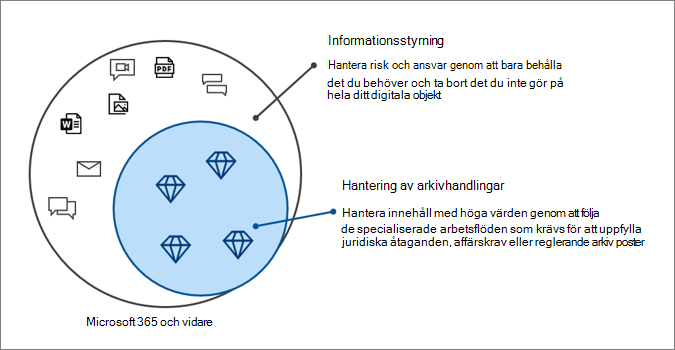

# Microsoft Informationsstyrning i Microsoft 365Microsoft Information Governance in Microsoft 365

>*[Licensieringsvägledning för Microsoft 365 för säkerhet och efterlevnad](/office365/servicedescriptions/microsoft-365-service-descriptions/microsoft-365-tenantlevel-services-licensing-guidance/microsoft-365-security-compliance-licensing-guidance).**[Microsoft 365 licensing guidance for security & compliance](/office365/servicedescriptions/microsoft-365-service-descriptions/microsoft-365-tenantlevel-services-licensing-guidance/microsoft-365-security-compliance-licensing-guidance).*

Använd Microsoft Informationsstyrning (ibland förkortad till MIG) för att styra dina data för efterlevnad eller regleringskrav.Use Microsoft Information Governance (sometimes abbreviated to MIG) capabilities to govern your data for compliance or regulatory requirements.

Vill du skydda dina data?Looking to protect your data? Se [Microsoft Informationsskydd i Microsoft 365](information-protection.md).See [Microsoft Information Protection in Microsoft 365](information-protection.md).

För att hjälpa dig att följa föreskrifterna för datasekretess har vi utformat ett arbetsflöde som vägleder dig genom hela processen för att planera och implementera funktioner i Microsoft 365, inklusive säker åtkomst, skydd mot hot, informationsskydd och datastyrning. Mer information finns i [Distribuera informationsskydd för föreskrifter för datasekretess med Microsoft 365](../solutions/information-protection-deploy.md) (aka.ms/m365dataprivacy).To help you comply with data privacy regulations, we’ve designed a workflow to guide you through an end-to-end process to plan and implement capabilities across Microsoft 365, including secure access, threat protection, information protection, and data governance. For more information, see [Deploy information protection for data privacy regulations with Microsoft 365](../solutions/information-protection-deploy.md) (aka.ms/m365dataprivacy). 

## InformationsstyrningInformation governance

Om du vill behålla det du behöver och ta bort det du inte behöver:To keep what you need and delete what you don't:
 
|FunktionCapability|Vilka problem löser den?What problems does it solve?|Komma igångGet started|
|:------|:------------|:--------------------|:-----------------------------|
|[Kvarhållningsprinciper och -etiketterRetention policies and retention labels](retention.md)| Behålla eller ta bort innehåll med principhantering och ett borttagningsarbetsflöde för e-post, dokument, snabbmeddelanden med meraRetain or delete content with policy management and a deletion workflow for email, documents, instant messages, and more   Exempelscenario: [Tillämpa en kvarhållningsetikett till innehåll automatiskt](apply-retention-labels-automatically.md)Example scenario: [Apply a retention label to content automatically](apply-retention-labels-automatically.md) | [Komma igång med kvarhållningsprinciper och -etiketterGet started with retention policies and retention labels](get-started-with-retention.md)|
|[ImporttjänstImport service](importing-pst-files-to-office-365.md)| Massimporterar PST-filer till Exchange Online-postlådor för att behålla och söka i e-postmeddelanden efter efterlevnad eller regleringskravBulk-import PST files to Exchange Online mailboxes to retain and search email messages for compliance or regulatory requirements | [Använd nätverksuppladdning för att importera odin organisations PST-filer till Microsoft 365Use network upload to import your organization's PST files to Microsoft 365](use-network-upload-to-import-pst-files.md)|
|[Arkivera tredjepartsdataArchive third-party data](archiving-third-party-data.md)| Importera, arkivera och tillämpa efterlevnadslösningar för tredjepartsdata från plattformar för sociala medier, snabbmeddelanden och dokumentsamarbeteImport, archive, and apply compliance solutions to third-party data from social media platforms, instant messaging platforms, and document collaboration platforms| [TredjepartskopplingarThird-party connectors](archiving-third-party-data.md#third-party-data-connectors)|
|[Inaktiva postlådorInactive mailboxes](inactive-mailboxes-in-office-365.md)| Behåll postlådeinnehåll efter att anställda har lämnar organisationenRetain mailbox content after employees leave the organization | [Skapa och hantera inaktiva postlådorCreate and manage inactive mailboxes](create-and-manage-inactive-mailboxes.md)|

## Hantering av arkivhandlingarRecords management

För att hantera högvärdigt innehåll för juridiska-, affärs- eller regleringsåtaganden:To manage high-value content for legal, business, or regulatory obligations:

|FunktionCapability|Vilka problem löser den?What problems does it solve?|Komma igångGet started|
|:------|:------------|---------------------|:----------------------------|
|[Hantering av arkivhandlingarRecords management](records-management.md)| En enda lösning för e-post och dokument som integrerar kvarhållningsscheman och krav i en filplan som stöder hela livscykeln för ditt innehåll med arkivhandlingar av deklaration, kvarhållning och dispositionA single solution for email and documents that incorporates retention schedules and requirements into a file plan that supports the full lifecycle of your content with records declaration, retention, and disposition   Exempel scenario: [Disposition av arkivhandlingar](disposition.md#disposition-of-records)Example scenario: [Disposition of records](disposition.md#disposition-of-records)|[Kom igång med hantering av arkivhandlingarGet started with records management](get-started-with-records-management.md) |

## LicensieringskravLicensing requirements

Licensieringskrav för Microsofts informationsstyrning beror på de scenarier och funktioner du använder, i stället för att ange Licensieringskrav för varje funktion som listas på den här sidan.License requirements for Microsoft Information Governance depend on the scenarios and features you use, rather than set licensing requirements for each capability listed on this page. Mer information om dina Licensieringskrav och alternativ finns i avsnitten [Informationsstyrning](/office365/servicedescriptions/microsoft-365-service-descriptions/microsoft-365-tenantlevel-services-licensing-guidance/microsoft-365-security-compliance-licensing-guidance#information-governance) och [Hantering av arkivhandlingar](/office365/servicedescriptions/microsoft-365-service-descriptions/microsoft-365-tenantlevel-services-licensing-guidance/microsoft-365-security-compliance-licensing-guidance#records-management) från Microsoft 365-licensieringsdokumentationen och ladda ned den relaterade PDF- eller Excel-filen.To understand your licensing requirements and options, see the [Information Governance](/office365/servicedescriptions/microsoft-365-service-descriptions/microsoft-365-tenantlevel-services-licensing-guidance/microsoft-365-security-compliance-licensing-guidance#information-governance) and [Records Management](/office365/servicedescriptions/microsoft-365-service-descriptions/microsoft-365-tenantlevel-services-licensing-guidance/microsoft-365-security-compliance-licensing-guidance#records-management) sections from the Microsoft 365 licensing documentation, and download the related PDF or Excel.