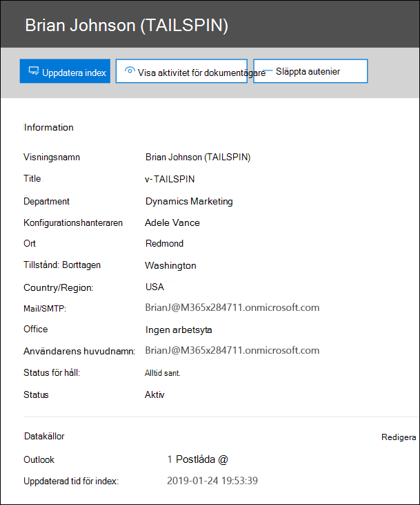
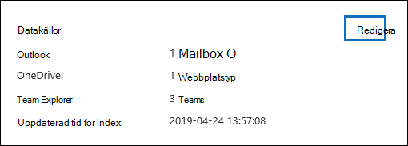
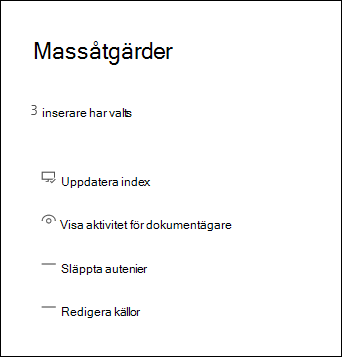

# Hantera s.Advanced eDiscovery s Advanced eDiscovery snManage custodians in an Advanced eDiscovery case

Sidan Dokument på fliken Källor **i ett** Advanced eDiscovery innehåller en lista över alla dokumentare som har lagts till i ärendet.The Custodians page on the **Sources** tab in an Advanced eDiscovery case contains a list of all custodians that have been added to the case. När du har lagt till vårdnadshavare till ett ärende samlas information om varje enskild person automatiskt in Azure Active Directory och visas i Advanced eDiscovery.After you add custodians to a case, details about each custodian are automatically collected from Azure Active Directory and are viewable in Advanced eDiscovery.

## Visa information om innnarnaView custodian details

Om du vill visa information om en vårdnadshavare klickar du på den som har namn på listan på fliken **Informatiska.** En utfällningssida visas och innehåller följande information om den som är den som har befallt dig:To view the details about a custodian, click the custodian from the list on the **Custodians** tab. A flyout page is displayed and contains the following information about the custodian:

- KontaktinformationContact information

  - **Visningsnamn** – Det namn som visas i adressboken för den som är vårdnadshavare.**Display Name** - The name displayed in the address book for the custodian. Det här är vanligtvis en kombination av den som förnamn, initial för mellannamn och efternamn.This is usually the combination of the custodian's first name, middle initial, and last name.
  
   - **Mail/SMTP** – Den primära SMTP-adressen för den som förser dokument med till exempel brianj@contoso.onmicrosoft.com.**Mail/SMTP** - The primary SMTP address for the custodian, for example, brianj@contoso.onmicrosoft.com. Den här användarens huvudnamn (UPN) visas också.The custodian's user principal name (UPN) is also listed.

  - **Titel** – Den inseriska befattningen.**Title** - The custodian's job title.

  - **Avdelning** – Namnet på avdelningen där den som förser den som arbetar.**Department** - The name for the department in which the custodian works.

  - **Chef** – den insertsiska chefen.**Manager** - The custodian's manager. Den utsedda chefen får eskaleringsmeddelanden till den här måsteen.The designated manager will receive any escalation communications for this custodian.
  
- PlatsinformationLocation information

  - **Ort** – Den stad där den som är vårdnadshavare finns.**City** - The city in which the custodian is located.

  - **Delstat** – delstat eller provins i den uppsnadiskt beserds adress.**State** - The state or province in the custodian's address.

  - **Land/region** – Landet/regionen där den som förser dig finns.**Country/Region** - The country/region where the custodian is located.

  - **Office** – Platsen för kontor i den som äger företaget.**Office** - The office location in the custodian's place of business.

- ÄrendeinformationCase information

  - **Status för håll** – anger om den som har blivit insnist har satts på is.**Hold status** - Indicates if the custodian has been placed on hold. 

  - **Kommunikationsstatus**: Anger om certifikats uppger att han eller hon har utfärdat en avis om väntande kort.**Communication status**: Indicates if the custodian has been issued a hold notice. Om certifikatägaren har utfärdat en avis är värdet för den här egenskapen **Publicerad.**If the custodian has been issued a notice, this value of this property is **Published**. Om den vårdnadshavare som inte har utfärdats ett meddelande är statusen **Ej publicerad.**If the custodian has not been issued a notice, the status is **Un-published**. 

  - **Status** – Den insereriska statusen i ärendet.**Status** - The status of the custodian within the case. En status för **Aktiv** anger att den som förser händelsen är en del av händelsen.A status of **Active** indicates that the custodian is part of the case. Om en vårdnadshavare frisläpps från ett ärende ändras status till **Släppt**.If a custodian is released from a case, the status is changed to **Released**. 

- Datakällor och indexeringsinformationData sources and indexing information

    - **Datakällor** – Visar antalet och typen av datakällor (postlådor, webbplatser och Teams) som är kopplade till den vårdnadshavare och som är en del av ärendet.**Data sources** - Shows the count and type of data sources (mailboxes, sites, and Teams) that are associated with the custodian and are part of the case.

    - **Uppdaterad tid för index** – Anger tid och datum för när det avancerade indexeringsjobbet senast utlöstes.**Index updated time** - Indicates the time and date for when the advanced indexing job was last triggered. Den här egenskapen anger också när den avancerade indexeringsprocessen pågår.This property will also indicate when the advanced indexing process is currently in progress.

## Redigera en vårdnadshavareEdit a custodian

I ditt fall kanske du upptäcker att det kan finnas ytterligare datakällor som är relevanta för en specifik & ditt ärende.As your case progresses, you may discover that there may be additional data sources relevant to a specific custodian & your case. I andra fall kanske du vill ta bort vissa datakällor som har granskats och anses som inte relevanta.In other scenarios, you may want to remove certain data sources that have been reviewed and deemed as not relevant.

Så här uppdaterar du datakällorna som är associerade med en datakälla:To update the data sources that are associated with a custodian:

1. Gå till **eDiscovery > Advanced eDiscovery** och öppna ärendet.Go to  **eDiscovery > Advanced eDiscovery** and open the case.
  
2. Klicka på **fliken** Källor.Click the **Sources** tab.
  
3. På sidan **Förser** med dokument väljer du en dokumenterare från listan och **klickar på Redigera** på den utfällade sidan.On the **Custodians** page, select a custodian from the list and click **Edit** on the flyout page.

    
  
4. Klicka **på fliken Välj datakällor** om du vill ändra inställningarna för den uppsl själva postlådan Exchange den andra postlådan och OneDrive konto klickar du på Välj **datakällor.**Click **Choose data sources** tab to change the settings for the custodian's Exchange mailbox and OneDrive account, click **Choose data sources**.
  
5. Klicka på **fliken Välj ytterligare datakällor** för att lägga till eller ta bort Teams, SharePoint postlådor Exchange postlådor associerade med den inserre.Click the **Select additional data sources** tab to add or remove Teams, SharePoint, or Exchange mailboxes associated with the custodian. 

    Mer information om datakällor som är associerade med en vårdnadshavare finns i [Lägga till vårdnadshavare i ett ärende.](add-custodians-to-case.md)For more information about data sources associated with a custodian, see [Add custodians to a case](add-custodians-to-case.md). 
  
6. Klicka **på Håll i förvar** för att aktivera eller inaktivera förvaringen för den som äger platsen.Click **Place custodial holds** to enable or disable the hold for the custodian.

## Omindexering av dataRe-index custodian data

I de flesta eDiscovery-arbetsflöden för juridiska undersökningar genomsöks en delmängd av en dokumentares data efter att den vårdnadshavare som har lagts till i ett juridiskt ärende.In most eDiscovery workflows for legal investigations, a subset of a custodian's data is searched after the custodian is added to a legal case. På grund av mycket stora filstorlekar eller eventuella skadade data kan vissa objekt i datakällorna som är associerade med en vårdnadshavare delvis indexeras delvis.Because of very large file sizes or possible data corruption, some items in the data sources associated with a custodian may be partially indexed. Med hjälp [av](indexing-custodian-data.md) den avancerade indexeringsfunktionerna i Advanced eDiscovery kan de flesta delvis indexerade objekt åtgärdas automatiskt genom att indexera om objekten på begäran.Using the [advanced indexing](indexing-custodian-data.md) capability in the Advanced eDiscovery, most partially indexed items can be automatically remediated by re-indexing these items on demand.

Om en vårdnadshavare läggs till i ett ärende indexeras de data som är associerade med den vårdnadshavaren automatiskt om (genom den avancerade indexeringsprocessen).When a custodian is added to a case, the data located in the data sources associated with the custodian is automatically re-indexed (by the advanced indexing process). Det innebär att du kan låta data vara kvar i stället för att behöva ladda ned och åtgärda dem och sedan söka dem offline).This means you can leave the data in-place instead of having to download and remediate it and then search it offline). Under livscykeln för ett juridiskt ärende kan det hända att nya datakällor kopplas till en dokumenterare.However, during the lifecycle of a legal case new data sources might be associated with a custodian. I det här fallet kan du indexera om den uppsövandes data genom att köra den avancerade indexeringsprocessen igen för att åtgärda alla delvis indexerade objekt och uppdatera indexet för de objekt som inte kan indexeras.In this case, you can re-index the custodian's data by re-running the advanced indexing process to remediate any partially indexed items and update the index for the custodian's data.

Så här utlöser du omindexeringsprocessen för att hantera delvis indexerade objekt:To trigger the re-indexing process to address partially indexed items:

1. Gå till **eDiscovery > Advanced eDiscovery** och öppna ärendet.Go to  **eDiscovery > Advanced eDiscovery** and open the case.

2. Klicka på **fliken** Källor.Click the **Sources** tab.

3. På sidan **Förserna** väljer du en användare vars data måste indexeras om.On the **Custodians** page, select a custodian whose data must be reindexed.

4. På den utfällade sidan klickar du **på Uppdatera index.**On the flyout page, click **Update index**.

   En dialogruta visas om att indexjobbet har skapats.A dialog is displayed saying the index job has been created.

Omindexering av registrerade data är en långvariga process. Motsvarande jobb som skapas heter Omindexering av **data.**Re-indexing custodian data is a long-running process; the corresponding job that's created is named **Re-indexing custodian data**. Du kan spåra förloppet på **fliken** Jobb eller på fliken Förnamn genom att övervaka statusen i kolumnen **Status för indexerat** jobb. You can track the progress on the **Jobs** tab or on the **Custodians** tab by monitoring the status in the **Indexing job status** column.

Mer information finns i:For more information, see:

- [Arbeta med bearbetning av felWork with processing errors](processing-data-for-case.md)

- [Hantera jobbManage jobs](managing-jobs-ediscovery20.md)

## Släppa en vårdnadshavare från ett ärendeRelease a custodian from a case

En vårdnadshavare frisläpps i situationer där ett ärende är avslutat, den som har en ansvarsskyldighet för att bevara innehållet för ett ärende eller när den som ska behåller sitt ärende inte längre anses vara relevant för ärendet.A custodian is released in situations where a case is closed, the custodian is no longer under obligation to preserve content for a case, or when the custodian is deemed to no longer be relevant to the case. 

Om du släpper en vårdnadshavare efter att ett meddelande om förvaring publicerades, skickas ett meddelande om detta till den som har skickat in ett meddelande om detta.If you release a custodian after a hold notice was published, a release notice will be sent to the custodian. Dessutom tas eventuella spärrade fall i datakällor som var kopplade till den som var associerad med den som äger den bort.Additionally, any holds placed on data sources that were associated with the custodian are removed. Om den vårdnadshavaren spärrades i tyst läge *,* där de inte har utfärdats någon form av aviseringar om juridiskt tillstånd, skickas inget meddelande om detta, men eventuella meddelanden som gjorts i datakällor som är associerade med den platsen tas bort.If the custodian was placed on a *silent hold*, where they weren't issued any legal hold notifications, a release notice will not be sent but any holds placed on data sources that were associated with that custodian are removed.

Så här släpper du en vårdnadshavare:To release a custodian: 

1. Gå till **eDiscovery > Advanced eDiscovery** och öppna ärendet.Go to  **eDiscovery > Advanced eDiscovery** and open the case.

2. Klicka på **fliken** Källor.Click the **Sources** tab.

3. På sidan **Förserna** och väljer sedan den insläppta person som ska friges från ärendet.On the **Custodians** page, and then select the custodian who is being released from the case.

4. På den utfällningssida som visas klickar du **på Släppenerer.**On the flyout page, click **Release custodian**.

   En varningssida visas med en förklaring om att om ett förvaringstecken placeras i en datakälla som är kopplad till den vårdnadshavaren tas det bort, att förvaringen kommer att tas bort och att alla andra förvaringstecken som är kopplade till ett annat Advanced eDiscovery gäller fortfarande.A warning page is displayed explaining that if a hold is placed on a data source associated with the custodian, the hold will be removed, and that any other hold associated with a different Advanced eDiscovery case will still apply. Det omfattar andra typer av bevarande- och kvarhållningsfunktioner (till exempel Microsoft 365 bevarandeprincip).That includes other types of preservation and retention features (such as a Microsoft 365 retention policy).

5. Klicka **på Ja** för att bekräfta att du vill släppa upp den som insläppt.Click **Yes** to confirm that you want to release the custodian. 

    Statusen för den här användaren **på**  fliken Förfallna sidor är Inställd på Släppt och **Status** för Håll på den utfällade sidan ändras till **Falskt.**The status for this user on the **Custodians** tab is set to **Released** and the **Hold status** on the flyout page is changed to **False**. 

> [!NOTE]
> En vårdnadshavare kan vara inblandade i flera rättsfall samtidigt.A custodian might be simultaneously involved in several legal cases. Om en vårdnadshavare frisläpps från ett ärende påverkas inte kvarhållen eller meddelanden från andra ärenden.When a custodian is released from a case, the holds and notifications across other matters won't be impacted.

## Massredigering av dokument dokumentBulk-edit custodians

Du kan använda massredigeraren för att redigera flera objekt samtidigt.You can use the bulk editor to edit multiple custodians as the same time. Det gör du genom att markera två  eller flera objekt på fliken Oformatörare för att visa massredigeraren och sedan klicka på en av uppgifterna.To do this, just select two or more custodians on the **Custodians** tab to display the bulk editor and then click one of tasks.

