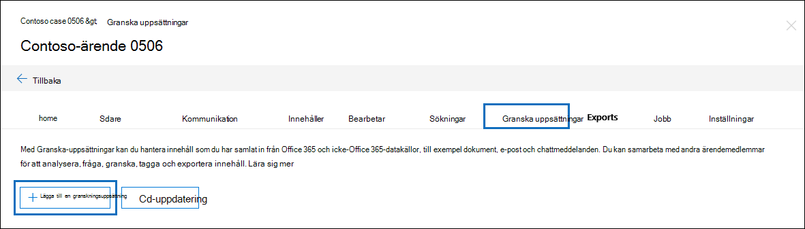
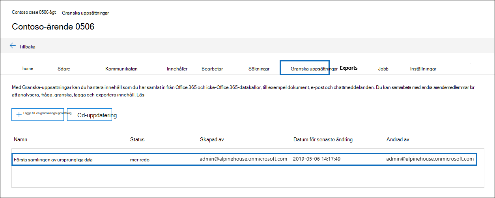
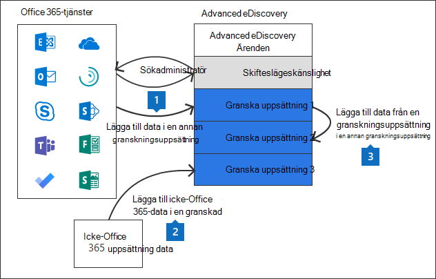

# Hantera granskningsuppsättningar i Advanced eDiscovery

Granska-uppsättningar är en statisk uppsättning dokument där du kan analysera, fråga, visa, tagga och exportera data i ett ärende. Mer information om hur du utför dessa uppgifter finns i:

- [Analysera data i en granskningsuppsättning](analyzing-data-in-review-set.md)

- [Fråga data i en granskningsuppsättning](review-set-search.md)

- [Visa dokument i en granskningsuppsättning](view-documents-in-review-set.md)

- [Tagga dokument i en granskningsuppsättning](tagging-documents.md)

- [Exportera ärendedata](exporting-data-ediscover20.md)

## Skapa en granskningsuppsättning

Du kan skapa granskningsuppsättningar på fliken **Granska uppsättningar genom** att klicka **på + Lägg till granskningsuppsättning.**

Ange ett **namn för granskningsuppsättningen** på den utfäll plats du vill lägga till granskningsuppsättningen och klicka sedan på **Spara.** Den nya granskningsuppsättningen visas i listan på **fliken Granska uppsättningar.**

Det finns tre olika sätt att lägga till data i en granskningsuppsättning i Advanced eDiscovery fall.

1. [Lägga till sökresultat i en granskningsuppsättning](add-data-to-review-set.md)

2. [Läsa in data som Microsoft 365 i en granskningsuppsättning](load-non-Office-365-data-into-a-review-set.md)

3. [Lägga till data i en granskningsuppsättning från en annan granskningsuppsättning](add-data-to-review-set-from-another-review-set.md)
