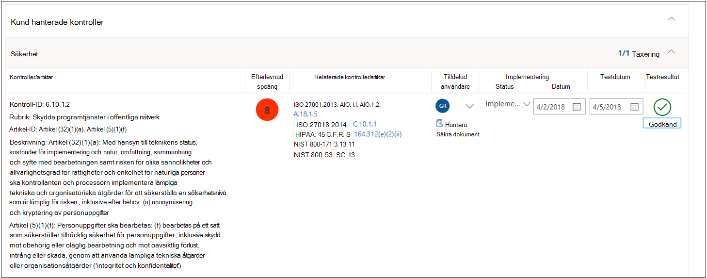
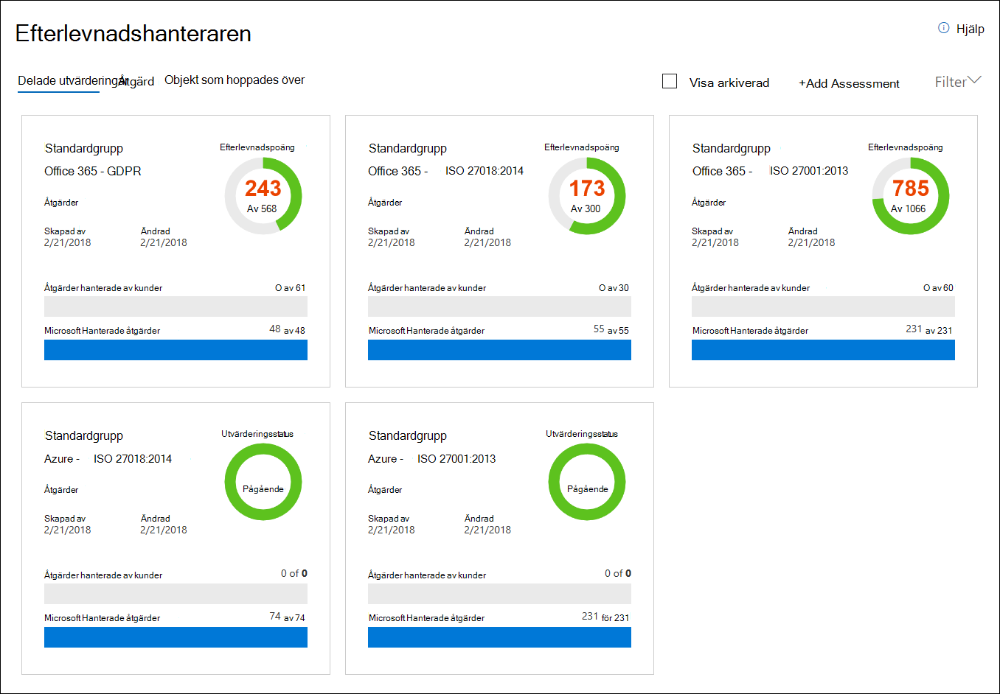

# Microsoft Efterlevnadshanteraren (klassisk)

> [!IMPORTANT]
> **Efterlevnadshanteraren (klassisk) kommer snart att tas bort från Microsoft Service Trust Portal.** Vi rekommenderar att du går över till den nya [Efterlevnadshanteraren i Efterlevnadscenter för Microsoft 365](https://compliance.microsoft.com/), som ger en bättre användarupplevelse och uppdaterad kontrollmappning. Kunder som har utvärderingar i den klassiska versionen måste skapa nya utvärderingar i den nya Efterlevnadshanteraren. Befintliga data, inklusive dina utvärderingar, kontroller och andra data, överförs inte till den nya Efterlevnadshanteraren. [Mer information om övergången](compliance-manager-faq.md#whats-happening-to-compliance-manager-classic-in-the-service-trust-portal).

*Efterlevnadshanteraren är inte tillgänglig i Office 365 som drivs av 21Vianet, Office 365 Germany, Office 365 U.S. Government Community High (GCC High) eller i Office 365 Department of Defense.*

Med Efterlevnadshanteraren, ett arbetsflödesbaserat riskhanteringsverktyg i Microsoft [Service Trust Portal](./get-started-with-service-trust-portal.md), kan du spåra, tilldela och verifiera organisationens efterlevnadsaktiviteter relaterade till Microsoft Professionella tjänster och Microsofts molntjänster, som Microsoft Office 365, Microsoft Dynamics 365 och Microsoft Azure.

Efterlevnadshanteraren:

- Kombinerar den detaljerade informationen från Microsoft till granskare och föreskrifter som en del av olika granskningar från tredje part av Microsofts molntjänster mot olika standarder (till exempel ISO 27001, ISO 27018 och NIST) och information som Microsoft sammanställer internt för dess efterlevnad av regler (som HIPAA och EU:s allmänna dataskyddsförordning eller GDPR) med din egen självbedömning av organisationens efterlevnad av dessa standarder och föreskrifter.

- Ger dig möjlighet att tilldela, spåra och registrera efterlevnads- och utvärderingsrelaterade aktiviteter, vilket kan hjälpa din organisation att komma över hinder i olika team för att uppnå organisationens efterlevnadsmål.

- Ger ett efterlevnadsresultat som hjälper dig att följa upp förloppet och prioritera granskningskontrollerna som hjälper dig minska organisationens exponering för risker.

- Ger en säker lagringsplats där du kan ladda upp och hantera bevis och andra artefakter som är relaterade till dina efterlevnadsaktiviteter.

- Skapa utförliga rapporter i Microsoft Excel som dokumenterar de efterlevnadsaktiviteter som utförts av Microsoft och din organisation. Den kan tillhandahållas för granskare, tillsynsmyndigheter och andra efterlevnadsintressenter.

> [!IMPORTANT]
> Efterlevnadshanteraren är en instrumentpanel med en sammanfattning av ditt dataskydd och efterlevnadsstatistik och rekommendationer för att förbättra dataskydd och efterlevnad. Kundåtgärderna som tillhandahålls i Compliance Manager är rekommendationer. Det är upp till var och en organisation att bedöma effektiviteten av dessa rekommendationer i respektive regelverk före implementeringen. Rekommendationer som finns i Compliance Manager ska inte tolkas som en garanti för efterlevnad.

## Vad är Efterlevnadshanteraren?

Efterlevnadshanteraren är ett arbetsflödesbaserat riskhanteringsverktyg som utformats för att hjälpa dig att hantera regelefterlevnad inom molnets delade ansvarsmodell. Efterlevnadshanteraren ger dig en instrumentpanelsvy över standarder och föreskrifter och utvärderingar som innehåller implementeringsinformation för Microsofts kontroll, testresultat och implementeringsvägledning för kundkontroll som din organisation kan ange. Efterlevnadshanteraren tillhandahåller definitioner av certifieringskontroller, vägledning om implementering och testning av kontroller, riskvägda kontroller, rollbaserad åtkomsthantering och ett arbetsflöde för direkt kontrolltilldelning för att spåra implementering av kontroller, testningsstatus och hantering av bevismaterial. Efterlevnadshanteraren optimerar efterlevnadsarbetsbelastningen genom att göra det möjligt för kunder att logiskt gruppera utvärderingar tillsammans och tillämpa testning av utvärderingskontroller på identiska eller relaterade kontroller, vilket minskar den duplicering av arbetet som annars skulle behövas för att uppfylla identiska kontrollkrav i olika certifieringar.

## Utvärderingar i Efterlevnadshanteraren

Kärnkomponenten i Efterlevnadshanteraren kallas för *utvärdering*. En utvärdering är en utvärdering av en Microsoft-tjänst mot en certifieringsstandard eller dataskyddsförordning (till exempel ISO 27001:2013 och GDPR). Utvärderingar hjälper dig att urskilja organisationens dataskydd och efterlevnadsposition mot den valda branschstandarden för den valda Microsoft-molntjänsten. Utvärderingar slutförs genom implementeringen av kontrollerna som mappar till certifieringsstandarden som utvärderas.

Strukturen för en utvärdering baseras på det ansvar som delas mellan Microsoft och din organisation för att utvärdera säkerhets- och efterlevnadsrisker i molnet och för att implementera dataskyddet som anges av en efterlevnadsstandard, en dataskyddsstandard, en förordning eller en lag.

En utvärdering består av flera komponenter som är:

- **Tjänsteomfång** – Varje utvärdering tillämpas på en specifik uppsättning Microsoft-tjänster, som anges i avsnittet Molntjänster som är i omfånget.

- **Microsoft-hanterade kontroller** – För varje molntjänst implementerar och hanterar Microsoft en uppsättning *-kontroller* som en del av Microsofts efterlevnad av olika standarder och föreskrifter. Dessa kontroller är ordnade i *kontrollfamiljer som* anpassas till strukturen från motsvarande certifiering eller bestämmelser som utvärderingen är justerad efter. För varje kontroll som hanteras av Microsoft innehåller Efterlevnadshanteraren information om hur Microsoft implementerade kontrollen, samt hur och när implementeringen har testats och validerats av en oberoende tredjepartsgranskare.

  Här är ett exempel på tre Microsoft-hanterade kontroller i **säkerhetskontrollfamiljen** från utvärderingen av Office 365 och GDPR.

    

  a. Anger följande information från certifieringen eller föreskrifterna som mappar till den Microsoft-hanterade kontrollen.

  - **Kontroll-ID** – Det avsnitts- eller artikelnummer från certifieringen eller bestämmelsen som kontrollen mappar till.

  - **Titel** – Titel från motsvarande certifiering eller bestämmelse.

  - **Artikel-ID** – Det här fältet ingår endast för GDPR-utvärderingar, eftersom det anger motsvarande GDPR-artikelnummer.

  - **Beskrivning** – Text i standarden eller förordningen som mappar till den valda Microsoft-hanterade kontrollen.

  b. Efterlevnadspoäng för kontrollen, som anger risknivån (på grund av bristande efterlevnad eller kontrollfel) som är associerad med varje Microsoft-hanterad kontroll. Mer information finns i [Förstå efterlevnadspoängen](#understanding-the-compliance-score). Observera att efterlevnadspoäng betygsätts från 1 till 10 och är färgkodade. Gult indikerar kontroller med låg risk, orange indikerar kontroller med medelhög risk och rött visar kontroller med hög risk.

  c. Information om implementeringsstatus för en kontroll, det datum då kontrollen testades, vem som utförde testet och testresultatet.

  d. För varje kontroll kan du klicka på **Mer** om du vill se ytterligare information, däribland information om Microsofts implementering av kontrollen och information om hur kontrollen har testats och validerats av en oberoende granskare från tredje part.

- **Kundhanterade kontroller** – Det här är samlingen med kontroller som hanteras av din organisation. Din organisation ansvarar för att implementera kontrollerna som en del av efterlevnadsprocessen för en viss standard eller regelefterlevnad. Kundhanterade kontroller är också ordnade i kontrollfamiljer för motsvarande certifiering eller bestämmelser. Använd de kundhanterade kontrollerna till att implementera de rekommenderade åtgärder som föreslås av Microsoft som en del av dina efterlevnadsaktiviteter. Organisationen kan använda vägledningen och rekommenderade kundåtgärder i varje kundhanterad kontroll för att hantera implementerings- och utvärderingsprocessen för den kontrollen.

  Kundhanterade kontroller i Utvärderingar har också inbyggda funktioner för arbetsflödeshantering som du kan använda för att hantera och spåra organisationens framsteg när det gäller att slutföra utvärderingen. En efterlevnadsansvarig i din organisation kan till exempel tilldela en uppgift till en IT-administratör som har ansvar för och nödvändiga behörigheter för att utföra de åtgärder som rekommenderas för kontrollen. När arbetet är klart kan IT-administratören ladda upp bevis på deras implementeringsuppgifter (till exempel skärmbilder av konfigurations- eller principinställningar) och sedan tilldela uppgiften till den som är efterlevnadsansvarig för att utvärdera insamlade bevis, testa implementeringen av kontrollen och registrera implementeringsdatum och testresultat i Efterlevnadshanteraren. Mer information finns i avsnittet [Hantera utvärderingsprocessen](#managing-the-assessment-process) i artikeln.

## Behörigheter och rollbaserad åtkomstkontroll

Efterlevnadshanteraren använder en rollbaserad behörighetsmodell för åtkomstkontroll. Det är bara användare som har tilldelats en användarroll som kan komma åt Efterlevnadshanteraren och de åtgärder som tillåts av varje användare är begränsade efter rolltyp.

Observera att det inte längre finns någon standardroll för **gäståtkomst**. Varje användare måste tilldelas en roll för att kunna komma åt och arbeta i Efterlevnadshanteraren.

I följande tabell beskrivs varje behörighet i Efterlevnadshanteraren och vad användaren kan göra. Tabellen anger också vilken roll varje behörighet har tilldelats.

|Behörighet|Läsare i Efterlevnadshanteraren|Deltagare i Efterlevnadshanteraren|Bedömare i Efterlevnadshanteraren|Efterlevnadshanterarens administratör|Portaladministratör|
|---|:---:|:---:|:---:|:---:|:---:|
|**Läsa data** – användare kan läsa men inte redigera data.||||||
|**Redigera data** – Användare kan redigera alla fält, förutom fälten Testresultat och Testdatum.||||||
|**Redigera testresultat** – Användare kan redigera fälten Testresultat och Testdatum.||||||
|**Hantera utvärderingar** – Användare kan skapa, arkivera och ta bort utvärderingar.||||||
|**Hantera användare** – Användare kan lägga till andra användare i organisationen i rollerna Läsare, Deltagare, Utvärderare och Administratör. Endast de användare som har rollen Global administratör i organisationen kan lägga till eller ta bort användare från rollen Portaladministratör.||||||
|

## Förstå efterlevnadspoängen

Efterlevnadshanteraren visar en total poäng för utvärderingsresultat i Office 365 i det övre högra hörnet av panelen på instrumentpanelen. Det här är det totala efterlevnadsresultatet för utvärderingen och antalet punkter som tagits emot för varje kontrollutvärdering som har markerats som Implementerad och Testad i utvärderingen. När du lägger till en utvärdering ser du att efterlevnadspoängen redan är på väg att slutföras eftersom punkterna för de Microsoft-hanterade kontrollerna som har implementerats av Microsoft och testats av oberoende tredje parter redan tillämpats.

Resten av poängen kommer från den lyckade kundkontrollutvärderingen, från implementeringen och testningen av de kundhanterade kontrollerna, som var och en har ett specifikt värde som bidrar till den övergripande efterlevnadspoängen.

Varje utvärdering visar en riskbaserad efterlevnadspoäng för att hjälpa dig utvärdera risknivån (på grund av att det inte finns efterlevnad eller kontrollfel) som är kopplad till varje kontroll (däribland både Microsoft-hanterade och kundhanterade kontroller) i en utvärdering. Varje kundhanterad kontroll tilldelas ett möjligt antal punkter (kallas *allvarlighetsrankning) på en skala från 1 till 10, där fler poäng delas ut för kontroller som associeras med en hög riskfaktor om kontrollen misslyckas och färre poäng tilldelas för kontroller med lägre risk.

Utvärderingskontrollen av användaråtkomsthantering som visas nedan har till exempel en mycket hög allvarlighetsrankning och visar det tilldelade värdet 10.

 I jämförelse har utvärderingskontrollen för säkerhetskopiering av information som visas nedan en lägre allvarlighetsrankning och visar det tilldelade värdet 3.

Efterlevnadshanteraren tilldelar varje kontroll en standardnivå för allvarlighetsrakning. Riskrankningen beräknas utifrån följande kriterier:

- Om en kontroll förhindrar att incidenter inträffar (högst rankning), upptäcker incidenter som har hänt eller korrigerar en händelses påverkan (lägst rankning). När det gäller allvarlighetsrankning tilldelas en obligatorisk kontroll som förhindrar ett hot högst antal poäng. Kontroller som är upptäcktsbara eller korrigerande (oavsett om de är obligatoriska eller godtyckliga) tilldelas det lägsta antalet poäng.

- Om en kontroll (efter att den har implementerats) är obligatorisk och därför inte kan godkännas av användarna (till exempel att användare måste återställa sitt lösenord och uppfylla kraven på lösenordslängd och tecken) eller godtycklig, och kan godkännas av användarna (till exempel affärsregler som kräver att användare låser sina skärmar när deras datorer är obevakade).

- Kontroller som är relaterade till risker för datakonfidentialitet, integritet och tillgänglighet, oavsett om dessa risker kommer från interna eller externa hot och om hoten är skadliga eller oavsiktliga. Kontroller som skulle förhindra att en extern angripare bryter mot nätverket och få åtkomst till personligt identifierbar information tilldelas till exempel fler poäng än en kontroll som är relaterad till att förhindra att en anställd av misstag konfigurerar en nätverksrouterinställning som resulterar i ett nätverksavbrott).

- Risker relaterade till juridiska och externa faktorer, till exempel kontrakt, regler och offentliga åtaganden, för varje kontroll.

De visade värdena för kontrollens efterlevnadspoäng tillämpas *i sin helhet* på den totala efterlevnadspoängen per godkänd/underkänd. Antingen implementeras kontrollen och klarar det efterföljande utvärderingstestet eller inte. Det finns inga delvisa krediter för en partiell implementering. Endast när kontrollen har sin **implementeringsstatus** inställd på **Implementerad** eller **Alternativ implementering** och **Testresultat** är inställt på **Godkänd** tilldelas poäng som läggs till i den totala efterlevnadspoängen.

Viktigast av allt är att efterlevnadspoängen kan hjälpa dig att prioritera vilka kontroller du ska fokusera på för implementeringen genom att ange vilka kontroller som har en högre potentiell risk om det finns ett fel som rör en kontroll. När utvärderingskontroller är relaterade till andra kontroller (antingen inom samma utvärdering eller i en annan utvärderingsgrupp inom samma utvärderingsgrupp) kan ett lyckat slutförande av en enda kontroll, utöver riskbaserad prioritering, leda till en betydande minskning av arbetet baserat på synkroniseringen av kontrolltestresultaten.

På bilden nedan ser vi till exempel att GDPR-utvärderingen för Office 365 för närvarande är 46 % utvärderad, och att 51 av 111 kontrollutvärderingar har slutförts för en total efterlevnadspoäng på 289 av möjliga 600.

I GDPR-utvärderingskontrollen här 7.5.5 samman med fem andra kontroller (7.4.1, 7.4.3, 7.4.4, 7.4.8 och 7.4.9). Var och en har en måttlig till hög allvarlighetsrakning på 6 eller 8. Med hjälp av utvärderingsfiltret har vi valt alla de här kontrollerna, vilket gör dem synliga i utvärderingsvyn. Nedan kan vi se att ingen av dem har utvärderats.

 Eftersom de sex kontrollerna är relaterade leder slutförande av ett sådant testresultat till en synkronisering av dessa testresultat över de relaterade kontrollerna i den här utvärderingen (precis som för alla relaterade kontroller i en utvärdering som ingår i samma utvärderingsgruppering). När implementeringen och testningen av GDPR-kontrollen 7.5.5 har genomförts uppdateras kontrollinformationsområdet för att visa att alla sex kontrollerna har utvärderats, med en motsvarande ökning av antalet utvärderade kontroller till 57 och 51 % utvärderade och en ändring av den totala efterlevnadspoängen på +40.

Den här bekräftelsedialogrutan för uppdateringar visas om du håller på att ändra implementeringsstatus för en relaterad kontroll på ett sätt som påverkar andra relaterade kontroller.

> [!NOTE]
> För närvarande innehåller endast utvärderingar för Office 365-molntjänster en efterlevnadspoäng. Utvärderingar för Azure och Dynamics visar en utvärderingsstatus.

## Metodik för efterlevnadspoäng

Efterlevnadspoängen, precis som Microsoft Secure Score, liknar andra beteendebaserade serversystem. Din organisations aktivitet kan öka efterlevnadspoängen genom att utföra aktiviteter som är relaterade till dataskydd, sekretess och säkerhet.

> [!NOTE]
> Efterlevnadspoäng uttrycker inte ett absolut mått av organisationens efterlevnad med någon särskild standard eller regel. Det uttrycker i vilken omfattning du har antagit kontroller som kan minska riskerna för personlig data och individens integritet. Ingen tjänst kan garantera att du är kompatibel med en standard eller regelefterlevnad och efterlevnadspoängen ska inte tolkas som en garanti på något sätt.

Utvärderingar i Efterlevnadshanteraren baseras på modellen med delat ansvar för molntjänster. I modellen med delat ansvar delar Microsoft och varje kund på ansvaret för att skydda kundens data när dessa data lagras i molnet.

Som vi ser i GDPR-utvärderingen av Office 365 nedan är Microsoft och kunderna ansvariga för att utföra en mängd olika åtgärder som är avsedda att uppfylla kraven i den standard eller de bestämmelser som utvärderas. För att effektivisera och förstå det som krävs. Efterlevnadshanteraren behandlar alla standarder och föreskrifter som om de vore kontrollramverk för åtgärder i en mängd olika standarder och föreskrifter. Det innebär att de åtgärder som Microsoft och kunder utför för varje utvärdering innebär implementering och validering av olika kontroller.

Här är det grundläggande arbetsflödet för en vanlig åtgärd:

1. En organisations efterlevnads-, risk-, sekretess- och/eller dataskyddsansvarig tilldelar någon i organisationen uppgiften att implementera en kontroll. Den personen kan vara:

   - En ägare till en affärspolicy

   - En IT-implementerare

   - En annan person i organisationen som ansvarar för att utföra aktiviteten

2. Den enskilda personen utför de uppgifter som krävs för att implementera kontrollen, laddar upp bevis på implementering till Efterlevnadshanteraren och markerar den eller de kontroller som är knutna till åtgärden som implementerade. När uppgifterna har slutförts tilldelas åtgärden till en granskare för verifiering. Granskare kan vara:

   - Interna granskare som utför validering av kontroller i en organisation

   - Externa granskare som undersöker, verifierar och certifierar efterlevnad, till exempel oberoende tredjepartsorganisationer som granskar Microsofts molntjänster

3. Granskaren validerar kontrollen och undersöker bevisen och markerar kontrollen/kontrollerna som utvärderade och resultaten av utvärderingen (t.ex. godkänd).

När alla kontroller som är kopplade till en utvärdering har utvärderats anses utvärderingen vara slutförd.

Varje utvärdering i Efterlevnadshanteraren innehåller förinstallerad information som innehåller information om de åtgärder som Microsoft har vidtagit för att uppfylla kraven för de kontroller som Microsoft ansvarar för. Den här informationen innehåller uppgifter om hur Microsoft har implementerat varje kontroll och hur och när Microsofts implementering har utvärderats och verifierats av en granskare från tredje part. Därför har Microsoft-hanterade kontroller för varje utvärdering markerats som utvärderad, efterlevnadspoängen för utvärderingen återspeglar detta.

Varje utvärdering inkluderar en total efterlevnadspoäng baserat på modellen för delat ansvar. Microsofts implementering och testning av kontroller för Office 365 bidrar till det totala antalet möjliga poäng i en GDPR-utvärdering. När kunden implementerar och testar alla kundåtgärder ökar efterlevnadspoängen för utvärderingen med det värde som tilldelats kontrollen.

### Riskbaserad metodik för poängsättning

Efterlevnadshanteraren använder en riskbaserad metodik för poängsättning med en skala från 1–10 som tilldelar ett högre värde till kontroller som innebär en högre risk om kontrollen misslyckas eller inte är kompatibel. Det system som används av efterlevnadspoäng baseras på flera nyckelfaktorer, till exempel:

- Kontrollens natur

- Risknivån för kontrollen baserat på olika typer av hot

- De externa drivrutinerna för kontrollen

### Kontrollens natur

Kontrollens natur tilldelas baseras på om de är obligatoriska eller godtyckliga och om de är förebyggande, upptäcktsbara eller korrigeringsbara.

### Obligatorisk eller godtycklig

 *Obligatoriska kontroller* är kontroller som inte kan kringgås avsiktligt eller oavsiktligt. Ett exempel på en vanlig obligatorisk kontroll är en centralt hanterad lösenordsprincip som ställer in krav på lösenordslängd, komplexitet och utgångsdatum. Användarna måste uppfylla de här kraven för att få åtkomst till systemet.

 *Godtyckliga kontroller* förlitar sig på att användarna förstår principen och agerar därefter. En princip som till exempel kräver att användare låser sin dator när de lämnar den är en godtycklig kontroll eftersom den är beroende av användaren.

### Förebyggande, upptäcktsbar eller korrigerande

*Förebyggande kontroller* förhindrar specifika risker. Att skydda den vilande informationen med av kryptering är en förebyggande kontroll mot attacker, intrång med mera. Att separera dessa är en förebyggande kontroll för att hantera intressekonflikter och skydda sig mot bedrägerier.

*Upptäcktsbara kontroller* är de som aktivt övervakar system för att identifiera oregelbundna villkor eller beteenden som utgör en risk eller som kan användas för att upptäcka intrång eller avgöra om ett intrång har inträffat. Granskning av systemåtkomst och privilegierade administrativa åtgärder är typer av upptäcktsbara övervakningskontroller, och regelefterlevnadsgranskningar är en typ av upptäcktsbar kontroll för att hitta processproblem.

*Korrigerande kontroller* är sådana som försöker minimera de skadliga effekterna av ett säkerhetshändelse, vidta åtgärder för att minska den direkta effekten och återställa eventuella skador. Sekretesshändelsesvar är en kontroll för att begränsa skador och återställa system till driftstatus efter ett intrång.

Genom att utvärdera varje kontroll med hjälp av dessa faktorer fastställer kontrollens natur och tilldelar den ett värde i förhållande till den risk den utgör.

**Hot**:

|Kontroll|Obligatorisk|Godtyckliga|
|---|---|----|
|**Förebyggande**|Hög risk|Medelhög risk|
|**Upptäcktsbar**|Medelhög risk|Låg risk|
|**Korrigerande**|Medelhög risk|Låg risk|

Hot syftar på allt som utgör en risk för den grundläggande, allmänt accepterade säkerhetsstandarden som kallas CIA-triaden för data: Konfidentialitet, Integritet och Tillgänglighet:

- Konfidentialitet innebär att informationen bara kan läsas och förstås av betrodda, auktoriserade parter.

- Integritet innebär att informationen inte har ändrats eller förstörts av obehöriga parter.

- Tillgänglighet innebär att informationen kan nås på ett lättillgängligt sätt med hög servicekvalitet.

Ett fel på någon av dessa egenskaper anses vara en kompromiss för hela systemet. Hot kan komma från både interna och externa källor, och ett aktörs syfte kan vara oavsiktligt eller skadligt. Dessa faktorer beräknas i en matris med hot som tilldelar olika kombinationer av hotnivåer, antingen hög, medel eller låg.

|Faktor|Exempel på|Exempel på|Extern|Extern|
|---|---|---|---|----|
||*Skadlig*|*Oavsiktlig*|*Skadlig*|*Oavsiktlig*|
|**Sekretess**|(H, M eller L)|(H, M eller L)|(H, M eller L)|(H, M eller L)|
|**Integritet**|(H, M eller L)|(H, M eller L)|(H, M eller L)|(H, M eller L)|
|**Tillgänglighet**|(H, M eller L)|(H, M eller L)|(H, M eller L)|(H, M eller L)|
|

**Externa drivrutiner**:

|Kontrakt|Föreskrifter|Offentliga åtaganden|
|---|---|---|
|(H, M eller L)|(H, M eller L)|(H, M eller L)|

Externa faktorer som tillämpliga regler, kontrakt och offentliga åtaganden kan påverka kontroller som utformats för att skydda data och förhindra dataöverträdelser, och var och en av dessa faktorer tilldelas höga, medelhöga eller låga riskvärden.

Det uppskattade antalet förekomster av höga, medelhöga eller låga riskvärden för de 15 möjliga riskscenarier som representeras i CIA/Threat (CIA/hot) och Legal/External Drivers (juridiska/externa faktorer) kombineras för att ge en riskavvägning, som bedömer sannolikheten för och antalet förekomster av risker vid ett givet värde som är betydande och som tas med i beräkningen av kontrollens allvarlighetsrakning.

Baserat på kontrollens allvarlighetsrakning tilldelas kontrollen efterlevnadspoäng, ett tal mellan 1 (låg) och 10 (hög), grupperat i följande riskkategorier:

|Risknivå|Kontrollvärde|
|---|:---:|
|Låg|1-3|
|Måttlig|6|
|Hög|8|
|Allvarligt|10|

Genom att prioritera utvärderingskontroller med de högsta efterlevnadsvärdena utser organisationen de högsta riskobjekten och får proportionellt högre positiv feedback i form av fler poäng som lagts till i den totala efterlevnadsresultatet för varje kontrollutvärdering som slutförs.

### Sammanfattning av metodik för poängsättning

Efterlevnadspoäng är en viktig komponent i hur Efterlevnadshanteraren hjälper organisationer att förstå och hantera deras efterlevnad. Efterlevnadspoängen för en utvärdering är ett uttryck för företagets efterlevnad av en viss standard eller regelefterlevnad som ett tal, och ju högre resultat (upp till det högsta antalet poäng som tilldelats för utvärderingen), desto bättre är företagets efterlevnadsstatus. Förstå metodiken för poängsättning för efterlevnad där utvärderingskontroller tilldelas allvarlighetsvärden för risker mellan 1 till 10 (låg till hög) och hur slutförda kontrollutvärderingar som läggs till i den totala efterlevnadspoängen är avgörande för organisationer för prioriteringen av deras åtgärder.

## Gruppera utvärderingar

När du skapar en ny utvärdering uppmanas du att skapa en grupp där du tilldelar utvärderingen eller tilldelar utvärderingen till en befintlig grupp. Med grupper kan du logiskt organisera utvärderingar och dela gemensam information och arbetsflödesuppgifter mellan utvärderingar som har samma eller relaterade kundstyrda kontroller.

Du kan till exempel gruppera utvärderingar per år eller grupper, avdelningar eller institutioner inom organisationen eller gruppera dem per år. Här är några exempel på grupper och de utvärderingar som de kan innehålla.

- GDPR-utvärderingar – 2018

  - Office 365 + GDPR

  - Azure + GDPR

  - Dynamics + GDPR

- Azure-utvärderingar – 2018

  - Azure + GDPR

  - Azure + ISO 27001:2013

  - Azure + ISO 27018:2014

- Utvärderingar av datasäkerhet och sekretess

  - Office 365 + ISO 27001:2013

  - Office 365 + ISO 27018:2014

  - Azure + ISO 27001:2013

  - Azure + ISO 27018:2014

> [!TIP]
> Vi rekommenderar att du fastställer en grupperingsstrategi för organisationen innan du lägger till nya utvärderingar.

Det här är kraven för gruppering av utvärderingar:

- Gruppnamn (kallas även *grupp-ID) måste vara unika inom organisationen.

- Grupper kan innehålla utvärderingar för samma certifiering/förordning, men varje grupp kan endast innehålla en utvärdering för en viss molntjänst/ett visst certifieringspar. En grupp kan till exempel inte innehålla två utvärderingar för Office 365 och GDPR. På samma sätt kan en grupp innehålla flera utvärderingar för samma molntjänst så länge motsvarande certifiering/föreskrift för var och en är olika.

När en utvärdering lagts till i en utvärderingsgruppering kan grupperingen inte ändras. Du kan byta namn på utvärderingsgruppen. Det ändrar namnet på utvärderingsgruppen för alla utvärderingar som är kopplade till den gruppen. Du kan skapa en utvärdering och en ny utvärderingsgrupp och kopiera information från en befintlig utvärdering, vilket i själva verket skapar en dubblett av utvärderingen i en annan utvärderingsgrupp. Arkivering av en utvärdering bryter relationen mellan utvärderingen och utvärderingsgruppen. Eventuella ytterligare uppdateringar av andra relaterade utvärderingar återspeglas inte längre i den arkiverade utvärderingen.

En viktig fördel med att använda grupper, som tidigare har förklarats, är att när två olika utvärderingar i samma grupp delar samma kundhanterade kontroll (och kundåtgärderna skulle vara desamma för varje kontroll), synkroniseras slutförandet av implementeringsinformation, testinformation och status för kontrollen i en utvärdering med samma kontroll i någon annan utvärdering i gruppen. Med andra ord, om utvärderingar har samma kontroll och de utvärderingarna finns i samma grupp behöver du bara hantera utvärderingsprocessen för kontrollen i en utvärdering. Resultatet för kontrollen synkroniseras automatiskt med andra utvärderingar. ISO 27001 och ISO 27018 har till exempel båda en kontroll som är relaterad till lösenordsprinciper. Om teststatusen för kontrollen är inställd på ”Godkänd” i en utvärdering uppdateras kontrollen (och markeras som ”Godkänd”) i den andra utvärderingen, så länge båda utvärderingarna ingår i samma utvärderingsgrupp.

Som ett exempel kan du överväga dessa två relaterade utvärderingskontroller, som var och en har att göra med kryptering av data i offentliga nätverk, kontroll 6.10.1.2 i GDPR-utvärderingen av Office 365 och kontroll SC-13 i Office 365 – NIST 800-53-utvärderingen. Det här är relaterade utvärderingskontroller, i två olika utvärderingar, och båda är i standardgruppen. Till en början har ingen av utvärderingarna slutfört några kundkontrollutvärderingar, vilket visas på instrumentpanelen för Efterlevnadshanteraren som visar dessa två utvärderingar.

Genom att klicka på utvärderingen **Office 365 – GDPR** och använda filterkontrollerna för att visa GDPR-kontrollen 6.10.1.2 ser vi att NIST 800-53-kontrollen SC-13 visas som en relaterad kontroll.

 Här visar vi slutförande av implementering och testning av GDPR-kontroll 6.10.1.2.

När vi navigerar till den relaterade kontrollen i den grupperade utvärderingen ser vi att NIST 800-53 SC-13 också har markerats som slutförd med samma datum och tid, utan ytterligare implementering eller testningsarbete.

På instrumentpanelen kan vi se att varje utvärdering har en slutförd kontrollutvärdering och att den totala efterlevnadspoängen för varje utvärdering har ökat med 8 (efterlevnadspoängens värde för den delade kontrollen).

## Administrativa funktioner

Det finns särskilda administrativa funktioner som bara är tillgängliga för klientorganisationens administratörskonto och som bara visas när du loggar in som global administratör.

> [!NOTE]
> Med behörigheten för åtkomst till begränsade dokument i listrutan kan administratörer ge användare åtkomst till begränsade dokument som Microsoft delar på Service Trust Portal. Funktionen för begränsade dokument är inte tillgänglig, men den kommer snart.

### Tilldela användare roller i Efterlevnadshanteraren

Varje roll i Efterlevnadshanteraren behörigheter som skiljer sig något åt. Du kan visa de behörigheter som tilldelats varje roll, se vilka användare som har vilka roller och lägga till eller ta bort användare från den rollen via Service Trust Portal genom att välja menyobjektet **Administratör** och sedan välja **Inställningar**.

Lägga till eller ta bort användare från Efterlevnadshanterarens roller.

1. Gå till [https://servicetrust.microsoft.com](https://servicetrust.microsoft.com).

2. Logga in med ditt globala administratörskonto för Azure Active Directory.

3. Klicka på Administratör på den övre menyraden i **Service Trust Portal** och välj sedan **Inställningar**.

4. I listrutan **Välj roll** klickar på den roll du vill hantera.

5. Användare som läggs till i varje roll visas på sidan **Välj roll**.

6. Klicka på **Lägg till** för att lägga till användare till den här rollen. Klicka på användarfältet i dialogrutan **Lägg till användare**. Du kan bläddra igenom listan med tillgängliga användare eller börja skriva användarnamnet för att filtrera listan baserat på ditt sökord. Klicka på användaren för att lägga till kontot som ska förses med den rollen i listan **Lägg till användare**. Om du vill lägga till flera användare samtidigt börjar du skriva ett användarnamn för att filtrera listan och klickar sedan på användaren som ska läggas till i listan. Klicka på **Spara** för att tillhandahålla den valda rollen till dessa användare.

   

7. Om du vill ta bort användare från den här rollen markerar du användarna och klickar på **Ta bort**.

   

## Inställningar för användarsekretess

Vissa regler kräver att en organisation måste kunna ta bort användarhistorikdata. Efterlevnadshanteraren har funktioner för **inställningar för användarsekretess**, som gör att administratörer kan:

- [Söka efter en användare](#search-for-a-user)

- [Exportera en rapport om kontodatahistorik](#export-a-report-of-account-data-history)

- [Tilldela om åtgärdsposter](#reassign-action-items)

- [Ta bort användardatahistorik](#delete-user-data-history)

### Söka efter en användare

Så här söker du efter ett användarkonto:

1. Ange användarens e-postadress genom att ange aliaset (informationen till vänster om @-symbolen) och välja domännamn genom att klicka på listan med domänsuffix till höger. Om det är en klientorganisation med flera registrerade domäner kan du kontrollera suffixet för e-postadressdomänen för att säkerställa att det är rätt.

2. När du har angett användarnamnet rätt klickar du på **Sök**.

3. Om användarkontot inte hittas visas felmeddelandet Användaren hittades inte på sidan. Kontrollera användarens e-postadressinformation, korrigera vid behov och klicka på **Sök** och försök igen.

4. Om användarkontot hittas ändras knappens text från **Sök** till **Rensa**. Det anger att det returnerade användarkontot är kontexten för de ytterligare funktioner som visas nedan, och att en körning av dessa funktioner tillämpas på det användarkontot.

5. Om du vill rensa sökresultat och söka efter en annan användare klickar du på **Rensa**.

### Exportera en rapport om kontodatahistorik

När användarkontot har identifierats vill du kanske generera en rapport över beroenden som finns länkade till kontot. Med den här informationen kan du tilldela om öppna uppgifter eller säkerställa åtkomst till tidigare uppladdade bevis.

 Så här skapar och exporterar du en rapport:

1. Klicka på **Exportera** om du vill generera och ladda ned en rapport över kontrollåtgärden i Efterlevnadshanteraren som för närvarande är tilldelad till det returnerade användarkontot och listan med dokument som laddats upp av den användaren. Om det inte finns några tilldelade åtgärder eller uppladdade dokument visas felmeddelandet No data for this user (Inga data för den här användaren).

2. Rapporten laddas ned i bakgrunden i det aktiva webbläsarfönstret – om du inte ser ett popup-fönster för nedladdning bör du kontrollera din webbläsares nedladdningshistorik.

3. Öppna dokumentet för att granska rapportdata.

> [!NOTE]
> Det här är inte en historisk rapport som behåller och visar ändringar av närvarotillstånd för uppgifters tilldelningshistorik. Den genererade rapporten är en ögonblicksbild av de kontrollåtgärdsobjekt som tilldelades vid den tidpunkt som rapporten kördes (datum- och tidsstämpeln skrivs in i rapporten). Till exempel resulterar alla efterföljande omtilldelningar av åtgärdsobjekt att resultera i olika ögonblicksbildrapportdata om rapporten genereras igen för samma användare.

### Tilldela om åtgärdsposter

Med den här funktionen kan en organisation ta bort alla aktiva eller utestående beroenden av användarkontot genom att tilldela om all ägarskap för uppgifter (som omfattar både aktiva och slutförda uppgifter) från det returnerade användarkontot till en ny användare som väljs nedan. Den här åtgärden ändrar inte dokumentets uppladdningshistorik för det returnerade användarkontot.

 Så här tilldelar du om uppgifter till en annan användare:

1. Klicka på inmatningsrutan om du vill bläddra efter och välja en annan användare i organisationen som den returnerade användarens uppgifter ska tilldelas till.

2. Välj **Ersätt** om du vill tilldela alla kontrollåtgärder från den returnerade användaren till den nyligen valda användaren.

3. En bekräftelsedialogruta visas med information om att med det här alternativet tilldelas alla kontrollåtgärder från den aktuella användaren till den valda användaren. Den här åtgärden kan inte ångras. Är du säker på att du vill fortsätta?

4. Om du vill fortsätta klickar du på **OK**, annars på **Avbryt**.

> [!NOTE]
> Alla uppgifter (både aktiva och slutförda) tilldelas till den nya användaren. Den här åtgärden påverkar dock inte dokumentets uppladdningshistorik. Om dokument som laddats upp av den tidigare tilldelade användaren visar fortfarande den tidigare tilldelade användarens datum/tid och namn.

Du måste använda en manuell process för att ändra historiken för dokumentuppladdning för att ta bort den tidigare tilldelade användaren. I så fall måste administratören:

1. Öppna den tidigare nedladdade exportrapporten.

2. Identifiera och navigera till önskat kontrollåtgärdsobjekt.

3. Klicka på **Hantera dokument** för att navigera till lagringsplatsen för bevismaterial för kontrollen.

4. Ladda upp dokumentet.

5. Ta bort dokumentet från lagringsplatsen för bevismaterial.

6. Ladda upp dokumentet på nytt. Dokumentet får nu ett nytt uppladdningsdatum, tid och Uppladdat av-användarnamn.

### Ta bort användardatahistorik

Detta ställer in att kontrollåtgärder inte ska tilldelas för alla åtgärder som tilldelats den returnerade användaren. Då anges även “användaren har tagits bort” för dokument som laddats upp av den returnerade användaren

 Så här tar du bort användarens kontoåtgärdsobjekt och dokumentets uppladdningshistorik:

1. Klicka på **Ta bort**.

    En bekräftelsedialogruta visas med ett meddelande om att med det här alternativet tas alla tilldelningar av kontrollåtgärder och dokumentuppladdningshistoriken för den valda användaren bort. Den här åtgärden kan inte ångras. Är du säker på att du vill fortsätta?

2. Om du vill fortsätta klickar du på **OK**, annars på **Avbryt**.

## Använda Efterlevnadshanteraren

Efterlevnadshanteraren ger dig verktyg för att tilldela, spåra och registrera efterlevnads- och utvärderingsrelaterade aktiviteter, och för att hjälpa din organisation att komma över hinder i olika team för att uppnå organisationens efterlevnadsmål.

## Åtkomst till Efterlevnadshanteraren

Du kommer åt Efterlevnadshanteraren i Service Trust Portal. Alla som har ett Microsoft-konto eller ett Azure Active Directory-organisationskonto har åtkomst till Efterlevnadshanteraren.

1. Gå till [https://servicetrust.microsoft.com](https://servicetrust.microsoft.com/).

2. Logga in med ditt globala användarkonto för Azure Active Directory (Azure AD).

3. Klicka på **Efterlevnadshanteraren** i Service Trust Portal.

4. När sekretessavtalet visas läser du det och klickar på **Godkänn** för att fortsätta. Du behöver bara göra detta en gång och sedan visas instrumentpanelen i Efterlevnadshanteraren.

   För att komma igång har vi lagt till följande utvärderingar som standard:

   

5. Klicka på  **Hjälp** för ta en kort rundtur i Efterlevnadshanteraren.

## Visa uppgifter

I Efterlevnadshanteraren finns en praktisk vy över alla dina tilldelade kontrollåtgärdsobjekt så att du snabbt och enkelt kan vidta åtgärder för dem. Du kan visa alla uppgifter eller välja de uppgifter som motsvarar en specifik certifiering genom att klicka på fliken som är kopplad till utvärderingen. I bilden nedan har till exempel fliken GDPR valts ut, som visar kontroller som är relaterade till GDPR-utvärderingen.

Så här visar du dina uppgifter:

1. Gå till instrumentpanelen för Efterlevnadshanteraren

2. Klicka på länken **Uppgifter** så uppdateras sidan så att de uppgifter som har tilldelats till dig visas på sidan.

   Som standard visas alla uppgifter. Om du har uppgifter i flera certifieringar visas namnen på certifieringarna i flikarna högst upp i utvärderingskontrollen. Klicka på den fliken om du vill se uppgifterna för en viss certifiering.

## Lägga till en utvärdering

Så här lägger du till en utvärdering i Efterlevnadshanteraren:

1. I instrumentpanelen i Efterlevnadshanteraren klickar du på  **Lägg till utvärdering**.

2. I fönstret **Lägg till en utvärdering** kan du skapa en ny grupp att lägga till utvärderingen i eller så kan du lägga till den i en befintlig grupp (den inbyggda gruppen heter ”Initial Group” (initial grupp)). Beroende på vilket alternativ du väljer skriver du namnet på en ny grupp eller väljer en befintlig grupp i listrutan. Mer information finns i [Gruppera utvärderingar](#grouping-assessments).

   Om du skapar en grupp kan du också kopiera information från en befintlig grupp till den nya utvärderingen. Det innebär att all information som lagts till i fälten Implementeringsinformation och Testplan och Hanteringssvar i kundhanteringskontroller från Utvärderingar i gruppen du kopierar från kopieras till samma (eller relaterade) kundhanterade kontroller i den nya utvärderingen. Om du lägger till en ny utvärdering i en befintlig grupp kopieras allmän information från utvärderingar i den gruppen till den nya utvärderingen. Mer information finns i [Copying information from existing Assessments](#copying-information-from-existing-assessments) (Kopiera information från befintliga utvärderingar).

3. Klicka på **Nästa** och gör följande:

   a. Välj en Microsoft-molntjänst att utvärdera efterlevnad för i listrutan **Välj en produkt**.

   b. Välj en certifiering du vill utvärdera den valda molntjänsten mot från **Välj en produkt**.

4. Klicka på **Lägg till på instrumentpanelen** för att skapa utvärderingen. Utvärderingen läggs till i instrumentpanelen för Efterlevnadshanteraren som en ny panel i slutet av listan över befintliga paneler.

   På instrumentpanelen för **utvärderingspanelen** i Efterlevnadshanteraren visas utvärderingsgruppen, namnet på utvärderingen (skapas automatiskt som en kombination av tjänstnamnet och den valda certifieringen), datumet då den skapades och när den senast ändrades, den totala efterlevnadspoängen (som är summan av alla tilldelade kontrollriskvärden som har implementerats, testats och godkänts) samt förloppsindikatorer längs ned som visar antalet kontroller som har utvärderats.

5. Klicka på utvärderingens namn för att öppna den och visa information om utvärderingen.

6. Klicka på **Åtgärder** om du vill visa tilldelade uppgifter, byt namn på utvärderingsgruppen, exportera utvärderingsrapporten eller arkivera utvärderingen.

   

## Kopiera information från befintliga utvärderingar

Som tidigare beskrivits har du när du skapar en utvärderingsgrupp möjlighet att kopiera information från utvärderingar i en befintlig grupp till den nya utvärderingen i den nya gruppen. Det här gör att du kan använda utvärderingen och testa det arbete som har slutförts på samma kundhanterade kontroller i den nya utvärderingen. Om du till exempel har en grupp för alla GDPR-relaterade utvärderingar i organisationen kan du kopiera gemensam information från befintligt utvärderingsarbete när du lägger till en ny utvärdering i gruppen.

Du kan kopiera följande information från kunden till en ny utvärdering:

- Utvärderingsanvändare. En utvärderingsanvändare är en användare som har tilldelats kontrollen.

- Status, Testdatum och Testresultat.

- Implementeringsinformation och testplansinformation.

På samma sätt synkroniseras information från delade kundhanterade kontroller i samma utvärderingsgrupp. Och information synkroniseras även i relaterade kundhanterade kontroller i samma utvärdering.

## Visa utvärderingar

1. Leta reda på den utvärderingspanel som motsvarar utvärderingen du vill visa och klicka sedan på namnet på utvärderingen för att öppna den och visa de Microsoft- och kundhanterade kontrollerna som är kopplade till utvärderingen, tillsammans med en lista över de molntjänster som ingår i utvärderingen. Här är ett exempel på utvärderingen för Office 365 och GDPR.

   

2. Det här avsnittet innehåller sammanfattningsinformation för utvärderingen, inklusive namnet på utvärderingens gruppering, produkt, utvärderingsnamn och antal kontroller för utvärdering

3. Det här avsnittet visar kontrollerna för utvärderingsfilter. En mer detaljerad beskrivning av hur du använder kontrollerna för utvärderingsfilter finns i avsnittet [Hantera utvärderingsprocessen](#managing-the-assessment-process).

4. Här visas de enskilda molntjänster som ingår i utvärderingen.

5. Det här avsnittet innehåller Microsoft-hanterade kontroller. Relaterade kontroller är ordnade efter kontrollfamilj. Klicka på en kontrollfamilj om du vill expandera den och visa enskilda kontroller.

6. Det här avsnittet innehåller kundhanterade kontroller som också är ordnade efter kontrollfamilj. Klicka på en kontrollfamilj om du vill expandera den och visa enskilda kontroller.

7. Visar det totala antalet kontroller i kontrollfamiljen och hur många av kontrollerna som har bedömts. En viktig funktion i Efterlevnadshanteraren är att följa upp organisationens framsteg när det gäller att utvärdera de kundhanterade kontrollerna. Mer information finns i avsnittet [Förstå efterlevnadspoängen](#understanding-the-compliance-score).

## Hantera utvärderingsprocessen

Den som skapade en utvärdering är först den enda utvärderingsanvändaren. För varje kundhanterad kontroll kan du tilldela en uppgift till en person i organisationen så att personen blir en utvärderingsanvändare som kan utföra de rekommenderade kundåtgärderna och samla in och ladda upp bevismaterial. När du tilldelar en uppgift kan du välja att skicka ett e-postmeddelande till personen som innehåller information inklusive rekommenderade kundåtgärder och prioritet för uppgiften. E-postaviseringen innehåller en länk till instrumentpanelen för **uppgifter**, som innehåller alla uppgifter som tilldelats den personen.

Här följer en lista över uppgifter som du kan utföra med hjälp av arbetsflödesfunktionerna i Efterlevnadshanteraren.

1. **Använd filteralternativen för att hitta särskilda utvärderingskontroller** – Efterlevnadshanteraren tillhandahåller **Filteralternativ**, som ger dig mycket detaljerade urvalskriterier för att visa utvärderingskontroller, vilket hjälper dig att exakt nå specifika områden i ditt efterlevnadsarbete.

   Klicka på trattikonen till höger på sidan för att visa eller dölja **filteralternativkontrollerna**. Med de här kontrollerna kan du ange filtervillkor, och endast de utvärderingskontroller som passar dessa villkor visas nedan. 

   - **Artiklar** – filtrerar på artikelnamnet och returnerar de utvärderingskontroller som är kopplade till den artikeln. Om du till exempel skriver ”Artikel (5)” returneras en urvalslista med artiklar vars namn innehåller strängen, dvs. Artikel (5)(1)(a), Artikel (5)(1)(b), Artikel (5)(1)(c) osv. Om du väljer artikel (5)(1)(c) returneras kontrollerna som är kopplade till Artikel (5)(1)(c). Det här är flervalsfält som använder en ELLER-operator med flera värden – om du till exempel väljer Artikel (5)(1)(a) och sedan lägger till artikel (5)(1)(c) returnerar filtret kontroller som är kopplade till antingen Artikel (5)(1)(a) eller Artikel (5)(1)(c).

     

   - **Kontroller** – returnerar listan med kontroller vars namn passar filtret, dvs. om du skriver i 7.3 returneras en urvalslista med objekt som 7.3.1, 7.3.4, 7.3.5 osv. Det här är ett flervalsfält som använder en ELLER-operator med flera värden. Om du till exempel väljer 7.3.1 och lägger till 7.3.4 returnerar filtret kontroller som är kopplade till antingen 7.3.1 eller 7.3.4.

     

   - **Tilldelade användare** – returnerar listan med kontroller som har tilldelats till den valda användaren.

   - **Status** – returnerar listan med kontroller med markerad status.

   - **Testresultat** – returnerar listan med kontroller med markerat testresultat.

   När du tillämpar filtervillkor ändras vyn för tillämpliga kontroller så att den motsvarar dina filtervillkor. Expandera kontrollfamiljsavsnitten så att kontrollinformationen nedan visas.

   

2. Om inga resultat visas när du har valt önskade filter innebär det att det inte finns några kontroller som motsvarar de angivna filtervillkoren. Om du till exempel väljer en viss **Tilldelad användare** och sedan väljer ett **kontrollnamn** som motsvarar kontrollen som tilldelats den användaren visas inga utvärderingar på sidan nedan.

3. **Tilldela en uppgift till en användare** – Du kan tilldela en uppgift till en person för att implementera kraven för en certifiering/förordning eller för att testa, verifiera och dokumentera organisationens implementeringskrav. När du tilldelar en uppgift kan du välja att skicka ett e-postmeddelande till personen som innehåller information inklusive rekommenderade kundåtgärder och prioritet för uppgiften. Du kan också ta bort eller tilldela en uppgift till en annan person.

4. **Hantera dokument** – Kundhanterade kontroller har också en plats för att hantera dokument som är relaterade till att utföra implementeringsuppgifter och för att utföra testnings- och verifieringsuppgifter. Alla med behörighet att redigera data i Efterlevnadshanteraren kan ladda upp dokument genom att klicka på **Hantera dokument**. När en dokumentation har laddats upp kan du klicka på **Hantera dokument** för att visa och ladda ned filer.

5. **Tillhandahåller implementerings- och testningsinformation** – Varje kundstyrd kontroll har ett redigerbart fält där användarna kan lägga till implementeringsinformation som dokumenterar de steg som din organisation har vidtagit för att uppfylla kraven i certifieringen/förordningarna och för att verifiera och dokumentera hur organisationen uppfyller kraven.

6. **Ange status** – Ange status för varje objekt som en del av utvärderingsprocessen. Tillgängliga statusvärden är **Implementerad**, **Alternativ implementering**, **Planerad** och **Inte i omfattningen**.

7. **Ange testdatum och testresultat** – Personen med rollen Efterlevnadshanterarens bedömare kan verifiera att korrekt testning har utförts, granska implementeringsinformation, testplan, testresultat och uppladdade bevis och sedan ange testdatum och testresultat. Tillgängliga testresultatvärden är **Godkänd**, **Misslyckades, låg risk**, **Misslyckades, medelhög risk** och **Misslyckades, hög risk**.

## Tilldela uppgifter

De personer som deltar i utvärderingsprocessen i organisationen kan använda Efterlevnadshanteraren för att granska de kundhanterade kontrollerna från alla utvärderingar som de är användare av. När en användare loggar in i Efterlevnadshanteraren och öppnar instrumentpanelen **Uppgifter** visas en lista över uppgifter som tilldelats dem. Beroende på vilken efterlevnadshanterarroll som användaren har kan han eller hon tillhandahålla implementerings- eller testinformation, uppdatera status eller tilldela uppgifter.

Eftersom certifieringskontroller vanligtvis implementeras av en person och testas av en annan kan kontrollåtgärdsobjektet initialt tilldelas en person för implementering. När den är klar kan den personen tilldela om kontrollåtgärdsobjektet till nästa person för kontrolltestning och uppladdning av bevismaterial. Den här tilldelningen/omtilldelningen av kontrollåtgärder kan utföras av alla användare som har en efterlevnadshanterarroll med tillräcklig behörighet, vilket gör det möjligt att centralt hantera kontrolltilldelningar eller centraliserad dirigering av kontrollåtgärdsobjekt, från implementerare till testare efter behov.

Tilldela en uppgift:

1. Leta reda på panelen för utvärderingen du vill arbeta med på instrumentpanelen för Efterlevnadshanteraren och klicka på namnet på utvärderingen för att gå till sidan med utvärderingsinformation.

2. Du kan klicka på **Filter** och använda filterkontrollerna för att hitta den specifika utvärderingskontroll du vill tilldela, eller

3. Bläddra ned till avsnittet kundhanterade kontroller, expandera kontrollfamiljen och bläddra igenom listan med kontroller tills du har hittat den utvärderingskontroll som ska tilldelas

4. Under kolumnen **Tilldelad användare** klickar du på **Tilldela**.

5. I dialogrutan Assign Action Item (Tilldela uppgift) klickar du på fältet **Tilldela till** för att fylla i listan över användare som uppgiften kan tilldelas till. Du kan bläddra i listan för att hitta målanvändaren eller börja skriva i fältet för att söka efter användarnamnet.

6. Klicka på användaren för att tilldela användaren den här uppgiften.

7. Om du vill skicka en e-postavisering till användaren som meddelar dem kontrollerar du att kryssrutan **Skicka e-postmeddelande** är markerad.

8. Skriv de anteckningar du vill ska visas för användaren och klicka på **Tilldela**.

   Användaren får ett meddelande om tilldelningen av uppgiften och eventuella anteckningar som du har gjort.

Anteckningarna som är kopplade till uppgiften finns kvar i anteckningsavsnittet och är tillgängliga nästa gång som uppgiften tilldelas. De här anteckningarna är inte skrivskyddade: De kan redigeras, ersättas eller tas bort av personen som tilldelar uppgiften.

## Exportera information från en utvärdering

Du kan exportera en utvärdering till en Excel-fil som kan granskas av intressenter som arbetar med efterlevnad i organisationen och som tillhandahålls till granskare och tillsynsmyndigheter. Den här utvärderingsrapporten är en ögonblicksbild av utvärderingen per datum och tid då rapporten skapades, Den innehåller information om både Microsoft-hanterade kontroller och kundhanterade kontroller för utvärderingen, inklusive kontrollimplementeringsstatus, kontrolltestdatum och testresultat samt länkar till de uppladdade bevisdokumenten. Vi rekommenderar att du exporterar utvärderingsrapporten innan du arkiverar en utvärdering, eftersom arkiverade utvärderingar inte behåller sina länkar till uppladdade dokument.

Så här exporterar du en utvärderingsrapport:

- På instrumentpanelen i Efterlevnadshanteraren klickar du på panelen **Åtgärder** för utvärderingen du vill exportera och väljer sedan **Exportera till Excel**

  Eller

- Om du ser sidan Utvärderingsinformation klickar du på knappen **Exportera till Excel**, som finns i det övre högra hörnet av sidan ovanför utvärderingens efterlevnadspoäng.

Utvärderingsrapporten laddas ned i din webbläsarsession. Om du inte ser ett popup-fönster som informerar dig om detta kanske du vill kontrollera webbläsarens mapp för nedladdningar.

## Arkivera en utvärdering

När du har genomfört en utvärdering och inte längre behöver den i efterlevnadssyfte kan du arkivera den. När en utvärdering arkiveras tas den bort från instrumentpanelen Utvärderingar.

> [!NOTE]
> När en utvärdering arkiveras kan den inte ”oarkiveras” eller återställas till ett pågående tillstånd för läsning/skrivning. Observera att arkiverade utvärderingar inte behåller sina länkar till uppladdade bevisdokument. Vi rekommenderar därför att du exporterar utvärderingen innan den arkiveras, eftersom den exporterade utvärderingsrapporten innehåller länkar till bevisdokumenten så att du kan fortsätta att komma åt dem.

Så här arkiverar du en utvärdering:

1. På panelen på instrumentpanel för den önskade utvärderingen klickar du på **Åtgärder**.

2. Välj **Archive Assessment** (Arkivera utvärdering).

   Dialogrutan **Archive Assessments** (Arkivera utvärderingar) med en fråga om att bekräfta att du vill arkivera utvärderingen.

3. Om du vill fortsätta med arkiveringen klickar du på **Arkivera**, annars klickar du på **Avbryt**.

Så här visar du arkiverade utvärderingar:

1. På instrumentpanelen i Efterlevnadshanteraren markerar du kryssrutan **Show Archived** (Visa arkiverade).

   De arkiverade utvärderingarna visas i ett nytt, synligt avsnitt under resten av de aktiva utvärderingarna under en stapel med namnet **Archived Assessments** (Arkiverade utvärderingar).

2. Klicka på namnet på den utvärdering du vill visa.

När du visar en arkiverad utvärdering kommer ingen av de normalt redigerbara kontrollerna (dvs. Implementering, Testresultat) att vara aktiv och knappen **Hanterade dokument** visas inte.

## Använda sökning 

Klicka på förstoringsglaset i sidans övre högra hörn om du vill expandera sökinmatningsfältet, ange dina söktermer och tryck på Enter. Sökkontrollen visas med sökordet i inmatningsfältet i sökfönstret och sökresultaten visas under.

Som standard returnerar sökningen dokumentresultat, och du kan använda listrutan Filtrera efter för att förfina listan med dokument som visas för att lägga till eller ta bort sökresultat från vyn. Du kan använda flera filterattribut samtidigt om du vill begränsa sökresultatet till specifika molntjänster, kategorier av efterlevnads- eller säkerhetsmetoder, delar av världen eller branscher. Klicka på länken med dokumentnamnet om du vill ladda ned dokumentet.

Klicka på länken Efterlevnadshanteraren för att visa sökresultat för efterlevnadshanterarens utvärderingskontroller. De sökresultat som visas i listan visar det datum då utvärderingen skapades, namnet på utvärderingsgruppen, den tillämpliga molntjänsten och om kontrollerna är Microsoft eller kundhanterade.

> [!NOTE]
> Rapporter och dokument från Service Trust Portal finns att ladda ned åtminstone t.o.m. tolv månader efter publicering eller tills en ny version av dokumentet blir tillgänglig.

## Stöd för lokalisering

På Security Trust Portal kan du visa sidans innehåll på olika språk. Om du vill ändra språk för sidan klickar du på globikonen i det nedre vänstra hörnet på sidan och väljer önskat språk.

## Ändringslogg för kund hanterade kontroller

Efterlevnadshanteraren har utformats för att uppdateras regelbundet med ändringar i regleringskrav och ändringar i våra molntjänster. Uppdateringarna innehåller ändringar av kundhanterade kontroller. En ändringslogg tillhandahålls för att hjälpa dig att förstå hur ändringarna kommer att påverka, inklusive information om innehållet som läggs till eller ändras och vägledning om hur ändringarna påverkar befintliga utvärderingar. I allmänhet finns det två typer av ändringar:

- En **större** ändring är en betydande förändring av en kundåtgärd, t.ex. tillägg eller borttagning av en kontroll eller specifika numrerade steg, eller en ändring av riktlinjerna för ansvar, rekommendationer eller bevismaterial. För större ändringar rekommenderar vi att du omvärderar din implementering och/eller utvärdering av den aktuella kontrollen.

- En **mindre** ändring är en mindre viktig ändring av kundåtgärder, till exempel att åtgärda stavfel eller formateringsproblem eller uppdatera eller korrigera hyperlänkar. Mindre ändringar kräver vanligtvis inte att kontrollen utvärderas på nytt, men vi rekommenderar att du granskar den uppdaterade kundåtgärden.

### Kundhanterade kontroller – ändringslogg för juli 2018

|Kontroll-ID|Utvärdering|Ändringstyp|Beskrivning av ändring|Rekommenderade åtgärder för kunder|
|---|---|---|---|---|---|---|---|---|
|45 C.F.R. § 164.308(a)(7)(ii)(A)|Office 365: HIPAA|Större|Lade till HITECH-kontroll i HIPAA-utvärdering för Office 365 |Granska den tillagda kontrollen och rekommenderade kundåtgärder|
|45 C.F.R.  164.312(a)(6)(ii)|Office 365: HIPAA|Större|Lade till HITECH-kontroll i HIPAA-utvärdering för Office 365|Granska den tillagda kontrollen och rekommenderade kundåtgärder|
45 C.F.R. § 164.312(c)(1)| Office 365: HIPAA|Större| Lade till HITECH-kontroll i HIPAA-utvärdering för Office 365 |Granska den tillagda kontrollen och rekommenderade kundåtgärder|
45 C.F.R.  § 164.316(b)(2)(iii)| Office 365: HIPAA|Större|Lade till HITECH-kontroll i HIPAA-utvärdering för Office 365|Granska den tillagda kontrollen och rekommenderade kundåtgärder|
|

### Kundhanterade kontroller – ändringslogg för april 2018

|GDPR|HIPAA|ISO 27001|ISO 27018|NIST 800-53|NIST 800-171|Ändringstyp|Beskrivning av ändring|Rekommenderade åtgärder för kunder|
|---|---|---|---|---|---|---|---|---|
|6.13.2|||C.16.1.1|||Större|Tidigare numrerad som 6.12.1.1. 
 Lade till information till rekommendationer.|Gör en ny utvärdering av kontrollen: Läs de uppdaterade anvisningarna i Kundåtgärder och följ de rekommenderade stegen för att implementera och bedöma kontrollen.|
||||||3.1.6|Större|Lade till steg för vägledning som omfattar aktivering av granskning och sökning i granskningsloggar.|Granska de uppdaterade rekommendationerna i Kundåtgärder.|
|6.8.2|||A.10.2|||Större|Tidigare numrerad som 6.7.2.9. 
 Uppdaterad vägledning med ytterligare rekommendationer och uppgifter.|Gör en ny utvärdering av kontrollen: Läs de uppdaterade anvisningarna i Kundåtgärder och följ de rekommenderade stegen för att implementera och bedöma kontrollen.|
|6.6.4|45 C.F.R. § 164.312(a)(2)(i) 
 45 C.F.R. § 164.312(d)|A.9.4.2||IA-2|3.5.1|Större|Tidigare numrerad som 6.5.2.3. 
 Uppdaterad vägledning med ytterligare rekommendationer och uppgifter.|Gör en ny utvärdering av kontrollen: Läs de uppdaterade anvisningarna i Kundåtgärder och följ de rekommenderade stegen för att implementera och bedöma kontrollen.|
|6.13.1|45 C.F.R. § 164.308(a)(1)(i)|A.16.1|C.16.1|IR-4(a)|3.6.1|Större|Tidigare numrerad som 6.12.1. 
 Uppdaterad vägledning med ytterligare rekommendationer och uppgifter.|Gör en ny utvärdering av kontrollen: Läs de uppdaterade anvisningarna i Kundåtgärder och följ de rekommenderade stegen för att implementera och bedöma kontrollen.|
|6.7||||||Större|Tidigare numrerad som 6.6.1.1.
 Uppdaterad vägledning med ytterligare rekommendationer och uppgifter.|Gör en ny utvärdering av kontrollen: Läs de uppdaterade anvisningarna i Kundåtgärder och följ de rekommenderade stegen för att implementera och bedöma kontrollen.|
|6.6.5|||A.10.8|IA-3|3.5.2|Större|Tidigare numrerad som 6.5.4.2. 
 Uppdaterad vägledning med ytterligare rekommendationer och uppgifter.|Gör en ny utvärdering av kontrollen: Läs de uppdaterade anvisningarna i Kundåtgärder och följ de rekommenderade stegen för att implementera och bedöma kontrollen.|
|6.15.1||||||Större|Tidigare numrerad som 6.14.1.3. 
 Uppdaterad vägledning med ytterligare rekommendationer och uppgifter.|Gör en ny utvärdering av kontrollen: Läs de uppdaterade anvisningarna i Kundåtgärder och följ de rekommenderade stegen för att implementera och bedöma kontrollen.|
|||||AC-2(h)(2)||Mindre|Länk tillagd till bladet Aktivera granskning.|Ingen åtgärd krävs.|
|||||AC-2(7)(b)||Mindre|Länk tillagd till bladet Aktivera granskning.|Ingen åtgärd krävs.|
|||||AC-2(h)(1)||Mindre|Länk tillagd till bladet Aktivera granskning.|Ingen åtgärd krävs.|
||45 C.F.R. § 164.308(a)(5)(ii)(C)|||AC-2(g)||Mindre|Länk tillagd till bladet Aktivera granskning.|Ingen åtgärd krävs.|
|||||AC-2(12)||Mindre|Länk tillagd till bladet Aktivera granskning.|Ingen åtgärd krävs.|
||45 C.F.R. § 164.312(b)|A.12.4.3||AU-2(d)||Mindre|Länk tillagd till bladet Aktivera granskning.|Ingen åtgärd krävs.|
|||||AC-2(4)||Mindre|Länk tillagd till bladet Aktivera granskning.|Ingen åtgärd krävs.|
||||||3.1.7|Mindre|Länk tillagd till bladet Aktivera granskning.|Ingen åtgärd krävs.|
|||A.16.1.7|C.12.4.2, del 2|||Mindre|Länk tillagd till bladet Aktivera granskning.|Ingen åtgärd krävs.|
|||||AC-2(h)(3)||Mindre|Länk tillagd till bladet Aktivera granskning.|Ingen åtgärd krävs.|
|||A.12.4.2||||Mindre|Länk tillagd till bladet Aktivera granskning.|Ingen åtgärd krävs.|
|||A.7.2.8||||Mindre|Lade till länkar till bladet för innehållssökning och till DSR-portalen.|Ingen åtgärd krävs.|
||45 C.F.R. § 164.308(a)(3)(ii)(C)|||||Mindre|Lade till länkar till bladet Aktivera granskning och supportämnen för Office 365-administratörsrollen.|Ingen åtgärd krävs.|
|5.2.1||||||Mindre|Tidigare numrerad som 5.2.2. 
 Klargjorde kundansvar i vägledningen.|Granska de uppdaterade rekommendationerna i Kundåtgärder.|
|6.11.1|45 C.F.R. § 164.312(e)(2)(ii)|A.10.1.1   A.10.1.2   A.18.1.5|C.10.1.1|SC-13|3.13.11|Mindre|Tidigare numrerad som 6.10.1.2. 
 Åtgärdade stavfel.|Ingen åtgärd krävs.|
|7.5.1||||||Mindre|Tidigare numrerad som 7.4.1. 
 Åtgärdade stavfel.|Ingen åtgärd krävs.|
|||A.8.2.3|||3.1.3|Mindre|Tog bort extra onödig mening.|Ingen åtgärd krävs.|
||45 C.F.R. § 164.308(a)(4)(i)|A.6.1.2||AC-5(a)|3.1.2    3.1.4|Mindre|Uppdaterad vägledning med ytterligare rekommendationer och uppgifter.|Granska de uppdaterade rekommendationerna i Kundåtgärder.|
||45 C.F.R. § 164.308(a)(7)(ii)(E)|||RA-2(a)||Mindre|Länk till hjälpavsnitt för uppdaterad importtjänst för att använda FWLink.|Ingen åtgärd krävs.|
|

### ID-ändringsreferens för GDPR-utvärderingskontroll – ändringslogg för februari 2018

|Tidigare kontroll-ID (Förhandsversion november 2017)|Nytt kontroll-ID (GA-version februari 2018)|
|---|---|
|5.2.2|5.2.1|
|5.2.3|5.2.2|
|5.2.4|5.2.3|
|6.1.1.1|6.2|
|6.10.1.2|6.11.1|
|6.10.2.5|6.11.2|
|6.11.1.2|6.12|
|6.12.1|6.13.1|
|6.12.1.1|6.13.2|
|6.12.1.5|6.13.3|
|6.14.1.3|6.15.1|
|6.14.2.1|6.15.2|
|6.14.2.3|6.15.3|
|6.2.1.1|6.3|
|6.3.2.2|6.4|
|6.4.3.1|6.5.2|
|6.4.3.2|6.8.1|
|6.4.3.3|6.5.3|
|6.5.2|6.6.1|
|6.5.2.1|6.6.2|
|6.5.2.2|6.6.3|
|6.5.2.3|6.6.4|
|6.5.4.2|6.6.5|
|6.6.1.1|6.7|
|6.7.2.7|6.8.1|
|6.7.2.9|6.8.2|
|6.8.1.4|6.9.1|
|6.8.4.1|6.9.3|
|6.8.4.2|6.9.4|
|6.9.2.1|6.10.1|
|6.9.2.3|6.10.2|
|A.7.1.1|7.2.1|
|A.7.1.2|7.2.2|
|A.7.1.3|7.2.3|
|A.7.1.4|7.2.4|
|A.7.1.5|7.2.5|
|A.7.1.6|7.2.6|
|A.7.1.7|7.2.7|
|A.7.2.1|7.3.1|
|A.7.2.10|7.3.9|
|A.7.2.11|7.3.10|
|A.7.2.2|7.3.2|
|A.7.2.3|7.3.3|
|A.7.2.4|7.3.4|
|A.7.2.5|7.3.5|
|A.7.2.6|7.3.6|
|A.7.2.7|7.3.7|
|A.7.2.8|7.3.8|
|A.7.3.1|7.4.1|
|A.7.3.10|7.4.10|
|A.7.3.2|7.4.2|
|A.7.3.3|7.4.3|
|A.7.3.4|7.4.4|
|A.7.3.5|7.4.5|
|A.7.3.6|7.4.6|
|A.7.3.7|7.4.7|
|A.7.3.8|7.4.8|
|A.7.3.9|7.4.9|
|A.7.4.1|7.5.1|
|A.7.4.2|7.5.2|
|A.7.4.3|7.5.3|
|A.7.4.4|7.5.4|
|A.7.4.5|7.5.5|
|B.8.1.1|8.2.1|
|B.8.1.2|8.2.2|
|B.8.1.3|8.2.3|
|B.8.1.4|8.2.4|
|B.8.1.5|8.2.5|
|B.8.1.6|8.2.6|
|B.8.2.1|8.3.1|
|B.8.3.1|8.4.1|
|B.8.3.2|8.4.2|
|B.8.3.3|8.4.3|
|B.8.4.1|8.5.1|
|B.8.4.2|8.5.2|
|B.8.4.3|8.5.4|
|B.8.4.4|8.5.5|
|B.8.4.5|8.5.3|
|B.8.4.6|8.5.6|
|B.8.4.7|8.5.7|
|B.8.4.8|8.5.8|
|