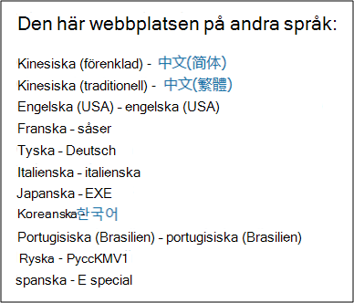

# Microsoft Efterlevnadshanteraren (klassisk)Microsoft Compliance Manager (classic)

> [!IMPORTANT]
> **Efterlevnadshanteraren (klassisk) kommer snart att tas bort från Microsoft Service Trust Portal.****Compliance Manager (classic) will soon be removed from the Microsoft Service Trust Portal.** Vi rekommenderar att du går över till den nya [Efterlevnadshanteraren i Efterlevnadscenter för Microsoft 365](https://compliance.microsoft.com/), som ger en bättre användarupplevelse och uppdaterad kontrollmappning.We recommend that you transition to the new [Compliance Manager in the Microsoft 365 compliance center](https://compliance.microsoft.com/), which provides an enhanced user experience and updated control mapping. Kunder som har utvärderingar i den klassiska versionen måste skapa nya utvärderingar i den nya Efterlevnadshanteraren.Customers who have assessments in the classic version will need to create new assessments in the new Compliance Manager. Befintliga data, inklusive dina utvärderingar, kontroller och andra data, överförs inte till den nya Efterlevnadshanteraren.Any existing data, including your assessments, controls, and other data, will not be transferred over to the new Compliance Manager. [Mer information om övergången](compliance-manager-faq.md#whats-happening-to-compliance-manager-classic-in-the-service-trust-portal).[Learn more about the transition](compliance-manager-faq.md#whats-happening-to-compliance-manager-classic-in-the-service-trust-portal).

*Efterlevnadshanteraren är inte tillgänglig i Office 365 som drivs av 21Vianet, Office 365 Germany, Office 365 U.S. Government Community High (GCC High) eller i Office 365 Department of Defense.**Compliance Manager isn't available in Office 365 operated by 21Vianet, Office 365 Germany, Office 365 U.S. Government Community High (GCC High), or Office 365 Department of Defense.*

Med Efterlevnadshanteraren, ett arbetsflödesbaserat riskhanteringsverktyg i Microsoft [Service Trust Portal](./get-started-with-service-trust-portal.md), kan du spåra, tilldela och verifiera organisationens efterlevnadsaktiviteter relaterade till Microsoft Professionella tjänster och Microsofts molntjänster, som Microsoft Office 365, Microsoft Dynamics 365 och Microsoft Azure.Compliance Manager, a workflow-based risk assessment tool in the Microsoft [Service Trust Portal](./get-started-with-service-trust-portal.md), enables you to track, assign, and verify your organization's regulatory compliance activities related to Microsoft Professional Services and Microsoft cloud services, such as Microsoft Office 365, Microsoft Dynamics 365, and Microsoft Azure.

Efterlevnadshanteraren:Compliance Manager:

- Kombinerar den detaljerade informationen från Microsoft till granskare och föreskrifter som en del av olika granskningar från tredje part av Microsofts molntjänster mot olika standarder (till exempel ISO 27001, ISO 27018 och NIST) och information som Microsoft sammanställer internt för dess efterlevnad av regler (som HIPAA och EU:s allmänna dataskyddsförordning eller GDPR) med din egen självbedömning av organisationens efterlevnad av dessa standarder och föreskrifter.Combines the detailed information provided by Microsoft to auditors and regulators as part of various third-party audits of Microsoft 's cloud services against various standards (for example, ISO 27001, ISO 27018, and NIST) and information that Microsoft compiles internally for its compliance with regulations (such as HIPAA and the EU General Data Protection Regulation, or GDPR) with your own self-assessment of your organization's compliance with these standards and regulations.

- Ger dig möjlighet att tilldela, spåra och registrera efterlevnads- och utvärderingsrelaterade aktiviteter, vilket kan hjälpa din organisation att komma över hinder i olika team för att uppnå organisationens efterlevnadsmål.Enables you to assign, track, and record compliance and assessment-related activities, which can help your organization cross team barriers to achieve your organization's compliance goals.

- Ger ett efterlevnadsresultat som hjälper dig att följa upp förloppet och prioritera granskningskontrollerna som hjälper dig minska organisationens exponering för risker.Provides a Compliance Score to help you track your progress and prioritize the auditing controls that will help reduce your organization's exposure to risk.

- Ger en säker lagringsplats där du kan ladda upp och hantera bevis och andra artefakter som är relaterade till dina efterlevnadsaktiviteter.Provides a secure repository for you to upload and manage evidence and other artifacts related to your compliance activities.

- Skapa utförliga rapporter i Microsoft Excel som dokumenterar de efterlevnadsaktiviteter som utförts av Microsoft och din organisation. Den kan tillhandahållas för granskare, tillsynsmyndigheter och andra efterlevnadsintressenter.Produces richly detailed reports in Microsoft Excel that document the compliance activities performed by Microsoft and your organization, which can be provided to auditors, regulators, and other compliance stakeholders.

> [!IMPORTANT]
> Efterlevnadshanteraren är en instrumentpanel med en sammanfattning av ditt dataskydd och efterlevnadsstatistik och rekommendationer för att förbättra dataskydd och efterlevnad.Compliance Manager is a dashboard that provides a summary of your data protection and compliance stature and recommendations to improve data protection and compliance. Kundåtgärderna som tillhandahålls i Compliance Manager är rekommendationer. Det är upp till var och en organisation att bedöma effektiviteten av dessa rekommendationer i respektive regelverk före implementeringen.The Customer Actions provided in Compliance Manager are recommendations; it is up to each organization to evaluate the effectiveness of these recommendations in their respective regulatory environment prior to implementation. Rekommendationer som finns i Compliance Manager ska inte tolkas som en garanti för efterlevnad.Recommendations found in Compliance Manager should not be interpreted as a guarantee of compliance.

## Vad är Efterlevnadshanteraren?What is Compliance Manager?

Efterlevnadshanteraren är ett arbetsflödesbaserat riskhanteringsverktyg som utformats för att hjälpa dig att hantera regelefterlevnad inom molnets delade ansvarsmodell.Compliance Manager is a workflow-based risk assessment tool designed to help you manage regulatory compliance within the shared responsibility model of the cloud. Efterlevnadshanteraren ger dig en instrumentpanelsvy över standarder och föreskrifter och utvärderingar som innehåller implementeringsinformation för Microsofts kontroll, testresultat och implementeringsvägledning för kundkontroll som din organisation kan ange.Compliance Manager provides you with a dashboard view of standards and regulations and assessments that contain Microsoft's control implementation details and test results and customer control implementation guidance and tracking for your organization to enter. Efterlevnadshanteraren tillhandahåller definitioner av certifieringskontroller, vägledning om implementering och testning av kontroller, riskvägda kontroller, rollbaserad åtkomsthantering och ett arbetsflöde för direkt kontrolltilldelning för att spåra implementering av kontroller, testningsstatus och hantering av bevismaterial.Compliance Manager provides certification assessment control definitions, guidance on implementation and testing of controls, risk-weighted scoring of controls, role-based access management, and an in-place control action assignment workflow to track control implementation, testing status and evidence management. Efterlevnadshanteraren optimerar efterlevnadsarbetsbelastningen genom att göra det möjligt för kunder att logiskt gruppera utvärderingar tillsammans och tillämpa testning av utvärderingskontroller på identiska eller relaterade kontroller, vilket minskar den duplicering av arbetet som annars skulle behövas för att uppfylla identiska kontrollkrav i olika certifieringar.Compliance Manager optimizes compliance workload by enabling customers to logically group assessments together and apply assessment control testing to identical or related controls, reducing the duplication of effort that might otherwise be required to satisfy identical control requirements across different certifications.

## Utvärderingar i EfterlevnadshanterarenAssessments in Compliance Manager

Kärnkomponenten i Efterlevnadshanteraren kallas för *utvärdering*.The core component of Compliance Manager is called an *Assessment*. En utvärdering är en utvärdering av en Microsoft-tjänst mot en certifieringsstandard eller dataskyddsförordning (till exempel ISO 27001:2013 och GDPR).An Assessment is an assessment of a Microsoft service against a certification standard or data protection regulation (such as ISO 27001:2013, and the GDPR). Utvärderingar hjälper dig att urskilja organisationens dataskydd och efterlevnadsposition mot den valda branschstandarden för den valda Microsoft-molntjänsten.Assessments help you to discern your organization's data protection and compliance posture against the selected industry standard for the selected Microsoft cloud service. Utvärderingar slutförs genom implementeringen av kontrollerna som mappar till certifieringsstandarden som utvärderas.Assessments are completed by the implementation of the controls that map to the certification standard being assessed.

Strukturen för en utvärdering baseras på det ansvar som delas mellan Microsoft och din organisation för att utvärdera säkerhets- och efterlevnadsrisker i molnet och för att implementera dataskyddet som anges av en efterlevnadsstandard, en dataskyddsstandard, en förordning eller en lag.The structure of an Assessment is based on the responsibility that is shared between Microsoft and your organization for assessing security and compliance risks in the cloud and for implementing the data protection safeguards specified by a compliance standard, a data protection standard, a regulation, or a law.

En utvärdering består av flera komponenter som är:An Assessment is made of several components, which are:

- **Tjänsteomfång** – Varje utvärdering tillämpas på en specifik uppsättning Microsoft-tjänster, som anges i avsnittet Molntjänster som är i omfånget.**In-Scope Services** - Each assessment applies to a specific set of Microsoft services, which are listed in the In-Scope Cloud Services section.

- **Microsoft-hanterade kontroller** – För varje molntjänst implementerar och hanterar Microsoft en uppsättning *-kontroller* som en del av Microsofts efterlevnad av olika standarder och föreskrifter.**Microsoft-Managed Controls** - For each cloud service, Microsoft implements and manages a set of  *controls*  as part of Microsoft's compliance with various standards and regulations. Dessa kontroller är ordnade i *kontrollfamiljer som* anpassas till strukturen från motsvarande certifiering eller bestämmelser som utvärderingen är justerad efter.These controls are organized into  *control families*  that align with the structure from the corresponding certification or regulation that the Assessment is aligned to. För varje kontroll som hanteras av Microsoft innehåller Efterlevnadshanteraren information om hur Microsoft implementerade kontrollen, samt hur och när implementeringen har testats och validerats av en oberoende tredjepartsgranskare.For each Microsoft-managed control, Compliance Manager provides details about how Microsoft implemented the control, along with how and when that implementation was tested and validated by an independent third-party auditor.

  Här är ett exempel på tre Microsoft-hanterade kontroller i **säkerhetskontrollfamiljen** från utvärderingen av Office 365 och GDPR.Here's an example of three Microsoft-managed controls in the **Security** control family from an Assessment of Office 365 and the GDPR.

    

  a.a. Anger följande information från certifieringen eller föreskrifterna som mappar till den Microsoft-hanterade kontrollen.Specifies the following information from the certification or regulation that maps to the Microsoft-managed control.

  - **Kontroll-ID** – Det avsnitts- eller artikelnummer från certifieringen eller bestämmelsen som kontrollen mappar till.**Control ID** - The section or article number from the certification or regulation that the control maps to.

  - **Titel** – Titel från motsvarande certifiering eller bestämmelse.**Title** - The title from the corresponding certification or regulation.

  - **Artikel-ID** – Det här fältet ingår endast för GDPR-utvärderingar, eftersom det anger motsvarande GDPR-artikelnummer.**Article ID** - This field is included only for GDPR assessments, as it specifies the corresponding GDPR article number.

  - **Beskrivning** – Text i standarden eller förordningen som mappar till den valda Microsoft-hanterade kontrollen.**Description** - Text of the standard or regulation that maps to the selected Microsoft-managed control.

  b.b. Efterlevnadspoäng för kontrollen, som anger risknivån (på grund av bristande efterlevnad eller kontrollfel) som är associerad med varje Microsoft-hanterad kontroll.The Compliance Score for the control, which indicates the level of risk (due to non-compliance or control failure) associated with each Microsoft-managed control. Mer information finns i [Förstå efterlevnadspoängen](#understanding-the-compliance-score).See [Understanding the Compliance Score](#understanding-the-compliance-score) for more information. Observera att efterlevnadspoäng betygsätts från 1 till 10 och är färgkodade.Note that Compliance Scores are rated from 1 to 10 and are color-coded. Gult indikerar kontroller med låg risk, orange indikerar kontroller med medelhög risk och rött visar kontroller med hög risk.Yellow indicates low risk controls, orange indicates medium-risk controls, and red indicated high-risk controls.

  c.c. Information om implementeringsstatus för en kontroll, det datum då kontrollen testades, vem som utförde testet och testresultatet.Information about the implementation status of a control, the date the control was tested, who performed the test, and the test result.

  d.d. För varje kontroll kan du klicka på **Mer** om du vill se ytterligare information, däribland information om Microsofts implementering av kontrollen och information om hur kontrollen har testats och validerats av en oberoende granskare från tredje part.For each control, you can click **More** to see additional information, including details about Microsoft's implementation of the control and details about how the control was tested and validated by an independent third-party auditor.

- **Kundhanterade kontroller** – Det här är samlingen med kontroller som hanteras av din organisation.**Customer-Managed Controls** - This is the collection of controls that are managed by your organization. Din organisation ansvarar för att implementera kontrollerna som en del av efterlevnadsprocessen för en viss standard eller regelefterlevnad.Your organization is responsible for implementing these controls as part of your compliance process for a given standard or regulation. Kundhanterade kontroller är också ordnade i kontrollfamiljer för motsvarande certifiering eller bestämmelser.Customer-managed controls are also organized into control families for the corresponding certification or regulation. Använd de kundhanterade kontrollerna till att implementera de rekommenderade åtgärder som föreslås av Microsoft som en del av dina efterlevnadsaktiviteter.Use the customer-managed controls to implement the recommended actions suggested by Microsoft as part of your compliance activities. Organisationen kan använda vägledningen och rekommenderade kundåtgärder i varje kundhanterad kontroll för att hantera implementerings- och utvärderingsprocessen för den kontrollen.Your organization can use the prescriptive guidance and recommended Customer Actions in each customer-managed control to manage the implementation and assessment process for that control.

  Kundhanterade kontroller i Utvärderingar har också inbyggda funktioner för arbetsflödeshantering som du kan använda för att hantera och spåra organisationens framsteg när det gäller att slutföra utvärderingen.Customer-managed controls in Assessments also have built-in workflow management functionality that you can use to manage and track your organization's progress towards completing the Assessment. En efterlevnadsansvarig i din organisation kan till exempel tilldela en uppgift till en IT-administratör som har ansvar för och nödvändiga behörigheter för att utföra de åtgärder som rekommenderas för kontrollen.For example, a Compliance Officer in your organization can assign an Action Item to an IT admin who has the responsibility and necessary permissions to perform the actions that are recommended for the control. När arbetet är klart kan IT-administratören ladda upp bevis på deras implementeringsuppgifter (till exempel skärmbilder av konfigurations- eller principinställningar) och sedan tilldela uppgiften till den som är efterlevnadsansvarig för att utvärdera insamlade bevis, testa implementeringen av kontrollen och registrera implementeringsdatum och testresultat i Efterlevnadshanteraren.When that work is complete, the IT admin can upload evidence of their implementation tasks (for example, screenshots of configuration or policy settings) and then assign the Action Item back to the Compliance Officer to evaluate the collected evidence, test the implementation of the control, and record the implementation date and test results in Compliance Manager. Mer information finns i avsnittet [Hantera utvärderingsprocessen](#managing-the-assessment-process) i artikeln.For more information, see the [Managing the assessment process](#managing-the-assessment-process) section in the article.

## Behörigheter och rollbaserad åtkomstkontrollPermissions and role-based access control

Efterlevnadshanteraren använder en rollbaserad behörighetsmodell för åtkomstkontroll.Compliance Manager uses a role-based access control permission model. Det är bara användare som har tilldelats en användarroll som kan komma åt Efterlevnadshanteraren och de åtgärder som tillåts av varje användare är begränsade efter rolltyp.Only users who are assigned a user role may access Compliance Manager, and the actions allowed by each user are restricted by role type.

Observera att det inte längre finns någon standardroll för **gäståtkomst**.Note that there is no longer a default **Guest access** role. Varje användare måste tilldelas en roll för att kunna komma åt och arbeta i Efterlevnadshanteraren.Each user must be assigned a role in order to access and work within Compliance Manager.

I följande tabell beskrivs varje behörighet i Efterlevnadshanteraren och vad användaren kan göra.The following table describes each Compliance Manager permission and what it allows the user do. Tabellen anger också vilken roll varje behörighet har tilldelats.The table also indicates the role that each permission is assigned to.

|BehörighetPermission|Läsare i EfterlevnadshanterarenCompliance Manager Reader|Deltagare i EfterlevnadshanterarenCompliance Manager Contributor|Bedömare i EfterlevnadshanterarenCompliance Manager Assessor|Efterlevnadshanterarens administratörCompliance Manager Administrator|PortaladministratörPortal Admin|
|---|:---:|:---:|:---:|:---:|:---:|
|**Läsa data** – användare kan läsa men inte redigera data.**Read data** - Users can read but not edit data.||||||
|**Redigera data** – Användare kan redigera alla fält, förutom fälten Testresultat och Testdatum.**Edit data** - Users can edit all fields, except the Test Result and Test Date fields.||||||
|**Redigera testresultat** – Användare kan redigera fälten Testresultat och Testdatum.**Edit test results** - Users can edit the Test Result and Test Date fields.||||||
|**Hantera utvärderingar** – Användare kan skapa, arkivera och ta bort utvärderingar.**Manage assessments** - Users can create, archive, and delete Assessments.||||||
|**Hantera användare** – Användare kan lägga till andra användare i organisationen i rollerna Läsare, Deltagare, Utvärderare och Administratör.**Manage users** - Users can add other users in their organization to the Reader, Contributor, Assessor, and Administrator roles. Endast de användare som har rollen Global administratör i organisationen kan lägga till eller ta bort användare från rollen Portaladministratör.Only those users with the Global Administrator role in your organization can add or remove users from the Portal Admin role.||||||
|

## Förstå efterlevnadspoängenUnderstanding the Compliance Score

Efterlevnadshanteraren visar en total poäng för utvärderingsresultat i Office 365 i det övre högra hörnet av panelen på instrumentpanelen.On the Dashboard, Compliance Manager displays a total score for Office 365 assessments in the upper right-hand corner of the tile. Det här är det totala efterlevnadsresultatet för utvärderingen och antalet punkter som tagits emot för varje kontrollutvärdering som har markerats som Implementerad och Testad i utvärderingen.This is the overall total Compliance Score for the Assessment, and is the accumulation of points received for each control assessment that has been marked as Implemented and Tested in the Assessment. När du lägger till en utvärdering ser du att efterlevnadspoängen redan är på väg att slutföras eftersom punkterna för de Microsoft-hanterade kontrollerna som har implementerats av Microsoft och testats av oberoende tredje parter redan tillämpats.When adding an Assessment, you will see that the Compliance Score is already on the way towards completion because the points for the Microsoft-managed controls that have been implemented by Microsoft and tested by independent third parties are already applied.

Resten av poängen kommer från den lyckade kundkontrollutvärderingen, från implementeringen och testningen av de kundhanterade kontrollerna, som var och en har ett specifikt värde som bidrar till den övergripande efterlevnadspoängen.The remaining points come from the successful customer control assessment, from the implementation and testing of the customer-managed controls, each of which has a specific value that contributes to the overall compliance score.

Varje utvärdering visar en riskbaserad efterlevnadspoäng för att hjälpa dig utvärdera risknivån (på grund av att det inte finns efterlevnad eller kontrollfel) som är kopplad till varje kontroll (däribland både Microsoft-hanterade och kundhanterade kontroller) i en utvärdering.Each Assessment displays a risk-based Compliance Score to help you assess the level of risk (due to non-compliance or control failure) associated with each control (including both Microsoft managed and customer-managed controls) in an Assessment. Varje kundhanterad kontroll tilldelas ett möjligt antal punkter (kallas \*allvarlighetsrankning) på en skala från 1 till 10, där fler poäng delas ut för kontroller som associeras med en hög riskfaktor om kontrollen misslyckas och färre poäng tilldelas för kontroller med lägre risk.Each customer-managed control is assigned a possible number of points (called a  \*severity ranking) on a scale from 1 to 10, where more points are awarded for controls associated with a higher risk factor if the control fails, and fewer points are awarded for lower-risk controls.

Utvärderingskontrollen av användaråtkomsthantering som visas nedan har till exempel en mycket hög allvarlighetsrankning och visar det tilldelade värdet 10.For example, the User Access Management assessment control shown below has a very high severity risk ranking, and displays an assigned value of 10.

 I jämförelse har utvärderingskontrollen för säkerhetskopiering av information som visas nedan en lägre allvarlighetsrankning och visar det tilldelade värdet 3.By comparison, the Information Backup assessment control shown below has a lower severity risk ranking, and displays an assigned value of 3.

Efterlevnadshanteraren tilldelar varje kontroll en standardnivå för allvarlighetsrakning.The Compliance Manager assigns a default severity ranking to each control. Riskrankningen beräknas utifrån följande kriterier:Risk rankings are calculated based on the following criteria:

- Om en kontroll förhindrar att incidenter inträffar (högst rankning), upptäcker incidenter som har hänt eller korrigerar en händelses påverkan (lägst rankning).Whether a control prevents incidents from happening (highest ranking), detects incidents that have happened, or corrects the impact of an incident (lowest ranking). När det gäller allvarlighetsrankning tilldelas en obligatorisk kontroll som förhindrar ett hot högst antal poäng. Kontroller som är upptäcktsbara eller korrigerande (oavsett om de är obligatoriska eller godtyckliga) tilldelas det lägsta antalet poäng.In terms of severity ranking, a mandatory control that prevents a threat is assigned the highest number of points; controls that are detective or corrective (regardless of whether they're mandatory or discretionary) are assigned the lowest number of points.

- Om en kontroll (efter att den har implementerats) är obligatorisk och därför inte kan godkännas av användarna (till exempel att användare måste återställa sitt lösenord och uppfylla kraven på lösenordslängd och tecken) eller godtycklig, och kan godkännas av användarna (till exempel affärsregler som kräver att användare låser sina skärmar när deras datorer är obevakade).Whether a control (after it's been implemented) is mandatory and therefore can't be by-passed by users (for example, users having to reset their password and meet password length and character requirements) or discretionary and can be by-passed by users (for example, business rules that require users to lock their screens when their computers are unattended).

- Kontroller som är relaterade till risker för datakonfidentialitet, integritet och tillgänglighet, oavsett om dessa risker kommer från interna eller externa hot och om hoten är skadliga eller oavsiktliga.Controls related to risks to data confidentiality, integrity, and availability, whether these risks come from internal or external threats, and whether the threat is malicious or accidental. Kontroller som skulle förhindra att en extern angripare bryter mot nätverket och få åtkomst till personligt identifierbar information tilldelas till exempel fler poäng än en kontroll som är relaterad till att förhindra att en anställd av misstag konfigurerar en nätverksrouterinställning som resulterar i ett nätverksavbrott).For example, controls that would help prevent an external attacker from breaching that network and gaining access to personally identifiable information would be assigned more points than a control related to preventing an employee from accidentally mis-configuring a network router setting that results in a network outage).

- Risker relaterade till juridiska och externa faktorer, till exempel kontrakt, regler och offentliga åtaganden, för varje kontroll.Risks related to legal and external drivers, such as contracts, regulations, and public commitments, for each control.

De visade värdena för kontrollens efterlevnadspoäng tillämpas *i sin helhet* på den totala efterlevnadspoängen per godkänd/underkänd. Antingen implementeras kontrollen och klarar det efterföljande utvärderingstestet eller inte. Det finns inga delvisa krediter för en partiell implementering.The displayed Compliance Score values for the control are applied  *in their entirety*  to the Total Compliance Score on a pass/fail basis--either the control is implemented and passes the subsequent assessment test or it does not; there is no partial credit for a partial implementation. Endast när kontrollen har sin **implementeringsstatus** inställd på **Implementerad** eller **Alternativ implementering** och **Testresultat** är inställt på **Godkänd** tilldelas poäng som läggs till i den totala efterlevnadspoängen.Only when the control has its **Implementation Status** set to **Implemented** or **Alternative Implementation** and the **Test Result** is set to **Passed** are the assigned points added to the Total Compliance Score.

Viktigast av allt är att efterlevnadspoängen kan hjälpa dig att prioritera vilka kontroller du ska fokusera på för implementeringen genom att ange vilka kontroller som har en högre potentiell risk om det finns ett fel som rör en kontroll.Most importantly, the Compliance Score can help you prioritize which controls to focus on for implementation by indicating which controls that have a higher potential risk if there is a failure related to a control. När utvärderingskontroller är relaterade till andra kontroller (antingen inom samma utvärdering eller i en annan utvärderingsgrupp inom samma utvärderingsgrupp) kan ett lyckat slutförande av en enda kontroll, utöver riskbaserad prioritering, leda till en betydande minskning av arbetet baserat på synkroniseringen av kontrolltestresultaten.In addition to risk-based prioritization, when assessment controls are related to other controls (either within the same assessment or in another assessment in the same assessment grouping), completing a single control successfully can result in a significant reduction of effort based on the synchronization of control test results.

På bilden nedan ser vi till exempel att GDPR-utvärderingen för Office 365 för närvarande är 46 % utvärderad, och att 51 av 111 kontrollutvärderingar har slutförts för en total efterlevnadspoäng på 289 av möjliga 600.For example, in the image below we see that the Office 365 - GDPR Assessment is currently 46% assessed, with 51 of 111 control assessments completed for a Total Compliance score of 289 out of a possible 600.

I GDPR-utvärderingskontrollen här 7.5.5 samman med fem andra kontroller (7.4.1, 7.4.3, 7.4.4, 7.4.8 och 7.4.9). Var och en har en måttlig till hög allvarlighetsrakning på 6 eller 8.Within the assessment GDPR control 7.5.5 is related to 5 other controls (7.4.1, 7.4.3, 7.4.4, 7.4.8, and 7.4.9) each with a moderate to high severity risk rating score of 6 or 8). Med hjälp av utvärderingsfiltret har vi valt alla de här kontrollerna, vilket gör dem synliga i utvärderingsvyn. Nedan kan vi se att ingen av dem har utvärderats.Using the assessment filter, we have selected all of these controls, making them visible in the assessment view, and can see below that none of them have been assessed.

 Eftersom de sex kontrollerna är relaterade leder slutförande av ett sådant testresultat till en synkronisering av dessa testresultat över de relaterade kontrollerna i den här utvärderingen (precis som för alla relaterade kontroller i en utvärdering som ingår i samma utvärderingsgruppering).As those 6 controls are related, the completion of any one them will result in a synchronization of those test results across the related controls within this assessment (just as it will for any related controls in an assessment that is in the same assessment grouping). När implementeringen och testningen av GDPR-kontrollen 7.5.5 har genomförts uppdateras kontrollinformationsområdet för att visa att alla sex kontrollerna har utvärderats, med en motsvarande ökning av antalet utvärderade kontroller till 57 och 51 % utvärderade och en ändring av den totala efterlevnadspoängen på +40.Upon completion of the implementation and testing of GDPR control 7.5.5, the control detail area refreshes to show that all 6 controls have been assessed, with a corresponding increase in the number of assessed controls to 57 and 51% assessed, and a change in total Compliance Score of +40.

Den här bekräftelsedialogrutan för uppdateringar visas om du håller på att ändra implementeringsstatus för en relaterad kontroll på ett sätt som påverkar andra relaterade kontroller.This confirmation update dialog box will appear if you are about to change the Implementation Status of a related control in a way that will impact the other related controls.

> [!NOTE]
> För närvarande innehåller endast utvärderingar för Office 365-molntjänster en efterlevnadspoäng.Currently, only Assessments for Office 365 cloud services include a Compliance Score. Utvärderingar för Azure och Dynamics visar en utvärderingsstatus.Assessments for Azure and Dynamics show an assessment status.

## Metodik för efterlevnadspoängCompliance Score methodology

Efterlevnadspoängen, precis som Microsoft Secure Score, liknar andra beteendebaserade serversystem. Din organisations aktivitet kan öka efterlevnadspoängen genom att utföra aktiviteter som är relaterade till dataskydd, sekretess och säkerhet.The Compliance Score, like the Microsoft Secure Score, is similar to other behavior-based scoring systems; your organization's activity can increase its Compliance Score by performing activities related to data protection, privacy, and security.

> [!NOTE]
> Efterlevnadspoäng uttrycker inte ett absolut mått av organisationens efterlevnad med någon särskild standard eller regel.The Compliance Score does not express an absolute measure of organizational compliance with any particular standard or regulation. Det uttrycker i vilken omfattning du har antagit kontroller som kan minska riskerna för personlig data och individens integritet.It expresses the extent to which you have adopted controls which can reduce the risks to personal data and individual privacy. Ingen tjänst kan garantera att du är kompatibel med en standard eller regelefterlevnad och efterlevnadspoängen ska inte tolkas som en garanti på något sätt.No service can guarantee that you are compliant with a standard or regulation, and the Compliance Score should not be interpreted as a guarantee in any way.

Utvärderingar i Efterlevnadshanteraren baseras på modellen med delat ansvar för molntjänster.Assessments in Compliance Manager are based on the shared responsibility model for cloud computing. I modellen med delat ansvar delar Microsoft och varje kund på ansvaret för att skydda kundens data när dessa data lagras i molnet.In the shared responsibility model, Microsoft and each customer share responsibility for the protection of the customer's data when that data is stored in our cloud.

Som vi ser i GDPR-utvärderingen av Office 365 nedan är Microsoft och kunderna ansvariga för att utföra en mängd olika åtgärder som är avsedda att uppfylla kraven i den standard eller de bestämmelser som utvärderas.As shown in the Office 365 GDPR Assessment below, Microsoft and customers are each responsible for performing a variety of Actions that are designed to satisfy the requirements of the standard or regulation being assessed. För att effektivisera och förstå det som krävs.To rationalize and understand the required. Efterlevnadshanteraren behandlar alla standarder och föreskrifter som om de vore kontrollramverk för åtgärder i en mängd olika standarder och föreskrifter.Actions across a variety of standards and regulations, Compliance Manager treats all standards and regulations as if they were control frameworks. Det innebär att de åtgärder som Microsoft och kunder utför för varje utvärdering innebär implementering och validering av olika kontroller.Thus, the Actions performed by Microsoft and by customers for each Assessment involve the implementation and validation of various controls.

Här är det grundläggande arbetsflödet för en vanlig åtgärd:Here's the basic workflow for a typical Action:

1. En organisations efterlevnads-, risk-, sekretess- och/eller dataskyddsansvarig tilldelar någon i organisationen uppgiften att implementera en kontroll.The Compliance, Risk, Privacy, and/or Data Protection Officer of an organization assigns the task to someone in the organization to implement a control. Den personen kan vara:That person could be:

   - En ägare till en affärspolicyA business policy owner

   - En IT-implementerareAn IT implementer

   - En annan person i organisationen som ansvarar för att utföra aktivitetenAnother individual in the organization who has responsibility for performing the task

2. Den enskilda personen utför de uppgifter som krävs för att implementera kontrollen, laddar upp bevis på implementering till Efterlevnadshanteraren och markerar den eller de kontroller som är knutna till åtgärden som implementerade.That individual performs the tasks necessary to implement the control, uploads evidence of implementation into Compliance Manager, and marks the control(s) tied to the Action as implemented. När uppgifterna har slutförts tilldelas åtgärden till en granskare för verifiering.Once these tasks are completed, they assign the Action to an Assessor for validation. Granskare kan vara:Assessors can be:

   - Interna granskare som utför validering av kontroller i en organisationInternal assessors that perform validation of controls within an organization

   - Externa granskare som undersöker, verifierar och certifierar efterlevnad, till exempel oberoende tredjepartsorganisationer som granskar Microsofts molntjänsterExternal assessors that examine, verify, and certify compliance, such as the third-party independent organizations that audit Microsoft's cloud services

3. Granskaren validerar kontrollen och undersöker bevisen och markerar kontrollen/kontrollerna som utvärderade och resultaten av utvärderingen (t.ex. godkänd).The Assessor validates the control and examines the evidence and marks the control(s) as assessed and the results of the assessment (e.g., passed).

När alla kontroller som är kopplade till en utvärdering har utvärderats anses utvärderingen vara slutförd.Once all the controls associated with an Assessment have been assessed, the Assessment is considered completed.

Varje utvärdering i Efterlevnadshanteraren innehåller förinstallerad information som innehåller information om de åtgärder som Microsoft har vidtagit för att uppfylla kraven för de kontroller som Microsoft ansvarar för.Every Assessment in Compliance Manager comes pre-loaded with information that provides details about the Actions taken by Microsoft to satisfy the requirements of the controls for which Microsoft is responsible. Den här informationen innehåller uppgifter om hur Microsoft har implementerat varje kontroll och hur och när Microsofts implementering har utvärderats och verifierats av en granskare från tredje part.This information includes details about how Microsoft has implemented each control and how and when Microsoft's implementation was assessed and verified by a third-party auditor. Därför har Microsoft-hanterade kontroller för varje utvärdering markerats som utvärderad, efterlevnadspoängen för utvärderingen återspeglar detta.For this reason, the Microsoft Managed Controls for each Assessment are marked as Assessed, and the Compliance Score for the Assessment reflects this.

Varje utvärdering inkluderar en total efterlevnadspoäng baserat på modellen för delat ansvar.Each Assessment includes a total Compliance Score based on the shared responsibility model. Microsofts implementering och testning av kontroller för Office 365 bidrar till det totala antalet möjliga poäng i en GDPR-utvärdering.Microsoft's implementation and testing of controls for Office 365 contributes a portion of the total possible points associated with a GDPR assessment. När kunden implementerar och testar alla kundåtgärder ökar efterlevnadspoängen för utvärderingen med det värde som tilldelats kontrollen.As the customer implements and tests each of the customer Actions, the Compliance Score for the Assessment will increase by the value assigned to the control.

### Riskbaserad metodik för poängsättningRisk-based scoring methodology

Efterlevnadshanteraren använder en riskbaserad metodik för poängsättning med en skala från 1–10 som tilldelar ett högre värde till kontroller som innebär en högre risk om kontrollen misslyckas eller inte är kompatibel.Compliance Manager uses a risk-based scoring methodology with a scale from 1-10 that assigns a higher value to controls that represent a higher risk in the event the control fails or is non-compliant. Det system som används av efterlevnadspoäng baseras på flera nyckelfaktorer, till exempel:The scoring system used by Compliance Score is based on several key factors, such as:

- Kontrollens naturThe essence of the control

- Risknivån för kontrollen baserat på olika typer av hotThe level of risk of the control based on the kinds of threats

- De externa drivrutinerna för kontrollenThe external drivers for the control

### Kontrollens naturEssence of the control

Kontrollens natur tilldelas baseras på om de är obligatoriska eller godtyckliga och om de är förebyggande, upptäcktsbara eller korrigeringsbara.The essence of the control is based on whether the control is Mandatory or Discretionary, and whether it is Preventative, Detective, or Corrective.

### Obligatorisk eller godtyckligMandatory or discretionary

 *Obligatoriska kontroller* är kontroller som inte kan kringgås avsiktligt eller oavsiktligt.*Mandatory controls*  are controls that cannot be bypassed either intentionally or accidentally. Ett exempel på en vanlig obligatorisk kontroll är en centralt hanterad lösenordsprincip som ställer in krav på lösenordslängd, komplexitet och utgångsdatum.An example of a common mandatory control is a centrally-managed password policy that sets requirements for password length, complexity, and expiration. Användarna måste uppfylla de här kraven för att få åtkomst till systemet.Users must comply with these requirements in order to access the system.

 *Godtyckliga kontroller* förlitar sig på att användarna förstår principen och agerar därefter.*Discretionary controls*  rely upon users to understand policy and act accordingly. En princip som till exempel kräver att användare låser sin dator när de lämnar den är en godtycklig kontroll eftersom den är beroende av användaren.For example, a policy requiring users to lock their computer when they leave it is a discretionary control because it relies on the user.

### Förebyggande, upptäcktsbar eller korrigerandePreventative, detective, or corrective

*Förebyggande kontroller* förhindrar specifika risker.*Preventative controls*  are those that prevent specific risks. Att skydda den vilande informationen med av kryptering är en förebyggande kontroll mot attacker, intrång med mera. Att separera dessa är en förebyggande kontroll för att hantera intressekonflikter och skydda sig mot bedrägerier.For example, protecting information at rest using encryption is a preventative control against attacks, breaches, etc. Separation of duties is a preventative control to manage conflict of interest and to guard against fraud.

*Upptäcktsbara kontroller* är de som aktivt övervakar system för att identifiera oregelbundna villkor eller beteenden som utgör en risk eller som kan användas för att upptäcka intrång eller avgöra om ett intrång har inträffat.*Detective controls*  are those that actively monitor systems to identify irregular conditions or behaviors that represent risk or that can be used to detect intrusions or determine if a breach has occurred. Granskning av systemåtkomst och privilegierade administrativa åtgärder är typer av upptäcktsbara övervakningskontroller, och regelefterlevnadsgranskningar är en typ av upptäcktsbar kontroll för att hitta processproblem.System access auditing and privileged administrative actions auditing are types of detective monitoring controls; regulatory compliance audits are a type of detective control used to find process issues.

*Korrigerande kontroller* är sådana som försöker minimera de skadliga effekterna av ett säkerhetshändelse, vidta åtgärder för att minska den direkta effekten och återställa eventuella skador.*Corrective controls*  are those that try to keep the adverse effects of a security incident to a minimum, take corrective action to reduce the immediate effect, and reverse the damage, if possible. Sekretesshändelsesvar är en kontroll för att begränsa skador och återställa system till driftstatus efter ett intrång.Privacy incident response is a corrective control to limit damage and restore systems to an operational state after a breach.

Genom att utvärdera varje kontroll med hjälp av dessa faktorer fastställer kontrollens natur och tilldelar den ett värde i förhållande till den risk den utgör.By evaluating each control using these factors, we determine the essence of the control and assign it a value relative to the risk that it represents.

**Hot**:**Threat**:

|KontrollControl|ObligatoriskMandatory|GodtyckligaDiscretionary|
|---|---|----|
|**Förebyggande****Preventative**|Hög riskHigh risk|Medelhög riskMedium risk|
|**Upptäcktsbar****Detective**|Medelhög riskMedium risk|Låg riskLow risk|
|**Korrigerande****Corrective**|Medelhög riskMedium risk|Låg riskLow risk|

Hot syftar på allt som utgör en risk för den grundläggande, allmänt accepterade säkerhetsstandarden som kallas CIA-triaden för data: Konfidentialitet, Integritet och Tillgänglighet:Threat refers to anything that poses a risk to the fundamental, universally-accepted security standard known as the CIA triad for data: Confidentiality, Integrity, and Availability:

- Konfidentialitet innebär att informationen bara kan läsas och förstås av betrodda, auktoriserade parter.Confidentiality means that information can be read and understood only by trusted, authorized parties.

- Integritet innebär att informationen inte har ändrats eller förstörts av obehöriga parter.Integrity means that information has not been modified or destroyed by unauthorized parties.

- Tillgänglighet innebär att informationen kan nås på ett lättillgängligt sätt med hög servicekvalitet.Availability means that information can be accessed readily with a high level of quality of service.

Ett fel på någon av dessa egenskaper anses vara en kompromiss för hela systemet.A failure of any of these characteristics is considered a compromise of the system as a whole. Hot kan komma från både interna och externa källor, och ett aktörs syfte kan vara oavsiktligt eller skadligt.Threats can come from both internal and external sources, and an actor's intent can be accidental or malicious. Dessa faktorer beräknas i en matris med hot som tilldelar olika kombinationer av hotnivåer, antingen hög, medel eller låg.These factors are estimated in a threat matrix that assigns threat levels of either High, Moderate, or Low to each combination of scenarios.

|FaktorFactor|Exempel påInternal|Exempel påInternal|ExternExternal|ExternExternal|
|---|---|---|---|----|
||*Skadlig**Malicious*|*Oavsiktlig**Accidental*|*Skadlig**Malicious*|*Oavsiktlig**Accidental*|
|**Sekretess****Confidentiality**|(H, M eller L)(H, M, or L)|(H, M eller L)(H, M, or L)|(H, M eller L)(H, M, or L)|(H, M eller L)(H, M, or L)|
|**Integritet****Integrity**|(H, M eller L)(H, M, or L)|(H, M eller L)(H, M, or L)|(H, M eller L)(H, M, or L)|(H, M eller L)(H, M, or L)|
|**Tillgänglighet****Availability**|(H, M eller L)(H, M, or L)|(H, M eller L)(H, M, or L)|(H, M eller L)(H, M, or L)|(H, M eller L)(H, M, or L)|
|

**Externa drivrutiner**:**External drivers**:

|KontraktContracts|FöreskrifterRegulations|Offentliga åtagandenPublic commitments|
|---|---|---|
|(H, M eller L)(H, M, or L)|(H, M eller L)(H, M, or L)|(H, M eller L)(H, M, or L)|

Externa faktorer som tillämpliga regler, kontrakt och offentliga åtaganden kan påverka kontroller som utformats för att skydda data och förhindra dataöverträdelser, och var och en av dessa faktorer tilldelas höga, medelhöga eller låga riskvärden.External factors such as applicable regulations, contracts, and public commitments can influence controls designed to protect data and prevent data breaches, and each of these factors are assigned risk values or High, Moderate or Low.

Det uppskattade antalet förekomster av höga, medelhöga eller låga riskvärden för de 15 möjliga riskscenarier som representeras i CIA/Threat (CIA/hot) och Legal/External Drivers (juridiska/externa faktorer) kombineras för att ge en riskavvägning, som bedömer sannolikheten för och antalet förekomster av risker vid ett givet värde som är betydande och som tas med i beräkningen av kontrollens allvarlighetsrakning.The estimated number of occurrences of these risk values of High, Moderate, or Low across the 15 possible risk scenarios represented in the CIA/Threat and Legal/External Drivers are combined to provide a risk weighting, which considers the likelihood and number of occurrences of risks at a given value as significant and is taken into consideration when calculating the severity ranking of the control.

Baserat på kontrollens allvarlighetsrakning tilldelas kontrollen efterlevnadspoäng, ett tal mellan 1 (låg) och 10 (hög), grupperat i följande riskkategorier:Based on the control's severity ranking, the control is assigned its compliance score value, a number between 1 (low) and 10 (high), grouped into the following categories of risk:

|RisknivåRisk level|KontrollvärdeControl value|
|---|:---:|
|LågLow|1-31-3|
|MåttligModerate|66|
|HögHigh|88|
|AllvarligtSevere|1010|

Genom att prioritera utvärderingskontroller med de högsta efterlevnadsvärdena utser organisationen de högsta riskobjekten och får proportionellt högre positiv feedback i form av fler poäng som lagts till i den totala efterlevnadsresultatet för varje kontrollutvärdering som slutförs.By prioritizing assessment controls with the highest compliance score values, the organization will be concentrating on the highest risk items and receive proportionally higher positive feedback in the form of more points added to the total compliance score for the assessment for each control assessment completed.

### Sammanfattning av metodik för poängsättningSummary of scoring methodology

Efterlevnadspoäng är en viktig komponent i hur Efterlevnadshanteraren hjälper organisationer att förstå och hantera deras efterlevnad.The Compliance Score is a core component of the way that Compliance Manager helps organizations understand and manage their compliance. Efterlevnadspoängen för en utvärdering är ett uttryck för företagets efterlevnad av en viss standard eller regelefterlevnad som ett tal, och ju högre resultat (upp till det högsta antalet poäng som tilldelats för utvärderingen), desto bättre är företagets efterlevnadsstatus.The Compliance Score for an assessment is an expression of the company's compliance with a given standard or regulation as a number, where the higher the score (up to the maximum number of points allocated for the Assessment), the better the company's compliance posture. Förstå metodiken för poängsättning för efterlevnad där utvärderingskontroller tilldelas allvarlighetsvärden för risker mellan 1 till 10 (låg till hög) och hur slutförda kontrollutvärderingar som läggs till i den totala efterlevnadspoängen är avgörande för organisationer för prioriteringen av deras åtgärder.Understanding the compliance scoring methodology in which assessment controls are assigned risk severity values between 1- 10 (low to high), and how completed control assessments add to the total compliance score is crucial to organizations for prioritizing their actions.

## Gruppera utvärderingarGrouping Assessments

När du skapar en ny utvärdering uppmanas du att skapa en grupp där du tilldelar utvärderingen eller tilldelar utvärderingen till en befintlig grupp.When you create a new Assessment, you're prompted to create a group to assign the Assessment to or assign the Assessment to an existing group. Med grupper kan du logiskt organisera utvärderingar och dela gemensam information och arbetsflödesuppgifter mellan utvärderingar som har samma eller relaterade kundstyrda kontroller.Groups allow you to logically organize Assessments and share common information and workflow tasks between Assessments that have the same or related customer-managed controls.

Du kan till exempel gruppera utvärderingar per år eller grupper, avdelningar eller institutioner inom organisationen eller gruppera dem per år.For example, you could group Assessments by year or teams, departments, or agencies within your organization or group them by year. Här är några exempel på grupper och de utvärderingar som de kan innehålla.Here are some examples of groups and the Assessments they might contain.

- GDPR-utvärderingar – 2018GDPR Assessments — 2018

  - Office 365 + GDPROffice 365 + GDPR

  - Azure + GDPRAzure + GDPR

  - Dynamics + GDPRDynamics + GDPR

- Azure-utvärderingar – 2018Azure Assessments — 2018

  - Azure + GDPRAzure + GDPR

  - Azure + ISO 27001:2013Azure + ISO 27001:2013

  - Azure + ISO 27018:2014Azure + ISO 27018:2014

- Utvärderingar av datasäkerhet och sekretessData Security and Privacy Assessments

  - Office 365 + ISO 27001:2013Office 365 + ISO 27001:2013

  - Office 365 + ISO 27018:2014Office 365 + ISO 27018:2014

  - Azure + ISO 27001:2013Azure + ISO 27001:2013

  - Azure + ISO 27018:2014Azure + ISO 27018:2014

> [!TIP]
> Vi rekommenderar att du fastställer en grupperingsstrategi för organisationen innan du lägger till nya utvärderingar.We recommend that your determine a grouping strategy for your organization before adding new assessments.

Det här är kraven för gruppering av utvärderingar:These are the requirements for grouping Assessments:

- Gruppnamn (kallas även \*grupp-ID) måste vara unika inom organisationen.Group names (also called  \*Group IDs) must be unique within your organization.

- Grupper kan innehålla utvärderingar för samma certifiering/förordning, men varje grupp kan endast innehålla en utvärdering för en viss molntjänst/ett visst certifieringspar.Groups can contain Assessments for the same certification/regulation, but each group can only contain one Assessment for a specific cloud service/certification pair. En grupp kan till exempel inte innehålla två utvärderingar för Office 365 och GDPR.For example, a group can't contain two Assessments for Office 365 and GDPR. På samma sätt kan en grupp innehålla flera utvärderingar för samma molntjänst så länge motsvarande certifiering/föreskrift för var och en är olika.Similarly, a group can contain multiple Assessments for the same cloud service as long as the corresponding certification/regulation for each one is different.

När en utvärdering lagts till i en utvärderingsgruppering kan grupperingen inte ändras.Once an assessment has been added to an assessment grouping, the grouping cannot be changed. Du kan byta namn på utvärderingsgruppen. Det ändrar namnet på utvärderingsgruppen för alla utvärderingar som är kopplade till den gruppen.You can rename the assessment group, which changes the name of the assessment grouping for all of the assessments associated with that group. Du kan skapa en utvärdering och en ny utvärderingsgrupp och kopiera information från en befintlig utvärdering, vilket i själva verket skapar en dubblett av utvärderingen i en annan utvärderingsgrupp.You can create an assessment and a new assessment group and copy information from an existing assessment, which effectively creates a duplicate of that assessment in a different assessment group. Arkivering av en utvärdering bryter relationen mellan utvärderingen och utvärderingsgruppen.Archiving an assessment breaks the relationship between that assessment and the assessment group. Eventuella ytterligare uppdateringar av andra relaterade utvärderingar återspeglas inte längre i den arkiverade utvärderingen.Any further updates to other related assessments are no longer reflected in the archived assessment.

En viktig fördel med att använda grupper, som tidigare har förklarats, är att när två olika utvärderingar i samma grupp delar samma kundhanterade kontroll (och kundåtgärderna skulle vara desamma för varje kontroll), synkroniseras slutförandet av implementeringsinformation, testinformation och status för kontrollen i en utvärdering med samma kontroll i någon annan utvärdering i gruppen.As previous explained, one key advantage of using groups is that when two different Assessments in the same group share the same customer-managed control (and therefore the customer actions would be the same for each control), then the completion of implementation details, testing information, and status for the control in one Assessment would be synchronized to the same control in any other Assessment in the group. Med andra ord, om utvärderingar har samma kontroll och de utvärderingarna finns i samma grupp behöver du bara hantera utvärderingsprocessen för kontrollen i en utvärdering.In other words, if Assessments share the same control and those Assessments are in the same group, you'd only have to manage the assessment process for the control in one Assessment. Resultatet för kontrollen synkroniseras automatiskt med andra utvärderingar.The results for that control will be automatically synchronized to other Assessments. ISO 27001 och ISO 27018 har till exempel båda en kontroll som är relaterad till lösenordsprinciper.For example, ISO 27001 and ISO 27018 both have a control related to password policies. Om teststatusen för kontrollen är inställd på ”Godkänd” i en utvärdering uppdateras kontrollen (och markeras som ”Godkänd”) i den andra utvärderingen, så länge båda utvärderingarna ingår i samma utvärderingsgrupp.If the Test Status for the control is set to "Passed" in one Assessment, the control is updated (and marked as "Passed") in the other Assessment, as long as both assessments are part of the same Assessment Group.

Som ett exempel kan du överväga dessa två relaterade utvärderingskontroller, som var och en har att göra med kryptering av data i offentliga nätverk, kontroll 6.10.1.2 i GDPR-utvärderingen av Office 365 och kontroll SC-13 i Office 365 – NIST 800-53-utvärderingen.As an example of this, consider these two related assessment controls, each having to do with encryption of data on public networks, control 6.10.1.2 in the Office 365 — GDPR assessment, and control SC-13 in the Office 365 — NIST 800-53 assessment. Det här är relaterade utvärderingskontroller, i två olika utvärderingar, och båda är i standardgruppen.These are related assessment controls, in two different assessments, both in the Default Group. Till en början har ingen av utvärderingarna slutfört några kundkontrollutvärderingar, vilket visas på instrumentpanelen för Efterlevnadshanteraren som visar dessa två utvärderingar.Initially, neither assessment has completed any customer control assessments, as is displayed on the Compliance Manager Dashboard that shows these two Assessments.

Genom att klicka på utvärderingen **Office 365 – GDPR** och använda filterkontrollerna för att visa GDPR-kontrollen 6.10.1.2 ser vi att NIST 800-53-kontrollen SC-13 visas som en relaterad kontroll.By clicking the **Office 365 — GDPR** assessment, and using the filter controls to view GDPR control 6.10.1.2, we see that NIST 800-53 control SC-13 is listed as a related control.

 Här visar vi slutförande av implementering och testning av GDPR-kontroll 6.10.1.2.Here we show the completion of the implementation and testing of GDPR control 6.10.1.2.

När vi navigerar till den relaterade kontrollen i den grupperade utvärderingen ser vi att NIST 800-53 SC-13 också har markerats som slutförd med samma datum och tid, utan ytterligare implementering eller testningsarbete.By navigating to the related control in the grouped assessment, we see that NIST 800-53 SC-13 has also been marked as completed with the same date and time, with no additional implementation or testing effort.

På instrumentpanelen kan vi se att varje utvärdering har en slutförd kontrollutvärdering och att den totala efterlevnadspoängen för varje utvärdering har ökat med 8 (efterlevnadspoängens värde för den delade kontrollen).Back at the Dashboard, we can see that each assessment has one control assessment completed and that the total Compliance Score for each assessment has increased by 8 (the compliance score value of that shared control).

## Administrativa funktionerAdministrative functions

Det finns särskilda administrativa funktioner som bara är tillgängliga för klientorganisationens administratörskonto och som bara visas när du loggar in som global administratör.There are specific administrative functions that are only available to the tenant administrator account, and will only be visible when logged in as a global administrator.

> [!NOTE]
> Med behörigheten för åtkomst till begränsade dokument i listrutan kan administratörer ge användare åtkomst till begränsade dokument som Microsoft delar på Service Trust Portal.The Access to Restricted Documents permission in the drop-down list will allow administrators to give users access to restricted documents that Microsoft shares on the Service Trust Portal. Funktionen för begränsade dokument är inte tillgänglig, men den kommer snart.The Restricted Documents feature isn't available, but is coming soon.

### Tilldela användare roller i EfterlevnadshanterarenAssigning Compliance Manager roles to users

Varje roll i Efterlevnadshanteraren behörigheter som skiljer sig något åt.Each Compliance Manager role has slightly different permissions. Du kan visa de behörigheter som tilldelats varje roll, se vilka användare som har vilka roller och lägga till eller ta bort användare från den rollen via Service Trust Portal genom att välja menyobjektet **Administratör** och sedan välja **Inställningar**.You can view the permissions assigned to each role, see which users are in which roles, and add or remove users from that role through the Service Trust Portal by selecting the **Admin** menu item, and then choosing **Settings**.

Lägga till eller ta bort användare från Efterlevnadshanterarens roller.To add or remove users from Compliance Manager roles.

1. Gå till [https://servicetrust.microsoft.com](https://servicetrust.microsoft.com).Go to [https://servicetrust.microsoft.com](https://servicetrust.microsoft.com).

2. Logga in med ditt globala administratörskonto för Azure Active Directory.Sign in with your Azure Active Directory global administrator account.

3. Klicka på Administratör på den övre menyraden i **Service Trust Portal** och välj sedan **Inställningar**.On the Service Trust Portal top menu bar, click **Admin** and then choose **Settings**.

4. I listrutan **Välj roll** klickar på den roll du vill hantera.In the **Select Role** drop-down list, click the role that you want to manage.

5. Användare som läggs till i varje roll visas på sidan **Välj roll**.Users added to each role are listed on the **Select Role** page.

6. Klicka på **Lägg till** för att lägga till användare till den här rollen.To add users to this role, click **Add**. Klicka på användarfältet i dialogrutan **Lägg till användare**.In the **Add Users** dialog, click the user field. Du kan bläddra igenom listan med tillgängliga användare eller börja skriva användarnamnet för att filtrera listan baserat på ditt sökord.You can scroll through the list of available users or begin typing the user name to filter the list based on your search term. Klicka på användaren för att lägga till kontot som ska förses med den rollen i listan **Lägg till användare**.Click the user to add that account to the **Add Users** list to be provisioned with that role. Om du vill lägga till flera användare samtidigt börjar du skriva ett användarnamn för att filtrera listan och klickar sedan på användaren som ska läggas till i listan.If you would like to add multiple users concurrently, begin typing a user name to filter the list, and then click the user to add to the list. Klicka på **Spara** för att tillhandahålla den valda rollen till dessa användare.Click **Save** to provision the selected role to these users.

   

7. Om du vill ta bort användare från den här rollen markerar du användarna och klickar på **Ta bort**.To remove users from this role, select the user(s) and click **Delete**.

   

## Inställningar för användarsekretessUser Privacy settings

Vissa regler kräver att en organisation måste kunna ta bort användarhistorikdata.Certain regulations require that an organization must be able to delete user history data. Efterlevnadshanteraren har funktioner för **inställningar för användarsekretess**, som gör att administratörer kan:To enable this, Compliance Manager provides the **User Privacy Settings** functions, that allow administrators to:

- [Söka efter en användareSearch for a user](#search-for-a-user)

- [Exportera en rapport om kontodatahistorikExport a report of account data history](#export-a-report-of-account-data-history)

- [Tilldela om åtgärdsposterReassign action items](#reassign-action-items)

- [Ta bort användardatahistorikDelete user data history](#delete-user-data-history)

### Söka efter en användareSearch for a user

Så här söker du efter ett användarkonto:To search for a user account:

1. Ange användarens e-postadress genom att ange aliaset (informationen till vänster om @-symbolen) och välja domännamn genom att klicka på listan med domänsuffix till höger.Enter the user email address by typing in the alias (the information to the left of the @ symbol) and choosing the domain name by clicking the domain suffix list on the right. Om det är en klientorganisation med flera registrerade domäner kan du kontrollera suffixet för e-postadressdomänen för att säkerställa att det är rätt.If this is tenant with multiple registered domains, you can double check the email address domain name suffix to ensure that it is correct.

2. När du har angett användarnamnet rätt klickar du på **Sök**.When you have the username correctly entered, click **Search**.

3. Om användarkontot inte hittas visas felmeddelandet Användaren hittades inte på sidan.If the user account is not found, the error message 'User not found' will be displayed on the page. Kontrollera användarens e-postadressinformation, korrigera vid behov och klicka på **Sök** och försök igen.Check the user's email address information, make corrections as necessary and click **Search** to try again.

4. Om användarkontot hittas ändras knappens text från **Sök** till **Rensa**. Det anger att det returnerade användarkontot är kontexten för de ytterligare funktioner som visas nedan, och att en körning av dessa funktioner tillämpas på det användarkontot.If user account is found, the text of the button changes from **Search** to **Clear**, which indicates that the returned user account is the operating context for the additional functions that will be displayed below, that running those functions will apply to this user account.

5. Om du vill rensa sökresultat och söka efter en annan användare klickar du på **Rensa**.To clear search results and search for a different user, click **Clear**.

### Exportera en rapport om kontodatahistorikExport a report of account data history

När användarkontot har identifierats vill du kanske generera en rapport över beroenden som finns länkade till kontot.Once the user account has been identified, you may wish to generate a report of dependencies that exist linked to this account. Med den här informationen kan du tilldela om öppna uppgifter eller säkerställa åtkomst till tidigare uppladdade bevis.This information allows you to reassign open action items or ensure access to previously uploaded evidence.

 Så här skapar och exporterar du en rapport:To generate and export a report:

1. Klicka på **Exportera** om du vill generera och ladda ned en rapport över kontrollåtgärden i Efterlevnadshanteraren som för närvarande är tilldelad till det returnerade användarkontot och listan med dokument som laddats upp av den användaren.Click **Export** to generate and download a report of the Compliance Manager control action items currently assigned to the returned user account and the list of documents uploaded by that user. Om det inte finns några tilldelade åtgärder eller uppladdade dokument visas felmeddelandet No data for this user (Inga data för den här användaren).If there are no assigned actions or uploaded documents, an error message will state "No data for this user".

2. Rapporten laddas ned i bakgrunden i det aktiva webbläsarfönstret – om du inte ser ett popup-fönster för nedladdning bör du kontrollera din webbläsares nedladdningshistorik.The report downloads in the background of the active browser window — if you don't see a download popup you want to check your browser download history.

3. Öppna dokumentet för att granska rapportdata.Open the document to review the report data.

> [!NOTE]
> Det här är inte en historisk rapport som behåller och visar ändringar av närvarotillstånd för uppgifters tilldelningshistorik.This is not a historical report that retains and displays state changes to action item assignment history. Den genererade rapporten är en ögonblicksbild av de kontrollåtgärdsobjekt som tilldelades vid den tidpunkt som rapporten kördes (datum- och tidsstämpeln skrivs in i rapporten).The generated report is a snapshot of the control action items assigned at the time that the report is run (date and time stamp written into the report). Till exempel resulterar alla efterföljande omtilldelningar av åtgärdsobjekt att resultera i olika ögonblicksbildrapportdata om rapporten genereras igen för samma användare.For instance, any subsequent reassignment of action items will result in different snapshot report data if this report is generated again for the same user.

### Tilldela om åtgärdsposterReassign action items

Med den här funktionen kan en organisation ta bort alla aktiva eller utestående beroenden av användarkontot genom att tilldela om all ägarskap för uppgifter (som omfattar både aktiva och slutförda uppgifter) från det returnerade användarkontot till en ny användare som väljs nedan.This function enables an organization to remove any active or outstanding dependencies on the user account by reassigning all action item ownership (which includes both active and completed action items) from the returned user account to a new user selected below. Den här åtgärden ändrar inte dokumentets uppladdningshistorik för det returnerade användarkontot.This action does not change document upload history for the returned user account.

 Så här tilldelar du om uppgifter till en annan användare:To reassign action items to another user:

1. Klicka på inmatningsrutan om du vill bläddra efter och välja en annan användare i organisationen som den returnerade användarens uppgifter ska tilldelas till.Click the input box to browse for and select another user within the organization to whom the returned user's action items should be assigned.

2. Välj **Ersätt** om du vill tilldela alla kontrollåtgärder från den returnerade användaren till den nyligen valda användaren.Select **Replace** to reassign all control action items from the returned user to the newly selected user.

3. En bekräftelsedialogruta visas med information om att med det här alternativet tilldelas alla kontrollåtgärder från den aktuella användaren till den valda användaren.A confirmation dialog box appears stating "This will reassign all control action items from the current user to the selected user. Den här åtgärden kan inte ångras.This action cannot be undone. Är du säker på att du vill fortsätta?Are you sure you want to continue?"

4. Om du vill fortsätta klickar du på **OK**, annars på **Avbryt**.To continue click **OK**, otherwise click **Cancel**.

> [!NOTE]
> Alla uppgifter (både aktiva och slutförda) tilldelas till den nya användaren.All action items (both active and completed) will be assigned to the newly selected user. Den här åtgärden påverkar dock inte dokumentets uppladdningshistorik. Om dokument som laddats upp av den tidigare tilldelade användaren visar fortfarande den tidigare tilldelade användarens datum/tid och namn.However, this action does not affect the document upload history; any documents uploaded by the previously assigned user will still show the date/time and name of the previously assigned user.

Du måste använda en manuell process för att ändra historiken för dokumentuppladdning för att ta bort den tidigare tilldelade användaren.Changing the document upload history to remove the previously assigned user will have to be done as a manual process. I så fall måste administratören:In that case, the administrator will need to:

1. Öppna den tidigare nedladdade exportrapporten.Open the previously downloaded Export report.

2. Identifiera och navigera till önskat kontrollåtgärdsobjekt.Identify and navigate to the desired control action item.

3. Klicka på **Hantera dokument** för att navigera till lagringsplatsen för bevismaterial för kontrollen.Click **Manage Documents** to navigate to the evidence repository for that control.

4. Ladda upp dokumentet.Download the document.

5. Ta bort dokumentet från lagringsplatsen för bevismaterial.Delete the document in the evidence repository.

6. Ladda upp dokumentet på nytt.Re-upload the document. Dokumentet får nu ett nytt uppladdningsdatum, tid och Uppladdat av-användarnamn.The document will now have a new upload date, time and Uploaded By username.

### Ta bort användardatahistorikDelete user data history

Detta ställer in att kontrollåtgärder inte ska tilldelas för alla åtgärder som tilldelats den returnerade användaren.This sets control action items to 'unassigned' for all action items assigned to the returned user. Då anges även “användaren har tagits bort” för dokument som laddats upp av den returnerade användarenThis also sets uploaded by value to 'user removed' for any documents uploaded by the returned user

 Så här tar du bort användarens kontoåtgärdsobjekt och dokumentets uppladdningshistorik:To delete the user account action item and document upload history:

1. Klicka på **Ta bort**.Click **Delete**.

    En bekräftelsedialogruta visas med ett meddelande om att med det här alternativet tas alla tilldelningar av kontrollåtgärder och dokumentuppladdningshistoriken för den valda användaren bort.A confirmation dialog will be displayed, stating "This will remove all control action item assignments and the document upload history for the selected user. Den här åtgärden kan inte ångras.This action cannot be undone. Är du säker på att du vill fortsätta?Are you sure you want to continue?"

2. Om du vill fortsätta klickar du på **OK**, annars på **Avbryt**.To continue click **OK**, otherwise click **Cancel**.

## Använda EfterlevnadshanterarenUsing Compliance Manager

Efterlevnadshanteraren ger dig verktyg för att tilldela, spåra och registrera efterlevnads- och utvärderingsrelaterade aktiviteter, och för att hjälpa din organisation att komma över hinder i olika team för att uppnå organisationens efterlevnadsmål.Compliance Manager provides you with tools to assign, track, and record compliance and assessment-related activities, and to help your organization cross team barriers to achieve your organization's compliance goals.

## Åtkomst till EfterlevnadshanterarenAccessing Compliance Manager

Du kommer åt Efterlevnadshanteraren i Service Trust Portal.You access Compliance Manager from the Service Trust Portal. Alla som har ett Microsoft-konto eller ett Azure Active Directory-organisationskonto har åtkomst till Efterlevnadshanteraren.Anyone with a Microsoft account or Azure Active Directory organizational account can access Compliance Manager.

1. Gå till [https://servicetrust.microsoft.com](https://servicetrust.microsoft.com/).Go to [https://servicetrust.microsoft.com](https://servicetrust.microsoft.com/).

2. Logga in med ditt globala användarkonto för Azure Active Directory (Azure AD).Sign in with your Azure Active Directory (Azure AD) user account.

3. Klicka på **Efterlevnadshanteraren** i Service Trust Portal.In the Service Trust Portal, click **Compliance Manager**.

4. När sekretessavtalet visas läser du det och klickar på **Godkänn** för att fortsätta.When the Non-Disclosure Agreement is displayed, read it, and then click **Agree** to continue. Du behöver bara göra detta en gång och sedan visas instrumentpanelen i Efterlevnadshanteraren.You'll only have to do this once, and then the Compliance Manager dashboard is displayed.

   För att komma igång har vi lagt till följande utvärderingar som standard:To get you started, we've added the following Assessments by default:

   

5. Klicka på  **Hjälp** för ta en kort rundtur i Efterlevnadshanteraren.Click  **Help** to take a short tour of Compliance Manager.

## Visa uppgifterViewing action items

I Efterlevnadshanteraren finns en praktisk vy över alla dina tilldelade kontrollåtgärdsobjekt så att du snabbt och enkelt kan vidta åtgärder för dem.Compliance Manager provides a convenient view of all your assigned control assessment action items, enabling you to quickly and easily take action on them. Du kan visa alla uppgifter eller välja de uppgifter som motsvarar en specifik certifiering genom att klicka på fliken som är kopplad till utvärderingen.You can view all action items or select the action items that correspond with a specific certification by clicking the tab associated with that assessment. I bilden nedan har till exempel fliken GDPR valts ut, som visar kontroller som är relaterade till GDPR-utvärderingen.For instance, in the image below, the GDPR tab has been selected, showing controls that related to the GDPR assessment.

Så här visar du dina uppgifter:To view your action items:

1. Gå till instrumentpanelen för EfterlevnadshanterarenGo to the Compliance Manager dashboard

2. Klicka på länken **Uppgifter** så uppdateras sidan så att de uppgifter som har tilldelats till dig visas på sidan.Click the **Action Items** link, and the page will refresh to show the action items that have been assigned to you.

   Som standard visas alla uppgifter.By default, all action items are shown. Om du har uppgifter i flera certifieringar visas namnen på certifieringarna i flikarna högst upp i utvärderingskontrollen.If you have action items across multiple certifications, the names of the certifications will be listed in tabs across the top of the assessment control. Klicka på den fliken om du vill se uppgifterna för en viss certifiering.To see the action items for a specific certification, click that tab.

## Lägga till en utvärderingAdding an Assessment

Så här lägger du till en utvärdering i Efterlevnadshanteraren:To add an Assessment to Compliance Manager:

1. I instrumentpanelen i Efterlevnadshanteraren klickar du på  **Lägg till utvärdering**.In the Compliance Manager dashboard, click  **Add Assessment**.

2. I fönstret **Lägg till en utvärdering** kan du skapa en ny grupp att lägga till utvärderingen i eller så kan du lägga till den i en befintlig grupp (den inbyggda gruppen heter ”Initial Group” (initial grupp)). Beroende på vilket alternativ du väljer skriver du namnet på en ny grupp eller väljer en befintlig grupp i listrutan.In the **Add an Assessment** window, you can create a new group to add the Assessment to or you can add it to an existing group (the built-in group is named "Initial Group".) Depending on the option you choose, either type the name of a new group or select an existing group from the drop-down list. Mer information finns i [Gruppera utvärderingar](#grouping-assessments).For more information, see [Grouping Assessments](#grouping-assessments).

   Om du skapar en grupp kan du också kopiera information från en befintlig grupp till den nya utvärderingen.If you create a group, you also have the option to copy information from an existing group to the new Assessment. Det innebär att all information som lagts till i fälten Implementeringsinformation och Testplan och Hanteringssvar i kundhanteringskontroller från Utvärderingar i gruppen du kopierar från kopieras till samma (eller relaterade) kundhanterade kontroller i den nya utvärderingen.That means any information that was added to the Implementation Details and Test Plan and Management Response fields of customer-managed controls from Assessments in the group that you're copying from are copied to the same (or related) customer-managed controls in the new Assessment. Om du lägger till en ny utvärdering i en befintlig grupp kopieras allmän information från utvärderingar i den gruppen till den nya utvärderingen.If you're adding a new Assessment to an existing group, common information from Assessments in that group will be copied to the new Assessment. Mer information finns i [Copying information from existing Assessments](#copying-information-from-existing-assessments) (Kopiera information från befintliga utvärderingar).For more information, see [Copying information from existing Assessments](#copying-information-from-existing-assessments).

3. Klicka på **Nästa** och gör följande:Click **Next**, and do the following:

   a.a. Välj en Microsoft-molntjänst att utvärdera efterlevnad för i listrutan **Välj en produkt**.Choose a Microsoft cloud service to assess for compliance from the **Select a product** drop-down list.

   b.b. Välj en certifiering du vill utvärdera den valda molntjänsten mot från **Välj en produkt**.Choose a certification to assess the selected cloud service against from the **Select a certification** drop-down list.

4. Klicka på **Lägg till på instrumentpanelen** för att skapa utvärderingen. Utvärderingen läggs till i instrumentpanelen för Efterlevnadshanteraren som en ny panel i slutet av listan över befintliga paneler.Click **Add to Dashboard** to create the Assessment; the assessment will be added to the Compliance Manager dashboard as a new tile at the end of the list of existing tiles.

   På instrumentpanelen för **utvärderingspanelen** i Efterlevnadshanteraren visas utvärderingsgruppen, namnet på utvärderingen (skapas automatiskt som en kombination av tjänstnamnet och den valda certifieringen), datumet då den skapades och när den senast ändrades, den totala efterlevnadspoängen (som är summan av alla tilldelade kontrollriskvärden som har implementerats, testats och godkänts) samt förloppsindikatorer längs ned som visar antalet kontroller som har utvärderats.The **Assessment Tile** on the Compliance Manager dashboard, displays the assessment grouping, the name of the assessment (automatically created as a combination of the Service name and the certification selected), the date it was created and when it was last modified, the Total Compliance Score (which is the sum of all of the assigned control risk values that have been implemented, tested, and passed), and progress indicators along the bottom that show the number of controls that have been assessed.

5. Klicka på utvärderingens namn för att öppna den och visa information om utvärderingen.Click the Assessment name to open it, and view the details of the Assessment.

6. Klicka på **Åtgärder** om du vill visa tilldelade uppgifter, byt namn på utvärderingsgruppen, exportera utvärderingsrapporten eller arkivera utvärderingen.Click the **Actions** menu to view your assigned action items, rename the assessment group, export the assessment report, or archive the assessment.

   

## Kopiera information från befintliga utvärderingarCopying information from existing Assessments

Som tidigare beskrivits har du när du skapar en utvärderingsgrupp möjlighet att kopiera information från utvärderingar i en befintlig grupp till den nya utvärderingen i den nya gruppen.As previously explained, when you create an assessment group, you have the option to copy information from Assessments in an existing group to the new Assessment in the new group. Det här gör att du kan använda utvärderingen och testa det arbete som har slutförts på samma kundhanterade kontroller i den nya utvärderingen.This allows you to apply the assessment and testing work that's been completed to the same customer-managed controls in the new Assessment. Om du till exempel har en grupp för alla GDPR-relaterade utvärderingar i organisationen kan du kopiera gemensam information från befintligt utvärderingsarbete när du lägger till en ny utvärdering i gruppen.For example, if you have a group for all GDPR-related Assessments in your organization, you can copy common information from existing assessment work when add a new Assessment to the group.

Du kan kopiera följande information från kunden till en ny utvärdering:You can copy the following information from customer to a new Assessment:

- Utvärderingsanvändare.Assessment Users. En utvärderingsanvändare är en användare som har tilldelats kontrollen.An Assessment user is a user who the control is assigned to.

- Status, Testdatum och Testresultat.Status, Test Date, and Test Results.

- Implementeringsinformation och testplansinformation.Implementation details and test plan information.

På samma sätt synkroniseras information från delade kundhanterade kontroller i samma utvärderingsgrupp.Similarly, information from shared customer-managed controls within the same Assessment group is synchronized. Och information synkroniseras även i relaterade kundhanterade kontroller i samma utvärdering.And information in related customer-managed controls within the same Assessment is also synchronized.

## Visa utvärderingarViewing Assessments

1. Leta reda på den utvärderingspanel som motsvarar utvärderingen du vill visa och klicka sedan på namnet på utvärderingen för att öppna den och visa de Microsoft- och kundhanterade kontrollerna som är kopplade till utvärderingen, tillsammans med en lista över de molntjänster som ingår i utvärderingen.Locate the Assessment Tile corresponding to the assessment you wish to view, then click the assessment name to open it and view the Microsoft and customer-managed controls associated with the Assessment, along with a list of the cloud services that are in-scope for the Assessment. Här är ett exempel på utvärderingen för Office 365 och GDPR.Here's an example of the Assessment for Office 365 and GDPR.

   

2. Det här avsnittet innehåller sammanfattningsinformation för utvärderingen, inklusive namnet på utvärderingens gruppering, produkt, utvärderingsnamn och antal kontroller för utvärderingThis section shows the Assessment summary information, including the name of the Assessment Grouping, Product, Assessment name, number of Assess controls

3. Det här avsnittet visar kontrollerna för utvärderingsfilter.This section shows the Assessment Filter controls. En mer detaljerad beskrivning av hur du använder kontrollerna för utvärderingsfilter finns i avsnittet [Hantera utvärderingsprocessen](#managing-the-assessment-process).For a more detailed explanation of how to use the Assessment Filter controls see the [Managing the assessment process](#managing-the-assessment-process) section.

4. Här visas de enskilda molntjänster som ingår i utvärderingen.This section shows the individual cloud services that are in-scope for the assessment.

5. Det här avsnittet innehåller Microsoft-hanterade kontroller.This section contains Microsoft-managed controls. Relaterade kontroller är ordnade efter kontrollfamilj.Related controls are organized by control family. Klicka på en kontrollfamilj om du vill expandera den och visa enskilda kontroller.Click a control family to expand it and display individual controls.

6. Det här avsnittet innehåller kundhanterade kontroller som också är ordnade efter kontrollfamilj.This section contains customer-managed controls, which are also organized by control family. Klicka på en kontrollfamilj om du vill expandera den och visa enskilda kontroller.Click a control family to expand it and display individual controls.

7. Visar det totala antalet kontroller i kontrollfamiljen och hur många av kontrollerna som har bedömts.Displays the total number of controls in the control family, and how many of those controls have been assessed. En viktig funktion i Efterlevnadshanteraren är att följa upp organisationens framsteg när det gäller att utvärdera de kundhanterade kontrollerna.A key capability of Compliance Manager is tracking your organization's progress on assessing the customer-managed controls. Mer information finns i avsnittet [Förstå efterlevnadspoängen](#understanding-the-compliance-score).For more information, see the [Understanding the Compliance Score](#understanding-the-compliance-score) section.

## Hantera utvärderingsprocessenManaging the assessment process

Den som skapade en utvärdering är först den enda utvärderingsanvändaren.The creator of an Assessment is initially the only Assessment User. För varje kundhanterad kontroll kan du tilldela en uppgift till en person i organisationen så att personen blir en utvärderingsanvändare som kan utföra de rekommenderade kundåtgärderna och samla in och ladda upp bevismaterial.For each customer-managed control, you can assign an Action Item to a person in your organization so that person becomes an Assessment User who can perform the recommended Customer Actions, and gather and upload evidence. När du tilldelar en uppgift kan du välja att skicka ett e-postmeddelande till personen som innehåller information inklusive rekommenderade kundåtgärder och prioritet för uppgiften.When you assign an Action Item, you can choose to send an email to the person that contains details including the recommended Customer Actions and the Action Item priority. E-postaviseringen innehåller en länk till instrumentpanelen för **uppgifter**, som innehåller alla uppgifter som tilldelats den personen.The email notification includes a link to the **Action Items** dashboard, which lists all Action Items assigned to that person.

Här följer en lista över uppgifter som du kan utföra med hjälp av arbetsflödesfunktionerna i Efterlevnadshanteraren.Here's a list of tasks that you can perform using the workflow features of Compliance Manager.

1. **Använd filteralternativen för att hitta särskilda utvärderingskontroller** – Efterlevnadshanteraren tillhandahåller **Filteralternativ**, som ger dig mycket detaljerade urvalskriterier för att visa utvärderingskontroller, vilket hjälper dig att exakt nå specifika områden i ditt efterlevnadsarbete.**Use the Filter Options to find specific assessment controls** - Compliance Manager provides **Filter Options**, giving you highly granular selection criteria for displaying assessment controls, helping you to precisely target specific areas of your compliance efforts.

   Klicka på trattikonen till höger på sidan för att visa eller dölja **filteralternativkontrollerna**.Click the funnel icon on the right-hand side of the page to show or hide the **Filter Options** controls. Med de här kontrollerna kan du ange filtervillkor, och endast de utvärderingskontroller som passar dessa villkor visas nedan.These controls allow you to specify filter criteria, and only the assessment controls that fit those criteria will be displayed below. 

   - **Artiklar** – filtrerar på artikelnamnet och returnerar de utvärderingskontroller som är kopplade till den artikeln.**Articles** - filters on the article name and returns the assessment controls associated to that article. Om du till exempel skriver ”Artikel (5)” returneras en urvalslista med artiklar vars namn innehåller strängen, dvs. Artikel (5)(1)(a), Artikel (5)(1)(b), Artikel (5)(1)(c) osv. Om du väljer artikel (5)(1)(c) returneras kontrollerna som är kopplade till Artikel (5)(1)(c).For instance, typing in "Article (5)" returns a selection list of articles whose name includes that string, i.e. Article (5)(1)(a), Article (5)(1)(b), Article (5)(1)(c), etc. Selecting Article (5)(1)(c) will return the controls associated with Article (5)(1)(c). Det här är flervalsfält som använder en ELLER-operator med flera värden – om du till exempel väljer Artikel (5)(1)(a) och sedan lägger till artikel (5)(1)(c) returnerar filtret kontroller som är kopplade till antingen Artikel (5)(1)(a) eller Artikel (5)(1)(c).This is multiselect field that uses an OR operator with multiple values — for instance, if you select Article (5)(1)(a) and then add Article (5)(1)(c), the filter will return controls associated with either Article (5)(1)(a) or Article (5)(1)(c).

     

   - **Kontroller** – returnerar listan med kontroller vars namn passar filtret, dvs. om du skriver i 7.3 returneras en urvalslista med objekt som 7.3.1, 7.3.4, 7.3.5 osv. Det här är ett flervalsfält som använder en ELLER-operator med flera värden. Om du till exempel väljer 7.3.1 och lägger till 7.3.4 returnerar filtret kontroller som är kopplade till antingen 7.3.1 eller 7.3.4.**Controls** - returns the list of controls whose names fit the filter, i.e. typing in 7.3 returns a selection list of items like 7.3.1, 7.3.4, 7.3.5, etc. This is multiselect field that uses an OR operator with multiple values — for instance, if you select 7.3.1 and then add 7.3.4, the filter returns controls associated with either 7.3.1 or 7.3.4.

     

   - **Tilldelade användare** – returnerar listan med kontroller som har tilldelats till den valda användaren.**Assigned Users** - returns the list of controls who are assigned to the selected user.

   - **Status** – returnerar listan med kontroller med markerad status.**Status** - returns the list of controls with the selected status.

   - **Testresultat** – returnerar listan med kontroller med markerat testresultat.**Test Result** - returns the list of controls with the selected test result.

   När du tillämpar filtervillkor ändras vyn för tillämpliga kontroller så att den motsvarar dina filtervillkor.As you apply filter conditions, the view of applicable controls will change to correspond to your filter conditions. Expandera kontrollfamiljsavsnitten så att kontrollinformationen nedan visas.Expand the control family sections to show the control details below.

   

2. Om inga resultat visas när du har valt önskade filter innebär det att det inte finns några kontroller som motsvarar de angivna filtervillkoren.If after selecting the desired filters no results are shown, that means there are no controls that correspond to the specified filter conditions. Om du till exempel väljer en viss **Tilldelad användare** och sedan väljer ett **kontrollnamn** som motsvarar kontrollen som tilldelats den användaren visas inga utvärderingar på sidan nedan.For instance, if you select a particular **Assigned User** and then choose a **Control** name that does correspond to the control assigned to that user, no assessments will be shown in the page below.

3. **Tilldela en uppgift till en användare** – Du kan tilldela en uppgift till en person för att implementera kraven för en certifiering/förordning eller för att testa, verifiera och dokumentera organisationens implementeringskrav.**Assign an Action Item to a user** - You can assign an Action Item to a person to implement the requirements of a certification/regulation, or to test, verify, and document your organization's implementation requirements. När du tilldelar en uppgift kan du välja att skicka ett e-postmeddelande till personen som innehåller information inklusive rekommenderade kundåtgärder och prioritet för uppgiften.When you assign an Action Item, you can choose to send an email to the person that contains details including the recommended Customer Actions and the Action Item priority. Du kan också ta bort eller tilldela en uppgift till en annan person.You can also unassign or reassign an Action Item to a different person.

4. **Hantera dokument** – Kundhanterade kontroller har också en plats för att hantera dokument som är relaterade till att utföra implementeringsuppgifter och för att utföra testnings- och verifieringsuppgifter.**Manage documents** - Customer-managed controls also have a place to manage documents that are related to performing implementation tasks and for performing testing and validation tasks. Alla med behörighet att redigera data i Efterlevnadshanteraren kan ladda upp dokument genom att klicka på **Hantera dokument**.Anyone with permissions to edit data in Compliance Manager can upload documents by clicking **Manage Documents**. När en dokumentation har laddats upp kan du klicka på **Hantera dokument** för att visa och ladda ned filer.After a documented has been uploaded, you can click **Manage Documents** to view and download files.

5. **Tillhandahåller implementerings- och testningsinformation** – Varje kundstyrd kontroll har ett redigerbart fält där användarna kan lägga till implementeringsinformation som dokumenterar de steg som din organisation har vidtagit för att uppfylla kraven i certifieringen/förordningarna och för att verifiera och dokumentera hur organisationen uppfyller kraven.**Provide implementation and testing details** - Every customer-managed control has an editable field where users can add implementation details that document the steps taken by your organization to meet the requirements of the certification/regulation, and to validate and document how your organization meets those requirements.

6. **Ange status** – Ange status för varje objekt som en del av utvärderingsprocessen.**Set Status** - Set the Status for each item as part of the assessment process. Tillgängliga statusvärden är **Implementerad**, **Alternativ implementering**, **Planerad** och **Inte i omfattningen**.Available status values are **Implemented**, **Alternative Implementation**, **Planned**, and **Not in Scope**.

7. **Ange testdatum och testresultat** – Personen med rollen Efterlevnadshanterarens bedömare kan verifiera att korrekt testning har utförts, granska implementeringsinformation, testplan, testresultat och uppladdade bevis och sedan ange testdatum och testresultat.**Enter test date and test result** - The person with the Compliance Manager Assessor role can verify that proper testing performed, review the implementation details, test plan, test results, and any uploaded evidence, and then set the Test Date and Test Result. Tillgängliga testresultatvärden är **Godkänd**, **Misslyckades, låg risk**, **Misslyckades, medelhög risk** och **Misslyckades, hög risk**.Available test result values are **Passed**, **Failed-Low Risk**, **Failed-Medium Risk**, and **Failed-High Risk**.

## Tilldela uppgifterManaging action items

De personer som deltar i utvärderingsprocessen i organisationen kan använda Efterlevnadshanteraren för att granska de kundhanterade kontrollerna från alla utvärderingar som de är användare av.The people involved in the assessment process in your organization can use Compliance Manager to review the customer-managed controls from all Assessments for which they are users. När en användare loggar in i Efterlevnadshanteraren och öppnar instrumentpanelen **Uppgifter** visas en lista över uppgifter som tilldelats dem.When a user signs in to Compliance Manager and opens the **Action Items** dashboard, a list of Action Items assigned to them is displayed. Beroende på vilken efterlevnadshanterarroll som användaren har kan han eller hon tillhandahålla implementerings- eller testinformation, uppdatera status eller tilldela uppgifter.Depending on the Compliance Manager role assigned to the user, they can provide implementation or test details, update the Status, or assign Action Items.

Eftersom certifieringskontroller vanligtvis implementeras av en person och testas av en annan kan kontrollåtgärdsobjektet initialt tilldelas en person för implementering. När den är klar kan den personen tilldela om kontrollåtgärdsobjektet till nästa person för kontrolltestning och uppladdning av bevismaterial.As certification controls are generally implemented by one person and tested by another, the control action item can be initially assigned to one person for implementation, and once that is complete, that person can reassign the control action item to the next person for control testing and uploading of evidence. Den här tilldelningen/omtilldelningen av kontrollåtgärder kan utföras av alla användare som har en efterlevnadshanterarroll med tillräcklig behörighet, vilket gör det möjligt att centralt hantera kontrolltilldelningar eller centraliserad dirigering av kontrollåtgärdsobjekt, från implementerare till testare efter behov.This assignment/reassignment of control actions can be performed by any users who have a Compliance Manager role with sufficient permissions, allowing for central management of control assignments, or decentralized routing of control action items, from implementer to tester as appropriate.

Tilldela en uppgift:To assign an action item:

1. Leta reda på panelen för utvärderingen du vill arbeta med på instrumentpanelen för Efterlevnadshanteraren och klicka på namnet på utvärderingen för att gå till sidan med utvärderingsinformation.On the Compliance Manager dashboard, locate the assessment tile of the assessment you wish to work with and click on the name of the assessment to go to the assessment details page.

2. Du kan klicka på **Filter** och använda filterkontrollerna för att hitta den specifika utvärderingskontroll du vill tilldela, ellerYou can click **Filter** and use the filter controls to find the specific assessment control you wish to assign, or

3. Bläddra ned till avsnittet kundhanterade kontroller, expandera kontrollfamiljen och bläddra igenom listan med kontroller tills du har hittat den utvärderingskontroll som ska tilldelasScroll down to the Customer-Managed Controls section, expand the control family, and scroll through the list of control until you have located the assessment control to be assigned

4. Under kolumnen **Tilldelad användare** klickar du på **Tilldela**.Under the **Assigned User** column, click **Assign**.

5. I dialogrutan Assign Action Item (Tilldela uppgift) klickar du på fältet **Tilldela till** för att fylla i listan över användare som uppgiften kan tilldelas till.In the Assign Action Item dialog box, click the **Assign To** field to populate the list of users to whom the action can be assigned. Du kan bläddra i listan för att hitta målanvändaren eller börja skriva i fältet för att söka efter användarnamnet.You can scroll through the list to find the target user or start typing in the field to search for the username.

6. Klicka på användaren för att tilldela användaren den här uppgiften.Click the user to assign them this action item.

7. Om du vill skicka en e-postavisering till användaren som meddelar dem kontrollerar du att kryssrutan **Skicka e-postmeddelande** är markerad.If you wish to send an email notification to the user notifying them, ensure that the **Send Email Notification** checkbox is checked.

8. Skriv de anteckningar du vill ska visas för användaren och klicka på **Tilldela**.Type any notes you wish to be displayed to that user and click **Assign**.

   Användaren får ett meddelande om tilldelningen av uppgiften och eventuella anteckningar som du har gjort.The user will receive notification of their action item assignment and any notes you have provided.

Anteckningarna som är kopplade till uppgiften finns kvar i anteckningsavsnittet och är tillgängliga nästa gång som uppgiften tilldelas.The notes that are associated with the action item are persisted in the notes section, available for the next time the action item is assigned. De här anteckningarna är inte skrivskyddade: De kan redigeras, ersättas eller tas bort av personen som tilldelar uppgiften.These notes are not read-only, can be edited, replaced or removed by the person assigning the action item.

## Exportera information från en utvärderingExporting information from an Assessment

Du kan exportera en utvärdering till en Excel-fil som kan granskas av intressenter som arbetar med efterlevnad i organisationen och som tillhandahålls till granskare och tillsynsmyndigheter.You can export an Assessment to an Excel file, which can be reviewed by compliance stakeholders in your organization, and provided to auditors and regulators. Den här utvärderingsrapporten är en ögonblicksbild av utvärderingen per datum och tid då rapporten skapades, Den innehåller information om både Microsoft-hanterade kontroller och kundhanterade kontroller för utvärderingen, inklusive kontrollimplementeringsstatus, kontrolltestdatum och testresultat samt länkar till de uppladdade bevisdokumenten.This assessment report is a snapshot of the assessment as of the date and time that the report is created, and it contains the details of both the Microsoft-managed controls and the customer-managed controls for that assessment, including control implementation status, control test date and test results, and provides links to the uploaded evidence documents. Vi rekommenderar att du exporterar utvärderingsrapporten innan du arkiverar en utvärdering, eftersom arkiverade utvärderingar inte behåller sina länkar till uppladdade dokument.It is recommended that you export the assessment report prior to archiving an assessment, as archived assessments do not retain their links to uploaded documents.

Så här exporterar du en utvärderingsrapport:To export an Assessment report:

- På instrumentpanelen i Efterlevnadshanteraren klickar du på panelen **Åtgärder** för utvärderingen du vill exportera och väljer sedan **Exportera till Excel**On the Compliance Manager dashboard, click **Actions** on the tile of the assessment you wish to export, and then choose **Export to Excel**

  EllerOr

- Om du ser sidan Utvärderingsinformation klickar du på knappen **Exportera till Excel**, som finns i det övre högra hörnet av sidan ovanför utvärderingens efterlevnadspoäng.If you are viewing the Assessment details page, click on the **Export to Excel** button, which is located in the upper right-hand corner of the page above the assessment's Compliance Score.

Utvärderingsrapporten laddas ned i din webbläsarsession.The assessment report will be downloaded in your browser session. Om du inte ser ett popup-fönster som informerar dig om detta kanske du vill kontrollera webbläsarens mapp för nedladdningar.If you don't see a popup informing you of this, you may wish to check your browser's downloads folder.

## Arkivera en utvärderingArchiving an Assessment

När du har genomfört en utvärdering och inte längre behöver den i efterlevnadssyfte kan du arkivera den.When you have completed an Assessment and no longer need it for compliance purposes, you can archive it. När en utvärdering arkiveras tas den bort från instrumentpanelen Utvärderingar.When an Assessment is archived, it is removed from Assessments dashboard.

> [!NOTE]
> När en utvärdering arkiveras kan den inte ”oarkiveras” eller återställas till ett pågående tillstånd för läsning/skrivning.When an Assessment is Archived, it cannot be 'unarchived' or restored to a read-write in progress state. Observera att arkiverade utvärderingar inte behåller sina länkar till uppladdade bevisdokument. Vi rekommenderar därför att du exporterar utvärderingen innan den arkiveras, eftersom den exporterade utvärderingsrapporten innehåller länkar till bevisdokumenten så att du kan fortsätta att komma åt dem.Please note that Archived Assessments do not retain their links to uploaded evidence documents, so it is highly recommended that you perform an Export of the Assessment before archiving it, as the exported assessment report will contain links to the evidence documents, enabling you to continue to access them.

Så här arkiverar du en utvärdering:To archive an assessment:

1. På panelen på instrumentpanel för den önskade utvärderingen klickar du på **Åtgärder**.On the dashboard tile of the desired assessment, click **Actions**.

2. Välj **Archive Assessment** (Arkivera utvärdering).Select **Archive Assessment**.

   Dialogrutan **Archive Assessments** (Arkivera utvärderingar) med en fråga om att bekräfta att du vill arkivera utvärderingen.The **Archive Assessments** dialog is displayed, asking you to confirm that you want to archive the assessment.

3. Om du vill fortsätta med arkiveringen klickar du på **Arkivera**, annars klickar du på **Avbryt**.To continue with archiving, click **Archive**, or else click **Cancel**.

Så här visar du arkiverade utvärderingar:To view archived Assessments:

1. På instrumentpanelen i Efterlevnadshanteraren markerar du kryssrutan **Show Archived** (Visa arkiverade).On the Compliance Manager dashboard, check the **Show Archived** checkbox.

   De arkiverade utvärderingarna visas i ett nytt, synligt avsnitt under resten av de aktiva utvärderingarna under en stapel med namnet **Archived Assessments** (Arkiverade utvärderingar).The archived assessments will appear in a newly visible section below the rest of the active assessments under a bar titled **Archived Assessments**.

2. Klicka på namnet på den utvärdering du vill visa.Click the name of the assessment you wish to view.

När du visar en arkiverad utvärdering kommer ingen av de normalt redigerbara kontrollerna (dvs. Implementering, Testresultat) att vara aktiv och knappen **Hanterade dokument** visas inte.When viewing an archived assessment, none of the normally editable controls (i.e. Implementation, Test Results) will be active, and the **Managed Documents** button will be absent.

## Använda sökning Using search

Klicka på förstoringsglaset i sidans övre högra hörn om du vill expandera sökinmatningsfältet, ange dina söktermer och tryck på Enter.Click the magnifying glass in the upper right-hand corner of the page by to expand the Search input field, enter your search terms and press Enter. Sökkontrollen visas med sökordet i inmatningsfältet i sökfönstret och sökresultaten visas under.The Search control will appear, with the search term in the search pane input field, and search results will appear beneath.

Som standard returnerar sökningen dokumentresultat, och du kan använda listrutan Filtrera efter för att förfina listan med dokument som visas för att lägga till eller ta bort sökresultat från vyn.By default, Search returns Document results, and you can use the Filter By dropdown lists to refine the list of documents displayed, to add or remove search results from view. Du kan använda flera filterattribut samtidigt om du vill begränsa sökresultatet till specifika molntjänster, kategorier av efterlevnads- eller säkerhetsmetoder, delar av världen eller branscher.You can use multiple filter attributes at the same time to narrow the returned documents to specific cloud services, categories of compliance or security practices, regions of the world, or industries. Klicka på länken med dokumentnamnet om du vill ladda ned dokumentet.Click the document name link to download the document.

Klicka på länken Efterlevnadshanteraren för att visa sökresultat för efterlevnadshanterarens utvärderingskontroller.Click on the Compliance Manager link to display Search results for Compliance Manager assessment controls. De sökresultat som visas i listan visar det datum då utvärderingen skapades, namnet på utvärderingsgruppen, den tillämpliga molntjänsten och om kontrollerna är Microsoft eller kundhanterade.The listed search results show the date the assessment was created, the name of the assessment grouping, the applicable cloud service, and whether the controls are Microsoft or Customer Managed.

> [!NOTE]
> Rapporter och dokument från Service Trust Portal finns att ladda ned åtminstone t.o.m. tolv månader efter publicering eller tills en ny version av dokumentet blir tillgänglig.Service Trust Portal reports and documents are available to download for at least twelve months after publishing or until a new version of document becomes available.

## Stöd för lokaliseringLocalization support

På Security Trust Portal kan du visa sidans innehåll på olika språk.Service Trust Portal enables you to view the page content in different languages. Om du vill ändra språk för sidan klickar du på globikonen i det nedre vänstra hörnet på sidan och väljer önskat språk.To change the page language, simply click on the globe icon in the lower left corner of the page and select the language of your choice.

## Ändringslogg för kund hanterade kontrollerChange log for Customer-Managed Controls

Efterlevnadshanteraren har utformats för att uppdateras regelbundet med ändringar i regleringskrav och ändringar i våra molntjänster.Compliance Manager is designed to be regularly updated to keep pace with changes in regulatory requirements, as well as changes in our cloud services. Uppdateringarna innehåller ändringar av kundhanterade kontroller.These updates include changes to the Customer-Managed Controls. En ändringslogg tillhandahålls för att hjälpa dig att förstå hur ändringarna kommer att påverka, inklusive information om innehållet som läggs till eller ändras och vägledning om hur ändringarna påverkar befintliga utvärderingar.A Change Log is provided to help you understand the impact of these changes, including the details of the content being added or changed, and guidance as to what effect the changes have on existing Assessments. I allmänhet finns det två typer av ändringar:Generally, there are two types of changes:

- En **större** ändring är en betydande förändring av en kundåtgärd, t.ex. tillägg eller borttagning av en kontroll eller specifika numrerade steg, eller en ändring av riktlinjerna för ansvar, rekommendationer eller bevismaterial.A **Major** change is a significant change to a Customer Action, such as the addition or removal of a control or specific numbered steps, or a change in the guidance around responsibilities, recommendations, or evidence. För större ändringar rekommenderar vi att du omvärderar din implementering och/eller utvärdering av den aktuella kontrollen.For Major changes, we recommend that you re-evaluate your implementation and/or assessment of the affected control.

- En **mindre** ändring är en mindre viktig ändring av kundåtgärder, till exempel att åtgärda stavfel eller formateringsproblem eller uppdatera eller korrigera hyperlänkar.A **Minor** change is an insignificant change to a Customer Actions, such as fixing a typo or formatting issues, or updating or correcting hyperlinks. Mindre ändringar kräver vanligtvis inte att kontrollen utvärderas på nytt, men vi rekommenderar att du granskar den uppdaterade kundåtgärden.Minor changes generally do not require the control to be re-evaluated; however, we do recommend that you review the updated Customer Action.

### Kundhanterade kontroller – ändringslogg för juli 2018Customer-managed controls - Change Log for July 2018

|Kontroll-IDControl ID|UtvärderingAssessment|ÄndringstypType of change|Beskrivning av ändringDescription of change|Rekommenderade åtgärder för kunderRecommended actions for customers|
|---|---|---|---|---|---|---|---|---|
|45 C.F.R.45 C.F.R. § 164.308(a)(7)(ii)(A)§ 164.308(a)(7)(ii)(A)|Office 365: HIPAAOffice 365: HIPAA|StörreMajor|Lade till HITECH-kontroll i HIPAA-utvärdering för Office 365Added HITECH control to HIPAA Assessment for Office 365 |Granska den tillagda kontrollen och rekommenderade kundåtgärderReview the added control and recommended Customer Actions|
|45 C.F.R.45 C.F.R.  164.312(a)(6)(ii)164.312(a)(6)(ii)|Office 365: HIPAAOffice 365: HIPAA|StörreMajor|Lade till HITECH-kontroll i HIPAA-utvärdering för Office 365Added HITECH control to HIPAA Assessment for Office 365|Granska den tillagda kontrollen och rekommenderade kundåtgärderReview the added control and recommended Customer Actions|
45 C.F.R.45 C.F.R. § 164.312(c)(1)§ 164.312(c)(1)| Office 365: HIPAAOffice 365: HIPAA|StörreMajor| Lade till HITECH-kontroll i HIPAA-utvärdering för Office 365Added HITECH control to HIPAA Assessment for Office 365 |Granska den tillagda kontrollen och rekommenderade kundåtgärderReview the added control and recommended Customer Actions|
45 C.F.R.45 C.F.R.  § 164.316(b)(2)(iii)§ 164.316(b)(2)(iii)| Office 365: HIPAAOffice 365: HIPAA|StörreMajor|Lade till HITECH-kontroll i HIPAA-utvärdering för Office 365Added HITECH control to HIPAA Assessment for Office 365|Granska den tillagda kontrollen och rekommenderade kundåtgärderReview the added control and recommended Customer Actions|
|

### Kundhanterade kontroller – ändringslogg för april 2018Customer-managed controls - Change Log for April 2018

|GDPRGDPR|HIPAAHIPAA|ISO 27001ISO 27001|ISO 27018ISO 27018|NIST 800-53NIST 800-53|NIST 800-171NIST 800-171|ÄndringstypType of change|Beskrivning av ändringDescription of change|Rekommenderade åtgärder för kunderRecommended actions for customers|
|---|---|---|---|---|---|---|---|---|
|6.13.26.13.2|||C.16.1.1C.16.1.1|||StörreMajor|Tidigare numrerad som 6.12.1.1.Previously numbered as 6.12.1.1. 
 Lade till information till rekommendationer.Added details to recommendations.|Gör en ny utvärdering av kontrollen: Läs de uppdaterade anvisningarna i Kundåtgärder och följ de rekommenderade stegen för att implementera och bedöma kontrollen.Re-assess the control: Review the updated guidance in the Customer Actions and follow the recommended steps for implementing and assessing the control.|
||||||3.1.63.1.6|StörreMajor|Lade till steg för vägledning som omfattar aktivering av granskning och sökning i granskningsloggar.Added steps to guidance that include enabling auditing and searching audit logs.|Granska de uppdaterade rekommendationerna i Kundåtgärder.Review the updated recommendations in the Customer Actions.|
|6.8.26.8.2|||A.10.2A.10.2|||StörreMajor|Tidigare numrerad som 6.7.2.9.Previously numbered as 6.7.2.9. 
 Uppdaterad vägledning med ytterligare rekommendationer och uppgifter.Updated guidance with additional recommendations and action items.|Gör en ny utvärdering av kontrollen: Läs de uppdaterade anvisningarna i Kundåtgärder och följ de rekommenderade stegen för att implementera och bedöma kontrollen.Re-assess the control: Review the updated guidance in the Customer Actions and follow the recommended steps for implementing and assessing the control.|
|6.6.46.6.4|45 C.F.R.45 C.F.R. § 164.312(a)(2)(i)§ 164.312(a)(2)(i) 
 45 C.F.R.45 C.F.R. § 164.312(d)§ 164.312(d)|A.9.4.2A.9.4.2||IA-2IA-2|3.5.13.5.1|StörreMajor|Tidigare numrerad som 6.5.2.3.Previously numbered as 6.5.2.3. 
 Uppdaterad vägledning med ytterligare rekommendationer och uppgifter.Updated guidance with additional recommendations and action items.|Gör en ny utvärdering av kontrollen: Läs de uppdaterade anvisningarna i Kundåtgärder och följ de rekommenderade stegen för att implementera och bedöma kontrollen.Re-assess the control: Review the updated guidance in the Customer Actions and follow the recommended steps for implementing and assessing the control.|
|6.13.16.13.1|45 C.F.R.45 C.F.R. § 164.308(a)(1)(i)§ 164.308(a)(1)(i)|A.16.1A.16.1|C.16.1C.16.1|IR-4(a)IR-4(a)|3.6.13.6.1|StörreMajor|Tidigare numrerad som 6.12.1.Previously numbered as 6.12.1. 
 Uppdaterad vägledning med ytterligare rekommendationer och uppgifter.Updated guidance with additional recommendations and action items.|Gör en ny utvärdering av kontrollen: Läs de uppdaterade anvisningarna i Kundåtgärder och följ de rekommenderade stegen för att implementera och bedöma kontrollen.Re-assess the control: Review the updated guidance in the Customer Actions and follow the recommended steps for implementing and assessing the control.|
|6.76.7||||||StörreMajor|Tidigare numrerad som 6.6.1.1.Previously numbered as 6.6.1.1.
 Uppdaterad vägledning med ytterligare rekommendationer och uppgifter.Updated guidance with additional recommendations and action items.|Gör en ny utvärdering av kontrollen: Läs de uppdaterade anvisningarna i Kundåtgärder och följ de rekommenderade stegen för att implementera och bedöma kontrollen.Re-assess the control: Review the updated guidance in the Customer Actions and follow the recommended steps for implementing and assessing the control.|
|6.6.56.6.5|||A.10.8A.10.8|IA-3IA-3|3.5.23.5.2|StörreMajor|Tidigare numrerad som 6.5.4.2.Previously numbered as 6.5.4.2. 
 Uppdaterad vägledning med ytterligare rekommendationer och uppgifter.Updated guidance with additional recommendations and action items.|Gör en ny utvärdering av kontrollen: Läs de uppdaterade anvisningarna i Kundåtgärder och följ de rekommenderade stegen för att implementera och bedöma kontrollen.Re-assess the control: Review the updated guidance in the Customer Actions and follow the recommended steps for implementing and assessing the control.|
|6.15.16.15.1||||||StörreMajor|Tidigare numrerad som 6.14.1.3.Previously numbered as 6.14.1.3. 
 Uppdaterad vägledning med ytterligare rekommendationer och uppgifter.Updated guidance with additional recommendations and action items.|Gör en ny utvärdering av kontrollen: Läs de uppdaterade anvisningarna i Kundåtgärder och följ de rekommenderade stegen för att implementera och bedöma kontrollen.Re-assess the control: Review the updated guidance in the Customer Actions and follow the recommended steps for implementing and assessing the control.|
|||||AC-2(h)(2)AC-2(h)(2)||MindreMinor|Länk tillagd till bladet Aktivera granskning.Added link to Enable Auditing blade.|Ingen åtgärd krävs.No action necessary.|
|||||AC-2(7)(b)AC-2(7)(b)||MindreMinor|Länk tillagd till bladet Aktivera granskning.Added link to Enable Auditing blade.|Ingen åtgärd krävs.No action necessary.|
|||||AC-2(h)(1)AC-2(h)(1)||MindreMinor|Länk tillagd till bladet Aktivera granskning.Added link to Enable Auditing blade.|Ingen åtgärd krävs.No action necessary.|
||45 C.F.R.45 C.F.R. § 164.308(a)(5)(ii)(C)§ 164.308(a)(5)(ii)(C)|||AC-2(g)AC-2(g)||MindreMinor|Länk tillagd till bladet Aktivera granskning.Added link to Enable Auditing blade.|Ingen åtgärd krävs.No action necessary.|
|||||AC-2(12)AC-2(12)||MindreMinor|Länk tillagd till bladet Aktivera granskning.Added link to Enable Auditing blade.|Ingen åtgärd krävs.No action necessary.|
||45 C.F.R.45 C.F.R. § 164.312(b)§ 164.312(b)|A.12.4.3A.12.4.3||AU-2(d)AU-2(d)||MindreMinor|Länk tillagd till bladet Aktivera granskning.Added link to Enable Auditing blade.|Ingen åtgärd krävs.No action necessary.|
|||||AC-2(4)AC-2(4)||MindreMinor|Länk tillagd till bladet Aktivera granskning.Added link to Enable Auditing blade.|Ingen åtgärd krävs.No action necessary.|
||||||3.1.73.1.7|MindreMinor|Länk tillagd till bladet Aktivera granskning.Added link to Enable Auditing blade.|Ingen åtgärd krävs.No action necessary.|
|||A.16.1.7A.16.1.7|C.12.4.2, del 2C.12.4.2, Part 2|||MindreMinor|Länk tillagd till bladet Aktivera granskning.Added link to Enable Auditing blade.|Ingen åtgärd krävs.No action necessary.|
|||||AC-2(h)(3)AC-2(h)(3)||MindreMinor|Länk tillagd till bladet Aktivera granskning.Added link to Enable Auditing blade.|Ingen åtgärd krävs.No action necessary.|
|||A.12.4.2A.12.4.2||||MindreMinor|Länk tillagd till bladet Aktivera granskning.Added link to Enable Auditing blade.|Ingen åtgärd krävs.No action necessary.|
|||A.7.2.8A.7.2.8||||MindreMinor|Lade till länkar till bladet för innehållssökning och till DSR-portalen.Added links to Content Search blade and to DSR portal.|Ingen åtgärd krävs.No action necessary.|
||45 C.F.R.45 C.F.R. § 164.308(a)(3)(ii)(C)§ 164.308(a)(3)(ii)(C)|||||MindreMinor|Lade till länkar till bladet Aktivera granskning och supportämnen för Office 365-administratörsrollen.Added links to Enable Auditing blade and to Office 365 admin role support topics.|Ingen åtgärd krävs.No action necessary.|
|5.2.15.2.1||||||MindreMinor|Tidigare numrerad som 5.2.2.Previously numbered as 5.2.2. 
 Klargjorde kundansvar i vägledningen.Clarified customer responsibilities within guidance.|Granska de uppdaterade rekommendationerna i Kundåtgärder.Review the updated recommendations in the Customer Actions.|
|6.11.16.11.1|45 C.F.R.45 C.F.R. § 164.312(e)(2)(ii)§ 164.312(e)(2)(ii)|A.10.1.1A.10.1.1   A.10.1.2A.10.1.2   A.18.1.5A.18.1.5|C.10.1.1C.10.1.1|SC-13SC-13|3.13.113.13.11|MindreMinor|Tidigare numrerad som 6.10.1.2.Previously numbered as 6.10.1.2. 
 Åtgärdade stavfel.Fixed typo.|Ingen åtgärd krävs.No action necessary.|
|7.5.17.5.1||||||MindreMinor|Tidigare numrerad som 7.4.1.Previously numbered as A.7.4.1. 
 Åtgärdade stavfel.Fixed typo.|Ingen åtgärd krävs.No action necessary.|
|||A.8.2.3A.8.2.3|||3.1.33.1.3|MindreMinor|Tog bort extra onödig mening.Removed extra unnecessary sentence.|Ingen åtgärd krävs.No action necessary.|
||45 C.F.R.45 C.F.R. § 164.308(a)(4)(i)§ 164.308(a)(4)(i)|A.6.1.2A.6.1.2||AC-5(a)AC-5(a)|3.1.23.1.2    3.1.43.1.4|MindreMinor|Uppdaterad vägledning med ytterligare rekommendationer och uppgifter.Updated guidance with additional recommendations and action items.|Granska de uppdaterade rekommendationerna i Kundåtgärder.Review the updated recommendations in the Customer Actions.|
||45 C.F.R.45 C.F.R. § 164.308(a)(7)(ii)(E)§ 164.308(a)(7)(ii)(E)|||RA-2(a)RA-2(a)||MindreMinor|Länk till hjälpavsnitt för uppdaterad importtjänst för att använda FWLink.Updated import service help topic link to use FWLink.|Ingen åtgärd krävs.No action necessary.|
|

### ID-ändringsreferens för GDPR-utvärderingskontroll – ändringslogg för februari 2018GDPR Assessment Control ID Change Reference - Change Log for February 2018

|Tidigare kontroll-IDPrevious Control ID (Förhandsversion november 2017)(November 2017 Preview)|Nytt kontroll-IDNew Control ID (GA-version februari 2018)(February 2018 GA release)|
|---|---|
|5.2.25.2.2|5.2.15.2.1|
|5.2.35.2.3|5.2.25.2.2|
|5.2.45.2.4|5.2.35.2.3|
|6.1.1.16.1.1.1|6.26.2|
|6.10.1.26.10.1.2|6.11.16.11.1|
|6.10.2.56.10.2.5|6.11.26.11.2|
|6.11.1.26.11.1.2|6.126.12|
|6.12.16.12.1|6.13.16.13.1|
|6.12.1.16.12.1.1|6.13.26.13.2|
|6.12.1.56.12.1.5|6.13.36.13.3|
|6.14.1.36.14.1.3|6.15.16.15.1|
|6.14.2.16.14.2.1|6.15.26.15.2|
|6.14.2.36.14.2.3|6.15.36.15.3|
|6.2.1.16.2.1.1|6.36.3|
|6.3.2.26.3.2.2|6.46.4|
|6.4.3.16.4.3.1|6.5.26.5.2|
|6.4.3.26.4.3.2|6.8.16.8.1|
|6.4.3.36.4.3.3|6.5.36.5.3|
|6.5.26.5.2|6.6.16.6.1|
|6.5.2.16.5.2.1|6.6.26.6.2|
|6.5.2.26.5.2.2|6.6.36.6.3|
|6.5.2.36.5.2.3|6.6.46.6.4|
|6.5.4.26.5.4.2|6.6.56.6.5|
|6.6.1.16.6.1.1|6.76.7|
|6.7.2.76.7.2.7|6.8.16.8.1|
|6.7.2.96.7.2.9|6.8.26.8.2|
|6.8.1.46.8.1.4|6.9.16.9.1|
|6.8.4.16.8.4.1|6.9.36.9.3|
|6.8.4.26.8.4.2|6.9.46.9.4|
|6.9.2.16.9.2.1|6.10.16.10.1|
|6.9.2.36.9.2.3|6.10.26.10.2|
|A.7.1.1A.7.1.1|7.2.17.2.1|
|A.7.1.2A.7.1.2|7.2.27.2.2|
|A.7.1.3A.7.1.3|7.2.37.2.3|
|A.7.1.4A.7.1.4|7.2.47.2.4|
|A.7.1.5A.7.1.5|7.2.57.2.5|
|A.7.1.6A.7.1.6|7.2.67.2.6|
|A.7.1.7A.7.1.7|7.2.77.2.7|
|A.7.2.1A.7.2.1|7.3.17.3.1|
|A.7.2.10A.7.2.10|7.3.97.3.9|
|A.7.2.11A.7.2.11|7.3.107.3.10|
|A.7.2.2A.7.2.2|7.3.27.3.2|
|A.7.2.3A.7.2.3|7.3.37.3.3|
|A.7.2.4A.7.2.4|7.3.47.3.4|
|A.7.2.5A.7.2.5|7.3.57.3.5|
|A.7.2.6A.7.2.6|7.3.67.3.6|
|A.7.2.7A.7.2.7|7.3.77.3.7|
|A.7.2.8A.7.2.8|7.3.87.3.8|
|A.7.3.1A.7.3.1|7.4.17.4.1|
|A.7.3.10A.7.3.10|7.4.107.4.10|
|A.7.3.2A.7.3.2|7.4.27.4.2|
|A.7.3.3A.7.3.3|7.4.37.4.3|
|A.7.3.4A.7.3.4|7.4.47.4.4|
|A.7.3.5A.7.3.5|7.4.57.4.5|
|A.7.3.6A.7.3.6|7.4.67.4.6|
|A.7.3.7A.7.3.7|7.4.77.4.7|
|A.7.3.8A.7.3.8|7.4.87.4.8|
|A.7.3.9A.7.3.9|7.4.97.4.9|
|A.7.4.1A.7.4.1|7.5.17.5.1|
|A.7.4.2A.7.4.2|7.5.27.5.2|
|A.7.4.3A.7.4.3|7.5.37.5.3|
|A.7.4.4A.7.4.4|7.5.47.5.4|
|A.7.4.5A.7.4.5|7.5.57.5.5|
|B.8.1.1B.8.1.1|8.2.18.2.1|
|B.8.1.2B.8.1.2|8.2.28.2.2|
|B.8.1.3B.8.1.3|8.2.38.2.3|
|B.8.1.4B.8.1.4|8.2.48.2.4|
|B.8.1.5B.8.1.5|8.2.58.2.5|
|B.8.1.6B.8.1.6|8.2.68.2.6|
|B.8.2.1B.8.2.1|8.3.18.3.1|
|B.8.3.1B.8.3.1|8.4.18.4.1|
|B.8.3.2B.8.3.2|8.4.28.4.2|
|B.8.3.3B.8.3.3|8.4.38.4.3|
|B.8.4.1B.8.4.1|8.5.18.5.1|
|B.8.4.2B.8.4.2|8.5.28.5.2|
|B.8.4.3B.8.4.3|8.5.48.5.4|
|B.8.4.4B.8.4.4|8.5.58.5.5|
|B.8.4.5B.8.4.5|8.5.38.5.3|
|B.8.4.6B.8.4.6|8.5.68.5.6|
|B.8.4.7B.8.4.7|8.5.78.5.7|
|B.8.4.8B.8.4.8|8.5.88.5.8|
|