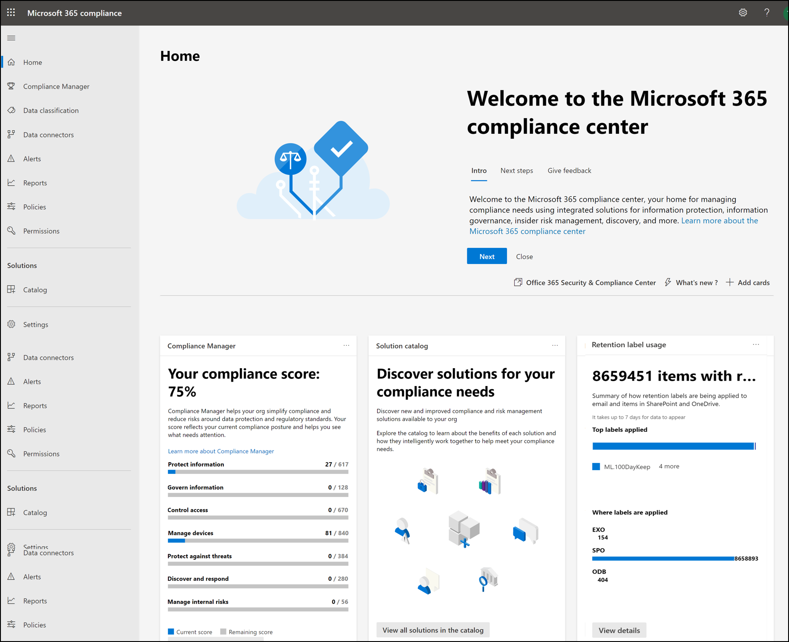
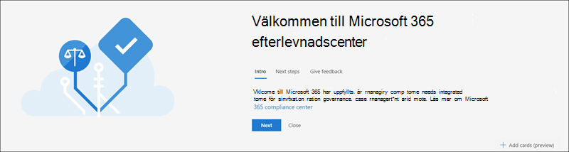
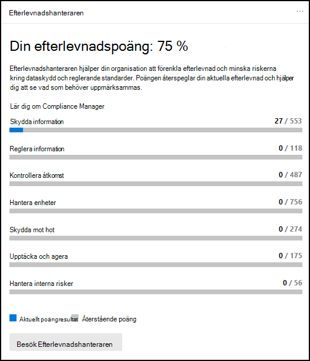
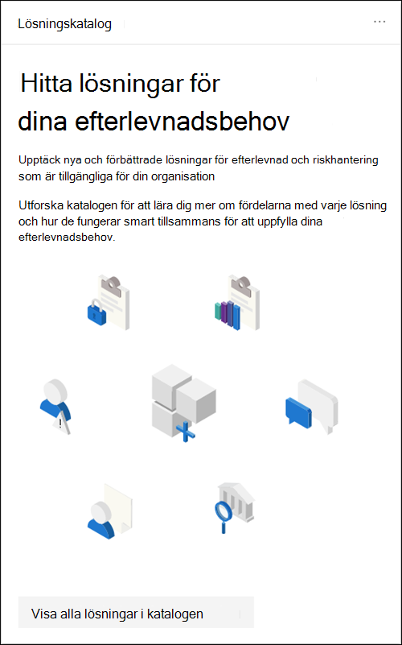
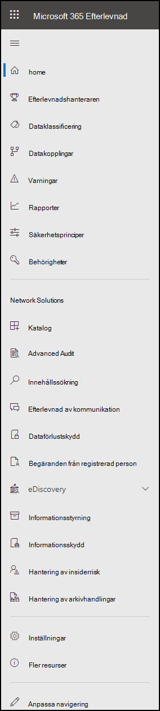
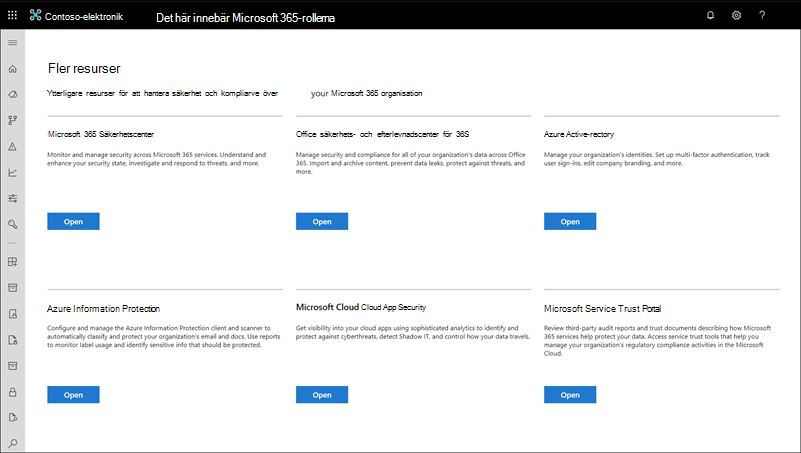

# Microsoft 365 Efterlevnadscenter

Om du är intresserad av efterlevnadscentret i din organisation kommer du att älska [det Microsoft 365 efterlevnadscentret.](https://compliance.microsoft.com) På Microsoft 365 kompatibilitetscenter finns enkel åtkomst till de data och verktyg du behöver för att hantera organisationens efterlevnadsbehov.

Läs den här artikeln om du vill bekanta dig med Microsoft 365, hur du [hämtar](#how-do-i-get-the-compliance-center)den, [vanliga](#frequently-asked-questions)frågor och [nästa steg.](#next-steps)

## Välkommen till Microsoft 365 efterlevnad

När du går Microsoft 365 kompatibilitetscenter för första gången visas följande välkomstmeddelande:

I välkomstbanderollen får du tips om hur du kommer igång, med nästa steg och en inbjudan att ge oss feedback.

## Kortavsnitt

När du först besöker efterlevnadscentret för Microsoft 365 kan du i kortavsnittet på startsidan direkt se hur det går för organisationen med dataefterlevnaden, vilka lösningar som finns tillgängliga för organisationen och en sammanfattning av alla aktiva aviseringar.

Härifrån kan du:

- Granska **Microsoft Compliance Manager-kortet** som leder dig till [lösningen för Efterlevnadshanteraren.](compliance-manager.md) Efterlevnadshanteraren gör det enklare att hantera efterlevnad. Den beräknar ett riskbaserat resultat som mäter hur du går till slut på rekommenderade åtgärder som hjälper till att minska riskerna kring dataskydd och reglerande standarder. Det innehåller även arbetsflödesfunktioner och inbyggd kontrollmappning som hjälper dig att effektivt utföra förbättringsåtgärder.

    

- Granska det nya **kortet för lösningskatalogen,** som länkar till samlingar av integrerade lösningar som du kan använda för att hjälpa dig att hantera scenarier för end-to-end-efterlevnad.  Funktionerna och verktygen för en lösning kan innehålla en kombination av principer, aviseringar, rapporter med mera.

    

- Granska kortet **Aktiva** aviseringar, som innehåller  en sammanfattning av de mest aktiva aviseringarna och innehåller en länk där du kan visa mer detaljerad information, till exempel allvarlighetsgrad, status, kategori med mera.

    

Du kan också  använda funktionen Lägg till kort om du vill lägga till ytterligare kort, till exempel ett som visar organisationens molnappefterlevnad och ett annat som visar data om användare med delade filer, med länkar till [Cloud App Security](/cloud-app-security/) eller andra verktyg där du kan utforska data.

## Enkel navigering till fler efterlevnadsfunktioner

Förutom länkar på korten på startsidan visas ett navigeringsfönster till vänster på skärmen som ger dig enkel åtkomst till dina [aviseringar,](../security/office-365-security/alerts.md) [rapporter,](reports-in-security-and-compliance.md) [principer,](alert-policies.md)efterlevnadslösningar med mera. Om du vill lägga till eller ta bort alternativ för ett anpassat navigeringsfönster använder **du navigeringskontrollen** Anpassa i navigeringsfönstret. Då öppnas inställningarna **för anpassa navigeringsfönstret** så att du kan konfigurera vilka objekt som ska visas i navigeringsfönstret.

|  |  |
|---------|---------|
|  | Välj **Start** för att återgå Microsoft 365 sidan för kompatibilitetscentret.   Besök **Efterlevnadshanteraren** om du vill kontrollera efterlevnadsresultatet och [börja hantera](compliance-manager.md) efterlevnad för din organisation.    Välj avsnittet **Dataklassificering** för att [komma åt utbildare för klassificerare](classifier-learn-about.md), [definitioner av enheter av typen](sensitive-information-type-entity-definitions.md)Känslig information , innehåll och [aktivitetsutforskaren.](data-classification-activity-explorer.md)    Välj **Datakopplingar** för [att konfigurera kopplingar för](archiving-third-party-data.md) att importera och arkivera data i Microsoft 365 prenumeration.    Gå till **Aviseringar för** att visa och åtgärda [aviseringar](alert-policies.md)   Gå **till** Rapporter om du vill [visa](sensitivity-labels.md)data om användning och bevarande av etiketter, matchningar och åsidosättningar av [DLP-principen,](view-the-dlp-reports.md) delade filer, appar från tredje part som [används](/cloud-app-security/discovered-apps)och mycket mer.    Gå till **Principer** för att konfigurera principer för att styra data, hantera enheter och ta emot [aviseringar.](../security/office-365-security/alerts.md) Du kan också komma åt [DLP- och](dlp-learn-about-dlp.md) [bevarandeprinciper.](retention.md)   Välj **Behörigheter** om du vill hantera vem i organisationen som har åtkomst till Microsoft 365 om du vill visa innehåll och slutföra uppgifter.    Använd länkarna i avsnittet Lösningar **för** att få åtkomst till din organisations efterlevnadslösningar. De omfattar:    [Katalog](microsoft-365-solution-catalog.md)   Upptäck, lär dig mer om och börja använda de intelligenta efterlevnads- och riskhanteringslösningar som är tillgängliga för din organisation.    [Granskning](search-the-audit-log-in-security-and-compliance.md)   Använd granskningsloggen för att undersöka vanliga support- och efterlevnadsproblem.    [Innehållssökning](search-for-content.md)   Använd innehållssökning för att snabbt hitta e-post i Exchange-postlådor, dokument på SharePoint-webbplatser och OneDrive-platser samt snabbmeddelandekonversationer i Microsoft Teams och Skype för företag.    [Kommunikationsefterlevnad](communication-compliance.md)   Minimera kommunikationsrisker genom att automatiskt fånga in olämpliga meddelanden, undersöka möjliga principbrott och vidta åtgärder för att åtgärda.    [Mer information om dataförlustskydd](dlp-learn-about-dlp.md)   Identifiera känsligt innehåll när det används och delas i hela organisationen, i molnet och på enheter och hjälper till att förhindra att data förloras av misstag.    [Begäranden från registrerad person](/compliance/regulatory/gdpr-manage-gdpr-data-subject-requests-with-the-dsr-case-tool)   Hitta och exportera en användares personliga data för att hjälpa dig att svara på förfrågningar om dataskyddsförordningen (GDPR).    [eDiscovery](overview-ediscovery-20.md)   Expandera det här avsnittet för att använda kärn- och Advanced eDiscovery för att bevara, samla in, granska, analysera och exportera innehåll som svarar på organisationens interna och externa undersökningar.    [Informationsstyrning](manage-information-governance.md)   Hantera livscykeln för innehåll med funktioner för att importera, lagra och klassificera affärskritiska data så att du kan behålla det du behöver och ta bort det du inte gör.    [Informationsskydd](information-protection.md)   Upptäck, klassificera och skydda känsligt och verksamhetskritiskt innehåll under hela organisationens hela livscykel.    [Hantering av insiderrisk](insider-risk-management.md)   Identifiera riskfyllda aktiviteter i hela organisationen för att snabbt identifiera, undersöka och vidta åtgärder för insiderrisker och -hot.    [Hantering av arkivhandlingar](records-management.md)   Automatisera och förenkla kvarhållningsschemat för regelverk, juridiska och affärskritiska poster i organisationen.

## Hur får jag efterlevnadscentret?

- Om du inte redan har det nya Microsoft 365 efterlevnadscenter har du det snart. Efterlevnadscentret Microsoft 365 allmänt tillgänglig nu för kunder Microsoft 365 SKU.

- Besök Efterlevnadscenter Microsoft 365 globala administratörer, efterlevnadsadministratörer och efterlevnadsdataadministratörer går till [https://compliance.microsoft.com](https://compliance.microsoft.com) och loggar in.

## Vanliga frågor och svar

**Varför tas jag till säkerhetscentret för & slutföra vissa uppgifter, t.ex. definiera vissa principer?**

Vi utvecklar fortfarande det Microsoft 365 efterlevnadscenter och vi lägger till fler funktioner och lösningar under de kommande månaderna. Under tiden finns det några uppgifter som måste slutföras i säkerhets- och & [https://protection.office.com](https://protection.office.com) (). I sådana fall dirigeras du automatiskt till den plats där du kan slutföra uppgiften, till exempel skapa eller redigera en överhållningspolicy.

**Varför ser jag inte det nya kompatibilitetscentret för Microsoft 365 än?**

Kontrollera först att du har rätt licenser och behörigheter. Logga sedan in på [https://compliance.microsoft.com](https://compliance.microsoft.com) . Om du inte ser det nya efterlevnadscentret ännu har du det snart.

**Vissa av mina efterlevnadsfunktioner är inte tillgängliga i Microsoft 365 kompatibilitetscenter. Vad ska jag göra?**

Vi lägger fortfarande till funktioner i Microsoft 365 efterlevnadscenter. Om du inte kan hitta något, till exempel granskningsloggsökning, använder du Säkerhets- & Efterlevnadscenter [https://protection.office.com](https://protection.office.com) (). Dina konfigurationer sparas automatiskt både i det befintliga säkerhets- & säkerhets- och efterlevnadscentret och i det nya Microsoft 365 säkerhets- och efterlevnadscentret.

Gå dit genom att gå till efterlevnadscentret för Microsoft 365 och navigeringsfönstret till vänster på skärmen. Välj sedan Fler resurser och öppna under **Office 365 Security & Compliance Center** **.**

## Nästa steg

- **Besök Microsoft Compliance Manager för** att se din efterlevnadspoäng och börja hantera efterlevnad för din organisation. Mer information finns i [Efterlevnadshanteraren](compliance-manager.md).

- **Konfigurera insider-principer för riskhantering** för att minimera interna risker och gör att du kan upptäcka, undersöka och vidta åtgärder för riskfyllda aktiviteter i organisationen. Se [Insider-riskhantering.](insider-risk-management.md)

- **Granska organisationens principer för dataförlustskydd och** gör nödvändiga ändringar efter behov. Mer information finns i Läs [mer om skydd mot dataförlust.](dlp-learn-about-dlp.md)

- **Bekanta dig med och konfigurera Microsoft Cloud App Security**. Läs [Snabbstart: Komma igång med Microsoft Cloud App Security](/cloud-app-security/getting-started-with-cloud-app-security).

- **Lär dig mer om och skapa principer för** kommunikationsefterlevnad för att snabbt identifiera och åtgärda överträdelser av företagets regler och regler. Se [Kommunikationsefterlevnad i Microsoft 365](communication-compliance.md).

- **Besök ditt Microsoft 365 ofta och** se till att granska eventuella varningar eller potentiella risker som kan uppstå. Gå till [https://compliance.microsoft.com](https://compliance.microsoft.com) och logga in.