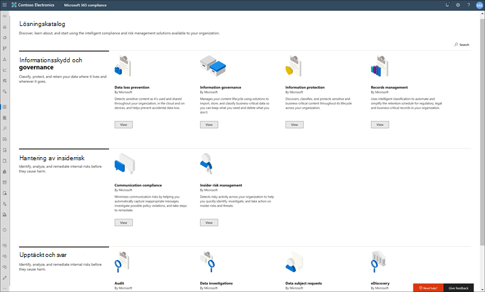
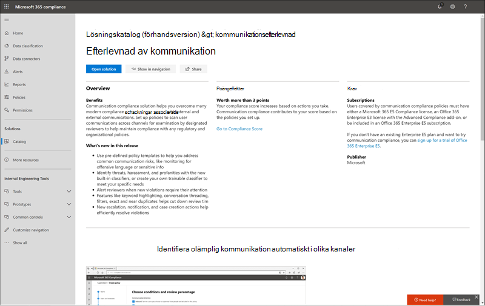

# Lösningskatalog för Microsoft 365

Letar du efter ett sätt att snabbt komma igång med efterlevnadsuppgifter i Microsoft 365? Ta en en [Microsoft 365 för att](https://compliance.microsoft.com/solutioncatalog) upptäcka, lära dig och snabbt komma igång med efterlevnads- och riskhanteringslösningar.

Efterlevnadslösningar i Microsoft 365 är samlingar av integrerade funktioner som du kan använda för att hjälpa dig att hantera scenarier för end-to-end-efterlevnad. Funktionerna och verktygen för en lösning kan innehålla en kombination av principer, aviseringar, rapporter med mera.

Läs den här artikeln om du vill bekanta dig med den nya lösningskatalogen i [Microsoft 365 Efterlevnadscenter,](#how-do-i-get-this)skaffa den, [vanliga](#frequently-asked-questions)frågor och [nästa steg](#next-steps).

## Katalogorganisation

Lösningskatalogen är ordnad i avsnitt som innehåller informationskort för varje efterlevnadslösning som är tillgänglig i Microsoft 365-prenumerationen. Varje avsnitt innehåller kort för lösningar grupperade efter efterlevnadsområde.

När du **väljer** Visa som lösningskort ser du detaljerad information om efterlevnadslösningen och hur du kommer igång. Den här informationen innehåller en översikt, förkonfigurationskrav, utbildningsresurser, kontroller som gör att du kan fästa kortet i navigeringsfönstret och ett alternativ för att dela lösningen som en länk, ett e-postmeddelande eller ett Microsoft Teams meddelande.

## Avsnittet Informationsskydd & styrning

I **avsnittet Informationsskydd & översikt** över hur du kan använda Microsoft 365 för att skydda och reglera data i organisationen.

Härifrån ser du kort för följande lösningar:

- [Skydd mot dataförlust:](dlp-learn-about-dlp.md)Identifierar känsligt innehåll när det används och delas i hela organisationen, i molnet och på enheter och hjälper till att förhindra att data förloras av misstag.
- [Informationsstyrning:](manage-information-governance.md)Hanterar livscykeln för innehåll med hjälp av lösningar för att importera, lagra och klassificera affärskritiska data så att du kan behålla det du behöver och ta bort det du inte gör.
- [Informationsskydd:](information-protection.md)Identifierar, klassificerar och skyddar känsligt och affärskritiskt innehåll under hela organisationens hela livscykel.
- [Hantering av](records-management.md)arkivhandlingar: Använder intelligent klassificering för att automatisera och förenkla kvarhållningsschemat för föreskrifter, juridiska och affärskritiska arkivhandlingar i organisationen.

## Avsnittet om Insider-riskhantering

På **startsidan för Insider-riskhantering** visas snabbt hur organisationen kan identifiera, analysera och vidta åtgärder för interna risker innan de kan orsaka skada.

Härifrån ser du kort för följande lösningar:

- [Kommunikationsefterlevnad:](communication-compliance.md)Minimerar kommunikationsrisker genom att hjälpa dig att automatiskt fånga in olämpliga meddelanden, undersöka möjliga principbrott och vidta åtgärder för att minimera skada.
- [Insider-riskhantering:](insider-risk-management.md)Identifiera riskfyllda aktiviteter i organisationen för att snabbt identifiera, undersöka och vidta åtgärder för insiderrisker och hot.

## Avsnittet & identifieringssvar

I **avsnittet & svar** på startsidan visas en snabb överblick över hur organisationen snabbt kan hitta, undersöka och svara på efterlevnadsproblem med relevanta data.

Härifrån ser du kort för följande lösningar:

- [Granskning:](search-the-audit-log-in-security-and-compliance.md)Registrerar användar- och administratörsaktivitet från organisationen så att du kan söka i granskningsloggen och undersöka en omfattande lista med aktiviteter för alla platser och tjänster.
- [Data subject requests:](/compliance/regulatory/gdpr-manage-gdpr-data-subject-requests-with-the-dsr-case-tool)Finds and exports a user's personal data to help you respond to data subject requests for GDPR.
- [eDiscovery](manage-legal-investigations.md)
    - [Core eDiscovery](./get-started-core-ediscovery.md): Sökningar på innehållsplatser för att identifiera, bevara och exportera data som svar på förfrågningar om juridisk upptäckt och eDiscovery-ärenden.
    - [Advanced eDiscovery:](overview-ediscovery-20.md)Bygger på eDiscovery-funktioner genom att tillhandahålla intelligenta analyser och maskininlärning som hjälper dig att ytterligare analysera data som är relevanta för identifieringsförfrågningar.

## Hur får jag det här?

För att besöka Microsoft 365-lösningskatalogen går du till och loggar in som [https://compliance.microsoft.com](https://compliance.microsoft.com) global administratör, efterlevnadsadministratör eller efterlevnadsdataadministratör. Välj **Katalog** i navigeringsfönstret till vänster på skärmen för att öppna katalogens startsida.

## Vanliga frågor och svar

**Varför ser jag inte den nya Microsoft 365-lösningskatalogen?**

Kontrollera först att du har rätt licenser och behörigheter. Logga sedan in som [https://compliance.microsoft.com](https://compliance.microsoft.com) global administratör, efterlevnadsadministratör eller efterlevnadsdataadministratör.

**Vissa av efterlevnadsfunktionerna som visas på sidan för lösningskatalogen är inte tillgängliga i Microsoft 365 Efterlevnadscenter. Vad ska jag göra?**

Vi arbetar ständigt med att lägga till nya funktioner i Microsoft 365 Efterlevnadscenter och lösningskatalogen. Om du inte kan hitta en specifik lösning i navigeringsområdet är den tillgänglig när lösningen är tillgänglig i din prenumeration.

Om du letar efter en befintlig efterlevnadslösning och den inte är tillgänglig i Microsoft 365 Efterlevnadscenter ännu kan du alltid komma åt lösningar i det befintliga säkerhetsefterlevnadscentret genom att &amp; gå till [https://protection.office.com](https://protection.office.com) . Alternativt kan du klicka  på fliken Fler resurser i det vänstra navigeringsfältet i Microsoft 365 Efterlevnadscenter och välja kortet för Office 365 säkerhets- och efterlevnadscenter.  

## Nästa steg

- **Besök Microsoft Compliance Manager** som hjälper dig att förstå hur viktiga standarder och bestämmelser efterlevs i organisationen. Vi rekommenderar åtgärder som du kan vidta för att förstärka din övergripande efterlevnadsfunktion och innehåller arbetsflödesfunktioner som hjälper dig att effektivt utföra de åtgärderna. Mer information finns i [Efterlevnadshanteraren](compliance-manager.md).

- **Konfigurera insider-principer för riskhantering** för att minimera interna risker och gör att du kan upptäcka, undersöka och vidta åtgärder för riskfyllda aktiviteter i organisationen. Se [Insider-riskhantering.](insider-risk-management.md)

- **Lär dig mer om och skapa principer för** kommunikationsefterlevnad för att snabbt identifiera och åtgärda överträdelser av företagets regler och regler. Se [Kommunikationsefterlevnad.](communication-compliance.md)

- **Microsoft Information Protection** kan du lära Microsoft 365 hur dina lösningar hjälper dig att upptäcka, klassificera och skydda känslig information oavsett var den bor eller reser.
    - **Bekanta dig med och konfigurera Microsoft Cloud App Security**. Läs [Snabbstart: Komma igång med Microsoft Cloud App Security](/cloud-app-security/getting-started-with-cloud-app-security).
    - **Kom igång med klassificerare**. Att klassificera innehåll och sedan märka det så att det kan skyddas och hanteras på rätt sätt är utgångspunkten för informationsskyddsgrenen. Mer [information om utbildare (förhandsversion)](classifier-learn-about.md).

- **Besök din Microsoft 365- och se** till att läsa om nya lösningar som hjälper dig med dina efterlevnadsbehov. Logga in på [https://compliance.microsoft.com](https://compliance.microsoft.com) och välj sedan **Katalog** i det vänstra navigeringsfönstret.