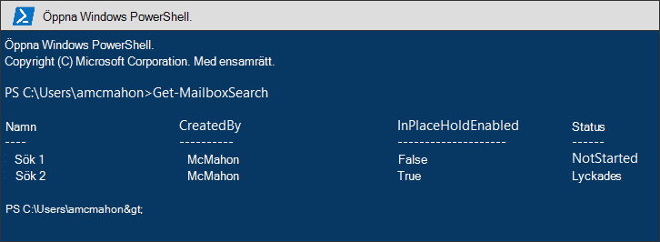
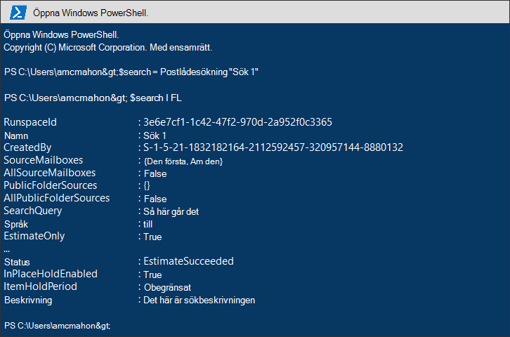
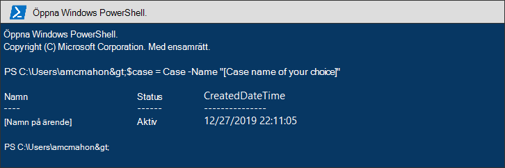
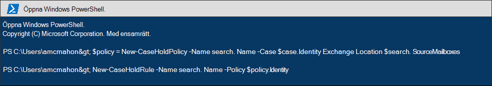
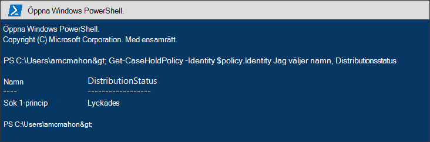
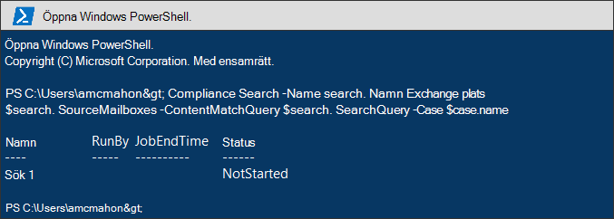
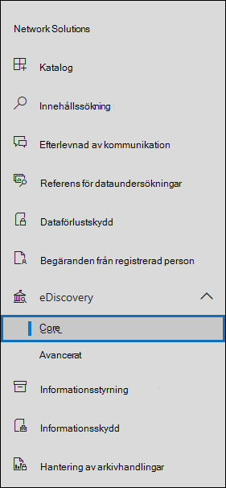
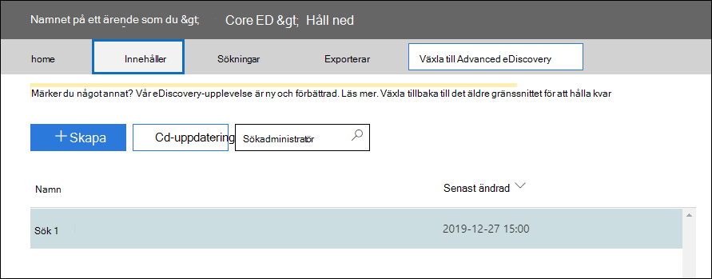
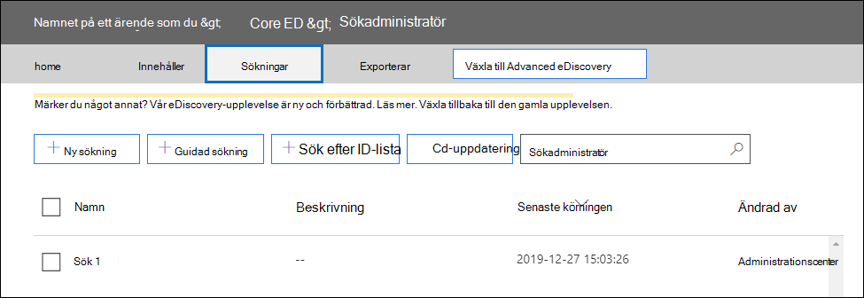

# <a name="migrate-legacy-ediscovery-searches-and-holds-to-the-microsoft-365-compliance-center"></a>Migrera äldre eDiscovery-sökningar och eDiscovery-Microsoft 365 efterlevnadscenter

Efterlevnadscentret för Microsoft 365 ger en förbättrad upplevelse för eDiscovery-användning, inklusive högre tillförlitlighet, bättre prestanda och många funktioner som är skräddarsydda för eDiscovery-arbetsflöden, inklusive fall där innehåll kan struktureras efter område, granskningsuppsättningar för att granska innehåll och analys för att underlätta granskning av data, till exempel närplicerad gruppering, e-posttrådning, temananalys och prognostiska kodning.

För att hjälpa kunder att dra nytta av de nya och förbättrade funktionerna innehåller den här artikeln grundläggande vägledning om hur du migrerar eDiscovery-sökningar och In-Place-sökningar från administrationscentret för Exchange till efterlevnadscentret för Microsoft 365.

> [!NOTE]
> Eftersom det finns många olika scenarier innehåller den här artikeln allmän vägledning för hur man gör för att göra övergången till ett grundläggande eDiscovery-ärende i Microsoft 365 efterlevnadscenter. Att använda eDiscovery-ärenden är inte alltid obligatoriskt, men de lägger till en extra säkerhetsnivå genom att du kan tilldela behörigheter för att styra vem som har åtkomst till eDiscovery-ärendena i organisationen.

## <a name="before-you-begin"></a>Innan du börjar

- Du måste vara medlem i rollgruppen för eDiscovery Manager i Säkerhets- och &-efterlevnadscenter för att kunna köra PowerShell-kommandona som beskrivs i den här artikeln. Du måste också vara medlem i rollgruppen för Identifieringshantering Exchange administrationscentret.

- Den här artikeln innehåller vägledning om hur du skapar en eDiscovery-hold. Principen för håll tillämpas på postlådor genom en asynkron process. När du skapar ett eDiscovery-värde måste du skapa både ett CaseHoldPolicy- och CaseHoldRule, annars skapas inte detta värde och innehållsplatser kommer inte att vara på plats.

## <a name="step-1-connect-to-exchange-online-powershell-and-security--compliance-center-powershell"></a>Steg 1: Anslut att Exchange Online PowerShell och Security & Compliance Center PowerShell

Det första steget är att ansluta till Exchange Online PowerShell och Security & Compliance Center PowerShell. Du kan kopiera följande skript, klistra in det i ett PowerShell-fönster och sedan köra det. Du uppmanas att ange autentiseringsuppgifter för organisationen som du vill ansluta till. 

```powershell
$UserCredential = Get-Credential
$sccSession = New-PSSession -ConfigurationName Microsoft.Exchange -ConnectionUri https://ps.compliance.protection.outlook.com/powershell-liveid -Credential $UserCredential -Authentication Basic -AllowRedirection
Import-PSSession $sccSession -DisableNameChecking
$exoSession = New-PSSession -ConfigurationName Microsoft.Exchange -ConnectionUri https://ps.outlook.com/powershell-liveid/ -Credential $UserCredential -Authentication Basic -AllowRedirection
Import-PSSession $exoSession -AllowClobber -DisableNameChecking
```

Du måste köra kommandona i följande steg i den här PowerShell-sessionen.

## <a name="step-2-get-a-list-of-in-place-ediscovery-searches-by-using-get-mailboxsearch"></a>Steg 2: Få en lista över alla In-Place eDiscovery-sökningar med hjälp av Get-MailboxSearch

När du har autentiserat kan du få en lista In-Place eDiscovery-sökningar genom att köra cmdleten **Get-MailboxSearch.** Kopiera och klistra in följande kommando i PowerShell och kör det sedan. En lista med sökningar visas med deras namn och status för eventuella In-Place.

```powershell
Get-MailboxSearch
```

Cmdlet-utdata kommer att se ut ungefär så här:



## <a name="step-3-get-information-about-the-in-place-ediscovery-searches-and-in-place-holds-you-want-to-migrate"></a>Steg 3: Få information om hur In-Place eDiscovery-sökningar och hur In-Place som ska migreras

Du kommer återigen att **använda cmdleten Get-MailboxSearch,** men nu för att få egenskaperna för sökningen. Du kan lagra de här egenskaperna i en variabel för senare användning. I följande exempel lagras resultatet av **cmdleten Get-MailboxSearch** i en variabel och sedan visas egenskaperna för sökningen.

```powershell
$search = Get-MailboxSearch -Identity "Search 1"
```

```powershell
$search | FL
```

Utdata för dessa två kommandon kommer att se ut ungefär så här:



> [!NOTE]
> Varaktigheten för det In-Place i det här exemplet är obegränsad *(ItemHoldPeriod: Unlimited*). Det här är typiskt för scenarier för e-dataidentifiering och juridisk undersökning. Om varaktigheten för bevarandet har ett annat värde än ett obegränsat värde beror det sannolikt på att bevarandet används för att behålla innehåll i ett bevarandescenario. I stället för att använda eDiscovery-cmdlets i Security & Compliance Center PowerShell för bevarandescenarier rekommenderar vi att du använder [New-RetentionCompliancePolicy](/powershell/module/exchange/new-retentioncompliancepolicy) och [New-RetentionComplianceRule](/powershell/module/exchange/new-retentioncompliancerule) för att behålla innehåll. Resultatet av att använda dessa cmdlets påminner om att använda **New-CaseHoldPolicy** och **New-CaseHoldRule**, men du kan ange en bevarandeperiod och en bevarandeåtgärd, till exempel ta bort innehåll efter att lagringsperioden gått ut. Om du använder cmdlet:arna för bevarande behöver du inte associera bevarandet med ett eDiscovery-ärende.

## <a name="step-4-create-a-case-in-the-microsoft-365-compliance-center"></a>Steg 4: Skapa ett ärende i Microsoft 365 efterlevnadscenter

Om du vill skapa ett eDiscovery-ärende måste du skapa ett eDiscovery-ärende att koppla holden till. I följande exempel skapas ett eDiscovery-ärende med ett namn som du väljer. Vi lagrar egenskaperna för det nya ärendet i en variabel för användning senare. Du kan visa de egenskaperna genom att köra `$case | FL` kommandot när du har skapat ärendet.

```powershell
$case = New-ComplianceCase -Name "[Case name of your choice]"
```


## <a name="step-5-create-the-ediscovery-hold"></a>Steg 5: Skapa eDiscovery-hållen

När ärendet har skapats kan du skapa ett ärende och koppla det till det ärende som du skapade i föregående steg. Det är viktigt att komma ihåg att du måste skapa både en princip för undantag från ärende och en regel för undantag. Om regeln om undantag inte skapas efter att du skapat principen för undantag för ärende skapas inte undantag för eDiscovery och inget innehåll sätts på undantag.

Kör följande kommandon för att skapa den eDiscovery-hold som du vill migrera. I de här exemplen används egenskaperna In-Place från steg 3 som du vill migrera. Det första kommandot skapar en ny princip för ärendesparning och sparar egenskaperna på en variabel. Det andra kommandot skapar motsvarande undantagsregel.

```powershell
$policy = New-CaseHoldPolicy -Name $search.Name -Case $case.Identity -ExchangeLocation $search.SourceMailboxes
```

```powershell
New-CaseHoldRule -Name $search.Name -Policy $policy.Identity
```



## <a name="step-6-verify-the-ediscovery-hold"></a>Steg 6: Verifiera eDiscovery-hållen

För att kontrollera att det inte gick att skapa ett väntande jobb är det bra att kontrollera att statusen för att hålla distributionen är lyckad. Distribution innebär att hastet har tillämpats på alla innehållsplatser som anges i *parametern ExchangeLocation* i föregående steg. Det kan du göra genom att köra **cmdleten Get-CaseHoldPolicy.** Eftersom egenskaperna som sparades på *den $policy-variabel* som du skapade i föregående steg inte uppdateras automatiskt i variabeln måste du köra cmdleten igen för att verifiera att fördelningen har lyckats. Det kan ta mellan 5 minuter och 24 timmar för principer för ärende hold att distribueras.

Kör följande kommando för att verifiera att eDiscovery-behållarna har distribuerats.

```powershell
Get-CaseHoldPolicy -Identity $policy.Identity | Select name, DistributionStatus
```

Värdet för **Lyckades** för egenskapen *DistributionStatus* anger att fältet har placerats på innehållsplatserna. Om fördelningen ännu inte är klar visas **värdet Väntande.**



## <a name="step-7-create-the-search"></a>Steg 7: Skapa sökningen

Det sista steget är att skapa sökningen som du identifierade i steg 3 igen och koppla den till ärendet. När du har skapat sökningen kan du köra den med hjälp av **cmdleten Start-ComplianceSearch** eller köra den senare.

```powershell
New-ComplianceSearch -Name $search.Name -ExchangeLocation $search.SourceMailboxes -ContentMatchQuery $search.SearchQuery -Case $case.name
```



## <a name="step-8-verify-the-case-hold-and-search-in-the-microsoft-365-compliance-center"></a>Steg 8: Kontrollera ärendet, håll kvar och sök i Microsoft 365 kompatibilitetscenter

Kontrollera att allt är korrekt inställt genom att gå till Microsoft 365 efterlevnadscenter på och klicka på [https://compliance.microsoft.com](https://compliance.microsoft.com) **eDiscovery > Core**.



Det ärende som du skapade i steg 3 visas på **sidan Bas-eDiscovery.** Öppna ärendet och lägg sedan märke till det ärende du skapade i steg 4 på **fliken** Håll. Du kan välja att hålla på plats om du vill se information på den utfällliga sidan, inklusive antalet postlådor som är inhållna och distributionsstatus.



Sökningen som du skapade i steg 7 visas på **fliken Sökningar** för ärendet.



Om du migrerar en In-Place eDiscovery-sökning men inte associerar den med ett eDiscovery-fall visas den på sidan Innehållssökning i efterlevnadscentret för Microsoft 365.

## <a name="more-information"></a>Mer information

- Mer information om eDiscovery In-Place och eDiscovery & i administrationscentret för Exchange finns i:
  
  - [Lokal eDiscovery](/exchange/security-and-compliance/in-place-ediscovery/in-place-ediscovery)

  - [Bevarande av juridiska skäl på plats och bevarande av juridiska skäl](/exchange/security-and-compliance/in-place-and-litigation-holds)

- Mer information om PowerShell-cmdlets som används i artikeln finns i:

  - [Get-MailboxSearch](/powershell/module/exchange/get-mailboxsearch)
  
  - [New-ComplianceCase](/powershell/module/exchange/new-compliancecase)

  - [New-CaseHoldPolicy](/powershell/module/exchange/new-caseholdpolicy)
  
  - [New-CaseHoldrule](/powershell/module/exchange/new-caseholdrule)

  - [Get-CaseHoldPolicy](/powershell/module/exchange/get-caseholdpolicy)
  
  - [New-ComplianceSearch](/powershell/module/exchange/new-compliancesearch)

  - [Start-ComplianceSearch](/powershell/module/exchange/start-compliancesearch)

- Mer information om hur Microsoft 365 och efterlevnadscenter finns i [Översikt över Microsoft 365 kompatibilitetscenter.](microsoft-365-compliance-center.md)