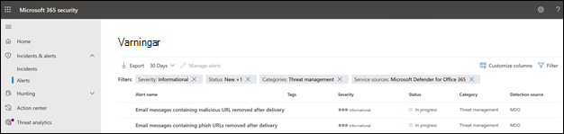
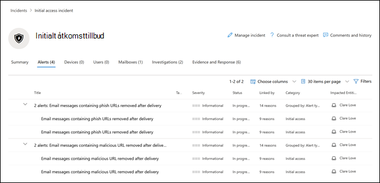

# Nya varningsprinciper i Microsoft Defender för Office 365

Microsoft Defender för Office 365 introducerar nya och förbättrade varningsprinciper relaterade identifiering efter leverans. Det inkluderar förbättringar av spelböcker för automatiska undersökningar och svar (AIR) associerade med dem. I tillägg ändrar vi allvarlighetsklassificering för sex standardvarningsprinciper för att bättre anpassa varningarna som genereras av dessa principer med deras inverkan på din organisation.

## Identifiering efter leverans

Vi kommer att introducera fyra nya standardvarningsprinciper relaterade identifieringar efter leverans efter att Microsoft Defender för Office 365 utfört en automatisk rensning och tagit bort meddelanden från en inkorg. De fyra nya varningsprinciperna kommer att ersätta två existerande standardvarningsprinciper som täcker scenarion med automatisk rensning och kommer att ge organisationen bättre detaljer om underliggande identifiering och relaterade indikatorer. Varningarna (och spelböckerna för AIR-undersökningar som utlöses av varningarna) kommer att fånga upp hoten från e-postmeddelanden och enheter och inkluderar om webbadressen pekar på en skadlig fil eller om filen innehåller en skadlig webbadress.

Följande tabell listar de nya varningsprinciperna samt de existerande varningsprinciperna som kommer att tas bort. Läs avsnittet [Hur kommer detta att påverka din organisation](#how-this-will-affect-your-organization) för mer detaljer om lanseringen.

| Nya eller existerande varningsprinciper | Namn på varningsprincip | ID för varningsprincip|
|:-----------------------------|:----------------|:--------------|
| Ny| **E-postmeddelanden som innehåller en skadlig webbadress har tagits bort efter leverans**   | 8e6ba277-ef39-404e-aaf1-294f6d9a2b88 |
| Ny| **E-postmeddelanden som innehåller en skadlig fil har tagits bort efter leverans**  | 4b1820ec-39dc-45f3-abf6-5ee80df51fd2 |
| Ny| **E-postmeddelande från en kampanj levererades och togs sedan bort** | c8522cbb-9368-4e25-4ee9-08d8d899dfab |
| Ny|**E-postmeddelanden som tagits bort efter leverans**                | b8f6b088-5487-4c70-037c-08d8d71a43fe |
| Existerande (kommer att tas bort)| **E-postmeddelanden med nätfiske togs bort efter leverans**| EA8169FA-0678-4751-8854-AEBEA7ADECEB |
| Existerande (kommer att tas bort)| **E-postmeddelanden som innehåller skadlig kod har tagits bort efter leverans**| 0179B3F7-3FDA-40C3-8F24-278563978DBB |
||||

## Förbättringar av varningens allvarlighetsgrad

I följande tabell identifieras standardvarningsprinciperna vilkas klassificering av allvarlighetsgrad har ändrats. Vi ändrar allvarlighetsgraderna för varningsprinciperna till att vara bättre anpassade till den potentiella risken och påverkan på din organisation och för att hjälpa dina säkerhetsteam att prioritera varningarna som genereras av dessa principer.

| Varning| ID för varningsprincip| Gammal allvarlighetsnivå| Ny allvarlighetsnivå  |
|:----------|:---------------|:------------|:--------------|
| **Misstänkt vidarebefordran av e-post**| BFD48F06-0865-41A6-85FF-ADB746423EBF | Medel| Hög|
| **E-postmeddelande rapporterat av användare som skadlig programvara eller nätfiske** | B26A5770-0C38-434A-9380-3A3C2C27BBB3 | Informativ | Låg|
| **Ovanlig ökning av e-postmeddelanden rapporterade som nätfiske** | A00D8C62-9320-4EEA-A7E5-966B9AC09558 | Hög| Medel |
| **Resultat av administratörsinskick slutfört** | AE9B83DD-6039-4EA9-B675-6B0AC3BF4A41 | Låg| Informativ |
| **Skapa regel för vidarebefordran / omdirigering** | D59A8FD4-1272-41EE-9408-86F7BCF72479 | Låg| Informativ |
| **eDiscovery-sökningen har startats eller exporterats** | 6FDC5710-3998-47F0-AFBB-57CEFD7378A | Meduim | Informativ |
|||||

## När kommer dessa ändringar att genomföras

Följande tabell anger när nya varningsprinciper kommer att utlösa varningar för identifiering efter leverans. Tabellen anger också när de två existerande varningsprinciperna kommer att tas bort.

| Varningsprincip| Datum |
|:------------|:-----|
| **E-postmeddelanden som innehåller en skadlig webbadress har tagits bort efter leverans** (ny) | Varningar kommer att utlösas från och med den 11 april 2021|
| **E-postmeddelanden som innehåller en skadlig fil har tagits bort efter leverans** (ny) | Varningar kommer att utlösas från och med den 11 april 2021 |
| **E-postmeddelande från en kampanj levererades och togs sedan bort** (new) | Varningar kommer att börja utlösa den 28 maj 2021|
| **Skadliga e-postmeddelanden levererades och togs sedan bort** (ny) | Varningar kommer att börja utlösa den 28 maj 2021|
| **E-postmeddelanden med nätfiske togs bort efter leverans** (existerande, kommer att tas bort)| Varningsprincipen kommer att tas bort den 28 maj 2021. Se avsnittet [Vad du behöver göra för att förbereda dig på ändringarna](#what-you-need-to-do-to-prepare-for-these-changes).|
| **E-postmeddelanden med skadlig programvara togs bort efter leverans** (existerande, kommer att tas bort) | Varningsprincipen kommer att tas bort den 28 maj 2021. Se avsnittet [Vad du behöver göra för att förbereda dig på ändringarna](#what-you-need-to-do-to-prepare-for-these-changes). |
|||

Ändringarna på allvarlighetsnivåer kommer att lanserar till alla organisationer den 14 maj 2021.

## Hur kommer detta att påverka din organisation

De nya varningarna kommer börja utlösa AIR-undersökningar i din organisation på datumen som angetts ovan. För att minska påverkan på säkerhetsorganisationer som har operationaliserat de två varningarna som ska tas bort kommer du att se varningar som utlöses av de existerande varningsprinciperna *och* varningarna som utlöses av de nya varningsprinciperna mellan den 5 april 2021 och 28 maj 2021. Det ger säkerhetsteamen tid till att hantera de nödvändiga ändringarna. För att hjälpa säkerhetsteamen med den ökade mängden varningar under denna korta tidsperiod kommer både existerande varningar och nya varningar att korreleras till samma AIR-undersökningar och korrelera till samma incident. Mer specifikt kommer det att inkludera följande beteenden för varningar, AIR-undersökningar och incidenter:

- **Varningar**: Enligt design kommer du att se följande varningspar för befintliga och nya varningar:

  - **E-postmeddelanden med nätfiske togs bort efter leverans** OCH **E-postmeddelanden som innehåller en skadlig webbadress har tagits bort efter leverans**

  - **E-postmeddelanden med skadlig programvara togs bort efter leverans** OCH **E-postmeddelanden som innehåller en skadlig fil har tagits bort efter leverans**

  

   Mer information om hur du hanterar varningsparen finns i avsnittet [Hur du förbereder dig på ändringarna](#what-you-need-to-do-to-prepare-for-these-changes).

- **AIR-undersökningar**: Varningarna kommer att korrelera till en AIR-undersökning där en av varningarna klassificeras som utlösare och den andra som upprepad.

  

- **Incidenter**: Bägge alarm kommer att korrelera till samma incident

  

## Hur du förbereder dig på ändringarna

Hur din organisation använder varningarna kommer att avgöra vilka förberedelser som behöver göras. Om varningarna har initierats och används eller konsumeras genom antingen en API, ett varningsmeddelande per e-post, i Säkerhets- och efterlevnadscenter för Office 365 (`https://protection.office.com/viewalerts`) eller Microsoft Security center (`https://security.microsoft.com/viewalerts`) kommer arbetsflödena att behöva ändras.

**Om varningarna inte har initierats ett av följande alternativ göras:**

- Inaktivera följande varningsprinciper (som kommer att tas bort) för att minska mängden varningar i organisationen:

  - **E-postmeddelanden med nätfiske togs bort efter leverans**

  - **E-postmeddelanden som innehåller skadlig kod har tagits bort efter leverans**

- Gör ingenting. Vi kommer att inaktivera de existerande principvarningar den 28 maj 2021.

**Om du har operationaliserat dessa varningar:**

- Börja konsumera de nya varningarna som en del av dina arbetsflöden i väntan på att de existerande varningsprinciperna tas bort den 28 maj 2021. Om du kör egen kod i ditt ärendesystem, har en e-postadress där e-postmeddelande med varningar mottas eller en lösning för säkerhetsinformation och händelsehantering som är beroende av varningsnamnet eller varningsprincipens ID (korrelationsID) måste du ändra på logiken för att tillgodose ändringen.

  > [!NOTE]
  > Informationen i varningarna, undersökningarna och incidenterna har inte ändrats. Faktum är att informationen har förbättrats med ytterligare detaljer om hoten som associeras till dem.

- Efter att du har gjort ändringarna kan existerande varningsprinciper inaktiveras för att minska mängden varningar i organisationen:

  - **E-postmeddelanden med nätfiske togs bort efter leverans**

  - **E-postmeddelanden som innehåller skadlig kod har tagits bort efter leverans**

  Alternativt kan du lämna dessa varningsprinciper aktiverade tills vi tar bort dem den 28 maj 2021.
