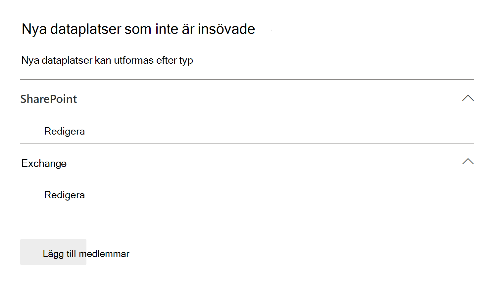
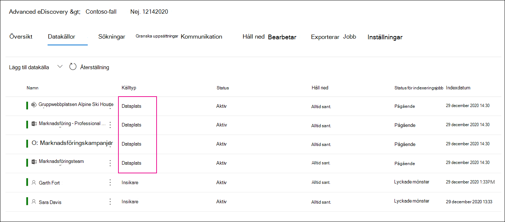
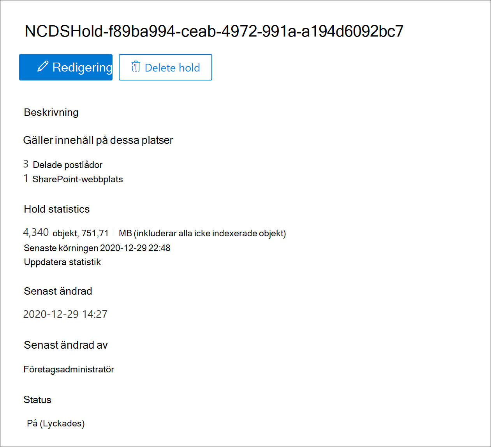

# Lägga till icke-förfallna datakällor i ett Advanced eDiscovery fallAdd non-custodial data sources to an Advanced eDiscovery case

I Advanced eDiscovery fall uppfyller den inte alltid dina behov att associera en Microsoft 365 datakälla med en vårdnadshavare i ärendet.In Advanced eDiscovery cases, it doesn't always meet your needs to associate a Microsoft 365 data source with a custodian in the case. Men du kanske fortfarande behöver koppla dessa data till ett ärende så att du kan söka i dem, lägga till dem i en granskningsuppsättning och analysera och granska dem.But you may still need to associate that data with a case so that you can search it, add it to a review set, and analyze and review it. Funktionen i Advanced eDiscovery kallas *icke-förseningsdatakällor* och gör att du kan lägga till data i ett ärende utan att behöva koppla dem till en vårdnadshavare.The feature in Advanced eDiscovery is called *non-custodial data sources* and lets you add data to a case without having to associate it to a custodian. Det gäller även samma Advanced eDiscovery för icke-sammanhängande data som är tillgängliga för data som är associerade med vårdnadshavare.It also applies the same Advanced eDiscovery functionality to non-custodial data that's available for data associated with custodian. Två av de mest användbara sakerna som du kan använda för icke-uppslagna data är att placera dem i förvaring och bearbeta dem med hjälp av [Avancerad indexering.](indexing-custodian-data.md)Two of the most useful things that you can apply to non-custodial data is placing it on hold and processing it using [Advanced indexing](indexing-custodian-data.md).

## Lägga till en datakälla som inte är i följdAdd a non-custodial data source

Följ dessa steg för att lägga till och hantera icke-förfallna datakällor i Advanced eDiscovery fall.Follow these steps to add and manage non-custodial data sources in an Advanced eDiscovery case.

1. På **Advanced eDiscovery** klickar du på det ärende du vill lägga till data i.On the **Advanced eDiscovery** home page, click the case that you want to add the data to.

2. Klicka på **fliken Datakällor** och sedan på **Lägg till**  >  **datakälla Lägg till dataplatser.**Click the **Data sources** tab and then click **Add data source** > **Add data locations**.

3. På den **utfällliga sidan Nya icke-tilläggsdataplatser** väljer du de datakällor som du vill lägga till för ärendet.On the **New non-custodial data locations** flyout page, choose the data sources that you want to add to the case. Du kan lägga till flera postlådor och webbplatser genom att expandera **avsnitten SharePoint** eller **Exchange** och sedan klicka på **Redigera**.You can add multiple mailboxes and sites by expanding the **SharePoint** or **Exchange** sections and then clicking **Edit**.

   

   - **SharePoint – klicka** på Redigera **för att** lägga till webbplatser.**SharePoint** - Click **Edit** to add sites. Välj en webbplats i listan eller så kan du söka efter en webbplats genom att skriva webbplatsadressen i sökfältet.Select a site in the list or you can search for a site by typing the URL of the site in the search bar. Välj de webbplatser som du vill lägga till som icke-objektande datakällor och klicka på Lägg **till.**Select the sites that you want to add as non-custodian data sources and click **Add**.

   - **Exchange – klicka** på Redigera **för att** lägga till postlådor.**Exchange** - Click **Edit** to add mailboxes. Skriv ett namn eller alias (minst tre tecken) i sökrutan för postlådor eller distributionsgrupper.Type a name or alias (a minimum of three characters) in the search box for mailboxes or distribution groups. Markera de postlådor som du vill lägga till som icke-lika datakällor och klicka på Lägg **till.**Select the mailboxes that you want to add as non-custodian data sources and click **Add**.

   > [!NOTE]
   > Du kan använda **avsnitten SharePoint** och **Exchange** för att lägga till webbplatser och postlådor som är kopplade till en Grupp- eller Yammer-grupp som icke-sammanhängande datakällor.You can use the **SharePoint** and **Exchange** sections to add sites and mailboxes associated with a Team or Yammer group as non-custodial data sources. Du måste separat lägga till postlådan och webbplatsen som är kopplade till en grupp eller Yammer grupp.You have to separately add the mailbox and site associated with a Team or Yammer group.

4. När du lägger till icke-tilläggsdatakällor kan du välja att placera dessa platser som förvaring eller inte.After you add non-custodial data sources, you have the option to place those locations on hold or not. Markera eller avmarkera **kryssrutan Håll** ned bredvid datakällan om du vill markera den som väntande.Select or unselect the **Hold** checkbox next to the data source to place it on hold.

5. Klicka **på** Lägg till längst ned på den utfällliga sidan Nya **icke-förfallna dataplatser** för att lägga till datakällor för ärendet.Click **Add** at the bottom of the **New non-custodial data locations** flyout page to add the data sources to the case.

   Varje icke-ljudande datakälla som du har lagt till visas på **sidan Datakällor.**Each non-custodial data source that you added is listed on the **Data sources** page. Icke-ljudande datakällor identifieras med **värdet för Dataplats** i **kolumnen Källtyp.**Non-custodial data sources are identified by the **Data location** value in the **Source type** column.

   

När du lägger till icke-namngivna datakällor i ärendet skapas ett jobb med namnet  Indexera om *icke-förfallna data* och visas på fliken Jobb för ärendet.After you add non-custodial data sources to the case, a job named *Reindexing non-custodial data* is created and displayed on the **Jobs** tab of the case. När jobbet har skapats indexeras indexeringsprocessen Avancerat i och datakällorna indexeras om.After the job is created, the Advanced indexing process in initiated and the data sources are reindexed.

## Hantera förvaring för datakällor som inte kan innehålla data som inte kan administrerasManage the hold for non-custodial data sources

När du placerar ett ärende i en datakälla som inte är försend med ett dokument skapas automatiskt en princip för förvaring som innehåller de icke-dokumentade datakällorna för ärendet.After you place a hold on a non-custodial data source, a hold policy that contains the non-custodial data sources for the case is automatically created. När du placerar andra icke-uppsagd datakällor i förvaring läggs de till i den här principen för förvaring.When you place other non-custodial data sources on hold, they are added to this hold policy.

1. Öppna Advanced eDiscovery och välj **fliken** Håll ned.Open the Advanced eDiscovery case and select the **Hold** tab.

2. Klicka **på NCDSHold- \<GUID\>**, där GUID-värdet är unikt för ärendet.Click **NCDSHold-\<GUID\>**, where the GUID value is unique to the case.

   På den utfällande sidan visas information och statistik om icke-direktförseliga datakällor som är i förvaring.The flyout page display information and statistics about the non-custodial data sources on hold.

   

3. Klicka **på Redigera** förvaring för att visa de icke-dokumentade datakällor som har satts på is och utföra följande hanteringsuppgifter:Click **Edit hold** to view the non-custodial data sources placed on hold and perform the following management tasks:

   - På sidan **Platser kan** du släppa en icke-ljudande datakälla genom att ta bort den från förvaringen.On the **Locations** page, you can release a non-custodial data source by removing it from the hold. När en datakälla släpps tas inte den icke-förfallna datakällan bort från det aktuella ärendet.Releasing a data source doesn't remove the non-custodial data source from the case. Det här tar bara bort det kvart som lades till i datakällan.It only removes the hold that was placed on the data source.

   - På sidan **Fråga** kan du redigera förvaringen om du vill skapa ett frågebaserat förvarings nekat ärende som tillämpas på alla icke-förfallna datakällor.On the **Query** page, you can edit the hold to create a query-based hold that is applied to all tha non-custodial data sources in the case.
