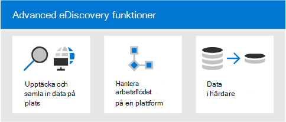
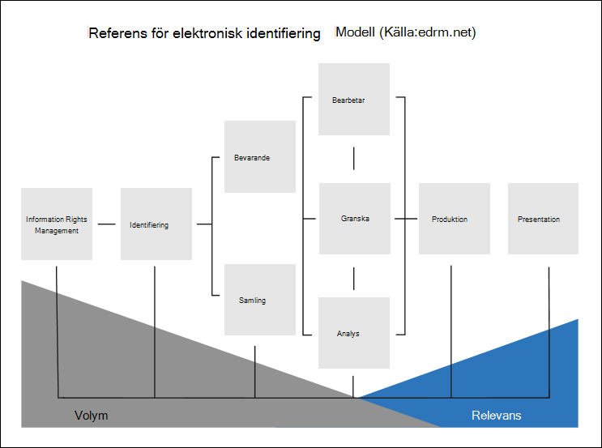
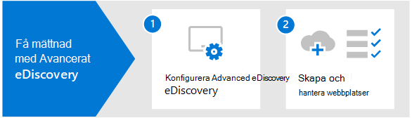
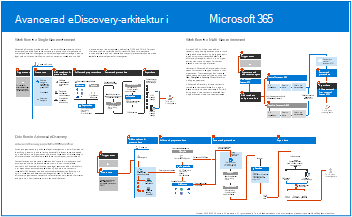

# Översikt över Microsoft 365 Advanced eDiscovery

The Advanced eDiscovery solution in Microsoft 365 builds on the existing Microsoft eDiscovery and analytics capabilities. Advanced eDiscovery ett end-to-end-arbetsflöde för att bevara, samla in, analysera, granska och exportera innehåll som svarar på organisationens interna och externa undersökningar. Det gör också att juridiska grupper kan hantera hela arbetsflödet för aviseringar om juridiska frågor och kommunicera med dokumenter som är inblandade i ett ärende.

## Advanced eDiscovery funktioner

Advanced eDiscovery kan hjälpa din organisation att svara på juridiska frågor eller interna undersökningar genom att upptäcka data där den bor. Du kan smidigt hantera eDiscovery-arbetsflöden genom att identifiera personer av intresse och deras datakällor, smidigt tillämpa innehåll för att bevara data och sedan hantera kommunikationsprocessen för juridiska bevarande. Genom att samla in data från källan kan du söka på live-plattformen Microsoft 365 snabbt hitta det du behöver. Intelligenta maskininlärningsfunktioner som djupindexering, e-posttrådning och nästan dubblettidentifiering hjälper dig också att minska stora mängder data till en relevant datauppsättning.

I följande avsnitt beskrivs hur Advanced eDiscovery funktioner kan hjälpa din organisation.

### Upptäcka och samla in data på plats

Traditionellt kräver organisationer som förlitar sig på flera eDiscovery-lösningar från tredje part stora mängder data från Microsoft 365 för att bearbeta och ha en värd för dubblettdata. En nödvändighet ökar tiden för att hitta relevanta data och risken, kostnaden och komplexiteten i hanteringen av flera lösningar.

Advanced eDiscovery i Microsoft 365 kan du upptäcka data på källan och stanna kvar inom Microsoft 365 säkerhet- och efterlevnadsgränsen.  Genom att samla in data på plats från livesystemet minskar Advanced eDiscovery friktionen med att gå tillbaka till källan och minskar onödigt arbete att hitta innehåll som saknas, vilket ofta händer när journalföringen är fördröjningar i traditionella eDiscovery-lösningar.

Ursprungliga sök- och samlingsfunktioner för data i Teams, Yammer, SharePoint Online, OneDrive för företag och Exchange Online förbättrar ytterligare dataidentifiering. Exempel: Advanced eDiscovery:

- Återskapar Teams konversationer (i stället för att returnera enskilda meddelanden från konversationer).

- Samlar in molnbaserat innehåll som delas med användare med hjälp av länkar eller moderna bifogade filer i e-postmeddelanden Teams chattar.

- Har inbyggt stöd för hundratals Microsoft 365 filtyper.

- Samlar in data från tredjepartskällor (till exempel Bloomberg, Facebook, Slack och Zoomningsmöten) som importeras och arkiveras i Microsoft 365 [av dataanslutningar.](archiving-third-party-data.md)

### Hantera eDiscovery-arbetsflöden på en plattform

Advanced eDiscovery kan hjälpa dig att minska antalet eDiscovery-lösningar du behöver använda. Det är ett effektivt, end-to-end-arbetsflöde, allt som sker Microsoft 365. Advanced eDiscovery hjälper till att minska friktionen genom att identifiera och samla in möjliga källor för relevant information genom att automatiskt mappa unika och delade datakällor till en intressant person (kallas för en *vårdnadshavare)* och genom att tillhandahålla rapportering och analys av potentiellt relevanta data innan du samlar in dem för analys och granskning.

Dessutom kan Microsoft Graph API:er hjälpa dig att automatisera eDiscovery-arbetsflödet och utöka Advanced eDiscovery för anpassade lösningar.

### Data i härdare

Intelligenta maskininlärningsfunktioner i Advanced eDiscovery hjälper dig att minska mängden data som ska granskas. Med de här intelligenta funktionerna kan du minska och ta bort stora mängder data till en relevant uppsättning. En inbyggd granskningsuppsättningsfråga hjälper till exempel bara till att filtrera efter unikt innehåll genom att identifiera nära dubbletter. Den här funktionen kan kraftigt minska mängden data som ska granskas.

Ytterligare maskininlärningsfunktioner kan ytterligare förfina och identifiera relevanta data med hjälp av smarta etiketter och tekniska verktyg för personlig granskning, t.ex. modulerna Relevans.

## Advanced eDiscovery med Electronic Discovery Reference Model

Det inbyggda arbetsflödet i Advanced eDiscovery i Microsoft 365 i linje med eDiscovery-processen som beskrivs i EDRM (Electronic Discovery Reference Model).

(Bildkälla från edrm.net. Källbilden gjordes tillgänglig under Creative Commons Attribution 3.0 Oporterad licens.)

Så här fungerar ett EDRM-Advanced eDiscovery på en hög nivå:

- **Identifiering.** När du har identifierat potentiella personer som är intressanta i en undersökning kan du lägga till dem som vårdnadshavare (kallas även datablade, eftersom de kanske har information som är relevant för undersökningen) i ett Advanced eDiscovery ärende. När användare läggs till som dokument dokument av dokument kan de enkelt bevara, samla in och granska dokument.

- **Bevarande.** Om du vill bevara och skydda data som är relevanta för en undersökning Advanced eDiscovery kan du skapa ett juridiskt bevarande för de datakällor som är associerade med de andre i ett ärende. Du kan också välja att icke-handhållna data ska vara på plats. Advanced eDiscovery har också ett inbyggt arbetsflöde för kommunikation så att du kan skicka juridiska aviseringar till dokumentare och spåra deras bekräftelser.

- **Samling.** När du har identifierat (och bevarat) de datakällor som är relevanta för undersökningen kan du använda det inbyggda sökverktyget i Advanced eDiscovery för att söka efter och samla in livedata från de autentiseringsbaserade datakällor (och, om tillämpligt, icke-historiska datakällor) som kan vara relevanta för ärendet.

- **Bearbetar.** När du har samlat in alla data som är relevanta för ärendet är nästa steg att bearbeta den för vidare granskning och analys. I Advanced eDiscovery kopieras de lokala data som du har identifierat i samlingsfasen till en Azure Storage-plats (kallas granskningsuppsättning), vilket ger dig en statisk vy av ärendedata. 

- **Granska.** När data har lagts till i en granskningsuppsättning kan du visa specifika dokument och köra ytterligare frågor för att minska data till det som är mest relevant för ärendet. Du kan även kommentera och tagga specifika dokument.

- **Analys.** Advanced eDiscovery innehåller ett integrerat analysverktyg som hjälper dig att ytterligare data från granskningsuppsättningen som du anser inte är relevanta för undersökningen. Förutom att minska mängden relevanta data hjälper Advance eDiscovery även dig att spara kostnader för juridisk granskning genom att låta dig ordna innehåll för att göra granskningsprocessen enklare och mer effektiv.

- **Produktion** och **presentation.** När du är klar kan du exportera dokument från en granskningsuppsättning för juridisk granskning. Du kan exportera dokument i deras ursprungliga format eller i ett EDRM-angivet format så att de kan importeras till granskningsprogram från tredje part.

## Prenumerationer och licensiering

För licensiering Advanced eDiscovery krävs rätt organisationsprenumeration och licensiering per användare.

- **Organisationsprenumeration:** För att Advanced eDiscovery i Microsoft 365 efterlevnadscenter måste din organisation ha något av följande:

  - Microsoft 365 E5 eller Office 365 E5-prenumeration
  
  - Microsoft 365 E3-abonnemang med E5-tillägget för efterlevnad

  - Microsoft 365 E3-prenumeration med E5-tillägget eDiscovery och granskning

  - Microsoft 365 Education A5 eller Office 365 Education A5-prenumeration

   Om du inte har ett befintligt Microsoft 365 E5-abonnemang och vill prova Advanced eDiscovery kan du lägga till  [Microsoft 365](https://docs.microsoft.com/office365/admin/try-or-buy-microsoft-365) i din befintliga prenumeration eller registrera dig för en utvärderingsversion av Microsoft 365 E5.

- **Licensiering per användare:** Om du vill lägga till en användare som vårdnadshavare i ett Advance eDiscovery-ärende måste användaren tilldelas någon av följande licenser, beroende på organisationens prenumeration:

  - Microsoft 365: Användarna måste ha tilldelats en Microsoft 365 E5-licens, en tilläggslicens för E5-efterlevnad eller en tilläggslicens för E5 eDiscovery och Audit. Microsoft 365 Education måste ha en A5-licens.

  - Office 365: Användarna måste tilldelas en E5 Office 365 eller en A5 Office 365 Education licens.

   Mer information om hur du tilldelar licenser finns [i Tilldela licenser till användare.](https://docs.microsoft.com/microsoft-365/admin/manage/assign-licenses-to-users)

> [!NOTE]
> Användarna behöver bara en E5- eller A5-licens (eller den lämpliga tilläggslicensen) som ska läggas till som bibliotekare i ett Advanced eDiscovery ärende. IT-administratörer, eDiscovery-hanterare, medarbetare, paralegaler eller medarbetare som använder Advanced eDiscovery för att hantera ärenden och granska ärendedata behöver inte en E5-, A5- eller tilläggslicens.

## Kom igång med Advanced eDiscovery

Det finns två snabba och enkla steg för att komma igång med Advanced eDiscovery.

|Steg  |Beskrivning  |
|:---------|:---------|
|[Konfigurera Advanced eDiscovery](get-started-with-advanced-ediscovery.md)| När du har verifierat prenumerations- och licenskraven kan du tilldela behörigheter och konfigurera organisationsomfattande inställningar för att komma igång med Advanced eDiscovery.|
|[Skapa och hantera ärenden](create-and-manage-advanced-ediscoveryv2-case.md) | Skapa ärenden för att hantera Advanced eDiscovery för alla juridiska och andra typer av undersökningar i organisationen.|
|||

## Advanced eDiscovery arkitektur

Här är ett Advanced eDiscovery-arkitekturdiagram som visar hela arbetsflödet i en enda geomiljö och i en geomiljö med flera objekt, och det end-to-end-dataflöde som är i linje med [EDRM.](#advanced-ediscovery-alignment-with-the-electronic-discovery-reference-model)

[Visa som en bild](../media/solutions-architecture-center/m365-advanced-ediscovery-architecture.png)

[Ladda ned som PDF-fil](https://download.microsoft.com/download/d/1/c/d1ce536d-9bcf-4d31-b75b-fcf0dc560665/m365-advanced-ediscovery-architecture.pdf)

[Ladda ned som Visio fil](https://download.microsoft.com/download/d/1/c/d1ce536d-9bcf-4d31-b75b-fcf0dc560665/m365-advanced-ediscovery-architecture.vsdx)
