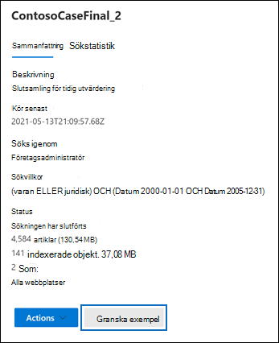
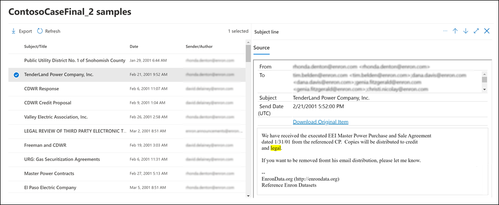

# Förhandsgranska eDiscovery-sökresultaten

När du har kört en innehållssökning eller en sökning som är kopplad till ett Core eDiscovery-ärende kan du förhandsgranska ett exempel på resultaten från sökningen. Genom att förhandsgranska objekten som returneras av sökfrågan kan du avgöra om sökningen returnerar de resultat som du hoppades på eller om du behöver ändra sökfrågan och köra sökningen igen.

Så här gör du för att förhandsgranska resultaten som returneras av en sökning:

1. I Microsoft 365 Efterlevnadscenter går du till sidan Innehållssökning eller till ett Core eDiscovery-ärende.

2. Välj Sök för att visa den utfällbara sidan.

3. Längst ned på den utfällbara sidan klickar du på **Granska exempel**.

   

   En sida visas med ett exempel på sökresultaten.

4. Välj ett objekt om du vill visa dess innehåll i läsfönstret.

   

   Observera att nyckelord från sökfrågan markeras när du förhandsgranskar objekt i föregående skärmbild.

## Hur exempel på sökresultat väljs

Högst 1 000 slumpmässigt valda objekt är tillgängliga att förhandsgranska. Förutom att det finns slumpmässigt valda objekt som är tillgängliga för förhandsgranskning måste de också uppfylla följande villkor:

- Högst 100 objekt från en enskild innehållsplats (en postlåda eller en webbplats) kan förhandsgranskas. Det innebär att det kan finnas färre än 1 000 objekt tillgängliga för förhandsgranskning. Om du till exempel söker i fyra postlådor och sökningen returnerar 1 500 uppskattade objekt kommer bara 400 att vara tillgängliga för förhandsgranskning eftersom bara 100 objekt från varje postlåda kan förhandsgranskas.

- För postlådeobjekt är endast e-postmeddelanden tillgängliga att förhandsgranska. Objekt som uppgifter, kalenderobjekt och kontakter kan inte förhandsgranskas.

- För webbplatsobjekt är endast dokument tillgängliga att förhandsgranska. Det går inte att förhandsgranska objekt som mappar, listor eller bifogade filer i listor.

## Filtyper som stöds vid förhandsgranskning av sökresultaten

Du kan förhandsgranska de filtyper som stöds i förhandsgranskningsfönstret. Om filtypen inte stöds måste du ladda ned en kopia av filen till den lokala datorn (klicka på **Ladda ned originalobjektet**). För ASPX-webbsidor ingår URL-adressen för sidan, men du kanske inte har behörighet att komma åt sidan. Icke indexerade objekt inte är tillgängliga för förhandsgranskning.

Följande filtyper stöds och kan förhandsgranskas i sökresultatfönstret.
  
- .txt, .html, .mhtml

- .eml

- .doc, .docx, .docm

- .pptm, .pptx

- .pdf

Följande filbehållartyper stöds också. Du kan visa listan med filer i behållaren i förhandsgranskningsfönstret.
  
- .zip

- .gzip