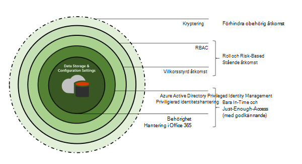
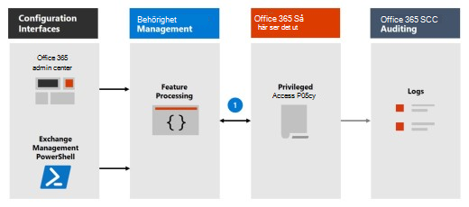

# Lär dig mer om privilegierad åtkomsthanteringLearn about privileged access management

Med hantering av behörighetsbehörighet kan du få detaljerad åtkomstkontroll över administrativa uppgifter med Office 365.Privileged access management allows granular access control over privileged admin tasks in Office 365. Det kan skydda organisationen från överträdelser som använder befintliga administratörskonton för privilegierad behörighet med stående åtkomst till känsliga data eller åtkomst till viktiga konfigurationsinställningar.It can help protect your organization from breaches that use existing privileged admin accounts with standing access to sensitive data or access to critical configuration settings. Hantering av behörighet kräver att användare begär snabb åtkomst för att slutföra uppgifter med förhöjd och privilegierad behörighet via ett arbetsflöde med mycket begränsad och tidsbunden behörighet.Privileged access management requires users to request just-in-time access to complete elevated and privileged tasks through a highly scoped and time-bounded approval workflow. Den här konfigurationen ger användarna precis tillräckligt många åtkomst för att utföra den tillgängliga uppgiften, utan att riskera exponering av känsliga data eller viktiga konfigurationsinställningar.This configuration gives users just-enough-access to perform the task at hand, without risking exposure of sensitive data or critical configuration settings. Genom att aktivera hantering av Microsoft 365 åtkomst i Microsoft 365 kan organisationen arbeta utan några stående behörigheter och skydda sig mot säkerhetsproblem av administrativ åtkomst.Enabling privileged access management in Microsoft 365 allows your organization to operate with zero standing privileges and provide a layer of defense against standing administrative access vulnerabilities.

En snabb översikt över det integrerade Customer Lockbox-arbetsflödet och arbetsflödet för behörighetshantering finns i den här video om Customer Lockbox och [behörighetshantering för åtkomst.](https://go.microsoft.com/fwlink/?linkid=2066800)For a quick overview of the integrated Customer Lockbox and privileged access management workflow, see this [Customer Lockbox and privileged access management video](https://go.microsoft.com/fwlink/?linkid=2066800).

## SkyddslagerLayers of protection

Hantering av privilegierad åtkomst kompletterar andra data- och åtkomstfunktionsskydd i den Microsoft 365 säkerhetsarkitekturen.Privileged access management complements other data and access feature protections within the Microsoft 365 security architecture. Att ta med hantering av privilegierad åtkomst som en del av en integrerad och lagerberoende metod för säkerhet ger en säkerhetsmodell som maximerar skyddet av känslig information Microsoft 365 konfigurationsinställningar.Including privileged access management as part of an integrated and layered approach to security provides a security model that maximizes protection of sensitive information and Microsoft 365 configuration settings. Som visas i diagrammet bygger hantering av privilegierad åtkomst på skyddet som tillhandahålls med inbyggd kryptering av Microsoft 365-data och den rollbaserade säkerhetsmodellen för åtkomstkontroll Microsoft 365 tjänster.As shown in the diagram, privileged access management builds on the protection provided with native encryption of Microsoft 365 data and the role-based access control security model of Microsoft 365 services. När de används [med Azure AD Privileged Identity Management](/azure/active-directory/active-directory-privileged-identity-management-configure)ger de här två funktionerna åtkomstkontroll med direktåtkomst i olika omfattningar.When used with [Azure AD Privileged Identity Management](/azure/active-directory/active-directory-privileged-identity-management-configure), these two features provide access control with just-in-time access at different scopes.

Hantering av privilegierad åtkomst definieras och omfattas på aktivitetsnivå, medan Azure AD Privileged Identity Management tillämpar skydd på **rollnivå** med möjlighet att köra flera aktiviteter. Privileged access management is defined and scoped at the **task** level, while Azure AD Privileged Identity Management applies protection at the **role** level with the ability to execute multiple tasks. Med Azure AD Privileged Identity Management det främst åtkomst för AD-roller och rollgrupper, medan hantering av privilegierad åtkomst i Microsoft 365 endast gäller på aktivitetsnivå.Azure AD Privileged Identity Management primarily allows managing accesses for AD roles and role groups, while privileged access management in Microsoft 365 applies only at the task level.

- **Aktivera hantering av behörighet när du redan använder Azure AD-Privileged Identity Management:** Genom att lägga till hantering av privilegierad åtkomst får du en annan detaljerad skyddsnivå och granskningsfunktioner för behörighet att Microsoft 365 data.**Enabling privileged access management while already using Azure AD Privileged Identity Management:** Adding privileged access management provides another granular layer of protection and audit capabilities for privileged access to Microsoft 365 data.

- **Aktivera Azure AD-Privileged Identity Management medan du redan använder hantering av privilegierad åtkomst i Office 365:**  Om du lägger till Azure AD Privileged Identity Management till hantering av privilegierad åtkomst kan du utöka behörigheten till data utanför Microsoft 365 som främst definieras av användarroller eller identitet.**Enabling Azure AD Privileged Identity Management while already using privileged access management in Office 365:**  Adding Azure AD Privileged Identity Management to privileged access management can extend privileged access to data outside of Microsoft 365 that's primarily defined by user roles or identity.  

## Arkitektur och processflöde för behörighetshanteringPrivileged access management architecture and process flow

Vart och ett av följande processflöden sammanfattar arkitekturen för privilegierad åtkomst och hur den interagerar med Microsoft 365, granskning och Exchange Management-körningen.Each of the following process flows outline the architecture of privileged access and how it interacts with the Microsoft 365 substrate, auditing, and the Exchange Management runspace.

### Steg 1: Konfigurera en princip för privilegierad åtkomstStep 1: Configure a privileged access policy

När du konfigurerar en princip för behörighetsbehörighet i [administrationscentret för Microsoft 365](https://admin.microsoft.com) eller Exchange Management PowerShell definierar du principen och funktionsprocesserna för behörighetsåtkomst och principattributen i Microsoft 365-administratören.When you configure a privileged access policy with the [Microsoft 365 admin center](https://admin.microsoft.com) or the Exchange Management PowerShell, you define the policy and the privileged access feature processes and the policy attributes in the Microsoft 365 substrate. Aktiviteterna loggas i &amp; Säkerhetsefterlevnadscenter.The activities are logged in the Security &amp; Compliance Center. Principen är nu aktiverad och redo att hantera inkommande förfrågningar om godkännanden.The policy is now enabled and ready to handle incoming requests for approvals.

### Steg 2: ÅtkomstbegäranStep 2: Access request

I Microsoft 365 [eller med PowerShell](https://admin.microsoft.com) för Exchange-hantering kan användarna begära åtkomst till uppgifter med förhöjd behörighet eller behörighet.In the [Microsoft 365 admin center](https://admin.microsoft.com) or with the Exchange Management PowerShell, users can request access to elevated or privileged tasks. Funktionen behörig åtkomst skickar begäran till användaren Microsoft 365 för bearbetning mot principen för konfigurerad behörighetsåtkomst och registrerar aktiviteten i loggarna för &amp; säkerhetsefterlevnadscenter.The privileged access feature sends the request to the Microsoft 365 substrate for processing against the configured privilege access policy and records the Activity in the Security &amp; Compliance Center logs.

### Steg 3: ÅtkomstgodkännandeStep 3: Access approval

En begäran om godkännande skapas och meddelandet om väntande begäran skickas till godkännare via e-post.An approval request is generated and the pending request notification is emailed to approvers. Om den godkänns bearbetas begäran om behörighet och uppgiften är klar att slutföras.If approved, the privileged access request is processed as an approval and the task is ready to be completed. Om du nekas blockeras uppgiften och ingen åtkomst ges till beställaren.If denied, the task is blocked and no access is granted to the requestor. Beställaren meddelas om begärans godkännande eller av nekande via e-postmeddelande.The requestor is notified of the request approval or denial via email message.

### Steg 4: Access-bearbetningStep 4: Access processing

För en godkänd begäran bearbetas aktiviteten av Exchange Management Runspace.For an approved request, the task is processed by the Exchange Management runspace. Godkännandet kontrolleras mot principen för behörighetsåtkomst och bearbetas av Microsoft 365 den.The approval is checked against the privileged access policy and processed by the Microsoft 365 substrate. All aktivitet för uppgiften loggas i &amp; Säkerhetsefterlevnadscenter.All activity for the task is logged in the Security &amp; Compliance Center.

## Vanliga frågor och svarFrequently asked questions

### Vilka SKU:er kan använda behörighet i Office 365?What SKUs can use privileged access in Office 365?

Hantering av privilegierad åtkomst är tillgänglig för kunder med ett brett Microsoft 365 och Office 365 och tillägg.Privileged access management is available for customers for a wide selection of Microsoft 365 and Office 365 subscriptions and add-ons. Mer [information finns i Komma igång med hantering av privilegierad](privileged-access-management-configuration.md) åtkomst.See [Get started with privileged access management](privileged-access-management-configuration.md) for details.

### När har behörighet stöd för Office 365 arbetsbelastning utöver Exchange?When will privileged access support Office 365 workloads beyond Exchange?

Hantering av privilegierad åtkomst blir tillgänglig i Office 365 arbetsbelastningar snart.Privileged access management will be available in other Office 365 workloads soon. Gå till [Microsoft 365 översikt](https://www.microsoft.com/microsoft-365/roadmap) för mer information.Visit the [Microsoft 365 Roadmap](https://www.microsoft.com/microsoft-365/roadmap) for more details.

### Min organisation behöver mer än 30 principer för behörighetsåtkomst, kommer den här gränsen att ökas?My organization needs more than 30 privileged access policies, will this limit be increased?

Ja, det finns en översikt över funktioner att höja den aktuella gränsen på 30 behöriga åtkomstprinciper per organisation.Yes, raising the current limit of 30 privileged access policies per organization is on the feature roadmap.

### Måste jag vara global administratör för att hantera behörighet i Office 365?Do I need to be a Global Admin to manage privileged access in Office 365?

Nej, du behöver rollen Exchange rollhantering tilldelad till konton som hanterar privilegierad åtkomst i Office 365.No, you need the Exchange Role Management role assigned to accounts that manage privileged access in Office 365. Om du inte vill konfigurera rollhanteringsrollen som en fristående kontobehörighet, innehåller rollen Global administratör den här rollen som standard och kan hantera behörighet.If you don't want to configure the Role Management role as a stand-alone account permission, the Global Administrator role includes this role by default and can manage privileged access. Användare som ingår i en godkännaregrupp behöver inte vara globala administratörer eller ha rollhanteringsrollen tilldelad till att granska och godkänna förfrågningar med PowerShell.Users included in an approvers' group don't need to be a Global Admin or have the Role Management role assigned to review and approve requests with PowerShell.

### Hur är hantering av privilegierad åtkomst relaterad till Customer Lockbox?How is privileged access management related to Customer Lockbox?

[Customer Lockbox](/office365/admin/manage/customer-lockbox-requests) ger en nivå av åtkomstkontroll för organisationer när Microsoft har åtkomst till data.[Customer Lockbox](/office365/admin/manage/customer-lockbox-requests) allows a level of access control for organizations when Microsoft accesses data. Med hantering av behörighetsbehörigheter får du en detaljerad åtkomstkontroll inom en organisation för Microsoft 365 aktiviteter med behörighet.Privileged access management allows granular access control within an organization for all Microsoft 365 privileged tasks.

## Är du redo att börja?Ready to get started?

Börja [konfigurera organisationen för hantering av privilegierad åtkomst.](privileged-access-management-configuration.md)Start [configuring your organization for privileged access management](privileged-access-management-configuration.md).

## Mer informationLearn more

[Interaktiv guide: Övervaka och kontrollera administratörsuppgifter med behörighetshanteringInteractive guide: Monitor and control administrator tasks with privileged access management](https://content.cloudguides.com/guides/Privileged%20Access%20Management)
