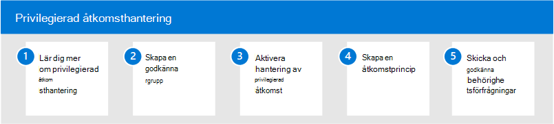

# Hantering av behörighet i Microsoft 365Privileged access management in Microsoft 365

Att vissa användare har stående åtkomst till känslig information eller viktiga nätverkskonfigurationsinställningar i Microsoft Exchange Online är en möjlig väg för komprometterade konton eller interna hotaktiviteter.Having standing access by some users to sensitive information or critical network configuration settings in Microsoft Exchange Online is a potential pathway for compromised accounts or internal threat activities. Hantering av privilegierad åtkomst hjälper till att skydda organisationen från överträdelser och hjälper dig att uppfylla metodtips för efterlevnad genom att begränsa stående åtkomst till känsliga data eller åtkomst till viktiga konfigurationsinställningar.Privileged access management helps protect your organization from breaches and helps to meet compliance best practices by limiting standing access to sensitive data or access to critical configuration settings. I stället för att administratörer har konstant åtkomst implementeras direktåtkomstregler för aktiviteter som behöver förhöjda behörigheter.Instead of administrators having constant access, just-in-time access rules are implemented for tasks that need elevated permissions. Genom att aktivera hantering av privilegierad åtkomst för Exchange Online i Microsoft 365 kan organisationen arbeta utan några stående behörigheter och tillhandahålla ett skyddslager mot säkerhetsproblem av administrativ åtkomst.Enabling privileged access management for Exchange Online in Microsoft 365 allows your organization to operate with zero standing privileges and provide a layer of defense against standing administrative access vulnerabilities.

## Konfigurera hantering av behörighet för Microsoft 365Configure privileged access management for Microsoft 365

Använd följande steg för att konfigurera hantering av behörighet för din organisation:Use the following steps to configure privileged access management for your organization:

1. Läs mer om [hantering av privilegierad](privileged-access-management-overview.md) åtkomst i Microsoft 365Learn about [privileged access management](privileged-access-management-overview.md) in Microsoft 365
2. Skapa en [godkännaresgrupp](privileged-access-management-configuration.md#step-1-create-an-approvers-group)Create an [approver's group](privileged-access-management-configuration.md#step-1-create-an-approvers-group)
3. Aktivera [hantering av privilegierad åtkomst](privileged-access-management-configuration.md#step-2-enable-privileged-access)Enable [privileged access management](privileged-access-management-configuration.md#step-2-enable-privileged-access)
4. Skapa en [åtkomstprincip](privileged-access-management-configuration.md#step-3-create-an-access-policy)Create an [access policy](privileged-access-management-configuration.md#step-3-create-an-access-policy)
5. Skicka/godkänna [behörighetsförfrågningar](privileged-access-management-configuration.md#step-4-submitapprove-privileged-access-requests)Submit/approve [privileged access requests](privileged-access-management-configuration.md#step-4-submitapprove-privileged-access-requests)

## Mer information om hantering av privilegierad åtkomstMore information about privileged access management

- [Vanliga frågor och svar om hantering av privilegierad åtkomstFrequently asked questions about privileged access management](privileged-access-management-overview.md#frequently-asked-questions)