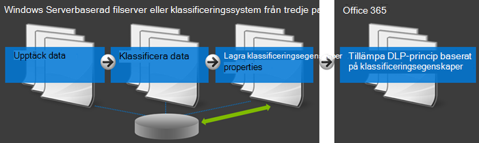
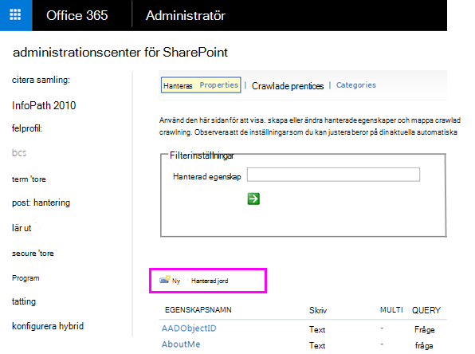
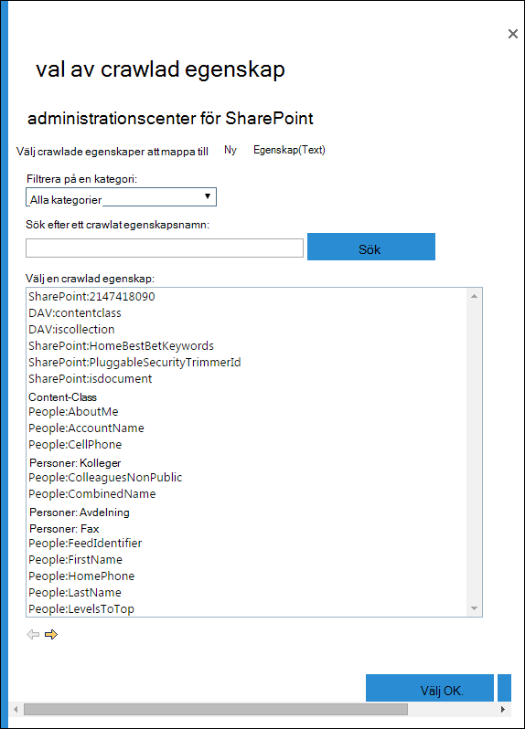
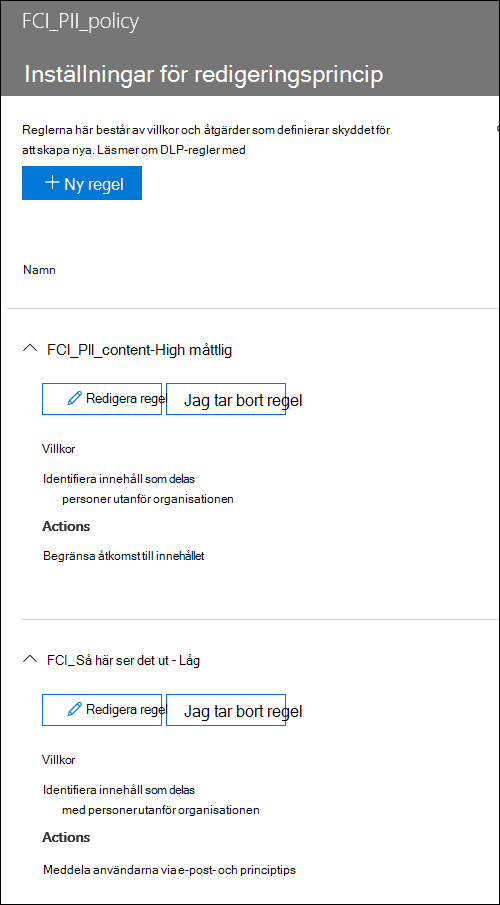

# <a name="create-a-dlp-policy-to-protect-documents-with-fci-or-other-properties"></a>Skapa en DLP-princip för att skydda dokument med FCI eller andra egenskaper

Microsoft 365 dataförlustskyddsprinciper (DLP) kan använda klassificeringsegenskaper eller objektegenskaper för att identifiera känsliga objekt. Du kan till exempel använda:

- Windows FCI-egenskaper (Server File Classification infrastructure)
- SharePoint dokumentegenskaper
- Dokumentegenskaper för system från tredje part



Din organisation kan till exempel använda Windows Server FCI för att identifiera objekt med personuppgifter som personnummer och sedan klassificera dokumentet genom att sätta egenskapen Personligt identifierbar **information** till **Hög,** Måttlig **,** **Låg,** Offentlig eller Inte **PERSONLIG** INFORMATION baserat på typ och antal förekomster av personuppgifter i dokumentet.

I Microsoft 365 kan du skapa en DLP-princip som identifierar dokument där egenskapen är  inställd på specifika värden, till exempel Hög och **Medel,** och sedan vidtar en åtgärd som blockerar åtkomsten till filerna. Samma princip kan ha en annan regel som vidtar en annan åtgärd om egenskapen är inställd på **Låg**, till exempel att skicka ett e-postmeddelande. På så sätt integreras DLP med Windows Server FCI och kan skydda Office-dokument som överförs eller delas till Microsoft 365 från Windows serverbaserade filservrar.

En DLP-princip söker bara efter ett visst egenskapsnamn/värdepar. Alla dokumentegenskaper kan användas, så länge egenskapen har en motsvarande hanterad egenskap för SharePoint sökning. En webbplatssamling SharePoint till exempel använda en innehållstyp som heter **Reserapport** med ett obligatoriskt fält med namnet **Kund.** När en person skapar en reserapport måste personen ange kundnamnet. Det här egenskapsnamnet/värdeparet kan också användas i en DLP-princip , till exempel om  du vill ha en regel som blockerar åtkomst till dokumentet för gäster när fältet Kund innehåller **Contoso.**

Om du vill tillämpa DLP-principen på innehåll med specifika Microsoft 365 ska du inte följa anvisningarna här. Lär dig i stället hur du [använder en bevarandeetikett som ett villkor i en DLP-princip.](data-loss-prevention-policies.md#using-a-retention-label-as-a-condition-in-a-dlp-policy)

## <a name="before-you-create-the-dlp-policy"></a>Innan du skapar DLP-principen

Innan du kan använda en FCI Windows serveregenskap eller någon annan egenskap i en DLP-princip måste du skapa en hanterad egenskap SharePoint administrationscentret. Det är därför du gör så här.

I SharePoint Online OneDrive för företag sökindexet byggs upp genom crawlning av innehållet på dina webbplatser. Crawlern hämtar innehåll och metadata från dokumenten i de crawlade egenskaperna. Sökschemat hjälper crawlern att avgöra vilket innehåll och vilka metadata som ska hämtas. Exempel på metadata är författaren och titeln på ett dokument. Men för att hämta innehåll och metadata från dokumenten till sökindexet måste de crawlade egenskaperna mappas till hanterade egenskaper. Endast hanterade egenskaper behålls i indexet. Till exempel mappas en crawlad egenskap relaterad till författaren till en hanterad egenskap relaterad till författaren.

> [!NOTE]
> Se till att du använder ett hanterat egenskapsnamn och inte ett crawlat egenskapsnamn när du skapar DLP-regler med `ContentPropertyContainsWords` villkoret.

Detta är viktigt eftersom DLP använder sök crawlern för att identifiera och klassificera känslig information på webbplatserna och sedan lagra känslig information i en säker del av sökindexet. När du överför ett dokument Office 365 SharePoint automatiskt crawlade egenskaper baserat på dokumentegenskaperna. Men om du vill använda ett FCI eller någon annan egenskap i en DLP-princip måste den crawlade egenskapen mappas till en hanterad egenskap så att innehållet med den egenskapen behålls i indexet.

Mer information om sök och hanterade egenskaper finns i [Hantera sökschemat i SharePoint Online.](/sharepoint/manage-search-schema)

### <a name="step-1-upload-a-document-with-the-needed-property-to-office-365"></a>Steg 1: Upload ett dokument med den nödvändiga egenskapen för att Office 365

Först måste du ladda upp ett dokument med den egenskap som du vill referera till i DLP-principen. Microsoft 365 identifierar egenskapen och skapar automatiskt en crawlad egenskap från den. I nästa steg ska du skapa en hanterad egenskap och sedan mappa den hanterade egenskapen till den här crawlade egenskapen.

### <a name="step-2-create-a-managed-property"></a>Steg 2: Skapa en hanterad egenskap

1. Logga in på administrationscentret för Microsoft 365.

2. I det vänstra navigeringsfältet väljer **du Administrationscenter** \> **SharePoint**. Nu är du i SharePoint administrationscenter.

3. I det vänstra navigeringsfältet **väljer du** Sök \> på **sökadministrationssidan** \> **Hantera sökschema**.

   

4. Ny **hanterad egenskap** \> **på sidan Hanterade egenskaper.**

   

5. Ange ett namn och en beskrivning för egenskapen. Det här namnet visas i DLP-principerna.

6. Under **Typ** väljer du **Text**.

7. Under **Huvudegenskaper** väljer du **Fråge- och** **hämtningsbar**.

8. Under **Mappningar till crawlade egenskaper Lägg** till en \> **mappning**.

9. I dialogrutan för val av **crawlad** egenskap söker du efter och väljer den crawlade egenskap som motsvarar den FCI-egenskap för Windows Server eller någon annan egenskap som du använder i \> DLP-principens \> **OK.**

   

10. Längst ned på sidan \> **OK.**

## <a name="create-a-dlp-policy-that-uses-an-fci-property-or-other-property"></a>Skapa en DLP-princip som använder en FCI-egenskap eller en annan egenskap

I det här exemplet använder organisationen FCI på sina Windows serverbaserade filservrar. de använder specifikt FCI-klassificeringsegenskapen Personally **Identifiable Information** med möjliga värden för **Hög,** **Måttlig,** **Låg,** **Offentlig** och **Inte PII.** Nu vill de använda sin befintliga FCI-klassificering i sina DLP-principer i Office 365.

Först följer de stegen ovan för att skapa en hanterad egenskap i SharePoint Online som mappas till den crawlade egenskapen som skapas automatiskt från FCI-egenskapen.

Sedan skapar de en DLP-princip med två regler som båda använder **villkorsdokumentegenskaperna och som innehåller något av följande värden:**

- **FCI PII-innehåll – Hög, Måttlig** Den första regeln begränsar åtkomsten till dokumentet om FCI-klassificeringsegenskapen Personligt identifierbar **information** är lika med Hög eller Måttlig och dokumentet delas med personer utanför organisationen.  

- **FCI PII-innehåll – låg** Den andra regeln skickar ett meddelande till dokumentets ägare om FCI-klassificeringsegenskapen Personligt identifierbar **information** är lika med **Låg** och dokumentet delas med personer utanför organisationen.

### <a name="create-the-dlp-policy-by-using-powershell"></a>Skapa DLP-principen med hjälp av PowerShell

**Villkorsdokumentegenskaperna innehåller** något av dessa värden är tillfälligt inte tillgängligt i användargränssnittet i Säkerhetsefterlevnadscenter, men du kan fortfarande använda det här villkoret med &amp; hjälp av PowerShell. Du kan använda cmdlet:arna när du arbetar med en DLP-princip och använda `New\Set\Get-DlpCompliancePolicy` cmdlet:arna med parametern till att lägga till villkoret Dokumentegenskaper som innehåller `New\Set\Get-DlpComplianceRule` något av dessa `ContentPropertyContainsWords` **värden.**

Mer information om dessa cmdlets finns i [ &amp; Cmdlets för Säkerhetsefterlevnadscenter.](/powershell/exchange/exchange-online-powershell)

1. [Anslut till &amp; Säkerhetsefterlevnadscenter med fjärr-PowerShell](/powershell/exchange/connect-to-scc-powershell)

2. Skapa principen med hjälp av  `New-DlpCompliancePolicy` .

Det här PowerShell skapar en DLP-princip som gäller för alla platser.

   ```powershell
   New-DlpCompliancePolicy -Name FCI_PII_policy -ExchangeLocation All -SharePointLocation All -OneDriveLocation All -Mode Enable
   ```

3. Skapa de två regler som beskrivs ovan med hjälp av , där en regel är för värdet Låg och en annan är för `New-DlpComplianceRule` **värdena Hög** och **Måttlig.** 

   Här är ett PowerShell-exempel som skapar dessa två regler. Egenskapsnamn/värdepar omges av citattecken och ett egenskapsnamn kan ange flera värden avgränsade med kommatecken utan blanksteg, som  `"<Property1>:<Value1>,<Value2>","<Property2>:<Value3>,<Value4>"....`

   ```powershell
   New-DlpComplianceRule -Name FCI_PII_content-High,Moderate -Policy FCI_PII_policy -AccessScope NotInOrganization -BlockAccess $true -ContentPropertyContainsWords "Personally Identifiable Information:High,Moderate" -Disabled $falseNew-DlpComplianceRule -Name FCI_PII_content-Low -Policy FCI_PII_policy -AccessScope NotInOrganization -BlockAccess $false -ContentPropertyContainsWords "Personally Identifiable Information:Low" -Disabled $false -NotifyUser Owner
   ```

   Windows Server FCI innehåller många inbyggda egenskaper, bland annat **Personligt identifierbar information** som används i det här exemplet. De möjliga värdena för varje egenskap kan vara olika för varje organisation. Värdena **Hög,** **Måttlig** och **Låg som** används här är bara ett exempel. För din organisation kan du visa FCI-klassificeringsegenskaper för Windows Server med möjliga värden i filen Serverresurshanteraren på den Windows serverbaserade filservern. Mer information finns i Skapa [en klassificeringsegenskap](/previous-versions/windows/it-pro/windows-server-2008-R2-and-2008/dd759215(v=ws.11)).

När du är klar bör principen ha två nya regler som båda använder **dokumentegenskaperna som innehåller något av dessa värdevillkor.** Det här villkoret visas inte i användargränssnittet, men andra villkor, åtgärder och inställningar visas.

En regel blockerar åtkomst till innehåll där egenskapen **Personligt identifierbar information** är lika med **Hög eller** **Måttlig.** En andra regel skickar ett meddelande om innehåll där egenskapen **Personligt** identifierbar information är lika med **Låg.**



## <a name="after-you-create-the-dlp-policy"></a>När du har skapat DLP-principen

Om du utför stegen i föregående avsnitt skapas en DLP-princip som snabbt identifierar innehåll med den egenskapen, men bara om innehållet nyligen överförs (så att innehållet indexeras) eller om innehållet är gammalt men bara redigeras (så att innehållet indexeras om).

Om du vill identifiera innehåll med den egenskapen överallt kanske du manuellt vill begära att biblioteket, webbplatsen eller webbplatssamlingen indexeras om, så att DLP-principen är medveten om allt innehåll med den egenskapen. I SharePoint Online crawlas innehåll automatiskt enligt ett definierat crawlningsschema. Crawlern hämtar innehåll som har ändrats sedan den senaste crawlningen och uppdaterar indexet. Om du behöver din DLP-princip för att skydda innehåll före nästa schemalagda crawlning kan du vidta följande åtgärder.

> [!CAUTION]
> När du indexerar om en webbplats kan det bli en enorm belastning på söksystemet. Indexera inte om webbplatsen om det inte är absolut nödvändigt i ditt scenario.

Mer information finns i [Manuellt begära crawlning och omindexering av en webbplats, ett bibliotek eller en lista](/sharepoint/crawl-site-content).

### <a name="reindex-a-site-optional"></a>Indexera om en webbplats (valfritt)

1. På webbplatsen väljer du **Inställningar** (kugghjulsikonen i det övre högra hörnet) \> **Inställningar**.

2. Under **Sök** väljer du **Indexera om webbplatsens** \> **sök- och offlinetillgänglighet.**

## <a name="more-information"></a>Mer information

- [Mer information om skydd mot dataförlust](dlp-learn-about-dlp.md)

- [Skapa en DLP-princip från en mall](create-a-dlp-policy-from-a-template.md)

- [Skicka meddelanden och visa principtips för DLP-principer](use-notifications-and-policy-tips.md)

- [Det här innehåller DLP-principmallarna](what-the-dlp-policy-templates-include.md)

- [Entitetsdefinitioner för typer av känslig information](sensitive-information-type-entity-definitions.md)