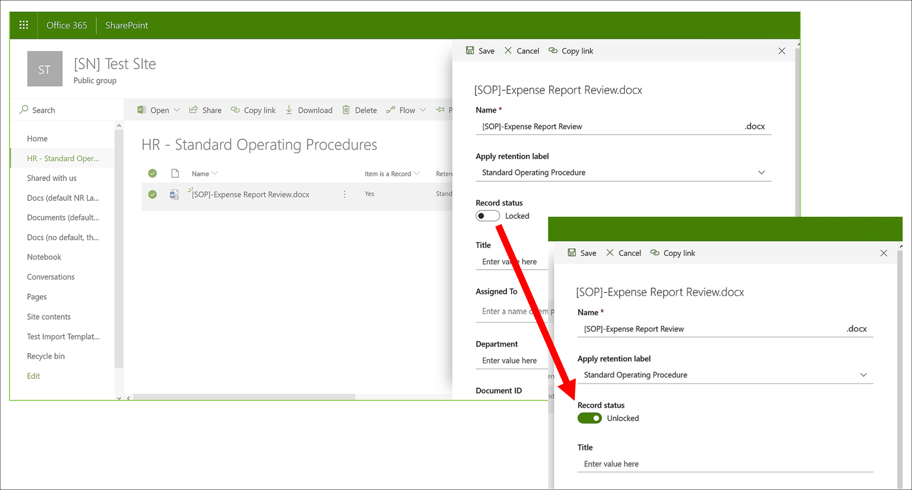
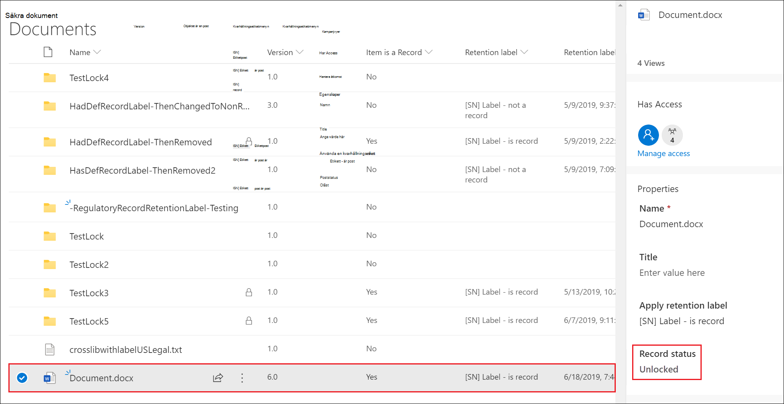
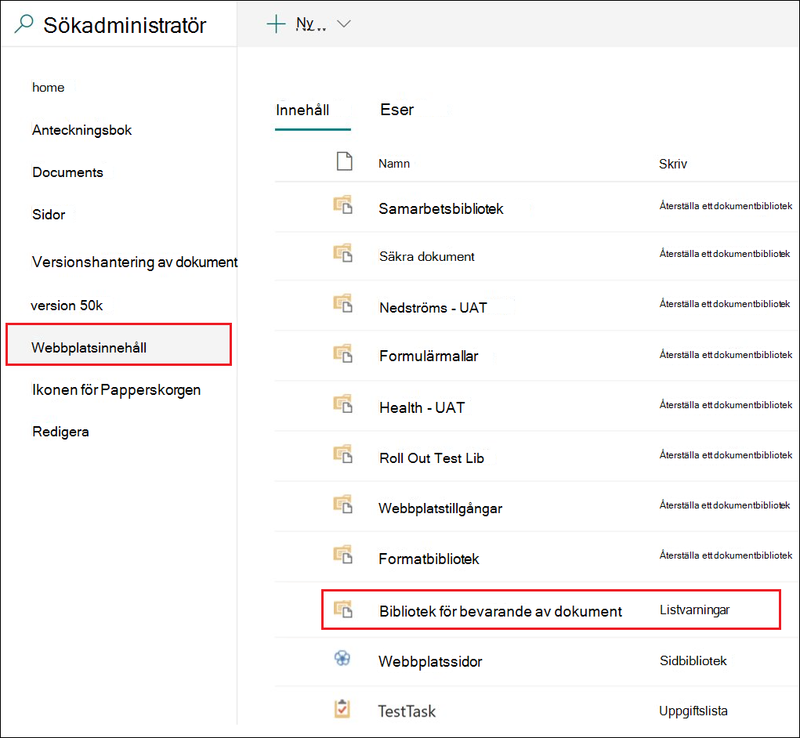
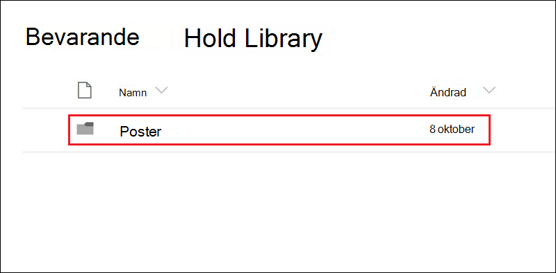

# Använd versionshantering för att uppdatera arkivhandlingar som lagras i SharePoint eller OneDriveUse record versioning to update records stored in SharePoint or OneDrive

>*[Vägledning för säkerhet och efterlevnad med licensiering i Microsoft 365](/office365/servicedescriptions/microsoft-365-service-descriptions/microsoft-365-tenantlevel-services-licensing-guidance/microsoft-365-security-compliance-licensing-guidance).**[Microsoft 365 licensing guidance for security & compliance](/office365/servicedescriptions/microsoft-365-service-descriptions/microsoft-365-tenantlevel-services-licensing-guidance/microsoft-365-security-compliance-licensing-guidance).*

>[!NOTE] 
> Eftersom regelbaserade arkivhandlingar blockerar redigering är inte versionshantering tillgänglig för regelbaserade arkivhandlingar.Because regulatory records block editing, record versioning is not available for regulatory records.

Möjligheten att markera ett dokument som en [arkivhandling](records-management.md#records) och begränsa åtgärder som kan utföras för den är ett viktigt mål för alla lösningar för hantering av arkivhandlingar.The ability to mark a document as a [record](records-management.md#records) and restrict actions that can be performed on the record is an essential goal for any records management solution. Dock kan det även behövas samarbete för att skapa senare versioner.However, collaboration might also be needed for people to create subsequent versions.

Du kan till exempel markera ett säljavtal som en arkivhandling, men sedan måste du uppdatera avtalet med nya villkor och markera den senaste versionen som en ny arkivhandling samtidigt som du behåller den tidigare versionen.For example, you might mark a sales contract as a record, but then need to update the contract with new terms and mark the latest version as a new record while still retaining the previous record version. För de här typerna av scenarier har SharePoint och OneDrive stöd för *versionshantering av arkivhandlingar*.For these types of scenarios, SharePoint and OneDrive support *record versioning*. Mappar i OneNote-anteckningsböcker har inte stöd för versionshantering av arkivhandlingar.OneNote notebook folders don't support record versioning.

Om du vill använda versionshantering för arkivhandlingar [namnger du först dokumentet och markerar det som en arkivhandling](declare-records.md).To use record versioning, you first [label the document and mark it as a record](declare-records.md). I det här skedet visas en dokumentegenskap som kallas *Arkivhandlingsstatus* bredvid bevarandeetiketten och den första statusen är **Låst**.At this point, a document property, called *Record status* is displayed next to the retention label, and the initial record status is **Locked**. 

Nu kan du göra följande:You can now do the following things:

  - **Redigera kontinuerligt och behåll enskilda versioner av dokumentet som arkivhandlingar genom att låsa upp och låsa egenskapen Arkivhandlingsstatus.****Continually edit and retain individual versions of the document as records, by unlocking and locking the Record status property.** Endast när egenskapen **Arkivhandlingsstatus** är inställd på **Låst** kan en ny version av arkivhandlingen behållas.Only when the **Record status** property is set to **Locked** is a new version of the record retained. Genom att växla mellan låsta och olåsta dokument minskar risken att onödiga versioner och kopior behålls av dokumentet.This toggle of locked and unlocked reduces the risk of retaining unnecessary versions and copies of the document.

  - **Lagra arkivhandlingarna automatiskt i en lagringsplats för arkivhandlingar på plats inom webbplatssamlingen.****Have the records automatically stored in an in-place records repository located within the site collection.** Varje webbplatssamling i SharePoint och OneDrive bevarar innehållet i sitt bibliotek för bevarande av dokument.Each site collection in SharePoint and OneDrive preserves content in its Preservation Hold library. Arkivhandlingsversioner lagras i mappen Arkivhandlingar i det här biblioteket.Record versions are stored in the Records folder in this library.

  - **Bevara ett evighetsdokument som innehåller alla versioner.****Maintain an evergreen document that contains all versions.** Som standard har varje SharePoint- och OneDrive-dokument en versionshistorik tillgänglig på objektmenyn.By default, each SharePoint and OneDrive document has a version history available on the item menu. I den här versionshistoriken kan du enkelt se vilka versioner som är arkivhandlingar och visa dessa dokument.In this version history, you can easily see which versions are records and view those documents.

> [!TIP]
> När du använder versionshantering för arkivhandlingar med en bevarandeetikett som har en borttagningsåtgärd kan du konfigurera bevarandeinställningen **Starta bevarandetiden baserat på:** till **När objekt har etiketter**.When you use record versioning with a retention label that has a delete action, consider configuring the retention setting **Start the retention period based on:** to be **When items were labeled**. Med den här etikettinställningen återställs bevarandetidens början för varje ny arkivhandlingsversion, vilket säkerställer att äldre versioner tas bort innan nyare versioner.With this label setting, the start of the retention period is reset for each new record version, which ensures that older versions will be deleted before newer versions.

Versionshantering för arkivhandlingar är automatiskt tillgängligt för alla dokument som har en bevarandeetikett som markerar objektet som en arkivhandling.Record versioning is automatically available for any document that has a retention label that marks the item as a record. När en användare visar dokumentegenskaperna med hjälp av informationsfönstret kan de växla **Status** från **Låst** till **Olåst**.When a user views the document properties by using the details pane, they can toggle the **Record status** from **Locked** to **Unlocked**. Den här åtgärden skapar en arkivhandling i mappen Arkivhandlingar i biblioteket för bevarande av dokument, där den finns i resten av bevarandeperioden.This action creates a record in the Records folder in the Preservation Hold library, where it resides for the remainder of its retention period. 

Även om dokumentet är olåst kan alla användare med standardredigeringsbehörighet redigera filen.While the document is unlocked, any user with standard edit permissions can edit the file. Användare kan dock inte ta bort filen eftersom det fortfarande är en arkivhandling.However, users can't delete the file, because it's still a record. När redigeringen är klar kan en användare sedan växla **Status** från **Olåst** till **Låst**, vilket förhindrar ytterligare redigeringar när denna status har valts.When editing is complete, a  user can then toggle the **Record status** from **Unlocked** to **Locked**, which prevents further edits while in this status.
  

## Låsa och låsa upp en arkivhandlingLocking and unlocking a record

När en bevarandeetikett som markerar innehåll som en arkivhandling tillämpas på ett dokument kan alla användare med behörigheten Delta eller mer begränsad behörighetsnivå låsa upp eller låsa en olåst arkivhandling.After a retention label that marks content as a record is applied to a document, any user with Contribute permissions or a narrower permission level can unlock a record or lock an unlocked record.
  

När en användare låser upp en arkivhandling sker följande åtgärder:When a user unlocks a record, the following actions occur:

1. Om den aktuella webbplatssamlingen inte har ett bibliotek för bevarande av dokument skapas ett sådant.If the current site collection doesn't have a Preservation Hold library, one is created.

2. Om biblioteket för bevarande av dokument inte har någon Arkivhandlingar-mapp skapas en sådan.If the Preservation Hold library doesn't have a Records folder, one is created.

3. Åtgärden **Kopiera till** kopierar den senaste versionen av dokumentet till mappen Arkivhandlingar.A **Copy to** action copies the latest version of the document to the Records folder. Åtgärden **Kopiera till** inkluderar bara den senaste versionen och inga tidigare versioner.The **Copy to** action includes only the latest version and no prior versions. Det kopierade dokumentet anses nu vara en arkivhandlingsversion av dokumentet och filnamnet har formatet: \[Rubrik GUID version\#\]This copied document is now considered a record version of the document, and its file name has the format: \[Title GUID Version\#\]

4. Kopian som skapas i mappen Arkivhandlingar läggs till i versionshistoriken för det ursprungliga dokumentet och i den här versionen visas ordet **Arkivhandling** i kommentarsfältet.The copy created in the Records folder is added to the version history of the original document, and this version shows the word **Record** in the comments field.

5. Originaldokumentet är en ny version som kan redigeras, men inte tas bort.The original document is a new version that can be edited, but not deleted. Kolumnen Dokumentbibliotek **Objektet är en arkivhandling** visar fortfarande värdet **Ja** eftersom dokumentet fortfarande är en arkivhandling, även om det nu kan redigeras.The document library column **Item is a Record** still shows the **Yes** value because the document is still a record, even if it can now be edited.

När en användare låser en arkivhandling kan det ursprungliga dokumentet inte redigeras igen.When a user locks a record, the original document again can't be edited. Men det är åtgärden att låsa upp en arkivhandling som kopierar en version till mappen Arkivhandlingar i biblioteket för bevarande av dokument.But it is the action of unlocking a record that copies a version to the Records folder in the Preservation Hold library.

## ArkivhandlingsversionerRecord versions

Varje gång en användare låser upp en arkivhandling kopieras den senaste versionen till biblioteket för bevarande av dokument och den versionen innehåller värdet för **Arkivhandling** i fältet **Kommentarer** i versionshistoriken.Each time a user unlocks a record, the latest version is copied to the Preservation Hold library, and that version contains the value of **Record** in the **Comments** field of the version history.
  

Om du vill visa versionshistoriken markerar du ett dokument i dokumentbiblioteket och klickar sedan på **Versionshistorik** i objektmenyn.To view the version history, select a document in the document library and then click **Version history** in the item menu.

## Var arkivhandlingar lagrasWhere records are stored

Arkivhandlingar lagras i mappen Arkivhandlingar i biblioteket för bevarande av dokument i webbplats på översta nivån i webbplatssamlingen.Records are stored in the Records folder in the Preservation Hold library in the top-level site in the site collection. I det vänstra navigeringsfältet på webbplatsen på översta nivån väljer du **Webbplatsinnehåll** för\> **bibliotek för bevarande av dokument**.In the left navigation on the top-level site, choose **Site contents** \> **Preservation Hold Library**.
  

  

Mer information om hur biblioteket för bevarande av dokument fungerar finns i [Hur bevarande fungerar för SharePoint och OneDrive](retention-policies-sharepoint.md#how-retention-works-for-sharepoint-and-onedrive).For more information about how the Preservation Hold library works, see [How retention works for SharePoint and OneDrive](retention-policies-sharepoint.md#how-retention-works-for-sharepoint-and-onedrive).

## Söka i granskningsloggen efter händelser för versionshantering av arkivhandlingarSearching the audit log for record versioning events

Åtgärderna för att låsa och låsa upp arkivhandlingar loggas i granskningsloggen.The actions of locking and unlocking records are logged in the audit log. Från **Fil- och sidaktiviteter** väljer du **Status för arkivhandlingar ändrad till låst** och **Status för arkivhandlingar ändrad till olåst**.From **File and page activities**, select **Changed record status to locked** and **Changed record status to unlocked**.

Mer information om hur du söker efter de här händelserna finns [Söka i granskningsloggen i Säkerhets- och efterlevnadscenter](search-the-audit-log-in-security-and-compliance.md#file-and-page-activities).For more information about searching for these events, see [Search the audit log in the Security & Compliance Center](search-the-audit-log-in-security-and-compliance.md#file-and-page-activities).

## Nästa stegNext steps

Fler scenarier som stöds av hantering av arkivhandlingar hittar du här: [Vanliga scenarier för hantering av arkivhandlingar](get-started-with-records-management.md#common-scenarios-for-records-management).For other scenarios supported by records management, see [Common scenarios for records management](get-started-with-records-management.md#common-scenarios-for-records-management).