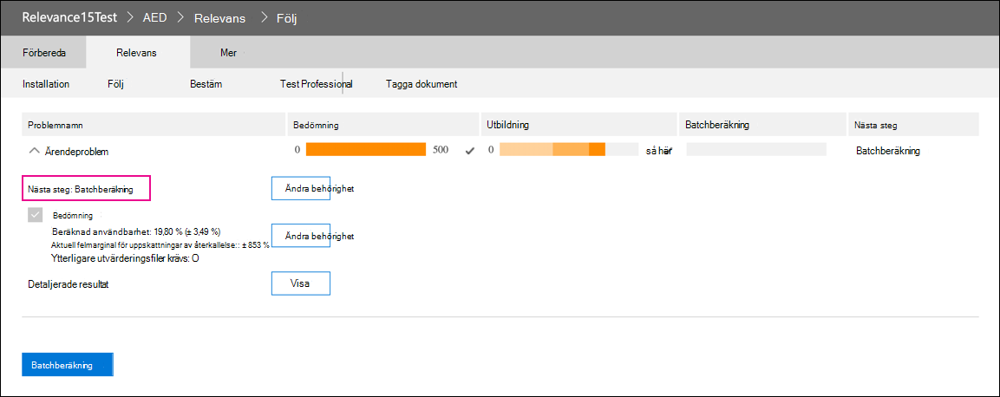

# Relevansmodulen i Advanced eDiscoveryRetirement of the Relevance module in Advanced eDiscovery

Den 10 mars 2021 drar vi tillbaka relevansmodulen i Advanced eDiscovery.On March 10, 2021, we are retiring the Relevance module in Advanced eDiscovery. Det innebär att organisationer inte längre har tillgång till relevansmodulen (genom att gå till Hantera granskningsuppsättning relevans i ett Advanced eDiscovery fall) eller kan komma åt befintliga  >   relevansmodeller.This retirement means that organizations will no longer have access to the Relevance module (by going to **Manage review set** > **Relevance** in an Advanced eDiscovery case) or be able to access any existing Relevance models. Den aktuella relevansmodulen som dras tillbaka ersätts med en ny prediktiv kodningslösning i Q2 CY 2021.The current Relevance module that is being retired will be replaced with a new predictive coding solution in Q2 CY 2021. Med de nya funktionerna kan organisationer skapa egna prediktiv kodningsmodeller i ett enklare och mer intuitivt arbetsflöde.This new functionality will let organizations build their own predictive coding models in an easier and more intuitive workflow.

För att förbereda för den här kommande ingången rekommenderar vi att organisationer som använder relevansmodulen exporterar sina modellers utdata innan utgångsdatumet genom att köra en batchberäkning för alla befintliga modeller.To prepare for this upcoming retirement, we recommend that organizations who use the Relevance module export their model’s output before the retirement date by running a Batch calculation for all existing models. Alla relevansresultat från din modell lagras permanent i motsvarande granskningsuppsättning och är tillgängliga när dokument exporteras.All Relevance scores from your model will be permanently stored in the corresponding review set and accessible when documents are exported. Relevansresultat sparas också som metadata i inläsningsfilen.Relevance scores are also retained as metadata in the load file. Du kan också fortfarande filtrera innehåll i granskningsuppsättningen baserat på relevansresultat och få åtkomst till alla metadata som skapas av dina relevansmodeller.Also, you will still be able to filter content in the review set based on relevance score and have access to all metadata produced by your Relevance models.

## Slutföra oavslutade modellerComplete unfinished models

För alla oavslutade relevansmodeller bör du utföra en utvärdering, utbildning och batchberäkning så att du kan använda modellen på dokumenten i en granskningsuppsättning.For any unfinished Relevance models, please complete assessment, training, and Batch calculation so that you can apply the model to the documents in a review set. När du slutför batchberäkningen behålls informationen efter att relevansmodulen har avslutats.Completing the Batch calculation will preserve the information after the retirement date of the Relevance module.

Här är stegen för att slutföra alla oavslutade modeller:Here are the steps to complete any unfinished models:

1. Utbilda modellen tills den har omts och är redo för batchberäkning.Train your model until it is stabilized and ready for Batch calculation. Se [Tagga och relevansutbildning.](tagging-and-relevance-training-in-advanced-ediscovery.md)See [Tagging and Relevance training](tagging-and-relevance-training-in-advanced-ediscovery.md).

   På följande skärmbild visas en modul som är redo för en batchberäkning.The following screenshot shows a module that is ready for a Batch calculation. Lägg märke till att utvärdering och utbildning är klar och att nästa steg är att köra Batchberäkning.Notice that the Assessment and Training is complete, and the next step is to run Batch calculation.

   

2. Kör batchberäkningen.Run the Batch calculation. Mer information [finns i Utföra batchberäkningar.](track-relevance-analysis-in-advanced-ediscovery.md#performing-batch-calculation)See [Performing Batch calculation](track-relevance-analysis-in-advanced-ediscovery.md#performing-batch-calculation).

3. Kontrollera att batchberäkningen har lyckats.Verify that Batch calculation was successful. Läs [Batchberäkningsresultat](track-relevance-analysis-in-advanced-ediscovery.md#batch-calculation-results).See [Batch calculation results](track-relevance-analysis-in-advanced-ediscovery.md#batch-calculation-results).

Om du behöver hjälp med att slutföra oavslutade relevansmodeller kontaktar du Microsoft Support.For help with completing unfinished Relevance models, contact Microsoft Support.
