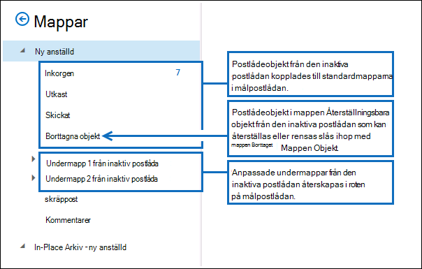
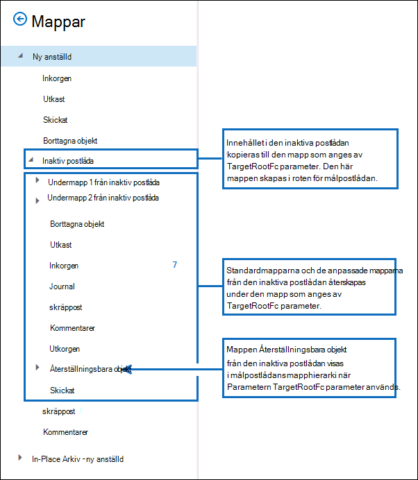

# <a name="restore-an-inactive-mailbox"></a><span data-ttu-id="127a5-103">Återställa en inaktiv postlåda</span><span class="sxs-lookup"><span data-stu-id="127a5-103">Restore an inactive mailbox</span></span>

<span data-ttu-id="127a5-104">En inaktiv postlåda (en typ av mjuk borttagna postlådor) används för att behålla en tidigare anställds e-post när han eller hon lämnar organisationen.</span><span class="sxs-lookup"><span data-stu-id="127a5-104">An inactive mailbox (which is a type of soft-deleted mailbox) is used to retain a former employee's email after he or she leaves your organization.</span></span> <span data-ttu-id="127a5-105">Om en annan anställd tar på sig jobbansvaret för den avsvlade medarbetaren eller om den anställde återgår till din organisation finns det två sätt som du kan göra innehållet i den inaktiva postlådan tillgängligt för en användare:</span><span class="sxs-lookup"><span data-stu-id="127a5-105">If another employee takes on the job responsibilities of the departed employee or if that employee returns to your organization, there are two ways that you can make the contents of the inactive mailbox available to a user:</span></span>

- <span data-ttu-id="127a5-106">**Återställa en inaktiv postlåda** Om en annan anställd tar på sig jobbansvaret för den avsade medarbetaren, eller om en annan användare behöver åtkomst till innehållet i den inaktiva postlådan, kan du återställa (eller sammanfoga) innehållet i den inaktiva postlådan till en befintlig postlåda.</span><span class="sxs-lookup"><span data-stu-id="127a5-106">**Restore an inactive mailbox** If another employee takes on the job responsibilities of the departed employee, or if another user needs access to the contents of the inactive mailbox, you can restore (or merge) the contents of the inactive mailbox to an existing mailbox.</span></span> <span data-ttu-id="127a5-107">Du kan också återställa arkivet från en inaktiv postlåda.</span><span class="sxs-lookup"><span data-stu-id="127a5-107">You can also restore the archive from an inactive mailbox.</span></span> <span data-ttu-id="127a5-108">När den har återställts sparas den inaktiva postlådan, som behålls som en inaktiv postlåda.</span><span class="sxs-lookup"><span data-stu-id="127a5-108">After it's restored, the inactive mailbox is preserved and is retained as an inactive mailbox.</span></span> <span data-ttu-id="127a5-109">I det här avsnittet beskrivs hur du återställer en inaktiv postlåda.</span><span class="sxs-lookup"><span data-stu-id="127a5-109">This topic describes the procedures for restoring an inactive mailbox.</span></span>

- <span data-ttu-id="127a5-110">**Återställa en inaktiv postlåda** Om den avgående medarbetaren återgår till organisationen, eller om en ny anställd anställs för att ta på sig arbetsansvaret för den avs avlidna medarbetaren, kan du återställa innehållet i den inaktiva postlådan.</span><span class="sxs-lookup"><span data-stu-id="127a5-110">**Recover an inactive mailbox** If the departed employee returns to your organization, or if a new employee is hired to take on the job responsibilities of the departed employee, you can recover the contents of the inactive mailbox.</span></span> <span data-ttu-id="127a5-111">Med den här metoden konverteras den inaktiva postlådan till en ny postlåda som innehåller innehållet från den inaktiva postlådan.</span><span class="sxs-lookup"><span data-stu-id="127a5-111">This method converts the inactive mailbox to a new mailbox that contains the contents of the inactive mailbox.</span></span> <span data-ttu-id="127a5-112">När den har återställts finns den inaktiva postlådan inte längre.</span><span class="sxs-lookup"><span data-stu-id="127a5-112">After it's recovered, the inactive mailbox no longer exists.</span></span> <span data-ttu-id="127a5-113">Stegvisa instruktioner finns i Återställa en [inaktiv postlåda i Office 365.](recover-an-inactive-mailbox.md)</span><span class="sxs-lookup"><span data-stu-id="127a5-113">For the step-by-step procedures, see [Recover an inactive mailbox in Office 365](recover-an-inactive-mailbox.md).</span></span>

<span data-ttu-id="127a5-114">Mer information [finns i](#more-information) avsnittet Mer information i den här artikeln om skillnaderna mellan att återställa och återställa en inaktiv postlåda.</span><span class="sxs-lookup"><span data-stu-id="127a5-114">See the [More information](#more-information) section in this article for more details about the differences between restoring and recovering an inactive mailbox.</span></span>

> [!NOTE]
> <span data-ttu-id="127a5-115">Du kan inte återställa en inaktiv postlåda som konfigurerats med ett automatiskt expanderande arkiv.</span><span class="sxs-lookup"><span data-stu-id="127a5-115">You can't recover or restore an inactive mailbox that's configured with an auto-expanding archive.</span></span> <span data-ttu-id="127a5-116">Om du behöver återställa data från en inaktiv postlåda med ett automatiskt expanderande arkiv kan du använda innehållssökning för att exportera data från postlådan och sedan importera till en annan postlåda.</span><span class="sxs-lookup"><span data-stu-id="127a5-116">If you need to recover data from an inactive mailbox with an auto-expanding archive, use content search to export the data from the mailbox and then import to another mailbox.</span></span> <span data-ttu-id="127a5-117">Instruktioner finns i följande avsnitt:</span><span class="sxs-lookup"><span data-stu-id="127a5-117">For instructions, see following topics:</span></span>
>
> - [<span data-ttu-id="127a5-118">Innehållssökning</span><span class="sxs-lookup"><span data-stu-id="127a5-118">Content search</span></span>](content-search.md)
> - [<span data-ttu-id="127a5-119">Exportera sökresultat för innehåll</span><span class="sxs-lookup"><span data-stu-id="127a5-119">Export content search results</span></span>](export-search-results.md)

## <a name="requirements-to-restore-an-inactive-mailbox"></a><span data-ttu-id="127a5-120">Krav för att återställa en inaktiv postlåda</span><span class="sxs-lookup"><span data-stu-id="127a5-120">Requirements to restore an inactive mailbox</span></span>

- <span data-ttu-id="127a5-121">Du måste använda Exchange Online PowerShell för att återställa en inaktiv postlåda.</span><span class="sxs-lookup"><span data-stu-id="127a5-121">You have to use Exchange Online PowerShell to restore an inactive mailbox.</span></span> <span data-ttu-id="127a5-122">Du kan inte använda Exchange (EAC).</span><span class="sxs-lookup"><span data-stu-id="127a5-122">You can't use the Exchange admin center (EAC).</span></span> <span data-ttu-id="127a5-123">Stegvisa anvisningar finns i [Ansluta till Exchange Online PowerShell](/powershell/exchange/connect-to-exchange-online-powershell).</span><span class="sxs-lookup"><span data-stu-id="127a5-123">For step-by-step instructions, see [Connect to Exchange Online PowerShell](/powershell/exchange/connect-to-exchange-online-powershell).</span></span>

- <span data-ttu-id="127a5-124">Kör följande kommando i Exchange Online PowerShell för att få identitetsinformation för inaktiva postlådor i organisationen.</span><span class="sxs-lookup"><span data-stu-id="127a5-124">Run the following command in Exchange Online PowerShell to get identity information for the inactive mailboxes in your organization.</span></span>

  ```powershell
  Get-Mailbox -InactiveMailboxOnly | Format-List Name,DistinguishedName,ExchangeGuid,PrimarySmtpAddress
  ```

  <span data-ttu-id="127a5-125">Använd informationen som returneras av det här kommandot för att återställa en specifik inaktiv postlåda.</span><span class="sxs-lookup"><span data-stu-id="127a5-125">Use the information returned by this command to restore a specific inactive mailbox.</span></span>

- <span data-ttu-id="127a5-126">Mer information om inaktiva postlådor finns i [Inaktiva postlådor i Office 365](inactive-mailboxes-in-office-365.md).</span><span class="sxs-lookup"><span data-stu-id="127a5-126">For more information about inactive mailboxes, see [Inactive mailboxes in Office 365](inactive-mailboxes-in-office-365.md).</span></span>

## <a name="restore-inactive-mailboxes"></a><span data-ttu-id="127a5-127">Återställa inaktiva postlådor</span><span class="sxs-lookup"><span data-stu-id="127a5-127">Restore inactive mailboxes</span></span>

<span data-ttu-id="127a5-128">Använd **cmdleten New-MailboxRestoreRequest** med parametrarna  _SourceMailbox_ och  _TargetMailbox_ till att återställa innehållet i en inaktiv postlåda till en befintlig postlåda.</span><span class="sxs-lookup"><span data-stu-id="127a5-128">Use the **New-MailboxRestoreRequest** cmdlet with the  _SourceMailbox_ and  _TargetMailbox_ parameters to restore the contents of an inactive mailbox to an existing mailbox.</span></span> <span data-ttu-id="127a5-129">Mer information om hur du använder denna cmdlet finns [i New-MailboxRestoreRequest](/powershell/module/exchange/new-mailboxrestorerequest).</span><span class="sxs-lookup"><span data-stu-id="127a5-129">For more information about using this cmdlet, see [New-MailboxRestoreRequest](/powershell/module/exchange/new-mailboxrestorerequest).</span></span>

1. <span data-ttu-id="127a5-130">Skapa en variabel som innehåller egenskaperna för den inaktiva postlådan.</span><span class="sxs-lookup"><span data-stu-id="127a5-130">Create a variable that contains the properties of the inactive mailbox.</span></span>

   ```powershell
   $InactiveMailbox = Get-Mailbox -InactiveMailboxOnly -Identity <identity of inactive mailbox>
   ```

   > [!IMPORTANT]
   > <span data-ttu-id="127a5-131">I det föregående kommandot använder du värdet för egenskapen **DistinguishedName eller** **ExchangeGUID** för att identifiera den inaktiva postlådan.</span><span class="sxs-lookup"><span data-stu-id="127a5-131">In the previous command, use the value of the **DistinguishedName** or **ExchangeGUID** property to identify the inactive mailbox.</span></span> <span data-ttu-id="127a5-132">De här egenskaperna är unika för varje postlåda i organisationen, men det är möjligt att en aktiv och en inaktiv postlåda kan ha samma primära SMTP-adress.</span><span class="sxs-lookup"><span data-stu-id="127a5-132">These properties are unique for each mailbox in your organization, whereas it's possible that an active and an inactive mailbox might have the same primary SMTP address.</span></span>

2. <span data-ttu-id="127a5-133">Återställa innehållet i den inaktiva postlådan till en befintlig postlåda.</span><span class="sxs-lookup"><span data-stu-id="127a5-133">Restore the contents of the inactive mailbox to an existing mailbox.</span></span> <span data-ttu-id="127a5-134">Innehållet i den inaktiva postlådan (källpostlådan) slås ihop till motsvarande mappar i den befintliga postlådan (målpostlådan).</span><span class="sxs-lookup"><span data-stu-id="127a5-134">The contents of the inactive mailbox (source mailbox) will be merged into the corresponding folders in the existing mailbox (target mailbox).</span></span>

   ```powershell
   New-MailboxRestoreRequest -SourceMailbox $InactiveMailbox.DistinguishedName -TargetMailbox newemployee@contoso.com -AllowLegacyDNMismatch
   ```

   <span data-ttu-id="127a5-135">Alternativt kan du ange en mapp på översta nivån i målpostlådan där innehållet ska återställas från den inaktiva postlådan.</span><span class="sxs-lookup"><span data-stu-id="127a5-135">Alternatively, you can specify a top-level folder in the target mailbox in which to restore the contents from the inactive mailbox.</span></span> <span data-ttu-id="127a5-136">Om den angivna målmappen eller målmappstrukturen inte redan finns i målpostlådan skapas den under återställningsprocessen.</span><span class="sxs-lookup"><span data-stu-id="127a5-136">If the specified target folder or target folder structure doesn't already exist in the target mailbox, it is created during the restore process.</span></span>

   <span data-ttu-id="127a5-137">I det här exemplet kopieras postlådeobjekt och undermappar från en inaktiv postlåda till en mapp med namnet "Inaktiv postlåda" i målpostlådans mappstruktur på den översta nivån.</span><span class="sxs-lookup"><span data-stu-id="127a5-137">This example copies mailbox items and subfolders from an inactive mailbox to a folder named "Inactive Mailbox" in the top-level folder structure of the target mailbox.</span></span>

   ```powershell
   New-MailboxRestoreRequest -SourceMailbox $InactiveMailbox.DistinguishedName -TargetMailbox newemployee@contoso.com -TargetRootFolder "Inactive Mailbox" -AllowLegacyDNMismatch
   ```

## <a name="restore-the-archive-from-an-inactive-mailbox"></a><span data-ttu-id="127a5-138">Återställa arkivet från en inaktiv postlåda</span><span class="sxs-lookup"><span data-stu-id="127a5-138">Restore the archive from an inactive mailbox</span></span>

<span data-ttu-id="127a5-139">Om en inaktiv postlåda har en arkivpostlåda kan du återställa den till en befintlig postlådas arkivpostlåda.</span><span class="sxs-lookup"><span data-stu-id="127a5-139">If an inactive mailbox has an archive mailbox, you can also restore it to the archive mailbox of an existing mailbox.</span></span> <span data-ttu-id="127a5-140">Om du vill återställa arkivet från en inaktiv postlåda måste du lägga till _växlarna SourceIsArchive_ och _TargetIsArchive_ till kommandot som används för att återställa en inaktiv postlåda.</span><span class="sxs-lookup"><span data-stu-id="127a5-140">To restore the archive from an inactive mailbox, you have to add the _SourceIsArchive_ and _TargetIsArchive_ switches to the command used to restore an inactive mailbox.</span></span>

1. <span data-ttu-id="127a5-141">Skapa en variabel som innehåller egenskaperna för den inaktiva postlådan.</span><span class="sxs-lookup"><span data-stu-id="127a5-141">Create a variable that contains the properties of the inactive mailbox.</span></span>

   ```powershell
   $InactiveMailbox = Get-Mailbox -InactiveMailboxOnly -Identity <identity of inactive mailbox>
   ```

   > [!NOTE]
   > <span data-ttu-id="127a5-142">I det föregående kommandot använder du värdet för egenskapen **DistinguishedName eller** **ExchangeGUID** för att identifiera den inaktiva postlådan.</span><span class="sxs-lookup"><span data-stu-id="127a5-142">In the previous command, use the value of the **DistinguishedName** or **ExchangeGUID** property to identify the inactive mailbox.</span></span> <span data-ttu-id="127a5-143">De här egenskaperna är unika för varje postlåda i organisationen, men det är möjligt att en aktiv och en inaktiv postlåda kan ha samma primära SMTP-adress.</span><span class="sxs-lookup"><span data-stu-id="127a5-143">These properties are unique for each mailbox in your organization, whereas it's possible that an active and an inactive mailbox might have the same primary SMTP address.</span></span>

2. <span data-ttu-id="127a5-144">Återställ innehållet i arkivet från den inaktiva postlådan (källarkiv) till arkivet i en befintlig postlåda (målarkiv).</span><span class="sxs-lookup"><span data-stu-id="127a5-144">Restore the contents of the archive from the inactive mailbox (source archive) to the archive of an existing mailbox (target archive).</span></span> <span data-ttu-id="127a5-145">I det här exemplet kopieras innehållet från källarkivet till en mapp med namnet "Inaktivt postlådearkiv" i målpostlådans arkiv.</span><span class="sxs-lookup"><span data-stu-id="127a5-145">In this example, the contents from the source archive are copied to a folder named "Inactive Mailbox Archive" in the archive of the target mailbox.</span></span>

   ```powershell
   New-MailboxRestoreRequest -SourceMailbox $InactiveMailbox.DistinguishedName -SourceIsArchive -TargetMailbox newemployee@contoso.com -TargetIsArchive -TargetRootFolder "Inactive Mailbox Archive" -AllowLegacyDNMismatch
   ```

## <a name="more-information"></a><span data-ttu-id="127a5-146">Mer information</span><span class="sxs-lookup"><span data-stu-id="127a5-146">More information</span></span>

- <span data-ttu-id="127a5-147">**Vad är den största skillnaden mellan att återställa och återställa en inaktiv postlåda?**</span><span class="sxs-lookup"><span data-stu-id="127a5-147">**What's the main difference between recovering and restoring an inactive mailbox?**</span></span> <span data-ttu-id="127a5-148">När du återställer en inaktiv postlåda konverteras den i princip till en ny postlåda, innehållet och mappstrukturen för den inaktiva postlådan behålls och postlådan länkas till ett nytt användarkonto.</span><span class="sxs-lookup"><span data-stu-id="127a5-148">When you recover an inactive mailbox, the mailbox is basically converted to a new mailbox, the contents and folder structure of the inactive mailbox are retained, and the mailbox is linked to a new user account.</span></span> <span data-ttu-id="127a5-149">När den har återställts finns den inaktiva postlådan inte längre och eventuella ändringar av innehållet i den nya postlådan påverkar innehållet som ursprungligen var på plats i den inaktiva postlådan.</span><span class="sxs-lookup"><span data-stu-id="127a5-149">After it's recovered, the inactive mailbox no longer exists, and any changes made to the content in the new mailbox will affect the content that was originally on hold in the inactive mailbox.</span></span> <span data-ttu-id="127a5-150">Och när du återställer en inaktiv postlåda kopieras innehållet bara till en annan postlåda.</span><span class="sxs-lookup"><span data-stu-id="127a5-150">Conversely, when you restore an inactive mailbox, the contents are merely copied to another mailbox.</span></span> <span data-ttu-id="127a5-151">Den inaktiva postlådan bevaras och förblir en inaktiv postlåda.</span><span class="sxs-lookup"><span data-stu-id="127a5-151">The inactive mailbox is preserved and remains an inactive mailbox.</span></span> <span data-ttu-id="127a5-152">Ändringar som görs i innehållet i målpostlådan påverkar inte det ursprungliga innehållet som hålls i den inaktiva postlådan.</span><span class="sxs-lookup"><span data-stu-id="127a5-152">Any changes made to the content in the target mailbox won't affect the original content held in the inactive mailbox.</span></span> <span data-ttu-id="127a5-153">Du kan fortfarande söka i den [](content-search.md)inaktiva postlådan med hjälp av verktyget Innehållssökning, innehållet kan återställas till en annan postlåda eller återställas eller tas bort senare.</span><span class="sxs-lookup"><span data-stu-id="127a5-153">The inactive mailbox can still be searched by using the [Content Search tool](content-search.md), its contents can be restored to another mailbox, or it can be recovered or deleted at a later date.</span></span>

- <span data-ttu-id="127a5-154">**Hur hittar jag inaktiva postlådor?**</span><span class="sxs-lookup"><span data-stu-id="127a5-154">**How do you find inactive mailboxes?**</span></span> <span data-ttu-id="127a5-155">Om du vill visa en lista över inaktiva postlådor i organisationen och visa information som är användbar för att återställa en inaktiv postlåda kan du köra det här kommandot.</span><span class="sxs-lookup"><span data-stu-id="127a5-155">To get a list of the inactive mailboxes in your organization and display information that is useful for restoring an inactive mailbox, you can run this command.</span></span>

  ```powershell
  Get-Mailbox -InactiveMailboxOnly | Format-List Name,PrimarySMTPAddress,DistinguishedName,ExchangeGUID,LegacyExchangeDN,ArchiveStatus
  ```

- <span data-ttu-id="127a5-156">**Använd bevarande av juridiska skäl eller Microsoft 365 bevarandeprincip för att behålla inaktivt innehåll i postlådan.**</span><span class="sxs-lookup"><span data-stu-id="127a5-156">**Use a Litigation Hold or Microsoft 365 retention policy to retain inactive mailbox content.**</span></span> <span data-ttu-id="127a5-157">Om du vill behålla statusen för en inaktiv postlåda när den har [](create-a-litigation-hold.md) återställts kan du placera målpostlådan i Bevarande av juridiska skäl eller tillämpa [en Microsoft 365 bevarandeprincip](retention.md) innan du återställer den inaktiva postlådan.</span><span class="sxs-lookup"><span data-stu-id="127a5-157">If you want to retain the state of an inactive mailbox after it's restored, you can place the target mailbox on [Litigation Hold](create-a-litigation-hold.md) or apply an [Microsoft 365 retention policy](retention.md) before you restore the inactive mailbox.</span></span> <span data-ttu-id="127a5-158">Det här förhindrar permanent borttagning av objekt från den inaktiva postlådan när de återställts till målpostlådan.</span><span class="sxs-lookup"><span data-stu-id="127a5-158">This will prevent the permanent deletion of any items from the inactive mailbox after they're restored to the target mailbox.</span></span>

- <span data-ttu-id="127a5-159">**Aktivera bevarande av målpostlådan innan du återställer en inaktiv postlåda.**</span><span class="sxs-lookup"><span data-stu-id="127a5-159">**Enable retention hold on the target mailbox before you restore an inactive mailbox.**</span></span> <span data-ttu-id="127a5-160">Eftersom objekt i postlådan från en inaktiv postlåda kan vara gamla kan det vara bra att aktivera bevarande av målpostlådan innan du återställer en inaktiv postlåda.</span><span class="sxs-lookup"><span data-stu-id="127a5-160">Because mailbox items from an inactive mailbox could be old, you might consider enabling retention hold on the target mailbox before you restore an inactive mailbox.</span></span> <span data-ttu-id="127a5-161">När du rymmer en postlåda bearbetas inte bevarandeprincipen som tilldelats postlådan förrän bevarandet tas bort eller tills bevarandetiden går ut.</span><span class="sxs-lookup"><span data-stu-id="127a5-161">When you put a mailbox on retention hold, the retention policy that's assigned to it won't be processed until the retention hold is removed or until the retention hold period expires.</span></span> <span data-ttu-id="127a5-162">Det ger ägaren av målpostlådan tid att hantera gamla meddelanden från den inaktiva postlådan.</span><span class="sxs-lookup"><span data-stu-id="127a5-162">This gives the owner of the target mailbox time to manage old messages from the inactive mailbox.</span></span> <span data-ttu-id="127a5-163">Annars kan bevarandeprincipen ta bort gamla objekt (eller flytta objekt till arkivpostlådan, om den är aktiverad) som har upphört att gälla baserat på de bevarandeinställningar som konfigurerats för målpostlådan.</span><span class="sxs-lookup"><span data-stu-id="127a5-163">Otherwise, the retention policy might delete old items (or move items to the archive mailbox, if it's enabled) that have expired based on the retention settings configured for the target mailbox.</span></span> <span data-ttu-id="127a5-164">Mer information finns i Skapa [ett bevarande av en postlåda i Exchange Online](/exchange/security-and-compliance/messaging-records-management/mailbox-retention-hold).</span><span class="sxs-lookup"><span data-stu-id="127a5-164">For more information, see [Place a mailbox on retention hold in Exchange Online](/exchange/security-and-compliance/messaging-records-management/mailbox-retention-hold).</span></span>

- <span data-ttu-id="127a5-165">**Vad gör bytet AllowLegacyDNMismatch?**</span><span class="sxs-lookup"><span data-stu-id="127a5-165">**What does the AllowLegacyDNMismatch switch do?**</span></span> <span data-ttu-id="127a5-166">I de tidigare exemplen för att återställa en inaktiv postlåda används växeln **AllowLegacyDNMismatch** för att tillåta återställning av den inaktiva postlådan till en annan målpostlåda.</span><span class="sxs-lookup"><span data-stu-id="127a5-166">In the previous examples to restore an inactive mailbox, the **AllowLegacyDNMismatch** switch is used to allow restoring the inactive mailbox to a different target mailbox.</span></span> <span data-ttu-id="127a5-167">I ett vanligt återställningsscenario är målet att återställa innehåll där käll- och målpostlådorna är samma postlåda.</span><span class="sxs-lookup"><span data-stu-id="127a5-167">In a typical restore scenario, the goal is to restore content where the source and target mailboxes are the same mailbox.</span></span> <span data-ttu-id="127a5-168">Som standard kontrollerar cmdleten **New-MailboxRequest** att värdet för egenskapen **LegacyExchangeDN** för käll- och målpostlådorna är detsamma.</span><span class="sxs-lookup"><span data-stu-id="127a5-168">So by default, the **New-MailboxRestoreRequest** cmdlet checks to make sure that the value of the **LegacyExchangeDN** property on the source and target mailboxes is the same.</span></span> <span data-ttu-id="127a5-169">Det förhindrar att du av misstag återställer en källpostlåda till fel målpostlåda.</span><span class="sxs-lookup"><span data-stu-id="127a5-169">This helps prevents you from accidentally restoring a source mailbox into the wrong target mailbox.</span></span> <span data-ttu-id="127a5-170">Om du försöker återställa en inaktiv postlåda utan att använda **växeln AllowLegacyDNMismatch** kan det hända att kommandot misslyckas om käll- och målpostlådorna har olika värden för **egenskapen LegacyExchangeDN.**</span><span class="sxs-lookup"><span data-stu-id="127a5-170">If you try to restore an inactive mailbox without using the **AllowLegacyDNMismatch** switch, the command might fail if the source and target mailboxes have different values for the **LegacyExchangeDN** property.</span></span>

- <span data-ttu-id="127a5-171">**Du kan använda andra parametrar med New-MailboxRestoreRequest för att implementera olika återställningsscenarier för inaktiva postlådor.**</span><span class="sxs-lookup"><span data-stu-id="127a5-171">**You can use other parameters with the New-MailboxRestoreRequest cmdlet to implement different restore scenarios for inactive mailboxes.**</span></span> <span data-ttu-id="127a5-172">Du kan till exempel köra det här kommandot för att återställa arkivet från den inaktiva postlådan till målpostlådans primära postlåda.</span><span class="sxs-lookup"><span data-stu-id="127a5-172">For example, you can run this command to restore the archive from the inactive mailbox into the primary mailbox of the target mailbox.</span></span>

  ```powershell
  New-MailboxRestoreRequest -SourceMailbox <inactive mailbox> -SourceIsArchive -TargetMailbox <target mailbox> -TargetRootFolder "Inactive Mailbox Archive" -AllowLegacyDNMismatch
  ```

  <span data-ttu-id="127a5-173">Du kan också återställa den inaktiva primära postlådan till målpostlådans arkiv genom att köra det här kommandot.</span><span class="sxs-lookup"><span data-stu-id="127a5-173">You can also restore the inactive primary mailbox into the archive of the target mailbox by running this command.</span></span>

  ```powershell
  New-MailboxRestoreRequest -SourceMailbox <inactive mailbox> -TargetMailbox <target mailbox> -TargetIsArchive -TargetRootFolder "Inactive Mailbox" -AllowLegacyDNMismatch
  ```

- <span data-ttu-id="127a5-174">**Vad gör parametern TargetRootFolder?**</span><span class="sxs-lookup"><span data-stu-id="127a5-174">**What does the TargetRootFolder parameter do?**</span></span> <span data-ttu-id="127a5-175">Som tidigare förklarats kan du använda parametern **TargetRootFolder** till att ange en mapp högst upp i mappstrukturen (kallas även roten) i målpostlådan där du kan återställa innehållet i den inaktiva postlådan.</span><span class="sxs-lookup"><span data-stu-id="127a5-175">As previously explained, you can use the **TargetRootFolder** parameter to specify a folder in the top of the folder structure (also called the root) in the target mailbox in which to restore the contents of the inactive mailbox.</span></span> <span data-ttu-id="127a5-176">Om du inte använder den här parametern sammanfogas postlådeobjekt från den inaktiva postlådan till motsvarande standardmappar i målpostlådan och anpassade mappar skapas på ny plats i roten på målpostlådan.</span><span class="sxs-lookup"><span data-stu-id="127a5-176">If you don't use this parameter, mailbox items from the inactive mailbox are merged into the corresponding default folders of the target mailbox, and custom folders are re-created in the root of the target mailbox.</span></span> <span data-ttu-id="127a5-177">Följande illustrationer visar de här skillnaderna mellan att inte använda och använda **parametern TargetRootFolder.**</span><span class="sxs-lookup"><span data-stu-id="127a5-177">The following illustrations highlight these differences between not using and using the **TargetRootFolder** parameter.</span></span>

  <span data-ttu-id="127a5-178">**Mapphierarki i målpostlådan när parametern TargetRootFolder inte används**</span><span class="sxs-lookup"><span data-stu-id="127a5-178">**Folder hierarchy in the target mailbox when the TargetRootFolder parameter isn't used**</span></span>

  

  <span data-ttu-id="127a5-180">**Mapphierarki i målpostlådan när parametern TargetRootFolder används**</span><span class="sxs-lookup"><span data-stu-id="127a5-180">**Folder hierarchy in the target mailbox when the TargetRootFolder parameter is used**</span></span>

  